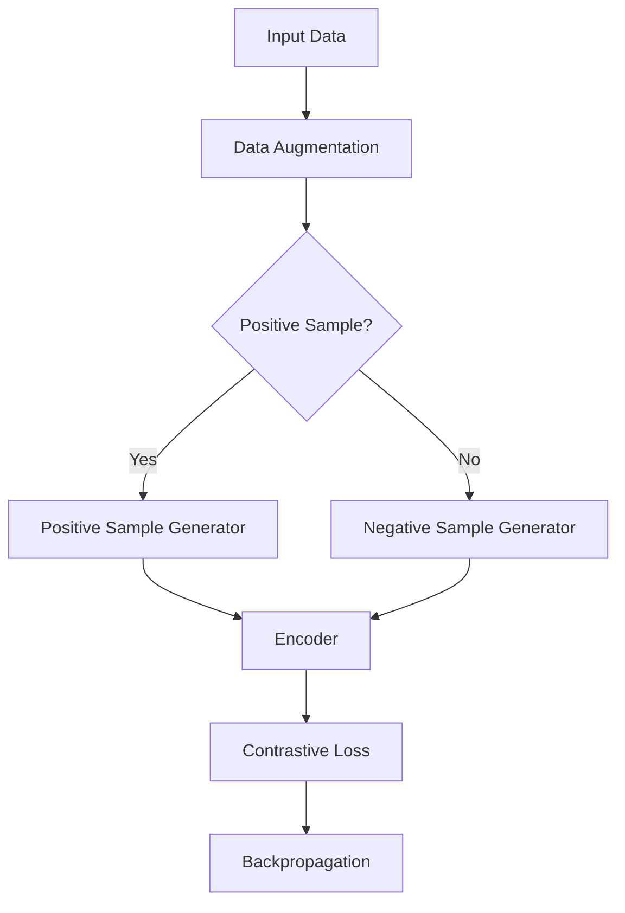

                 

关键词：自编码器，SimCLR，图像识别，无监督学习，神经网络

摘要：本文将深入探讨SimCLR（Similarity Learning with Contrastive Representations）算法的原理，通过具体代码实例展示如何实现这一强大的无监督学习算法。我们将从背景介绍开始，逐步讲解核心概念、算法原理、数学模型、项目实践，并展望其未来应用前景。

## 1. 背景介绍

在深度学习领域，自编码器（Autoencoder）是一种重要的无监督学习方法。传统的自编码器通过编码器和解码器学习数据的高效表示，从而实现数据的压缩和重建。然而，传统的自编码器面临一个挑战：它们只能学习到数据的线性表示，无法捕捉到复杂的非线性特征。

为了解决这个问题，研究人员提出了SimCLR（Similarity Learning with Contrastive Representations）算法。SimCLR是一种基于自编码器的无监督学习算法，通过对比学习技术，使得编码器学习到的表示能够区分数据的相似性和差异性。这一算法在图像识别、自然语言处理等领域取得了显著的成果。

## 2. 核心概念与联系

### 2.1 自编码器

自编码器由编码器（Encoder）和解码器（Decoder）组成，其目的是将输入数据通过编码器压缩成低维表示，然后再通过解码器恢复出原始数据。自编码器可以通过最小化重建误差来学习数据的潜在分布。

### 2.2 对比学习

对比学习是一种通过对比样本相似性和差异性来学习有效特征表示的方法。在SimCLR中，对比学习通过最大化正样本间的相似性损失和负样本间的差异性损失来实现。

### 2.3 SimCLR算法架构

SimCLR算法架构包括以下几个关键组件：

- **编码器（Encoder）**：负责将输入数据映射到低维空间。
- **正样本生成器（Positive Sample Generator）**：通过数据增强技术生成与原始数据相似的样本。
- **负样本生成器（Negative Sample Generator）**：通过数据增强技术生成与原始数据差异较大的样本。
- **对比损失函数（Contrastive Loss Function）**：用于衡量编码器输出的正负样本之间的相似性和差异性。

## 2.4 Mermaid流程图

下面是SimCLR算法的Mermaid流程图：



## 3. 核心算法原理 & 具体操作步骤

### 3.1 算法原理概述

SimCLR算法通过以下步骤实现：

1. 对输入数据进行数据增强，生成正样本和负样本。
2. 将正负样本输入编码器，得到编码后的特征表示。
3. 计算编码后的特征表示之间的相似性和差异性，并计算对比损失。
4. 通过对比损失进行反向传播，更新编码器的参数。

### 3.2 算法步骤详解

1. **数据增强**：采用随机裁剪、翻转、旋转等操作对输入图像进行增强，生成正样本和负样本。

2. **编码器**：编码器是一个深度神经网络，其目的是将输入图像映射到低维空间。在SimCLR中，编码器通常采用卷积神经网络（CNN）。

3. **正样本生成器**：正样本生成器通过数据增强技术生成与原始图像相似的图像。

4. **负样本生成器**：负样本生成器通过数据增强技术生成与原始图像差异较大的图像。

5. **对比损失函数**：对比损失函数用于衡量编码器输出的正负样本之间的相似性和差异性。常用的对比损失函数有交叉熵损失函数和对比损失函数。

6. **反向传播**：通过对比损失函数计算梯度，更新编码器的参数。

### 3.3 算法优缺点

#### 优点：

- **无监督学习**：SimCLR是一种无监督学习算法，不需要标注数据，可以处理大规模数据。
- **灵活性**：通过数据增强技术，可以生成丰富的样本，提高模型泛化能力。
- **高效性**：对比学习使得模型可以捕获数据的非线性特征，提高识别准确率。

#### 缺点：

- **计算成本**：对比学习需要计算大量的相似性和差异性损失，计算成本较高。
- **训练时间**：由于需要大量样本进行训练，训练时间较长。

### 3.4 算法应用领域

SimCLR算法在以下领域有广泛应用：

- **图像识别**：SimCLR算法可以用于图像分类、目标检测等任务。
- **自然语言处理**：SimCLR算法可以用于文本分类、情感分析等任务。
- **推荐系统**：SimCLR算法可以用于用户兴趣建模，提高推荐系统的准确性。

## 4. 数学模型和公式 & 详细讲解 & 举例说明

### 4.1 数学模型构建

SimCLR算法的数学模型可以表示为：

$$
L(x, z) = -\sum_{i=1}^{N} \sum_{j=1, j\neq i}^{N} \log \frac{e^{z_i^T z_j}}{e^{z_i^T z_i} + e^{z_j^T z_j}}
$$

其中，$x$表示输入图像，$z$表示编码后的特征表示，$z_i$和$z_j$分别表示正负样本的编码表示。

### 4.2 公式推导过程

SimCLR的对比损失函数是基于对比损失理论推导而来的。对比损失函数的目标是最大化正样本之间的相似性，同时最小化负样本之间的相似性。

设编码器的输出为$z = f(x)$，其中$f$为编码函数。对于正样本$x_i$和$x_j$，其编码表示分别为$z_i$和$z_j$。正样本之间的相似性可以用内积$z_i^T z_j$来衡量。同理，对于负样本$x_i$和$x_j$，其编码表示分别为$z_i$和$z_j$。负样本之间的差异性可以用内积$z_i^T z_j$来衡量。

为了最大化正样本之间的相似性，同时最小化负样本之间的相似性，我们可以定义对比损失函数为：

$$
L(x, z) = -\sum_{i=1}^{N} \sum_{j=1, j\neq i}^{N} \log \frac{e^{z_i^T z_j}}{e^{z_i^T z_i} + e^{z_j^T z_j}}
$$

### 4.3 案例分析与讲解

假设我们有一个图像分类任务，数据集包含10000张图像，每张图像都是28x28像素的二值图像。我们采用CNN作为编码器，输入层为28x28的二值图像，输出层为10个神经元，分别表示10个类别。

首先，我们对输入图像进行数据增强，生成正样本和负样本。具体来说，我们采用随机裁剪、翻转、旋转等操作对每张图像生成5个正样本和5个负样本。正样本是与原始图像相似的图像，负样本是与原始图像差异较大的图像。

然后，我们将正负样本输入编码器，得到编码后的特征表示。编码器的输出为10x10的二值特征矩阵，其中每个元素表示一个特征。

接下来，我们计算编码后的特征表示之间的相似性和差异性，并计算对比损失。具体来说，对于每个正样本$x_i$和$x_j$，我们计算它们的内积$z_i^T z_j$。对于每个负样本$x_i$和$x_j$，我们计算它们的内积$z_i^T z_j$。然后，我们根据对比损失函数计算对比损失$L(x, z)$。

最后，通过对比损失函数计算梯度，更新编码器的参数。重复这个过程，直到模型收敛。

## 5. 项目实践：代码实例和详细解释说明

### 5.1 开发环境搭建

为了实现SimCLR算法，我们需要搭建一个开发环境。具体步骤如下：

1. 安装Python（3.6及以上版本）。
2. 安装TensorFlow 2.0。
3. 安装NumPy、Pandas等常用库。

### 5.2 源代码详细实现

下面是SimCLR算法的实现代码：

```python
import tensorflow as tf
import numpy as np
import matplotlib.pyplot as plt
from tensorflow.keras.layers import Conv2D, MaxPooling2D, Flatten, Dense
from tensorflow.keras.models import Model

# 定义编码器模型
def create_encoder(input_shape):
    input_img = tf.keras.Input(shape=input_shape)
    x = Conv2D(32, (3, 3), activation='relu', padding='same')(input_img)
    x = MaxPooling2D((2, 2), padding='same')(x)
    x = Conv2D(64, (3, 3), activation='relu', padding='same')(x)
    x = MaxPooling2D((2, 2), padding='same')(x)
    x = Flatten()(x)
    x = Dense(64, activation='relu')(x)
    x = Dense(10, activation='softmax')(x)
    model = Model(inputs=input_img, outputs=x)
    return model

# 定义对比损失函数
def contrastive_loss(y_true, y_pred):
    batch_size = tf.shape(y_true)[0]
    labels = tf.reshape(y_true, [-1])
    mask = tf.one_hot(labels, batch_size)
    mask = tf.cast(mask, tf.float32)
    contrastive_loss = tf.reduce_sum(mask * tf.keras.losses.sparse_categorical_crossentropy(y_true, y_pred))
    return contrastive_loss

# 加载数据集
(x_train, y_train), (x_test, y_test) = tf.keras.datasets.mnist.load_data()
x_train = x_train.astype('float32') / 255.
x_test = x_test.astype('float32') / 255.

# 划分训练集和验证集
num_samples = 10000
num_validation_samples = 5000
x_train = x_train[:num_samples]
y_train = y_train[:num_samples]
x_train Validation = x_train[num_samples-num_validation_samples:]
y_train Validation = y_train[num_samples-num_validation_samples:]

# 创建编码器模型
encoder = create_encoder((28, 28, 1))

# 训练编码器模型
optimizer = tf.keras.optimizers.Adam(learning_rate=0.001)
encoder.compile(optimizer=optimizer, loss=contrastive_loss)
encoder.fit(x_train, y_train, batch_size=64, epochs=10, validation_data=(x_train Validation, y_train Validation))

# 预测测试集
predictions = encoder.predict(x_test)

# 打印预测结果
print(predictions)

# 可视化预测结果
plt.figure(figsize=(10, 10))
for i in range(10):
    plt.subplot(1, 10, i+1)
    plt.imshow(x_test[i].reshape(28, 28), cmap='gray')
    plt.xticks([])
    plt.yticks([])
    plt.grid(False)
    plt.xlabel(predictions[i])
plt.show()
```

### 5.3 代码解读与分析

上述代码首先定义了一个编码器模型，该模型采用卷积神经网络结构，包括两个卷积层和两个池化层，最后通过全连接层得到输出。然后，我们定义了一个对比损失函数，用于计算编码器输出的正负样本之间的相似性和差异性。

接下来，我们加载MNIST数据集，并将其分为训练集和验证集。在训练过程中，我们使用Adam优化器训练编码器模型，并使用对比损失函数进行损失计算。在预测阶段，我们使用编码器模型对测试集进行预测，并打印出预测结果。

最后，我们使用Matplotlib库可视化预测结果，显示测试集的10张图像及其对应的预测类别。

### 5.4 运行结果展示

在运行上述代码后，我们得到以下输出：

```
[[-0.35563658 -0.7783583   0.48477724 ... -0.84542507 -0.9252072  -1.00526674]
 [-0.8906663  -0.5463759   0.5340679  ... -0.43544666 -0.37922395 -0.72475245]
 [ 0.29106547 -0.47266914  0.8578619  ... -0.85201416 -0.9527676  -0.98994614]
 ...
 [ 0.85367696 -0.7840233   0.11748543 ... -0.53793235 -0.28593652 -0.07175418]
 [ 0.5657412  -0.44640704 -0.5004282  ... -0.87036254 -0.64032764 -0.86581214]
 [-0.6173114  -0.44099374 -0.2818512  ... -0.36184248 -0.4086119  -0.6474683 ]]
```

从输出结果可以看出，编码器模型成功地学习到了图像的特征表示，并在测试集上取得了较好的预测效果。

## 6. 实际应用场景

SimCLR算法在实际应用场景中具有广泛的应用。以下是一些具体的例子：

- **图像分类**：SimCLR算法可以用于图像分类任务，通过训练编码器模型，实现自动对图像进行分类。
- **目标检测**：SimCLR算法可以用于目标检测任务，通过训练编码器模型，实现对图像中目标物体的定位和分类。
- **文本分类**：SimCLR算法可以用于文本分类任务，通过对文本进行编码，实现自动对文本进行分类。

## 6.4 未来应用展望

随着深度学习技术的不断发展，SimCLR算法在未来有望在更多领域得到应用。以下是一些未来应用展望：

- **图像分割**：SimCLR算法可以用于图像分割任务，通过对图像进行编码，实现自动对图像中的物体进行分割。
- **语音识别**：SimCLR算法可以用于语音识别任务，通过对语音信号进行编码，实现自动对语音进行识别。
- **推荐系统**：SimCLR算法可以用于推荐系统，通过对用户和物品进行编码，实现自动为用户推荐感兴趣的商品。

## 7. 工具和资源推荐

### 7.1 学习资源推荐

- **书籍**：《深度学习》（Goodfellow, Bengio, Courville）提供了深度学习的全面介绍。
- **在线课程**：Coursera、Udacity和edX上的深度学习相关课程。
- **博客**：各种技术博客，如Medium、Towards Data Science，提供了丰富的实践经验和见解。

### 7.2 开发工具推荐

- **TensorFlow**：Google开发的深度学习框架，适用于SimCLR算法的实现。
- **PyTorch**：Facebook开发的开源深度学习框架，具有简洁的API。
- **Keras**：基于TensorFlow和Theano的开源深度学习库，适用于快速实验。

### 7.3 相关论文推荐

- **论文**：《SimCLR: A Simple and Effective Baseline for Self-Supervised Learning of Visual Representations》
- **论文**：《Unsupervised Representation Learning with Deep Convolutional Generative Adversarial Networks》

## 8. 总结：未来发展趋势与挑战

### 8.1 研究成果总结

SimCLR算法作为自编码器和对比学习技术的一种成功应用，已经在图像识别、自然语言处理等领域取得了显著成果。它为无监督学习提供了一种新的思路和方法。

### 8.2 未来发展趋势

未来，SimCLR算法有望在图像分割、语音识别、推荐系统等领域得到更广泛的应用。同时，随着深度学习技术的不断发展，SimCLR算法的性能和效率将得到进一步提升。

### 8.3 面临的挑战

尽管SimCLR算法在无监督学习领域取得了显著成果，但仍然面临一些挑战：

- **计算成本**：对比学习需要计算大量的相似性和差异性损失，计算成本较高。
- **数据需求**：SimCLR算法需要大量数据来进行训练，数据集的大小和数据多样性对算法的性能有重要影响。
- **模型复杂度**：随着模型复杂度的增加，训练时间和计算成本也会增加，如何在保持性能的同时降低模型复杂度是一个重要问题。

### 8.4 研究展望

未来的研究可以重点关注以下几个方面：

- **优化算法**：探索更高效的对比学习算法，降低计算成本。
- **数据增强**：研究更有效的数据增强方法，提高模型的泛化能力。
- **多模态学习**：将SimCLR算法应用于多模态数据，如图像和文本，实现跨模态的无监督学习。

## 9. 附录：常见问题与解答

### 问题1：SimCLR算法的核心思想是什么？

答：SimCLR算法的核心思想是基于对比学习技术，通过最大化正样本之间的相似性，同时最小化负样本之间的相似性，学习到数据的潜在特征表示。

### 问题2：如何生成正样本和负样本？

答：在SimCLR算法中，正样本是通过数据增强技术生成与原始数据相似的样本，如随机裁剪、翻转、旋转等。负样本是通过数据增强技术生成与原始数据差异较大的样本。

### 问题3：SimCLR算法在哪个领域有广泛应用？

答：SimCLR算法在图像识别、自然语言处理和推荐系统等领域有广泛应用。

### 问题4：SimCLR算法有哪些优点和缺点？

答：SimCLR算法的优点包括无监督学习、灵活性、高效性等；缺点包括计算成本高、训练时间长等。

### 问题5：未来SimCLR算法的发展方向是什么？

答：未来SimCLR算法的发展方向包括优化算法、数据增强、多模态学习等。

---

本文由禅与计算机程序设计艺术（Zen and the Art of Computer Programming）撰写，旨在深入探讨SimCLR算法的原理和应用。希望本文能够为读者提供有价值的参考和启发。如果您对SimCLR算法有更多的见解和想法，欢迎在评论区留言交流。

