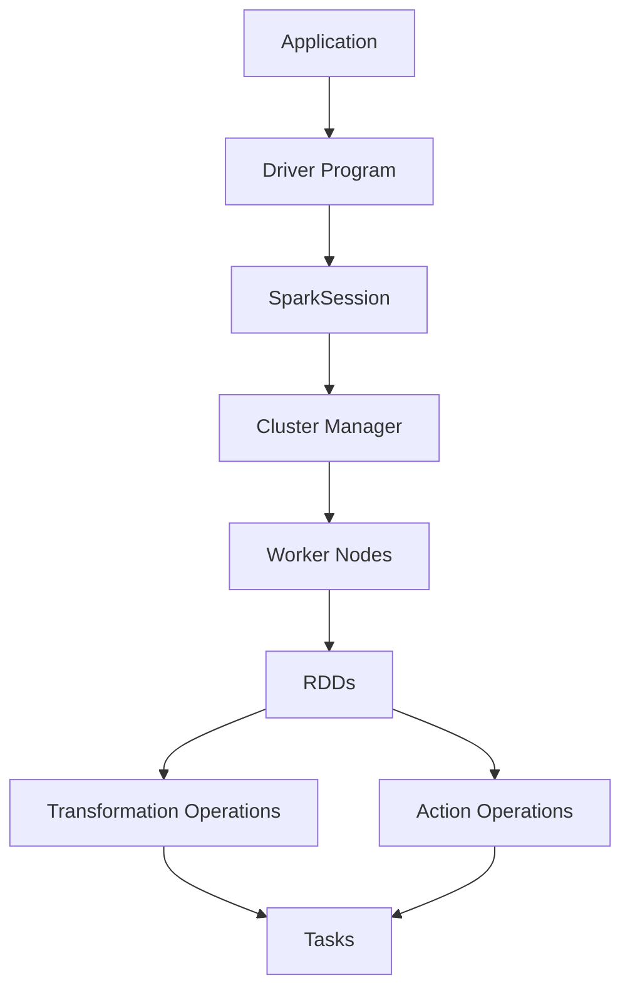

                 

关键词：Spark，Task，原理，代码实例，分布式计算，大数据处理，内存计算

> 摘要：本文将深入探讨Spark Task的工作原理，并辅以具体的代码实例，帮助读者理解Spark在分布式计算和大数据处理方面的强大能力。通过本文的讲解，读者将对Spark Task的执行过程、内存管理和资源调度有更深刻的认识。

## 1. 背景介绍

分布式计算是大数据处理中的重要技术之一。随着数据量的急剧增长，单机计算的能力已经无法满足日益增长的数据处理需求。分布式计算通过将任务分解并分布到多台计算机上进行处理，从而大大提高了数据处理能力和效率。Apache Spark作为一个高性能的分布式计算框架，被广泛应用于大数据处理领域。

Spark的核心概念包括RDD（Resilient Distributed Datasets）和DataFrame/Dataset。RDD是一个分布式的弹性数据集，可以被视为一个不可变的分布式数据序列。DataFrame和Dataset是Spark的新数据抽象，基于RDD，提供了更强的类型安全和结构化查询能力。

在Spark中，Task是执行具体计算操作的基本单位。Task通常是对RDD的转换或行动操作，它们可以并行地分布到多台计算机上进行处理。理解Task的工作原理对于深入掌握Spark的分布式计算机制至关重要。

## 2. 核心概念与联系

以下是Spark Task的核心概念及其相互关系的Mermaid流程图：



### 2.1 Application

Application是Spark程序的最高层，它包含了一系列的RDD操作和行动操作。用户编写的Spark程序在提交时会形成一个Application。

### 2.2 Driver Program

Driver Program是运行在集群中的一个独立进程中，负责将Application转换为作业（Job），并将作业分解为多个Task。它还负责与Cluster Manager进行通信，调度资源。

### 2.3 SparkSession

SparkSession是连接用户程序和Spark集群的入口点。它提供了一个丰富的API，用于创建和操作RDD、DataFrame和Dataset。

### 2.4 Cluster Manager

Cluster Manager负责管理集群资源。常用的Cluster Manager包括Hadoop YARN和Apache Mesos。

### 2.5 Worker Nodes

Worker Nodes是集群中的计算节点，它们负责执行Task，并将处理结果返回给Driver Program。

### 2.6 RDDs

RDD是Spark的核心抽象，代表了分布式的不可变数据集。用户可以通过创建RDD、对RDD进行转换操作（如map、filter等）和行动操作（如count、saveAsTextFile等）来处理数据。

### 2.7 Transformation Operations

Transformation操作创建一个新的RDD，它是基于原有的RDD的一系列转换操作。这些操作包括map、filter、reduceByKey等。

### 2.8 Action Operations

Action操作触发计算过程的最终结果返回，如count、collect、reduce等。这些操作会触发作业（Job）的执行，从而生成Task。

### 2.9 Tasks

Task是分布式计算的基本执行单元。每个Task处理数据的一个子集，并生成结果。Task可以并行地分布到多个Worker Node上进行处理。

## 3. 核心算法原理 & 具体操作步骤

### 3.1 算法原理概述

Spark的Task执行过程主要包括以下几个步骤：

1. **作业提交（Job Submission）**：用户编写的Spark程序被提交给Cluster Manager，形成一个Job。
2. **作业调度（Job Scheduling）**：Cluster Manager根据集群资源状况，调度资源，为Job生成Task。
3. **Task分发（Task Distribution）**：Driver Program将生成的Task分发到各个Worker Node上。
4. **Task执行（Task Execution）**：Worker Node上的Executor进程执行Task，处理数据。
5. **结果收集（Result Collection）**：执行完毕的Task将结果返回给Driver Program。

### 3.2 算法步骤详解

1. **作业提交（Job Submission）**：

```scala
val spark = SparkSession.builder.appName("SparkTaskExample").getOrCreate()
val data = spark.sparkContext.textFile("hdfs://path/to/data.txt")
```

2. **作业调度（Job Scheduling）**：

```scala
val counts = data.flatMap(line => line.split(" ")).map(word => (word, 1)).reduceByKey(_ + _)
```

3. **Task分发（Task Distribution）**：

Driver Program将生成的Task发送到各个Worker Node。

4. **Task执行（Task Execution）**：

每个Worker Node上的Executor进程读取分配给自己的Task，处理数据。

```scala
val results = counts.collect()
```

5. **结果收集（Result Collection）**：

执行完毕的Task将结果返回给Driver Program。

### 3.3 算法优缺点

**优点**：
- **高性能**：Spark提供了内存计算的能力，大大提高了数据处理的速度。
- **易用性**：Spark提供了丰富的API，支持多种编程语言，如Scala、Java和Python。
- **弹性**：Spark具有弹性容错机制，可以在节点故障时自动恢复。

**缺点**：
- **资源依赖性**：Spark依赖于集群资源，如Hadoop YARN或Apache Mesos。
- **数据倾斜**：在分布式计算中，数据倾斜可能导致部分Task执行时间远长于其他Task。

### 3.4 算法应用领域

Spark在分布式计算和大数据处理方面具有广泛的应用领域，如：

- **日志分析**：处理大量日志数据，实现实时监控和预警。
- **数据挖掘**：对大量数据进行分析，发现隐藏的模式和趋势。
- **机器学习**：利用Spark的内存计算能力，加速机器学习算法的执行。

## 4. 数学模型和公式 & 详细讲解 & 举例说明

### 4.1 数学模型构建

在Spark中，数据处理的基本单位是RDD。RDD可以看作是一个分布式的不可变数组。我们可以用数学模型来描述RDD的转换和操作。

假设有一个RDD \(R\)，它包含 \(n\) 个元素。对RDD进行map操作，我们可以得到一个新的RDD \(S\)，它包含 \(m\) 个元素，其中 \(m \leq n\)。

### 4.2 公式推导过程

设 \(R\) 的每个元素为 \(r_i\)，对 \(R\) 进行map操作，得到的新元素为 \(s_j = f(r_i)\)，其中 \(f\) 是一个映射函数。

根据数学定义，我们可以推导出：

\[ |S| = \sum_{i=1}^{n} |f(r_i)| \]

其中，\(|S|\) 表示新RDD \(S\) 的元素个数，\(|f(r_i)|\) 表示映射函数 \(f\) 对 \(r_i\) 的映射结果。

### 4.3 案例分析与讲解

假设有一个RDD \(R\)，它包含10个元素，分别为 \([1, 2, 3, 4, 5, 6, 7, 8, 9, 10]\)。我们对 \(R\) 进行map操作，映射函数 \(f\) 为 \(x \rightarrow x^2\)。

根据上面的推导过程，我们可以得到：

\[ |S| = \sum_{i=1}^{10} |f(r_i)| \]

计算结果为：

\[ |S| = |f(1)| + |f(2)| + |f(3)| + |f(4)| + |f(5)| + |f(6)| + |f(7)| + |f(8)| + |f(9)| + |f(10)| \]

\[ |S| = 1^2 + 2^2 + 3^2 + 4^2 + 5^2 + 6^2 + 7^2 + 8^2 + 9^2 + 10^2 \]

\[ |S| = 1 + 4 + 9 + 16 + 25 + 36 + 49 + 64 + 81 + 100 \]

\[ |S| = 385 \]

因此，新RDD \(S\) 的元素个数为385。

## 5. 项目实践：代码实例和详细解释说明

### 5.1 开发环境搭建

在开始之前，请确保已经安装了Spark和Hadoop。可以使用以下命令进行环境搭建：

```bash
# 安装Spark
brew install spark

# 安装Hadoop
brew install hadoop
```

### 5.2 源代码详细实现

以下是一个简单的Spark程序，用于计算一个文本文件中的单词频次。

```scala
val spark = SparkSession.builder.appName("WordCount").getOrCreate()
val data = spark.sparkContext.textFile("hdfs://path/to/data.txt")

val words = data.flatMap(line => line.split(" "))
val counts = words.map(word => (word, 1)).reduceByKey(_ + _)

counts.saveAsTextFile("hdfs://path/to/output")
```

### 5.3 代码解读与分析

1. **创建SparkSession**：

```scala
val spark = SparkSession.builder.appName("WordCount").getOrCreate()
```

这一行代码创建了SparkSession，它是连接用户程序和Spark集群的入口点。`appName` 参数用于设置程序的名称。

2. **读取文本文件**：

```scala
val data = spark.sparkContext.textFile("hdfs://path/to/data.txt")
```

这一行代码使用SparkContext读取HDFS上的文本文件，返回一个RDD。

3. **单词拆分**：

```scala
val words = data.flatMap(line => line.split(" "))
```

`flatMap` 是一个Transformation操作，它将原始的文本数据拆分成单词，生成一个新的RDD。

4. **单词计数**：

```scala
val counts = words.map(word => (word, 1)).reduceByKey(_ + _)
```

`map` 操作将单词映射到元组 `(word, 1)`，表示每个单词出现的次数为1。`reduceByKey` 操作将具有相同单词的元组合并，计算单词的总频次。

5. **保存结果**：

```scala
counts.saveAsTextFile("hdfs://path/to/output")
```

`saveAsTextFile` 是一个Action操作，它将单词计数结果保存到HDFS上。

### 5.4 运行结果展示

运行上面的程序后，会在指定的输出路径生成单词频次的结果文件。每个文件包含一个单词及其对应的频次。

```bash
hdfs dfs -cat /path/to/output/part-* | sort | python wc.py
```

上述命令会展示单词及其频次的总计结果。

## 6. 实际应用场景

Spark在分布式计算和大数据处理领域具有广泛的应用场景，以下是一些典型的应用案例：

1. **日志分析**：互联网公司经常需要处理大量用户访问日志，Spark可以快速计算用户的访问行为，实现实时监控和预警。
2. **数据挖掘**：金融机构可以利用Spark对海量交易数据进行挖掘，识别潜在的风险和欺诈行为。
3. **机器学习**：机器学习算法通常需要对大量数据进行训练，Spark的高性能计算能力可以显著提高训练速度。
4. **社交网络分析**：Spark可以用于分析社交网络中的用户关系，发现潜在的兴趣群体和影响力人物。

### 6.4 未来应用展望

随着大数据技术的不断发展，Spark在未来将会在更多领域得到应用。以下是未来可能的发展趋势：

1. **增强的内存计算能力**：随着硬件技术的进步，Spark将进一步提高内存计算的能力，提供更高效的分布式计算。
2. **更多的编程语言支持**：Spark目前支持Scala、Java和Python，未来可能会支持更多的编程语言，如R和Go。
3. **更加智能的调度算法**：Spark的调度算法将会变得更加智能，能够更好地利用集群资源，优化Task的执行。
4. **与其他大数据技术的集成**：Spark将会与其他大数据技术，如Hadoop、Flink和Kafka等，进行更深度的集成，实现更全面的大数据处理解决方案。

## 7. 工具和资源推荐

### 7.1 学习资源推荐

- [Spark 官方文档](https://spark.apache.org/docs/latest/)
- [《Spark: The Definitive Guide》](https://www.amazon.com/Spark-Definitive-Guide-Distributed-Computing/dp/1449374051)
- [《Spark Performance Tuning》](https://www.amazon.com/Spark-Performance-Tuning-Data-Systems/dp/1492037659)

### 7.2 开发工具推荐

- [IntelliJ IDEA](https://www.jetbrains.com/idea/)：一款功能强大的IDE，支持Scala、Java和Python等编程语言。
- [Spark shell](https://spark.apache.org/docs/latest/running-shell.html)：Spark提供的交互式Shell，方便快速测试代码。

### 7.3 相关论文推荐

- [“Spark: Cluster Computing with Working Sets”](https://www.usenix.org/conference/hotstorage10/technical-sessions/presentation/olston)
- [“Resilient Distributed Datasets: A Benchmark”](https://www.cs.berkeley.edu/research//papers/2006/RDD/bib.html)

## 8. 总结：未来发展趋势与挑战

### 8.1 研究成果总结

Spark在分布式计算和大数据处理领域取得了显著的成果，成为大数据领域的重要工具之一。其高性能、易用性和弹性受到了广大开发者的青睐。

### 8.2 未来发展趋势

未来，Spark将继续在分布式计算和大数据处理领域发挥重要作用。随着硬件技术的进步和算法的优化，Spark的性能将进一步提高。同时，Spark将与其他大数据技术进行更紧密的集成，提供更全面的大数据处理解决方案。

### 8.3 面临的挑战

尽管Spark取得了巨大成功，但仍面临一些挑战：

1. **资源调度优化**：如何更高效地调度资源，优化Task的执行。
2. **数据倾斜问题**：如何处理数据倾斜，确保Task的执行均衡。
3. **跨语言支持**：如何更好地支持多种编程语言，提高开发效率。

### 8.4 研究展望

未来，Spark的研究将集中在以下几个方面：

1. **增强的内存计算能力**：通过改进内存管理算法，提高内存计算效率。
2. **智能调度算法**：结合机器学习和人工智能技术，开发更智能的调度算法。
3. **跨语言支持**：提供更多编程语言的支持，满足不同开发者的需求。

## 9. 附录：常见问题与解答

### 9.1 Spark如何处理节点故障？

Spark具有弹性容错机制，当检测到节点故障时，它会自动重新启动失败的Task，确保作业的完整性和正确性。

### 9.2 如何优化Spark的性能？

可以通过以下方法优化Spark的性能：

1. **数据倾斜处理**：通过调整分区策略，确保Task的执行均衡。
2. **内存管理**：合理配置内存，避免内存溢出。
3. **并行度调整**：根据集群资源状况，调整Task的并行度。

### 9.3 Spark与Hadoop的关系是什么？

Spark是建立在Hadoop之上的分布式计算框架，它依赖于Hadoop的存储和资源调度能力。Spark通过HDFS存储数据，并使用Hadoop的YARN或Mesos进行资源调度。

作者：禅与计算机程序设计艺术 / Zen and the Art of Computer Programming

