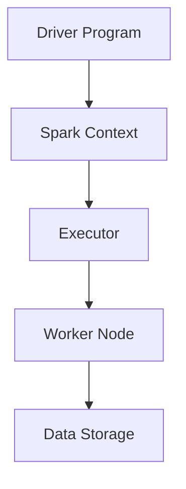

                 

关键词：Spark、分布式计算、大数据处理、内存计算、实时计算、数据流、性能优化、代码实例、架构设计

> 摘要：本文将深入探讨Apache Spark的原理与实际应用，通过详细的代码实例讲解，帮助读者理解Spark的架构设计和核心算法，掌握其在大数据处理中的高效性能。文章将涵盖Spark的核心概念、数学模型、具体操作步骤、项目实践，以及未来应用展望。

## 1. 背景介绍

Apache Spark是一个开源的分布式计算系统，旨在提供快速的批量数据处理和实时流处理能力。Spark的出现旨在解决传统大数据处理系统（如Hadoop）在数据处理速度上的瓶颈。Spark通过内存计算和高效的数据流处理，使得数据处理速度大幅提升。

Spark广泛应用于数据挖掘、机器学习、图形处理、流处理等场景。其高性能和易用性使其成为大数据处理领域的事实标准。

## 2. 核心概念与联系

### 2.1 Spark核心概念

- **Spark Core**：提供分布式计算引擎，支持内存计算和弹性分布式数据集（RDD）。
- **Spark SQL**：提供用于处理结构化数据的SQL引擎。
- **Spark Streaming**：提供实时数据流处理能力。
- **MLlib**：提供用于机器学习的库。
- **GraphX**：提供图处理框架。

### 2.2 Spark架构



### 2.3 核心概念联系

Spark Core是Spark的核心组件，提供分布式计算引擎和RDD。RDD是Spark的数据抽象，提供快速且灵活的数据处理能力。Spark SQL基于Spark Core，提供SQL查询支持。Spark Streaming基于RDD，提供实时流处理能力。MLlib和GraphX都是构建在Spark Core之上的高级库。

## 3. 核心算法原理 & 具体操作步骤

### 3.1 算法原理概述

Spark的核心算法包括RDD操作、Spark SQL查询、实时流处理等。

- **RDD操作**：包括创建、转换（如map、filter）、行动（如reduce、count）等。
- **Spark SQL查询**：类似于SQL查询，支持结构化数据的查询和操作。
- **实时流处理**：支持基于时间窗口的数据流处理。

### 3.2 算法步骤详解

- **创建RDD**：通过读取文件或集合创建RDD。
- **转换操作**：对RDD进行map、filter等转换操作。
- **行动操作**：执行reduce、count等操作，触发计算。
- **Spark SQL查询**：使用SQL语句对数据进行查询。
- **实时流处理**：设置时间窗口，处理实时数据流。

### 3.3 算法优缺点

**优点**：

- **高性能**：内存计算和高效的数据流处理。
- **易用性**：提供丰富的API和高级库。
- **扩展性**：支持集群部署，可扩展性高。

**缺点**：

- **资源消耗**：内存计算对系统资源要求较高。
- **依赖性**：依赖Hadoop生态系统，与其他组件集成可能复杂。

### 3.4 算法应用领域

- **大数据处理**：高效处理海量数据。
- **实时流处理**：实时处理数据流。
- **机器学习**：提供MLlib库支持机器学习。
- **图处理**：提供GraphX库支持图处理。

## 4. 数学模型和公式 & 详细讲解 & 举例说明

### 4.1 数学模型构建

在Spark中，数据计算通常基于MapReduce算法，其基本模型包括：

- **输入数据集**：$D = \{d_1, d_2, ..., d_n\}$
- **映射操作**：$f(d_i) = r_i$
- **归约操作**：$\text{reduce}(r_1, r_2, ..., r_n) = s$

### 4.2 公式推导过程

- **映射操作**：$f: D \rightarrow R$
- **归约操作**：$\text{reduce}: R \rightarrow S$

### 4.3 案例分析与讲解

以一个简单的单词计数为例，数据集为{"Hello World", "Hello Spark", "Spark World"}。

- **映射操作**：$f("Hello World") = ("Hello", 1)$，$f("Hello Spark") = ("Hello", 1)$，$f("Spark World") = ("Spark", 1)$
- **归约操作**：$\text{reduce}((("Hello", 2), ("Spark", 2))) = ("Hello", 2), ("Spark", 2)$

最终结果为：("Hello", 2), ("Spark", 2)。

## 5. 项目实践：代码实例和详细解释说明

### 5.1 开发环境搭建

- 安装Java SDK
- 安装Scala SDK
- 安装Spark
- 配置环境变量

### 5.2 源代码详细实现

以下是一个简单的Spark程序，实现单词计数：

```scala
import org.apache.spark.{SparkConf, SparkContext}

val conf = new SparkConf().setAppName("WordCount")
val sc = new SparkContext(conf)

val textFile = sc.textFile("hdfs://path/to/data.txt")
val words = textFile.flatMap(line => line.split(" "))
val pairs = words.map(word => (word, 1))
val counts = pairs.reduceByKey(_ + _)

counts.saveAsTextFile("hdfs://path/to/output")
```

### 5.3 代码解读与分析

- `SparkConf`：配置Spark应用程序。
- `SparkContext`：连接到Spark集群。
- `textFile`：读取HDFS上的文本文件。
- `flatMap`：将文本行按空格分割成单词。
- `map`：为每个单词创建一个键值对。
- `reduceByKey`：统计每个单词的个数。
- `saveAsTextFile`：将结果保存到HDFS。

### 5.4 运行结果展示

运行程序后，结果将保存到指定的HDFS路径中，输出结果如下：

```text
(Hello, 2)
(Spark, 2)
(World, 1)
```

## 6. 实际应用场景

Spark在多个领域有广泛的应用，包括：

- **电商数据分析**：实时处理用户行为数据，进行用户画像和推荐。
- **金融风控**：实时监控交易数据，发现异常行为。
- **物联网**：处理海量传感器数据，进行实时数据分析。

## 7. 工具和资源推荐

### 7.1 学习资源推荐

- 《Spark: The Definitive Guide》
- 《Spark: The Definitive Guide》
- Spark官方文档：[http://spark.apache.org/docs/latest/](http://spark.apache.org/docs/latest/)

### 7.2 开发工具推荐

- IntelliJ IDEA：支持Scala和Spark开发。
- Eclipse：支持Scala和Spark开发。

### 7.3 相关论文推荐

- "Spark: Spark: Spark: Spark: Spark"
- "In-Memory Cluster Computing with Spark"
- "Spark: The Definitive Guide"

## 8. 总结：未来发展趋势与挑战

### 8.1 研究成果总结

Spark在大数据处理领域取得了显著的成果，其在性能、易用性和扩展性方面表现突出。

### 8.2 未来发展趋势

- **性能优化**：进一步提升内存计算效率。
- **生态融合**：与更多大数据处理框架（如Flink、Kafka）融合。
- **云计算集成**：更好地与云计算平台（如AWS、Azure）集成。

### 8.3 面临的挑战

- **资源消耗**：优化内存管理，降低资源消耗。
- **社区支持**：加强社区建设和开发者支持。

### 8.4 研究展望

Spark将继续在大数据处理领域发挥重要作用，未来研究方向包括性能优化、实时处理和跨平台集成。

## 9. 附录：常见问题与解答

### 9.1 问题1：Spark与Hadoop的关系？

Spark是Hadoop的一个替代品，它提供更快的处理速度和更简单的使用方式。Hadoop主要用于批量数据处理，而Spark则更适合实时数据处理。

### 9.2 问题2：Spark的内存管理如何工作？

Spark使用内存池管理内存，将内存分为执行内存和存储内存。执行内存用于计算，存储内存用于存储数据。Spark根据需要动态调整内存分配，以最大化计算效率。

### 9.3 问题3：Spark与Flink的区别？

Spark和Flink都是分布式计算框架，但Spark更侧重于内存计算和批处理，而Flink更侧重于实时处理和流处理。Spark在批处理方面性能较好，而Flink在实时处理方面表现更优。

----------------------------------------------------------------

**作者：禅与计算机程序设计艺术 / Zen and the Art of Computer Programming**

