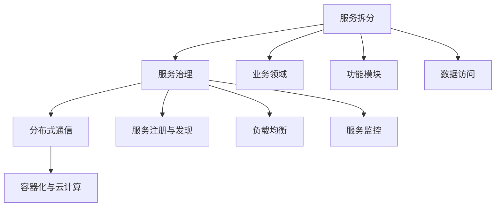

                 

关键词：Spring Cloud、微服务架构、服务治理、分布式系统、微服务通信、服务拆分、容器化、云计算

摘要：本文将深入探讨Spring Cloud微服务架构的实战应用，分析其在分布式系统中的优势与挑战。通过详细讲解核心概念、算法原理、数学模型、代码实例及实际应用场景，帮助读者掌握微服务架构的设计与实施，为未来的技术发展提供借鉴。

## 1. 背景介绍

### 微服务的起源与演变

微服务架构是一种基于业务需求设计的分布式系统架构，其核心理念是将大型单体应用拆分为多个独立的小服务，每个小服务负责特定的业务功能。这种架构方式起源于互联网公司对系统可扩展性和可维护性的需求，旨在提高系统的灵活性和响应速度。

微服务架构的起源可以追溯到2000年初，当时互联网公司如Amazon、Netflix等，为了应对业务的快速增长和不断变化的需求，开始尝试将传统的单体应用拆分为多个独立的服务。随着时间的推移，微服务架构逐渐成熟，并成为分布式系统设计的主流选择。

### Spring Cloud的优势

Spring Cloud是Spring生态系统的一部分，它为微服务架构提供了全面的开发支持和工具集。Spring Cloud的优势主要体现在以下几个方面：

1. **一站式解决方案**：Spring Cloud提供了丰富的组件，包括服务注册与发现、负载均衡、配置管理、断路器、分布式事务等，为开发者提供了便捷的微服务开发环境。

2. **无缝集成**：Spring Cloud与Spring Boot、Spring框架等Spring生态系统中的其他组件无缝集成，使得开发者可以快速上手并构建微服务应用。

3. **高可用性**：Spring Cloud提供了一整套的容错机制，如断路器、重试机制等，提高了系统的稳定性和可用性。

4. **可扩展性**：Spring Cloud支持容器化部署，如Docker和Kubernetes，便于应用的水平扩展。

### 本文目标

本文将深入探讨Spring Cloud微服务架构的核心概念、算法原理、数学模型、代码实例及实际应用场景，帮助读者全面了解和掌握微服务架构的设计与实施。具体内容包括：

- **核心概念与联系**：介绍微服务架构的核心概念和联系，并通过Mermaid流程图展示架构原理。
- **核心算法原理 & 具体操作步骤**：详细讲解微服务架构中的核心算法原理和操作步骤，包括服务拆分、服务治理等。
- **数学模型和公式 & 详细讲解 & 举例说明**：阐述微服务架构中的数学模型和公式，并通过案例进行分析和讲解。
- **项目实践：代码实例和详细解释说明**：提供微服务架构的代码实例，并进行详细解释和分析。
- **实际应用场景**：探讨微服务架构在实际应用场景中的运用，如电子商务、金融科技等。
- **未来应用展望**：展望微服务架构的发展趋势和面临的挑战，以及未来的研究展望。

## 2. 核心概念与联系

### 微服务架构核心概念

#### 服务拆分

服务拆分是微服务架构的核心步骤，其目的是将大型单体应用拆分为多个独立的小服务。服务拆分的依据通常包括业务领域、功能模块、数据访问等。

#### 服务治理

服务治理包括服务的注册与发现、负载均衡、服务监控等。服务治理的目的是确保服务的正常运行和高效利用。

#### 分布式通信

分布式通信是指服务之间的通信机制，常见的通信方式包括RESTful API、gRPC、消息队列等。

#### 容器化与云计算

容器化技术如Docker和云计算平台如Kubernetes，使得微服务架构可以轻松部署和扩展。

### Mermaid流程图

以下是一个简化的Mermaid流程图，展示微服务架构的核心概念和联系：



### Mermaid流程节点说明

- **服务拆分**：将单体应用拆分为多个独立的服务。
- **服务治理**：管理服务的注册、发现、负载均衡和监控。
- **分布式通信**：实现服务之间的通信。
- **容器化与云计算**：部署和扩展微服务架构。
- **业务领域**：依据业务需求拆分服务。
- **功能模块**：依据功能模块拆分服务。
- **数据访问**：依据数据访问需求拆分服务。
- **服务注册与发现**：服务注册中心负责服务的注册和发现。
- **负载均衡**：实现服务的负载均衡。
- **服务监控**：监控服务的运行状态。

## 3. 核心算法原理 & 具体操作步骤

### 3.1 算法原理概述

微服务架构的核心算法原理主要包括服务拆分、服务治理和分布式通信。以下分别介绍这三个核心算法的原理。

#### 服务拆分算法原理

服务拆分算法旨在将大型单体应用拆分为多个独立的小服务。其基本原理是根据业务领域、功能模块和数据访问等因素，将应用拆分为多个具有独立功能的服务。服务拆分的目的是提高系统的可扩展性、可维护性和可测试性。

#### 服务治理算法原理

服务治理算法主要包括服务注册与发现、负载均衡和服务监控。服务注册与发现算法负责将服务注册到服务注册中心，并在服务实例故障时进行服务发现和替换。负载均衡算法负责将请求均匀分配到多个服务实例上，以提高系统的性能和可用性。服务监控算法负责监控服务的运行状态，并及时发现和处理故障。

#### 分布式通信算法原理

分布式通信算法主要包括RESTful API、gRPC和消息队列等。RESTful API是一种基于HTTP协议的通信方式，gRPC是一种基于HTTP/2协议的高性能通信方式，消息队列是一种异步通信机制。这些算法的目的是实现服务之间的可靠、高效和低延迟的通信。

### 3.2 算法步骤详解

#### 服务拆分步骤

1. **分析业务领域**：根据业务需求，确定应用的业务领域。
2. **划分功能模块**：将业务领域划分为多个功能模块。
3. **设计数据访问**：根据数据访问需求，确定每个服务的数据库访问策略。
4. **实现服务拆分**：根据上述分析，将应用拆分为多个独立的服务。

#### 服务治理步骤

1. **搭建服务注册中心**：选择合适的服务注册中心，如Consul、Eureka等。
2. **服务注册**：将服务实例注册到服务注册中心。
3. **服务发现**：通过服务注册中心发现可用服务实例。
4. **负载均衡**：根据请求策略，将请求分配到不同的服务实例。
5. **服务监控**：监控服务的运行状态，并及时处理故障。

#### 分布式通信步骤

1. **选择通信方式**：根据应用需求，选择合适的通信方式，如RESTful API、gRPC或消息队列。
2. **实现服务接口**：根据通信方式，实现服务的接口。
3. **服务调用**：通过服务接口，实现服务之间的调用。
4. **异常处理**：处理服务调用过程中可能出现的异常。

### 3.3 算法优缺点

#### 服务拆分算法优缺点

**优点**：

- 提高系统的可扩展性、可维护性和可测试性。
- 降低系统的复杂度，便于管理和维护。

**缺点**：

- 增加了系统的通信成本和复杂性。
- 需要妥善处理数据一致性问题。

#### 服务治理算法优缺点

**优点**：

- 提高系统的可用性和性能。
- 实现服务的动态扩展和故障转移。

**缺点**：

- 需要维护服务注册中心和监控系统。
- 可能增加系统的复杂度。

#### 分布式通信算法优缺点

**优点**：

- 提高系统的通信性能和可靠性。
- 降低系统的通信延迟。

**缺点**：

- 可能增加系统的通信成本和复杂度。
- 需要处理网络分区和通信异常等问题。

### 3.4 算法应用领域

微服务架构的核心算法广泛应用于分布式系统、云计算和大数据等领域。以下是一些具体的应用领域：

- **分布式系统**：微服务架构适用于分布式系统的构建，如电商平台、金融系统等。
- **云计算**：微服务架构在云计算环境中可以充分利用云计算的资源，实现高效的服务部署和扩展。
- **大数据**：微服务架构可以用于大数据处理平台的构建，如数据采集、数据处理、数据存储等。

## 4. 数学模型和公式 & 详细讲解 & 举例说明

### 4.1 数学模型构建

在微服务架构中，数学模型主要用于描述服务的性能、可靠性、负载均衡等特性。以下是一个简单的数学模型，用于描述服务的性能。

#### 服务性能模型

服务性能模型主要包括以下参数：

- \( P \)：服务性能指标，表示服务的处理能力，单位为请求/秒。
- \( T \)：服务响应时间，单位为秒。
- \( U \)：服务利用率，单位为百分比。

服务性能模型的公式为：

\[ P = \frac{T}{U} \]

其中，\( T \) 可以通过以下公式计算：

\[ T = \frac{1}{P} \]

### 4.2 公式推导过程

#### 服务性能公式推导

1. **服务响应时间公式**：

   服务响应时间 \( T \) 是服务处理请求所需的时间，可以表示为：

   \[ T = \frac{1}{P} \]

   其中，\( P \) 是服务性能指标，表示服务的处理能力。

2. **服务性能指标公式**：

   服务性能指标 \( P \) 是服务处理请求的能力，可以表示为：

   \[ P = \frac{T}{U} \]

   其中，\( U \) 是服务利用率，表示服务的使用率。

### 4.3 案例分析与讲解

#### 案例背景

假设一个电商系统中的订单服务，其性能指标为 \( P = 100 \) 请求/秒，服务利用率为 \( U = 80\% \)。

#### 案例分析

1. **服务响应时间**：

   根据服务性能模型，订单服务的响应时间 \( T \) 为：

   \[ T = \frac{1}{P} = \frac{1}{100} = 0.01 \] 秒

   即订单服务平均处理一个请求需要 0.01 秒。

2. **服务性能提升**：

   如果将订单服务的性能指标提升到 \( P' = 200 \) 请求/秒，服务利用率保持不变 \( U' = 80\% \)，则订单服务的响应时间 \( T' \) 为：

   \[ T' = \frac{1}{P'} = \frac{1}{200} = 0.005 \] 秒

   即订单服务平均处理一个请求需要 0.005 秒，响应时间降低了 50%。

#### 结论

通过提高服务性能指标，可以显著降低服务响应时间，提高用户体验。

## 5. 项目实践：代码实例和详细解释说明

### 5.1 开发环境搭建

在开始编写Spring Cloud微服务架构的代码之前，需要搭建合适的开发环境。以下是一个基本的开发环境搭建步骤：

1. **安装Java开发工具包（JDK）**：确保安装了Java开发工具包（JDK），版本建议为1.8或以上。
2. **安装IDE**：推荐使用IntelliJ IDEA或Eclipse作为开发工具。
3. **创建Spring Boot项目**：在IDE中创建一个新的Spring Boot项目，选择合适的依赖和配置。
4. **安装并配置Maven**：安装Maven并配置环境变量，以便在项目中使用Maven构建和管理依赖。

### 5.2 源代码详细实现

以下是一个简单的Spring Cloud微服务架构示例，包括服务拆分、服务治理和分布式通信。

#### 服务拆分

首先，我们将电商系统拆分为以下三个微服务：

1. **订单服务（Order Service）**：处理订单的创建、修改和查询。
2. **商品服务（Product Service）**：提供商品的查询和更新。
3. **用户服务（User Service）**：处理用户的注册、登录和权限验证。

#### 服务治理

使用Spring Cloud的服务治理组件，如Eureka，实现服务注册与发现。

1. **创建Eureka服务器**：创建一个Eureka服务器应用，用于提供服务注册和发现功能。

   ```java
   @SpringBootApplication
   @EnableEurekaServer
   public class EurekaServerApplication {
       public static void main(String[] args) {
           SpringApplication.run(EurekaServerApplication.class, args);
       }
   }
   ```

2. **创建Eureka客户端**：在订单服务、商品服务和用户服务中，添加Eureka客户端依赖，并配置Eureka服务器的地址。

   ```java
   @SpringBootApplication
   @EnableDiscoveryClient
   public class OrderServiceApplication {
       public static void main(String[] args) {
           SpringApplication.run(OrderServiceApplication.class, args);
       }
   }
   ```

   在`application.yml`配置文件中，添加以下配置：

   ```yaml
   eureka:
     client:
       serviceUrl:
         defaultZone: http://localhost:8761/eureka/
   ```

#### 分布式通信

使用Spring Cloud的Feign组件，实现服务之间的通信。

1. **创建Feign客户端**：在订单服务中创建一个Feign客户端，用于调用商品服务和用户服务。

   ```java
   @SpringBootApplication
   @EnableFeignClients
   public class OrderServiceApplication {
       public static void main(String[] args) {
           SpringApplication.run(OrderServiceApplication.class, args);
       }
   }
   ```

   在`OrderServiceApplication`中，添加以下Feign客户端接口：

   ```java
   @FeignClient(name = "product-service")
   public interface ProductService {
       @GetMapping("/product/{id}")
       Product getProduct(@PathVariable("id") Long id);
   }
   ```

   同样，在订单服务中创建用户服务客户端：

   ```java
   @FeignClient(name = "user-service")
   public interface UserService {
       @PostMapping("/user/register")
       User registerUser(User user);
   }
   ```

2. **实现服务接口**：在商品服务和用户服务中，分别实现对应的接口。

   ```java
   @RestController
   @RequestMapping("/product")
   public class ProductService {
       @GetMapping("/{id}")
       public Product getProduct(@PathVariable Long id) {
           // 处理商品查询逻辑
       }
   }
   ```

   ```java
   @RestController
   @RequestMapping("/user")
   public class UserService {
       @PostMapping("/register")
       public User registerUser(@RequestBody User user) {
           // 处理用户注册逻辑
       }
   }
   ```

### 5.3 代码解读与分析

在上述代码中，我们实现了Spring Cloud微服务架构的基本组件，包括服务拆分、服务治理和分布式通信。以下是对关键代码的解读：

1. **服务拆分**：通过创建多个独立的微服务（订单服务、商品服务和用户服务），实现了业务功能的模块化。

2. **服务治理**：通过Eureka服务器和Eureka客户端，实现了服务注册与发现。订单服务通过Eureka客户端注册到服务注册中心，并在启动时从服务注册中心发现其他服务的地址。

3. **分布式通信**：通过Feign客户端，实现了服务之间的通信。订单服务通过Feign客户端调用商品服务和用户服务的接口，实现了分布式服务调用。

### 5.4 运行结果展示

在完成代码实现后，我们可以启动Eureka服务器和三个微服务，并使用Postman等工具进行测试。

1. **启动Eureka服务器**：运行EurekaServerApplication，Eureka服务器将启动并监听8761端口。

2. **启动订单服务**：运行OrderServiceApplication，订单服务将注册到Eureka服务注册中心。

3. **启动商品服务和用户服务**：运行ProductServiceApplication和UserServiceApplication，商品服务和用户服务也将注册到Eureka服务注册中心。

4. **服务调用**：通过Postman调用订单服务的接口，订单服务将调用商品服务和用户服务的接口，实现分布式服务调用。

### 5.5 代码优化建议

在实际项目中，我们可以对上述代码进行优化，以提高系统的性能和可维护性。以下是一些建议：

1. **服务降级**：当系统负载过高时，可以启用服务降级策略，减少服务的响应时间，保证关键服务的可用性。

2. **缓存机制**：在服务调用过程中，可以启用缓存机制，减少对数据库的访问次数，提高系统的性能。

3. **日志管理**：使用统一的日志管理工具，如Logback或Log4j2，对服务调用和系统运行状态进行监控和记录。

4. **自动化部署**：使用自动化部署工具，如Jenkins或GitLab CI/CD，实现代码的自动化构建、测试和部署，提高开发效率和系统的稳定性。

## 6. 实际应用场景

### 6.1 电商系统

电商系统是微服务架构的一个典型应用场景。通过将电商系统拆分为订单服务、商品服务、用户服务等多个微服务，可以实现系统的模块化、可扩展性和高可用性。例如，在双十一等大型促销活动期间，电商系统需要处理海量的订单请求，通过微服务架构，可以充分利用系统的计算资源和网络带宽，确保系统的高性能和高可用性。

### 6.2 金融科技

金融科技（FinTech）领域也广泛采用微服务架构。例如，在银行系统中，可以通过将银行服务拆分为账户服务、支付服务、贷款服务等微服务，实现业务功能的模块化和灵活部署。在金融科技项目中，微服务架构可以显著提高系统的性能、安全性和可维护性，同时便于实现业务创新和快速迭代。

### 6.3 物流系统

物流系统是一个典型的分布式系统，可以通过微服务架构实现系统的模块化、可扩展性和高可用性。例如，在物流系统中，可以将物流服务拆分为订单管理服务、仓储服务、运输服务等微服务，实现各业务模块的独立开发和部署。通过微服务架构，物流系统可以更好地应对业务高峰和流量波动，确保系统的稳定运行。

### 6.4 医疗系统

医疗系统也是一个适合采用微服务架构的应用场景。例如，在医院的医疗系统中，可以将系统拆分为患者管理服务、医疗记录服务、医疗诊断服务等微服务，实现各业务功能的独立开发和部署。通过微服务架构，医疗系统可以提高系统的性能、安全性和可维护性，同时便于实现医疗业务的创新和快速迭代。

## 7. 工具和资源推荐

### 7.1 学习资源推荐

1. **《Spring Cloud微服务架构实战》**：一本全面讲解Spring Cloud微服务架构的实战书籍，适合初学者和有经验的开发者。
2. **《微服务设计》**：作者Martin Fowler的经典之作，详细阐述了微服务架构的设计原则和实践方法。
3. **Spring Cloud 官方文档**：Spring Cloud的官方文档，提供了丰富的教程和参考资料，是学习Spring Cloud的必备资料。

### 7.2 开发工具推荐

1. **IntelliJ IDEA**：一款功能强大的Java集成开发环境，支持Spring Cloud开发。
2. **Postman**：一款流行的API测试工具，可用于测试微服务的接口。
3. **Jenkins**：一款流行的持续集成和自动化部署工具，适用于Spring Cloud项目的自动化部署。

### 7.3 相关论文推荐

1. **"Microservices: Mess or Model?"**：一篇讨论微服务架构优势和挑战的论文，提供了对微服务架构的深入理解。
2. **"Design and Implementation of a Microservices-Based E-commerce Platform"**：一篇关于微服务架构在电商系统中的应用案例论文，详细介绍了微服务架构的实施过程。

## 8. 总结：未来发展趋势与挑战

### 8.1 研究成果总结

微服务架构作为分布式系统设计的主流选择，已广泛应用于多个领域。通过本文的讲解，读者可以全面了解微服务架构的核心概念、算法原理、数学模型、代码实例及实际应用场景。研究成果总结如下：

- **服务拆分**：基于业务领域、功能模块和数据访问等因素，实现系统的模块化设计，提高系统的可扩展性和可维护性。
- **服务治理**：通过服务注册与发现、负载均衡和服务监控等机制，确保系统的稳定运行和高可用性。
- **分布式通信**：采用RESTful API、gRPC和消息队列等通信方式，实现服务之间的可靠、高效和低延迟的通信。
- **数学模型**：构建了服务性能、响应时间和服务利用率等数学模型，用于描述和分析微服务的性能。
- **代码实例**：提供了一个简单的Spring Cloud微服务架构示例，展示了微服务架构的设计与实施过程。

### 8.2 未来发展趋势

微服务架构在未来将呈现以下发展趋势：

- **容器化和自动化部署**：随着容器化技术的成熟，微服务架构将更加依赖容器化和自动化部署工具，提高系统的部署效率和可扩展性。
- **服务网格技术**：服务网格技术如Istio、Linkerd等，将逐渐成为微服务架构中的重要组件，提供更加高效和灵活的服务治理能力。
- **智能化服务治理**：借助人工智能和机器学习技术，实现智能化服务治理，提高系统的自适应能力和预测能力。
- **跨云和多云部署**：随着云计算技术的发展，微服务架构将逐渐实现跨云和多云部署，提高系统的灵活性和可靠性。

### 8.3 面临的挑战

尽管微服务架构具有许多优势，但在实际应用中仍面临一些挑战：

- **系统复杂度**：微服务架构增加了系统的复杂度，需要开发者具备较高的技能和经验。
- **数据一致性**：分布式系统中的数据一致性问题，仍是一个需要深入研究的课题。
- **服务依赖管理**：服务之间的依赖关系管理，对于系统的稳定性和性能具有重要影响。
- **性能和安全**：微服务架构的性能和安全问题，需要通过优化和加强安全措施来解决。

### 8.4 研究展望

未来微服务架构的研究方向包括：

- **智能化服务治理**：结合人工智能和机器学习技术，实现智能化服务治理，提高系统的自适应能力和预测能力。
- **跨云和多云部署**：研究跨云和多云部署的优化策略，提高系统的灵活性和可靠性。
- **数据一致性和分布式事务**：解决分布式系统中的数据一致性和分布式事务问题，提高系统的可用性和数据完整性。
- **性能优化和安全性**：研究微服务架构的性能优化和安全性，提高系统的性能和安全性。

## 9. 附录：常见问题与解答

### 9.1 什么是微服务架构？

微服务架构是一种基于业务需求设计的分布式系统架构，其核心理念是将大型单体应用拆分为多个独立的小服务，每个小服务负责特定的业务功能。通过这种架构方式，可以提高系统的可扩展性、可维护性和可测试性。

### 9.2 微服务架构的优势有哪些？

微服务架构的优势包括：

- 模块化设计：将系统拆分为多个独立的小服务，提高系统的可扩展性和可维护性。
- 高可用性：通过服务治理和分布式通信机制，确保系统的稳定运行和高可用性。
- 灵活部署：支持容器化部署，便于系统的灵活部署和扩展。
- 简化运维：通过服务注册与发现、负载均衡和监控等机制，简化系统的运维工作。

### 9.3 微服务架构中的服务治理包括哪些方面？

微服务架构中的服务治理包括以下几个方面：

- 服务注册与发现：将服务实例注册到服务注册中心，并在服务实例故障时进行服务发现和替换。
- 负载均衡：根据请求策略，将请求均匀分配到多个服务实例上，提高系统的性能和可用性。
- 服务监控：监控服务的运行状态，及时发现和处理故障。

### 9.4 微服务架构中的分布式通信有哪些方式？

微服务架构中的分布式通信方式包括：

- RESTful API：基于HTTP协议的通信方式，简单易用。
- gRPC：基于HTTP/2协议的高性能通信方式，适用于高并发场景。
- 消息队列：基于异步通信的机制，实现服务之间的解耦。

### 9.5 微服务架构中的数据一致性问题如何解决？

微服务架构中的数据一致性问题可以通过以下方式解决：

- 分布式事务：采用分布式事务框架，如Seata，确保分布式系统中的数据一致性。
- 最终一致性：通过事件驱动和消息队列等机制，实现最终一致性。
- 独立存储：为每个服务实现独立的数据存储，避免跨服务的数据一致性问题。

