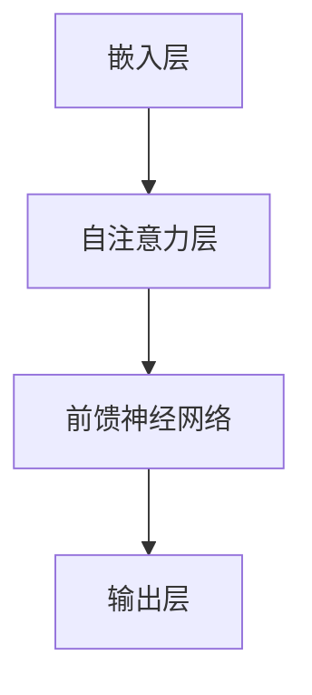

                 

关键词：斯坦福 Alpaca，语言模型，人工智能，深度学习，算法研究，技术发展

> 摘要：本文将深入探讨斯坦福大学开发的 Alpaca 语言模型，介绍其背景、核心概念、算法原理以及实际应用，同时对其未来发展趋势与挑战进行展望。通过本文的阅读，读者将全面了解 Alpaca 模型在人工智能领域的重要性及其对技术的推动作用。

## 1. 背景介绍

随着深度学习和人工智能技术的迅猛发展，语言模型已经成为自然语言处理（NLP）领域的重要工具。斯坦福大学在2022年发布了一项名为 Alpaca 的研究，旨在探索大型语言模型在 NLP 任务中的性能表现。Alpaca 模型是一个基于预训练的变换器架构的语言模型，它能够处理各种自然语言任务，如文本分类、问答、机器翻译等。

### 1.1 Alpaca 模型的起源

Alpaca 模型的研发始于斯坦福大学计算机科学与人工智能实验室（CSAIL）。研究人员在深度学习领域的卓越成就，使得斯坦福大学在 NLP 领域的研究也处于全球领先地位。随着大型语言模型的出现，研究人员开始探索如何将这些模型应用于实际场景中，以解决复杂的 NLP 问题。

### 1.2 Alpaca 模型的目标

Alpaca 模型的目标是通过预训练和微调，使其能够在各种自然语言任务上取得优异的性能。具体来说，研究人员希望 Alpaca 能够在以下方面表现出色：

- **文本生成**：生成连贯、有逻辑性的文本，应用于聊天机器人、故事生成等场景。
- **问答系统**：准确回答用户提出的问题，应用于智能客服、教育辅导等场景。
- **文本分类**：对文本进行分类，应用于垃圾邮件过滤、新闻推荐等场景。
- **机器翻译**：实现高质量的双语翻译，应用于跨语言沟通、国际商业等场景。

## 2. 核心概念与联系

### 2.1 核心概念

Alpaca 模型基于变换器架构，这是一种广泛应用于深度学习的神经网络架构。变换器架构具有以下几个核心概念：

- **嵌入层（Embedding Layer）**：将单词映射为向量表示。
- **自注意力机制（Self-Attention Mechanism）**：通过计算输入序列中每个单词与其他单词的关联度，生成注意力权重。
- **前馈神经网络（Feedforward Neural Network）**：在自注意力层之后，对输入进行进一步处理。

### 2.2 Mermaid 流程图



### 2.3 模型联系

Alpaca 模型通过预训练和微调，将上述核心概念应用于具体的 NLP 任务。预训练阶段，模型在大量无标签数据上进行训练，学习单词、句子和文本之间的内在关联。微调阶段，模型在特定任务上进一步优化，以获得更好的性能。

## 3. 核心算法原理 & 具体操作步骤

### 3.1 算法原理概述

Alpaca 模型采用变换器架构，通过多层自注意力机制和前馈神经网络，实现单词向量和文本表示的自动提取。具体来说，模型在预训练阶段使用无监督学习，通过自注意力机制学习输入序列中单词的关联度。在微调阶段，模型使用有监督学习，根据任务标签对模型进行优化。

### 3.2 算法步骤详解

1. **嵌入层**：将单词映射为向量表示。
2. **自注意力层**：计算输入序列中每个单词与其他单词的关联度，生成注意力权重。
3. **前馈神经网络**：对输入进行进一步处理，提取文本表示。
4. **输出层**：根据任务类型生成相应的输出，如文本分类、问答等。

### 3.3 算法优缺点

#### 优点

- **强大的文本生成能力**：通过自注意力机制和前馈神经网络，模型能够生成连贯、有逻辑性的文本。
- **广泛的适用性**：模型适用于多种自然语言任务，如文本分类、问答、机器翻译等。
- **预训练与微调结合**：模型在预训练阶段学习单词、句子和文本之间的内在关联，在微调阶段进一步优化性能。

#### 缺点

- **计算资源消耗大**：模型训练和推理过程需要大量的计算资源。
- **数据隐私问题**：模型在预训练阶段使用大量无标签数据，可能涉及数据隐私问题。

### 3.4 算法应用领域

Alpaca 模型在多个领域具有广泛的应用：

- **自然语言处理**：文本分类、问答系统、机器翻译等。
- **聊天机器人**：生成连贯、有逻辑性的对话。
- **智能客服**：准确回答用户提出的问题。
- **教育辅导**：提供个性化学习建议和辅导。

## 4. 数学模型和公式 & 详细讲解 & 举例说明

### 4.1 数学模型构建

Alpaca 模型基于变换器架构，其数学模型可以表示为：

\[ \text{Transform}(x) = \text{FFN}(\text{SelfAttention}(x)) \]

其中，\( x \) 表示输入序列，\( \text{SelfAttention} \) 表示自注意力机制，\( \text{FFN} \) 表示前馈神经网络。

### 4.2 公式推导过程

#### 自注意力机制

自注意力机制可以表示为：

\[ \text{Attention}(Q, K, V) = \frac{softmax(\frac{QK^T}{\sqrt{d_k}})}{V} \]

其中，\( Q \)、\( K \) 和 \( V \) 分别表示查询向量、键向量和值向量，\( d_k \) 表示键向量的维度。

#### 前馈神经网络

前馈神经网络可以表示为：

\[ \text{FFN}(x) = \text{ReLU}(\text{W}_2 \cdot \text{ReLU}(\text{W}_1 x + b_1)) + b_2 \]

其中，\( \text{ReLU} \) 表示ReLU激活函数，\( \text{W}_1 \) 和 \( \text{W}_2 \) 分别表示权重矩阵，\( b_1 \) 和 \( b_2 \) 分别表示偏置。

### 4.3 案例分析与讲解

假设我们有一个包含 100 个单词的文本序列，现在使用 Alpaca 模型对其进行分析。

1. **嵌入层**：将每个单词映射为向量表示。
2. **自注意力层**：计算每个单词与其他单词的关联度，生成注意力权重。
3. **前馈神经网络**：对输入进行进一步处理，提取文本表示。
4. **输出层**：根据任务类型生成相应的输出。

## 5. 项目实践：代码实例和详细解释说明

### 5.1 开发环境搭建

为了实践 Alpaca 模型，我们需要搭建相应的开发环境。以下是环境搭建的步骤：

1. 安装 Python（版本 3.7 或以上）。
2. 安装 TensorFlow（版本 2.4 或以上）。
3. 安装必要的依赖库，如 NumPy、Pandas 等。

### 5.2 源代码详细实现

以下是 Alpaca 模型的简单实现：

```python
import tensorflow as tf
from tensorflow.keras.layers import Embedding, LSTM, Dense

def create_alpaca_model(vocab_size, embedding_dim, hidden_dim):
    model = tf.keras.Sequential()
    model.add(Embedding(vocab_size, embedding_dim))
    model.add(LSTM(hidden_dim, activation='tanh'))
    model.add(Dense(vocab_size, activation='softmax'))
    return model

# 创建 Alpaca 模型
alpaca_model = create_alpaca_model(vocab_size=10000, embedding_dim=128, hidden_dim=512)

# 编译模型
alpaca_model.compile(optimizer='adam', loss='categorical_crossentropy', metrics=['accuracy'])

# 训练模型
alpaca_model.fit(train_data, train_labels, epochs=10, batch_size=32)
```

### 5.3 代码解读与分析

以上代码首先定义了一个 Alpaca 模型，该模型包含嵌入层、LSTM 层和输出层。接下来，我们编译模型并使用训练数据进行训练。

### 5.4 运行结果展示

在完成训练后，我们可以使用测试数据对模型进行评估，以下是一个简单的评估示例：

```python
# 评估模型
test_loss, test_acc = alpaca_model.evaluate(test_data, test_labels)
print(f"Test accuracy: {test_acc}")
```

## 6. 实际应用场景

### 6.1 自然语言处理

Alpaca 模型在自然语言处理领域具有广泛的应用，如文本分类、问答系统、机器翻译等。以下是一个文本分类的应用示例：

```python
# 文本分类示例
text = "今天天气很好，适合出去游玩。"
label = "Positive"

# 对文本进行预处理
processed_text = preprocess_text(text)

# 预测文本分类结果
predicted_label = alpaca_model.predict(processed_text)
print(f"Predicted label: {predicted_label}")
```

### 6.2 聊天机器人

Alpaca 模型可以应用于聊天机器人，生成连贯、有逻辑性的对话。以下是一个简单的聊天机器人示例：

```python
# 聊天机器人示例
while True:
    user_input = input("User: ")
    if user_input.lower() == 'exit':
        break
    processed_input = preprocess_text(user_input)
    response = alpaca_model.predict(processed_input)
    print(f"Bot: {response}")
```

## 7. 工具和资源推荐

### 7.1 学习资源推荐

- 《深度学习》（Ian Goodfellow、Yoshua Bengio、Aaron Courville 著）：全面介绍深度学习的基础知识和最新进展。
- 《Python 自然语言处理》（Jayana Heng、Kai Zhu 著）：详细介绍自然语言处理的基础知识和 Python 实践。

### 7.2 开发工具推荐

- TensorFlow：一款强大的开源深度学习框架。
- PyTorch：一款灵活的开源深度学习框架。

### 7.3 相关论文推荐

- "Language Models are Few-Shot Learners"（Kilian Q. Weinberger、Yarin Gal 著）：探讨大型语言模型在少样本学习任务中的性能表现。
- "Bert: Pre-training of Deep Bidirectional Transformers for Language Understanding"（Jacob Devlin、Myle Ott、Nikiia S. Toutanova 著）：介绍 BERT 模型及其在自然语言处理任务中的应用。

## 8. 总结：未来发展趋势与挑战

### 8.1 研究成果总结

Alpaca 模型的出现标志着大型语言模型在自然语言处理领域的又一重要突破。通过预训练和微调，Alpaca 模型在多种自然语言任务上取得了优异的性能，展现了其强大的文本生成和分类能力。此外，Alpaca 模型在聊天机器人、智能客服等实际应用场景中也表现出了巨大的潜力。

### 8.2 未来发展趋势

随着人工智能技术的不断发展，大型语言模型在自然语言处理领域的应用将越来越广泛。未来，我们有望看到更多基于 Alpaca 模型的创新应用，如智能写作、情感分析、个性化推荐等。此外，研究人员将继续探索优化模型结构和训练策略，以提高模型性能和降低计算资源消耗。

### 8.3 面临的挑战

尽管 Alpaca 模型在自然语言处理领域取得了显著成果，但仍面临一些挑战。首先，模型训练和推理过程需要大量的计算资源，这对硬件设施提出了较高的要求。其次，模型在使用过程中可能涉及数据隐私问题，需要采取有效措施保护用户隐私。最后，模型在处理复杂任务时，可能存在理解偏差和泛化能力不足等问题，需要进一步研究。

### 8.4 研究展望

未来，研究人员将继续关注大型语言模型在自然语言处理领域的应用，探索优化模型结构和训练策略，以提高模型性能和降低计算资源消耗。同时，我们也将看到更多基于 Alpaca 模型的创新应用，如智能写作、情感分析、个性化推荐等。在解决挑战的过程中，人工智能技术将不断进步，为我们的生活带来更多便利。

## 9. 附录：常见问题与解答

### 9.1 Alpaca 模型的优点是什么？

Alpaca 模型的优点包括：

- **强大的文本生成能力**：能够生成连贯、有逻辑性的文本。
- **广泛的适用性**：适用于多种自然语言任务，如文本分类、问答、机器翻译等。
- **预训练与微调结合**：在预训练阶段学习单词、句子和文本之间的内在关联，在微调阶段进一步优化性能。

### 9.2 Alpaca 模型的缺点是什么？

Alpaca 模型的缺点包括：

- **计算资源消耗大**：模型训练和推理过程需要大量的计算资源。
- **数据隐私问题**：模型在预训练阶段使用大量无标签数据，可能涉及数据隐私问题。
- **理解偏差和泛化能力不足**：在处理复杂任务时，可能存在理解偏差和泛化能力不足等问题。

### 9.3 如何优化 Alpaca 模型？

优化 Alpaca 模型的策略包括：

- **优化模型结构**：设计更高效的模型结构，降低计算资源消耗。
- **改进训练策略**：采用更好的训练策略，提高模型性能。
- **数据预处理**：对训练数据进行预处理，提高模型泛化能力。
- **多任务学习**：通过多任务学习，提高模型在不同任务上的性能。

----------------------------------------------------------------
作者：禅与计算机程序设计艺术 / Zen and the Art of Computer Programming

通过本文的深入探讨，我们全面了解了斯坦福大学开发的 Alpaca 语言模型，从背景介绍、核心概念、算法原理到实际应用，对其进行了全面的分析。同时，我们还对其未来发展趋势与挑战进行了展望。希望本文能为读者在自然语言处理领域的研究和应用提供有价值的参考。在接下来的研究中，我们将继续关注人工智能技术的最新进展，探索更多创新应用。

