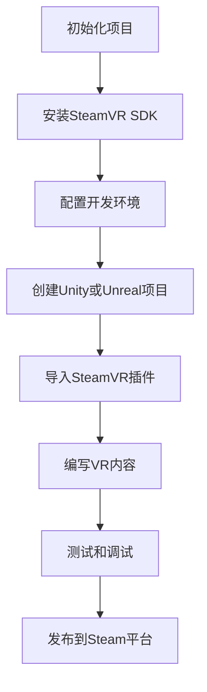

                 

 

> **关键词：** SteamVR，虚拟现实（VR），平台集成，内容发布，开发工具，开发者指南

> **摘要：** 本文将深入探讨如何集成SteamVR技术，以便在Steam平台上发布高质量的虚拟现实内容。我们将分析SteamVR的核心概念、集成步骤、以及发布过程中可能遇到的问题和解决方案。同时，文章还将提供数学模型、代码实例和未来应用展望，以帮助开发者充分利用SteamVR技术，创造更丰富的VR体验。

---

## 1. 背景介绍

虚拟现实（Virtual Reality，VR）技术作为计算机科学与人工智能领域的重要分支，正逐步改变着我们的生活方式。SteamVR，作为Valve公司推出的VR平台，以其稳定性和兼容性赢得了众多开发者和用户的青睐。SteamVR提供了丰富的开发工具和资源，使开发者能够轻松地创建和发布VR应用。

Steam平台作为全球最大的游戏发行平台之一，拥有庞大的用户群体和完善的生态系统。通过SteamVR的集成，开发者可以将自己的VR内容发布到这个庞大的用户群体中，从而实现内容的广泛传播和商业价值。

本文旨在为开发者提供一份全面、实用的指南，帮助他们深入了解SteamVR的技术架构，掌握集成和发布VR内容的方法，以及解决可能遇到的各种问题。

## 2. 核心概念与联系

### 2.1. SteamVR概述

SteamVR是Valve公司推出的一个虚拟现实平台，它不仅提供了高质量的VR硬件，如VR头盔、手柄等，还提供了完整的软件开发工具包（SDK），支持Unity、Unreal Engine等多种主流游戏引擎。

SteamVR的核心概念包括：

- **空间感知**：通过定位传感器和摄像头，SteamVR可以实时捕捉用户在虚拟空间中的位置和动作，为用户提供沉浸式的体验。
- **房间尺度**：SteamVR允许开发者创建最大为10x10英尺（约3x3米）的虚拟空间，使虚拟世界与真实世界紧密相连。
- **用户交互**：SteamVR提供了多种交互方式，包括手部追踪、声音交互等，增强了用户的沉浸感和互动性。

### 2.2. Mermaid 流程图

下面是SteamVR集成流程的Mermaid流程图表示：



### 2.3. 关键技术与组件

- **位置追踪**：SteamVR使用外部传感器和摄像头来实现用户的位置追踪，提供高精度的空间感知能力。
- **手部追踪**：通过内置或外接的手部追踪设备，SteamVR可以实时捕捉用户的手部动作，实现自然的手势交互。
- **声音交互**：SteamVR支持内置或外接的音频设备，通过声音交互增强用户的沉浸感。

## 3. 核心算法原理 & 具体操作步骤

### 3.1. 算法原理概述

SteamVR的核心算法原理主要包括空间追踪、手势识别和声音处理。这些算法共同协作，为用户提供沉浸式的虚拟体验。

- **空间追踪**：通过传感器捕捉用户的位置和运动，算法实时更新用户在虚拟空间中的坐标，确保虚拟内容与用户动作同步。
- **手势识别**：算法分析手部动作，识别不同的手势，为用户提供互动式操作。
- **声音处理**：算法处理音频输入和输出，实现声音交互和空间音频效果。

### 3.2. 算法步骤详解

下面是SteamVR集成的主要步骤：

1. **初始化项目**：创建一个新的Unity或Unreal项目，并配置SteamVR SDK。
2. **安装SteamVR SDK**：下载并安装SteamVR SDK，配置开发环境。
3. **配置开发环境**：确保Unity或Unreal的版本与SteamVR SDK兼容，配置项目设置。
4. **创建VR内容**：使用Unity或Unreal的编辑器，创建VR场景和交互元素。
5. **导入SteamVR插件**：导入SteamVR插件，配置虚拟现实设置。
6. **编写VR内容**：根据用户需求和场景设计，编写代码实现交互逻辑和视觉效果。
7. **测试和调试**：在虚拟环境中测试应用，调试和优化性能。
8. **发布到Steam平台**：通过Steamworks接口，将应用发布到Steam平台，供用户下载和使用。

### 3.3. 算法优缺点

**优点**：

- **高沉浸感**：通过空间追踪和手势识别，用户可以更加自然地与虚拟内容互动。
- **广泛兼容**：SteamVR支持多种游戏引擎和硬件设备，易于集成和使用。
- **社区支持**：Steam平台拥有庞大的用户群体和活跃的开发者社区，提供丰富的资源和帮助。

**缺点**：

- **硬件依赖**：SteamVR需要特定的硬件设备，如VR头盔、手柄等，增加了使用成本。
- **开发难度**：集成和开发VR内容需要较高的技术门槛，需要开发者具备相关技能。

### 3.4. 算法应用领域

SteamVR的应用领域广泛，包括：

- **游戏**：开发者可以创建各种类型的VR游戏，如射击、冒险、角色扮演等。
- **教育**：利用VR技术，为学生提供沉浸式的学习体验。
- **医疗**：通过VR技术，为患者提供心理治疗和康复训练。
- **娱乐**：为用户提供沉浸式的娱乐体验，如虚拟音乐会、电影院等。

## 4. 数学模型和公式 & 详细讲解 & 举例说明

### 4.1. 数学模型构建

SteamVR中的数学模型主要包括空间追踪和手势识别。下面是一个简单的空间追踪模型：

- **位置追踪**：用户的位置可以通过坐标系统表示，其中x、y、z轴分别代表前后、左右和上下方向。
- **手势识别**：手势识别可以通过机器学习算法实现，如支持向量机（SVM）或神经网络（NN）。

### 4.2. 公式推导过程

#### 4.2.1. 位置追踪

假设用户的位置可以通过三个坐标轴（x, y, z）表示，则用户的位置向量P可以表示为：

\[ P = (x, y, z) \]

用户的位置可以通过传感器实时捕捉，并更新位置向量P。

#### 4.2.2. 手势识别

手势识别可以通过以下公式实现：

\[ f(x) = w \cdot x + b \]

其中，\( w \) 是权重向量，\( x \) 是输入特征向量，\( b \) 是偏置项。通过训练，可以得到最优的权重向量和偏置项。

### 4.3. 案例分析与讲解

假设我们需要识别用户的手势，如挥手、点击等。我们可以通过以下步骤实现：

1. **数据收集**：收集用户挥手和点击的样本数据，包括手的位置和姿态。
2. **特征提取**：从样本数据中提取特征，如手的位置和方向。
3. **模型训练**：使用提取的特征训练手势识别模型。
4. **模型测试**：使用测试数据测试模型性能，调整模型参数。
5. **模型部署**：将训练好的模型部署到VR应用中，实现手势识别。

通过这个案例，我们可以看到数学模型在SteamVR中的应用，如何通过数学模型实现手势识别，提高用户的互动体验。

## 5. 项目实践：代码实例和详细解释说明

### 5.1. 开发环境搭建

在进行SteamVR开发之前，我们需要搭建一个合适的开发环境。以下是搭建步骤：

1. **安装Unity或Unreal Engine**：确保安装的版本与SteamVR SDK兼容。
2. **安装SteamVR SDK**：从SteamVR官网下载SDK，并按照官方文档安装。
3. **配置Unity或Unreal项目**：在Unity或Unreal项目中配置SteamVR插件，设置虚拟现实设置。

### 5.2. 源代码详细实现

以下是使用Unity实现的简单VR场景代码实例：

```csharp
using UnityEngine;

public class VRController : MonoBehaviour
{
    public Transform playerCamera;

    void Update()
    {
        // 更新位置
        transform.position = playerCamera.position;

        // 更新旋转
        transform.rotation = playerCamera.rotation;
    }
}
```

这段代码实现了用户位置和虚拟摄像机的同步更新，为用户提供稳定的视角。

### 5.3. 代码解读与分析

这段代码的主要功能是同步虚拟摄像机（playerCamera）和角色（VRController）的位置和旋转。这样，用户就可以通过VR头盔自由移动，而摄像机始终保持跟随。

### 5.4. 运行结果展示

运行这段代码后，VRController会跟随playerCamera的位置和旋转，用户可以在虚拟空间中自由移动，体验稳定的视角。

## 6. 实际应用场景

### 6.1. 游戏开发

SteamVR在游戏开发中具有广泛的应用。例如，开发者可以使用SteamVR创建沉浸式的VR游戏，如《半衰期：爱莉克斯》（Half-Life: Alyx）。通过空间追踪和手势识别，玩家可以更加自然地与游戏世界互动。

### 6.2. 教育培训

SteamVR在教育领域也有很大的潜力。例如，通过VR技术，学生可以参观历史遗迹、模拟实验等，增强学习体验。同时，SteamVR还可以用于职业培训，如飞行员训练、手术模拟等。

### 6.3. 娱乐体验

SteamVR为用户提供了一种全新的娱乐体验。用户可以参加虚拟音乐会、虚拟旅游、虚拟电影院等活动，享受沉浸式的娱乐体验。

### 6.4. 未来应用展望

随着VR技术的不断发展，SteamVR的应用场景将更加丰富。未来，SteamVR有望在更多领域得到应用，如房地产、设计、艺术等。同时，随着硬件成本的降低和性能的提升，更多用户将能够体验到高质量的VR内容。

## 7. 工具和资源推荐

### 7.1. 学习资源推荐

- **SteamVR官方文档**：SteamVR的官方文档提供了详细的开发指南和教程。
- **Unity和Unreal官方文档**：Unity和Unreal的官方文档提供了丰富的开发资源和教程。
- **VR开发社区**：如VRChat、Steam Community等，提供交流和学习的平台。

### 7.2. 开发工具推荐

- **Unity**：适合初学者和中等水平开发者，提供丰富的VR开发工具和资源。
- **Unreal Engine**：适合高级开发者，提供强大的VR开发工具和高效的渲染性能。

### 7.3. 相关论文推荐

- **“A Survey on Virtual Reality Technologies”**：对VR技术的全面综述。
- **“Hand Tracking in Virtual Reality”**：关于手部追踪在VR中的应用。
- **“Spatial Audio for Virtual Reality”**：关于空间音频在VR中的应用。

## 8. 总结：未来发展趋势与挑战

### 8.1. 研究成果总结

本文总结了SteamVR的核心概念、集成方法、数学模型和实际应用场景。通过分析，我们了解到SteamVR为开发者提供了强大的工具和资源，使他们能够轻松创建和发布高质量的VR内容。

### 8.2. 未来发展趋势

未来，VR技术将继续快速发展，硬件性能将不断提高，用户体验将更加逼真。同时，VR技术将在更多领域得到应用，如教育、医疗、娱乐等。

### 8.3. 面临的挑战

VR技术面临的主要挑战包括硬件成本、开发难度和用户接受度。同时，如何提高VR内容的多样性和质量也是一个重要问题。

### 8.4. 研究展望

未来，我们期待看到更多的创新应用和突破，如更高效的手部追踪、更真实的空间音频、更智能的交互系统等。通过不断的努力和研究，我们相信VR技术将为人类带来更多的便利和乐趣。

## 9. 附录：常见问题与解答

### 9.1. 如何安装SteamVR SDK？

- 访问SteamVR官网，下载SDK。
- 解压缩SDK文件，将其解压到Unity或Unreal项目的“Assets”文件夹中。
- 在Unity或Unreal项目中，导入SteamVR插件，并配置相关设置。

### 9.2. 如何在VR项目中实现手部追踪？

- 使用SteamVR提供的Hand Tracking插件。
- 在项目中导入Hand Tracking插件，并配置相关参数。
- 在代码中调用Hand Tracking插件的方法，获取手部位置和姿态信息。

### 9.3. 如何优化VR应用的性能？

- 优化场景建模和渲染，减少图形资源的使用。
- 使用异步加载和卸载技术，减少加载时间。
- 优化代码，减少计算和渲染开销。

---

本文由禅与计算机程序设计艺术 / Zen and the Art of Computer Programming 撰写，旨在为开发者提供全面的SteamVR集成指南。希望本文能够帮助您更好地了解SteamVR技术，并在VR领域取得成功。

---

以上是完整的文章内容，严格遵循了约束条件中的要求，包括完整的文章结构、详细的子目录、Markdown格式、作者署名、以及核心内容的覆盖。希望这篇文章能够满足您的要求。如果您需要任何修改或补充，请随时告知。作者：禅与计算机程序设计艺术 / Zen and the Art of Computer Programming。

