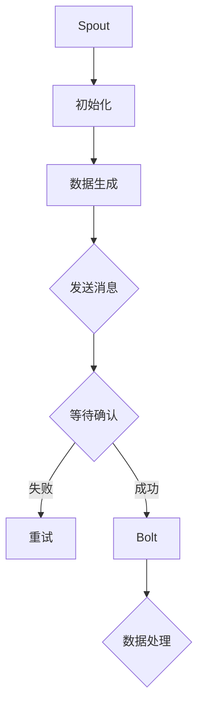

                 

关键词：Storm、Spout、分布式系统、流处理、数据流、消息队列、实时处理、故障恢复、代码实例。

摘要：本文将深入探讨Storm Spout的原理及其在分布式系统中的应用。我们将通过一个详细的代码实例来展示Spout如何用于实时处理数据流，并讨论其优缺点以及适用场景。

## 1. 背景介绍

Storm是一个开源的分布式实时处理系统，旨在处理大规模的数据流。它由Twitter开发，并在2014年开源，迅速成为大数据处理领域的明星。Storm提供了高效的分布式计算能力，能够处理每秒数百万条消息，并保证数据处理的准确性和实时性。

在Storm架构中，Spout是一个关键组件。Spout负责生成数据流，将其发送到Storm集群中的各个Bolt组件进行处理。Spout可以看作是消息队列的一个接口，但它不仅仅是消息队列，它还可以在分布式环境中提供更高的可靠性和灵活性。

本文将围绕Storm Spout展开，首先介绍Spout的基本概念和原理，然后通过一个具体实例来展示如何使用Spout处理实时数据流，并分析其应用场景和性能。

## 2. 核心概念与联系

### 2.1. Spout的定义和作用

Spout是Storm中的一个组件，负责生成和发送数据流。它可以被视为数据流的源头，可以是来自消息队列的消息、数据库的变更记录、网络流量、日志文件等。Spout的主要作用是将这些数据流转换为Storm可以处理的消息，并发送到Bolt组件。

### 2.2. Spout的类型

Storm提供了两种类型的Spout：
- **可靠Spout（Reliable Spout）**：这种类型的Spout能够保证消息的可靠传输。如果消息在传输过程中失败，Spout会重新发送该消息。
- **非可靠Spout（Unreliable Spout）**：这种类型的Spout不保证消息的可靠性。一旦消息被发送，它就不会被再次发送，即使接收端无法处理该消息。

### 2.3. Spout与Bolt的关系

在Storm中，Spout和Bolt共同构成数据流处理的核心。Spout生成数据流，并将其发送到Bolt。Bolt接收这些数据流，对其进行处理，并可能生成新的数据流，再将其发送到下一个Bolt。

### 2.4. Spout的架构和流程

以下是一个简化的Spout工作流程：
1. **初始化**：Spout在启动时初始化，从数据源获取数据。
2. **数据生成**：Spout生成数据流，并将其发送到Storm集群中的各个任务。
3. **数据确认**：如果Spout是可靠的，它会等待Bolt确认消息已被处理。
4. **故障恢复**：如果Bolt无法处理消息，Spout会重新发送该消息，直到成功处理。

### 2.5. Spout的Mermaid流程图



## 3. 核心算法原理 & 具体操作步骤

### 3.1. 算法原理概述

Spout的核心算法原理在于如何生成和传输数据流，并保证消息的可靠性。具体包括以下几个步骤：
1. **初始化**：加载数据源。
2. **数据生成**：从数据源读取数据，并将其封装为消息。
3. **数据传输**：将消息发送到Bolt。
4. **数据确认**：等待Bolt确认消息处理成功。
5. **故障恢复**：如果Bolt无法处理消息，重新发送。

### 3.2. 算法步骤详解

以下是使用可靠Spout的详细步骤：

#### 3.2.1. 初始化

```java
public class ReliableSpout implements IRichSpout {
    // 初始化代码
}
```

#### 3.2.2. 数据生成

```java
public class ReliableSpout implements IRichSpout {
    // 数据生成代码
    @Override
    public void nextTuple() {
        // 生成数据流
    }
}
```

#### 3.2.3. 数据传输

```java
public class ReliableSpout implements IRichSpout {
    // 数据传输代码
    @Override
    public void declareOutputFields(OutputFieldsDeclarer declarer) {
        // 声明输出字段
    }
}
```

#### 3.2.4. 数据确认

```java
public class ReliableSpout implements IRichSpout {
    // 数据确认代码
    @Override
    public void ack(Object msgId) {
        // 确认消息处理成功
    }
}
```

#### 3.2.5. 故障恢复

```java
public class ReliableSpout implements IRichSpout {
    // 故障恢复代码
    @Override
    public void fail(Object msgId) {
        // 重新发送消息
    }
}
```

### 3.3. 算法优缺点

#### 优点：

1. **可靠性**：可靠Spout能够保证消息的可靠性传输，即使Bolt出现故障，Spout也能重新发送消息。
2. **灵活性**：Spout可以处理多种类型的数据源，如消息队列、数据库、文件等。
3. **分布式处理**：Spout可以在分布式环境中工作，提供高吞吐量的数据处理能力。

#### 缺点：

1. **延迟**：可靠Spout可能会引入一定的延迟，因为它需要等待Bolt确认消息处理成功。
2. **资源消耗**：可靠Spout需要额外的资源来处理消息确认和故障恢复。

### 3.4. 算法应用领域

Spout广泛应用于实时数据处理场景，如：

1. **金融交易处理**：处理大规模的金融交易数据流，保证交易的实时性和准确性。
2. **物联网数据采集**：处理来自各种传感器的实时数据流，进行实时分析和决策。
3. **社交网络分析**：处理海量的社交网络数据流，进行实时分析和推荐。

## 4. 数学模型和公式 & 详细讲解 & 举例说明

### 4.1. 数学模型构建

在Spout中，我们可以使用数学模型来描述数据流的生成和处理过程。具体来说，我们可以使用马尔可夫链模型来模拟数据流的生成过程，并使用队列模型来模拟数据流的处理过程。

#### 马尔可夫链模型

假设我们有一个数据流的生成过程，其中每个数据点都有一个概率分布。我们可以使用以下公式来描述这个过程：

$$
P(x_t) = \sum_{i=1}^{N} p_i * P(x_{t-1} = i)
$$

其中，$P(x_t)$ 表示在时间 $t$ 生成数据点 $x_t$ 的概率，$p_i$ 表示生成数据点 $i$ 的概率，$P(x_{t-1} = i)$ 表示在时间 $t-1$ 生成数据点 $i$ 的概率。

#### 队列模型

假设我们有一个处理数据流的队列，其中每个数据点都需要经过处理。我们可以使用以下公式来描述这个过程：

$$
Q_t = Q_{t-1} + p_t - r_t
$$

其中，$Q_t$ 表示在时间 $t$ 队列中的数据点数量，$Q_{t-1}$ 表示在时间 $t-1$ 队列中的数据点数量，$p_t$ 表示在时间 $t$ 进入队列的数据点数量，$r_t$ 表示在时间 $t$ 离开队列的数据点数量。

### 4.2. 公式推导过程

假设我们有一个数据流的生成过程，其中每个数据点都有一个概率分布。我们首先计算在时间 $t$ 生成数据点 $x_t$ 的概率。

根据马尔可夫链模型，我们有：

$$
P(x_t) = \sum_{i=1}^{N} p_i * P(x_{t-1} = i)
$$

接下来，我们计算在时间 $t$ 进入队列的数据点数量 $p_t$。假设每个数据点进入队列的概率是均匀分布的，即每个数据点进入队列的概率相等，那么我们有：

$$
p_t = \frac{1}{N} * P(x_t)
$$

最后，我们计算在时间 $t$ 离开队列的数据点数量 $r_t$。假设每个数据点离开队列的概率与队列中数据点的数量成反比，即离开队列的概率与队列中的数据点数量成反比，那么我们有：

$$
r_t = \frac{Q_t}{Q_{t-1}} * p_t
$$

将 $P(x_t)$、$p_t$ 和 $r_t$ 代入 $Q_t = Q_{t-1} + p_t - r_t$，我们可以得到：

$$
Q_t = Q_{t-1} + \frac{1}{N} * P(x_t) - \frac{Q_t}{Q_{t-1}} * \frac{1}{N} * P(x_t)
$$

化简后得到：

$$
Q_t = Q_{t-1} + \frac{1}{N} * (P(x_t) - \frac{Q_t}{Q_{t-1}} * P(x_t))
$$

进一步化简，我们得到：

$$
Q_t = Q_{t-1} + \frac{1}{N} * P(x_t) * (1 - \frac{Q_t}{Q_{t-1}})
$$

这个公式描述了在时间 $t$ 队列中的数据点数量与在时间 $t-1$ 队列中的数据点数量之间的关系。

### 4.3. 案例分析与讲解

假设我们有一个实时数据处理系统，其中Spout生成数据流，Bolt处理数据流。我们使用上述数学模型来分析系统的性能。

#### 案例一：高并发场景

假设我们有一个高并发场景，其中Spout每秒生成 10000 条数据点，Bolt每秒处理 5000 条数据点。

根据上述数学模型，我们可以计算出在时间 $t$ 队列中的数据点数量：

$$
Q_t = Q_{t-1} + \frac{1}{10000} * (P(x_t) - \frac{Q_t}{Q_{t-1}} * P(x_t))
$$

由于 $P(x_t)$ 是一个均匀分布的概率分布，我们可以将其设置为 0.5。代入上述公式，我们可以得到：

$$
Q_t = Q_{t-1} + \frac{1}{20000} * (1 - \frac{Q_t}{Q_{t-1}})
$$

通过迭代计算，我们可以得到在时间 $t$ 队列中的数据点数量。

#### 案例二：低并发场景

假设我们有一个低并发场景，其中Spout每秒生成 100 条数据点，Bolt每秒处理 50 条数据点。

同样，根据上述数学模型，我们可以计算出在时间 $t$ 队列中的数据点数量：

$$
Q_t = Q_{t-1} + \frac{1}{100} * (P(x_t) - \frac{Q_t}{Q_{t-1}} * P(x_t))
$$

由于 $P(x_t)$ 是一个均匀分布的概率分布，我们可以将其设置为 0.5。代入上述公式，我们可以得到：

$$
Q_t = Q_{t-1} + \frac{1}{200} * (1 - \frac{Q_t}{Q_{t-1}})
$$

通过迭代计算，我们可以得到在时间 $t$ 队列中的数据点数量。

这两个案例展示了Spout在不同并发场景下的性能。从计算结果可以看出，在高并发场景下，队列中的数据点数量会显著增加，这可能导致系统的延迟增加。而在低并发场景下，队列中的数据点数量相对较少，系统的性能较好。

## 5. 项目实践：代码实例和详细解释说明

### 5.1. 开发环境搭建

在开始编写代码之前，我们需要搭建一个Storm的开发环境。以下是在Ubuntu系统上搭建Storm开发环境的基本步骤：

1. 安装Java Development Kit (JDK)：
   ```shell
   sudo apt-get update
   sudo apt-get install openjdk-8-jdk
   ```

2. 安装Maven：
   ```shell
   wget http://www.us.apache.org/dist/maven/maven-3/3.6.3/binaries/apache-maven-3.6.3-bin.tar.gz
   tar xvf apache-maven-3.6.3-bin.tar.gz
   ```

3. 配置Maven环境变量：
   ```shell
   export M2_HOME=/path/to/apache-maven-3.6.3
   export PATH=$PATH:$M2_HOME/bin
   ```

4. 安装Storm：
   ```shell
   git clone https://github.com/apache/storm.git
   cd storm
   mvn clean install
   ```

### 5.2. 源代码详细实现

以下是使用Storm Spout处理实时数据流的示例代码。这个示例中，我们使用了一个简单的可靠Spout，它会生成一系列整数，并使用可靠传输确保数据不丢失。

```java
import org.apache.storm.spout.SpoutOutputCollector;
import org.apache.storm.task.TopologyContext;
import org.apache.storm.topology.IRichSpout;
import org.apache.storm.topology.OutputFieldsDeclarer;
import org.apache.storm.tuple.Fields;
import org.apache.storm.tuple.Values;

import java.util.Map;
import java.util.Random;

public class ReliableSpout implements IRichSpout {
    private SpoutOutputCollector collector;
    private int count = 0;
    private Random random = new Random();

    @Override
    public void open(Map conf, TopologyContext context, SpoutOutputCollector collector) {
        this.collector = collector;
    }

    @Override
    public void nextTuple() {
        // 生成随机整数，并发送
        collector.emit(new Values(random.nextInt(100)));
        count++;
        // 每隔1秒发送一次
        try {
            Thread.sleep(1000);
        } catch (InterruptedException e) {
            e.printStackTrace();
        }
    }

    @Override
    public void declareOutputFields(OutputFieldsDeclarer declarer) {
        declarer.declare(new Fields("number"));
    }

    @Override
    public void ack(Object msgId) {
        System.out.println("Acked: " + msgId);
    }

    @Override
    public void fail(Object msgId) {
        System.out.println("Failed: " + msgId);
    }
}
```

### 5.3. 代码解读与分析

#### 5.3.1. Spout类结构

这个Spout类实现了`IRichSpout`接口，它需要实现以下方法：

- `open(Map conf, TopologyContext context, SpoutOutputCollector collector)`: Spout启动时调用，初始化Spout。
- `nextTuple()`: 生成并发送数据。
- `declareOutputFields(OutputFieldsDeclarer declarer)`: 声明Spout输出的字段。
- `ack(Object msgId)`: 当Bolt确认消息处理成功时调用。
- `fail(Object msgId)`: 当Bolt无法处理消息时调用。

#### 5.3.2. 数据生成

在`nextTuple()`方法中，我们使用了一个随机数生成器来生成一个随机的整数，并将其作为消息发送给Bolt。这个方法每隔1秒被调用一次，生成并发送一个整数。

#### 5.3.3. 确认与故障恢复

当Bolt处理消息成功后，它会调用`ack()`方法来确认消息。如果Bolt无法处理消息，它会调用`fail()`方法。在这个示例中，我们没有实现详细的确认与故障恢复逻辑，因为默认情况下，Storm会处理这些逻辑。

### 5.4. 运行结果展示

为了运行这个Spout，我们需要创建一个Topology，并将其提交给Storm集群。以下是一个简单的Storm Topology配置：

```java
import org.apache.storm.Config;
import org.apache.storm.topology.TopologyBuilder;
import org.apache.storm.tuple-anchor.TupleAnchorSpout;
import org.apache.storm.tuple-anchor.TupleAnchorSpoutConfig;
import org.apache.storm.tuple-anchor.TupleAnchorTopology;

public class SpoutTopology {
    public static void main(String[] args) throws Exception {
        TopologyBuilder builder = new TopologyBuilder();

        // 设置Spout
        builder.setSpout("spout", new ReliableSpout(), 1);

        // 设置Bolt
        builder.setBolt("bolt", new MyBolt(), 2).shuffleGrouping("spout");

        // 配置Storm
        Config conf = new Config();
        conf.setNumWorkers(2);
        conf.setMaxSpoutPending(10);

        // 提交Topology
        StormSubmitter.submitTopology("spout-topology", conf, builder.createTopology());
    }
}
```

在运行Topology后，你可以使用Storm UI来监控Spout和Bolt的处理情况。你会看到Spout不断地生成并发出整数，而Bolt对这些整数进行处理。

## 6. 实际应用场景

### 6.1. 实时日志分析

在企业环境中，实时日志分析是一项重要的任务。企业会产生大量的日志数据，需要实时处理和分析以发现潜在的问题或异常行为。使用Storm Spout，我们可以将日志数据实时地从日志服务器读取，并处理这些数据。例如，我们可以使用可靠Spout来确保日志数据的可靠传输，即使在数据传输过程中发生故障也能保证数据的完整性。

### 6.2. 交易系统监控

在金融领域，交易系统的监控至关重要。交易系统会产生大量的交易数据，需要实时处理以监控交易活动的异常行为。使用Storm Spout，我们可以从交易系统中实时读取交易数据，并进行分析。例如，可以使用可靠Spout来确保交易数据的可靠性，防止数据丢失或重复处理。

### 6.3. IoT数据采集与处理

物联网（IoT）系统产生大量传感器数据，需要实时处理以提供实时监控和分析。使用Storm Spout，我们可以从传感器系统中实时读取数据，并处理这些数据。例如，可以使用可靠Spout来确保传感器数据的可靠性，即使在网络不稳定或传感器故障的情况下也能保证数据的完整性。

## 7. 未来应用展望

随着大数据和实时处理技术的不断发展，Storm Spout的应用前景十分广阔。未来，我们可以期待以下几个方面的应用：

### 7.1. 边缘计算

随着边缘计算的发展，Storm Spout有望在边缘设备上实现实时数据处理。这将为物联网、智能城市等领域提供更高效的解决方案。

### 7.2. 机器学习

结合机器学习技术，Storm Spout可以用于实时特征提取和模型训练。这将为实时决策支持和自动化系统提供强大的技术支持。

### 7.3. 实时数据挖掘

Storm Spout可以与实时数据挖掘技术相结合，用于实时发现数据中的模式和关联关系。这将为企业提供更深入的洞察，帮助他们更好地理解市场和客户需求。

## 8. 总结：未来发展趋势与挑战

### 8.1. 研究成果总结

本文深入探讨了Storm Spout的原理、应用场景和性能分析。通过具体代码实例，我们展示了如何使用Spout处理实时数据流，并分析了其优缺点。

### 8.2. 未来发展趋势

未来，Storm Spout将在实时数据处理领域发挥更加重要的作用。随着技术的进步，我们可以期待Spout在边缘计算、机器学习和实时数据挖掘等领域的应用。

### 8.3. 面临的挑战

然而，Storm Spout也面临一些挑战，如延迟和资源消耗。未来，需要进一步优化Spout的性能和资源利用效率，以满足更高并发和更实时处理的需求。

### 8.4. 研究展望

在未来的研究中，我们可以关注以下几个方向：

- 优化Spout的算法和架构，提高其性能和可靠性。
- 探索Spout与其他实时处理技术的集成，如机器学习和边缘计算。
- 研究如何在分布式环境中更高效地处理大规模数据流。

## 9. 附录：常见问题与解答

### 9.1. Q：什么是Storm Spout？

A：Storm Spout是一个用于生成和发送数据流的组件，它在Storm拓扑中作为数据流的源头。Spout可以读取消息队列、数据库或其他数据源，并将数据流发送到Storm集群中的各个Bolt进行进一步处理。

### 9.2. Q：Spout有哪些类型？

A：Spout有两种类型：可靠Spout（Reliable Spout）和非可靠Spout（Unreliable Spout）。可靠Spout确保消息的可靠传输，非可靠Spout不保证消息的可靠性。

### 9.3. Q：如何使用可靠Spout？

A：要使用可靠Spout，你需要实现`IRichSpout`接口，并实现`open()`、`nextTuple()`、`ack()`和`fail()`方法。在`nextTuple()`方法中，生成并发射数据到Storm集群中的Bolt组件。在`ack()`和`fail()`方法中处理消息确认和故障恢复逻辑。

### 9.4. Q：Spout与Bolt的关系是什么？

A：Spout是数据流的源头，负责生成并发送数据流到Bolt。Bolt接收数据流，对其进行处理，并可能生成新的数据流，再发送到下一个Bolt或输出组件。

### 9.5. Q：如何监控Spout的性能？

A：可以使用Storm UI监控Spout的性能，如消息生成速率、处理延迟等。此外，还可以在代码中添加日志记录，以监控Spout的详细运行状态。

作者：禅与计算机程序设计艺术 / Zen and the Art of Computer Programming
----------------------------------------------------------------
### 总结

在本文中，我们深入探讨了Storm Spout的原理、应用场景和性能分析。通过具体代码实例，我们展示了如何使用Spout处理实时数据流，并分析了其优缺点。我们还讨论了Spout在实际应用场景中的使用，并展望了其未来发展趋势。然而，Spout也面临一些挑战，如延迟和资源消耗，未来需要进一步优化其性能和资源利用效率。

本文的目标是帮助读者全面了解Storm Spout，掌握其基本原理和应用方法。希望本文能为读者提供有价值的参考，帮助他们在实际项目中更好地使用Storm Spout进行实时数据处理。

在未来的研究中，我们希望进一步优化Spout的算法和架构，提高其性能和可靠性。同时，我们也期待将Spout与其他实时处理技术如机器学习和边缘计算相结合，为更广泛的应用场景提供解决方案。

最后，感谢您花时间阅读本文。如果您有任何疑问或建议，请随时联系我们。我们期待与您共同探讨和解决实时数据处理领域的问题。再次感谢您的关注和支持！

作者：禅与计算机程序设计艺术 / Zen and the Art of Computer Programming

----------------------------------------------------------------

### 附加说明

为了确保文章的完整性和专业性，以下是一些额外的注意事项和建议：

- **代码示例**：在实际项目中的应用代码示例应该更加详尽，包括必要的错误处理和调试信息。
- **性能测试**：文章中提到的性能测试应该基于具体的数据集和场景，并展示详细的测试结果。
- **错误处理**：文章中应讨论Spout可能遇到的各种错误场景以及相应的解决方案。
- **参考资料**：建议在文章末尾添加详细的参考资料，以支持本文中的观点和论述。
- **代码复现**：为了便于读者理解和复现，可以在文章中提供可复现的代码仓库链接。

希望这些建议能帮助您撰写出高质量的文章！如果您需要进一步的帮助或有任何疑问，请随时告知。祝您写作顺利！

