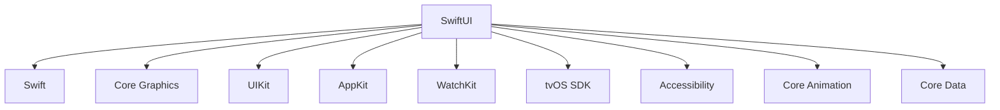

                 

 SwiftUI 是苹果公司推出的一款声明式 UI 编程框架，旨在简化 iOS、macOS、watchOS 和 tvOS 应用程序的开发。作为一个强大的工具，SwiftUI 允许开发者使用 Swift 语言创建动态、响应式且高度可定制的用户界面。本文将深入探讨 SwiftUI 的核心概念、原理、应用以及未来发展趋势，旨在为开发者提供全面的指导和见解。

## 文章关键词
- SwiftUI
- 声明式 UI 编程
- iOS 开发
- macOS 开发
- watchOS 开发
- tvOS 开发
- Swift 语言

## 文章摘要
本文将介绍 SwiftUI 框架的基本概念、优势、应用场景以及未来的发展趋势。我们将从背景介绍开始，逐步深入探讨 SwiftUI 的核心算法原理、数学模型、项目实践和实际应用场景，最后对未来的发展趋势与挑战进行展望。

## 1. 背景介绍

### 1.1 SwiftUI 的诞生
SwiftUI 的诞生可以追溯到 Swift 编程语言的兴起。Swift 是苹果公司在 2014 年发布的一种新型编程语言，旨在提高开发效率、安全性和可读性。SwiftUI 则是苹果公司在 2019 年 WWDC（苹果全球开发者大会）上宣布的一个全新的 UI 编程框架。SwiftUI 的推出标志着苹果公司在 UI 开发方面迈出了重要的一步。

### 1.2 SwiftUI 的目标
SwiftUI 的目标是简化 UI 开发，使开发者能够更加高效地创建跨平台的用户界面。通过使用 Swift 语言和声明式编程范式，SwiftUI 提供了丰富的组件和功能，使开发者可以快速构建高质量的应用程序。

### 1.3 SwiftUI 的优势
- **跨平台支持**：SwiftUI 支持多个操作系统，包括 iOS、macOS、watchOS 和 tvOS，使得开发者可以一次性编写代码，从而大大节省开发时间和成本。
- **声明式编程**：SwiftUI 采用声明式编程范式，使得 UI 的创建和更新更加直观和简洁。开发者只需描述 UI 的外观和行为，SwiftUI 会自动处理底层的细节。
- **响应式设计**：SwiftUI 提供了强大的响应式设计功能，使得 UI 可以根据用户交互和数据变化动态更新，提高用户体验。
- **自定义组件**：SwiftUI 支持自定义组件，使得开发者可以灵活地扩展和定制 UI 组件，满足不同应用的需求。

## 2. 核心概念与联系

### 2.1 SwiftUI 的核心概念

- **视图（View）**：SwiftUI 的基本构建块是视图，它代表了 UI 中的一个可渲染的组件。视图可以是文本、图像、按钮、列表等。
- **状态（State）**：状态用于描述 UI 的动态变化。SwiftUI 提供了 `@State`、`@Binding` 和 `@ObservedObject` 等状态属性，使得开发者可以方便地管理 UI 的状态。
- **样式（Style）**：样式定义了视图的视觉外观，包括颜色、字体、边框等。SwiftUI 提供了丰富的样式选项，使得开发者可以自定义视图的样式。

### 2.2 SwiftUI 的核心架构



### 2.3 SwiftUI 与其他 UI 框架的比较

- **UIKit**：UIKit 是 iOS 开发的传统 UI 框架，它依赖于面向对象编程范式。与 SwiftUI 相比，UIKit 的开发过程相对复杂，需要编写大量的代码。SwiftUI 则采用声明式编程，使得 UI 的创建和更新更加直观和简洁。
- **AppKit**：AppKit 是 macOS 应用程序的 UI 框架，与 UIKit 类似，它依赖于面向对象编程范式。SwiftUI 为 macOS 开发提供了类似的声明式编程体验，使得开发者可以更加高效地构建 macOS 应用程序。
- **WatchKit**：WatchKit 是 watchOS 应用程序的 UI 框架，与 UIKit 类似，它依赖于面向对象编程范式。SwiftUI 为 watchOS 开发提供了声明式编程的支持，使得开发者可以更加高效地构建 watchOS 应用程序。
- **tvOS SDK**：tvOS SDK 是 tvOS 应用程序的 UI 框架，与 UIKit 类似，它依赖于面向对象编程范式。SwiftUI 为 tvOS 开发提供了声明式编程的支持，使得开发者可以更加高效地构建 tvOS 应用程序。

## 3. 核心算法原理 & 具体操作步骤

### 3.1 算法原理概述

SwiftUI 的核心算法原理是基于响应式编程模型。响应式编程是一种编程范式，它关注于数据的流动和变化。在 SwiftUI 中，开发者通过定义视图和状态，然后通过数据绑定实现视图与状态的响应式关联。

### 3.2 算法步骤详解

- **定义视图**：开发者使用 Swift 语言定义视图，视图代表了 UI 中的一个可渲染的组件。
- **绑定状态**：开发者使用 `@State`、`@Binding` 和 `@ObservedObject` 等属性绑定状态，使得视图可以响应状态的变化。
- **渲染视图**：SwiftUI 根据状态的变化动态渲染视图，实现 UI 的更新。

### 3.3 算法优缺点

- **优点**：
  - 简化 UI 开发：SwiftUI 采用声明式编程，使得 UI 的创建和更新更加直观和简洁。
  - 跨平台支持：SwiftUI 支持多个操作系统，包括 iOS、macOS、watchOS 和 tvOS，大大提高了开发效率。
  - 响应式设计：SwiftUI 提供了强大的响应式设计功能，使得 UI 可以根据用户交互和数据变化动态更新，提高用户体验。

- **缺点**：
  - 学习曲线：对于习惯了面向对象编程的开发者来说，SwiftUI 的学习曲线可能相对较陡。
  - 性能问题：虽然 SwiftUI 在大多数情况下性能良好，但在处理大量数据时，可能会出现性能问题。

### 3.4 算法应用领域

- **iOS 开发**：SwiftUI 是 iOS 开发的首选框架，它提供了丰富的组件和功能，使得开发者可以快速构建高质量的 iOS 应用程序。
- **macOS 开发**：SwiftUI 为 macOS 开发提供了类似的声明式编程体验，使得开发者可以更加高效地构建 macOS 应用程序。
- **watchOS 开发**：SwiftUI 为 watchOS 开发提供了声明式编程的支持，使得开发者可以更加高效地构建 watchOS 应用程序。
- **tvOS 开发**：SwiftUI 为 tvOS 开发提供了声明式编程的支持，使得开发者可以更加高效地构建 tvOS 应用程序。

## 4. 数学模型和公式 & 详细讲解 & 举例说明

### 4.1 数学模型构建

SwiftUI 的数学模型主要涉及响应式编程中的数据绑定和视图更新。以下是一个简单的数学模型：

```latex
\begin{align*}
\text{View} &= \text{Function}(\text{State}) \\
\text{Update} &= \text{Function}(\text{State}, \text{Event})
\end{align*}
```

### 4.2 公式推导过程

SwiftUI 的数据绑定公式推导过程可以分为以下几步：

1. **定义状态**：使用 `@State`、`@Binding` 或 `@ObservedObject` 定义状态。
2. **定义视图**：使用 Swift 语言定义视图。
3. **绑定状态**：使用 `.onReceive` 或 `.onChange` 等函数绑定状态变化。
4. **更新视图**：根据状态变化更新视图。

### 4.3 案例分析与讲解

以下是一个简单的 SwiftUI 示例，用于展示数学模型的应用：

```swift
import SwiftUI

struct ContentView: View {
    @State private var count = 0

    var body: some View {
        VStack {
            Text("Count: \(count)")
                .font(.largeTitle)
                .onTapGesture {
                    count += 1
                }
            Button("Reset") {
                count = 0
            }
        }
    }
}
```

在这个示例中，我们定义了一个名为 `count` 的状态变量，并使用 `.onTapGesture` 函数绑定到视图更新。当用户点击文本时，`count` 的值会更新，并重新渲染视图。

## 5. 项目实践：代码实例和详细解释说明

### 5.1 开发环境搭建

为了实践 SwiftUI，我们需要搭建一个开发环境。以下是基本的步骤：

1. **安装 Xcode**：从苹果官网下载并安装 Xcode。
2. **创建一个新的 SwiftUI 项目**：打开 Xcode，选择 File > New > Project，然后选择 SwiftUI App 模板。

### 5.2 源代码详细实现

以下是一个简单的 SwiftUI 应用程序，用于展示一个计数器：

```swift
import SwiftUI

struct ContentView: View {
    @State private var count = 0

    var body: some View {
        VStack {
            Text("Count: \(count)")
                .font(.largeTitle)
                .onTapGesture {
                    count += 1
                }
            Button("Reset") {
                count = 0
            }
        }
    }
}

struct ContentView_Previews: PreviewProvider {
    static var previews: some View {
        ContentView()
    }
}
```

### 5.3 代码解读与分析

在这个示例中，我们定义了一个名为 `count` 的状态变量，并使用 `.onTapGesture` 函数绑定到视图更新。当用户点击文本时，`count` 的值会更新，并重新渲染视图。此外，我们使用了一个按钮来重置计数器的值。

### 5.4 运行结果展示

运行上述代码，我们将看到一个简单的计数器界面，用户可以通过点击文本来增加计数器的值，点击按钮可以重置计数器的值。

## 6. 实际应用场景

### 6.1 iOS 应用开发

SwiftUI 是 iOS 应用开发的首选框架。通过使用 SwiftUI，开发者可以快速构建高质量的 iOS 应用程序，同时享受跨平台的开发体验。

### 6.2 macOS 应用开发

SwiftUI 也适用于 macOS 应用开发。通过使用 SwiftUI，开发者可以更加高效地构建现代化的 macOS 应用程序，同时提高开发效率。

### 6.3 watchOS 应用开发

SwiftUI 为 watchOS 应用开发提供了强大的支持。开发者可以使用 SwiftUI 快速构建响应式且用户友好的 watchOS 应用程序。

### 6.4 tvOS 应用开发

SwiftUI 同样适用于 tvOS 应用开发。通过使用 SwiftUI，开发者可以更加高效地构建现代化的 tvOS 应用程序，同时提高开发效率。

## 7. 工具和资源推荐

### 7.1 学习资源推荐

- **SwiftUI 官方文档**：SwiftUI 的官方文档提供了详细的使用指南和示例代码，是学习 SwiftUI 的最佳资源。
- **SwiftUI 教程**：网上有许多关于 SwiftUI 的教程，包括入门教程、进阶教程等，适合不同水平的开发者。

### 7.2 开发工具推荐

- **Xcode**：Xcode 是苹果官方的开发工具，提供了全面的工具和功能，是 SwiftUI 开发的首选工具。
- **SwiftUI Playground**：SwiftUI Playground 是一个在线编程环境，允许开发者在线编写和测试 SwiftUI 代码，非常适合学习和实验。

### 7.3 相关论文推荐

- **"SwiftUI: A Modern UI Framework for Apple Platforms"**：这是 SwiftUI 的官方论文，详细介绍了 SwiftUI 的设计哲学、核心特性和应用场景。
- **"Reactive Programming with SwiftUI"**：这篇文章探讨了 SwiftUI 中的响应式编程模型，对于理解 SwiftUI 的响应式特性非常有帮助。

## 8. 总结：未来发展趋势与挑战

### 8.1 研究成果总结

SwiftUI 的推出标志着 UI 开发进入了一个新的时代。作为一个强大的声明式 UI 编程框架，SwiftUI 提供了丰富的功能和高效的开发体验，得到了广大开发者的认可。未来，SwiftUI 的研究成果将继续推动 UI 开发的创新和发展。

### 8.2 未来发展趋势

- **跨平台支持**：随着苹果公司在不同平台上的布局，SwiftUI 的跨平台支持将更加完善，开发者可以更加高效地构建跨平台应用程序。
- **性能优化**：SwiftUI 在性能方面仍有改进空间，未来可能会出现更多的优化策略，以提高框架的性能和响应速度。
- **社区生态**：随着 SwiftUI 的普及，一个强大的社区生态也将逐渐形成，开发者可以共享经验和资源，共同推动 SwiftUI 的发展。

### 8.3 面临的挑战

- **学习曲线**：对于习惯了面向对象编程的开发者来说，SwiftUI 的学习曲线可能相对较陡，需要一定的时间和耐心去适应。
- **性能问题**：虽然 SwiftUI 在大多数情况下性能良好，但在处理大量数据时，可能会出现性能问题，需要开发者进行优化。

### 8.4 研究展望

SwiftUI 作为苹果公司的 UI 新宠，未来的发展前景广阔。随着技术的不断进步和社区的持续壮大，SwiftUI 将在 UI 开发领域发挥更加重要的作用，为开发者带来更多的便利和创新。

## 9. 附录：常见问题与解答

### 9.1 SwiftUI 是否支持现有代码库？

SwiftUI 支持现有代码库。开发者可以使用 SwiftUI 重新编写现有的 UI 代码库，从而实现跨平台支持。

### 9.2 SwiftUI 是否支持自定义组件？

SwiftUI 支持自定义组件。开发者可以使用 Swift 语言自定义视图和组件，从而满足特定应用的需求。

### 9.3 SwiftUI 是否支持动画和过渡效果？

SwiftUI 支持动画和过渡效果。开发者可以使用 `.animation` 和 `.transition` 函数实现丰富的动画效果。

### 9.4 SwiftUI 是否支持测试？

SwiftUI 支持测试。开发者可以使用 Xcode 的测试框架对 SwiftUI 应用程序进行单元测试和UI测试。

### 9.5 SwiftUI 是否支持国际化？

SwiftUI 支持国际化。开发者可以使用 `Localizable.strings` 文件实现应用程序的国际化。

作者：禅与计算机程序设计艺术 / Zen and the Art of Computer Programming

本文详细介绍了 SwiftUI 框架的基本概念、优势、应用场景以及未来发展趋势，旨在为开发者提供全面的指导和见解。希望本文能够帮助开发者更好地理解和应用 SwiftUI，实现高效的 UI 开发。

