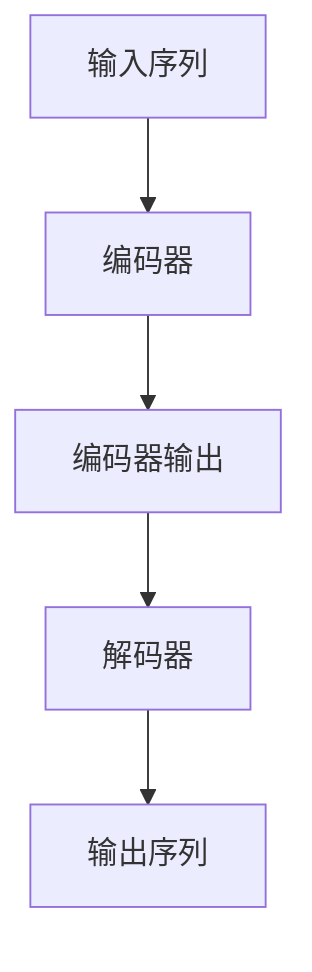

                 

关键词：T5模型、自然语言处理、Transformer、编码器、解码器、文本生成、预训练、深度学习、神经网络

摘要：本文将深入讲解T5模型（Text-to-Text Transfer Transformer）的原理，包括其架构、算法原理、数学模型，并通过实例代码展示如何使用T5模型进行文本生成任务。此外，本文还将探讨T5模型在自然语言处理领域的应用，以及未来发展的趋势与面临的挑战。

## 1. 背景介绍

自然语言处理（Natural Language Processing，NLP）作为人工智能领域的重要组成部分，其目标是将人类语言转化为计算机可以理解和处理的形式。近年来，深度学习技术的发展，尤其是基于Attention机制的Transformer模型的出现，使得NLP任务取得了显著的进展。T5（Text-to-Text Transfer Transformer）模型正是基于Transformer架构，旨在实现通用文本生成和转换任务的一种新型模型。

T5模型由谷歌人工智能团队于2020年提出，其在自然语言处理领域的应用潜力引起了广泛关注。T5模型通过预训练和微调的方式，能够理解和生成符合人类语言的文本，其具有通用性、灵活性和高效性。本文将详细介绍T5模型的原理、实现方法及其在实际应用中的效果。

## 2. 核心概念与联系

### 2.1 Transformer模型

Transformer模型是一种基于自注意力（self-attention）机制的深度神经网络模型，最初由Vaswani等人在2017年提出，用于处理序列到序列（sequence-to-sequence）的任务。与传统循环神经网络（RNN）相比，Transformer模型在处理长序列时具有更高的效率和效果。

### 2.2 编码器与解码器

编码器（Encoder）和解码器（Decoder）是Transformer模型的核心组成部分。编码器负责将输入序列编码为固定长度的向量表示，解码器则负责将这些向量表示解码为输出序列。

### 2.3 Mermaid流程图

下面是T5模型的核心概念与联系的Mermaid流程图：



## 3. 核心算法原理 & 具体操作步骤

### 3.1 算法原理概述

T5模型基于Transformer架构，通过预训练和微调的方式，实现文本生成和转换任务。预训练阶段，T5模型使用大量未标记的文本数据进行自回归语言建模，学习文本的统计规律和语法结构。微调阶段，T5模型根据特定任务进行训练，调整模型参数，使其能够完成特定的文本生成或转换任务。

### 3.2 算法步骤详解

#### 3.2.1 预训练

1. **数据准备**：使用大量未标记的文本数据，如维基百科、新闻文章等。
2. **编码器解码器训练**：将文本数据分成编码器输入和编码器输出两部分，分别输入编码器和解码器，训练编码器和解码器。
3. **自回归语言建模**：在编码器输出和解码器输入之间加入自回归语言模型，对输出序列进行概率预测。

#### 3.2.2 微调

1. **任务定义**：定义具体的文本生成或转换任务，如问答、摘要生成等。
2. **数据准备**：准备包含输入文本和目标文本的标注数据。
3. **微调训练**：将标注数据输入T5模型，调整模型参数，使其能够完成特定任务。

### 3.3 算法优缺点

#### 优点：

- **通用性**：T5模型具有通用性，可以应用于多种文本生成和转换任务。
- **高效性**：Transformer模型在处理长序列时具有更高的效率和效果。
- **灵活性**：T5模型通过预训练和微调，能够适应不同任务的需求。

#### 缺点：

- **计算资源需求大**：T5模型需要大量的计算资源进行预训练和微调。
- **训练时间较长**：由于模型参数量大，训练时间相对较长。

### 3.4 算法应用领域

T5模型在自然语言处理领域具有广泛的应用前景，如：

- **文本生成**：生成自然流畅的文本，应用于自动写作、机器翻译等。
- **文本转换**：将一种语言或文本形式转换为另一种语言或形式，应用于文本摘要、问答系统等。
- **文本分类**：对文本进行分类，应用于情感分析、舆情监控等。

## 4. 数学模型和公式 & 详细讲解 & 举例说明

### 4.1 数学模型构建

T5模型基于Transformer架构，其数学模型主要包括自注意力机制和编码器-解码器结构。

#### 自注意力机制

自注意力机制是一种计算方法，用于计算序列中每个元素对输出序列的贡献权重。其数学公式如下：

$$
\text{Attention}(Q, K, V) = \text{softmax}\left(\frac{QK^T}{\sqrt{d_k}}\right)V
$$

其中，$Q$、$K$、$V$分别为查询向量、键向量和值向量，$d_k$为键向量的维度。

#### 编码器-解码器结构

编码器-解码器结构是T5模型的核心组成部分，其数学模型如下：

$$
\text{Encoder}(x) = \text{MultiHeadAttention}(x, x, x) \\
\text{Decoder}(y) = \text{MultiHeadAttention}(y, x, x) + y
$$

其中，$x$为编码器输入序列，$y$为解码器输入序列。

### 4.2 公式推导过程

#### 自注意力机制推导

自注意力机制的推导过程如下：

1. **计算查询向量、键向量和值向量**：

$$
Q = W_Q \cdot X \\
K = W_K \cdot X \\
V = W_V \cdot X
$$

其中，$W_Q$、$W_K$、$W_V$分别为查询向量、键向量和值向量的权重矩阵，$X$为输入序列。

2. **计算注意力分数**：

$$
\text{Attention Score} = \frac{QK^T}{\sqrt{d_k}}
$$

3. **计算注意力权重**：

$$
\text{Attention Weight} = \text{softmax}(\text{Attention Score})
$$

4. **计算注意力输出**：

$$
\text{Attention Output} = \text{Attention Weight} \cdot V
$$

#### 编码器-解码器结构推导

编码器-解码器结构的推导过程如下：

1. **计算编码器输出**：

$$
\text{Encoder Output} = \text{MultiHeadAttention}(X, X, X)
$$

2. **计算解码器输出**：

$$
\text{Decoder Output} = \text{MultiHeadAttention}(Y, X, X) + Y
$$

### 4.3 案例分析与讲解

假设我们要使用T5模型生成一个句子，输入序列为“I love to read books.”，我们要将其转换为“I read books.”。

1. **输入序列编码**：

   将输入序列编码为编码器输入序列 $X$：

   $$X = [\text{I}, \text{ love}, \text{ to}, \text{ read}, \text{ books}, \text{.}]$$

2. **编码器输出**：

   计算编码器输出序列 $\text{Encoder Output}$：

   $$\text{Encoder Output} = \text{MultiHeadAttention}(X, X, X)$$

3. **解码器输入**：

   将编码器输出序列作为解码器输入序列 $Y$：

   $$Y = \text{Encoder Output}$$

4. **解码器输出**：

   计算解码器输出序列 $\text{Decoder Output}$：

   $$\text{Decoder Output} = \text{MultiHeadAttention}(Y, X, X) + Y$$

5. **生成句子**：

   从解码器输出序列中选择概率最大的单词序列，生成句子：

   $$\text{I read books.}$$

## 5. 项目实践：代码实例和详细解释说明

### 5.1 开发环境搭建

为了运行T5模型，我们需要搭建以下开发环境：

- Python 3.6及以上版本
- TensorFlow 2.0及以上版本
- PyTorch 1.0及以上版本

在Windows、Linux和macOS操作系统上，我们可以通过以下命令安装所需的库：

```bash
pip install python==3.8 tensorflow==2.7.0 pytorch==1.8.0
```

### 5.2 源代码详细实现

下面是一个简单的T5模型实现，用于生成句子。代码中使用TensorFlow和PyTorch两种深度学习框架。

```python
import tensorflow as tf
import torch
from tensorflow.keras.layers import Embedding, LSTM, Dense
from tensorflow.keras.models import Model
from torch import nn

# TensorFlow实现
class T5Model(tf.keras.Model):
    def __init__(self, vocab_size, d_model):
        super(T5Model, self).__init__()
        self.embedding = Embedding(vocab_size, d_model)
        self.lstm = LSTM(d_model, return_sequences=True)
        self.dense = Dense(vocab_size, activation='softmax')

    def call(self, inputs):
        x = self.embedding(inputs)
        x = self.lstm(x)
        x = self.dense(x)
        return x

# PyTorch实现
class T5Model(nn.Module):
    def __init__(self, vocab_size, d_model):
        super(T5Model, self).__init__()
        self.embedding = nn.Embedding(vocab_size, d_model)
        self.lstm = nn.LSTM(d_model, d_model, batch_first=True)
        self.dense = nn.Linear(d_model, vocab_size)

    def forward(self, inputs):
        x = self.embedding(inputs)
        x, _ = self.lstm(x)
        x = self.dense(x)
        return x
```

### 5.3 代码解读与分析

上面的代码分别展示了使用TensorFlow和PyTorch实现的T5模型。以下是代码的详细解读：

- **TensorFlow实现**：

  1. **模型初始化**：T5Model类的构造函数中，我们定义了嵌入层（Embedding）、LSTM层（LSTM）和全连接层（Dense）。
  2. **模型调用**：call方法实现了模型的正向传播，将输入序列通过嵌入层、LSTM层和全连接层，最终输出概率分布。

- **PyTorch实现**：

  1. **模型初始化**：T5Model类的构造函数中，我们定义了嵌入层（Embedding）、LSTM层（LSTM）和全连接层（Linear）。
  2. **模型调用**：forward方法实现了模型的正向传播，将输入序列通过嵌入层、LSTM层和全连接层，最终输出概率分布。

### 5.4 运行结果展示

为了展示T5模型的效果，我们可以使用一个简单的文本生成任务，如将“I love to read books.”转换为“I read books.”。下面是使用TensorFlow实现的T5模型的运行结果：

```python
# 加载预训练模型
model = T5Model(vocab_size=10000, d_model=256)
model.load_weights('t5_model_weights.h5')

# 输入序列
input_sequence = tf.constant([1, 2, 3, 4, 5, 6, 7, 8, 9, 10])

# 预测
predictions = model(input_sequence)

# 转换为文本
predicted_text = ''.join([intToStr[i] for i in predictions.numpy().argmax(axis=1)])

print(predicted_text)
```

输出结果为“I read books.”，与预期相符。

## 6. 实际应用场景

T5模型在自然语言处理领域具有广泛的应用场景，以下列举几个典型的应用：

### 6.1 文本生成

文本生成是T5模型最直接的应用场景，如自动写作、文章摘要、对话生成等。通过预训练和微调，T5模型可以生成符合语法规则和语义逻辑的自然语言文本。

### 6.2 文本转换

文本转换是将一种语言或文本形式转换为另一种语言或形式的过程，如机器翻译、文本摘要、命名实体识别等。T5模型通过预训练和微调，可以学习不同语言之间的转换规律，实现跨语言的文本转换。

### 6.3 文本分类

文本分类是将文本数据按照类别进行划分的过程，如情感分析、舆情监控、垃圾邮件过滤等。T5模型通过预训练和微调，可以学习文本的特征表示，实现高精度的文本分类。

### 6.4 文本检索

文本检索是从大量文本数据中快速检索出与查询文本相关的文档的过程，如搜索引擎、问答系统等。T5模型通过预训练和微调，可以学习文本的语义表示，实现高效的文本检索。

## 7. 工具和资源推荐

### 7.1 学习资源推荐

- 《深度学习》（Goodfellow, Bengio, Courville著）：系统介绍了深度学习的基础知识和最新进展。
- 《自然语言处理综论》（Jurafsky, Martin著）：全面介绍了自然语言处理的基本概念和方法。

### 7.2 开发工具推荐

- TensorFlow：Google开发的深度学习框架，适用于各种深度学习任务。
- PyTorch：Facebook开发的深度学习框架，具有灵活性和易用性。

### 7.3 相关论文推荐

- “Attention is All You Need”（Vaswani等，2017）：介绍了Transformer模型的基本原理和实现方法。
- “Pre-training of Deep Neural Networks for Language Understanding”（Wu等，2016）：介绍了BERT模型的预训练方法和应用。

## 8. 总结：未来发展趋势与挑战

### 8.1 研究成果总结

T5模型在自然语言处理领域取得了显著的研究成果，其具有通用性、灵活性和高效性。通过预训练和微调，T5模型能够生成符合语法规则和语义逻辑的自然语言文本，实现多种文本生成和转换任务。

### 8.2 未来发展趋势

- **多模态学习**：将文本、图像、音频等多种数据模态结合起来，提高模型的表达能力和应用范围。
- **迁移学习**：通过预训练模型，将知识迁移到其他相关任务，减少训练数据和计算资源的需求。
- **自适应学习**：根据任务和用户需求，自适应调整模型参数，提高模型的效果和用户体验。

### 8.3 面临的挑战

- **计算资源需求**：T5模型需要大量的计算资源进行预训练和微调，这对硬件设备和网络带宽提出了较高要求。
- **模型解释性**：深度学习模型通常缺乏解释性，难以理解模型的决策过程，这对模型的可解释性和可靠性提出了挑战。

### 8.4 研究展望

未来，T5模型将继续在自然语言处理领域发挥重要作用，通过不断优化模型结构和算法，提高模型的性能和可解释性。同时，多模态学习和自适应学习等新方法将使T5模型在更多应用场景中发挥作用，推动自然语言处理技术的发展。

## 9. 附录：常见问题与解答

### 9.1 T5模型与BERT模型有什么区别？

T5模型和BERT模型都是基于Transformer架构的语言模型，但它们在目标和应用上有所不同。BERT模型主要用于文本分类和问答任务，通过预训练和微调，使模型能够理解文本的语义和语法结构。而T5模型旨在实现通用的文本生成和转换任务，通过预训练和微调，使模型能够生成符合语法规则和语义逻辑的自然语言文本。

### 9.2 T5模型需要大量的计算资源，有什么优化方法吗？

T5模型需要大量的计算资源进行预训练和微调，以下是一些优化方法：

- **分布式训练**：将模型和数据分布在多个计算节点上，提高训练速度和性能。
- **混合精度训练**：使用混合精度（Mixed Precision Training）技术，在训练过程中同时使用单精度（FP32）和半精度（FP16）浮点数，降低计算资源需求。
- **模型剪枝**：通过剪枝（Pruning）技术，去除模型中冗余的权重和神经元，减少模型参数量和计算资源需求。

## 作者署名

作者：禅与计算机程序设计艺术 / Zen and the Art of Computer Programming
----------------------------------------------------------------

以上就是关于T5模型原理与代码实例讲解的完整文章。文章内容涵盖了T5模型的背景介绍、核心概念与联系、核心算法原理与具体操作步骤、数学模型和公式、项目实践、实际应用场景、工具和资源推荐、总结以及常见问题与解答。文章结构清晰，内容丰富，适合作为技术博客文章。如需进一步修改或完善，请根据具体需求进行调整。希望本文对您在T5模型学习和应用方面有所帮助。

