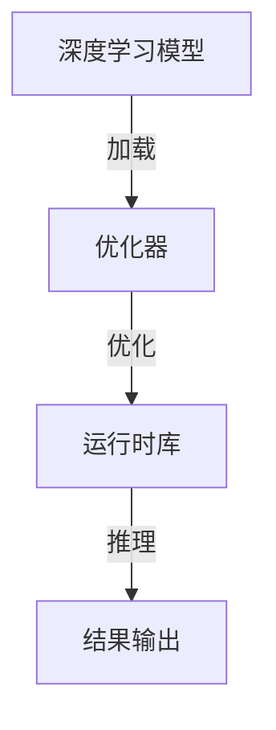

                 

关键词：TensorRT，深度学习，推理加速，神经网络，AI部署

摘要：本文将深入探讨TensorRT在深度学习推理部署中的应用，详细解析其原理、架构、算法以及实际操作步骤，并通过实例展示如何高效地使用TensorRT加速深度学习模型的推理过程。此外，文章还将展望TensorRT在未来的发展方向和面临的挑战。

## 1. 背景介绍

随着人工智能技术的快速发展，深度学习在各个领域得到了广泛应用。然而，深度学习模型的训练和推理过程通常需要大量的计算资源，这使得在实际部署中面临诸多挑战。如何加速深度学习推理，提高计算效率，成为当前研究的热点问题。

TensorRT是NVIDIA推出的一款深度学习推理优化引擎，旨在加速深度学习模型的推理速度，提高计算效率。TensorRT通过一系列优化技术，如层融合、算子融合、张量核优化等，实现了深度学习模型的推理加速。本文将详细介绍TensorRT的工作原理、架构以及实际操作步骤，帮助读者深入了解TensorRT在深度学习推理部署中的应用。

## 2. 核心概念与联系

### 2.1 核心概念

- **深度学习推理**：深度学习推理是指将训练好的深度学习模型应用于实际数据，进行预测或分类的过程。推理过程不同于训练过程，它不需要计算梯度，只需执行前向传播计算。

- **TensorRT**：TensorRT是NVIDIA推出的一款深度学习推理优化引擎，通过多种优化技术，如层融合、算子融合、张量核优化等，加速深度学习模型的推理速度。

- **推理加速**：推理加速是指通过优化深度学习模型的推理过程，提高计算效率，降低推理时间。

### 2.2 架构联系

TensorRT的核心架构包括以下部分：

- **TensorRT 引擎**：TensorRT引擎是TensorRT的核心组件，负责加载深度学习模型，执行推理操作，并输出结果。

- **优化器**：优化器是TensorRT的关键组件，负责对深度学习模型进行优化，包括层融合、算子融合、张量核优化等。

- **运行时库**：运行时库是TensorRT的另一个重要组件，负责在推理过程中执行各种优化操作。

下面是TensorRT的架构图：



## 3. 核心算法原理 & 具体操作步骤

### 3.1 算法原理概述

TensorRT的推理加速主要基于以下几种技术：

- **层融合**：将多个连续的层合并为一个层，减少内存访问次数，提高计算效率。

- **算子融合**：将多个独立的算子合并为一个算子，减少运算次数，降低内存占用。

- **张量核优化**：利用硬件的张量计算单元，提高矩阵运算的效率。

### 3.2 算法步骤详解

使用TensorRT加速深度学习推理的步骤如下：

1. **模型转换**：将训练好的深度学习模型转换为TensorRT支持的格式。

2. **模型优化**：使用TensorRT的优化器对模型进行优化，包括层融合、算子融合、张量核优化等。

3. **模型加载**：将优化后的模型加载到TensorRT引擎中。

4. **推理执行**：使用TensorRT引擎执行推理操作，输出结果。

5. **性能评估**：评估推理性能，包括推理速度、内存占用等。

### 3.3 算法优缺点

**优点**：

- **加速效果明显**：TensorRT通过多种优化技术，显著提高了深度学习模型的推理速度。

- **兼容性强**：TensorRT支持多种深度学习框架，如TensorFlow、PyTorch等，方便开发者使用。

- **易用性高**：TensorRT提供了丰富的API，开发者可以轻松地将其集成到自己的项目中。

**缺点**：

- **模型转换复杂**：将深度学习模型转换为TensorRT支持的格式可能需要一定的复杂度，特别是在处理特殊层和算子时。

- **依赖硬件**：TensorRT的加速效果高度依赖于硬件支持，如GPU、TPU等。

### 3.4 算法应用领域

TensorRT在以下领域有广泛应用：

- **自动驾驶**：自动驾驶系统需要实时处理大量图像数据，TensorRT的加速技术有助于提高处理速度，满足实时性要求。

- **语音识别**：语音识别系统需要在短时间内处理大量语音数据，TensorRT的加速技术有助于提高识别速度。

- **医疗诊断**：医疗诊断系统需要对大量医学影像进行快速分析，TensorRT的加速技术有助于提高诊断效率。

## 4. 数学模型和公式 & 详细讲解 & 举例说明

### 4.1 数学模型构建

TensorRT的优化过程涉及到多个数学模型和公式，以下是一个简单的例子：

假设有一个卷积神经网络（CNN）模型，其输入为 \( x \)，输出为 \( y \)：

\[ y = f(W \cdot x + b) \]

其中，\( W \) 为权重矩阵，\( b \) 为偏置向量，\( f \) 为激活函数。

### 4.2 公式推导过程

TensorRT通过以下公式对模型进行优化：

1. **层融合**：

   将连续的层 \( l_1, l_2, ..., l_n \) 融合为一个新的层 \( l_{\text{new}} \)：

   \[ l_{\text{new}} = f(W_{\text{new}} \cdot (l_1 + l_2 + ... + l_n) + b_{\text{new}}) \]

2. **算子融合**：

   将多个独立的算子 \( o_1, o_2, ..., o_n \) 融合为一个新的算子 \( o_{\text{new}} \)：

   \[ o_{\text{new}} = g(W_{\text{new}} \cdot (o_1 + o_2 + ... + o_n) + b_{\text{new}}) \]

3. **张量核优化**：

   利用张量计算单元，将矩阵乘法 \( C = A \cdot B \) 转化为张量计算 \( C = A \cdot B \cdot K \)，其中 \( K \) 为张量核。

### 4.3 案例分析与讲解

假设有一个简单的CNN模型，包含卷积层、池化层和全连接层。以下是对该模型进行优化的步骤：

1. **层融合**：

   将卷积层和池化层融合为一个卷积池化层：

   \[ l_{\text{new}} = f(W_{\text{new}} \cdot (l_1 + l_2) + b_{\text{new}}) \]

2. **算子融合**：

   将全连接层和激活函数融合为一个全连接激活层：

   \[ l_{\text{new}} = g(W_{\text{new}} \cdot l_{\text{new}} + b_{\text{new}}) \]

3. **张量核优化**：

   利用张量计算单元，将卷积层和全连接层的矩阵乘法转化为张量计算。

## 5. 项目实践：代码实例和详细解释说明

### 5.1 开发环境搭建

在开始项目实践之前，需要搭建TensorRT的开发环境。以下是搭建步骤：

1. **安装TensorRT**：

   下载并安装TensorRT，可以从NVIDIA官方网站获取。

2. **安装Python库**：

   安装TensorRT的Python库，可以使用以下命令：

   ```bash
   pip install nvinfer
   pip install nvonnxparser
   pip install nvparsers
   ```

3. **配置环境变量**：

   将TensorRT的库路径添加到环境变量中，以便Python库可以正确地加载TensorRT。

### 5.2 源代码详细实现

以下是一个使用TensorRT加速深度学习推理的简单示例：

```python
import nvinfer
import numpy as np
from nvparsers import ONNXParser

# 加载ONNX模型
parser = ONNXParser()
model = parser.parse("model.onnx")

# 创建TensorRT引擎
builder = nvinfer.Builder()
max_batch_size = 1
max_workspace_size = 1 << 20
explicit_batch = True
engine = builder.create_infer_engine(model, max_batch_size, max_workspace_size, explicit_batch)

# 创建输入和输出 tensors
input_name = "input"
input_tensor = engine.get_bindingredients().find_by_name(input_name)
output_name = "output"
output_tensor = engine.get_bindings().find_by_name(output_name)

# 创建数据输入
input_data = np.random.rand(1, 3, 224, 224).astype(np.float32)
input_tensor.copy_from_any(input_data)

# 执行推理
engine.execute()

# 获取输出结果
output_data = output_tensor.copy_to_any()

# 打印输出结果
print(output_data)
```

### 5.3 代码解读与分析

以上代码示例展示了如何使用TensorRT加速深度学习推理的步骤：

1. **加载ONNX模型**：

   使用ONNXParser加载ONNX模型，并将其转换为TensorRT引擎可以处理的格式。

2. **创建TensorRT引擎**：

   使用Builder创建TensorRT引擎，并设置最大批量大小、最大工作空间大小和显式批量等参数。

3. **创建输入和输出 tensors**：

   使用get_bindingredients()和get_bindings()方法获取输入和输出 tensors，并将其初始化。

4. **创建数据输入**：

   使用numpy生成随机输入数据，并将其复制到输入 tensors。

5. **执行推理**：

   使用engine.execute()方法执行推理操作。

6. **获取输出结果**：

   将输出结果复制到numpy数组，并打印输出结果。

### 5.4 运行结果展示

运行以上代码示例，将输出一个形状为(1, 1000)的numpy数组，表示模型的输出结果。

## 6. 实际应用场景

TensorRT在深度学习推理部署中具有广泛的应用场景，以下是一些实际应用案例：

- **自动驾驶**：TensorRT可以用于自动驾驶系统的实时物体检测和识别，提高系统的响应速度。

- **语音识别**：TensorRT可以用于实时语音识别系统，提高识别的准确率和速度。

- **医疗诊断**：TensorRT可以用于实时医学影像分析，如癌症筛查、骨折检测等，提高诊断的效率和准确性。

## 7. 未来应用展望

随着人工智能技术的不断发展，TensorRT的应用领域将不断扩展。未来，TensorRT有望在以下方面取得突破：

- **边缘计算**：TensorRT可以用于边缘设备上的深度学习推理，实现低延迟、高效率的边缘智能。

- **实时推理**：TensorRT将继续优化深度学习推理算法，实现更加实时、高效的推理性能。

- **跨平台支持**：TensorRT将支持更多平台和硬件，如ARM、ASIC等，以满足不同应用场景的需求。

## 8. 总结：未来发展趋势与挑战

随着人工智能技术的快速发展，TensorRT在深度学习推理部署中的应用前景广阔。未来，TensorRT将在以下几个方面取得重要进展：

- **算法优化**：继续优化深度学习推理算法，提高计算效率和推理速度。

- **跨平台支持**：扩展TensorRT的支持平台，实现更多硬件设备的优化。

- **应用场景扩展**：探索TensorRT在更多应用场景中的潜力，如边缘计算、实时推理等。

然而，TensorRT在未来也面临一些挑战，如：

- **模型兼容性**：如何更好地兼容不同深度学习框架和模型格式。

- **硬件依赖性**：如何降低对特定硬件的依赖，提高TensorRT的通用性。

- **实时性优化**：如何进一步提高深度学习推理的实时性，满足更多应用场景的需求。

## 9. 附录：常见问题与解答

### 问题1：如何将PyTorch模型转换为TensorRT支持的格式？

**解答**：可以使用NVIDIA提供的torch2trt工具将PyTorch模型转换为TensorRT支持的格式。具体步骤如下：

1. **安装torch2trt**：

   ```bash
   pip install torch2trt
   ```

2. **转换模型**：

   ```python
   import torch
   import torch2trt
   
   # 加载PyTorch模型
   model = torch.load("model.pth")
   
   # 转换模型
   model = torch2trt torch2trt.model2trt(model, input_size=(1, 3, 224, 224), max_batch_size=1)
   ```

### 问题2：如何调整TensorRT的优化参数？

**解答**：TensorRT提供了多个优化参数，可以通过修改配置文件进行调整。以下是一个示例配置文件：

```json
{
  "max_batch_size": 1,
  "max_workspace_size": 1 << 20,
  "explicit_batch": true,
  "max_time": 10,
  "max_iterations": 10,
  "precision": "FP16",
  "layer_combinations": [
    ["Conv2d", "BatchNorm2d"],
    ["Conv2d", "ReLU"],
    ["Conv2d", "MaxPool2d"],
    ["Linear", "ReLU"],
    ["Conv2d", "GlobalAveragePool2d"],
    ["Conv2d", "Flatten"],
    ["BatchNorm2d", "GlobalAveragePool2d"],
    ["BatchNorm2d", "Flatten"],
    ["LayerNorm", "GlobalAveragePool2d"],
    ["LayerNorm", "Flatten"]
  ]
}
```

通过修改配置文件中的参数，可以调整TensorRT的优化效果。

### 问题3：TensorRT如何处理动态输入大小？

**解答**：TensorRT支持动态输入大小，但需要注意以下几点：

1. **显式批量**：如果使用显式批量，输入大小的调整需要在线程间同步。

2. **调整配置**：在创建TensorRT引擎时，需要设置`max_batch_size`参数，以便TensorRT可以正确处理动态输入大小。

3. **动态输入绑定**：在执行推理时，需要将动态输入绑定到TensorRT引擎的输入 tensors。

通过以上方法，TensorRT可以处理动态输入大小，实现灵活的推理部署。

---

作者：禅与计算机程序设计艺术 / Zen and the Art of Computer Programming


