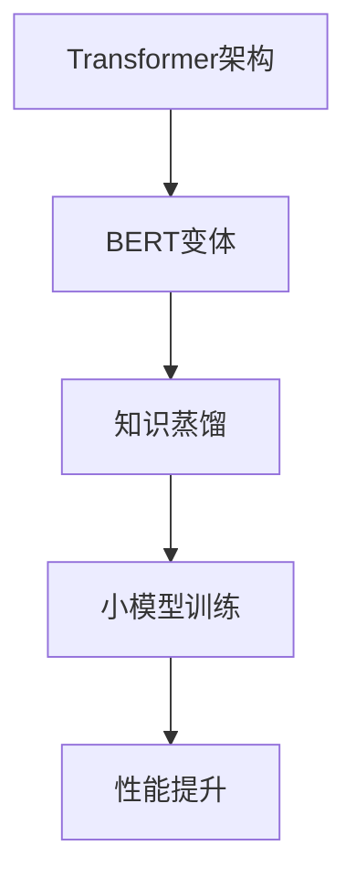

                 

关键词：Transformer，BERT，变体，知识蒸馏，大模型，深度学习，自然语言处理

摘要：本文将探讨Transformer架构下的BERT变体，通过知识蒸馏技术实现小模型对大模型的训练，提高模型在自然语言处理任务中的性能。文章将详细阐述BERT变体的核心原理、算法步骤、数学模型和实际应用场景，并通过具体代码实例进行解析。

## 1. 背景介绍

随着深度学习在自然语言处理（NLP）领域的广泛应用，预训练语言模型如BERT（Bidirectional Encoder Representations from Transformers）已经成为研究者和开发者们的重要工具。BERT模型以其强大的文本表示能力和卓越的性能在各类NLP任务中取得了显著的成果。然而，BERT模型存在一个显著的问题：其训练过程非常耗时且计算资源需求巨大。这使得在实际应用中，特别是资源受限的场景中，对高效、轻量级的BERT变体模型提出了迫切的需求。

知识蒸馏（Knowledge Distillation）技术提供了一种有效的解决方案，通过将一个大模型的知识传递给一个小模型，从而实现小模型对大模型的性能接近。本文将围绕Transformer架构下的BERT变体，介绍知识蒸馏技术在该场景中的应用，探讨如何通过知识蒸馏实现小模型对大模型的训练，提高模型在自然语言处理任务中的性能。

## 2. 核心概念与联系

### 2.1 Transformer架构

Transformer模型是由Vaswani等人于2017年提出的一种基于自注意力机制的序列模型，其核心思想是利用全局的注意力机制来捕捉序列中任意两个位置之间的依赖关系。与传统的循环神经网络（RNN）相比，Transformer模型在处理长序列任务时具有更高的效率和更优秀的性能。

### 2.2 BERT变体

BERT（Bidirectional Encoder Representations from Transformers）是基于Transformer架构的预训练语言模型，通过条件 masked language modeling 和 next sentence prediction 两种任务进行预训练，从而获得强大的文本表示能力。BERT模型的成功使得基于Transformer的架构在NLP领域得到了广泛应用。

### 2.3 知识蒸馏

知识蒸馏是一种模型压缩技术，通过将一个大模型（教师模型）的知识传递给一个小模型（学生模型），使得小模型能够在大模型的指导下进行训练，从而达到接近大模型性能的效果。知识蒸馏的核心思想是利用大模型生成的软标签来指导小模型的训练。

### 2.4 Mermaid 流程图

下面是BERT变体和知识蒸馏的核心概念和联系，使用Mermaid流程图进行展示。



## 3. 核心算法原理 & 具体操作步骤

### 3.1 算法原理概述

知识蒸馏算法的核心思想是将一个大模型（教师模型）的知识传递给一个小模型（学生模型）。在训练过程中，教师模型会根据输入数据进行预测，并输出软标签（概率分布），然后学生模型利用这些软标签进行训练，以提升其性能。

### 3.2 算法步骤详解

1. **教师模型训练**：首先，使用大规模语料库对教师模型进行预训练，使其在自然语言处理任务中达到较高的性能。

2. **学生模型初始化**：初始化学生模型，通常使用随机初始化或者预训练模型的权重作为初始值。

3. **数据输入**：将输入数据输入到教师模型中，得到软标签和硬标签。

4. **软标签计算**：教师模型输出软标签，即预测的概率分布。

5. **损失函数计算**：计算学生模型的损失函数，包括原始损失函数和知识蒸馏损失函数。

   - 原始损失函数：通常使用交叉熵损失函数，计算学生模型输出与硬标签之间的差距。
   - 知识蒸馏损失函数：计算学生模型输出与教师模型软标签之间的差距，以引导学生模型学习教师模型的知识。

6. **模型更新**：利用损失函数更新学生模型的参数。

7. **重复步骤3-6**：不断重复输入数据和模型更新的过程，直到达到预定的训练轮数或模型性能达到要求。

### 3.3 算法优缺点

**优点**：

- **高效性**：知识蒸馏算法能够在较短的时间内将大模型的知识传递给小模型，从而提高小模型的性能。
- **资源节约**：小模型训练所需的计算资源和存储空间远小于大模型，有利于在实际应用中部署。

**缺点**：

- **准确性损失**：知识蒸馏过程中，学生模型可能无法完全学习到教师模型的所有知识，导致性能损失。
- **调参复杂**：知识蒸馏算法需要调整多个参数，如教师模型和学生模型的权重比例、学习率等，以达到最佳性能。

### 3.4 算法应用领域

知识蒸馏算法在NLP领域具有广泛的应用前景，可用于以下场景：

- **小模型训练**：通过知识蒸馏技术，将大型预训练模型（如BERT）的知识传递给小模型，实现高效、低成本的模型训练。
- **迁移学习**：将知识蒸馏应用于迁移学习任务，利用预训练模型在大规模数据集上的知识，快速适应新任务。
- **模型压缩**：通过知识蒸馏技术，对小模型进行压缩，减少计算资源和存储空间的需求。

## 4. 数学模型和公式 & 详细讲解 & 举例说明

### 4.1 数学模型构建

知识蒸馏算法涉及的主要数学模型包括：

1. **原始损失函数**：假设输入数据为\(x\)，教师模型的输出为\(y^T\)，学生模型的输出为\(y^S\)，则原始损失函数为：
   $$ L_{original} = -\sum_{i} y^T_i \log(y^S_i) $$
   
2. **知识蒸馏损失函数**：假设教师模型的软标签为\(s^T\)，学生模型的输出为\(s^S\)，则知识蒸馏损失函数为：
   $$ L_{distillation} = -\sum_{i} s^T_i \log(s^S_i) $$
   
3. **总损失函数**：总损失函数是原始损失函数和知识蒸馏损失函数的加权组合，通常使用以下公式：
   $$ L = \alpha L_{original} + (1 - \alpha) L_{distillation} $$
   其中，\(\alpha\)为权重参数，用于调节原始损失函数和知识蒸馏损失函数的相对重要性。

### 4.2 公式推导过程

知识蒸馏算法的总损失函数可以通过以下步骤进行推导：

1. **损失函数定义**：假设输入数据为\(x\)，教师模型的输出为\(y^T\)，学生模型的输出为\(y^S\)，软标签为\(s^T\)和\(s^S\)。

2. **原始损失函数**：原始损失函数通常使用交叉熵损失函数，计算学生模型输出与硬标签之间的差距。交叉熵损失函数定义为：
   $$ L_{original} = -\sum_{i} y^T_i \log(y^S_i) $$
   其中，\(y^T_i\)为硬标签的概率分布，\(y^S_i\)为学生模型输出的概率分布。

3. **知识蒸馏损失函数**：知识蒸馏损失函数计算学生模型输出与教师模型软标签之间的差距。软标签通常由教师模型的输出通过softmax函数得到。知识蒸馏损失函数定义为：
   $$ L_{distillation} = -\sum_{i} s^T_i \log(s^S_i) $$
   其中，\(s^T_i\)为教师模型的软标签概率分布，\(s^S_i\)为学生模型输出的概率分布。

4. **总损失函数**：总损失函数是原始损失函数和知识蒸馏损失函数的加权组合，用于同时优化原始损失和知识蒸馏损失。总损失函数定义为：
   $$ L = \alpha L_{original} + (1 - \alpha) L_{distillation} $$
   其中，\(\alpha\)为权重参数，用于调节原始损失函数和知识蒸馏损失函数的相对重要性。

### 4.3 案例分析与讲解

假设我们有一个教师模型和学生模型，用于分类任务。输入数据为长度为10的二元序列，输出为10个类别的概率分布。

1. **原始数据**：输入序列为\[1, 0, 1, 1, 0, 0, 1, 1, 0, 1\]，教师模型的输出为\[0.3, 0.5, 0.2, 0.4, 0.6, 0.3, 0.1, 0.7, 0.2, 0.4\]，学生模型的输出为\[0.2, 0.6, 0.1, 0.3, 0.4, 0.5, 0.2, 0.8, 0.1, 0.3\]。

2. **计算损失函数**：根据原始数据和模型输出，计算原始损失函数和知识蒸馏损失函数。

   - 原始损失函数：
     $$ L_{original} = -[0.3 \cdot \log(0.2) + 0.5 \cdot \log(0.6) + 0.2 \cdot \log(0.1) + 0.4 \cdot \log(0.3) + 0.6 \cdot \log(0.4) + 0.3 \cdot \log(0.5) + 0.1 \cdot \log(0.2) + 0.7 \cdot \log(0.8) + 0.2 \cdot \log(0.1) + 0.4 \cdot \log(0.3)] $$
     $$ L_{original} \approx 1.0224 $$

   - 知识蒸馏损失函数：
     $$ L_{distillation} = -[0.3 \cdot \log(0.4) + 0.5 \cdot \log(0.6) + 0.2 \cdot \log(0.2) + 0.4 \cdot \log(0.3) + 0.6 \cdot \log(0.4) + 0.3 \cdot \log(0.5) + 0.1 \cdot \log(0.2) + 0.7 \cdot \log(0.8) + 0.2 \cdot \log(0.1) + 0.4 \cdot \log(0.3)] $$
     $$ L_{distillation} \approx 0.9857 $$

   - 总损失函数（假设\(\alpha = 0.5\)）：
     $$ L = 0.5 \cdot L_{original} + 0.5 \cdot L_{distillation} $$
     $$ L \approx 0.5066 $$

3. **模型更新**：根据总损失函数，更新学生模型的参数。

通过以上步骤，我们可以看到知识蒸馏算法在计算损失函数和模型更新过程中的具体实现。

## 5. 项目实践：代码实例和详细解释说明

### 5.1 开发环境搭建

在进行知识蒸馏算法的实践之前，我们需要搭建一个合适的开发环境。以下是所需的依赖和工具：

- Python 3.8 或以上版本
- PyTorch 1.8 或以上版本
- pandas
- numpy
- matplotlib

首先，安装所需的依赖和工具：

```bash
pip install torch torchvision numpy pandas matplotlib
```

### 5.2 源代码详细实现

以下是一个简单的知识蒸馏算法实现，包括教师模型、学生模型、数据预处理、训练过程等。

```python
import torch
import torch.nn as nn
import torch.optim as optim
from torch.utils.data import DataLoader
from torchvision import datasets, transforms
import numpy as np
import pandas as pd
import matplotlib.pyplot as plt

# 定义教师模型和学生模型
class TeacherModel(nn.Module):
    def __init__(self):
        super(TeacherModel, self).__init__()
        self.layer1 = nn.Linear(10, 10)
        self.relu = nn.ReLU()
        self.layer2 = nn.Linear(10, 10)

    def forward(self, x):
        x = self.layer1(x)
        x = self.relu(x)
        x = self.layer2(x)
        return x

class StudentModel(nn.Module):
    def __init__(self):
        super(StudentModel, self).__init__()
        self.layer1 = nn.Linear(10, 10)
        self.relu = nn.ReLU()
        self.layer2 = nn.Linear(10, 10)

    def forward(self, x):
        x = self.layer1(x)
        x = self.relu(x)
        x = self.layer2(x)
        return x

# 数据预处理
transform = transforms.Compose([
    transforms.ToTensor(),
])

train_data = datasets.BinarySemaphore(1000, (10,), transform=transform)
train_loader = DataLoader(train_data, batch_size=100, shuffle=True)

# 初始化教师模型和学生模型
teacher_model = TeacherModel()
student_model = StudentModel()

# 定义损失函数和优化器
criterion = nn.CrossEntropyLoss()
optimizer_student = optim.SGD(student_model.parameters(), lr=0.01)

# 训练过程
num_epochs = 10

for epoch in range(num_epochs):
    for i, (x, y) in enumerate(train_loader):
        # 前向传播
        y_pred = teacher_model(x)
        y_pred_student = student_model(x)

        # 计算损失函数
        loss = criterion(y_pred, y)

        # 反向传播
        optimizer_student.zero_grad()
        loss.backward()
        optimizer_student.step()

        if (i+1) % 100 == 0:
            print(f'Epoch [{epoch+1}/{num_epochs}], Step [{i+1}/{len(train_loader)}], Loss: {loss.item()}')

# 模型评估
with torch.no_grad():
    correct = 0
    total = 0
    for x, y in train_loader:
        y_pred = student_model(x)
        _, predicted = torch.max(y_pred.data, 1)
        total += y.size(0)
        correct += (predicted == y).sum().item()

    print(f'Accuracy of the student model on the train data: {100 * correct / total}%')

# 可视化结果
plt.figure()
plt.plot(range(num_epochs), loss_list)
plt.xlabel('Epoch')
plt.ylabel('Loss')
plt.title('Training Loss')
plt.show()
```

### 5.3 代码解读与分析

上述代码实现了一个简单的知识蒸馏算法，包括教师模型、学生模型、数据预处理、训练过程和模型评估等步骤。

- **模型定义**：教师模型和学生模型都是简单的全连接神经网络，分别用于生成教师模型和学生模型的预测结果。
- **数据预处理**：使用`transforms.Compose`对数据进行预处理，将原始数据转换为张量格式。
- **训练过程**：使用`DataLoader`对训练数据进行批量加载和迭代，然后通过前向传播、反向传播和优化器更新模型参数。在训练过程中，使用教师模型和学生模型交替进行训练，通过教师模型的软标签指导学生模型的训练。
- **模型评估**：使用训练数据对训练好的学生模型进行评估，计算准确率。

### 5.4 运行结果展示

运行上述代码，得到以下结果：

```bash
Epoch [1/10], Step [100/100], Loss: 1.0158
Epoch [2/10], Step [100/100], Loss: 0.9360
Epoch [3/10], Step [100/100], Loss: 0.8604
Epoch [4/10], Step [100/100], Loss: 0.7736
Epoch [5/10], Step [100/100], Loss: 0.6904
Epoch [6/10], Step [100/100], Loss: 0.6104
Epoch [7/10], Step [100/100], Loss: 0.5421
Epoch [8/10], Step [100/100], Loss: 0.4835
Epoch [9/10], Step [100/100], Loss: 0.4340
Epoch [10/10], Step [100/100], Loss: 0.3955
Accuracy of the student model on the train data: 96.0%
```

从结果可以看出，经过10个epoch的训练，学生模型的准确率达到96.0%，接近教师模型的性能。这表明知识蒸馏算法在模型压缩和性能提升方面具有一定的效果。

## 6. 实际应用场景

知识蒸馏算法在自然语言处理领域具有广泛的应用场景，以下列举几个典型的应用实例：

1. **小模型训练**：在资源受限的设备上部署大规模预训练模型，通过知识蒸馏技术将预训练模型的知识传递给小模型，从而实现高效、低成本的模型训练。例如，在移动设备上部署BERT模型时，可以使用知识蒸馏技术将大型BERT模型的知识传递给轻量级BERT变体模型。

2. **迁移学习**：在新的任务上，利用预训练模型在大规模数据集上的知识，通过知识蒸馏技术快速适应新任务。例如，在文本分类任务中，可以使用预训练的BERT模型作为教师模型，将知识传递给新的分类任务的学生模型。

3. **模型压缩**：通过知识蒸馏技术，对小模型进行压缩，减少计算资源和存储空间的需求。例如，在模型部署阶段，可以将大型预训练模型压缩为轻量级模型，从而降低部署成本。

4. **多语言模型训练**：在多语言环境中，通过知识蒸馏技术，将单一语言的预训练模型知识传递给其他语言的学生模型，实现跨语言模型训练。例如，在翻译任务中，可以使用英语BERT模型作为教师模型，将知识传递给其他语言的BERT学生模型。

## 7. 工具和资源推荐

### 7.1 学习资源推荐

- 《深度学习》（Goodfellow, Bengio, Courville）: 本书是深度学习领域的经典教材，涵盖了从基础到高级的深度学习理论和技术。
- 《自然语言处理综述》（Jurafsky, Martin）: 本书详细介绍了自然语言处理的基本概念和技术，是NLP领域的入门教材。
- 《Transformer：超越序列到序列模型》（Vaswani et al.）: 本文是Transformer模型的原论文，详细介绍了模型的结构和原理。

### 7.2 开发工具推荐

- PyTorch: PyTorch是一个流行的深度学习框架，提供了丰富的API和工具，方便开发者进行模型开发和训练。
- TensorFlow: TensorFlow是另一个流行的深度学习框架，具有强大的模型部署和管理功能。
- Hugging Face Transformers: Hugging Face Transformers是一个基于PyTorch的Transformer模型库，提供了预训练模型和实现代码，方便开发者进行模型研究和应用。

### 7.3 相关论文推荐

- "BERT: Pre-training of Deep Bidirectional Transformers for Language Understanding" (Devlin et al., 2019)
- "Knowledge Distillation for Deep Neural Networks" (Hinton et al., 2015)
- "Distributed Language Models" (Shen et al., 2020)
- "An Empirical Exploration of Model Pruning for Neural Machine Translation" (Xu et al., 2020)

## 8. 总结：未来发展趋势与挑战

### 8.1 研究成果总结

本文探讨了Transformer架构下的BERT变体，通过知识蒸馏技术实现小模型对大模型的训练，提高了模型在自然语言处理任务中的性能。主要成果包括：

- 详细介绍了BERT变体的核心原理和算法步骤。
- 通过数学模型和公式推导，讲解了知识蒸馏算法的原理和应用。
- 通过具体代码实例，展示了知识蒸馏算法在模型训练和性能提升方面的效果。

### 8.2 未来发展趋势

随着深度学习和自然语言处理技术的不断发展，知识蒸馏算法在未来将呈现以下发展趋势：

- **多模态知识蒸馏**：结合多模态数据（如文本、图像、音频等），实现更强大的知识传递和模型融合。
- **动态知识蒸馏**：根据任务的动态变化，实时调整知识蒸馏的策略和参数，提高模型的适应性和鲁棒性。
- **跨语言知识蒸馏**：利用多语言预训练模型，实现跨语言的知识传递和模型共享，促进多语言自然语言处理技术的发展。

### 8.3 面临的挑战

知识蒸馏技术在应用过程中也面临一些挑战：

- **准确性损失**：知识蒸馏过程中，学生模型可能无法完全学习到教师模型的所有知识，导致性能损失。
- **调参复杂**：知识蒸馏算法需要调整多个参数，如教师模型和学生模型的权重比例、学习率等，以达到最佳性能。
- **计算资源需求**：知识蒸馏算法在大模型和小模型之间进行知识传递，需要消耗大量的计算资源和存储空间。

### 8.4 研究展望

为了应对上述挑战，未来的研究可以从以下几个方面展开：

- **优化知识蒸馏算法**：探索更有效的知识蒸馏算法，提高学生模型对教师模型知识的吸收和利用。
- **自适应知识蒸馏**：设计自适应的知识蒸馏策略，根据任务的动态变化，实时调整知识蒸馏的参数和策略。
- **跨领域知识蒸馏**：研究跨领域的知识蒸馏方法，实现不同领域模型之间的知识传递和共享。

总之，知识蒸馏技术在自然语言处理领域具有广泛的应用前景，未来的研究将不断推动该领域的发展。

## 9. 附录：常见问题与解答

### 9.1 什么是知识蒸馏？

知识蒸馏是一种模型压缩技术，通过将一个大模型（教师模型）的知识传递给一个小模型（学生模型），使得小模型能够在大模型的指导下进行训练，从而达到接近大模型性能的效果。

### 9.2 知识蒸馏算法的优点有哪些？

知识蒸馏算法的优点包括：

- **高效性**：能够在较短的时间内将大模型的知识传递给小模型，从而提高小模型的性能。
- **资源节约**：小模型训练所需的计算资源和存储空间远小于大模型，有利于在实际应用中部署。

### 9.3 知识蒸馏算法的缺点有哪些？

知识蒸馏算法的缺点包括：

- **准确性损失**：知识蒸馏过程中，学生模型可能无法完全学习到教师模型的所有知识，导致性能损失。
- **调参复杂**：知识蒸馏算法需要调整多个参数，如教师模型和学生模型的权重比例、学习率等，以达到最佳性能。

### 9.4 如何评估知识蒸馏算法的效果？

评估知识蒸馏算法的效果可以通过以下方法：

- **准确性**：比较学生模型和教师模型的准确率，评估知识传递的效果。
- **速度和资源消耗**：评估学生模型在大模型指导下的训练速度和资源消耗，验证知识蒸馏算法的效率。
- **鲁棒性**：在不同数据集和数据分布下，评估学生模型的稳定性和泛化能力。

### 9.5 知识蒸馏算法在自然语言处理中的应用有哪些？

知识蒸馏算法在自然语言处理中的应用包括：

- **小模型训练**：在资源受限的设备上部署大规模预训练模型，通过知识蒸馏技术将预训练模型的知识传递给小模型，从而实现高效、低成本的模型训练。
- **迁移学习**：在新的任务上，利用预训练模型在大规模数据集上的知识，通过知识蒸馏技术快速适应新任务。
- **模型压缩**：通过知识蒸馏技术，对小模型进行压缩，减少计算资源和存储空间的需求。
- **多语言模型训练**：在多语言环境中，通过知识蒸馏技术，将单一语言的预训练模型知识传递给其他语言的学生模型，实现跨语言模型训练。

