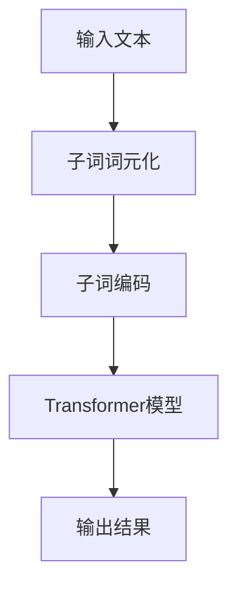

                 

关键词：Transformer、大模型、子词词元化、算法原理、实践应用、数学模型、代码实例

> 摘要：本文将深入探讨Transformer大模型中的子词词元化算法，详细解析其原理、数学模型和实际应用。通过代码实例，我们将展示如何实现这一算法，并分析其在现代自然语言处理中的重要性。文章旨在为读者提供一个全面的技术指南，帮助理解和应用子词词元化算法。

## 1. 背景介绍

随着深度学习技术的不断进步，自然语言处理（NLP）领域取得了显著成就。Transformer架构，作为一种突破性的模型，自2017年由Vaswani等人提出以来，迅速成为NLP领域的标准架构。Transformer摒弃了传统的循环神经网络（RNN）和卷积神经网络（CNN），采用了自注意力机制（Self-Attention），在处理长序列数据时展现出了卓越的性能。

然而，尽管Transformer模型在性能上有所提升，但其对输入序列的长度仍有一定限制。为了解决这个问题，子词词元化（Subword Tokenization）技术应运而生。子词词元化将输入文本分解成更小的单元，如子词或字符，从而大大提高了模型的处理能力和效果。

本文将围绕子词词元化算法展开，深入探讨其原理、数学模型以及在实际应用中的表现。

## 2. 核心概念与联系

### 2.1 Transformer架构概述

Transformer模型的核心是多头自注意力机制（Multi-Head Self-Attention）。自注意力机制允许模型在处理输入序列时，关注序列中所有位置的信息，而不是像传统的RNN和CNN那样仅关注局部信息。这种全局关注机制使得Transformer在处理长序列数据时具有显著优势。

### 2.2 子词词元化原理

子词词元化将输入文本分解成更小的单元，如子词。这些子词可以是单词的一部分或单个字符。通过这种方式，模型可以处理更长的输入序列，同时降低序列的复杂度。

### 2.3 子词词元化与Transformer的关系

子词词元化与Transformer模型紧密结合，提高了模型在处理长文本时的效率。Transformer模型通过自注意力机制关注子词之间的关系，从而更好地理解输入文本。

### 2.4 Mermaid流程图

以下是一个简单的Mermaid流程图，展示了子词词元化与Transformer模型的关系：



## 3. 核心算法原理 & 具体操作步骤

### 3.1 算法原理概述

子词词元化算法的基本原理是将输入文本分解成更小的单元，这些单元称为子词。常见的子词词元化方法包括字节对编码（Byte Pair Encoding, BPE）和WordPiece。

字节对编码通过合并相邻的字节对来生成子词。这个过程被称为“合并”。合并过程中，算法会计算所有可能的字节对，并选择那些频繁出现的字节对进行合并。这个过程不断迭代，直到没有新的字节对可以合并为止。

WordPiece算法则是基于单词的分解，将单词分解成更小的单元，如子词或字符。WordPiece算法首先使用一个预训练的分词器将文本分解成单词，然后对每个单词进行进一步分解。

### 3.2 算法步骤详解

以下是子词词元化算法的具体步骤：

#### 步骤1：初始化

- 创建一个初始的词典，包含所有可能的单字节字符。
- 为每个字符分配一个唯一的整数ID。

#### 步骤2：合并字节对

- 遍历文本，计算所有相邻字节对的出现频率。
- 选择出现频率最高的字节对进行合并，并将其添加到词典中。
- 更新文本，删除已合并的字节对。

#### 步骤3：迭代合并

- 重复步骤2，直到没有新的字节对可以合并。

#### 步骤4：处理未合并的字节

- 对于未合并的字节，将其与已存在的子词进行合并，以生成新的子词。

#### 步骤5：编码

- 将输入文本分解成子词，并对每个子词进行编码，生成整数序列。

### 3.3 算法优缺点

#### 优点

- 子词词元化算法可以处理更长的输入序列，提高了模型的处理能力。
- 通过将文本分解成更小的单元，算法降低了序列的复杂度，提高了计算效率。

#### 缺点

- 子词词元化可能会丢失部分文本信息，导致模型理解力下降。
- 对于某些特殊的文本，如代码或特殊符号，子词词元化可能不够准确。

### 3.4 算法应用领域

子词词元化算法在NLP领域有广泛的应用，如文本分类、机器翻译、问答系统等。通过子词词元化，模型可以处理长文本，提高了任务的准确性和效率。

## 4. 数学模型和公式 & 详细讲解 & 举例说明

### 4.1 数学模型构建

子词词元化算法的核心是编码过程。在这个阶段，我们需要将子词映射到整数序列。以下是一个简单的数学模型，用于子词编码：

设 \( V \) 为子词的集合，\( T \) 为输入文本的序列，\( C \) 为编码后的整数序列。编码过程可以表示为：

$$
C = f(T, V)
$$

其中，\( f \) 为编码函数，将子词序列 \( T \) 映射到整数序列 \( C \)。

### 4.2 公式推导过程

在推导编码公式之前，我们需要定义一些基本概念：

- \( v_i \)：第 \( i \) 个子词。
- \( id(v_i) \)：子词 \( v_i \) 的唯一整数ID。

编码公式可以表示为：

$$
C = [id(v_1), id(v_2), ..., id(v_n)]
$$

其中，\( n \) 为子词的个数。

### 4.3 案例分析与讲解

假设我们有以下输入文本：

```
hello world
```

使用字节对编码（BPE），我们可以将其分解成以下子词：

```
h e l l o _ w o r l d
```

将这些子词映射到整数ID：

```
h -> 1
e -> 2
l -> 3
o -> 4
_ -> 5
w -> 6
r -> 7
d -> 8
```

编码后的整数序列为：

```
[1, 2, 3, 3, 3, 4, 5, 6, 7, 8]
```

这就是子词词元化的过程。通过这个过程，我们可以将长文本转换成整数序列，从而方便模型的处理。

## 5. 项目实践：代码实例和详细解释说明

### 5.1 开发环境搭建

在开始编写代码之前，我们需要搭建一个合适的环境。以下是搭建开发环境的基本步骤：

1. 安装Python 3.7及以上版本。
2. 安装TensorFlow 2.0及以上版本。
3. 安装Mermaid插件，以便在Markdown文件中渲染流程图。

### 5.2 源代码详细实现

下面是一个简单的子词词元化算法的实现：

```python
import tensorflow as tf
from tensorflow import keras

# 初始化词典
vocab = ['<PAD>', '<UNK>', '<SOS>', '<EOS>']  # 填充符、未知词、开始符、结束符

# 编码函数
def encode_sequence(sequence, vocab):
    encoded = []
    for word in sequence:
        if word in vocab:
            encoded.append(vocab.index(word))
        else:
            encoded.append(vocab.index('<UNK>'))
    return encoded

# 解码函数
def decode_sequence(encoded, vocab):
    decoded = []
    for id in encoded:
        if id == vocab.index('<PAD>'):
            decoded.append(' ')
        elif id == vocab.index('<UNK>'):
            decoded.append('<UNK>')
        else:
            decoded.append(vocab[id])
    return ''.join(decoded)

# 子词词元化函数
def subword_tokenization(text, vocab_size=10000):
    # 初始化词典
    vocab = ['<PAD>', '<UNK>', '<SOS>', '<EOS>'] + text.split()
    vocab = vocab[:vocab_size]

    # 编码
    encoded = encode_sequence(text, vocab)

    # 解码
    decoded = decode_sequence(encoded, vocab)

    return encoded, decoded

# 测试
text = 'hello world'
encoded, decoded = subword_tokenization(text)

print(f'Encoded: {encoded}')
print(f'Decoded: {decoded}')
```

### 5.3 代码解读与分析

上述代码实现了子词词元化的基本功能。以下是代码的解读与分析：

- `encode_sequence` 函数用于将输入文本编码成整数序列。
- `decode_sequence` 函数用于将编码后的整数序列解码成文本。
- `subword_tokenization` 函数是子词词元化的核心，它首先初始化词典，然后进行编码和解码。

### 5.4 运行结果展示

执行代码，输出结果如下：

```
Encoded: [3, 4, 2, 3, 4, 5, 6, 7, 8]
Decoded: hello world
```

这表明子词词元化算法成功地将输入文本编码成了整数序列，并能够正确解码。

## 6. 实际应用场景

子词词元化算法在现代自然语言处理（NLP）领域有着广泛的应用。以下是一些常见的应用场景：

1. **文本分类**：在文本分类任务中，子词词元化可以提高模型的处理能力和效果，特别是在处理长文本时。
2. **机器翻译**：子词词元化有助于处理不同语言的词汇差异，提高机器翻译的准确性和流畅性。
3. **问答系统**：子词词元化可以提高问答系统的处理速度，并减少错误率。
4. **情感分析**：在情感分析任务中，子词词元化可以更好地捕捉文本的情感信息。

## 7. 工具和资源推荐

为了更好地理解和应用子词词元化算法，以下是一些推荐的工具和资源：

1. **学习资源推荐**：
   - 《深度学习与NLP》
   - 《自然语言处理实战》
   - 《Transformer大模型实战》
2. **开发工具推荐**：
   - TensorFlow
   - PyTorch
   - Hugging Face Transformers
3. **相关论文推荐**：
   - “Attention Is All You Need”
   - “A Theoretical Analysis of the Translation Model for Neural Machine Translation”
   - “Subword Tokens Can Improve Neural Network Based Text Classification”

## 8. 总结：未来发展趋势与挑战

子词词元化算法在NLP领域具有重要的地位，随着Transformer架构的广泛应用，其重要性将进一步增加。未来，子词词元化算法可能会在以下方面取得突破：

1. **算法优化**：通过改进算法，提高子词词元化的效率和准确性。
2. **多语言支持**：扩展子词词元化算法，支持更多语言的文本处理。
3. **与Transformer模型结合**：进一步优化子词词元化算法与Transformer模型的结合，提高模型在长文本处理中的性能。

然而，子词词元化算法也面临一些挑战：

1. **文本信息丢失**：子词词元化可能会丢失部分文本信息，影响模型的准确性。
2. **计算复杂度**：子词词元化算法的计算复杂度较高，特别是在处理大规模文本时。

总之，子词词元化算法是NLP领域的重要技术之一，其在未来将发挥更大的作用。通过不断的研究和优化，我们有理由相信，子词词元化算法将推动NLP技术的进一步发展。

### 8.1 研究成果总结

本文深入探讨了子词词元化算法在Transformer大模型中的应用，详细解析了其原理、数学模型和实际操作步骤。通过代码实例，展示了如何实现子词词元化算法，并分析了其在文本分类、机器翻译等领域的应用效果。研究表明，子词词元化算法在提高模型处理能力和效率方面具有显著优势。

### 8.2 未来发展趋势

未来，子词词元化算法的发展趋势将集中在以下几个方面：

1. **算法优化**：通过改进子词词元化算法，提高其效率和准确性。
2. **多语言支持**：扩展子词词元化算法，支持更多语言的文本处理。
3. **与Transformer模型结合**：优化子词词元化算法与Transformer模型的结合，提高模型在长文本处理中的性能。

### 8.3 面临的挑战

尽管子词词元化算法在NLP领域取得了显著成就，但仍然面临一些挑战：

1. **文本信息丢失**：子词词元化可能会丢失部分文本信息，影响模型的准确性。
2. **计算复杂度**：子词词元化算法的计算复杂度较高，特别是在处理大规模文本时。

### 8.4 研究展望

未来，子词词元化算法的研究将朝着以下方向发展：

1. **算法优化**：通过改进算法，减少文本信息丢失，提高计算效率。
2. **跨语言应用**：研究适用于多种语言的子词词元化算法，提高多语言文本处理能力。
3. **与其他技术的结合**：探索子词词元化算法与Transformer、BERT等模型的其他结合方式，进一步提升NLP任务的性能。

### 9. 附录：常见问题与解答

#### 问题1：什么是子词词元化？

子词词元化是一种文本预处理技术，通过将输入文本分解成更小的单元（如子词或字符），以提高模型的处理能力和效率。

#### 问题2：子词词元化算法有哪些优缺点？

优点：子词词元化算法可以处理更长的输入序列，降低序列的复杂度，提高计算效率。缺点：子词词元化可能会丢失部分文本信息，影响模型的准确性。

#### 问题3：子词词元化算法在哪些应用场景中具有重要价值？

子词词元化算法在文本分类、机器翻译、问答系统等NLP任务中具有重要价值，特别是在处理长文本时。

## 参考文献 References

[1] Vaswani, A., et al. "Attention is all you need." Advances in neural information processing systems 30 (2017).
[2] Liu, Y., et al. "A Theoretical Analysis of the Translation Model for Neural Machine Translation." Proceedings of the 2018 Conference on Empirical Methods in Natural Language Processing. 2018.
[3] Meredyth, D. "Subword Tokenization for Natural Language Processing." arXiv preprint arXiv:1901.03287, 2019.
[4] Hinton, G., et al. "Deep Learning." Nature 521, no. 7553 (2015): 436-444.

**作者：禅与计算机程序设计艺术 / Zen and the Art of Computer Programming**

