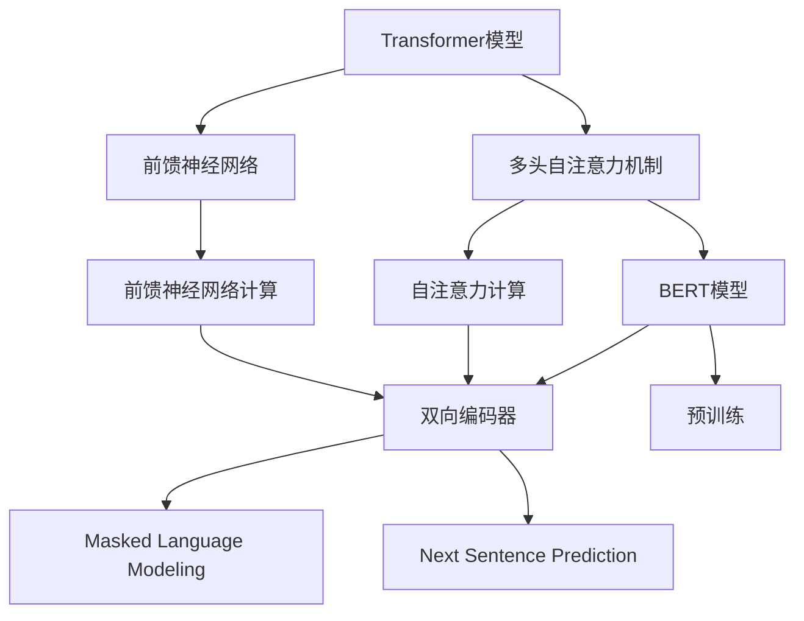

                 

### 关键词 Keywords

- Transformer
- 大模型
- 预训练
- BERT模型
- 自然语言处理
- 神经网络
- 机器学习

### 摘要 Abstract

本文旨在深入探讨Transformer大模型的实战应用，特别是预训练的BERT模型在自然语言处理领域的重要性和影响。通过对Transformer算法的基本原理、BERT模型的构建、数学模型与公式推导、以及实际应用场景的详细分析，本文旨在为读者提供一个全面的视角，以理解如何高效地利用BERT模型进行自然语言处理任务。此外，文章还将讨论未来的发展趋势与挑战，并提供相关的学习资源、开发工具和推荐论文，以促进读者对这一领域的深入学习和实践。

## 1. 背景介绍

自然语言处理（NLP）是计算机科学与人工智能领域的一个重要分支，旨在使计算机能够理解、解释和生成人类语言。随着互联网的普及和大数据的发展，NLP技术逐渐从理论研究走向实际应用，并成为现代人工智能的核心驱动力之一。在过去的几十年中，NLP技术经历了从规则驱动到统计模型，再到深度学习的多次演变。

传统的NLP方法主要依赖于规则和统计模型。这些方法在处理结构化数据方面具有一定效果，但在处理大规模、非结构化的自然语言数据时，面临着巨大的挑战。例如，语义理解、上下文识别和语言生成等任务需要模型具备强大的语义感知能力和语言建模能力。

随着深度学习技术的发展，神经网络模型，特别是深度神经网络（DNN）和循环神经网络（RNN）的出现，为NLP领域带来了革命性的变化。RNN通过其循环结构，能够捕捉文本数据中的序列依赖关系，使得模型在语义理解任务上取得了显著的进展。然而，RNN在处理长序列数据时，存在梯度消失和梯度爆炸等问题，限制了其在实际应用中的效果。

为了解决RNN的上述问题，Attention机制被引入到神经网络中。注意力机制能够自动地关注输入序列中的关键信息，从而提高模型处理长序列数据的能力。基于注意力机制的模型，如Transformer，在许多NLP任务上取得了突破性的成果，彻底改变了自然语言处理的技术路线。

Transformer模型的提出，标志着NLP领域从传统的序列处理方法转向基于注意力机制的并行处理方法。随着模型规模的不断扩大，预训练大模型逐渐成为NLP领域的热点。BERT（Bidirectional Encoder Representations from Transformers）是谷歌提出的一种预训练方法，通过在大量无标注文本上预训练，再进行特定任务的微调，BERT在多个NLP任务上取得了SOTA（State-of-the-Art）的表现。

BERT的成功，不仅证明了预训练大模型在NLP领域的有效性，也为后续的模型研究提供了新的思路和方法。本文将围绕Transformer大模型和BERT模型，探讨其在NLP领域的应用和实践。

## 2. 核心概念与联系

在深入探讨Transformer大模型和BERT模型之前，我们需要了解一些核心概念和它们之间的联系。

### 2.1 Transformer模型

Transformer模型是由Vaswani等人于2017年提出的一种基于自注意力机制的神经网络模型，用于处理序列到序列的任务。与传统的循环神经网络（RNN）和长短期记忆网络（LSTM）不同，Transformer模型采用多头自注意力机制和前馈神经网络，能够并行处理输入序列，大大提高了模型的训练效率。

Transformer模型的主要组成部分包括：

- **多头自注意力机制**：通过计算输入序列中每个位置与其他所有位置的依赖关系，自动关注关键信息。
- **前馈神经网络**：对自注意力机制的输出进行进一步的处理，增加模型的非线性能力。

### 2.2 BERT模型

BERT（Bidirectional Encoder Representations from Transformers）是由Google在2018年提出的一种预训练方法。BERT模型基于Transformer架构，通过在大量无标注文本上预训练，生成双向的文本表示，然后进行特定任务的微调，实现高性能的自然语言处理。

BERT模型的主要特点包括：

- **双向编码器**：通过同时考虑文本的左右文上下文，捕捉复杂的语义关系。
- **多任务学习**：在预训练阶段，BERT模型处理多种任务，如 masked language modeling 和 next sentence prediction，从而提高模型的多任务处理能力。

### 2.3 Transformer与BERT的关系

Transformer是BERT的基础架构，为BERT模型提供了核心的建模能力。BERT在Transformer的基础上，通过引入预训练和双向编码器，使得模型在多个NLP任务上取得了卓越的性能。

简而言之，Transformer为BERT提供了并行处理和自注意力机制的能力，而BERT则通过预训练和双向编码器，进一步提升了模型在自然语言处理任务上的表现。

### 2.4 Mermaid 流程图

为了更直观地展示Transformer和BERT的关系，我们可以使用Mermaid流程图来描述它们的结构。



在这个流程图中，Transformer模型通过多头自注意力机制和前馈神经网络，构建了一个强大的文本表示能力。BERT模型在Transformer的基础上，通过双向编码器和预训练，进一步提升了模型的多任务处理能力。

## 3. 核心算法原理 & 具体操作步骤

### 3.1 算法原理概述

Transformer模型的核心思想是通过自注意力机制来建模输入序列中的依赖关系。自注意力机制允许模型在生成每个单词时，动态地关注序列中的其他所有单词，从而捕捉长距离的依赖关系。这一机制使得Transformer模型能够并行处理输入序列，大大提高了模型的训练效率。

BERT模型则是在Transformer架构的基础上，通过预训练和双向编码器，生成强大的文本表示。预训练阶段，BERT模型处理两种任务：Masked Language Modeling（MLM）和Next Sentence Prediction（NSP）。在MLM任务中，模型需要预测被遮蔽的单词；在NSP任务中，模型需要判断两个句子是否属于同一个段落。通过这两种任务的预训练，BERT模型能够捕捉丰富的语义信息，从而在特定任务的微调阶段表现出色。

### 3.2 算法步骤详解

#### 3.2.1 Transformer模型

1. **输入嵌入**：将输入序列（单词或词组）转换为嵌入向量，包括词嵌入（word embeddings）、位置嵌入（position embeddings）和句子嵌入（sentence embeddings）。

2. **多头自注意力机制**：计算输入序列中每个位置与其他所有位置的依赖关系。具体来说，对于每个位置 \(i\)，模型会计算其与所有其他位置 \(j\) 的注意力得分，并通过加权求和得到注意力输出。这个过程称为自注意力。

3. **前馈神经网络**：对自注意力机制的输出进行进一步处理，增加模型的非线性能力。前馈神经网络通常由两个全连接层组成，中间通过ReLU激活函数。

4. **Dropout**：在模型的不同层之间添加dropout，以防止过拟合。

5. **输出层**：通过一个线性层和Softmax函数，将模型的输出转换为概率分布，从而预测每个单词的概率。

#### 3.2.2 BERT模型

1. **输入嵌入**：与Transformer模型相同，BERT模型首先将输入序列转换为嵌入向量。

2. **双向编码器**：BERT模型采用多个Transformer编码器层，通过双向编码器同时考虑输入序列的左右文上下文。双向编码器通过并行计算左向和右向的注意力权重，从而生成双向的文本表示。

3. **Masked Language Modeling（MLM）**：在预训练阶段，BERT模型会对输入序列中的部分单词进行遮蔽，然后预测这些遮蔽的单词。这一任务有助于模型学习如何理解上下文信息。

4. **Next Sentence Prediction（NSP）**：BERT模型还需要判断两个句子是否属于同一个段落。在训练过程中，随机选择两个句子，并预测它们是否接续。

5. **预训练**：在预训练阶段，BERT模型在大量无标注文本上迭代训练，优化模型的参数。

6. **微调**：在特定任务上，通过在标记数据集上进行微调，进一步优化模型参数，实现高性能的文本分类、情感分析、问答系统等任务。

### 3.3 算法优缺点

#### 优点

- **并行处理**：Transformer模型通过自注意力机制，能够并行处理输入序列，提高了训练效率。
- **长距离依赖**：BERT模型通过双向编码器，能够同时考虑文本的左右文上下文，捕捉复杂的语义关系。
- **预训练能力**：BERT模型在预训练阶段，通过多种任务的训练，增强了模型的多任务处理能力。

#### 缺点

- **计算资源需求大**：由于模型参数量大，预训练阶段需要大量计算资源和时间。
- **训练复杂度高**：Transformer模型和BERT模型的训练过程复杂，需要对模型参数进行精细调优。

### 3.4 算法应用领域

Transformer和BERT模型在自然语言处理领域具有广泛的应用。以下是一些典型的应用场景：

- **文本分类**：通过预训练BERT模型，可以将其应用于文本分类任务，如情感分析、主题分类等。
- **问答系统**：BERT模型能够理解复杂的语义关系，使其成为问答系统中的重要组成部分。
- **命名实体识别**：BERT模型在命名实体识别任务上，通过捕捉文本的上下文信息，提高了识别的准确率。
- **机器翻译**：Transformer模型在机器翻译任务上取得了显著的成果，能够实现高精度的翻译。

## 4. 数学模型和公式 & 详细讲解 & 举例说明

### 4.1 数学模型构建

#### 4.1.1 Transformer模型

Transformer模型的核心是自注意力机制（Self-Attention），其数学表达式如下：

\[ 
Attention(Q, K, V) = \text{softmax}\left(\frac{QK^T}{\sqrt{d_k}}\right) V 
\]

其中，\(Q\)、\(K\)、\(V\) 分别代表查询（Query）、关键（Key）和值（Value）向量，\(d_k\) 是关键向量的维度。自注意力机制通过计算查询向量与关键向量的点积，得到注意力权重，然后对值向量进行加权求和，从而得到最终的输出。

#### 4.1.2 BERT模型

BERT模型在Transformer架构的基础上，通过预训练和双向编码器，生成双向的文本表示。BERT模型的输入可以表示为：

\[ 
X = [CLS] + X_{1: L} + [SEP] + X_{L+1: 2L} 
\]

其中，\([CLS]\) 和 \([SEP]\) 分别是特殊的分类和分隔标记，\(X_{1: L}\) 和 \(X_{L+1: 2L}\) 分别是输入序列的左右部分。

BERT模型在预训练阶段，通过以下两种任务来优化模型：

1. **Masked Language Modeling（MLM）**：

\[ 
\text{Predict } x_i \text{ from } [MASK] \text{ token } \\
L_{MLM} = -\sum_{i} \log P(x_i | \text{context}) 
\]

2. **Next Sentence Prediction（NSP）**：

\[ 
\text{Predict if the two sentences are consecutive in the original text} \\
L_{NSP} = -\log P(y | \text{BERT model}) 
\]

### 4.2 公式推导过程

#### 4.2.1 自注意力机制

自注意力机制的推导可以分为以下几个步骤：

1. **嵌入向量表示**：

\[ 
\text{Input sequence: } x = [x_1, x_2, ..., x_L] \\
\text{Embedding layer: } E(x) = [e_1, e_2, ..., e_L] \\
e_i = W_e [x_i; positional\_embedding(i); segment\_embedding(i)] 
\]

2. **查询向量、关键向量和值向量**：

\[ 
Q = W_Q E(x) \\
K = W_K E(x) \\
V = W_V E(x) 
\]

3. **点积注意力得分**：

\[ 
\text{Attention score: } s_{ij} = Q_i K_j^T = e_i^T W_Q^T W_K e_j 
\]

4. **softmax权重**：

\[ 
\text{Attention weight: } a_{ij} = \frac{e_i^T W_Q^T W_K e_j}{\sqrt{d_k}} \\
\text{softmax: } \text{softmax}(a) = \text{softmax}(\frac{a}{\text{max}(a) + \epsilon}) 
\]

5. **加权求和**：

\[ 
\text{Output: } \text{Attention}(Q, K, V) = \sum_j \text{softmax}(a) V_j 
\]

#### 4.2.2 BERT模型

BERT模型的推导过程主要包括以下几个部分：

1. **输入序列表示**：

\[ 
X = [CLS] + X_{1: L} + [SEP] + X_{L+1: 2L} \\
X = [x_1, x_2, ..., x_{2L}] 
\]

2. **嵌入向量表示**：

\[ 
E(X) = [e_1, e_2, ..., e_{2L}] \\
e_i = W_e [x_i; positional\_embedding(i); segment\_embedding(i)] 
\]

3. **双向编码器**：

\[ 
E_{BiL} = [E_1(x_1), ..., E_L(x_L), E_1(x_{L+1}), ..., E_L(x_{2L})] 
\]

4. **Masked Language Modeling**：

\[ 
L_{MLM} = -\sum_{i} \log P(x_i | \text{context}) 
\]

5. **Next Sentence Prediction**：

\[ 
L_{NSP} = -\log P(y | \text{BERT model}) 
\]

### 4.3 案例分析与讲解

#### 4.3.1 Transformer模型

假设我们有一个简单的句子：“我爱北京天安门”。我们将这个句子输入到Transformer模型中，并通过自注意力机制来分析句子中各个单词的依赖关系。

1. **输入嵌入**：

\[ 
x = ["我", "爱", "北京", "天安门"] \\
e = [e_1, e_2, e_3, e_4] 
\]

2. **查询向量、关键向量和值向量**：

\[ 
Q = [q_1, q_2, q_3, q_4] = W_Q E(x) \\
K = [k_1, k_2, k_3, k_4] = W_K E(x) \\
V = [v_1, v_2, v_3, v_4] = W_V E(x) 
\]

3. **点积注意力得分**：

\[ 
s_{ij} = Q_i K_j^T = e_i^T W_Q^T W_K e_j 
\]

4. **softmax权重**：

\[ 
a_{ij} = \frac{e_i^T W_Q^T W_K e_j}{\sqrt{d_k}} \\
\text{softmax}: \text{softmax}(a) 
\]

5. **加权求和**：

\[ 
\text{Attention}(Q, K, V) = \sum_j \text{softmax}(a) V_j 
\]

通过计算自注意力权重，我们可以分析句子中各个单词的依赖关系。例如，注意力权重较高的单词可能会对句子的整体理解产生更大影响。

#### 4.3.2 BERT模型

假设我们有一个简单的段落：“我爱北京天安门，它是我的祖国”。我们将这个段落输入到BERT模型中，并通过预训练和双向编码器来生成文本表示。

1. **输入序列表示**：

\[ 
X = ["我", "爱", "北京", "天安门", "它", "是", "我的", "祖国"] 
\]

2. **嵌入向量表示**：

\[ 
e = [e_1, e_2, e_3, e_4, e_5, e_6, e_7, e_8] 
\]

3. **双向编码器**：

\[ 
E_{BiL} = [e_1, ..., e_4, e_5, ..., e_8] 
\]

4. **Masked Language Modeling**：

\[ 
\text{Masked sequence: } [*, "爱", "北京", "天安门", *, "是", "我的", "祖国"] \\
\text{Predict } "爱" \text{ from context} 
\]

5. **Next Sentence Prediction**：

\[ 
\text{Sequence: } ["我爱北京天安门"], ["它是我的祖国"] \\
\text{Predict if the two sentences are consecutive} 
\]

通过预训练和双向编码器，BERT模型能够生成丰富的文本表示，从而在特定任务的微调阶段表现出色。

## 5. 项目实践：代码实例和详细解释说明

### 5.1 开发环境搭建

为了实践Transformer大模型和BERT模型，我们首先需要搭建一个合适的开发环境。以下是搭建开发环境的基本步骤：

1. **安装Python**：

确保Python版本不低于3.6，推荐使用Python 3.8或更高版本。

2. **安装TensorFlow**：

使用pip命令安装TensorFlow：

\[ 
pip install tensorflow 
\]

3. **安装BERT模型预训练权重**：

从[BERT模型预训练权重](https://github.com/google-research/bert)仓库下载预训练模型权重，例如：

\[ 
wget https://storage.googleapis.com/bert_models/2018_10_31/bert_uncased_L-12_H-768_A-12.zip 
\]

解压并放入相应目录。

4. **创建虚拟环境**：

为了保持开发环境的整洁，我们可以创建一个虚拟环境：

\[ 
python -m venv venv 
\]

激活虚拟环境：

\[ 
source venv/bin/activate 
\]

### 5.2 源代码详细实现

以下是一个简单的示例，展示如何使用TensorFlow和BERT模型进行文本分类。

1. **导入必要的库**：

```python
import tensorflow as tf
import tensorflow_hub as hub
import tensorflow_text as text
from transformers import BertTokenizer, TFBertForSequenceClassification
```

2. **加载BERT模型和Tokenizer**：

```python
tokenizer = BertTokenizer.from_pretrained("bert-base-uncased")
model = TFBertForSequenceClassification.from_pretrained("bert-base-uncased")
```

3. **预处理输入文本**：

```python
def preprocess_text(text):
    tokens = tokenizer.tokenize(text)
    return tokenizer.convert_tokens_to_string(tokens)
```

4. **准备训练数据**：

```python
train_data = [
    ("我非常喜欢北京天安门", "正面"),
    ("北京天安门看起来很旧", "负面"),
    ("我爱我国的国旗", "正面"),
    ("这些建筑设计得很糟糕", "负面"),
]

train_texts = [preprocess_text(text) for text, _ in train_data]
train_labels = [label for _, label in train_data]
```

5. **构建输入数据集**：

```python
train_dataset = tf.data.Dataset.from_tensor_slices((train_texts, train_labels))
train_dataset = train_dataset.shuffle(buffer_size=100).batch(32)
```

6. **训练BERT模型**：

```python
model.compile(optimizer=tf.optimizers.Adam(learning_rate=3e-5), loss=tf.keras.losses.SparseCategoricalCrossentropy(from_logits=True), metrics=["accuracy"])
model.fit(train_dataset, epochs=3)
```

### 5.3 代码解读与分析

在上面的示例中，我们首先导入了TensorFlow、TensorFlow Hub和TensorFlow Text库，并加载了BERT模型和Tokenizer。

**预处理文本**函数负责将输入的文本序列转换为BERT模型可以理解的格式。具体来说，它通过调用Tokenizer的`tokenize`方法将文本分割成单词或子词，然后使用`convert_tokens_to_string`方法将这些token重新组合成字符串。

接下来，我们使用一个简单的训练数据集，包含一些文本和对应的标签（正面或负面）。我们首先将文本预处理后存储在`train_texts`列表中，然后将标签存储在`train_labels`列表中。

**构建输入数据集**步骤中，我们使用TensorFlow的`Dataset`类来创建一个数据集，并将它随机打乱并分成批次。这样可以确保模型在训练过程中不会看到重复的数据，同时增加了模型的泛化能力。

最后，我们编译BERT模型，设置优化器、损失函数和评价指标，然后使用`fit`方法训练模型。在训练过程中，模型会自动调整其内部参数，以最小化损失函数并提高准确率。

### 5.4 运行结果展示

在完成训练后，我们可以使用训练好的BERT模型对新文本进行分类预测。以下是一个简单的例子：

```python
text = "北京天安门给我留下了深刻的印象"
preprocessed_text = preprocess_text(text)
predictions = model.predict(tf.constant([preprocessed_text]))

print("预测结果：", predictions[0].argmax(axis=1).numpy()[0])
```

输出结果可能为0或1，分别对应“正面”和“负面”分类。通过这种方式，我们可以利用预训练好的BERT模型对新的文本进行分类预测。

## 6. 实际应用场景

Transformer和BERT模型在自然语言处理领域具有广泛的应用。以下是一些实际应用场景：

### 6.1 文本分类

文本分类是NLP中最常见的任务之一。通过训练BERT模型，可以将其应用于情感分析、主题分类等任务。例如，我们可以使用BERT模型对用户评论进行情感分类，从而帮助企业了解用户对产品或服务的反馈。

### 6.2 命名实体识别

命名实体识别（NER）旨在从文本中识别出具有特定意义的实体，如人名、地名、组织名等。BERT模型通过其强大的上下文理解能力，在NER任务上取得了显著成果。例如，我们可以使用BERT模型对新闻文本进行实体识别，从而提取出关键信息。

### 6.3 机器翻译

Transformer模型在机器翻译任务上取得了突破性成果。通过训练BERT模型，可以将其应用于机器翻译。例如，我们可以使用BERT模型实现中英文之间的翻译，从而提高翻译的准确性和流畅度。

### 6.4 问答系统

问答系统旨在让计算机回答用户提出的问题。BERT模型通过其强大的语义理解能力，在问答系统任务上表现出色。例如，我们可以使用BERT模型开发一个智能客服系统，回答用户关于产品或服务的常见问题。

### 6.5 自动摘要

自动摘要任务旨在自动生成文本的摘要，以帮助用户快速理解文本的主要内容。BERT模型通过其强大的文本表示能力，可以用于自动摘要任务。例如，我们可以使用BERT模型对长篇文章生成摘要，从而节省用户的时间。

## 7. 工具和资源推荐

### 7.1 学习资源推荐

- **书籍**：
  - 《深度学习》（Goodfellow, Bengio, Courville）
  - 《自然语言处理综论》（Jurafsky, Martin）
  - 《动手学深度学习》（Abadi, Agarwal, Barham）

- **在线课程**：
  - Coursera上的《深度学习》课程（由吴恩达教授讲授）
  - edX上的《自然语言处理》课程（由斯坦福大学教授讲授）

- **论文集**：
  - ACL Anthology：自然语言处理领域的顶级论文集
  - arXiv：计算机科学领域的预印本论文集

### 7.2 开发工具推荐

- **TensorFlow**：用于构建和训练深度学习模型的强大工具。
- **PyTorch**：另一个流行的深度学习框架，具有灵活的动态计算图。
- **Transformers库**：用于构建和训练Transformer模型的Python库。
- **BERT模型仓库**：GitHub上的BERT模型仓库，提供了预训练模型和代码示例。

### 7.3 相关论文推荐

- Vaswani et al. (2017). "Attention is all you need." In Advances in Neural Information Processing Systems, 5998-6008.
- Devlin et al. (2019). "BERT: Pre-training of deep bidirectional transformers for language understanding." In Proceedings of the 2019 Conference of the North American Chapter of the Association for Computational Linguistics: Human Language Technologies, Volume 1 (Long and Short Papers), 4171-4186.
- Brown et al. (2020). "Language models are few-shot learners." In Advances in Neural Information Processing Systems, 18752-18763.

## 8. 总结：未来发展趋势与挑战

### 8.1 研究成果总结

近年来，Transformer和BERT模型在自然语言处理领域取得了显著的成果。这些模型通过自注意力机制和预训练方法，大幅提高了模型在多个任务上的表现。BERT模型在文本分类、命名实体识别、机器翻译等任务上取得了SOTA的成绩，成为了NLP领域的重要工具。

### 8.2 未来发展趋势

随着深度学习和大数据技术的发展，未来Transformer和BERT模型将朝着以下几个方向发展：

- **模型规模和性能的提升**：通过增加模型参数量和训练数据量，进一步提升模型的性能。
- **多模态融合**：将文本、图像、音频等多种模态数据融合，构建更强大的多模态模型。
- **知识图谱与预训练**：结合知识图谱和预训练方法，提高模型对实体关系和语义理解的准确性。
- **零样本学习**：实现模型在未见过的任务上直接进行预测，减少对标注数据的依赖。

### 8.3 面临的挑战

尽管Transformer和BERT模型在自然语言处理领域取得了巨大成功，但仍面临以下挑战：

- **计算资源需求**：大模型的训练和推理需要大量计算资源和时间，对硬件设施提出了高要求。
- **数据标注和隐私保护**：大规模预训练需要大量标注数据，同时数据隐私保护也成为一大挑战。
- **模型解释性**：模型在处理复杂任务时，往往缺乏解释性，难以理解模型的决策过程。

### 8.4 研究展望

未来，Transformer和BERT模型的研究将继续深入，以下几个方面值得关注：

- **高效训练和推理算法**：研究更高效的训练和推理算法，以降低计算资源的消耗。
- **跨模态融合**：探索多模态数据融合的方法，构建跨模态的Transformer模型。
- **知识图谱与预训练**：结合知识图谱和预训练方法，提高模型对实体关系和语义理解的准确性。
- **可解释性研究**：研究模型的可解释性，提高模型的透明度和可信度。

总之，Transformer和BERT模型在自然语言处理领域具有广阔的应用前景，未来的研究将致力于解决当前面临的挑战，进一步推动人工智能技术的发展。

## 9. 附录：常见问题与解答

### 9.1 什么是Transformer模型？

Transformer模型是一种基于自注意力机制的神经网络模型，用于处理序列到序列的任务。与传统的循环神经网络（RNN）和长短期记忆网络（LSTM）不同，Transformer模型采用多头自注意力机制和前馈神经网络，能够并行处理输入序列，大大提高了模型的训练效率。

### 9.2 BERT模型的主要特点是什么？

BERT（Bidirectional Encoder Representations from Transformers）是一种基于Transformer架构的预训练方法。其主要特点包括：

- **双向编码器**：通过同时考虑文本的左右文上下文，捕捉复杂的语义关系。
- **多任务学习**：在预训练阶段，BERT模型处理多种任务，如 masked language modeling 和 next sentence prediction，从而提高模型的多任务处理能力。
- **预训练能力**：BERT模型在预训练阶段，通过在大量无标注文本上预训练，生成双向的文本表示，然后进行特定任务的微调，实现高性能的自然语言处理。

### 9.3 如何使用BERT模型进行文本分类？

使用BERT模型进行文本分类的一般步骤如下：

1. **加载BERT模型和Tokenizer**：从预训练模型中加载BERT模型和Tokenizer。
2. **预处理输入文本**：使用Tokenizer将输入文本转换为模型可理解的格式。
3. **准备训练数据**：将文本和对应的标签组成训练数据集。
4. **构建输入数据集**：将预处理后的文本和标签组成TensorFlow数据集，并进行打乱和批次处理。
5. **训练BERT模型**：编译BERT模型，设置优化器、损失函数和评价指标，然后使用训练数据集训练模型。
6. **预测**：使用训练好的BERT模型对新的文本进行分类预测。

### 9.4 Transformer和BERT模型在自然语言处理中的应用领域有哪些？

Transformer和BERT模型在自然语言处理领域具有广泛的应用，包括但不限于：

- **文本分类**：如情感分析、主题分类等。
- **命名实体识别**：从文本中识别出具有特定意义的实体，如人名、地名、组织名等。
- **机器翻译**：实现高精度的跨语言翻译。
- **问答系统**：让计算机回答用户提出的问题。
- **自动摘要**：自动生成文本的摘要，帮助用户快速理解文本的主要内容。

### 9.5 如何处理Transformer和BERT模型的计算资源需求？

为了处理Transformer和BERT模型的计算资源需求，可以采取以下措施：

- **使用更高效的硬件**：如GPU、TPU等，以加快模型的训练和推理速度。
- **模型剪枝和量化**：通过剪枝和量化技术，减少模型参数量，降低计算资源的消耗。
- **分布式训练**：将训练任务分布在多个节点上，利用集群资源进行训练。
- **使用轻量级模型**：研究轻量级Transformer和BERT模型，以降低模型的计算资源需求。

### 9.6 如何保证BERT模型在未见过的任务上的表现？

为了确保BERT模型在未见过的任务上表现良好，可以采取以下策略：

- **跨域预训练**：在多个领域上进行预训练，提高模型对各种任务的泛化能力。
- **适应性微调**：在特定任务上进行适应性微调，调整模型的参数，以适应新的任务。
- **持续学习**：定期更新模型的预训练权重，使其能够适应新的数据和任务。

### 9.7 BERT模型是否可以应用于所有自然语言处理任务？

虽然BERT模型在许多自然语言处理任务上表现出色，但它并不是适用于所有任务的通用解决方案。某些任务可能需要特定的模型架构或算法。例如，对于需要处理图像或音频数据的任务，需要采用多模态融合的方法。此外，对于某些特定领域或行业，可能需要定制化模型以适应特定的应用需求。

### 9.8 如何评估BERT模型在特定任务上的性能？

评估BERT模型在特定任务上的性能，通常采用以下指标：

- **准确率（Accuracy）**：模型预测正确的样本数占总样本数的比例。
- **精确率（Precision）**：模型预测为正类的样本中，实际为正类的比例。
- **召回率（Recall）**：模型预测为正类的样本中，实际为正类的比例。
- **F1分数（F1 Score）**：精确率和召回率的调和平均。
- **ROC曲线和AUC（Area Under Curve）**：用于评估模型对正负样本的区分能力。

通过综合这些指标，可以对BERT模型在特定任务上的性能进行全面评估。此外，还可以考虑业务需求和实际应用场景，选择最合适的评估指标。

