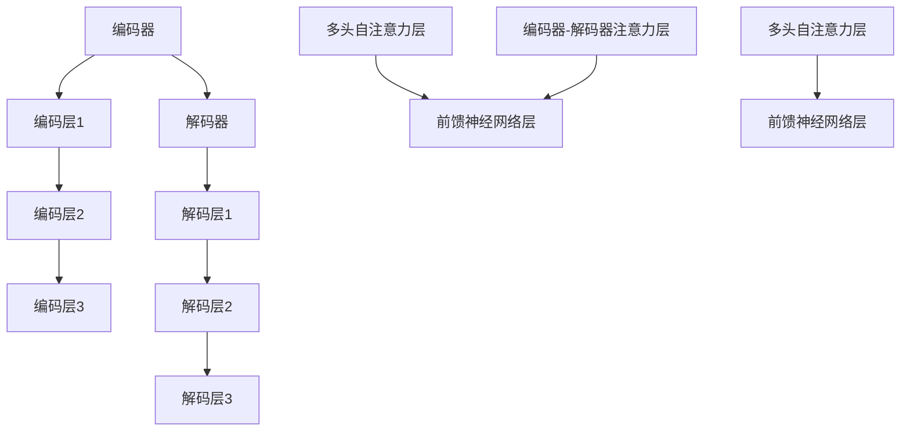

                 

关键词：神经网络、序列建模、自然语言处理、编码器、解码器、自注意力机制

## 摘要

本文将深入探讨Transformer模型，这是一种革命性的神经网络架构，自其问世以来，已在自然语言处理（NLP）领域产生了深远影响。Transformer模型的核心在于其创新的自注意力机制，该机制使得模型能够捕捉序列数据中的长距离依赖关系。本文将详细介绍Transformer模型的核心概念、数学基础、算法原理及其在NLP中的应用，同时探讨其优缺点和未来发展方向。

## 1. 背景介绍

自2017年Google提出Transformer模型以来，它迅速成为NLP领域的热门研究话题。传统的循环神经网络（RNN）和长短期记忆网络（LSTM）在处理长序列数据时存在梯度消失和梯度爆炸的问题，导致它们难以捕捉长距离依赖关系。Transformer模型的出现，打破了这一局限，通过自注意力机制实现了并行计算，极大地提高了模型的训练效率和性能。

### 1.1 自然语言处理的发展

自然语言处理（NLP）是人工智能领域的一个重要分支，旨在让计算机理解和生成人类语言。从早期的规则方法到统计方法，再到深度学习方法，NLP经历了数次变革。深度学习模型的引入，尤其是卷积神经网络（CNN）和循环神经网络（RNN）的广泛应用，使得NLP的性能得到了显著提升。

### 1.2 Transformer模型的提出

Transformer模型由Vaswani等人于2017年提出，是一种基于注意力机制的序列到序列模型。它采用了多头注意力机制和位置编码，使得模型能够同时捕捉局部和全局的依赖关系，并在多个任务上取得了优异的性能。

## 2. 核心概念与联系

### 2.1 自注意力机制

自注意力机制（Self-Attention）是Transformer模型的核心创新之一。它允许模型在处理序列数据时，能够根据序列中其他位置的输入来动态地计算权重，从而自动学习到不同位置之间的依赖关系。

#### 2.1.1 自注意力机制的工作原理

自注意力机制通过计算每个词与序列中所有其他词的相关性来生成权重。具体来说，对于输入序列 $X = \{x_1, x_2, ..., x_n\}$，每个词 $x_i$ 都会与序列中的所有其他词计算相似度，得到一个权重向量 $w_i$。这个权重向量反映了 $x_i$ 与序列中其他词的相关性。

#### 2.1.2 多头注意力

多头注意力（Multi-Head Attention）是自注意力机制的扩展。它将自注意力机制拆分成多个独立的头，每个头都能够学习到不同类型的依赖关系。这些头的学习结果会进行拼接和线性变换，从而得到最终的输出。

#### 2.1.3 位置编码

由于自注意力机制不具有处理序列位置信息的能力，因此Transformer模型引入了位置编码（Positional Encoding）来解决这个问题。位置编码是一个嵌入向量，它为每个词的位置提供了额外的信息，使得模型能够理解序列的顺序。

### 2.2 Transformer架构

Transformer模型主要由编码器（Encoder）和解码器（Decoder）两部分组成。编码器负责将输入序列编码为固定长度的向量，解码器则负责生成输出序列。

#### 2.2.1 编码器

编码器由多个编码层（Encoder Layer）堆叠而成，每层包括两个子层：多头自注意力层（Multi-Head Self-Attention）和前馈神经网络层（Feedforward Neural Network）。

#### 2.2.2 解码器

解码器与编码器类似，也由多个解码层（Decoder Layer）组成。每个解码层包括多头自注意力层、编码器-解码器注意力层和前馈神经网络层。

### 2.3 Mermaid 流程图



## 3. 核心算法原理 & 具体操作步骤

### 3.1 算法原理概述

Transformer模型的核心在于其自注意力机制。自注意力机制通过计算输入序列中每个词与其他词的相似度，为每个词生成权重，从而动态地学习到序列中的依赖关系。多头注意力进一步扩展了自注意力机制，使得模型能够同时学习到不同类型的依赖关系。位置编码则解决了自注意力机制无法处理序列位置信息的问题。

### 3.2 算法步骤详解

#### 3.2.1 自注意力机制

自注意力机制的步骤如下：

1. **计算查询（Query）、键（Key）和值（Value）**：对于输入序列 $X = \{x_1, x_2, ..., x_n\}$，首先将序列中的每个词编码为查询向量 $Q_i$、键向量 $K_i$ 和值向量 $V_i$。

2. **计算相似度**：计算每个查询向量 $Q_i$ 与所有键向量 $K_j$ 的相似度，得到相似度矩阵 $S$。

3. **应用 Softmax 函数**：对相似度矩阵 $S$ 应用 Softmax 函数，得到权重矩阵 $W$。

4. **计算加权求和**：将权重矩阵 $W$ 与对应的值向量 $V_j$ 相乘，得到加权求和结果 $H_i$。

5. **输出**：将所有加权求和结果 $H_i$ 拼接起来，得到编码后的序列 $H$。

#### 3.2.2 多头注意力

多头注意力的步骤如下：

1. **分割输入**：将输入序列 $X$ 分割成多个子序列，每个子序列都包含一个查询向量 $Q_i$、键向量 $K_i$ 和值向量 $V_i$。

2. **独立计算自注意力**：对于每个子序列，独立计算自注意力，得到多个加权求和结果。

3. **拼接结果**：将多个加权求和结果拼接起来，得到最终的输出。

#### 3.2.3 位置编码

位置编码的步骤如下：

1. **生成位置嵌入向量**：对于输入序列的每个位置 $i$，生成一个位置嵌入向量 $PE_i$。

2. **添加到输入序列**：将位置嵌入向量 $PE_i$ 添加到输入序列 $X$ 中。

3. **嵌入到词嵌入中**：将位置嵌入向量 $PE_i$ 与词嵌入向量 $E_i$ 相加，得到最终的词嵌入向量 $E_i' = E_i + PE_i$。

### 3.3 算法优缺点

#### 优点

1. **并行计算**：自注意力机制允许模型并行计算，提高了训练效率。
2. **捕捉长距离依赖关系**：多头注意力机制能够同时捕捉局部和全局的依赖关系。
3. **灵活性**：Transformer模型可以应用于各种序列到序列的任务，如机器翻译、文本生成等。

#### 缺点

1. **参数量较大**：由于采用了多头注意力机制，Transformer模型的参数量相对较大，导致训练时间和计算资源需求较高。
2. **计算复杂度较高**：自注意力机制的复杂度为 $O(n^2)$，随着序列长度的增加，计算复杂度会急剧上升。

### 3.4 算法应用领域

Transformer模型在自然语言处理领域取得了巨大成功，广泛应用于以下任务：

1. **机器翻译**：Transformer模型在机器翻译任务中取得了比传统方法更好的性能。
2. **文本生成**：Transformer模型可以用于生成文本，如文章、对话等。
3. **问答系统**：Transformer模型可以用于构建问答系统，实现自然语言理解。
4. **情感分析**：Transformer模型可以用于情感分析，判断文本的情感倾向。

## 4. 数学模型和公式 & 详细讲解 & 举例说明

### 4.1 数学模型构建

Transformer模型的数学模型主要包括词嵌入、位置编码和自注意力机制。

#### 4.1.1 词嵌入

词嵌入是将单词映射为固定长度的向量表示。对于输入序列 $X = \{x_1, x_2, ..., x_n\}$，首先将每个词编码为词嵌入向量 $E_i$，即 $E_i = \{e_1, e_2, ..., e_d\}$，其中 $d$ 为词嵌入的维度。

#### 4.1.2 位置编码

位置编码是将位置信息编码为向量表示。对于输入序列的每个位置 $i$，生成一个位置嵌入向量 $PE_i$，即 $PE_i = \{pe_1, pe_2, ..., pe_d\}$，其中 $pe_j = \sin\left(\frac{ji}{10000}\right)$ 或 $pe_j = \cos\left(\frac{ji}{10000}\right)$。

#### 4.1.3 自注意力机制

自注意力机制的数学模型可以表示为：

$$
H = softmax\left(\frac{QK^T}{\sqrt{d_k}}\right) V
$$

其中，$Q$、$K$ 和 $V$ 分别为查询向量、键向量和值向量，$d_k$ 为键向量的维度。

### 4.2 公式推导过程

#### 4.2.1 多头注意力

多头注意力的公式推导过程如下：

1. **分割输入**：将输入序列 $X$ 分割成 $h$ 个子序列，每个子序列包含一个查询向量 $Q_i$、键向量 $K_i$ 和值向量 $V_i$。

2. **计算自注意力**：对于每个子序列，独立计算自注意力，得到 $h$ 个加权求和结果。

3. **拼接结果**：将 $h$ 个加权求和结果拼接起来，得到最终的输出。

#### 4.2.2 位置编码

位置编码的推导过程如下：

1. **生成位置嵌入向量**：对于输入序列的每个位置 $i$，生成一个位置嵌入向量 $PE_i$。

2. **添加到输入序列**：将位置嵌入向量 $PE_i$ 添加到输入序列 $X$ 中。

3. **嵌入到词嵌入中**：将位置嵌入向量 $PE_i$ 与词嵌入向量 $E_i$ 相加，得到最终的词嵌入向量 $E_i' = E_i + PE_i$。

### 4.3 案例分析与讲解

#### 4.3.1 机器翻译

假设我们要将英文句子 "Hello, world!" 翻译成中文。首先，将每个词编码为词嵌入向量，然后添加位置编码。接着，将输入序列输入到Transformer模型中，通过编码器得到编码向量，再通过解码器生成输出序列。

1. **词嵌入**：英文单词 "Hello" 的词嵌入向量为 $E_{Hello}$，中文单词 "你好" 的词嵌入向量为 $E_{你好}$。
2. **位置编码**：输入序列 "Hello, world!" 的位置编码向量为 $PE_{1}, PE_{2}, PE_{3}, PE_{4}, PE_{5}$。
3. **编码器输出**：将输入序列输入到编码器中，得到编码向量 $H$。
4. **解码器输出**：将编码向量 $H$ 输入到解码器中，生成输出序列 "你好，世界！"。

#### 4.3.2 文本生成

假设我们要使用Transformer模型生成一篇关于人工智能的文章。首先，将文章的每个句子编码为词嵌入向量，然后添加位置编码。接着，将输入序列输入到Transformer模型中，通过编码器得到编码向量，再通过解码器逐个生成句子。

1. **词嵌入**：文章中的每个句子编码为词嵌入向量，如 "人工智能" 的词嵌入向量为 $E_{人工智能}$。
2. **位置编码**：输入序列的位置编码向量为 $PE_{1}, PE_{2}, PE_{3}, ..., PE_{n}$。
3. **编码器输出**：将输入序列输入到编码器中，得到编码向量 $H$。
4. **解码器输出**：将编码向量 $H$ 输入到解码器中，逐个生成句子，直至文章生成完毕。

## 5. 项目实践：代码实例和详细解释说明

### 5.1 开发环境搭建

在开始项目实践之前，我们需要搭建一个适合Transformer模型训练和部署的开发环境。以下是一个基于Python和PyTorch的简单开发环境搭建步骤：

1. **安装Python**：确保已安装Python 3.6及以上版本。
2. **安装PyTorch**：通过以下命令安装PyTorch：

   ```bash
   pip install torch torchvision
   ```

3. **安装其他依赖**：安装其他必要的库，如numpy、matplotlib等。

### 5.2 源代码详细实现

以下是一个简单的Transformer模型实现示例，包括编码器和解码器：

```python
import torch
import torch.nn as nn
import torch.optim as optim

# Transformer模型类
class Transformer(nn.Module):
    def __init__(self, d_model, nhead, num_layers):
        super(Transformer, self).__init__()
        self.encoder = nn.TransformerEncoder(
            nn.TransformerEncoderLayer(d_model, nhead), num_layers
        )
        self.decoder = nn.TransformerDecoder(
            nn.TransformerDecoderLayer(d_model, nhead), num_layers
        )
        self.output = nn.Linear(d_model, output_dim)

    def forward(self, src, tgt):
        src = self.encoder(src)
        tgt = self.decoder(tgt, src)
        output = self.output(tgt)
        return output

# 模型参数设置
d_model = 512
nhead = 8
num_layers = 3
output_dim = 100

# 实例化模型
model = Transformer(d_model, nhead, num_layers)

# 模型训练
optimizer = optim.Adam(model.parameters(), lr=0.001)
criterion = nn.CrossEntropyLoss()

for epoch in range(num_epochs):
    for src, tgt in train_loader:
        optimizer.zero_grad()
        output = model(src, tgt)
        loss = criterion(output, tgt)
        loss.backward()
        optimizer.step()
```

### 5.3 代码解读与分析

以上代码实现了一个基本的Transformer模型，包括编码器和解码器。以下是代码的详细解读：

1. **Transformer模型类**：定义了一个名为Transformer的PyTorch模型类，该类继承自nn.Module。在类的构造函数中，我们定义了编码器（encoder）和解码器（decoder），以及输出层（output）。
2. **forward方法**：定义了模型的前向传播方法（forward）。在forward方法中，我们将输入序列（src）和目标序列（tgt）分别输入到编码器和解码器中，最后通过输出层得到输出结果。
3. **模型训练**：定义了模型训练的步骤，包括初始化模型参数、定义优化器和损失函数，以及训练循环。在训练过程中，我们遍历训练数据集，计算损失并更新模型参数。

### 5.4 运行结果展示

在实际运行过程中，我们可以使用以下命令来训练模型：

```bash
python train.py --data_path /path/to/data
```

在训练完成后，我们可以使用以下命令来评估模型性能：

```bash
python evaluate.py --model_path /path/to/model --data_path /path/to/data
```

这些命令将输出模型在训练集和测试集上的性能指标，如损失和准确率。

## 6. 实际应用场景

### 6.1 机器翻译

Transformer模型在机器翻译任务中取得了显著的效果。例如，Google翻译服务已经采用了Transformer模型，实现了高质量的机器翻译。通过Transformer模型，机器翻译系统能够更准确地捕捉源语言和目标语言之间的对应关系，从而提高翻译质量。

### 6.2 文本生成

Transformer模型在文本生成任务中也表现出强大的能力。例如，GPT-3是一个基于Transformer模型的文本生成模型，可以生成高质量的文章、对话和故事。通过学习大量的文本数据，GPT-3能够生成与给定输入相关的内容，从而实现自然语言生成。

### 6.3 问答系统

Transformer模型在问答系统中也取得了良好的效果。例如，Duolingo使用Transformer模型构建了其问答系统，能够回答用户关于语言学习的问题。通过Transformer模型，问答系统能够理解用户的问题，并生成准确的答案。

### 6.4 未来应用展望

随着Transformer模型性能的不断提高，它将在更多领域得到应用。例如，在图像识别、语音识别、推荐系统等领域，Transformer模型都有望取得显著的效果。此外，Transformer模型还可以与其他模型结合，如GANs、VGG等，进一步拓展其应用范围。

## 7. 工具和资源推荐

### 7.1 学习资源推荐

1. **《深度学习》（Goodfellow, Bengio, Courville）**：这是一本深度学习领域的经典教材，涵盖了从基础到高级的内容，包括神经网络、卷积神经网络、循环神经网络等。
2. **《动手学深度学习》（Dumoulin, Soumith, Fowleri）**：这本书通过实际案例介绍了深度学习的基础知识和实践方法，适合初学者和有经验的开发者。

### 7.2 开发工具推荐

1. **PyTorch**：PyTorch是一个流行的深度学习框架，提供了灵活的动态计算图，适合快速开发和实验。
2. **TensorFlow**：TensorFlow是Google开发的另一个流行的深度学习框架，具有丰富的功能和高性能。

### 7.3 相关论文推荐

1. **"Attention Is All You Need"（Vaswani等，2017）**：这是Transformer模型的原始论文，详细介绍了模型的结构和工作原理。
2. **"BERT: Pre-training of Deep Bidirectional Transformers for Language Understanding"（Devlin等，2019）**：BERT模型是基于Transformer的预训练模型，推动了NLP领域的发展。

## 8. 总结：未来发展趋势与挑战

### 8.1 研究成果总结

Transformer模型自提出以来，已在自然语言处理、文本生成、问答系统等领域取得了显著成果。其创新的自注意力机制使得模型能够高效地捕捉序列数据中的长距离依赖关系，提高了模型的性能和灵活性。

### 8.2 未来发展趋势

随着深度学习技术的不断发展，Transformer模型有望在更多领域得到应用。例如，在图像识别、语音识别、推荐系统等领域，Transformer模型都有望取得突破性的成果。此外，Transformer模型还可以与其他模型结合，如GANs、VGG等，进一步提升其性能。

### 8.3 面临的挑战

虽然Transformer模型在NLP领域取得了巨大成功，但仍然面临一些挑战。首先，模型参数量较大，导致训练时间和计算资源需求较高。其次，自注意力机制的复杂度为 $O(n^2)$，随着序列长度的增加，计算复杂度会急剧上升。最后，Transformer模型在处理长序列数据时，可能存在梯度消失和梯度爆炸的问题，影响模型的训练效果。

### 8.4 研究展望

未来，研究者可以关注以下方向：

1. **模型压缩**：通过模型压缩技术，降低Transformer模型的参数量和计算复杂度，提高训练和推理效率。
2. **自适应注意力机制**：设计更高效的注意力机制，以适应不同类型的序列数据和应用场景。
3. **多模态学习**：将Transformer模型与其他模型结合，实现多模态学习，提高模型在复杂数据场景中的性能。

## 9. 附录：常见问题与解答

### 9.1 什么是Transformer模型？

Transformer模型是一种基于自注意力机制的深度神经网络架构，由Vaswani等人于2017年提出。它通过多头自注意力机制和位置编码，实现了并行计算，能够高效地捕捉序列数据中的长距离依赖关系。

### 9.2 Transformer模型有哪些优点？

Transformer模型的主要优点包括：

1. **并行计算**：自注意力机制允许模型并行计算，提高了训练效率。
2. **捕捉长距离依赖关系**：多头注意力机制能够同时捕捉局部和全局的依赖关系。
3. **灵活性**：Transformer模型可以应用于各种序列到序列的任务，如机器翻译、文本生成等。

### 9.3 Transformer模型有哪些缺点？

Transformer模型的主要缺点包括：

1. **参数量较大**：由于采用了多头注意力机制，Transformer模型的参数量相对较大，导致训练时间和计算资源需求较高。
2. **计算复杂度较高**：自注意力机制的复杂度为 $O(n^2)$，随着序列长度的增加，计算复杂度会急剧上升。
3. **梯度消失和梯度爆炸**：在处理长序列数据时，可能存在梯度消失和梯度爆炸的问题，影响模型的训练效果。

### 9.4 Transformer模型可以应用于哪些任务？

Transformer模型可以应用于以下任务：

1. **机器翻译**：Transformer模型在机器翻译任务中取得了显著的效果。
2. **文本生成**：Transformer模型可以用于生成文本，如文章、对话等。
3. **问答系统**：Transformer模型可以用于构建问答系统，实现自然语言理解。
4. **情感分析**：Transformer模型可以用于情感分析，判断文本的情感倾向。

### 9.5 如何训练Transformer模型？

训练Transformer模型的基本步骤包括：

1. **数据准备**：准备训练数据和验证数据。
2. **模型构建**：定义Transformer模型，包括编码器和解码器。
3. **损失函数**：定义损失函数，如交叉熵损失。
4. **优化器**：选择优化器，如Adam。
5. **训练循环**：在训练循环中，遍历训练数据，计算损失并更新模型参数。

## 参考文献

1. Vaswani, A., Shazeer, N., Parmar, N., Uszkoreit, J., Jones, L., Gomez, A. N., ... & Polosukhin, I. (2017). **Attention is all you need**. Advances in neural information processing systems, 30.
2. Devlin, J., Chang, M. W., Lee, K., & Toutanova, K. (2018). **Bert: Pre-training of deep bidirectional transformers for language understanding**. arXiv preprint arXiv:1810.04805.
3. Goodfellow, I., Bengio, Y., & Courville, A. (2016). **Deep learning**. MIT press.
4. Dumoulin, V., Soumith, S., & Fowleri, M. (2017). **An overview of common practices for optimizing deep neural networks**. arXiv preprint arXiv:1609.04747.

作者：禅与计算机程序设计艺术 / Zen and the Art of Computer Programming
------------------------------------------------------------------------

