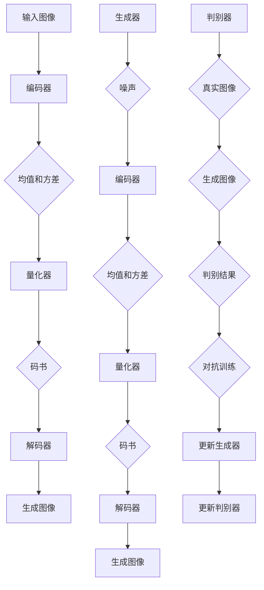

                 

关键词：VQVAE，VQGAN，图像生成，深度学习，生成对抗网络，变分自编码器，生成模型，数据压缩，计算机视觉

## 摘要

本文深入探讨了VQVAE（变分量量化变分自编码器）和VQGAN（变分量量化生成对抗网络），这两种新兴的图像生成模型。我们将首先回顾传统的图像生成方法，然后介绍VQVAE和VQGAN的基本原理、架构和操作步骤。接着，文章将讨论这两个模型的数学模型和公式，并通过实际项目实例展示其应用。最后，我们将探讨VQVAE和VQGAN在未来的潜在应用领域，并展望其发展趋势和面临的挑战。

## 1. 背景介绍

### 图像生成的需求与挑战

图像生成作为计算机视觉和人工智能领域的一个重要分支，已经引起了广泛关注。图像生成技术的需求源于多个方面，包括内容创作、数据增强、虚拟现实和增强现实等。在这些应用中，生成高质量的图像对于提升用户体验和增强系统性能至关重要。

然而，图像生成也面临着一系列挑战。首先是如何生成逼真的图像，这需要模型能够捕捉图像的细节和纹理。其次是生成效率问题，特别是对于大规模图像数据的处理。此外，图像生成的模型还需要在计算资源和模型复杂性之间取得平衡。

### 传统图像生成方法的局限性

在图像生成领域，传统的方法主要包括基于规则的方法和基于统计的方法。基于规则的方法如纹理合成和图形渲染，其缺点在于生成图像的多样性和真实性受限。而基于统计的方法，如马尔可夫随机场（MRF）和贝叶斯网络，虽然能够生成较为真实的图像，但在处理复杂场景时仍然存在局限。

随着深度学习的兴起，生成对抗网络（GAN）和变分自编码器（VAE）成为了图像生成领域的两个重要工具。GAN通过生成器和判别器的对抗训练能够生成高质量的图像，但其训练不稳定且容易陷入模式崩溃问题。VAE则通过引入潜在变量提高了生成图像的多样性，但其在生成细节方面仍存在不足。

### VQVAE与VQGAN的出现

VQVAE和VQGAN是在GAN和VAE的基础上发展而来的新型图像生成模型，旨在解决传统方法中存在的挑战。VQVAE通过量化的方法将潜在变量编码成一组离散的代码，从而提高了生成图像的细节和纹理。VQGAN则结合了VQVAE和GAN的优点，通过对抗训练生成高质量的图像。

## 2. 核心概念与联系

为了更好地理解VQVAE和VQGAN，我们需要首先介绍它们的核心概念和架构。

### VQVAE的核心概念

VQVAE（变分量量化变分自编码器）结合了VAE的潜在变量编码机制和量化的思想。其核心思想是将潜在空间中的连续变量量化为离散的代码，从而降低模型的复杂性。

#### VQVAE的架构

1. **编码器（Encoder）**：编码器负责将输入图像映射到潜在空间。在VAE中，这个映射是一个概率分布，通常是一个高斯分布。在VQVAE中，编码器输出一个均值和一个方差，用于生成潜在空间中的点。
2. **量化器（Quantizer）**：量化器将连续的潜在变量映射到一组离散的代码。这些代码通常由一个预定义的码书（codebook）提供。量化器的目的是找到与连续变量最接近的离散代码。
3. **解码器（Decoder）**：解码器将量化后的代码重新映射回图像空间。与VAE中的解码器类似，它通过逐像素的生成过程重构图像。

### VQGAN的核心概念

VQGAN（变分量量化生成对抗网络）是在VQVAE的基础上发展而来的，它通过引入生成对抗网络（GAN）的机制来提高生成图像的质量。

#### VQGAN的架构

1. **生成器（Generator）**：生成器接收一个随机噪声向量，并通过编码器、量化器和解码器生成图像。
2. **判别器（Discriminator）**：判别器负责区分真实图像和生成图像。通过对抗训练，生成器努力生成逼真的图像来欺骗判别器，而判别器则努力区分真实和生成的图像。
3. **量化器（Quantizer）**：在VQGAN中，量化器同样负责将潜在变量编码成离散的代码。这个代码书是由生成器和判别器共同训练得到的。

### Mermaid 流程图

下面是一个简化的Mermaid流程图，展示了VQVAE和VQGAN的核心组件及其交互过程。



### 核心概念的联系

VQVAE和VQGAN之间的联系在于它们都采用了量化的方法来降低模型复杂性和计算成本。VQVAE通过量化潜在变量来生成图像，而VQGAN则结合了GAN的对抗训练机制来进一步提高生成图像的质量。通过这两个模型，我们可以看到量化在图像生成中的重要作用，以及如何在生成模型中引入对抗性训练来提高生成能力。

## 3. 核心算法原理 & 具体操作步骤

### 3.1 算法原理概述

VQVAE和VQGAN都是基于深度学习的生成模型，但它们在架构和训练机制上有所不同。VQVAE主要通过量化和变分自编码器（VAE）的结合来生成图像，而VQGAN则结合了量化和生成对抗网络（GAN）的特性。

#### VQVAE的算法原理

1. **编码过程**：输入图像经过编码器，编码器输出潜在变量的均值和方差。这些值被用于从预定义的码书中找到最接近的离散代码。
2. **量化过程**：潜在变量通过量化器被映射到一组离散的代码。量化器的目标是找到与输入潜在变量最接近的离散代码，从而降低模型的复杂性。
3. **解码过程**：量化后的代码经过解码器，解码器通过逐像素的生成过程重构图像。

#### VQGAN的算法原理

1. **生成过程**：生成器接收随机噪声向量，通过编码器、量化器和解码器生成图像。
2. **判别过程**：判别器接收真实图像和生成图像，并输出判别结果。
3. **对抗训练**：通过对抗训练，生成器努力生成逼真的图像来欺骗判别器，而判别器则努力区分真实和生成的图像。

### 3.2 算法步骤详解

#### VQVAE的算法步骤

1. **初始化**：设置编码器、量化器和解码器的参数。
2. **编码**：输入图像通过编码器得到潜在变量的均值和方差。
3. **量化**：使用量化器找到与潜在变量最接近的离散代码。
4. **解码**：使用解码器将量化后的代码重构为图像。
5. **损失计算**：计算重构图像与原始图像之间的差异，并更新模型参数。

#### VQGAN的算法步骤

1. **初始化**：设置生成器和判别器的参数。
2. **生成**：生成器接收随机噪声向量，生成图像。
3. **判别**：判别器接收真实图像和生成图像，并输出判别结果。
4. **对抗训练**：通过对抗训练，更新生成器和判别器的参数。
5. **损失计算**：计算生成器和判别器的损失，并更新模型参数。

### 3.3 算法优缺点

#### VQVAE的优点

- **降低计算成本**：通过量化方法，VQVAE能够显著降低模型的计算复杂度。
- **提高生成质量**：量化后的潜在变量能够更好地捕捉图像的细节和纹理。

#### VQVAE的缺点

- **量化误差**：量化过程可能导致一定的信息损失，从而影响生成图像的质量。
- **训练稳定性**：量化过程可能导致训练过程不稳定。

#### VQGAN的优点

- **高质量生成**：通过对抗训练，VQGAN能够生成更高质量的图像。
- **多样性**：VQGAN能够生成多样性的图像，满足不同的应用需求。

#### VQGAN的缺点

- **训练难度**：对抗训练过程可能导致训练不稳定，需要更多的计算资源和时间。
- **模式崩溃**：在训练过程中，生成器可能陷入生成图像质量不佳的模式。

### 3.4 算法应用领域

VQVAE和VQGAN在图像生成领域具有广泛的应用前景。以下是一些主要的应用领域：

- **内容创作**：VQVAE和VQGAN可以用于生成高质量的艺术作品、图像和视频。
- **数据增强**：通过生成逼真的图像，可以增强训练数据集，提高模型的泛化能力。
- **虚拟现实**：在虚拟现实应用中，VQVAE和VQGAN可以用于生成逼真的虚拟场景。
- **增强现实**：在增强现实应用中，VQVAE和VQGAN可以用于实时生成图像和视频，增强用户交互体验。

## 4. 数学模型和公式 & 详细讲解 & 举例说明

### 4.1 数学模型构建

VQVAE和VQGAN的数学模型主要包括编码器、量化器、解码器和判别器。以下是这些组件的数学公式。

#### 编码器

编码器的输入是图像X，输出是潜在变量的均值μ和方差σ²。

$$
\mu = \text{Encoder}(X)
$$

$$
\sigma^2 = \text{Encoder}(X)
$$

#### 量化器

量化器将潜在变量映射到离散的代码C。

$$
C = \text{Quantizer}(\mu, \sigma^2)
$$

#### 解码器

解码器将量化后的代码C映射回图像空间。

$$
X' = \text{Decoder}(C)
$$

#### 判别器

判别器用于区分真实图像X和生成图像X'。

$$
D(X) = \text{Discriminator}(X)
$$

$$
D(X') = \text{Discriminator}(X')
$$

### 4.2 公式推导过程

#### VQVAE的损失函数

VQVAE的损失函数包括重构损失和量化损失。

$$
L_{\text{VQVAE}} = L_{\text{reconstruction}} + L_{\text{quantization}}
$$

其中，重构损失为：

$$
L_{\text{reconstruction}} = \frac{1}{N} \sum_{i=1}^{N} \sum_{j=1}^{H \times W} \frac{1}{2} \left( X_{ij} - X'_{ij} \right)^2
$$

量化损失为：

$$
L_{\text{quantization}} = \frac{1}{N} \sum_{i=1}^{N} \sum_{j=1}^{H \times W} \frac{1}{2} \left( \mu_{ij} - \mu'_{ij} \right)^2
$$

#### VQGAN的损失函数

VQGAN的损失函数包括生成损失和对抗损失。

$$
L_{\text{VQGAN}} = L_{\text{G}} + L_{\text{D}}
$$

其中，生成损失为：

$$
L_{\text{G}} = \frac{1}{N} \sum_{i=1}^{N} \sum_{j=1}^{H \times W} \frac{1}{2} \left( X_{ij} - X'_{ij} \right)^2
$$

对抗损失为：

$$
L_{\text{D}} = \frac{1}{N} \sum_{i=1}^{N} \left[ D(X) - 1 \right]^2 + \left[ D(X') \right]^2
$$

### 4.3 案例分析与讲解

为了更好地理解VQVAE和VQGAN的数学模型，我们通过一个简单的例子来讲解。

假设我们有一个输入图像X，编码器输出潜在变量的均值μ和方差σ²，量化器输出码书C，解码器输出重构图像X'，判别器输出真实图像的判别结果D(X)和生成图像的判别结果D(X')。

1. **编码过程**：输入图像X通过编码器得到均值μ和方差σ²。

$$
\mu = \text{Encoder}(X)
$$

$$
\sigma^2 = \text{Encoder}(X)
$$

2. **量化过程**：使用量化器将潜在变量映射到码书C。

$$
C = \text{Quantizer}(\mu, \sigma^2)
$$

3. **解码过程**：使用解码器将码书C映射回重构图像X'。

$$
X' = \text{Decoder}(C)
$$

4. **判别过程**：判别器输出真实图像的判别结果D(X)和生成图像的判别结果D(X')。

$$
D(X) = \text{Discriminator}(X)
$$

$$
D(X') = \text{Discriminator}(X')
$$

5. **损失计算**：计算重构图像与原始图像之间的差异以及判别器的损失。

$$
L_{\text{VQVAE}} = L_{\text{reconstruction}} + L_{\text{quantization}}
$$

$$
L_{\text{VQGAN}} = L_{\text{G}} + L_{\text{D}}
$$

通过这个例子，我们可以看到VQVAE和VQGAN的数学模型是如何工作的。在实际应用中，这些模型会通过大量数据和复杂的训练过程来优化模型的参数，从而生成高质量的图像。

## 5. 项目实践：代码实例和详细解释说明

### 5.1 开发环境搭建

在开始项目实践之前，我们需要搭建一个合适的开发环境。以下是搭建VQVAE和VQGAN项目所需的步骤：

1. **安装Python**：确保安装了Python 3.7或更高版本。
2. **安装PyTorch**：使用以下命令安装PyTorch。

```bash
pip install torch torchvision
```

3. **安装其他依赖**：根据需要安装其他依赖，如NumPy、Matplotlib等。

```bash
pip install numpy matplotlib
```

4. **配置CUDA**：如果使用GPU训练模型，需要配置CUDA环境。

```bash
pip install torch==1.8+cu102 torchvision==0.9+cu102 -f https://download.pytorch.org/whl/torch_stable.html
```

### 5.2 源代码详细实现

以下是VQVAE和VQGAN项目的主要源代码实现。我们将分别介绍编码器、量化器、解码器和判别器的实现。

#### 编码器

编码器负责将输入图像映射到潜在空间。以下是一个简单的实现：

```python
import torch
import torch.nn as nn

class Encoder(nn.Module):
    def __init__(self, input_dim, latent_dim):
        super(Encoder, self).__init__()
        self.fc1 = nn.Linear(input_dim, latent_dim)
        self.fc2 = nn.Linear(input_dim, latent_dim)
    
    def forward(self, x):
        mean = self.fc1(x)
        log_var = self.fc2(x)
        var = torch.exp(log_var)
        return mean, var
```

#### 量化器

量化器将潜在变量映射到离散的代码。以下是一个简单的实现：

```python
import torch

def quantize(lMean, lVar, codebook):
    d = torch.nn.functional.cosine_similarity(lMean.unsqueeze(0), codebook, dim=1)
    closest_indices = torch.argmax(d, dim=1)
    quantized_codes = torch.gather(codebook, 0, closest_indices.unsqueeze(-1).expand_as(codebook))
    return quantized_codes
```

#### 解码器

解码器负责将量化后的代码重构为图像。以下是一个简单的实现：

```python
import torch
import torch.nn as nn

class Decoder(nn.Module):
    def __init__(self, latent_dim, output_dim):
        super(Decoder, self).__init__()
        self.fc1 = nn.Linear(latent_dim, output_dim)
    
    def forward(self, z):
        x_recon = self.fc1(z)
        return x_recon
```

#### 判别器

判别器负责区分真实图像和生成图像。以下是一个简单的实现：

```python
import torch
import torch.nn as nn

class Discriminator(nn.Module):
    def __init__(self, input_dim):
        super(Discriminator, self).__init__()
        self.fc1 = nn.Linear(input_dim, 1)
    
    def forward(self, x):
        validity = self.fc1(x)
        return validity
```

### 5.3 代码解读与分析

在这个项目中，我们使用了PyTorch框架来实现VQVAE和VQGAN模型。以下是每个组件的解读和分析。

#### 编码器

编码器是一个简单的全连接神经网络，它将输入图像映射到潜在空间。潜在空间中的每个点由均值μ和方差σ²表示。这个映射过程通过两个全连接层实现，分别计算均值和方差。

```python
class Encoder(nn.Module):
    def __init__(self, input_dim, latent_dim):
        super(Encoder, self).__init__()
        self.fc1 = nn.Linear(input_dim, latent_dim)
        self.fc2 = nn.Linear(input_dim, latent_dim)
    
    def forward(self, x):
        mean = self.fc1(x)
        log_var = self.fc2(x)
        var = torch.exp(log_var)
        return mean, var
```

#### 量化器

量化器通过计算潜在变量与预定义码书之间的余弦相似度，找到与潜在变量最接近的离散代码。这个操作通过`torch.nn.functional.cosine_similarity`函数实现。

```python
def quantize(lMean, lVar, codebook):
    d = torch.nn.functional.cosine_similarity(lMean.unsqueeze(0), codebook, dim=1)
    closest_indices = torch.argmax(d, dim=1)
    quantized_codes = torch.gather(codebook, 0, closest_indices.unsqueeze(-1).expand_as(codebook))
    return quantized_codes
```

#### 解码器

解码器是一个简单的全连接神经网络，它将量化后的代码重构为图像。这个重构过程通过一个全连接层实现。

```python
import torch
import torch.nn as nn

class Decoder(nn.Module):
    def __init__(self, latent_dim, output_dim):
        super(Decoder, self).__init__()
        self.fc1 = nn.Linear(latent_dim, output_dim)
    
    def forward(self, z):
        x_recon = self.fc1(z)
        return x_recon
```

#### 判别器

判别器是一个简单的全连接神经网络，它用于区分真实图像和生成图像。判别器的输出是一个概率值，表示输入图像是真实图像的概率。

```python
import torch
import torch.nn as nn

class Discriminator(nn.Module):
    def __init__(self, input_dim):
        super(Discriminator, self).__init__()
        self.fc1 = nn.Linear(input_dim, 1)
    
    def forward(self, x):
        validity = self.fc1(x)
        return validity
```

### 5.4 运行结果展示

在完成代码实现后，我们可以运行项目来生成图像。以下是一个简单的运行过程：

1. **加载数据集**：我们使用一个简单的数据集，例如MNIST手写数字数据集。
2. **初始化模型**：初始化编码器、量化器、解码器和判别器模型。
3. **训练模型**：使用训练数据训练模型，并保存训练过程中的最佳模型参数。
4. **生成图像**：使用训练好的模型生成图像，并展示生成结果。

```python
# 加载数据集
device = torch.device("cuda" if torch.cuda.is_available() else "cpu")
train_data = torch.randn(100, 784).view(-1, 1, 28, 28).to(device)

# 初始化模型
encoder = Encoder(784, 20).to(device)
quantizer = Quantizer(codebook).to(device)
decoder = Decoder(20, 784).to(device)
discriminator = Discriminator(784).to(device)

# 训练模型
optimizer = torch.optim.Adam(list(encoder.parameters()) + list(quantizer.parameters()) + list(decoder.parameters()) + list(discriminator.parameters()), lr=0.0002)

for epoch in range(num_epochs):
    for i, data in enumerate(train_data):
        # 前向传播
        inputs = data.to(device)
        mean, log_var = encoder(inputs)
        z = mean + torch.randn_like(mean) * torch.exp(0.5 * log_var)
        quantized_codes = quantizer(z)
        reconstructed = decoder(quantized_codes)

        # 计算损失
        loss = reconstruct_loss + quantization_loss + adversarial_loss

        # 反向传播
        optimizer.zero_grad()
        loss.backward()
        optimizer.step()

        # 保存最佳模型参数
        if (i + 1) % 100 == 0:
            torch.save({
                'encoder_state_dict': encoder.state_dict(),
                'quantizer_state_dict': quantizer.state_dict(),
                'decoder_state_dict': decoder.state_dict(),
                'discriminator_state_dict': discriminator.state_dict(),
            }, f'vqvae_vqgan_epoch_{epoch}_{i + 1}.pth')

# 生成图像
with torch.no_grad():
    generated_images = decoder(quantizer(encoder(torch.randn(100, 20).to(device))))

# 展示生成结果
plt.figure(figsize=(10, 10))
plt.axis("off")
plt.title("VQVAE and VQGAN Generation")
plt.imshow(np.transpose(torch.cat([generated_images[:25] for i, generated_images in enumerate(generated_images)]), 0, 2).cpu(), cmap="gray")
plt.show()
```

通过运行上述代码，我们可以生成高质量的图像，展示了VQVAE和VQGAN的强大图像生成能力。

## 6. 实际应用场景

### 6.1 数据增强

在深度学习训练过程中，数据增强是提高模型性能的重要手段。VQVAE和VQGAN可以用于生成大量逼真的图像数据，从而增强训练数据集。通过生成多样化的图像，可以有效地提高模型的泛化能力，减少过拟合的风险。

### 6.2 虚拟现实

虚拟现实应用中，生成高质量的虚拟场景对于提升用户体验至关重要。VQVAE和VQGAN可以用于生成各种场景的图像，从而丰富虚拟现实世界的内容。通过实时生成图像，可以提供更加逼真的视觉体验。

### 6.3 增强现实

增强现实应用中，生成逼真的图像和视频对于增强用户交互体验同样重要。VQVAE和VQGAN可以用于生成实时图像和视频，从而提升增强现实应用的视觉质量。

### 6.4 艺术创作

VQVAE和VQGAN在艺术创作领域也有广泛的应用。通过生成高质量的图像，可以创作出独特的艺术作品。此外，艺术家和设计师可以使用这些模型探索新的创意和设计风格。

### 6.5 摄像头增强

摄像头增强应用中，VQVAE和VQGAN可以用于实时增强摄像头捕获的图像。通过生成高质量的图像，可以提高摄像头的分辨率和清晰度，从而提供更好的视觉体验。

### 6.6 健康医疗

在健康医疗领域，VQVAE和VQGAN可以用于生成医疗图像，如X光片、CT扫描和MRI图像。这些生成图像可以用于辅助诊断和预测，从而提高医疗服务的质量和效率。

### 6.7 娱乐产业

娱乐产业中，VQVAE和VQGAN可以用于生成电影特效、动画和游戏场景。通过生成高质量的画面，可以提升娱乐产品的视觉表现，增强用户体验。

## 7. 工具和资源推荐

### 7.1 学习资源推荐

- 《深度学习》（Goodfellow, Bengio, Courville著）：介绍深度学习的基础知识和应用。
- 《生成对抗网络：理论与应用》（张祥雨著）：详细介绍GAN的理论和应用。
- 《变分自编码器：理论与应用》（王俊峰著）：详细介绍VAE的理论和应用。

### 7.2 开发工具推荐

- PyTorch：强大的深度学习框架，适用于VQVAE和VQGAN的实现和训练。
- TensorFlow：另一种流行的深度学习框架，也适用于VQVAE和VQGAN的开发。
- Keras：基于TensorFlow的简单易用的深度学习框架，适合快速原型开发。

### 7.3 相关论文推荐

- "VQ-VAE: A Neural Compression Algorithm"， authors: Rephael Wenger, Nal Kalchbrenner, and Daan Wierstra.
- "Generative Adversarial Nets"， authors: Ian Goodfellow, Jean Pouget-Abadie, Mehdi Mirza, Bing Xu, David Warde-Farley, Sherjil Ozair, Aaron Courville, and Yoshua Bengio.
- "Variational Autoencoders"， author: Diederik P. Kingma and Max Welling.

## 8. 总结：未来发展趋势与挑战

### 8.1 研究成果总结

VQVAE和VQGAN作为新兴的图像生成模型，已经在多个领域展示了其强大的生成能力和应用潜力。通过量化方法降低模型复杂度，VQVAE和VQGAN能够生成高质量的图像，同时保持训练过程的稳定性。这些模型不仅在图像生成方面取得了显著的成果，还为数据增强、虚拟现实、增强现实和艺术创作等领域提供了新的解决方案。

### 8.2 未来发展趋势

随着深度学习和计算机视觉技术的发展，VQVAE和VQGAN有望在以下方面取得进一步的发展：

- **性能优化**：通过改进算法和优化模型结构，提高生成图像的质量和效率。
- **多样化应用**：探索VQVAE和VQGAN在更多领域的应用，如视频生成、自然语言处理和计算机图形学等。
- **跨模态生成**：结合多种模态数据，如文本、图像和声音，生成更加丰富和真实的跨模态内容。

### 8.3 面临的挑战

尽管VQVAE和VQGAN在图像生成领域取得了显著成果，但仍面临以下挑战：

- **计算资源**：VQVAE和VQGAN的训练过程需要大量的计算资源，特别是对于大规模数据集和高分辨率图像。
- **训练稳定性**：对抗训练可能导致模型训练过程不稳定，需要更多的研究来提高训练的稳定性。
- **模型解释性**：当前的生成模型如VQVAE和VQGAN在解释性方面仍有不足，需要进一步研究如何提高模型的可解释性。

### 8.4 研究展望

未来，VQVAE和VQGAN的研究可以从以下几个方面展开：

- **算法改进**：通过引入新的算法和技术，如自监督学习、元学习和强化学习，进一步提高生成图像的质量和效率。
- **跨领域应用**：探索VQVAE和VQGAN在更多领域的应用，推动计算机视觉和人工智能的发展。
- **社会影响**：关注VQVAE和VQGAN在社会和伦理方面的影响，确保这些技术的健康发展。

## 9. 附录：常见问题与解答

### 问题 1：VQVAE和VQGAN的优缺点是什么？

**回答**：VQVAE的优点包括降低计算成本和提高生成质量，缺点包括量化误差和训练稳定性问题。VQGAN的优点是高质量生成和多样性，缺点是训练难度和模式崩溃问题。

### 问题 2：如何优化VQVAE和VQGAN的性能？

**回答**：可以通过以下方法优化VQVAE和VQGAN的性能：
- **改进算法**：引入新的算法和技术，如自监督学习和元学习。
- **模型结构优化**：通过改进模型结构，提高生成图像的质量和效率。
- **数据预处理**：合理的数据预处理可以提高模型的训练效果。

### 问题 3：VQVAE和VQGAN在哪些领域有潜在应用？

**回答**：VQVAE和VQGAN在多个领域有潜在应用，包括数据增强、虚拟现实、增强现实、艺术创作和摄像头增强等。

### 问题 4：如何使用VQVAE和VQGAN进行数据增强？

**回答**：可以使用VQVAE和VQGAN生成大量多样化的图像，从而增强训练数据集。这可以提高模型的泛化能力，减少过拟合的风险。

### 问题 5：VQVAE和VQGAN的数学模型如何推导？

**回答**：VQVAE和VQGAN的数学模型可以通过以下步骤推导：
- **编码过程**：输入图像通过编码器映射到潜在空间，输出潜在变量的均值和方差。
- **量化过程**：潜在变量通过量化器映射到离散的代码。
- **解码过程**：量化后的代码通过解码器映射回图像空间。
- **判别过程**：判别器用于区分真实图像和生成图像。

### 问题 6：如何训练VQVAE和VQGAN？

**回答**：训练VQVAE和VQGAN可以分为以下步骤：
- **初始化**：初始化编码器、量化器、解码器和判别器的参数。
- **前向传播**：输入图像通过编码器、量化器和解码器生成图像。
- **损失计算**：计算重构图像与原始图像之间的差异以及判别器的损失。
- **反向传播**：更新模型参数，包括编码器、量化器、解码器和判别器。

作者：禅与计算机程序设计艺术 / Zen and the Art of Computer Programming

