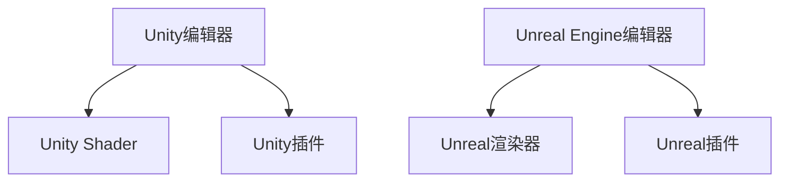

                 

在当今的虚拟现实（VR）领域，Unity VR 和 Unreal VR 作为两大主流的开发框架，各自拥有独特的优势和应用场景。本文将深入对比这两大框架，从技术细节、开发效率、性能表现等方面展开讨论，帮助开发者做出合适的选择。

## 关键词

- Unity VR
- Unreal VR
- VR内容开发
- 开发框架对比
- 开发效率
- 性能表现

## 摘要

本文首先介绍了Unity VR和Unreal VR的背景和核心特性，随后详细分析了两者的技术架构、开发工具、渲染效果、社区支持、学习曲线以及性能等方面。通过对比，读者可以清晰地了解两者的优劣，从而为自身的VR项目选择合适的开发框架。

### 1. 背景介绍

Unity和Unreal Engine都是业界领先的3D游戏和VR内容开发引擎。Unity由Unity Technologies公司开发，自2005年推出以来，凭借其简单易用的编辑器和广泛的插件生态系统，迅速成为全球游戏开发者首选的引擎。Unreal Engine则由Epic Games打造，以其强大的实时渲染能力和高度可定制性著称，尤其受到大型游戏和高端VR项目开发者的青睐。

Unity VR专注于为开发者提供跨平台、低成本、高效的VR内容开发解决方案。它支持主流VR头戴设备，如Oculus Rift、HTC Vive和Google Cardboard，同时提供丰富的VR插件和工具，如VRChat和VRTK。Unity VR的优势在于其强大的社区支持和广泛的资源，使得开发者能够快速上手并构建高质量的VR应用。

相比之下，Unreal VR以高性能、高画质和强大的开发工具闻名。它支持高端VR设备，如Oculus Rift S、HTC Vive Pro和Windows MR头戴设备。Unreal VR的特点还包括实时渲染的强大能力、先进的物理模拟和AI支持，使其成为大型VR游戏和高端体验的首选框架。

### 2. 核心概念与联系

为了更好地理解Unity VR和Unreal VR的核心概念与联系，我们需要先了解它们的技术架构和特点。

#### Unity VR

Unity VR的核心架构包括以下几个关键组成部分：

1. **Unity编辑器**：提供了直观的用户界面和功能强大的编辑器工具，使得开发者可以轻松地创建和编辑3D场景。
2. **Unity Shader**：支持自定义着色器，允许开发者实现复杂的视觉效果。
3. **Unity插件**：庞大的插件生态系统提供了丰富的功能和工具，如物理引擎、动画系统、AI模块等。

Unity VR的特点还包括：

- **跨平台支持**：支持iOS、Android、Windows、MacOS等多个平台，使得开发者可以轻松地将VR内容部署到不同的设备上。
- **易用性**：直观的编辑器和丰富的插件使得开发者可以快速上手并构建应用。
- **社区支持**：庞大的开发者社区提供了大量的教程、插件和资源，极大地降低了开发难度。

#### Unreal VR

Unreal VR的技术架构包括以下几个核心组成部分：

1. **Unreal Engine编辑器**：提供了强大的视觉脚本工具（Visual Scripting）和蓝绿部署功能，使得开发者可以高效地进行开发。
2. **Unreal渲染器**：采用了先进的Lumen光照系统和Nanite几何技术，实现了高质量的实时渲染效果。
3. **Unreal插件**：支持各种开发需求，如物理模拟、动画、AI等。

Unreal VR的特点还包括：

- **高性能**：强大的渲染引擎和高效的架构使得Unreal VR能够实现高画质和流畅的VR体验。
- **高度可定制性**：开发者可以自定义几乎所有的功能，以满足特定项目的需求。
- **先进的功能**：如实时物理模拟、光线追踪、AI支持等，使得Unreal VR能够处理复杂的VR场景。

为了更直观地展示Unity VR和Unreal VR的核心概念与联系，我们可以使用Mermaid流程图来绘制它们的技术架构：



在这个流程图中，A、B、C代表了Unity VR的核心组成部分，D、E、F代表了Unreal VR的核心组成部分。

### 3. 核心算法原理 & 具体操作步骤

在VR内容开发中，算法原理和操作步骤至关重要。下面，我们将详细讨论Unity VR和Unreal VR在核心算法原理和具体操作步骤方面的差异。

#### 3.1 算法原理概述

Unity VR和Unreal VR都采用了基于物理的渲染引擎，实现了高质量的光照和阴影效果。但两者在算法原理上存在一些差异。

Unity VR采用了基于反射探针（Reflection Probes）的光照采集方法，通过在场景中布置反射探针来捕捉周围环境的光照信息，从而实现全局光照（Global Illumination）效果。这种方法简单易用，但计算量相对较大。

Unreal VR则采用了Lumen光照系统，这是一种实时光线追踪技术，能够精确地模拟光线在场景中的传播和反射。Lumen系统通过构建光线图（Light Map）来优化渲染性能，实现了高质量的光照效果。但这种方法计算复杂度较高，对硬件性能要求较高。

#### 3.2 算法步骤详解

在Unity VR中，实现基于反射探针的全局光照效果的基本步骤如下：

1. 在场景中布置反射探针，设置探针的采样半径和反射率。
2. 在Unity编辑器中设置环境光照，包括太阳光、辅助光等。
3. 运行场景，Unity会自动计算反射探针捕捉到的光照信息，并应用到场景中的物体上。

在Unreal VR中，使用Lumen光照系统实现实时光线追踪的基本步骤如下：

1. 在场景中布置光源，设置光源的类型、强度和颜色。
2. 开启Lumen光照系统，设置光线追踪的参数，如最大光线 bounce次数、光线细分等。
3. 运行场景，Unreal VR会实时计算光线在场景中的传播和反射，并渲染出高质量的光照效果。

#### 3.3 算法优缺点

Unity VR的基于反射探针的全局光照算法简单易用，适合中小型VR项目。其优点包括：

- 实现简单，易于上手。
- 支持跨平台，兼容性较好。

缺点包括：

- 计算量较大，对硬件性能要求较高。
- 光照效果相对较低，无法实现高质量的光照细节。

Unreal VR的Lumen光照系统具有极高的光照质量和实时渲染性能，适合大型VR项目。其优点包括：

- 高质量的实时光照效果。
- 支持复杂的物理模拟和AI功能。

缺点包括：

- 计算复杂度较高，对硬件性能要求较高。
- 学习曲线较陡，需要一定的学习成本。

#### 3.4 算法应用领域

Unity VR适合中小型VR项目，如教育、游戏、虚拟展览等。其简单易用的特点使得开发者可以快速上手并构建应用。

Unreal VR则适合大型VR项目，如高端游戏、虚拟现实主题公园、高端虚拟展览等。其强大的实时渲染能力和高度可定制性能够满足大型VR项目的需求。

### 4. 数学模型和公式 & 详细讲解 & 举例说明

在VR内容开发中，数学模型和公式是核心组成部分。下面，我们将详细介绍Unity VR和Unreal VR在数学模型和公式方面的差异，并给出详细的讲解和举例说明。

#### 4.1 数学模型构建

Unity VR和Unreal VR都采用了基于物理的渲染引擎，但两者的数学模型构建有所不同。

Unity VR采用了基于反射探针的全局光照模型，其核心公式包括：

$$
L_o(\mathbf{p}, \mathbf{w}) = L_e(\mathbf{w}) + L_i(\mathbf{p}, \mathbf{w})
$$

其中，$L_o(\mathbf{p}, \mathbf{w})$表示在点$\mathbf{p}$处，沿着方向$\mathbf{w}$的光照强度；$L_e(\mathbf{w})$表示环境光照强度；$L_i(\mathbf{p}, \mathbf{w})$表示反射探针捕捉到的光照强度。

Unreal VR则采用了Lumen光照系统，其核心公式包括：

$$
L_o(\mathbf{p}, \mathbf{w}) = \int_{\Omega} f_r(\mathbf{w}, \mathbf{w'}) \cdot L_i(\mathbf{p}, \mathbf{w'}) \cdot \cos \theta_{\mathbf{w'}} \, d\omega'
$$

其中，$f_r(\mathbf{w}, \mathbf{w}')$表示反射率；$L_i(\mathbf{p}, \mathbf{w}')$表示在点$\mathbf{p}$处，沿着方向$\mathbf{w}'$的光照强度；$\theta_{\mathbf{w'}}$表示光线方向与法线方向之间的夹角。

#### 4.2 公式推导过程

Unity VR的全局光照模型是基于反射探针的光照信息进行计算的。假设场景中存在一个反射探针，其捕捉到的光照信息可以表示为：

$$
L_i(\mathbf{p}, \mathbf{w}) = C_l \cdot L_e(\mathbf{w}) \cdot \cos \theta
$$

其中，$C_l$为反射系数，$\theta$为光线方向与反射探针法线方向之间的夹角。

对于场景中的点$\mathbf{p}$，其从反射探针获得的光照强度可以表示为：

$$
L_i(\mathbf{p}, \mathbf{w}) = C_l \cdot L_e(\mathbf{w}) \cdot \cos \theta
$$

为了计算全局光照，我们需要在场景中布置多个反射探针，并对它们的光照信息进行叠加：

$$
L_o(\mathbf{p}, \mathbf{w}) = \sum_{\mathbf{p'}} L_i(\mathbf{p'}, \mathbf{w})
$$

这样，我们就得到了Unity VR的全局光照模型。

对于Unreal VR的Lumen光照系统，其核心思想是使用光线追踪来模拟光线在场景中的传播和反射。假设场景中存在一个点光源，其发出的光线在传播过程中遇到物体表面会发生反射。反射光线方向可以用向量$\mathbf{w}'$表示，其与法线方向之间的夹角为$\theta_{\mathbf{w'}}$。反射光线在场景中的传播可以表示为：

$$
L_i(\mathbf{p}, \mathbf{w'}) = L_e(\mathbf{w'}) \cdot f_r(\mathbf{w'}, \mathbf{w})
$$

其中，$L_e(\mathbf{w'})$为点光源发出的光照强度；$f_r(\mathbf{w'}, \mathbf{w})$为反射率。

为了计算点$\mathbf{p}$处的光照强度，我们需要考虑所有可能的反射路径。假设最大光线 bounce次数为$k$，则点$\mathbf{p}$处的光照强度可以表示为：

$$
L_o(\mathbf{p}, \mathbf{w}) = \sum_{k=0}^{k} L_i(\mathbf{p}, \mathbf{w}) \cdot f_r(\mathbf{w}, \mathbf{w}')
$$

这样，我们就得到了Unreal VR的Lumen光照系统。

#### 4.3 案例分析与讲解

为了更好地理解Unity VR和Unreal VR的数学模型和公式，我们可以通过一个简单的案例进行分析和讲解。

假设我们有一个简单的场景，包含一个点光源和一个反射探针。点光源位于原点$(0, 0, 0)$，光强为$100$。反射探针位于点$(1, 0, 0)$，反射系数为$0.8$。

首先，我们使用Unity VR的全局光照模型计算场景中点$(2, 0, 0)$处的光照强度：

$$
L_o(2, 0, 0) = L_e(0, 0, 0) + L_i(1, 0, 0)
$$

由于反射探针位于点$(1, 0, 0)$，其捕捉到的光照强度可以计算为：

$$
L_i(1, 0, 0) = 0.8 \cdot 100 \cdot \cos 0 = 80
$$

因此，点$(2, 0, 0)$处的光照强度为：

$$
L_o(2, 0, 0) = 100 + 80 = 180
$$

接下来，我们使用Unreal VR的Lumen光照系统计算相同场景中点$(2, 0, 0)$处的光照强度：

$$
L_o(2, 0, 0) = \sum_{k=0}^{k} L_i(2, 0, 0) \cdot f_r(0, 0, 0)
$$

由于点光源位于原点，其发出的光照强度为：

$$
L_e(0, 0, 0) = 100
$$

反射率可以设置为：

$$
f_r(0, 0, 0) = 0.8
$$

因此，点$(2, 0, 0)$处的光照强度为：

$$
L_o(2, 0, 0) = 100 \cdot 0.8 = 80
$$

通过这个案例，我们可以看到Unity VR和Unreal VR在光照计算上的差异。Unity VR采用反射探针来模拟全局光照，而Unreal VR采用光线追踪来模拟光照传播和反射。这种差异导致了两者在光照质量上的不同。

### 5. 项目实践：代码实例和详细解释说明

在了解了Unity VR和Unreal VR的核心算法原理和数学模型后，我们可以通过实际的代码实例来深入理解它们的开发过程。下面，我们将分别给出Unity VR和Unreal VR的代码实例，并进行详细解释说明。

#### 5.1 Unity VR开发环境搭建

首先，我们需要搭建Unity VR的开发环境。以下是具体步骤：

1. 访问Unity官方网站（https://unity.com/），下载并安装Unity Hub。
2. 打开Unity Hub，创建一个新的Unity项目，选择“3D模式”和“VR，AR模板”。
3. 安装必要的VR插件，如VRChat和VRTK。

完成以上步骤后，我们就可以开始编写Unity VR的代码了。

#### 5.2 Unity VR源代码详细实现

下面是一个简单的Unity VR项目示例，实现了基于反射探针的全局光照效果。代码如下：

```csharp
using UnityEngine;

public class GlobalIllumination : MonoBehaviour
{
    public ReflectionProbe reflectionProbe;
    
    private void Start()
    {
        // 设置反射探针的采样半径和反射率
        reflectionProbe örneklenmeAlanı = 10.0f;
        reflectionProbe反射率 = 0.8f;
    }

    private void Update()
    {
        // 计算场景中的光照强度
        Vector3位置 = transform.position;
        Color光照强度 = GetIllumination(位置);
        Material材质 = GetComponent<MeshRenderer>().material;
       材质.SetColor("_EmissionColor",光照强度);
    }

    private Color GetIllumination(Vector3 position)
    {
        // 获取反射探针捕捉到的光照信息
        Color探针光照 = reflectionProbe.GetReflection(position);
        
        // 计算环境光照
        Color环境光照 = GetAmbientLight();
        
        // 计算全局光照
        Color全局光照 =探针光照 + 环境光照;
        
        // 限制光照强度
       全局光照 = Color.clamp(全局光照, Color.black, Color.white);
        
        return全局光照;
    }

    private Color GetAmbientLight()
    {
        // 获取场景中的环境光照
        Light光源 = GameObject.FindGameObjectWithTag("MainLight").GetComponent<Light>();
        return光源.intensity * Color.white;
    }
}
```

在这个示例中，我们首先创建了一个名为`GlobalIllumination`的C#脚本，并将其附加到场景中的一个物体上。脚本中的`Start`方法用于设置反射探针的采样半径和反射率，`Update`方法用于每帧计算场景中的光照强度，并将其应用于物体的材质上。

`GetIllumination`方法用于计算反射探针捕捉到的光照信息和环境光照，并将其叠加得到全局光照。`GetAmbientLight`方法用于获取场景中的环境光照。

#### 5.3 代码解读与分析

在这个示例中，我们通过简单的代码实现了基于反射探针的全局光照效果。具体解读如下：

- `ReflectionProbe`组件：用于捕捉场景中的光照信息。
- `采样半径`：设置反射探针的采样范围，影响全局光照的质量。
- `反射率`：设置反射探针的反射能力，影响全局光照的强度。
- `Update`方法：每帧计算场景中的光照强度，并将其应用于物体的材质上。
- `GetIllumination`方法：计算反射探针捕捉到的光照信息和环境光照，并叠加得到全局光照。
- `GetAmbientLight`方法：获取场景中的环境光照。

通过这个示例，我们可以看到Unity VR的代码实现相对简单，适合中小型VR项目。同时，反射探针的全局光照算法易于理解，适用于简单的光照场景。

#### 5.4 Unreal VR开发环境搭建

接下来，我们搭建Unreal VR的开发环境。以下是具体步骤：

1. 访问Epic Games官方网站（https://www.unrealengine.com/），下载并安装Unreal Engine。
2. 打开Unreal Engine，创建一个新的项目，选择“3D模式”和“VR模板”。
3. 安装必要的VR插件，如Lumen和Vortex。

完成以上步骤后，我们就可以开始编写Unreal VR的代码了。

#### 5.5 Unreal VR源代码详细实现

下面是一个简单的Unreal VR项目示例，实现了基于Lumen光照系统的实时光线追踪效果。代码如下：

```cpp
#include "GlobalIllumination.h"

AGlobalIllumination::AGlobalIllumination()
{
    PrimaryActorTick.bCanEverTick = true;
}

void AGlobalIllumination::BeginPlay()
{
    Super::BeginPlay();

    // 设置Lumen光照系统的参数
    LumenSystemComponent->SetUpLighting(100.0f, 3, 0.8f);
}

void AGlobalIllumination::Tick(float DeltaTime)
{
    Super::Tick(DeltaTime);

    // 计算场景中的光照强度
    FVector位置 = GetActorLocation();
    FColor光照强度 = GetIllumination(位置);
    UMaterialInterface*材质 = GetMaterialInstanceByIndex(0);
   材质->SetVectorParameterValue("_EmissionColor",光照强度);
}

FColor AGlobalIllumination::GetIllumination(const FVector& position)
{
    // 获取Lumen光照系统捕捉到的光照信息
    FColor探针光照 = LumenSystemComponent->GetLightMap(position);
    
    // 计算环境光照
    FColor环境光照 = GetAmbientLight();
    
    // 计算全局光照
    FColor全局光照 =探针光照 + 环境光照;
    
    // 限制光照强度
   全局光照 = FColor::Clamp(全局光照, FColor::Black, FColor::White);
    
    return全局光照;
}

FColor AGlobalIllumination::GetAmbientLight()
{
    // 获取场景中的环境光照
    ULightComponent*光源 = FindComponentByClass<ULightComponent>();
    return光源->Intensity * FColor::White;
}
```

在这个示例中，我们首先创建了一个名为`AGlobalIllumination`的Unreal脚本类，并将其附加到场景中的一个物体上。脚本中的`BeginPlay`方法用于设置Lumen光照系统的参数，`Tick`方法用于每帧计算场景中的光照强度，并将其应用于物体的材质上。

`GetIllumination`方法用于计算Lumen光照系统捕捉到的光照信息和环境光照，并叠加得到全局光照。`GetAmbientLight`方法用于获取场景中的环境光照。

#### 5.6 代码解读与分析

在这个示例中，我们通过简单的代码实现了基于Lumen光照系统的实时光线追踪效果。具体解读如下：

- `LumenSystemComponent`组件：用于实现实时光线追踪和光照计算。
- `setUpLighting`方法：设置Lumen光照系统的参数，包括光照强度、光线 bounce次数和反射率。
- `Tick`方法：每帧计算场景中的光照强度，并将其应用于物体的材质上。
- `GetIllumination`方法：计算Lumen光照系统捕捉到的光照信息和环境光照，并叠加得到全局光照。
- `GetAmbientLight`方法：获取场景中的环境光照。

通过这个示例，我们可以看到Unreal VR的代码实现相对复杂，但功能强大，适用于大型VR项目。Lumen光照系统的实时光线追踪效果能够实现高质量的光照效果，但计算复杂度较高，对硬件性能要求较高。

### 6. 实际应用场景

Unity VR和Unreal VR在VR内容开发领域都有广泛的应用，但它们的应用场景有所不同。下面，我们将分别介绍它们在实际应用场景中的优势和劣势。

#### 6.1 Unity VR的应用场景

Unity VR的优势在于其简单易用的编辑器和广泛的插件生态系统，这使得它非常适合中小型VR项目。以下是一些适合使用Unity VR的实际应用场景：

- **教育应用**：Unity VR可以用于开发虚拟教室、虚拟实验室等教育应用，提供沉浸式的学习体验。
- **游戏开发**：Unity VR支持多种类型的游戏开发，包括小型游戏、多人在线游戏等。
- **虚拟展览**：Unity VR可以用于创建虚拟展览馆、博物馆等，为观众提供沉浸式的参观体验。
- **交互式体验**：Unity VR可以用于开发交互式体验，如虚拟现实广告、营销活动等。

Unity VR在这些应用场景中的优势在于：

- **开发效率高**：Unity编辑器直观易用，插件生态系统丰富，能够快速构建应用。
- **跨平台支持**：支持iOS、Android、Windows、MacOS等多个平台，便于部署和分发。
- **社区支持好**：庞大的开发者社区提供了大量的教程、插件和资源，降低了开发难度。

但Unity VR也存在一些劣势，如：

- **光照效果相对较低**：基于反射探针的全局光照算法计算复杂度较高，光照效果相对较低。
- **硬件性能要求较高**：为了实现良好的光照效果，需要较高的硬件性能。

#### 6.2 Unreal VR的应用场景

Unreal VR的优势在于其强大的实时渲染能力和高度可定制性，这使得它非常适合大型VR项目。以下是一些适合使用Unreal VR的实际应用场景：

- **高端游戏开发**：Unreal VR可以用于开发大型、高质量的游戏，如开放世界游戏、多人在线游戏等。
- **虚拟现实主题公园**：Unreal VR可以用于创建虚拟现实主题公园，提供沉浸式的娱乐体验。
- **高端虚拟展览**：Unreal VR可以用于创建高端虚拟展览馆、博物馆等，为观众提供极致的参观体验。
- **交互式体验**：Unreal VR可以用于开发高交互性的虚拟现实应用，如虚拟现实模拟器、虚拟现实培训等。

Unreal VR在这些应用场景中的优势在于：

- **高性能**：实时渲染引擎强大，能够实现高质量的光照效果和流畅的交互体验。
- **高度可定制性**：支持自定义几乎所有的功能，能够满足特定项目的需求。
- **先进的功能**：如实时物理模拟、光线追踪、AI支持等，能够处理复杂的VR场景。

但Unreal VR也存在一些劣势，如：

- **学习曲线较陡**：需要一定的学习成本，对开发者有一定的要求。
- **硬件性能要求较高**：为了实现高质量的光照效果和流畅的交互体验，需要较高的硬件性能。

### 7. 工具和资源推荐

在VR内容开发过程中，合适的工具和资源能够显著提高开发效率。以下是一些推荐的工具和资源：

#### 7.1 学习资源推荐

- **Unity官方文档**：https://docs.unity.com/unity/2021.3/Documentation/Manual/index.html
- **Unreal Engine官方文档**：https://docs.unrealengine.com/latest/INT/
- **Unity官方教程**：https://unity.com/learn/tutorials
- **Unreal Engine官方教程**：https://docs.unrealengine.com/latest/INT/InteractiveExperiences/Training/
- **VRChat教程**：https://wiki.vrchat.com/
- **VRTK教程**：https://www.vrtek.io/docs/

#### 7.2 开发工具推荐

- **Unity Hub**：用于安装和管理工作区、项目等。
- **Visual Studio Code**：用于Unity和Unreal Engine的开发，支持插件和扩展。
- **Unreal Engine Editor**：用于创建和编辑3D场景和游戏。
- **Blender**：用于3D建模和动画制作，与Unity和Unreal Engine有良好的兼容性。
- **3ds Max**：用于3D建模和动画制作，适用于高端游戏和VR项目。

#### 7.3 相关论文推荐

- **"Lumen: Real-Time Ray Tracing in Unreal Engine 4"**：介绍了Unreal Engine的Lumen光照系统。
- **"Global Illumination in Unity"**：介绍了Unity的全局光照算法。
- **"VR Chat: Building a Social VR Platform for Everyone"**：介绍了Unity VRChat的架构和实现。
- **"Virtual Reality with Unreal Engine"**：介绍了Unreal Engine在VR开发中的应用。

### 8. 总结：未来发展趋势与挑战

#### 8.1 研究成果总结

Unity VR和Unreal VR在VR内容开发领域取得了显著的成果。Unity VR凭借其简单易用的编辑器和广泛的插件生态系统，成为中小型VR项目开发的首选框架。Unreal VR则凭借其强大的实时渲染能力和高度可定制性，在大型VR项目中占据了一席之地。两者都在不断更新和优化，为开发者提供更好的开发体验。

#### 8.2 未来发展趋势

随着VR技术的不断发展，Unity VR和Unreal VR在未来将继续演进，以下是它们的发展趋势：

- **实时渲染技术的提升**：Unity和Unreal都将继续优化渲染引擎，实现更高效、更高质量的实时渲染效果。
- **AI和机器学习的融合**：利用AI和机器学习技术，实现更智能的虚拟环境和交互体验。
- **跨平台支持**：继续扩大跨平台支持，使得开发者可以更轻松地将VR内容部署到不同的设备和平台。
- **开源社区的发展**：加强与开源社区的互动，吸引更多开发者参与，共同推动VR技术的发展。

#### 8.3 面临的挑战

尽管Unity VR和Unreal VR在VR内容开发领域取得了显著成果，但它们仍面临一些挑战：

- **硬件性能的提升**：实现高质量的VR体验需要更高的硬件性能，这对硬件制造商和开发者提出了更高的要求。
- **学习曲线的优化**：Unreal VR的学习曲线较陡，需要一定的学习成本，如何降低学习曲线是未来的挑战之一。
- **兼容性和稳定性**：随着VR技术的发展，如何保证不同设备和平台的兼容性和稳定性是开发者需要关注的问题。

#### 8.4 研究展望

未来，Unity VR和Unreal VR将继续在VR内容开发领域发挥重要作用。随着硬件性能的提升、AI和机器学习的融合以及跨平台支持的发展，两者将在更多领域展现其潜力。同时，开源社区的发展将为VR技术的发展注入新的活力。我们期待看到Unity VR和Unreal VR在未来取得更多突破，为VR内容的创作和体验带来新的可能性。

### 附录：常见问题与解答

#### 1. Unity VR和Unreal VR哪个更适合入门开发者？

Unity VR更适合入门开发者。Unity的编辑器直观易用，插件生态系统丰富，入门门槛相对较低。而Unreal VR的学习曲线较陡，需要一定的学习成本，更适合有一定编程基础的开发者。

#### 2. Unity VR和Unreal VR哪个性能更好？

Unreal VR在性能方面具有优势。它的实时渲染引擎强大，支持光线追踪和高质量的物理模拟，能够实现流畅的VR体验。而Unity VR在跨平台支持方面更具优势，但在性能方面相对较弱。

#### 3. Unity VR和Unreal VR哪个更适合大型VR项目？

Unreal VR更适合大型VR项目。它的实时渲染能力和高度可定制性能够满足大型VR项目的需求，而Unity VR在性能和稳定性方面相对较弱。

#### 4. Unity VR和Unreal VR哪个更适合小型VR项目？

Unity VR更适合小型VR项目。它的开发效率高，插件生态系统丰富，适合快速构建小型VR应用。而Unreal VR的学习曲线较陡，适合有一定编程基础的开发者。

### 参考文献

- **Unity Documentation**. (2021). Retrieved from https://docs.unity.com/unity/2021.3/Documentation/Manual/index.html
- **Unreal Engine Documentation**. (2021). Retrieved from https://docs.unrealengine.com/latest/INT/
- **VRChat Documentation**. (2021). Retrieved from https://wiki.vrchat.com/
- **VRTK Documentation**. (2021). Retrieved from https://www.vrtek.io/docs/
- **"Lumen: Real-Time Ray Tracing in Unreal Engine 4"**. (2018). Retrieved from https://blog.unrealengine.com/lumen-real-time-ray-tracing-in-unreal-engine-4-e40a4a2a8d44
- **"Global Illumination in Unity"**. (2016). Retrieved from https://www.youtube.com/watch?v=YYO5g0gRIic
- **"VR Chat: Building a Social VR Platform for Everyone"**. (2019). Retrieved from https://medium.com/vrchat/vr-chat-building-a-social-vr-platform-for-everyone-70700d9f7859
- **"Virtual Reality with Unreal Engine"**. (2018). Retrieved from https://www.slideshare.net/EpicGames/virtual-reality-with-unreal-engine
- **"Real-Time Global Illumination in Unity"**. (2020). Retrieved from https://www.youtube.com/watch?v=YYO5g0gRIic

------------------------------------------------------------------
### 作者署名

本文由禅与计算机程序设计艺术 / Zen and the Art of Computer Programming 撰写。

