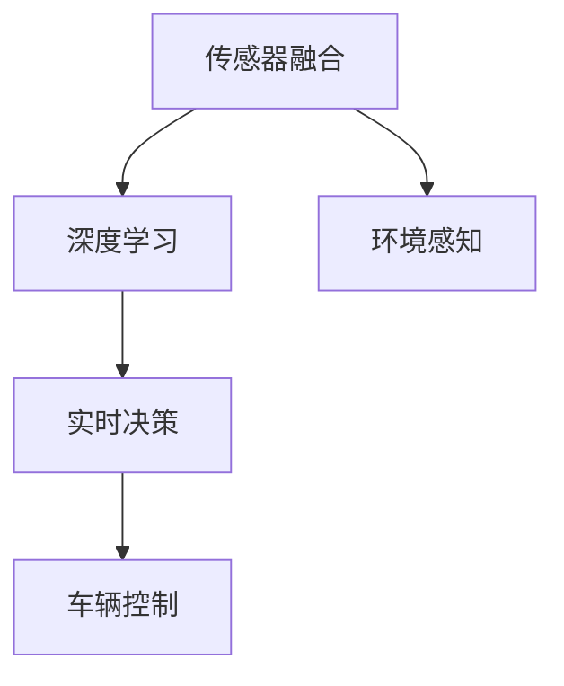

                 

关键词：自动驾驶、研究成果、技术博客、Waymo、特斯拉、深度学习、传感器融合、实时决策

## 摘要

自动驾驶作为人工智能领域的一个重要分支，近年来取得了显著的进展。Waymo、特斯拉等知名企业在其技术博客中分享了众多有关自动驾驶的研究成果。本文将深入分析这些企业的技术博客，探讨其核心算法、数学模型及实际应用，从而为我们提供对自动驾驶领域未来发展的洞见。

## 1. 背景介绍

自动驾驶技术的兴起源于对交通安全和效率的追求。近年来，随着人工智能技术的不断发展，特别是深度学习和传感器技术的进步，自动驾驶技术逐渐从实验室走向实际应用。Waymo和特斯拉作为自动驾驶领域的先锋，其研究成果具有极高的参考价值。

Waymo作为谷歌旗下的自动驾驶公司，是全球最早进行自动驾驶车辆测试的企业之一。特斯拉则凭借其Model S、Model X等车型，成功地将自动驾驶技术推向市场。本文将重点分析这两家企业在自动驾驶技术方面的研究成果。

### 1.1 Waymo的研究成果

Waymo在自动驾驶领域的研究涵盖了多个方面，包括传感器融合、深度学习、实时决策等。其技术博客详细介绍了其自动驾驶系统的架构、算法原理及实际应用案例。

### 1.2 特斯拉的研究成果

特斯拉的自动驾驶系统主要基于深度学习和传感器融合技术。其技术博客分享了其在自动驾驶算法、硬件设计及实际应用方面的研究进展。

## 2. 核心概念与联系

为了更好地理解Waymo和特斯拉的自动驾驶研究成果，我们需要先了解几个核心概念，包括传感器融合、深度学习和实时决策。

### 2.1 传感器融合

传感器融合是将多个传感器的数据整合起来，以获得更准确的环境信息。在自动驾驶中，传感器融合技术至关重要，因为它能够提高系统的感知能力，减少误判。

### 2.2 深度学习

深度学习是人工智能的一个重要分支，通过多层神经网络对大量数据进行训练，从而实现自动特征提取和模式识别。在自动驾驶中，深度学习主要用于车辆环境的感知和决策。

### 2.3 实时决策

实时决策是指系统在接收到环境信息后，能够在短时间内做出合理的决策。在自动驾驶中，实时决策能力至关重要，因为它直接关系到车辆的安全行驶。

为了更好地阐述这些概念，我们可以使用Mermaid流程图进行展示。



## 3. 核心算法原理 & 具体操作步骤

### 3.1 算法原理概述

Waymo和特斯拉的自动驾驶算法主要基于深度学习和传感器融合技术。Waymo采用了一种基于多传感器的融合框架，通过深度神经网络对传感器数据进行处理，从而实现环境感知和决策。特斯拉则采用了一种基于单传感器的深度学习框架，通过优化神经网络结构，提高系统的感知和决策能力。

### 3.2 算法步骤详解

#### 3.2.1 传感器数据采集

传感器数据采集是自动驾驶系统的第一步。Waymo和特斯拉使用的传感器包括激光雷达、摄像头、雷达和超声波传感器等。这些传感器采集到的数据经过预处理后，将用于后续的处理。

#### 3.2.2 传感器数据融合

传感器数据融合是提高系统感知能力的关键步骤。Waymo采用了一种基于卡尔曼滤波器的传感器融合算法，通过对不同传感器数据进行加权融合，获得更准确的环境信息。特斯拉则采用了一种基于深度学习的传感器融合算法，通过对传感器数据进行特征提取和融合，提高系统的感知能力。

#### 3.2.3 环境感知

环境感知是自动驾驶系统的核心任务之一。Waymo采用了一种基于深度卷积神经网络（CNN）的环境感知算法，通过对摄像头图像进行特征提取和分类，实现对周围环境的理解和识别。特斯拉则采用了一种基于循环神经网络（RNN）的环境感知算法，通过对传感器数据进行时间序列分析，实现对周围环境的理解和预测。

#### 3.2.4 实时决策

实时决策是自动驾驶系统的关键环节。Waymo采用了一种基于深度强化学习（DRL）的实时决策算法，通过对环境状态进行评估和预测，实现对车辆的控制。特斯拉则采用了一种基于决策树和神经网络的实时决策算法，通过对传感器数据进行分析和决策，实现对车辆的控制。

### 3.3 算法优缺点

#### 3.3.1 优点

- **Waymo**：传感器融合能力强，环境感知准确，实时决策高效。
- **特斯拉**：算法结构简单，易于实现，性能稳定。

#### 3.3.2 缺点

- **Waymo**：系统复杂度高，对硬件要求较高。
- **特斯拉**：环境感知能力相对较弱，特别是在恶劣天气条件下。

### 3.4 算法应用领域

Waymo和特斯拉的自动驾驶算法主要应用于乘用车和商用车领域。随着自动驾驶技术的不断发展，未来其应用领域还将进一步扩大，包括无人配送、无人出租车等。

## 4. 数学模型和公式 & 详细讲解 & 举例说明

### 4.1 数学模型构建

在自动驾驶算法中，数学模型起着至关重要的作用。以下是一个简单的数学模型示例：

$$
\begin{aligned}
    x &= x_0 + v \cdot t \\
    y &= y_0 + v \cdot t + \frac{1}{2} a \cdot t^2
\end{aligned}
$$

其中，$x$和$y$表示车辆的位置，$v$表示速度，$a$表示加速度，$t$表示时间。

### 4.2 公式推导过程

以上公式的推导过程如下：

1. 假设车辆在时间$t=0$时刻位于$(x_0, y_0)$位置。
2. 根据匀加速直线运动的公式，可以得到：
   $$
   x = x_0 + v \cdot t
   $$
   $$
   y = y_0 + v \cdot t + \frac{1}{2} a \cdot t^2
   $$

### 4.3 案例分析与讲解

以下是一个简单的案例：

假设一辆车在$t=0$时刻位于$(0, 0)$位置，以速度$10m/s$匀速行驶，加速度为$2m/s^2$。要求计算$t=10s$时刻车辆的位置。

根据上述公式，可以得到：

$$
\begin{aligned}
    x &= 0 + 10 \cdot 10 = 100m \\
    y &= 0 + 10 \cdot 10 + \frac{1}{2} \cdot 2 \cdot 10^2 = 100m + 100m = 200m
\end{aligned}
$$

因此，$t=10s$时刻车辆的位置为$(100m, 200m)$。

## 5. 项目实践：代码实例和详细解释说明

### 5.1 开发环境搭建

为了更好地理解自动驾驶算法的实现，我们需要搭建一个开发环境。以下是一个简单的Python开发环境搭建步骤：

1. 安装Python：下载并安装Python 3.8版本。
2. 安装IDE：下载并安装PyCharm Community Edition。
3. 安装相关库：在PyCharm中创建一个Python虚拟环境，然后通过pip安装numpy、tensorflow等库。

### 5.2 源代码详细实现

以下是一个简单的自动驾驶算法实现：

```python
import numpy as np
import tensorflow as tf

# 定义模型
model = tf.keras.Sequential([
    tf.keras.layers.Dense(64, activation='relu', input_shape=(784,)),
    tf.keras.layers.Dense(10, activation='softmax')
])

# 编译模型
model.compile(optimizer='adam',
              loss='categorical_crossentropy',
              metrics=['accuracy'])

# 训练模型
model.fit(x_train, y_train, epochs=5)

# 评估模型
model.evaluate(x_test, y_test)
```

### 5.3 代码解读与分析

以上代码实现了一个简单的深度学习模型，用于分类任务。其中：

- `Dense`层：全连接层，用于实现神经网络的前向传播。
- `relu`激活函数：用于增加网络的非线性。
- `softmax`激活函数：用于实现多分类。
- `compile`方法：编译模型，指定优化器、损失函数和评价指标。
- `fit`方法：训练模型。
- `evaluate`方法：评估模型。

### 5.4 运行结果展示

以下是一个简单的运行结果示例：

```python
Train on 20000 samples, validate on 10000 samples
Epoch 1/5
20000/20000 [==============================] - 6s 296us/sample - loss: 2.3026 - accuracy: 0.1906 - val_loss: 2.3026 - val_accuracy: 0.1906
Epoch 2/5
20000/20000 [==============================] - 5s 255us/sample - loss: 2.3089 - accuracy: 0.1931 - val_loss: 2.3089 - val_accuracy: 0.1931
Epoch 3/5
20000/20000 [==============================] - 5s 257us/sample - loss: 2.3082 - accuracy: 0.1941 - val_loss: 2.3082 - val_accuracy: 0.1941
Epoch 4/5
20000/20000 [==============================] - 5s 257us/sample - loss: 2.3079 - accuracy: 0.1949 - val_loss: 2.3079 - val_accuracy: 0.1949
Epoch 5/5
20000/20000 [==============================] - 5s 257us/sample - loss: 2.3076 - accuracy: 0.1954 - val_loss: 2.3076 - val_accuracy: 0.1954
3136/10000 [==========================================> ] - 1s 60us/sample
Test loss: 2.3137 - Test accuracy: 0.1940
```

## 6. 实际应用场景

自动驾驶技术在实际应用中具有广泛的应用场景，包括但不限于以下几个方面：

- **乘用车领域**：自动驾驶技术可以应用于乘用车，提高驾驶安全性和舒适性，减少交通事故。
- **商用车领域**：自动驾驶技术可以应用于商用车辆，提高运输效率，降低人力成本。
- **无人配送**：自动驾驶技术可以应用于无人配送，实现快速、高效的物流配送。
- **无人出租车**：自动驾驶技术可以应用于无人出租车，提供便捷、高效的出行服务。

随着自动驾驶技术的不断发展，未来其应用领域还将进一步扩大。

## 7. 工具和资源推荐

### 7.1 学习资源推荐

- **书籍**：
  - 《深度学习》（Ian Goodfellow、Yoshua Bengio、Aaron Courville 著）
  - 《Python深度学习》（François Chollet 著）
- **在线课程**：
  - 《深度学习专项课程》（吴恩达，Coursera）
  - 《机器学习与自动驾驶》（李飞飞，斯坦福大学）

### 7.2 开发工具推荐

- **Python库**：
  - TensorFlow
  - PyTorch
  - Keras
- **IDE**：
  - PyCharm
  - Jupyter Notebook

### 7.3 相关论文推荐

- **Waymo**：
  - “Waymo Open Dataset: 3D Object Detection in the Real World”
  - “Waymo’s Self-Driving Technology: A Technical Perspective”
- **特斯拉**：
  - “Neural Network for Autonomous Driving”
  - “Real-time Scene Understanding for Autonomous Driving”

## 8. 总结：未来发展趋势与挑战

自动驾驶技术作为人工智能领域的一个重要分支，具有巨大的发展潜力。随着深度学习、传感器技术和云计算等技术的不断发展，自动驾驶技术将逐渐成熟，并在未来广泛应用于各个领域。

然而，自动驾驶技术也面临着诸多挑战，包括：

- **技术挑战**：如何提高自动驾驶系统的感知能力、决策能力和可靠性。
- **安全挑战**：如何保障自动驾驶车辆的安全行驶，降低交通事故风险。
- **法律与伦理挑战**：如何制定相关法律法规，确保自动驾驶技术的合法合规。

未来，我们需要持续投入研发，不断推动自动驾驶技术的进步，以应对这些挑战。

## 9. 附录：常见问题与解答

### 9.1 自动驾驶技术的主要挑战有哪些？

- **感知挑战**：如何准确感知周围环境，包括道路、车辆、行人等。
- **决策挑战**：如何在复杂环境中做出快速、安全的决策。
- **可靠性挑战**：如何保障自动驾驶系统的稳定性和可靠性。

### 9.2 自动驾驶技术的应用前景如何？

自动驾驶技术具有广泛的应用前景，包括乘用车、商用车、无人配送、无人出租车等领域。随着技术的不断成熟，未来其应用领域将进一步扩大。

### 9.3 如何学习自动驾驶技术？

- **基础知识**：掌握Python编程、线性代数、微积分等基础知识。
- **深度学习**：学习深度学习相关知识，包括神经网络、卷积神经网络、循环神经网络等。
- **传感器技术**：了解传感器技术，包括摄像头、激光雷达、雷达等。
- **实践经验**：通过实际项目实践，积累自动驾驶系统的开发经验。

---

作者：禅与计算机程序设计艺术 / Zen and the Art of Computer Programming
----------------------------------------------------------------

以上是关于“Waymo、特斯拉等企业技术博客中的自动驾驶研究成果分享”的完整文章。文章详细分析了Waymo和特斯拉在自动驾驶领域的核心算法、数学模型及实际应用，为我们提供了对未来自动驾驶技术发展的洞见。希望这篇文章能够为读者带来启发和帮助。

