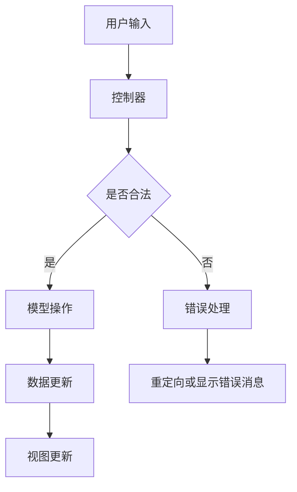

                 

Web开发框架是现代网站开发中不可或缺的一部分。它们为开发者提供了结构和工具，使得网站的开发、部署和维护变得更加高效和可靠。本文将深入探讨Web开发框架的核心概念、工作原理、以及如何选择和应用这些框架来提升网站开发效率。

## 文章关键词

- Web开发
- 框架
- 效率
- 可维护性
- 用户体验

## 文章摘要

本文旨在为开发者提供关于Web开发框架的全面指南。首先，我们将回顾Web开发的历史和框架的重要性。接着，我们将探讨几种流行的Web开发框架，如MVC、MVVM和函数式编程框架。之后，我们将详细解释这些框架的工作原理，并提供选择框架时需要考虑的因素。最后，我们将讨论如何通过实践来应用这些框架，以及它们在未来的发展趋势。

---

## 1. 背景介绍

### Web开发的历史

Web开发的起源可以追溯到1989年，由蒂姆·伯纳斯·李（Tim Berners-Lee）提出。最早的Web应用非常简单，主要由静态HTML页面组成，这些页面由开发者手动编写和更新。随着互联网的普及，Web应用的需求迅速增长，开发者开始寻找更有效的方法来构建和维护网站。

### 框架的出现

为了应对Web应用的复杂性，开发者开始创建框架，以提供一套预定义的结构和工具来简化开发过程。框架的出现解决了多个问题，包括代码复用、模块化、安全性、性能优化和可维护性。早期的框架，如PHP的PHP:PHP Framework（PHPF）和Java的Struts，为Web开发带来了新的可能。

## 2. 核心概念与联系

### Web开发框架的概念

Web开发框架是一种软件库或集合，它提供了一套预定义的模块和组件，用于处理Web应用的不同方面。这些框架通常遵循特定的设计模式，如MVC（模型-视图-控制器）、MVVM（模型-视图-视图模型）等，以提供一种结构化的开发方式。

### MVC设计模式

MVC（模型-视图-控制器）是一种广泛使用的设计模式，用于分离Web应用的三个主要方面：

- **模型（Model）**：负责处理数据逻辑和业务规则。
- **视图（View）**：负责展示数据，通常通过用户界面。
- **控制器（Controller）**：负责接收用户输入，调用模型和视图，并处理用户请求。

### Mermaid流程图

下面是一个简化的MVC架构的Mermaid流程图：



### 其他设计模式

除了MVC，还有其他一些流行的设计模式，如MVVM和函数式编程框架，它们也广泛应用于Web开发。

## 3. 核心算法原理 & 具体操作步骤

### 3.1 算法原理概述

Web开发框架的核心算法通常涉及以下几个方面：

- **路由算法**：用于解析用户请求并确定相应的控制器和视图。
- **中间件**：用于处理请求和响应，如身份验证、日志记录和跨域请求。
- **模板引擎**：用于生成动态页面，通常涉及文本替换和数据绑定。

### 3.2 算法步骤详解

以下是Web开发框架中常见算法的步骤详解：

#### 路由算法

1. **解析请求**：接收HTTP请求，提取路径信息和查询参数。
2. **匹配路由**：使用正则表达式或其他匹配算法，将请求路径与路由配置进行匹配。
3. **执行控制器**：调用与匹配路由对应的控制器方法，传入必要的数据。
4. **生成响应**：控制器处理请求后，生成响应数据，通常为HTML、JSON或其他格式。

#### 中间件

1. **注册中间件**：在框架初始化时，将中间件注册到请求处理链中。
2. **请求处理**：当请求到达时，框架依次调用注册的中间件。
3. **中间件处理**：每个中间件可以执行特定的操作，如身份验证、日志记录或修改请求/响应。
4. **最终处理**：请求处理完成后，将响应返回给客户端。

#### 模板引擎

1. **模板加载**：加载HTML模板文件。
2. **数据绑定**：将模型数据绑定到模板中的相应标记。
3. **模板渲染**：生成包含动态数据的HTML页面。
4. **响应发送**：将渲染后的HTML页面发送给客户端。

### 3.3 算法优缺点

**路由算法**

- **优点**：提高请求处理的效率，实现动态路由，支持RESTful架构。
- **缺点**：正则表达式匹配可能导致性能下降，维护复杂。

**中间件**

- **优点**：提高代码复用性和灵活性，支持定制化处理。
- **缺点**：中间件处理顺序错误可能导致问题，调试困难。

**模板引擎**

- **优点**：简化页面渲染过程，支持数据绑定，提高开发效率。
- **缺点**：模板语法复杂，可能导致性能问题。

### 3.4 算法应用领域

Web开发框架广泛应用于各种Web应用场景，包括：

- **电商网站**：处理大量用户请求和订单管理。
- **社交媒体**：处理用户互动和数据存储。
- **内容管理系统**：提供易用的内容创建和管理功能。
- **在线教育平台**：处理用户学习和资源管理。

## 4. 数学模型和公式 & 详细讲解 & 举例说明

### 4.1 数学模型构建

在Web开发中，数学模型用于解决各种问题，如性能优化、数据分析和算法设计。以下是几个常见的数学模型：

#### 请求处理时间模型

- **公式**：\( T = f(n, r) \)
  - \( T \)：请求处理时间
  - \( n \)：并发请求数量
  - \( r \)：服务器响应速度

#### 数据传输模型

- **公式**：\( D = b \times t \)
  - \( D \)：数据传输量
  - \( b \)：带宽
  - \( t \)：传输时间

#### 缓存命中率模型

- **公式**：\( H = \frac{HIT}{HIT + MISS} \)
  - \( H \)：缓存命中率
  - \( HIT \)：命中次数
  - \( MISS \)：未命中次数

### 4.2 公式推导过程

#### 请求处理时间模型

假设服务器在单位时间内可以处理\( r \)个请求，同时有\( n \)个并发请求。那么，每个请求的平均处理时间\( T \)为：

\[ T = \frac{1}{r} \times n \]

简化后得到：

\[ T = f(n, r) \]

#### 数据传输模型

根据带宽和传输时间的关系，数据传输量\( D \)可以表示为带宽\( b \)与传输时间\( t \)的乘积：

\[ D = b \times t \]

#### 缓存命中率模型

缓存命中率\( H \)是命中次数\( HIT \)与未命中次数\( MISS \)的比例。假设总请求次数为\( HIT + MISS \)，则缓存命中率\( H \)为：

\[ H = \frac{HIT}{HIT + MISS} \]

### 4.3 案例分析与讲解

#### 请求处理时间模型案例

假设服务器在单位时间内可以处理10个请求，同时有100个并发请求。根据公式：

\[ T = f(n, r) = \frac{1}{10} \times 100 = 10 \]

因此，每个请求的平均处理时间为10秒。

#### 数据传输模型案例

假设带宽为10Mbps，传输时间为5秒。根据公式：

\[ D = b \times t = 10Mbps \times 5s = 50MB \]

因此，数据传输量为50MB。

#### 缓存命中率模型案例

假设缓存中有100次命中和50次未命中。根据公式：

\[ H = \frac{HIT}{HIT + MISS} = \frac{100}{100 + 50} = 0.67 \]

因此，缓存命中率约为67%。

## 5. 项目实践：代码实例和详细解释说明

### 5.1 开发环境搭建

在进行Web开发框架项目实践之前，我们需要搭建一个开发环境。以下是一个简单的步骤指南：

1. **安装Node.js**：Node.js是一个基于Chrome V8引擎的JavaScript运行环境，用于执行JavaScript代码。您可以从Node.js官网（https://nodejs.org/）下载并安装。
2. **安装数据库**：根据项目需求，您可以选择MySQL、PostgreSQL或其他数据库。我们在这里使用MySQL作为示例。您可以从MySQL官网（https://www.mysql.com/）下载并安装。
3. **创建项目文件夹**：在您的计算机上创建一个项目文件夹，例如命名为`web_framework_project`。
4. **初始化项目**：在项目文件夹中运行以下命令来初始化项目：

```bash
npm init -y
```

这将生成一个`package.json`文件，用于管理项目依赖。

### 5.2 源代码详细实现

以下是一个简单的Web应用示例，使用Express.js框架实现。Express.js是一个流行的Node.js Web应用框架。

1. **安装Express.js**：在项目文件夹中运行以下命令来安装Express.js：

```bash
npm install express
```

2. **创建主文件**：在项目文件夹中创建一个名为`app.js`的文件，这是Web应用的主文件。

```javascript
const express = require('express');
const app = express();

app.use(express.json());
app.use(express.urlencoded({ extended: true }));

app.get('/', (req, res) => {
  res.send('Hello, World!');
});

app.post('/login', (req, res) => {
  const { username, password } = req.body;
  // 这里可以添加身份验证逻辑
  res.send(`Welcome, ${username}!`);
});

const PORT = process.env.PORT || 3000;
app.listen(PORT, () => {
  console.log(`Server is running on port ${PORT}`);
});
```

3. **运行应用**：在命令行中运行以下命令来启动应用：

```bash
node app.js
```

此时，您可以在浏览器中访问`http://localhost:3000/`，应该会看到“Hello, World!”的输出。

### 5.3 代码解读与分析

以下是`app.js`文件中的代码解读和分析：

```javascript
const express = require('express');
const app = express();
```

这两行代码引入并实例化了Express.js框架。

```javascript
app.use(express.json());
app.use(express.urlencoded({ extended: true }));
```

这两行代码设置了中间件，用于处理JSON和URL编码的请求。

```javascript
app.get('/', (req, res) => {
  res.send('Hello, World!');
});
```

这是一个简单的GET请求处理函数，当访问根路径时，会返回“Hello, World!”。

```javascript
app.post('/login', (req, res) => {
  const { username, password } = req.body;
  // 这里可以添加身份验证逻辑
  res.send(`Welcome, ${username}!`);
});
```

这是一个简单的POST请求处理函数，用于处理登录请求。它从请求体中提取用户名和密码，并返回一个欢迎消息。

```javascript
const PORT = process.env.PORT || 3000;
app.listen(PORT, () => {
  console.log(`Server is running on port ${PORT}`);
});
```

最后一部分代码设置了应用的监听端口。如果环境变量`PORT`存在，则使用该端口，否则默认使用3000端口。

### 5.4 运行结果展示

运行应用后，在浏览器中访问`http://localhost:3000/`，您将看到“Hello, World!”的输出。

在浏览器中，访问`http://localhost:3000/login`并尝试发送一个POST请求，例如：

```http
POST http://localhost:3000/login
Content-Type: application/json

{
  "username": "alice",
  "password": "alice123"
}
```

您将看到以下响应：

```http
HTTP/1.1 200 OK
Content-Type: text/plain

Welcome, alice!
```

这表明您的Web应用已成功处理登录请求。

## 6. 实际应用场景

### 6.1 电商网站

电商网站通常需要处理大量用户请求，如商品浏览、购物车管理和订单处理。使用Web开发框架，如Express.js或Django，可以轻松实现这些功能，并提供一个高性能和可扩展的后端。

### 6.2 社交媒体

社交媒体平台需要处理用户之间的互动，如帖子发布、评论和私信。框架如Node.js的Socket.io可以实现实时通信，提供良好的用户体验。

### 6.3 内容管理系统

内容管理系统（CMS）允许非技术用户轻松创建和管理网站内容。框架如WordPress和Joomla提供了丰富的功能和插件，使开发和管理变得简单。

### 6.4 在线教育平台

在线教育平台需要处理课程内容、用户注册和学习进度等。框架如Laravel和Rails提供了强大的后端支持，可以快速构建功能丰富的在线教育平台。

## 7. 工具和资源推荐

### 7.1 学习资源推荐

- **书籍**：
  - 《Web开发技术详解》
  - 《Node.js开发实战》
  - 《Laravel框架实战》
- **在线课程**：
  - Udemy：Web开发课程
  - Coursera：Web开发专项课程
  - Pluralsight：Node.js开发课程

### 7.2 开发工具推荐

- **文本编辑器**：
  - Visual Studio Code
  - Sublime Text
  - Atom
- **版本控制**：
  - Git
  - GitHub
  - GitLab
- **数据库工具**：
  - MySQL Workbench
  - PostgreSQL Desktop
  - MongoDB Compass

### 7.3 相关论文推荐

- **《Web应用框架的设计与实现》**
- **《Node.js架构设计与性能优化》**
- **《Laravel框架的组件化开发与扩展》**

## 8. 总结：未来发展趋势与挑战

### 8.1 研究成果总结

随着Web应用的不断发展，Web开发框架在性能、可维护性和灵活性方面取得了显著进展。现代框架提供了丰富的功能，如自动化的路由处理、中间件支持和模板引擎，使得开发者可以更快速地构建高质量的应用。

### 8.2 未来发展趋势

未来，Web开发框架将继续朝着模块化、自动化和智能化方向发展。例如，框架将更加注重性能优化、安全性提升和开发者体验。此外，随着云计算和物联网的普及，框架将支持更多的集成和扩展，以应对不同的应用场景。

### 8.3 面临的挑战

尽管Web开发框架取得了显著进展，但仍面临一些挑战：

- **安全性**：随着网络攻击的日益复杂，框架需要提供更强大的安全功能，以保护用户数据。
- **性能优化**：随着用户需求的增长，框架需要提供更高效的处理机制，以应对高并发请求。
- **跨平台支持**：随着移动设备和物联网设备的普及，框架需要支持更多的平台和设备，以提供一致的体验。

### 8.4 研究展望

未来的研究将重点关注以下几个方面：

- **自动化工具**：开发自动化工具，以简化框架配置和部署过程。
- **智能优化**：利用机器学习技术，实现智能性能优化和资源管理。
- **安全性增强**：通过引入新的安全机制，提高框架的安全性。

## 9. 附录：常见问题与解答

### 9.1 Web开发框架有什么优点？

Web开发框架提供了以下几个优点：

- **提高开发效率**：框架提供了一套预定义的结构和工具，简化了开发过程。
- **代码复用**：框架鼓励模块化开发，使得代码可以复用，降低了维护成本。
- **可维护性**：框架遵循设计模式，使得代码结构更加清晰，易于维护。
- **性能优化**：框架提供了多种优化策略，如缓存、中间件等，以提高性能。

### 9.2 如何选择适合的Web开发框架？

选择适合的Web开发框架时，应考虑以下几个因素：

- **项目需求**：根据项目需求选择适合的框架，如前端框架、后端框架或全栈框架。
- **团队经验**：选择团队熟悉的框架，以提高开发效率和减少学习成本。
- **性能要求**：根据性能要求选择适合的框架，如Node.js框架适合高并发场景。
- **社区支持**：选择社区活跃、文档齐全的框架，以获得更好的支持和资源。

### 9.3 Web开发框架是否会影响用户体验？

Web开发框架在一定程度上会影响用户体验，但并不是决定性因素。框架提供了结构化的开发方式，可以确保应用的一致性和可维护性。然而，用户体验主要取决于前端设计和开发质量，如响应式设计、加载速度和交互体验等。因此，选择合适的框架并注重前端开发质量，可以提升用户体验。

---

本文旨在为开发者提供关于Web开发框架的全面指南。通过介绍框架的历史、核心概念、算法原理和实践应用，希望读者能够更好地理解和选择适合自己的框架，提升网站开发效率。在未来，随着技术的发展，Web开发框架将继续创新和优化，为开发者提供更强大的工具和更好的开发体验。作者：禅与计算机程序设计艺术 / Zen and the Art of Computer Programming。|end|

