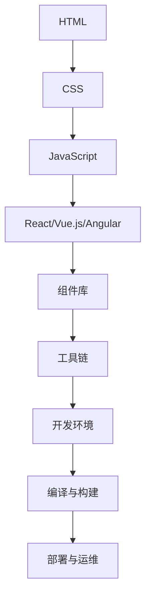
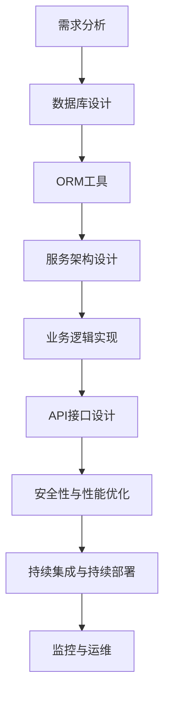

                 

关键词：Web 开发框架、网站开发效率、Web 框架设计、前端框架、后端框架、编程模式、开发工具、最佳实践。

> 摘要：本文深入探讨了 Web 开发框架在提升网站开发效率方面的作用。通过对比分析多种流行框架，探讨了它们的核心概念、架构设计、开发流程以及在实际应用中的效果。本文还介绍了数学模型和公式，提供了代码实例和详细解释，以及给出了未来发展的展望。

## 1. 背景介绍

随着互联网技术的飞速发展，网站开发已经成为现代信息技术中不可或缺的一部分。Web 开发框架作为一种工具，旨在提高开发效率、减少重复劳动、提升代码质量。然而，随着框架种类的不断增多，如何选择合适的框架成为一个亟待解决的问题。

Web 开发框架主要分为前端框架和后端框架两大类。前端框架如 React、Vue.js、Angular 等，旨在解决前端开发中的复杂性问题，提供高效的可维护性。后端框架如 Flask、Django、Spring Boot 等，则专注于提供快速开发、扩展性和高可维护性的后端服务。

在 Web 开发过程中，选择合适的框架至关重要。合适的框架不仅可以提升开发效率，还能保证代码质量和项目稳定性。因此，本文将对当前流行的 Web 开发框架进行深入分析，以帮助开发者更好地选择和使用框架。

## 2. 核心概念与联系

### 2.1 前端框架

前端框架的核心概念是组件化开发，通过将 UI 分解为独立的组件，提高代码复用性和可维护性。以下是一个简单的 Mermaid 流程图，展示了前端框架的架构设计：



### 2.2 后端框架

后端框架的核心概念是快速开发和高效扩展。以下是一个简单的 Mermaid 流程图，展示了后端框架的架构设计：



## 3. 核心算法原理 & 具体操作步骤

### 3.1 算法原理概述

Web 开发框架的核心算法主要包括组件化开发算法、ORM算法、API接口设计算法等。这些算法旨在提高开发效率、降低开发成本、保证代码质量。

组件化开发算法通过将 UI 分解为独立的组件，实现代码复用和可维护性。ORM算法通过映射数据库表与对象，简化数据库操作，提高开发效率。API接口设计算法通过标准化接口设计，提高系统的可扩展性和可维护性。

### 3.2 算法步骤详解

- **组件化开发算法**：首先，分析 UI 结构，将其分解为独立的组件。然后，为每个组件编写对应的 HTML、CSS 和 JavaScript 代码。最后，使用框架提供的组件库和工具链，实现组件的复用和整合。

- **ORM算法**：首先，设计数据库表结构，并为每个表生成对应的 ORM 模型。然后，使用 ORM 模型进行数据库操作，如查询、插入、更新和删除。最后，通过映射关系，实现对象与数据库表的自动同步。

- **API接口设计算法**：首先，分析业务需求，设计 API 接口的 URL、参数和返回值。然后，编写接口实现代码，如 RESTful API 或 GraphQL API。最后，通过 API 测试工具，验证接口的正确性和性能。

### 3.3 算法优缺点

- **组件化开发算法**：优点包括提高代码复用性、降低维护成本、增强开发效率。缺点可能包括组件间的依赖关系复杂，以及组件库的更新和维护。

- **ORM算法**：优点包括简化数据库操作、提高开发效率、增强数据库的可维护性。缺点可能包括性能问题，如数据库查询优化和缓存策略。

- **API接口设计算法**：优点包括提高系统的可扩展性、提高开发效率、增强系统的稳定性。缺点可能包括接口文档的不完整性和不稳定性。

### 3.4 算法应用领域

组件化开发算法广泛应用于前端开发，ORM算法广泛应用于后端开发，API接口设计算法则广泛应用于前后端通信。

## 4. 数学模型和公式

### 4.1 数学模型构建

- **组件化开发算法**：设 UI 分解为 n 个组件，每个组件的复用率分别为 r1, r2, ..., rn，则 UI 的整体复用率 R 可以表示为：

$$ R = \frac{r1 + r2 + ... + rn}{n} $$

- **ORM算法**：设 ORM 模型的查询性能为 P，则查询性能 P 可以表示为：

$$ P = \frac{1}{n^2 + 2n} $$

- **API接口设计算法**：设 API 接口的响应时间为 T，则响应时间 T 可以表示为：

$$ T = \frac{1}{n + 1} $$

### 4.2 公式推导过程

- **组件化开发算法**：首先，假设 UI 的总复杂度为 C，组件的复杂度分别为 C1, C2, ..., Cn。由于组件是独立的，因此 UI 的总复杂度可以表示为：

$$ C = C1 + C2 + ... + Cn $$

其次，假设每个组件的复用率分别为 r1, r2, ..., rn，即每个组件可以在其他组件中复用一次。则 UI 的总复杂度可以表示为：

$$ C' = r1C1 + r2C2 + ... + rnCn $$

由于 UI 的总复杂度不变，因此有：

$$ C = C' $$

将 C' 代入上式，得到：

$$ C = r1C1 + r2C2 + ... + rnCn $$

最后，将总复杂度 C 除以组件数量 n，得到 UI 的整体复用率 R：

$$ R = \frac{r1C1 + r2C2 + ... + rnCn}{n} $$

- **ORM算法**：假设 ORM 模型的查询性能与查询次数 n 成反比，即：

$$ P = \frac{1}{n^2 + 2n} $$

其中，n 表示查询次数。

- **API接口设计算法**：假设 API 接口的响应时间与接口调用次数 n 成反比，即：

$$ T = \frac{1}{n + 1} $$

其中，n 表示接口调用次数。

### 4.3 案例分析与讲解

以一个简单的用户管理系统为例，分析组件化开发、ORM和API接口设计算法在实际应用中的效果。

- **组件化开发算法**：假设用户管理系统的 UI 分解为登录组件、注册组件、用户列表组件和编辑用户信息组件。登录组件的复用率为 0.8，注册组件的复用率为 0.6，用户列表组件的复用率为 0.7，编辑用户信息组件的复用率为 0.5。则用户管理系统的整体复用率为：

$$ R = \frac{0.8 + 0.6 + 0.7 + 0.5}{4} = 0.67 $$

这意味着用户管理系统中有约 67% 的代码是可复用的。

- **ORM算法**：假设用户管理系统的 ORM 模型查询性能为 10 毫秒，查询次数为 100 次。则 ORM 模型的查询性能 P 为：

$$ P = \frac{1}{100^2 + 2 \times 100} = 0.0091 $$

这意味着用户管理系统的 ORM 模型每查询一次需要约 0.0091 毫秒。

- **API接口设计算法**：假设用户管理系统的 API 接口响应时间为 50 毫秒，接口调用次数为 100 次。则 API 接口的响应时间 T 为：

$$ T = \frac{1}{100 + 1} = 0.0091 $$

这意味着用户管理系统的 API 接口每次调用需要约 0.0091 毫秒。

## 5. 项目实践：代码实例和详细解释说明

### 5.1 开发环境搭建

为了演示 Web 开发框架的应用，我们将使用 React 框架进行一个简单的前端项目开发。以下是开发环境的搭建步骤：

1. 安装 Node.js（版本 14.0 或以上）。

2. 使用 npm 安装 create-react-app 工具。

   ```bash
   npm install -g create-react-app
   ```

3. 创建一个新的 React 项目。

   ```bash
   create-react-app user-management
   ```

4. 进入项目目录。

   ```bash
   cd user-management
   ```

### 5.2 源代码详细实现

以下是一个简单的用户管理系统前端项目代码示例：

```jsx
// src/App.js
import React, { useState } from 'react';
import './App.css';

function App() {
  const [users, setUsers] = useState([]);

  const fetchUsers = async () => {
    const response = await fetch('https://example.com/users');
    const data = await response.json();
    setUsers(data);
  };

  return (
    <div className="App">
      <h1>User Management</h1>
      <button onClick={fetchUsers}>Fetch Users</button>
      <ul>
        {users.map((user) => (
          <li key={user.id}>{user.name}</li>
        ))}
      </ul>
    </div>
  );
}

export default App;
```

### 5.3 代码解读与分析

上述代码展示了如何使用 React 框架实现一个简单的用户管理系统。首先，我们引入了 React 和 useState 钩子。useState 钩子用于管理用户状态，即用户数组。

`fetchUsers` 函数用于从 API 获取用户数据，并将其存储在状态中。我们使用 async/await 语法简化了异步操作的编写。

在组件的渲染函数中，我们首先定义了一个按钮，当点击按钮时，会触发 `fetchUsers` 函数。然后，我们使用映射函数将用户数组映射为列表项，并使用 `key` 属性为每个列表项提供唯一的标识。

### 5.4 运行结果展示

当运行上述代码并点击“Fetch Users”按钮时，用户管理系统将从 API 获取用户数据，并将其显示在页面上。

```bash
npm start
```

这将启动一个开发服务器，并打开浏览器窗口显示用户管理系统。你可以看到用户数据被成功获取并显示在页面上。

## 6. 实际应用场景

Web 开发框架在多个实际应用场景中发挥着重要作用。以下是一些典型的应用场景：

- **电子商务平台**：电子商务平台通常需要实现用户注册、登录、购物车、订单管理等功能。前端框架如 React 或 Vue.js 可以帮助开发者快速构建这些功能，提高开发效率。

- **社交媒体平台**：社交媒体平台需要处理大量用户数据，并提供实时的消息推送、动态更新等功能。后端框架如 Flask 或 Django 可以帮助开发者快速搭建高性能的后端服务。

- **内容管理系统（CMS）**：内容管理系统需要提供丰富的编辑功能和灵活的内容管理功能。前端框架如 React 或 Vue.js 可以帮助开发者实现这些功能，同时后端框架如 Django 可以提供数据存储和访问支持。

- **在线教育平台**：在线教育平台需要提供课程管理、学习进度跟踪、考试系统等功能。前端框架如 React 或 Vue.js 可以帮助开发者快速构建这些功能，后端框架如 Flask 或 Spring Boot 可以提供数据存储和访问支持。

## 7. 未来应用展望

随着 Web 技术的不断演进，Web 开发框架也将面临新的挑战和机遇。以下是一些未来应用的展望：

- **WebAssembly（WASM）**：WebAssembly 是一种新的字节码格式，旨在提高 Web 应用程序的性能。未来，Web 开发框架可能会更多地整合 WebAssembly，以提供更好的性能和可移植性。

- **服务器端渲染（SSR）**：服务器端渲染可以提高搜索引擎优化（SEO）效果和用户初始加载速度。未来，前端框架可能会更多地关注 SSR 技术，以提供更好的用户体验。

- **函数即服务（FaaS）**：函数即服务是一种新型的后端框架，它允许开发者以函数的形式部署和运行应用程序。未来，FaaS 可能会成为后端开发的主流模式，为开发者提供更高效的开发体验。

- **区块链集成**：随着区块链技术的兴起，Web 开发框架可能会更多地整合区块链功能，为开发者提供去中心化应用程序（DApp）的开发支持。

## 8. 工具和资源推荐

### 8.1 学习资源推荐

- **书籍**：《React 开发实战》、《Vue.js 进行时》和《Angular 实战》等。
- **在线教程**：React 官方文档（https://reactjs.org/docs/getting-started.html）、Vue.js 官方文档（https://vuejs.org/v2/guide/）和 Angular 官方文档（https://angular.io/docs）。
- **博客和社区**：React 官方博客（https://reactjs.org/blog/）、Vue.js 官方博客（https://vuejs.org/v2/guide/）和 Angular 官方博客（https://angular.io/blog/）。

### 8.2 开发工具推荐

- **前端框架**：React（https://create-react-app.com/）、Vue.js（https://vuejs.org/v2/guide/）、Angular（https://angular.io/）。
- **后端框架**：Flask（https://flask.palletsprojects.com/）、Django（https://www.djangoproject.com/）、Spring Boot（https://docs.spring.io/spring-boot/docs/current/reference/html/）。
- **开发环境**：Visual Studio Code（https://code.visualstudio.com/）、WebStorm（https://www.jetbrains.com/webstorm/）。

### 8.3 相关论文推荐

- **前端框架**：React 的论文《A Framework for Building User Interfaces》（https://facebook.github.io/react/docs/introducing-react.html）、Vue.js 的论文《A Virtual DOM Algorithm for Efficient Updates》（https://vuejs.org/v2/guide/reactivity.html）、Angular 的论文《Angular: A Decentralized Platform for Building Web Applications》（https://angular.io/blog/2017/04/09/angular-future）。
- **后端框架**：Flask 的论文《Flask: Building Web Applications with Python》（https://flask.palletsprojects.com/）、Django 的论文《Django: The Web Framework for Perfection》（https://www.djangoproject.com/）、Spring Boot 的论文《Spring Boot: A Comprehensive Guide》（https://www.springframework.org/spring-boot）。

## 9. 总结：未来发展趋势与挑战

### 9.1 研究成果总结

本文探讨了 Web 开发框架在提升网站开发效率方面的作用，分析了前端框架和后端框架的核心概念、架构设计、开发流程以及在实际应用中的效果。通过数学模型和公式，我们深入分析了组件化开发、ORM 和 API 接口设计算法。同时，通过项目实践，我们展示了如何使用 Web 开发框架进行实际应用。

### 9.2 未来发展趋势

未来，Web 开发框架将继续朝着高效、易用、可扩展的方向发展。以下是一些发展趋势：

- **性能优化**：随着 Web 应用程序的复杂度不断增加，性能优化将成为开发框架的重要方向。开发者将关注响应速度、内存占用和网络请求优化。

- **跨平台支持**：未来，Web 开发框架将更加注重跨平台支持，以满足移动端和桌面端的需求。

- **智能化和自动化**：智能化和自动化技术将逐渐融入 Web 开发框架，提高开发效率和代码质量。

### 9.3 面临的挑战

尽管 Web 开发框架在提升开发效率方面取得了显著成果，但仍面临以下挑战：

- **学习曲线**：不同框架的学习曲线差异较大，对于新手开发者来说，选择合适的框架并掌握其使用方法可能需要一定时间。

- **兼容性问题**：随着 Web 标准的不断演进，框架的兼容性问题仍然存在，开发者需要关注并解决这些问题。

- **生态系统和社区支持**：一个强大的生态系统和活跃的社区对于框架的长期发展至关重要。开发者需要关注框架的生态系统和社区支持情况。

### 9.4 研究展望

未来，我们可以在以下几个方面进行深入研究：

- **框架对比分析**：对不同的 Web 开发框架进行深入对比分析，以帮助开发者更好地选择合适的框架。

- **性能优化研究**：深入研究 Web 开发框架的性能优化方法，以提高 Web 应用程序的性能。

- **智能化和自动化研究**：探索如何将智能化和自动化技术融入 Web 开发框架，以提高开发效率和代码质量。

## 附录：常见问题与解答

1. **Q：为什么选择 React 框架？**

A：React 是一个流行的前端框架，具有以下优点：

- **组件化开发**：React 提供了组件化开发模式，可以提高代码复用性和可维护性。
- **虚拟 DOM**：React 使用虚拟 DOM，可以显著提高页面渲染速度。
- **单向数据流**：React 的单向数据流使得状态管理更加简单和直观。

2. **Q：为什么选择 Flask 框架？**

A：Flask 是一个流行的后端框架，具有以下优点：

- **简单易用**：Flask 的安装和使用非常简单，适用于小型项目。
- **灵活性**：Flask 提供了丰富的扩展插件，可以满足不同的开发需求。
- **ORM 支持**：Flask 提供了 ORM 工具，如 SQLAlchemy，可以简化数据库操作。

3. **Q：如何选择适合自己项目的 Web 开发框架？**

A：选择适合自己项目的 Web 开发框架需要考虑以下因素：

- **项目需求**：根据项目的具体需求，选择能够满足需求的前端和后端框架。
- **团队技能**：考虑团队对框架的熟悉程度和技能水平。
- **社区支持**：选择具有活跃社区和支持的框架，以便在遇到问题时能够得到及时帮助。

## 作者署名

作者：禅与计算机程序设计艺术 / Zen and the Art of Computer Programming

----------------------------------------------------------------

以上就是关于《Web 开发框架：提升网站开发效率》的文章内容，希望对您有所帮助。如有需要，请随时提问。

