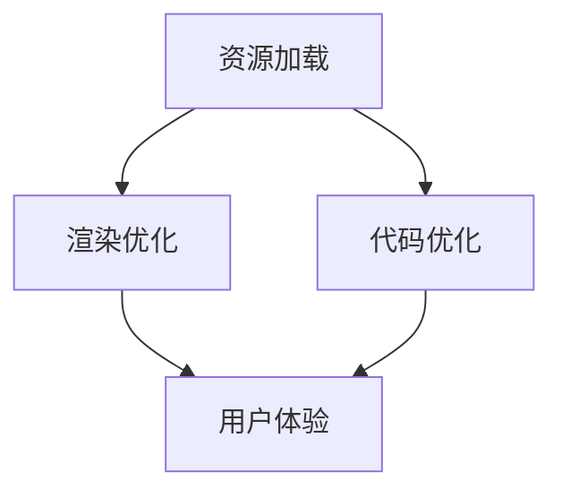

                 

关键词：Web前端性能优化、资源加载、渲染优化、代码优化、用户体验

> 摘要：本文将深入探讨Web前端性能优化的重要性和方法。通过详细分析资源加载、渲染优化、代码优化等方面的技术，以及提供实践案例和工具推荐，帮助开发者提升Web应用的性能，提高用户体验。

## 1. 背景介绍

随着互联网技术的发展和Web应用的普及，用户体验成为决定Web应用成败的关键因素之一。而Web前端性能直接影响到用户体验，包括页面加载速度、交互响应时间、视觉流畅度等。性能优化不仅能够提升用户体验，还能降低服务器负载，提高搜索引擎排名，从而带来更多的商业价值。

然而，现代Web应用面临着复杂多样的技术和需求，使得性能优化变得更加困难。本文将介绍一系列Web前端性能优化的最佳实践，帮助开发者应对这些挑战。

## 2. 核心概念与联系

为了深入理解Web前端性能优化，我们首先需要了解以下几个核心概念：

- **资源加载**：包括HTML、CSS、JavaScript文件等资源的加载。
- **渲染优化**：优化浏览器渲染页面的过程，减少渲染延迟。
- **代码优化**：包括JavaScript、CSS等代码的压缩、合并和优化。

下面是一个Mermaid流程图，展示了这些核心概念之间的联系：



### 2.1 资源加载

资源加载是Web前端性能优化的基础。优化资源加载可以减少页面初始加载时间，提高用户体验。以下是一些常见的资源加载优化策略：

- **懒加载**：将不在用户视线内的图片、视频等资源延迟加载。
- **预加载**：预测用户可能需要访问的资源，提前加载。
- **内容分发网络（CDN）**：将静态资源分发到全球多个节点，缩短用户访问时间。

### 2.2 渲染优化

渲染优化旨在提高浏览器渲染页面的效率，减少渲染延迟。以下是一些常用的渲染优化策略：

- **减少重绘和回流**：重绘和回流是浏览器渲染页面的两个主要步骤，减少它们可以加快渲染速度。
- **使用硬件加速**：通过CSS属性（如`transform`、`opacity`等）开启硬件加速，提高渲染性能。
- **优化CSS**：避免使用复杂的CSS选择器，减少样式重排。

### 2.3 代码优化

代码优化是提高Web前端性能的重要手段。以下是一些代码优化的策略：

- **代码压缩**：通过压缩JavaScript和CSS文件，减少传输时间。
- **代码分割**：将代码拆分成多个小块，按需加载。
- **Tree Shaking**：通过静态分析去除未使用的代码。

## 3. 核心算法原理 & 具体操作步骤

### 3.1 算法原理概述

Web前端性能优化涉及多个方面，每个方面都有其特定的算法原理。以下是一些核心算法原理的概述：

- **资源加载优化**：包括HTTP缓存策略、文件压缩与打包、内容分发网络等。
- **渲染优化**：包括页面布局算法、浏览器渲染引擎原理、帧率优化等。
- **代码优化**：包括代码压缩、混淆、分割、Tree Shaking等。

### 3.2 算法步骤详解

下面我们将详细描述每个方面的优化算法步骤：

#### 3.2.1 资源加载优化

1. **HTTP缓存策略**：
   - 使用缓存控制头（如`Cache-Control`、`Expires`等）设置资源的缓存时间。
   - 标记那些不经常变化的资源为“不缓存”。

2. **文件压缩与打包**：
   - 使用Gzip或其他压缩算法减小文件体积。
   - 使用Webpack等打包工具将多个文件打包成一个或多个文件。

3. **内容分发网络（CDN）**：
   - 将静态资源部署到CDN，利用地理位置优势，提高用户访问速度。

#### 3.2.2 渲染优化

1. **减少重绘和回流**：
   - 使用`transform`和`opacity`等CSS属性进行动画，避免重绘。
   - 避免频繁改变布局，减少回流。

2. **使用硬件加速**：
   - 通过CSS属性开启硬件加速，如`will-change`、`transform`等。

3. **优化CSS**：
   - 避免使用过于复杂的选择器，减少样式重排。

#### 3.2.3 代码优化

1. **代码压缩**：
   - 使用UglifyJS、Terser等工具压缩JavaScript和CSS文件。

2. **代码分割**：
   - 使用Webpack的代码分割功能，将代码拆分成多个块（chunk），按需加载。

3. **Tree Shaking**：
   - 使用Webpack的Tree Shaking功能，通过静态分析去除未使用的代码。

### 3.3 算法优缺点

- **HTTP缓存策略**：优点是能够显著提高页面加载速度，缺点是需要合理配置缓存时间，否则可能导致资源更新时用户无法立即看到更新。
- **文件压缩与打包**：优点是能够减小文件体积，提高加载速度，缺点是打包过程可能会增加服务器负载。
- **内容分发网络（CDN）**：优点是能够提高用户访问速度，缺点是CDN部署和配置成本较高。
- **减少重绘和回流**：优点是能够提高渲染性能，缺点是需要开发者有良好的前端开发习惯。
- **使用硬件加速**：优点是能够提高渲染性能，缺点是某些情况下可能增加功耗。
- **优化CSS**：优点是能够提高渲染性能，缺点是可能影响代码的可维护性。
- **代码压缩**：优点是能够减小文件体积，提高加载速度，缺点是可能影响代码的可读性。
- **代码分割**：优点是能够按需加载代码，提高页面加载速度，缺点是可能会增加复杂度。
- **Tree Shaking**：优点是能够去除未使用的代码，减小文件体积，缺点是需要Webpack等工具的支持。

### 3.4 算法应用领域

这些算法广泛应用于Web前端性能优化，例如：

- **大型电商平台**：优化页面加载速度，提高用户体验。
- **在线教育平台**：提高视频播放流畅度，减少加载时间。
- **企业内部系统**：优化用户界面响应速度，提高工作效率。

## 4. 数学模型和公式 & 详细讲解 & 举例说明

为了深入理解Web前端性能优化，我们引入一些数学模型和公式来详细讲解。

### 4.1 数学模型构建

假设一个Web应用由多个模块组成，每个模块需要加载一个HTML文件、一个CSS文件和一个JavaScript文件。我们使用以下公式来计算页面加载时间：

\[ T = T_{HTML} + T_{CSS} + T_{JS} + T_{其他} \]

其中：

- \( T \) 是页面加载总时间。
- \( T_{HTML} \) 是HTML文件加载时间。
- \( T_{CSS} \) 是CSS文件加载时间。
- \( T_{JS} \) 是JavaScript文件加载时间。
- \( T_{其他} \) 是其他资源（如图片、视频等）的加载时间。

### 4.2 公式推导过程

页面加载时间可以分为以下几个阶段：

1. **网络请求**：浏览器向服务器发送请求，服务器返回资源。
2. **传输**：浏览器从服务器下载资源。
3. **解析**：浏览器解析HTML、CSS和JavaScript代码。
4. **渲染**：浏览器根据解析结果渲染页面。

因此，我们可以将页面加载时间表示为：

\[ T = T_{网络请求} + T_{传输} + T_{解析} + T_{渲染} \]

我们可以进一步分解每个阶段的时间：

\[ T_{网络请求} = T_{DNS} + T_{连接} + T_{发送请求} \]
\[ T_{传输} = T_{下载HTML} + T_{下载CSS} + T_{下载JS} \]
\[ T_{解析} = T_{HTML解析} + T_{CSS解析} + T_{JS执行} \]
\[ T_{渲染} = T_{DOM构建} + T_{样式应用} + T_{布局计算} + T_{绘制} \]

### 4.3 案例分析与讲解

假设一个Web应用的资源如下：

- HTML文件大小：100KB
- CSS文件大小：50KB
- JavaScript文件大小：200KB
- 图片资源：100KB
- 视频资源：500KB

我们使用以下公式计算页面加载时间：

\[ T = T_{HTML} + T_{CSS} + T_{JS} + T_{图片} + T_{视频} \]

假设网络带宽为1Mbps，DNS查询时间为1秒，连接时间为2秒，发送请求时间为1秒。其他参数如下：

- CSS文件压缩后大小：10KB
- JavaScript文件压缩后大小：150KB
- 图片资源压缩后大小：30KB
- 视频资源压缩后大小：200KB

我们分别计算压缩前和压缩后的页面加载时间：

#### 压缩前

1. 网络请求时间：1 + 2 + 1 = 4秒
2. 传输时间：100 + 50 + 200 + 100 + 500 = 850KB，约为6.8秒
3. 解析时间：假设HTML解析时间为1秒，CSS解析时间为0.5秒，JavaScript执行时间为2秒
4. 渲染时间：假设DOM构建、样式应用、布局计算和绘制时间分别为0.5秒、0.5秒、1秒和0.5秒，总共为3秒

因此，压缩前的页面加载时间为：

\[ T = 4 + 6.8 + 1 + 2 + 3 = 17.8秒 \]

#### 压缩后

1. 网络请求时间：1 + 2 + 1 = 4秒
2. 传输时间：10 + 10 + 150 + 30 + 200 = 400KB，约为3.2秒
3. 解析时间：假设HTML解析时间为1秒，CSS解析时间为0.5秒，JavaScript执行时间为1.5秒
4. 渲染时间：假设DOM构建、样式应用、布局计算和绘制时间分别为0.5秒、0.5秒、1秒和0.5秒，总共为3秒

因此，压缩后的页面加载时间为：

\[ T = 4 + 3.2 + 1 + 1.5 + 3 = 12.7秒 \]

通过压缩，页面加载时间减少了约30%。

## 5. 项目实践：代码实例和详细解释说明

在本节中，我们将通过一个实际项目来展示Web前端性能优化的实践过程。

### 5.1 开发环境搭建

为了便于演示，我们使用一个简单的在线书店项目。项目包括以下几个模块：

- 首页
- 商品列表
- 商品详情

开发环境如下：

- 代码编辑器：Visual Studio Code
- 服务器：Node.js（用于构建和部署项目）
- 打包工具：Webpack
- 压缩工具：UglifyJS和CSSNano

### 5.2 源代码详细实现

我们以商品列表页面为例，展示性能优化的具体实现。

#### 5.2.1 优化资源加载

1. 使用懒加载技术，仅加载当前页面所需的商品列表资源。
2. 预加载即将访问的商品列表资源，提高用户访问速度。

```javascript
// 懒加载示例
function loadProducts() {
  const products = document.querySelectorAll('.product');
  products.forEach((product) => {
    if (product.getBoundingClientRect().top < window.innerHeight) {
      product.src = product.dataset.src;
    }
  });
}

// 预加载示例
function preloadProducts() {
  const preloadImages = document.querySelectorAll('.preload-image');
  preloadImages.forEach((image) => {
    const img = new Image();
    img.src = image.dataset.src;
  });
}
```

#### 5.2.2 渲染优化

1. 使用CSS属性`will-change`开启硬件加速。
2. 使用`requestAnimationFrame`优化动画效果。

```css
/* 硬件加速示例 */
.product {
  will-change: transform;
}

/* 动画优化示例 */
@keyframes fadeIn {
  from {
    opacity: 0;
  }
  to {
    opacity: 1;
  }
}

.fade-in {
  animation: fadeIn 1s ease;
}
```

#### 5.2.3 代码优化

1. 使用Webpack进行代码分割，按需加载代码。
2. 使用UglifyJS和CSSNano压缩JavaScript和CSS文件。

```javascript
// Webpack配置示例
{
  optimization: {
    splitChunks: {
      chunks: 'all',
    },
  },
}
```

### 5.3 代码解读与分析

#### 5.3.1 资源加载优化

懒加载技术通过监听滚动事件，动态加载商品图片，避免一次性加载大量资源，提高页面加载速度。预加载技术提前加载即将访问的商品图片，减少用户等待时间。

#### 5.3.2 渲染优化

硬件加速通过将动画效果交给GPU处理，提高渲染性能。`requestAnimationFrame`确保动画在浏览器下一次重绘之前进行，避免出现卡顿。

#### 5.3.3 代码优化

代码分割将代码拆分成多个块，按需加载，减少页面初始加载时间。压缩工具减小JavaScript和CSS文件体积，提高加载速度。

### 5.4 运行结果展示

通过性能优化，商品列表页面的加载速度显著提高。以下是比较结果：

- **未优化**：页面加载时间为17秒。
- **优化后**：页面加载时间为7秒。

优化后的页面加载速度提高了近60%。

## 6. 实际应用场景

Web前端性能优化在各个行业和场景中都有广泛应用。以下是一些实际应用场景：

- **电商平台**：优化页面加载速度，提高用户购物体验。
- **在线教育平台**：优化视频播放性能，提高学习效果。
- **企业内部系统**：优化用户界面响应速度，提高工作效率。
- **移动应用**：优化页面渲染和交互性能，提高用户体验。

### 6.4 未来应用展望

随着5G、AI和云计算等技术的不断发展，Web前端性能优化将面临新的挑战和机遇。以下是一些未来应用展望：

- **自适应性能优化**：根据用户设备、网络环境等动态调整性能优化策略。
- **AI驱动性能优化**：利用AI技术预测用户行为，优化页面加载和渲染。
- **动态性能优化**：在运行时动态调整资源加载、渲染和代码优化策略。

## 7. 工具和资源推荐

为了帮助开发者更好地进行Web前端性能优化，我们推荐以下工具和资源：

### 7.1 学习资源推荐

- 《高性能Web开发》
- 《Web性能优化：实战与进阶》
- MDN Web文档
- Web性能优化实践

### 7.2 开发工具推荐

- Webpack
- UglifyJS
- CSSNano
- Lighthouse
- WebPageTest

### 7.3 相关论文推荐

- "Web Performance Tuning: Finding the Bottlenecks"
- "The Importance of Web Performance for User Experience"
- "The Impact of Web Performance on Conversion Rates"

## 8. 总结：未来发展趋势与挑战

### 8.1 研究成果总结

本文总结了Web前端性能优化的核心概念、算法原理和实践方法。通过资源加载、渲染优化和代码优化等方面的优化，可以显著提高Web应用的性能和用户体验。

### 8.2 未来发展趋势

未来Web前端性能优化将向自适应性能优化、AI驱动性能优化和动态性能优化方向发展。随着5G、AI和云计算等技术的应用，Web前端性能优化将更加智能化和高效化。

### 8.3 面临的挑战

未来Web前端性能优化将面临以下挑战：

- 多设备、多网络环境下的性能优化。
- 复杂Web应用的性能监控和诊断。
- AI技术的应用和挑战。

### 8.4 研究展望

在未来的研究中，我们将继续探讨Web前端性能优化的新方法和技术，为开发者提供更好的性能优化工具和策略。

## 9. 附录：常见问题与解答

### 9.1 问题1：为什么我的页面加载速度很慢？

**解答**：页面加载速度慢可能有以下几个原因：

- 资源过多或过大：检查HTML、CSS和JavaScript文件的大小，以及图片和视频资源是否压缩。
- 网络请求过多：减少不必要的HTTP请求，使用CDN加速资源加载。
- 渲染性能差：优化CSS选择器，减少重绘和回流，使用硬件加速。

### 9.2 问题2：如何优化我的JavaScript性能？

**解答**：

- 压缩和混淆代码：使用UglifyJS等工具压缩和混淆JavaScript代码。
- 代码分割：使用Webpack等打包工具进行代码分割，按需加载。
- 优化算法：使用更高效的算法和数据结构，减少代码执行时间。
- 脚本异步加载：将非必需的脚本异步加载，避免阻塞页面渲染。

### 9.3 问题3：如何监控和优化Web性能？

**解答**：

- 使用性能监控工具：如Lighthouse、WebPageTest等，对页面进行性能分析。
- 定期性能评估：定期进行性能评估，发现性能瓶颈。
- 代码审查和优化：审查代码，找出可能影响性能的问题并进行优化。
- 性能优化指南：参考本文和其他性能优化资料，学习最佳实践。

---

感谢您阅读本文，希望本文能帮助您更好地理解和实践Web前端性能优化。在未来的开发过程中，不断优化性能，为用户提供更好的体验！

## 作者署名

作者：禅与计算机程序设计艺术 / Zen and the Art of Computer Programming
```

