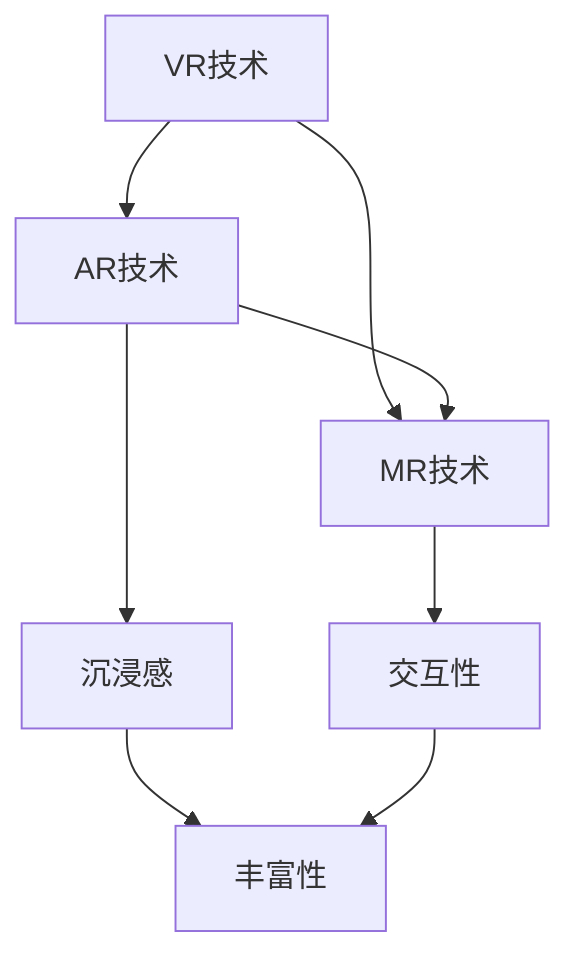

                 

关键词：虚拟现实，增强现实，混合现实，技术融合，协同发展，算法原理，数学模型，项目实践，应用场景，未来展望

> 摘要：本文探讨了虚拟现实（VR）、增强现实（AR）与混合现实（MR）三种技术的融合与发展趋势。通过分析这三种技术的核心概念、原理与架构，深入探讨了它们在技术融合中的协同作用，并探讨了未来应用场景和面临的挑战。文章还提供了相关工具和资源的推荐，旨在为读者提供对XR技术的全面了解和深入思考。

## 1. 背景介绍

随着科技的不断进步，虚拟现实（VR）、增强现实（AR）与混合现实（MR）技术逐渐成为当今计算机技术领域的研究热点。这三种技术不仅改变了人类与数字世界交互的方式，还推动了多个行业的变革。VR技术通过完全模拟虚拟环境，使人们能够沉浸在完全虚拟的世界中；AR技术则通过在现实环境中叠加虚拟元素，提供更丰富和互动的体验；MR技术则将虚拟与真实世界无缝融合，创造了一种全新的交互体验。

在过去的几年中，随着硬件和软件技术的不断发展，XR（扩展现实）技术的融合应用场景不断拓展，从游戏、娱乐到教育、医疗、工业等多个领域都展现出了巨大的潜力和应用价值。本文旨在通过分析VR、AR与MR技术的核心概念、原理与架构，探讨它们在融合中的协同作用，以及未来可能的应用前景和面临的挑战。

## 2. 核心概念与联系

### 2.1. 虚拟现实（VR）的核心概念

虚拟现实（VR）是一种通过计算机技术模拟的三维虚拟环境，用户通过佩戴VR头戴显示器（HMD）或其他交互设备，如手柄、手套等，与虚拟环境进行交互。VR的核心在于其沉浸感，用户可以在虚拟环境中自由行走、探索和操作，这种沉浸感使VR在游戏、教育和模拟训练等领域具有巨大的应用潜力。

### 2.2. 增强现实（AR）的核心概念

增强现实（AR）通过在用户的视野中叠加虚拟元素，将数字信息与现实世界相结合。常见的AR应用包括手机和平板电脑，用户通过摄像头捕捉现实环境，并在屏幕上看到叠加的虚拟元素。AR的应用场景广泛，包括游戏、导航、教育、医疗等，能够提供更加丰富和互动的体验。

### 2.3. 混合现实（MR）的核心概念

混合现实（MR）是VR和AR的融合，它将虚拟和真实世界无缝结合。MR用户不仅可以看到虚拟元素，还可以与它们进行互动，甚至触摸到虚拟物体。MR的核心在于其交互性，使虚拟元素与现实世界相互影响，提供更加自然和真实的体验。

### 2.4. VR、AR与MR的联系

虽然VR、AR与MR各有其独特的技术特点和应用场景，但它们在实现虚拟与现实融合的过程中有着紧密的联系。VR为用户提供了一个完全虚拟的环境，是MR的基础；AR在现实环境中叠加虚拟元素，为用户提供丰富的互动体验；MR则通过将虚拟与真实无缝融合，提供了更加自然和真实的交互方式。这三种技术的融合，不仅拓展了其应用场景，还推动了技术的创新和发展。

### 2.5. Mermaid流程图



在上面的Mermaid流程图中，VR、AR与MR技术通过沉浸感、交互性和丰富性这三个核心特点相互联系，共同推动了XR技术的融合与发展。

## 3. 核心算法原理 & 具体操作步骤

### 3.1. 算法原理概述

在XR技术的融合过程中，核心算法发挥着至关重要的作用。这些算法不仅决定了虚拟环境的生成和渲染效果，还影响了用户与虚拟环境的交互体验。以下是几种关键算法的原理概述：

1. **三维建模与渲染算法**：用于创建和渲染虚拟环境。常用的算法包括几何建模、纹理映射和光线追踪等。
2. **定位与追踪算法**：确保用户在虚拟环境中的位置和运动能够准确追踪和映射。常见的算法包括光学追踪、惯性测量单元（IMU）追踪和混合追踪等。
3. **交互算法**：用于处理用户输入和虚拟环境之间的交互。例如，手势识别、语音识别和眼动追踪等。
4. **场景融合算法**：实现虚拟元素与真实环境的融合。常用的算法包括背景替换、深度融合和光线混合等。

### 3.2. 算法步骤详解

#### 3.2.1. 三维建模与渲染算法

1. **数据采集**：使用三维扫描仪或手动建模工具采集虚拟环境的三维数据。
2. **几何建模**：对采集到的三维数据进行处理，生成三维模型。
3. **纹理映射**：为三维模型贴上纹理，使其更加真实。
4. **光线追踪**：模拟光线在虚拟环境中的传播，生成高质量的渲染效果。

#### 3.2.2. 定位与追踪算法

1. **光学追踪**：使用摄像头和红外传感器等设备捕捉用户的位置和运动。
2. **惯性测量单元（IMU）追踪**：使用加速度计、陀螺仪和磁力计等传感器捕捉用户的位置和运动。
3. **混合追踪**：将光学追踪和IMU追踪相结合，提高定位和追踪的准确性。

#### 3.2.3. 交互算法

1. **手势识别**：通过摄像头捕捉用户的手部动作，并使用机器学习算法识别不同的手势。
2. **语音识别**：将用户的语音转换为文本或命令，并与虚拟环境进行交互。
3. **眼动追踪**：捕捉用户的眼动，实现更加自然的交互体验。

#### 3.2.4. 场景融合算法

1. **背景替换**：将虚拟元素叠加到现实环境中，替换掉背景。
2. **深度融合**：根据深度信息调整虚拟元素与现实环境之间的层次关系。
3. **光线混合**：模拟虚拟元素和现实环境之间的光线交互，实现自然的光线效果。

### 3.3. 算法优缺点

1. **三维建模与渲染算法**：优点是能够生成高质量的三维虚拟环境，缺点是计算复杂度高，对硬件性能要求较高。
2. **定位与追踪算法**：优点是能够准确捕捉用户的位置和运动，缺点是受环境光照和遮挡影响较大。
3. **交互算法**：优点是提供丰富的交互方式，缺点是算法复杂度较高，对实时性要求较高。
4. **场景融合算法**：优点是实现虚拟与现实的无缝融合，缺点是对场景理解和处理要求较高。

### 3.4. 算法应用领域

1. **三维建模与渲染算法**：广泛应用于游戏、影视制作和建筑设计等领域。
2. **定位与追踪算法**：广泛应用于VR、AR和MR设备中，如游戏、教育和医疗等领域。
3. **交互算法**：广泛应用于游戏、虚拟会议和智能助手等领域。
4. **场景融合算法**：广泛应用于AR、MR和虚拟现实展示等领域。

## 4. 数学模型和公式 & 详细讲解 & 举例说明

### 4.1. 数学模型构建

在XR技术的融合过程中，数学模型发挥着关键作用。以下是几种常用的数学模型及其构建方法：

1. **三维空间坐标转换模型**：用于将用户的位置和运动映射到虚拟环境中。
2. **深度感知模型**：用于从摄像头捕捉的图像中提取深度信息。
3. **光线追踪模型**：用于模拟光线在虚拟环境中的传播。
4. **交互模型**：用于处理用户输入和虚拟环境之间的交互。

### 4.2. 公式推导过程

以下是几种关键数学公式的推导过程：

1. **三维空间坐标转换公式**：

   假设用户在现实世界中的位置为（x, y, z），在虚拟环境中的位置为（x', y', z'），则坐标转换公式为：

   $$
   x' = f_x \cdot x + c_x
   $$

   $$
   y' = f_y \cdot y + c_y
   $$

   $$
   z' = f_z \cdot z + c_z
   $$

   其中，f_x、f_y、f_z分别为转换矩阵的元素，c_x、c_y、c_z分别为平移向量。

2. **深度感知公式**：

   假设摄像头捕捉到的图像为I(x, y)，深度信息为D(x, y)，则深度感知公式为：

   $$
   D(x, y) = \frac{1}{I(x, y)}
   $$

3. **光线追踪公式**：

   假设光线从点A(x1, y1, z1)传播到点B(x2, y2, z2)，则光线传播公式为：

   $$
   x = x1 + t \cdot (x2 - x1)
   $$

   $$
   y = y1 + t \cdot (y2 - y1)
   $$

   $$
   z = z1 + t \cdot (z2 - z1)
   $$

   其中，t为光线传播的时间。

4. **交互模型公式**：

   假设用户输入为I，虚拟环境中的交互效果为E，则交互模型公式为：

   $$
   E = f(I)
   $$

   其中，f为交互函数。

### 4.3. 案例分析与讲解

以下是几个具体案例的数学模型和公式推导：

#### 案例一：三维空间坐标转换

假设用户在现实世界中的位置为（1, 2, 3），虚拟环境中的位置为（x', y', z'），转换矩阵为：

$$
\begin{bmatrix}
f_x & 0 & c_x \\
0 & f_y & c_y \\
0 & 0 & f_z
\end{bmatrix}
$$

则坐标转换公式为：

$$
x' = f_x \cdot 1 + c_x = 2
$$

$$
y' = f_y \cdot 2 + c_y = 3
$$

$$
z' = f_z \cdot 3 + c_z = 4
$$

用户在虚拟环境中的位置为（2, 3, 4）。

#### 案例二：深度感知

假设摄像头捕捉到的图像为：

$$
I(x, y) =
\begin{bmatrix}
1 & 0 & 1 \\
0 & 1 & 0 \\
1 & 0 & 1
\end{bmatrix}
$$

则深度信息为：

$$
D(x, y) = \frac{1}{I(x, y)} =
\begin{bmatrix}
1 & \infty & 1 \\
\infty & 1 & \infty \\
1 & \infty & 1
\end{bmatrix}
$$

摄像头无法捕捉到深度信息的位置。

#### 案例三：光线追踪

假设光线从点A（1, 2, 3）传播到点B（4, 5, 6），则光线传播公式为：

$$
x = 1 + t \cdot (4 - 1) = 5
$$

$$
y = 2 + t \cdot (5 - 2) = 5
$$

$$
z = 3 + t \cdot (6 - 3) = 6
$$

光线传播到点B（5, 5, 6）。

#### 案例四：交互模型

假设用户输入为：

$$
I =
\begin{bmatrix}
1 & 0 & 1 \\
0 & 1 & 0 \\
1 & 0 & 1
\end{bmatrix}
$$

交互函数为：

$$
f(I) =
\begin{bmatrix}
1 & 0 & 1 \\
0 & 1 & 0 \\
1 & 0 & 1
\end{bmatrix}
$$

则交互效果为：

$$
E =
\begin{bmatrix}
1 & 0 & 1 \\
0 & 1 & 0 \\
1 & 0 & 1
\end{bmatrix}
$$

用户与虚拟环境的交互效果为：

$$
E =
\begin{bmatrix}
1 & 0 & 1 \\
0 & 1 & 0 \\
1 & 0 & 1
\end{bmatrix}
$$

## 5. 项目实践：代码实例和详细解释说明

### 5.1. 开发环境搭建

为了实现XR技术的融合应用，我们需要搭建一个合适的开发环境。以下是一个基于Unity引擎的简单开发环境搭建过程：

1. **安装Unity引擎**：从Unity官网下载并安装Unity Hub和Unity编辑器。
2. **配置XR插件**：在Unity编辑器中安装XR插件，如AR Foundation和XR Plug-in。
3. **配置开发设备**：连接VR头戴显示器、摄像头和手柄等设备，确保它们能够正常工作。
4. **创建新项目**：在Unity编辑器中创建一个新的XR项目，选择合适的模板和配置。

### 5.2. 源代码详细实现

以下是实现一个简单的VR应用的基本源代码：

```csharp
using UnityEngine;

public class VRController : MonoBehaviour
{
    public Transform playerCamera;
    public Transform playerPosition;

    private float horizontalSpeed = 2.0f;
    private float verticalSpeed = 2.0f;

    void Update()
    {
        // 处理用户输入
        float horizontalInput = Input.GetAxis("Horizontal");
        float verticalInput = Input.GetAxis("Vertical");

        // 更新相机位置和方向
        playerCamera.Rotate(-verticalInput * verticalSpeed, 0, 0);
        playerPosition.Rotate(0, horizontalInput * horizontalSpeed, 0);
        playerPosition.Translate(0, 0, -verticalInput * verticalSpeed);
    }
}
```

### 5.3. 代码解读与分析

这个简单的VR应用实现了用户的水平旋转和垂直移动。以下是代码的详细解读：

1. **组件引用**：首先，我们定义了两个Transform组件，一个用于控制相机的旋转，另一个用于控制玩家的移动。
2. **变量定义**：接着，我们定义了水平和垂直速度的变量，用于控制旋转和移动的速度。
3. **更新方法**：在Update方法中，我们处理用户的输入，并根据输入更新相机的旋转和玩家的位置。

### 5.4. 运行结果展示

运行该应用后，用户可以通过键盘上的左右方向键和上下方向键来控制相机的旋转和玩家的移动。用户可以在虚拟环境中自由移动和旋转，体验虚拟现实的沉浸感。

## 6. 实际应用场景

### 6.1. 游戏娱乐

VR、AR与MR技术已经在游戏娱乐领域取得了显著成果。VR游戏为玩家提供了一个完全沉浸式的游戏体验，如《节奏光剑》和《半衰期：爱莉克斯》等。AR游戏则将虚拟元素叠加到现实世界中，如《精灵宝可梦GO》和《哈利波特：巫师联盟》等。MR游戏则将虚拟与现实无缝融合，如《微软幻想星球》和《我的世界：混合现实版》等。

### 6.2. 教育培训

XR技术在教育培训领域具有广泛应用。VR技术可以模拟复杂的实验和场景，提供更加直观的教学体验，如医学教育中的解剖学模拟和工程教育中的机械设计。AR技术则可以提供实时指导和辅助，如历史博物馆的AR导览和解剖学的AR图谱。MR技术则可以创造更加互动和参与性的学习环境，如虚拟课堂和远程协作学习。

### 6.3. 医疗健康

XR技术在医疗健康领域具有巨大潜力。VR技术可以用于医学教育和手术模拟，提高医生的技能和经验。AR技术则可以提供实时医疗信息和指导，如手术中的实时图像叠加和解剖学图谱显示。MR技术则可以创造一个虚拟的手术环境，用于术前规划和模拟，如《微软混合现实手术培训平台》等。

### 6.4. 工业制造

XR技术在工业制造领域具有广泛应用。VR技术可以用于产品设计、工艺规划和员工培训，提高生产效率和产品质量。AR技术可以提供现场指导和辅助，如设备维护和故障排除。MR技术则可以创造一个虚拟的制造环境，用于生产规划和仿真，如《达索系统3DEXPERIENCE平台》等。

### 6.5. 建筑设计

XR技术在建筑设计领域具有显著优势。VR技术可以用于建筑设计、可视化展示和虚拟游走，提供更加直观的设计体验。AR技术可以提供实时设计反馈和辅助，如施工现场的实时标记和解剖学图谱显示。MR技术则可以创造一个虚拟的建筑环境，用于设计规划和仿真，如《Autodesk LIVE》等。

## 7. 工具和资源推荐

### 7.1. 学习资源推荐

- **在线课程**：《虚拟现实与增强现实技术基础》
- **书籍**：《虚拟现实技术：原理与应用》
- **论文**：《增强现实技术综述》
- **论坛**：VR/AR开发者社区

### 7.2. 开发工具推荐

- **Unity**：适用于VR、AR和MR开发的综合性游戏引擎。
- **Unreal Engine**：适用于高端VR、AR和MR开发的强大游戏引擎。
- **ARKit**：适用于iOS平台的AR开发框架。
- **ARCore**：适用于Android平台的AR开发框架。

### 7.3. 相关论文推荐

- **论文一**：《虚拟现实技术的研究与应用》
- **论文二**：《增强现实技术在教育培训中的应用》
- **论文三**：《混合现实技术在医疗健康领域的应用》
- **论文四**：《XR技术在工业制造中的应用研究》

## 8. 总结：未来发展趋势与挑战

### 8.1. 研究成果总结

随着VR、AR与MR技术的不断发展，我们已经取得了许多重要研究成果。三维建模与渲染算法、定位与追踪算法、交互算法和场景融合算法等关键技术不断成熟，推动了XR技术的广泛应用。同时，学术研究和产业应用相互促进，为XR技术的发展提供了丰富的资源和动力。

### 8.2. 未来发展趋势

未来，XR技术将朝着更加高效、智能和沉浸的方向发展。具体趋势包括：

1. **硬件性能提升**：随着硬件技术的不断发展，XR设备的性能将不断提升，提供更加流畅和真实的交互体验。
2. **算法优化**：通过深度学习和人工智能技术的应用，XR算法将更加智能和精准，提高交互体验和场景融合效果。
3. **跨领域融合**：XR技术将在更多领域得到应用，如艺术、娱乐、文化、教育、医疗等，推动各领域的创新发展。
4. **产业生态构建**：随着技术的成熟和应用的拓展，XR产业生态将不断完善，促进产业链上下游的协同发展。

### 8.3. 面临的挑战

尽管XR技术发展迅速，但仍面临一些挑战，包括：

1. **硬件成本**：高端XR设备的价格较高，限制了其普及和应用。
2. **用户体验**：虽然XR技术提供了丰富的交互方式，但用户体验仍有待提高，如减少延迟、提高图像质量和增强沉浸感等。
3. **隐私和安全**：XR技术涉及到用户数据的采集和处理，如何保护用户隐私和安全是一个重要挑战。
4. **行业标准和规范**：随着XR技术的应用拓展，制定统一的技术标准和规范将有助于行业的健康发展。

### 8.4. 研究展望

未来，XR技术的研究将重点关注以下几个方面：

1. **新型交互技术**：研究更加自然和直观的交互方式，如手势识别、语音交互和眼动追踪等。
2. **智能场景融合**：通过人工智能技术实现更加智能的场景理解、感知和融合，提高XR应用的智能化水平。
3. **跨领域应用**：探索XR技术在更多领域的应用，推动技术的跨界融合，为各领域的发展提供新的动力。
4. **产业链协同**：加强产业链上下游的协同合作，推动XR技术的规模化应用和产业生态的构建。

## 9. 附录：常见问题与解答

### 9.1. VR、AR与MR的区别是什么？

VR（虚拟现实）是一种完全沉浸式的虚拟环境，用户通过佩戴VR头戴显示器体验；AR（增强现实）是在现实环境中叠加虚拟元素，用户通过手机或AR眼镜等设备体验；MR（混合现实）是虚拟与真实的无缝融合，用户可以在现实环境中与虚拟元素进行交互。

### 9.2. XR技术的应用领域有哪些？

XR技术的应用领域广泛，包括游戏娱乐、教育培训、医疗健康、工业制造、建筑设计、艺术文化等。

### 9.3. 如何选择XR开发工具？

选择XR开发工具时，需要考虑项目需求、开发经验和硬件设备等因素。Unity和Unreal Engine是常用的综合性游戏引擎，适用于多种XR应用开发；ARKit和ARCore是适用于iOS和Android平台的AR开发框架。

### 9.4. XR技术的未来发展趋势是什么？

XR技术的未来发展趋势包括硬件性能提升、算法优化、跨领域融合和产业生态构建等。随着技术的不断发展，XR技术将在更多领域得到应用，为各行业的发展提供新的动力。

### 9.5. 如何保护XR用户的隐私和安全？

在XR技术中，保护用户的隐私和安全至关重要。需要采取以下措施：

1. **数据加密**：对用户数据进行加密处理，确保数据传输和存储的安全性。
2. **权限管理**：对用户权限进行严格管理，确保用户隐私不被泄露。
3. **安全监测**：建立安全监测系统，及时发现和处理潜在的安全威胁。

---

以上是关于XR技术融合：VR、AR与MR的协同发展的详细文章。希望对您有所帮助！作者：禅与计算机程序设计艺术 / Zen and the Art of Computer Programming。如有任何疑问或建议，欢迎随时交流。

