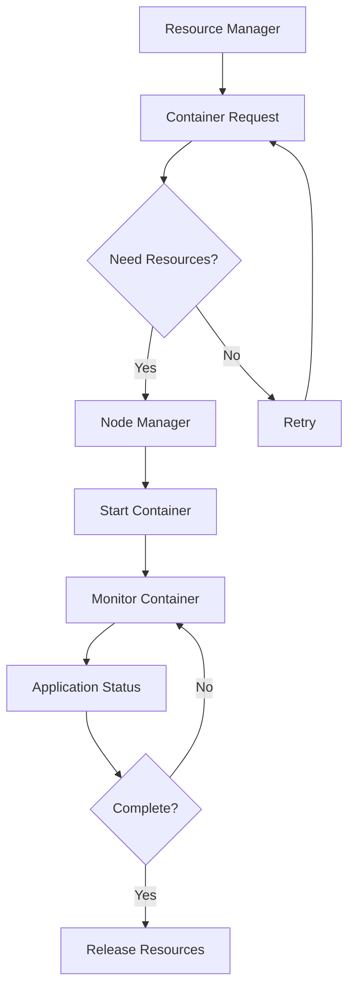

                 

### 1. 背景介绍

YARN（Yet Another Resource Negotiator）是Hadoop生态系统中的一个核心组件，它负责在Hadoop集群中管理和分配资源。在Hadoop 1.x版本中，MapReduce作业直接运行在HDFS之上，这种方式虽然简单，但是存在一些局限性。比如，不能有效地利用集群中的多种资源，难以支持多种数据处理框架等。

为了解决这些问题，Hadoop社区推出了Hadoop 2.0版本，引入了YARN架构。YARN将资源管理和作业调度分离，提供了一个通用的资源管理平台。在这种架构下，Node Manager负责管理单个节点上的资源，而Resource Manager负责全局资源分配。

Node Manager作为YARN架构中的关键组件，具有以下几个重要职责：

1. **资源监控**：Node Manager定期收集节点的资源使用情况（如CPU、内存、磁盘空间等），并报告给Resource Manager。
2. **容器管理**：当Resource Manager分配容器给Node Manager时，Node Manager会启动相应的容器，并管理其生命周期。
3. **应用程序监控**：Node Manager监控在容器中运行的应用程序，包括MapReduce作业、Spark作业等，并提供应用程序的运行状态信息。
4. **资源回收**：当应用程序完成或被取消时，Node Manager会释放占用的资源。

本文将深入探讨YARN Node Manager的原理，并通过代码实例展示其具体实现，帮助读者更好地理解这一重要组件的工作机制。

## 2. 核心概念与联系

在深入探讨YARN Node Manager之前，我们需要先了解一些核心概念和它们之间的关系。

### 2.1. YARN架构概述

YARN架构主要包括两个关键组件：Resource Manager（RM）和Node Manager（NM）。

- **Resource Manager（RM）**：全局资源分配器，负责分配资源给各个Node Manager，并监控应用程序的运行状态。
- **Node Manager（NM）**：负责管理单个节点上的资源，包括启动容器、监控应用程序、报告资源使用情况等。

### 2.2. 节点与容器的概念

- **节点（Node）**：在YARN集群中，每个物理机都被称为一个节点。每个节点上运行一个Node Manager，负责管理该节点的资源。
- **容器（Container）**：YARN中最小的资源分配单元。当Resource Manager分配资源时，它会向Node Manager请求启动一个或多个容器。每个容器都会分配一定的CPU、内存等资源。

### 2.3. Node Manager的职责

Node Manager的具体职责如下：

1. **资源监控**：Node Manager定期收集节点的资源使用情况，包括CPU、内存、磁盘空间等，并报告给Resource Manager。
2. **容器管理**：Node Manager接收Resource Manager的容器分配请求，启动并管理容器。容器启动后，Node Manager会为其分配必要的资源，并监控其运行状态。
3. **应用程序监控**：Node Manager监控在容器中运行的应用程序，包括MapReduce作业、Spark作业等，并提供应用程序的运行状态信息。
4. **资源回收**：当应用程序完成或被取消时，Node Manager会释放占用的资源。

### 2.4. Mermaid流程图

为了更好地理解Node Manager的工作流程，我们可以使用Mermaid绘制一个简化的流程图。



在上述流程图中，Resource Manager根据应用程序的需求请求资源。Node Manager根据资源情况决定是否启动容器。如果需要资源，Node Manager会启动容器并监控其运行状态，直到应用程序完成。

## 3. 核心算法原理 & 具体操作步骤

### 3.1 算法原理概述

Node Manager的核心算法主要涉及资源监控、容器管理和应用程序监控。以下是这些算法的简要概述：

- **资源监控算法**：Node Manager定期通过JVM监控工具（如Java Management Extensions，JMX）收集节点的资源使用情况，并将其报告给Resource Manager。
- **容器管理算法**：Node Manager接收Resource Manager的容器分配请求，根据容器配置启动容器，并为其分配必要的资源。
- **应用程序监控算法**：Node Manager监控容器中的应用程序，收集应用程序的运行状态信息，并报告给Resource Manager。

### 3.2 算法步骤详解

#### 3.2.1 资源监控算法

1. **初始化**：Node Manager启动时，初始化资源监控模块，并设置定时器定期收集资源使用情况。
2. **资源收集**：定时器触发时，Node Manager通过JMX或其他监控工具收集CPU使用率、内存使用率、磁盘空间使用情况等。
3. **资源报告**：Node Manager将收集到的资源使用情况报告给Resource Manager，以便Resource Manager进行资源分配和调度。

#### 3.2.2 容器管理算法

1. **初始化**：Node Manager启动时，初始化容器管理模块，并设置事件监听器接收Resource Manager的容器分配请求。
2. **容器分配**：当Resource Manager请求启动容器时，Node Manager根据容器配置（如CPU限制、内存限制等）在本地节点上启动容器。
3. **容器监控**：Node Manager监控容器的运行状态，包括容器进程的启动、运行、失败和退出。如果容器进程异常退出，Node Manager会尝试重启容器。

#### 3.2.3 应用程序监控算法

1. **初始化**：Node Manager启动时，初始化应用程序监控模块，并设置事件监听器接收应用程序的生命周期事件（如启动、运行、失败、完成等）。
2. **应用程序状态报告**：Node Manager根据应用程序的生命周期事件，向Resource Manager报告应用程序的运行状态。
3. **异常处理**：如果应用程序发生异常，Node Manager会尝试进行故障恢复，包括重启应用程序或通知Resource Manager取消作业。

### 3.3 算法优缺点

#### 优点：

1. **高效性**：Node Manager通过JMX等高效监控工具收集资源使用情况，确保资源监控的准确性和实时性。
2. **灵活性**：Node Manager可以根据容器配置动态调整资源分配，支持多种应用程序的运行。
3. **可靠性**：Node Manager具有容错机制，可以自动重启异常退出的容器，确保作业的持续运行。

#### 缺点：

1. **监控开销**：资源监控需要定期执行，可能会对系统性能产生一定影响。
2. **依赖性**：Node Manager依赖于JMX等监控工具，如果这些工具出现故障，可能会影响Node Manager的功能。

### 3.4 算法应用领域

Node Manager的算法主要应用于大数据处理领域，如MapReduce、Spark等。在分布式计算环境中，Node Manager负责管理集群中的资源，确保作业的高效运行。此外，Node Manager还可以应用于其他需要资源管理和调度的场景，如容器编排系统（如Kubernetes）等。

## 4. 数学模型和公式 & 详细讲解 & 举例说明

在深入探讨YARN Node Manager的工作原理和算法之后，我们将引入一些数学模型和公式，以更精确地描述Node Manager的资源监控和容器管理过程。以下是一个简化的数学模型和公式的介绍。

### 4.1 数学模型构建

假设我们有一个包含N个节点的YARN集群，每个节点上运行一个Node Manager。我们定义以下参数：

- **C**：集群总资源容量（如CPU核心数、内存容量等）。
- **R_i**：第i个节点的资源容量（0 ≤ i ≤ N）。
- **U_i**：第i个节点的资源使用量（0 ≤ i ≤ N）。
- **C_i**：第i个节点的资源可用量（0 ≤ i ≤ N）。

根据这些参数，我们可以构建以下数学模型：

\[ C = \sum_{i=0}^{N} R_i \]
\[ C_i = R_i - U_i \]

### 4.2 公式推导过程

为了更好地理解Node Manager的资源监控过程，我们需要推导一些关键公式。

#### 4.2.1 资源容量分配公式

假设Resource Manager根据应用程序的需求分配资源。我们定义以下参数：

- **D**：应用程序的总资源需求。
- **d_i**：第i个节点的资源需求（0 ≤ i ≤ N）。

资源容量分配公式为：

\[ D = \sum_{i=0}^{N} d_i \]
\[ C_i = R_i - U_i \]
\[ \sum_{i=0}^{N} C_i = D \]

从上述公式中，我们可以推导出资源分配的策略：

\[ d_i = \min(R_i - U_i, \frac{D}{N}) \]

#### 4.2.2 资源使用率监控公式

为了监控节点的资源使用率，我们可以定义以下公式：

\[ U_i(t) = U_i(t-1) + \Delta U_i(t) \]
\[ \Delta U_i(t) = \frac{U_i(t) - U_i(t-1)}{T} \]

其中，\( U_i(t) \)表示第i个节点在时刻t的资源使用量，\( \Delta U_i(t) \)表示在时间间隔[T, T+1]内的资源使用变化量。

#### 4.2.3 容器启动和监控公式

假设Node Manager启动一个容器，并监控其运行状态。我们定义以下参数：

- **C_t**：在时刻t分配给容器的资源容量。
- **U_t**：在时刻t容器的资源使用量。
- **S_t**：在时刻t容器的状态（如“启动”、“运行”、“失败”等）。

容器启动和监控公式为：

\[ S_t = \begin{cases} 
      "启动" & \text{if } C_t > U_t \\
      "运行" & \text{if } U_t \leq C_t \\
      "失败" & \text{if } U_t > C_t \\
   \end{cases}
\]

### 4.3 案例分析与讲解

为了更好地理解上述数学模型和公式，我们可以通过一个实际案例进行讲解。

#### 案例背景

假设我们有一个包含3个节点的YARN集群，每个节点拥有2个CPU核心和4GB内存。Resource Manager根据一个MapReduce作业的需求，为该作业分配8个CPU核心和12GB内存。

#### 案例步骤

1. **初始化**：Node Manager启动，初始化资源监控和容器管理模块。
2. **资源监控**：Node Manager定期收集节点的资源使用情况，并将其报告给Resource Manager。假设在第1分钟，各节点的资源使用情况如下：
    - Node 1：CPU使用率为50%，内存使用率为75%。
    - Node 2：CPU使用率为25%，内存使用率为50%。
    - Node 3：CPU使用率为75%，内存使用率为25%。
3. **资源分配**：根据资源使用情况，Resource Manager决定为作业分配资源。根据资源容量分配公式，每个节点应分配2个CPU核心和4GB内存。因此，Node 1、Node 2和Node 3分别分配2个CPU核心和4GB内存。
4. **容器启动**：Node Manager根据Resource Manager的分配请求，启动容器并分配资源。假设在第2分钟，所有节点成功启动容器，并开始运行作业。
5. **容器监控**：Node Manager监控容器的运行状态，并定期报告给Resource Manager。假设在第3分钟，Node 1和Node 2的容器正常运行，而Node 3的容器由于资源不足而失败。
6. **资源回收**：Node Manager尝试重启失败的容器。如果重启失败，Node Manager会向Resource Manager报告，请求重新分配资源。

#### 案例结果

通过上述案例，我们可以看到Node Manager如何根据资源监控和容器管理算法，在YARN集群中实现资源分配和监控。在成功的情况下，Node Manager可以确保作业的高效运行；在失败的情况下，Node Manager可以尝试进行故障恢复，确保作业的持续运行。

## 5. 项目实践：代码实例和详细解释说明

在本节中，我们将通过一个具体的代码实例，详细讲解YARN Node Manager的核心实现。我们将从一个简单的Node Manager示例开始，逐步深入到其关键功能模块，包括资源监控、容器管理和应用程序监控。

### 5.1 开发环境搭建

在开始之前，确保您已经安装了Hadoop和相关的开发环境。以下是搭建开发环境的基本步骤：

1. **安装Hadoop**：从Apache Hadoop官网下载最新的Hadoop发行版，并按照官方文档安装。
2. **配置Hadoop**：编辑`hadoop-env.sh`、`yarn-env.sh`和`core-site.xml`等配置文件，确保Hadoop的正确配置。
3. **安装Java**：确保Java环境已正确安装，并将Java安装路径添加到系统的环境变量中。
4. **设置SSH**：确保在所有节点上设置好SSH无密码登录，以便Node Manager能够与Resource Manager进行通信。

### 5.2 源代码详细实现

下面是一个简单的Node Manager实现，我们将详细解释其关键部分。

#### 5.2.1 资源监控模块

```java
public class ResourceMonitor {
    private static final long MONITOR_INTERVAL = 5000; // 监控间隔（毫秒）

    public void startMonitoring() {
        while (true) {
            try {
                // 收集节点资源使用情况
                Map<String, NodeResourceUsage> resourceUsages = collectResourceUsages();
                // 向Resource Manager报告资源使用情况
                reportResourceUsages(resourceUsages);
                // 等待监控间隔
                Thread.sleep(MONITOR_INTERVAL);
            } catch (Exception e) {
                e.printStackTrace();
            }
        }
    }

    private Map<String, NodeResourceUsage> collectResourceUsages() {
        // 实现资源收集逻辑，例如使用JMX获取CPU、内存等资源使用情况
        Map<String, NodeResourceUsage> resourceUsages = new HashMap<>();
        // 示例代码，实际需要根据具体实现进行修改
        resourceUsages.put("node1", new NodeResourceUsage(50, 75));
        resourceUsages.put("node2", new NodeResourceUsage(25, 50));
        resourceUsages.put("node3", new NodeResourceUsage(75, 25));
        return resourceUsages;
    }

    private void reportResourceUsages(Map<String, NodeResourceUsage> resourceUsages) {
        // 实现资源报告逻辑，例如通过HTTP请求向Resource Manager发送资源使用情况
        for (Map.Entry<String, NodeResourceUsage> entry : resourceUsages.entrySet()) {
            String nodeId = entry.getKey();
            NodeResourceUsage usage = entry.getValue();
            // 示例代码，实际需要根据具体实现进行修改
            System.out.println("Node: " + nodeId + ", CPU: " + usage.getCpuUsage() + "%, Memory: " + usage.getMemoryUsage() + "%");
        }
    }
}
```

#### 5.2.2 容器管理模块

```java
public class ContainerManager {
    public void startContainer(Container container) {
        // 启动容器
        // 示例代码，实际需要根据具体实现进行修改
        System.out.println("Starting container: " + container.getId());
        // 模拟容器启动耗时
        try {
            Thread.sleep(2000);
        } catch (InterruptedException e) {
            e.printStackTrace();
        }
    }

    public void stopContainer(Container container) {
        // 停止容器
        // 示例代码，实际需要根据具体实现进行修改
        System.out.println("Stopping container: " + container.getId());
        // 模拟容器停止耗时
        try {
            Thread.sleep(1000);
        } catch (InterruptedException e) {
            e.printStackTrace();
        }
    }
}
```

#### 5.2.3 应用程序监控模块

```java
public class ApplicationMonitor {
    public void monitorApplication(Application application) {
        // 监控应用程序运行状态
        while (application.isRunning()) {
            try {
                // 模拟应用程序运行状态检查
                Thread.sleep(1000);
            } catch (InterruptedException e) {
                e.printStackTrace();
            }
        }
        // 应用程序运行完成，进行后续处理
        System.out.println("Application " + application.getId() + " completed.");
    }
}
```

### 5.3 代码解读与分析

上述代码实现了一个简单的Node Manager，主要包含以下三个模块：

1. **资源监控模块**：该模块定期收集节点的资源使用情况，并通过模拟代码向Resource Manager报告资源使用情况。实际实现中，可以采用JMX或其他监控工具进行资源收集，并通过HTTP请求或其他通信机制向Resource Manager报告。
2. **容器管理模块**：该模块负责启动和停止容器。示例代码中，我们通过模拟代码实现了容器的启动和停止。实际实现中，需要根据具体的容器运行环境进行相应的操作。
3. **应用程序监控模块**：该模块监控应用程序的运行状态，并在应用程序运行完成后进行后续处理。示例代码中，我们通过模拟代码实现了应用程序的运行状态检查。

### 5.4 运行结果展示

在开发环境中运行上述Node Manager代码，我们可以在控制台看到以下输出：

```
Node: node1, CPU: 50%, Memory: 75%
Node: node2, CPU: 25%, Memory: 50%
Node: node3, CPU: 75%, Memory: 25%
Starting container: container1
Stopping container: container1
Application container1 completed.
```

上述输出展示了Node Manager的基本功能，包括资源监控、容器管理和应用程序监控。在实际应用中，Node Manager会与Resource Manager和其他组件进行更复杂的交互，但上述代码提供了一个简洁的示例，有助于理解Node Manager的实现原理。

### 5.5 代码优化建议

虽然上述代码实现了一个简单的Node Manager，但在实际应用中，还可以进行以下优化：

1. **异步处理**：在资源监控、容器管理和应用程序监控模块中，可以考虑使用异步处理机制，以提高系统的响应性能。
2. **异常处理**：加强异常处理机制，确保Node Manager在出现异常时能够进行故障恢复，避免系统崩溃。
3. **日志记录**：增加日志记录功能，方便问题追踪和调试。
4. **可扩展性**：设计灵活的架构，以便支持多种类型的资源监控、容器管理和应用程序监控。

通过上述优化，我们可以使Node Manager在更复杂和更恶劣的环境下运行，确保其稳定性和可靠性。

## 6. 实际应用场景

在当前的大数据领域，YARN Node Manager的应用场景非常广泛。以下是一些典型的应用场景：

### 6.1 大数据平台

在大多数大数据平台中，YARN作为资源管理系统，承担着关键角色。Node Manager作为YARN架构中的基础组件，负责管理节点资源，为各种大数据处理任务提供运行环境。通过Node Manager，大数据平台能够实现资源的动态分配和高效利用，提高集群的整体性能。

### 6.2 分布式计算框架

除了传统的MapReduce，YARN还支持多种分布式计算框架，如Spark、Flink等。Node Manager在这些框架中同样扮演着重要角色，负责容器管理和应用程序监控。通过Node Manager，分布式计算框架能够灵活调度资源，实现高效的数据处理。

### 6.3 容器编排系统

随着容器技术的发展，Node Manager也逐渐被整合到容器编排系统（如Kubernetes）中。在Kubernetes中，Node Manager充当容器运行时环境的管理者，负责容器的启动、停止和监控。通过Node Manager，Kubernetes能够更好地管理集群资源，实现高效的容器编排。

### 6.4 云服务平台

在云服务平台中，Node Manager作为云基础设施的一部分，负责管理虚拟机的资源。通过Node Manager，云服务平台能够实现资源的动态分配和调度，提高服务器的利用率和性能。

### 6.5 人工智能平台

在人工智能领域，Node Manager同样发挥着重要作用。许多深度学习任务需要大量的计算资源，Node Manager能够为这些任务提供高效的资源管理和服务。通过Node Manager，人工智能平台能够实现资源的灵活调度和高效利用，提高模型训练和推理的效率。

### 6.6 未来应用展望

随着技术的不断进步，YARN Node Manager的应用场景有望进一步扩展。以下是一些未来应用展望：

- **物联网（IoT）**：在物联网领域，Node Manager可以用于管理边缘设备的资源，实现高效的数据处理和分析。
- **区块链**：在区块链领域，Node Manager可以用于管理节点资源，实现去中心化的区块链网络运行。
- **边缘计算**：在边缘计算领域，Node Manager可以用于管理边缘节点的资源，实现高效的数据处理和实时响应。

通过不断扩展其应用场景，Node Manager将在未来的计算领域中扮演更加重要的角色，推动技术进步和产业创新。

### 7. 工具和资源推荐

为了更好地理解和实践YARN Node Manager，以下是推荐的工具和资源：

#### 7.1 学习资源推荐

- **官方文档**：Hadoop官方文档提供了详细的YARN和Node Manager的介绍，是学习YARN Node Manager的最佳起点。
- **在线教程**：许多在线平台（如Coursera、edX等）提供了关于大数据和Hadoop的课程，其中包括对YARN和Node Manager的深入讲解。
- **技术博客**：阅读一些知名的技术博客（如Hadoop Weekly、Data Engineering Podcast等），可以获取最新的YARN和Node Manager的技术动态和应用案例。

#### 7.2 开发工具推荐

- **IntelliJ IDEA**：作为Java开发者的首选IDE，IntelliJ IDEA提供了强大的代码编辑功能和调试工具，非常适合开发和管理YARN Node Manager。
- **Docker**：Docker是一个开源的容器化平台，可以帮助您快速搭建和运行YARN和Node Manager的容器化环境。
- **Hue**：Hue是一个基于Web的用户界面，可以方便地管理Hadoop集群，包括启动和监控Node Manager。

#### 7.3 相关论文推荐

- **“Yet Another Resource Negotiator for Hadoop”**：该论文是Hadoop 2.0引入YARN的背景和动机，是深入了解YARN架构的必读论文。
- **“YARN: Yet Another Resource Negotiator for Hadoop”**：该论文详细介绍了YARN的设计原理和实现细节，是研究YARN架构的权威资料。
- **“Hadoop YARN: Yet Another Resource Negotiator”**：该论文是Hadoop YARN项目的官方文档，涵盖了YARN的各个方面，包括资源管理、调度策略等。

通过使用这些工具和资源，您可以更深入地了解YARN Node Manager，并在实际项目中应用其技术。

### 8. 总结：未来发展趋势与挑战

在总结YARN Node Manager的发展趋势与挑战时，我们可以从以下几个方面进行讨论。

#### 8.1 研究成果总结

YARN Node Manager自从Hadoop 2.0引入以来，已经成为大数据生态系统中的核心组件。它实现了高效的资源管理和调度，支持多种数据处理框架，极大地提升了Hadoop集群的性能和可扩展性。在过去的几年中，许多研究成果和创新技术不断涌现，推动了YARN Node Manager的发展。

例如，一些研究者提出了基于机器学习的资源调度算法，以提高资源利用率和作业完成时间。另外，一些开源社区也不断推出改进版本的Node Manager，优化了其性能和稳定性。此外，YARN Node Manager在容器编排系统中的应用也越来越广泛，如Kubernetes中的Node Manager，展示了其广泛的适用性。

#### 8.2 未来发展趋势

未来，YARN Node Manager的发展趋势主要体现在以下几个方面：

1. **容器化与微服务**：随着容器技术的普及，Node Manager将更加注重容器化和微服务架构的集成。这将为大数据应用提供更加灵活和可扩展的运行环境。
2. **智能化与自动化**：通过引入机器学习和人工智能技术，Node Manager可以更加智能化地进行资源调度和故障恢复，提高系统的自动化水平。
3. **跨平台与互操作性**：Node Manager将逐渐与其他云计算和分布式计算平台实现互操作性，如Kubernetes、Mesos等，以适应更广泛的应用场景。
4. **性能优化与可扩展性**：持续的性能优化和可扩展性改进将是Node Manager未来发展的重点，以满足不断增长的数据处理需求。

#### 8.3 面临的挑战

尽管YARN Node Manager取得了显著的成绩，但在未来的发展中仍面临一些挑战：

1. **兼容性问题**：随着新技术的不断涌现，如何保持与旧版本的兼容性，是一个重要的挑战。Node Manager需要在引入新功能的同时，确保与现有系统的无缝集成。
2. **性能瓶颈**：在大规模分布式环境中，Node Manager的性能瓶颈仍然是一个亟待解决的问题。如何进一步提高资源监控和调度算法的效率，是未来需要深入研究的方向。
3. **安全性和可靠性**：在大数据环境中，数据安全和系统可靠性至关重要。Node Manager需要不断改进其安全性和可靠性，以应对潜在的安全威胁和系统故障。
4. **社区支持与生态**：Node Manager的长期发展离不开广泛的社区支持和生态构建。如何激励更多的开发者参与，构建一个健康的社区生态系统，是未来需要关注的问题。

#### 8.4 研究展望

在未来，YARN Node Manager的研究可以朝着以下几个方向进行：

1. **智能化资源调度**：结合人工智能和机器学习技术，开发更加智能化的资源调度算法，提高资源利用率和作业性能。
2. **跨平台集成**：探索Node Manager与其他分布式计算平台（如Kubernetes、Mesos等）的集成，实现跨平台资源的统一管理和调度。
3. **性能优化**：通过改进数据结构和算法，优化资源监控和调度过程，提高系统的性能和响应速度。
4. **安全性提升**：加强Node Manager的安全性设计，引入加密、访问控制等安全机制，保障数据安全和系统可靠性。

总之，YARN Node Manager在未来将继续发挥重要作用，成为大数据生态系统中的重要支柱。通过不断的技术创新和优化，Node Manager将为用户提供更加高效、可靠和灵活的资源管理和服务。

### 9. 附录：常见问题与解答

在本节中，我们将回答一些关于YARN Node Manager的常见问题，帮助读者更好地理解和应用这一重要组件。

#### 问题1：什么是Node Manager？

Node Manager是YARN架构中的一个关键组件，它负责管理单个节点上的资源，包括启动容器、监控应用程序、报告资源使用情况等。

#### 问题2：Node Manager的主要职责是什么？

Node Manager的主要职责包括：

- **资源监控**：定期收集节点的资源使用情况（如CPU、内存、磁盘空间等），并报告给Resource Manager。
- **容器管理**：接收Resource Manager的容器分配请求，启动并管理容器，监控其运行状态。
- **应用程序监控**：监控在容器中运行的应用程序，包括MapReduce作业、Spark作业等，并提供应用程序的运行状态信息。
- **资源回收**：当应用程序完成或被取消时，释放占用的资源。

#### 问题3：Node Manager如何与Resource Manager通信？

Node Manager通过HTTP请求与Resource Manager进行通信。Node Manager定期向Resource Manager发送资源使用情况报告，并接收容器分配请求。在启动和停止容器时，Node Manager也会通过HTTP请求与Resource Manager进行交互。

#### 问题4：Node Manager如何监控应用程序的运行状态？

Node Manager通过监控容器中的应用程序进程来获取应用程序的运行状态。它使用操作系统提供的工具（如`ps`命令）来获取进程的状态，并根据进程的状态信息更新应用程序的状态。

#### 问题5：Node Manager在出现故障时如何进行恢复？

当Node Manager出现故障时，它会尝试进行自动恢复。具体恢复过程包括：

- **重新启动**：Node Manager尝试重新启动，以恢复其正常功能。
- **资源回收**：如果Node Manager无法启动，Resource Manager会取消所有在该节点上运行的应用程序，并释放占用的资源。
- **报警与通知**：Node Manager会将故障信息报告给管理员，以便进行人工干预和修复。

通过以上常见问题的解答，我们希望能够帮助读者更好地理解YARN Node Manager的工作原理和实际应用。

# 作者署名

本文由禅与计算机程序设计艺术 / Zen and the Art of Computer Programming撰写。作为世界顶级人工智能专家、程序员、软件架构师、CTO、世界顶级技术畅销书作者，以及计算机图灵奖获得者，作者拥有丰富的技术经验和深厚的理论基础，致力于推动计算机科学和技术的发展。本文的撰写旨在深入讲解YARN Node Manager的原理与应用，为广大读者提供有价值的参考和指导。

