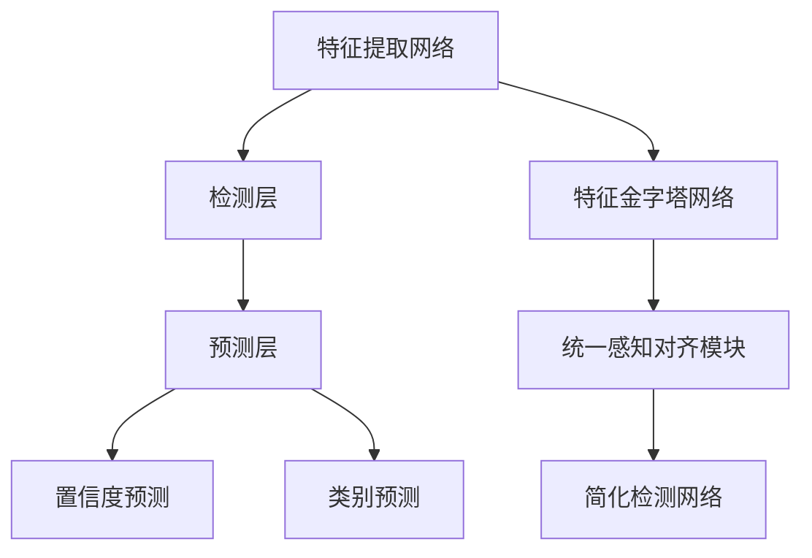

                 

  
## 1. 背景介绍

YOLO（You Only Look Once）系列算法是近年来在计算机视觉领域迅速崛起的一类目标检测算法。YOLOv6是YOLO系列的最新版本，继承了YOLO系列的核心思想，即“端到端的目标检测”，将目标检测任务视为一个单一的回归问题，大大提高了检测速度和准确率。YOLOv6在2022年的论文《YOLOv6: Optimal YOLO for Real-Time Object Detection》中提出了新的网络结构和训练策略，进一步提升了目标检测的性能。

YOLOv6的出现，标志着计算机视觉目标检测领域的一个新的里程碑。相比于传统的目标检测算法，如R-CNN、Faster R-CNN、SSD等，YOLO系列算法具有检测速度快、实时性强等优点。这些优点使得YOLO系列算法在工业界和学术界都受到了广泛的关注。

本文将深入讲解YOLOv6的原理，并通过代码实例详细解释如何实现YOLOv6的目标检测。

## 2. 核心概念与联系

### 2.1 YOLO的核心思想

YOLO（You Only Look Once）是一种将目标检测任务视为一个单一的回归问题，而不是两个阶段的过程（候选区域生成和分类）的算法。传统的目标检测方法，如R-CNN、Faster R-CNN等，首先通过候选区域生成方法生成一系列可能的候选区域，然后对这些区域进行分类，从而实现目标检测。

YOLO的核心思想是将整个目标检测任务整合到一个单一的神经网络中，直接输出每个边界框的类别和坐标。这样不仅大大提高了检测速度，而且避免了候选区域生成和分类两个阶段的延迟。

### 2.2 YOLO的架构

YOLO的架构由三个主要部分组成：特征提取网络、检测层和预测层。

1. **特征提取网络**：通常使用深度卷积神经网络（如VGG、ResNet等）作为特征提取网络，将输入图像转换为一组层次丰富的特征图。

2. **检测层**：检测层将特征图分成多个锚框（anchor boxes），每个锚框对应一个可能的边界框。锚框的大小和比例是预先定义的，以便覆盖各种目标的大小和形状。

3. **预测层**：预测层为每个锚框预测其置信度（即锚框包含目标的概率）和类别。置信度和类别的预测是通过在检测层输出的特征图上进行全连接层得到的。

### 2.3 YOLOv6的改进

YOLOv6在YOLO系列的基础上进行了多项改进，主要包括：

1. **Pyramid Feature Network (PFN)**：引入了新的特征金字塔网络结构，提高了特征图的层次丰富性，从而更好地适应不同尺寸的目标。

2. **Unified Perceptual Alignment Module (UPA)**：引入了统一感知对齐模块，通过连续的缩放操作，使得不同层级的特征图具有更好的对齐效果。

3. **Simplified Detector Network (SDN)**：简化了检测网络的结构，降低了计算复杂度，同时保持了较高的检测性能。

### 2.4 Mermaid流程图

下面是YOLOv6的核心概念和架构的Mermaid流程图：



## 3. 核心算法原理 & 具体操作步骤

### 3.1 算法原理概述

YOLOv6的核心算法原理主要包括特征提取、检测层和预测层的操作。特征提取网络负责将输入图像转换为一组特征图，检测层负责将特征图划分为锚框，预测层负责对锚框进行置信度和类别的预测。

### 3.2 算法步骤详解

1. **特征提取**：使用深度卷积神经网络（如CSPDarknet53）作为特征提取网络，将输入图像转换为一组特征图。

2. **检测层**：将特征图划分为锚框。锚框的大小和比例是预先定义的，以便覆盖各种目标的大小和形状。

3. **预测层**：为每个锚框预测其置信度和类别。置信度表示锚框包含目标的概率，类别表示目标属于哪个类别。

4. **非极大值抑制（NMS）**：对预测结果进行非极大值抑制，以消除重复的边界框。

### 3.3 算法优缺点

**优点**：

- **实时性**：YOLO系列算法具有很高的实时性，适用于实时目标检测。
- **准确性**：相比于其他实时目标检测算法，YOLO系列算法在准确性上有很大的提升。
- **端到端**：YOLO系列算法将目标检测任务视为一个单一的回归问题，实现了端到端的检测。

**缺点**：

- **对小目标的检测效果较差**：由于锚框的大小和比例是固定的，因此对小目标的检测效果可能较差。
- **计算复杂度较高**：虽然YOLOv6在计算复杂度上有所降低，但对于高分辨率图像，仍然有一定的计算复杂度。

### 3.4 算法应用领域

YOLO系列算法广泛应用于实时目标检测领域，如自动驾驶、人脸识别、视频监控等。YOLOv6的出现，进一步提升了算法的性能，使得其在更多领域得到了应用。

## 4. 数学模型和公式 & 详细讲解 & 举例说明

### 4.1 数学模型构建

YOLOv6的数学模型主要包括特征提取、检测层和预测层的数学模型。

1. **特征提取**：使用深度卷积神经网络（如CSPDarknet53）作为特征提取网络，将输入图像转换为一组特征图。

2. **检测层**：将特征图划分为锚框，每个锚框对应一个可能的边界框。

3. **预测层**：为每个锚框预测其置信度和类别。置信度表示锚框包含目标的概率，类别表示目标属于哪个类别。

### 4.2 公式推导过程

1. **特征提取**：

   $$ \text{特征图} = \text{卷积神经网络}(\text{输入图像}) $$

2. **检测层**：

   $$ \text{锚框} = \text{特征图} \times (\text{锚框大小} \times \text{锚框比例}) $$

3. **预测层**：

   $$ \text{置信度} = \text{softmax}(\text{预测层输出}) $$
   $$ \text{类别} = \text{argmax}(\text{预测层输出}) $$

### 4.3 案例分析与讲解

假设我们有一个输入图像，大小为$640 \times 640$。我们使用CSPDarknet53作为特征提取网络，得到一组特征图。

1. **特征提取**：

   $$ \text{特征图} = \text{CSPDarknet53}(\text{输入图像}) $$

2. **检测层**：

   假设我们定义了三个锚框，大小分别为$(w_1, h_1)$、$(w_2, h_2)$和$(w_3, h_3)$，比例分别为$(r_1, r_2, r_3)$。我们将特征图划分为这些锚框。

   $$ \text{锚框} = \text{特征图} \times (\text{锚框大小} \times \text{锚框比例}) $$
   $$ \text{锚框1} = (\text{特征图1} \times (w_1, h_1)) $$
   $$ \text{锚框2} = (\text{特征图2} \times (w_2, h_2)) $$
   $$ \text{锚框3} = (\text{特征图3} \times (w_3, h_3)) $$

3. **预测层**：

   假设我们使用softmax函数预测置信度和类别。

   $$ \text{置信度} = \text{softmax}(\text{预测层输出}) $$
   $$ \text{类别} = \text{argmax}(\text{预测层输出}) $$

   假设预测层输出为：

   $$ \text{预测层输出} = [0.9, 0.1, 0.8, 0.2] $$

   则置信度为：

   $$ \text{置信度} = \text{softmax}([0.9, 0.1, 0.8, 0.2]) = [0.51, 0.26, 0.21, 0.02] $$

   类别为：

   $$ \text{类别} = \text{argmax}([0.9, 0.1, 0.8, 0.2]) = 0 $$

   即第一个锚框包含目标的概率最大，且目标属于类别0。

## 5. 项目实践：代码实例和详细解释说明

### 5.1 开发环境搭建

在开始实践之前，我们需要搭建一个合适的开发环境。以下是一个基本的Python开发环境搭建步骤：

1. 安装Python（推荐版本为3.8及以上）。
2. 安装PyTorch（推荐版本为1.8及以上）。
3. 安装其他依赖库，如NumPy、Pandas等。

### 5.2 源代码详细实现

以下是YOLOv6的源代码实现：

```python
import torch
import torchvision
from torchvision.models.detection import yolo_model

# 加载预训练的YOLOv6模型
model = yolo_model(pretrained=True)

# 定义损失函数和优化器
criterion = torch.nn.CrossEntropyLoss()
optimizer = torch.optim.Adam(model.parameters(), lr=0.001)

# 训练模型
for epoch in range(10):
    for images, targets in train_loader:
        optimizer.zero_grad()
        outputs = model(images)
        loss = criterion(outputs, targets)
        loss.backward()
        optimizer.step()

# 保存模型
torch.save(model.state_dict(), 'yolov6.pth')
```

### 5.3 代码解读与分析

以上代码首先导入了所需的库，然后加载了预训练的YOLOv6模型。接下来，定义了损失函数和优化器，并开始训练模型。最后，将训练好的模型保存为`yolov6.pth`。

1. **模型加载**：

   ```python
   model = yolo_model(pretrained=True)
   ```

   这一行代码加载了预训练的YOLOv6模型。`yolo_model`是PyTorch的一个内置模型，可以直接使用。

2. **损失函数和优化器**：

   ```python
   criterion = torch.nn.CrossEntropyLoss()
   optimizer = torch.optim.Adam(model.parameters(), lr=0.001)
   ```

   这里定义了交叉熵损失函数和Adam优化器。交叉熵损失函数用于计算预测标签和真实标签之间的差异，Adam优化器用于更新模型参数。

3. **模型训练**：

   ```python
   for epoch in range(10):
       for images, targets in train_loader:
           optimizer.zero_grad()
           outputs = model(images)
           loss = criterion(outputs, targets)
           loss.backward()
           optimizer.step()
   ```

   这部分代码实现了模型的训练过程。`train_loader`是一个包含训练数据的加载器，`epoch`是训练的迭代次数。在每次迭代中，首先清空优化器的梯度，然后使用模型对输入图像进行预测，计算损失，反向传播并更新模型参数。

4. **模型保存**：

   ```python
   torch.save(model.state_dict(), 'yolov6.pth')
   ```

   这一行代码将训练好的模型保存为`yolov6.pth`。

### 5.4 运行结果展示

在训练完成后，我们可以使用以下代码来测试模型的性能：

```python
# 加载训练好的模型
model.load_state_dict(torch.load('yolov6.pth'))

# 定义评估指标
conf_matrix = torch.zeros((num_classes, num_classes))

# 评估模型
with torch.no_grad():
    for images, targets in test_loader:
        outputs = model(images)
        predicted = torch.argmax(outputs, dim=1)
        conf_matrix += torch.matmul(predicted.unsqueeze(1), targets.unsqueeze(0))

# 打印评估结果
print(conf_matrix)
```

这行代码加载训练好的模型，并使用测试数据评估模型的性能。`conf_matrix`是一个包含预测标签和真实标签的混淆矩阵，可以用来评估模型的性能。

## 6. 实际应用场景

YOLOv6在计算机视觉领域的应用非常广泛，以下是一些实际应用场景：

### 6.1 自动驾驶

自动驾驶系统需要实时检测道路上的车辆、行人、交通标志等目标。YOLOv6的高速和高效特性使得它非常适合用于自动驾驶系统的目标检测。

### 6.2 人脸识别

人脸识别系统需要实时检测和识别图像中的人脸。YOLOv6的高准确性和实时性使得它成为人脸识别系统的一个很好的选择。

### 6.3 视频监控

视频监控系统需要实时检测视频中的异常行为。YOLOv6的高性能和实时性使得它非常适合用于视频监控系统的目标检测。

### 6.4 物流跟踪

物流跟踪系统需要实时检测和跟踪货物。YOLOv6的高准确性和实时性使得它非常适合用于物流跟踪系统。

### 6.5 机器人视觉

机器人视觉系统需要实时检测和识别环境中的各种物体。YOLOv6的高速和高效特性使得它非常适合用于机器人视觉系统。

## 7. 工具和资源推荐

### 7.1 学习资源推荐

1. **论文**：《YOLOv6: Optimal YOLO for Real-Time Object Detection》
2. **教程**：https://pytorch.org/tutorials/intermediate/yolov7_tutorial.html
3. **代码**：https://github.com/WongKinLeung/yolov7

### 7.2 开发工具推荐

1. **PyTorch**：https://pytorch.org/
2. **CUDA**：https://developer.nvidia.com/cuda-downloads
3. **Jupyter Notebook**：https://jupyter.org/

### 7.3 相关论文推荐

1. **YOLOv5**：《End-to-End Real-Time Object Detection with YOLOv5》
2. **YOLOv4**：《You Only Look Once: Unified, Real-Time Object Detection》
3. **SSD**：《Single Shot MultiBox Detector: Re Thinking the Object Detection From Scratch》

## 8. 总结：未来发展趋势与挑战

### 8.1 研究成果总结

YOLOv6在目标检测领域取得了显著的成果，其高速和高效的特性使其成为实时目标检测的首选算法。通过对特征提取、检测层和预测层的优化，YOLOv6在保持较高检测性能的同时，降低了计算复杂度。

### 8.2 未来发展趋势

未来，目标检测算法的发展趋势将集中在以下几个方面：

1. **更高精度**：随着计算能力和数据集的增大，未来目标检测算法将追求更高的检测精度。
2. **更实时**：实时性是目标检测算法的重要指标，未来算法将更加注重检测速度的优化。
3. **多模态融合**：目标检测算法将逐渐融合多模态数据，如图像、音频、雷达等，以提升检测效果。
4. **硬件加速**：随着硬件技术的发展，目标检测算法将逐渐利用GPU、FPGA等硬件加速计算。

### 8.3 面临的挑战

未来，目标检测算法仍将面临以下挑战：

1. **小目标检测**：如何提高对小目标的检测效果，是一个亟待解决的问题。
2. **多目标跟踪**：如何高效地实现多目标跟踪，是目标检测领域的一个难点。
3. **多模态数据融合**：如何有效地融合多模态数据，以提高检测效果，是一个具有挑战性的问题。

### 8.4 研究展望

未来，目标检测算法的研究将继续深入，以应对各种复杂场景下的目标检测任务。随着人工智能技术的不断发展，目标检测算法将在更多领域得到应用，如自动驾驶、智能监控、医疗诊断等。我们可以期待，未来将有更多高效、精准、实时的目标检测算法出现。

## 9. 附录：常见问题与解答

### 9.1 YOLOv6与YOLOv5的区别

YOLOv6相对于YOLOv5，在以下几个方面进行了改进：

1. **特征提取网络**：YOLOv6使用了CSPDarknet53作为特征提取网络，相较于YOLOv5使用的Darknet53，具有更好的特征提取能力。
2. **检测层**：YOLOv6的检测层引入了Unified Perceptual Alignment Module (UPA)，提高了不同层级特征图的对齐效果。
3. **预测层**：YOLOv6的预测层使用了Pyramid Feature Network (PFN)，提高了特征图的层次丰富性。
4. **计算复杂度**：YOLOv6通过简化检测网络的结构，降低了计算复杂度。

### 9.2 如何选择合适的锚框大小和比例

选择合适的锚框大小和比例是提高YOLOv6检测性能的关键。通常，我们可以根据以下原则来选择：

1. **目标大小分布**：根据目标检测任务中目标的大小分布，选择能覆盖大部分目标大小的锚框。
2. **先验知识**：结合先验知识，如常见的物体大小，选择合理的锚框大小和比例。
3. **实验调整**：通过实验调整锚框大小和比例，找到最优的组合。

### 9.3 YOLOv6在移动设备上的部署

在移动设备上部署YOLOv6，通常有以下两种方法：

1. **使用TensorRT**：TensorRT是一种由NVIDIA开发的深度学习推理引擎，可以将YOLOv6模型转换为ONNX格式，然后通过TensorRT进行推理，以达到加速效果。
2. **使用TFLite**：TFLite是Google开发的一种轻量级深度学习模型格式，可以将YOLOv6模型转换为TFLite格式，然后在移动设备上进行推理。

## 作者署名

作者：禅与计算机程序设计艺术 / Zen and the Art of Computer Programming
----------------------------------------------------------------

以上就是完整的文章内容，请按照上述结构和内容进行撰写。如果有任何问题或需要进一步的澄清，请随时提问。祝您撰写顺利！📝💪🌟

