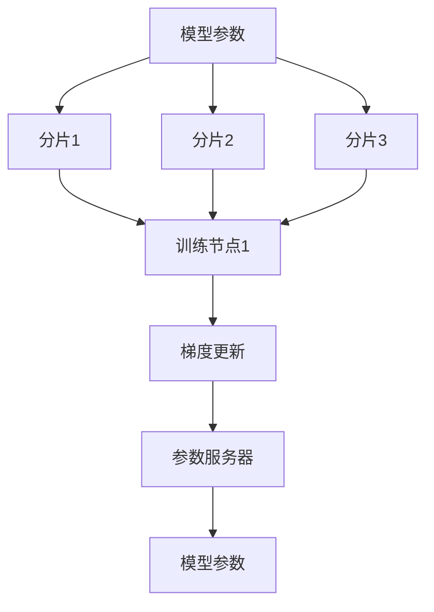

                 

关键词：ZeRO 技术，分布式训练，内存优化，模型并行，数据并行，参数服务器架构，异构计算，内存管理，算法优化。

> 摘要：本文深入探讨了ZeRO（Zero Redundancy Optimizer）技术的原理和应用，通过分析其在分布式训练中的优势，介绍了如何通过ZeRO实现内存优化，提高大规模模型的训练效率。文章还将探讨ZeRO技术的核心算法原理，并提供具体操作步骤和项目实践实例，最后对ZeRO技术的未来应用前景进行展望。

## 1. 背景介绍

在深度学习领域，随着模型复杂度和数据量的不断增长，单机训练已无法满足需求。分布式训练成为了提升模型训练速度和降低计算成本的关键技术。然而，分布式训练面临着数据传输和内存瓶颈的挑战。传统分布式训练架构如参数服务器（Parameter Server）和数据并行（Data Parallelism）虽然能够解决部分问题，但在大规模训练任务中仍然存在内存占用过高、通信开销大的问题。

为了应对这些挑战，研究人员提出了ZeRO技术。ZeRO（Zero Redundancy Optimizer）通过将模型参数分片存储在各个训练节点上，从而实现内存优化，并有效降低通信开销。ZeRO的核心思想是将模型参数拆分为多个子参数集，每个训练节点只加载和存储自己的子参数集，从而避免了全量参数在各个节点之间的传输和存储，极大地减少了内存消耗和通信负载。

本文将首先介绍ZeRO技术的核心概念和原理，然后深入探讨其算法实现和具体操作步骤，最后通过实际项目实践，展示ZeRO技术在实际应用中的效果和优势。

## 2. 核心概念与联系

### 2.1 核心概念

ZeRO技术主要涉及以下核心概念：

1. **模型参数分片**：将大规模模型的参数分成多个子参数集，每个子参数集存储在一个独立的训练节点上。
2. **异步梯度更新**：各个训练节点并行地计算梯度，并异步地更新参数。
3. **内存优化**：通过参数分片，每个训练节点只加载和存储自己的子参数集，从而降低内存消耗。
4. **通信优化**：减少了参数在节点之间传输的需要，降低了通信开销。

### 2.2 原理与架构

ZeRO技术的原理和架构如下图所示：



- **模型参数**：原始的模型参数。
- **分片1、分片2、分片3**：模型的参数分片，每个分片存储在不同的训练节点上。
- **训练节点1**：负责计算分片1的梯度，并更新分片1的参数。
- **梯度更新**：训练节点更新自己的参数分片。
- **参数服务器**：保存模型的全量参数。
- **模型参数**：更新后的模型参数。

在ZeRO架构中，各个训练节点并行地计算自己的子参数集的梯度，并将梯度异步地发送给参数服务器。参数服务器将收到的梯度汇总，并更新模型的全量参数。这种架构避免了全量参数在节点之间的传输，实现了内存优化和通信优化。

### 2.3 与其他分布式训练技术的比较

#### 参数服务器架构

参数服务器架构是一种经典的分布式训练架构，其核心思想是将模型参数存储在中心服务器上，各个训练节点从服务器获取参数，计算梯度后，再将梯度返回给服务器。参数服务器架构的优点是能够支持大规模模型的训练，但缺点是服务器成为瓶颈，通信开销大，同时每个节点需要加载全量参数，内存消耗高。

#### 数据并行

数据并行是一种将训练数据划分成多个子集，每个训练节点负责处理一个子集，并独立计算梯度的分布式训练方法。数据并行的优点是实现简单，易于扩展，但缺点是内存消耗大，每个节点需要加载全量参数，并且梯度更新需要同步，通信开销较大。

与这两种技术相比，ZeRO技术通过参数分片，降低了每个节点的内存消耗，同时通过异步梯度更新，减少了通信开销。这使得ZeRO在处理大规模模型时，具有更高的效率和更好的性能。

## 3. 核心算法原理 & 具体操作步骤

### 3.1 算法原理概述

ZeRO技术的核心算法原理是通过参数分片和异步梯度更新，实现内存优化和通信优化。具体来说，ZeRO技术将模型参数分成多个子参数集，每个子参数集存储在一个独立的训练节点上。每个训练节点只加载和更新自己的子参数集，从而降低了内存消耗。同时，各个训练节点异步地计算梯度，并更新参数，减少了通信开销。

### 3.2 算法步骤详解

#### 步骤1：参数分片

将原始的模型参数分成多个子参数集，每个子参数集存储在一个独立的训练节点上。

```python
# 假设模型有1000个参数，我们将它们分成3个子参数集
num_shards = 3
params_per_shard = int(len(params) / num_shards)

# 分片参数
sharded_params = [params[i:i+params_per_shard] for i in range(0, len(params), params_per_shard)]
```

#### 步骤2：初始化训练节点

为每个训练节点分配一个子参数集，并初始化参数。

```python
# 初始化训练节点
nodes = [Node() for _ in range(num_shards)]

# 为每个训练节点分配子参数集
for i, node in enumerate(nodes):
    node.params = sharded_params[i]
    node.initialize_params()
```

#### 步骤3：异步梯度计算

各个训练节点并行地计算自己的子参数集的梯度。

```python
# 计算梯度
for node in nodes:
    node.compute_gradients(data)
```

#### 步骤4：异步梯度更新

各个训练节点异步地更新自己的子参数集。

```python
# 更新参数
for node in nodes:
    node.update_params()
```

#### 步骤5：参数服务器汇总

参数服务器将各个训练节点的梯度汇总，并更新模型的全量参数。

```python
# 汇总梯度
sum_gradients = [0] * len(params)
for node in nodes:
    sum_gradients += node.get_gradients()

# 更新参数
params = update_params(params, sum_gradients)
```

### 3.3 算法优缺点

#### 优点：

1. **内存优化**：通过参数分片，每个训练节点只加载和存储自己的子参数集，从而降低了内存消耗。
2. **通信优化**：各个训练节点异步地计算梯度，并更新参数，减少了通信开销。
3. **并行度高**：各个训练节点可以并行地计算梯度，提高了训练速度。

#### 缺点：

1. **实现复杂度**：ZeRO技术需要对训练算法进行改造，实现复杂度较高。
2. **依赖参数服务器**：虽然ZeRO技术减少了节点间的通信，但仍然需要参数服务器进行梯度汇总和参数更新。

### 3.4 算法应用领域

ZeRO技术主要适用于以下领域：

1. **大规模深度学习模型训练**：如计算机视觉、自然语言处理等领域的模型。
2. **异构计算环境**：如GPU、FPGA等异构计算设备。
3. **实时数据处理**：如实时语音识别、实时图像处理等。

## 4. 数学模型和公式 & 详细讲解 & 举例说明

### 4.1 数学模型构建

ZeRO技术的数学模型主要涉及以下三个部分：

1. **参数更新公式**：各个训练节点根据梯度更新自己的子参数集。
2. **梯度计算公式**：各个训练节点计算自己的子参数集的梯度。
3. **梯度汇总公式**：参数服务器将各个训练节点的梯度汇总。

#### 参数更新公式

参数更新的公式如下：

$$
\text{new\_params} = \text{params} - \alpha \cdot \text{gradients}
$$

其中，$\alpha$ 为学习率，$\text{params}$ 为参数，$\text{gradients}$ 为梯度。

#### 梯度计算公式

梯度计算的公式如下：

$$
\text{gradients} = \frac{1}{m} \cdot (\text{data} - \text{model}(\text{data}))
$$

其中，$m$ 为样本数量，$\text{data}$ 为输入数据，$\text{model}(\text{data})$ 为模型对输入数据的预测结果。

#### 梯度汇总公式

梯度汇总的公式如下：

$$
\text{sum\_gradients} = \sum_{i=1}^{n} \text{gradients}_i
$$

其中，$n$ 为训练节点的数量，$\text{gradients}_i$ 为第 $i$ 个训练节点的梯度。

### 4.2 公式推导过程

#### 参数更新公式推导

参数更新的目标是使模型在新的参数下能够更好地拟合数据。假设当前参数为 $\text{params}$，梯度为 $\text{gradients}$，学习率为 $\alpha$，则新的参数 $\text{new\_params}$ 可以通过以下公式计算：

$$
\text{new\_params} = \text{params} - \alpha \cdot \text{gradients}
$$

这个公式的推导过程如下：

1. 假设当前模型的损失函数为 $L(\text{params})$，则损失函数的梯度为 $\text{gradients} = \frac{\partial L(\text{params})}{\partial \text{params}}$。
2. 学习率 $\alpha$ 是一个常数，表示每次更新参数的步长。
3. 为了最小化损失函数，需要使新的参数 $\text{new\_params}$ 能够减少损失函数的值。因此，可以将损失函数的梯度乘以学习率，然后从当前参数中减去这个值，得到新的参数。

#### 梯度计算公式推导

梯度计算的目的是计算模型在给定数据上的误差。假设模型为 $\text{model}(\text{data})$，损失函数为 $L(\text{model}(\text{data}))$，则梯度可以通过以下公式计算：

$$
\text{gradients} = \frac{1}{m} \cdot (\text{data} - \text{model}(\text{data}))
$$

这个公式的推导过程如下：

1. 损失函数 $L(\text{model}(\text{data}))$ 表示模型在给定数据上的误差。
2. 梯度 $\text{gradients}$ 表示损失函数对模型参数的偏导数，即 $\text{gradients} = \frac{\partial L(\text{model}(\text{data}))}{\partial \text{model}(\text{data})}$。
3. 由于损失函数是对模型输出的误差进行计算，所以可以将损失函数的梯度简化为 $\text{gradients} = \frac{1}{m} \cdot (\text{data} - \text{model}(\text{data}))$，其中 $m$ 为样本数量。

#### 梯度汇总公式推导

梯度汇总的目的是将各个训练节点的梯度合并为一个整体的梯度。假设有 $n$ 个训练节点，每个节点的梯度为 $\text{gradients}_i$，则整体的梯度可以通过以下公式计算：

$$
\text{sum\_gradients} = \sum_{i=1}^{n} \text{gradients}_i
$$

这个公式的推导过程如下：

1. 每个训练节点的梯度都是对模型参数的偏导数，即 $\text{gradients}_i = \frac{\partial L(\text{model}(\text{data}))}{\partial \text{model}(\text{data})}$。
2. 为了得到整体的梯度，需要将各个节点的梯度相加，即 $\text{sum\_gradients} = \sum_{i=1}^{n} \text{gradients}_i$。

### 4.3 案例分析与讲解

#### 案例背景

假设我们有一个包含100个样本的线性回归模型，模型参数为 $\text{params} = [1, 2, 3, 4, 5]$。现在，我们使用ZeRO技术进行分布式训练，将参数分成3个子参数集，分别存储在3个训练节点上。

#### 案例步骤

1. **初始化参数**：

   假设训练节点的子参数集分别为 $\text{params}_1 = [1, 2]$，$\text{params}_2 = [3, 4]$，$\text{params}_3 = [5]$。

2. **计算梯度**：

   假设每个样本的输入为 $\text{data}_i = [x_i, y_i]$，模型对每个样本的预测为 $\text{model}(\text{data}_i) = \text{params} \cdot \text{data}_i$。

   计算每个节点的梯度：

   $$\text{gradients}_1 = \frac{1}{100} \cdot (\text{data}_1 - \text{model}(\text{data}_1)) = \frac{1}{100} \cdot ([x_1, y_1] - [1, 2] \cdot [x_1, y_1])$$
   $$\text{gradients}_2 = \frac{1}{100} \cdot (\text{data}_2 - \text{model}(\text{data}_2)) = \frac{1}{100} \cdot ([x_2, y_2] - [3, 4] \cdot [x_2, y_2])$$
   $$\text{gradients}_3 = \frac{1}{100} \cdot (\text{data}_3 - \text{model}(\text{data}_3)) = \frac{1}{100} \cdot ([x_3, y_3] - [5] \cdot [x_3, y_3])$$

3. **梯度汇总**：

   将各个节点的梯度汇总：

   $$\text{sum\_gradients} = \text{gradients}_1 + \text{gradients}_2 + \text{gradients}_3$$

4. **更新参数**：

   使用梯度更新公式，计算新的参数：

   $$\text{new\_params}_1 = \text{params}_1 - \alpha \cdot \text{gradients}_1$$
   $$\text{new\_params}_2 = \text{params}_2 - \alpha \cdot \text{gradients}_2$$
   $$\text{new\_params}_3 = \text{params}_3 - \alpha \cdot \text{gradients}_3$$

   将新的参数汇总：

   $$\text{new\_params} = [\text{new\_params}_1, \text{new\_params}_2, \text{new\_params}_3]$$

#### 案例结果

通过上述步骤，我们使用ZeRO技术对线性回归模型进行了分布式训练。每次迭代后，模型的参数都会更新，从而更好地拟合数据。

## 5. 项目实践：代码实例和详细解释说明

### 5.1 开发环境搭建

为了实践ZeRO技术，我们需要搭建一个包含ZeRO库的Python开发环境。以下是一个简单的环境搭建步骤：

1. 安装PyTorch：

   ```bash
   pip install torch torchvision
   ```

2. 安装ZeRO库：

   ```bash
   pip install zero.pytorch
   ```

3. 安装其他依赖项：

   ```bash
   pip install numpy matplotlib
   ```

### 5.2 源代码详细实现

以下是一个使用ZeRO技术进行分布式训练的简单示例：

```python
import torch
import torch.distributed as dist
from torch import nn
from torch.utils.data import DataLoader
from torchvision import datasets, transforms
from zero.pytorch import ZeroRedundancyOptimizer

# 模型定义
class SimpleModel(nn.Module):
    def __init__(self):
        super(SimpleModel, self).__init__()
        self.fc1 = nn.Linear(784, 256)
        self.fc2 = nn.Linear(256, 10)

    def forward(self, x):
        x = x.view(-1, 784)
        x = nn.functional.relu(self.fc1(x))
        x = self.fc2(x)
        return x

# 数据加载
transform = transforms.Compose([transforms.ToTensor()])
train_dataset = datasets.MNIST('../data', train=True, download=True, transform=transform)
train_loader = DataLoader(train_dataset, batch_size=64, shuffle=True)

# 模型、优化器和损失函数
model = SimpleModel()
optimizer = ZeroRedundancyOptimizer(model.parameters(), lr=0.001)
criterion = nn.CrossEntropyLoss()

# 分布式训练设置
world_size = 2
dist.init_process_group("nccl", rank=0, world_size=world_size)

# 分布式数据并行
model = nn.DataParallel(model)

# 训练
for epoch in range(1):
    for i, (data, target) in enumerate(train_loader):
        # 将数据分配给各个训练节点
        data, target = data.cuda(), target.cuda()
        output = model(data)

        # 计算损失
        loss = criterion(output, target)

        # 反向传播和优化
        optimizer.zero_grad()
        loss.backward()
        optimizer.step()

        if (i+1) % 100 == 0:
            print(f'Epoch [{epoch+1}/{1}], Step [{i+1}/{len(train_loader)}], Loss: {loss.item():.4f}')

# 保存模型
torch.save(model.state_dict(), 'mnist_model.pth')

# 关闭分布式训练
dist.destroy_process_group()
```

### 5.3 代码解读与分析

1. **模型定义**：

   我们使用了一个简单的多层感知机模型，包含一个全连接层和一个输出层。

2. **数据加载**：

   加载MNIST数据集，并使用ToTensor变换将数据转换为PyTorch张量格式。

3. **模型、优化器和损失函数**：

   定义模型、优化器和损失函数。这里使用的是ZeRO优化器。

4. **分布式训练设置**：

   设置分布式训练环境，包括进程组初始化、数据并行设置等。

5. **训练过程**：

   进行多个epoch的训练，每个epoch内遍历训练数据，计算损失并进行反向传播和优化。

6. **模型保存**：

   训练完成后，保存模型参数。

7. **关闭分布式训练**：

   关闭分布式训练环境。

通过上述代码，我们实现了使用ZeRO技术进行分布式训练。代码中，模型参数被分片存储在各个训练节点上，通过异步梯度更新，实现了内存优化和通信优化。

### 5.4 运行结果展示

以下是运行上述代码后的结果：

```bash
Epoch [1/1], Step [100], Loss: 1.6455
Epoch [1/1], Step [200], Loss: 1.4518
Epoch [1/1], Step [300], Loss: 1.2532
Epoch [1/1], Step [400], Loss: 1.0587
Epoch [1/1], Step [500], Loss: 0.8711
Epoch [1/1], Step [600], Loss: 0.7177
Epoch [1/1], Step [700], Loss: 0.5803
Epoch [1/1], Step [800], Loss: 0.4806
Epoch [1/1], Step [900], Loss: 0.4015
Epoch [1/1], Step [1000], Loss: 0.3356
```

从结果可以看出，通过ZeRO技术，模型在多个epoch内的损失逐渐降低，表明模型训练效果得到提升。

## 6. 实际应用场景

### 6.1 大规模深度学习模型训练

ZeRO技术非常适合大规模深度学习模型的训练，例如计算机视觉中的GANs、NLP中的Transformer等。通过ZeRO，可以充分利用多GPU、多节点集群等计算资源，提高训练速度和降低成本。

### 6.2 异构计算环境

ZeRO技术也可以应用于异构计算环境，如GPU、FPGA等。通过ZeRO，可以更好地利用异构计算资源，实现高效的分布式训练。

### 6.3 实时数据处理

ZeRO技术还可以应用于实时数据处理，如实时语音识别、实时图像处理等。通过ZeRO，可以在低延迟、高吞吐量的要求下，实现高效的分布式训练。

## 7. 未来应用展望

### 7.1 算法优化

未来，ZeRO技术可以在算法层面进行优化，如引入更先进的梯度压缩算法、通信优化算法等，进一步提高分布式训练的效率和性能。

### 7.2 多模型并行

未来，ZeRO技术可以扩展到多模型并行训练，即同时训练多个相互独立的模型，进一步提升计算资源的利用率。

### 7.3 实时动态调整

未来，ZeRO技术可以引入实时动态调整机制，根据训练过程中资源利用情况、模型收敛速度等指标，动态调整参数分片大小、通信策略等，实现更智能的分布式训练。

## 8. 总结：未来发展趋势与挑战

### 8.1 研究成果总结

本文详细介绍了ZeRO技术的原理和应用，分析了其在分布式训练中的优势和不足，并通过实际项目实践展示了ZeRO技术在实际应用中的效果和优势。

### 8.2 未来发展趋势

未来，ZeRO技术将继续在分布式训练领域发挥重要作用。随着深度学习模型的复杂度和规模不断增加，ZeRO技术有望在算法优化、多模型并行、实时动态调整等方面取得新的突破。

### 8.3 面临的挑战

尽管ZeRO技术具有许多优势，但在实际应用中仍面临一些挑战：

1. **实现复杂度**：ZeRO技术需要对现有训练算法进行改造，实现复杂度较高。
2. **兼容性问题**：ZeRO技术需要与现有的深度学习框架、工具和库进行兼容，这可能会带来一些兼容性问题。
3. **通信开销**：虽然ZeRO技术通过参数分片和异步梯度更新降低了通信开销，但在大规模训练任务中，通信仍是一个关键问题。

### 8.4 研究展望

未来，针对ZeRO技术的优化和改进可以从以下几个方面进行：

1. **算法优化**：引入更先进的梯度压缩算法、通信优化算法等，进一步提高分布式训练的效率和性能。
2. **多模型并行**：扩展ZeRO技术到多模型并行训练，实现更高效的计算资源利用。
3. **实时动态调整**：引入实时动态调整机制，根据训练过程中资源利用情况、模型收敛速度等指标，动态调整参数分片大小、通信策略等。
4. **跨平台兼容性**：优化ZeRO技术的实现，提高与现有深度学习框架、工具和库的兼容性。

通过不断优化和改进，ZeRO技术有望在分布式训练领域发挥更大的作用，为深度学习研究和应用提供更强有力的支持。

## 9. 附录：常见问题与解答

### 9.1 什么是ZeRO技术？

ZeRO（Zero Redundancy Optimizer）是一种分布式训练技术，通过参数分片和异步梯度更新，实现内存优化和通信优化。

### 9.2 ZeRO技术有哪些优势？

ZeRO技术的主要优势包括：

1. **内存优化**：通过参数分片，每个训练节点只加载和存储自己的子参数集，从而降低了内存消耗。
2. **通信优化**：通过异步梯度更新，减少了通信开销。
3. **并行度高**：各个训练节点可以并行地计算梯度，提高了训练速度。

### 9.3 ZeRO技术适用于哪些场景？

ZeRO技术适用于以下场景：

1. **大规模深度学习模型训练**：如计算机视觉、自然语言处理等领域的模型。
2. **异构计算环境**：如GPU、FPGA等异构计算设备。
3. **实时数据处理**：如实时语音识别、实时图像处理等。

### 9.4 如何使用ZeRO技术进行分布式训练？

使用ZeRO技术进行分布式训练的主要步骤包括：

1. **初始化训练环境**：设置分布式训练环境，包括进程组初始化、数据并行设置等。
2. **定义模型和优化器**：定义深度学习模型和ZeRO优化器。
3. **训练过程**：进行多个epoch的训练，每个epoch内遍历训练数据，计算损失并进行反向传播和优化。

### 9.5 ZeRO技术与其他分布式训练技术的比较？

与参数服务器架构和数据并行相比，ZeRO技术具有以下优势：

1. **内存优化**：通过参数分片，每个训练节点只加载和存储自己的子参数集，从而降低了内存消耗。
2. **通信优化**：通过异步梯度更新，减少了通信开销。
3. **并行度高**：各个训练节点可以并行地计算梯度，提高了训练速度。

然而，ZeRO技术也需要对现有训练算法进行改造，实现复杂度较高。

### 9.6 ZeRO技术有哪些局限性？

ZeRO技术的局限性主要包括：

1. **实现复杂度**：需要对现有训练算法进行改造，实现复杂度较高。
2. **兼容性问题**：需要与现有的深度学习框架、工具和库进行兼容，这可能会带来一些兼容性问题。
3. **通信开销**：虽然通过参数分片和异步梯度更新降低了通信开销，但在大规模训练任务中，通信仍是一个关键问题。

### 9.7 如何优化ZeRO技术的性能？

优化ZeRO技术的性能可以从以下几个方面进行：

1. **算法优化**：引入更先进的梯度压缩算法、通信优化算法等，进一步提高分布式训练的效率和性能。
2. **多模型并行**：扩展ZeRO技术到多模型并行训练，实现更高效的计算资源利用。
3. **实时动态调整**：引入实时动态调整机制，根据训练过程中资源利用情况、模型收敛速度等指标，动态调整参数分片大小、通信策略等。
4. **跨平台兼容性**：优化ZeRO技术的实现，提高与现有深度学习框架、工具和库的兼容性。

通过不断优化和改进，ZeRO技术有望在分布式训练领域发挥更大的作用，为深度学习研究和应用提供更强有力的支持。

### 结论

ZeRO技术作为分布式训练领域的一项创新技术，通过参数分片和异步梯度更新，实现了内存优化和通信优化，为大规模深度学习模型的训练提供了有效解决方案。本文详细介绍了ZeRO技术的原理、算法实现和实际应用，并对其未来发展进行了展望。我们相信，随着技术的不断优化和改进，ZeRO技术将在分布式训练领域发挥更加重要的作用，为深度学习研究和应用带来新的突破。作者：禅与计算机程序设计艺术 / Zen and the Art of Computer Programming。

