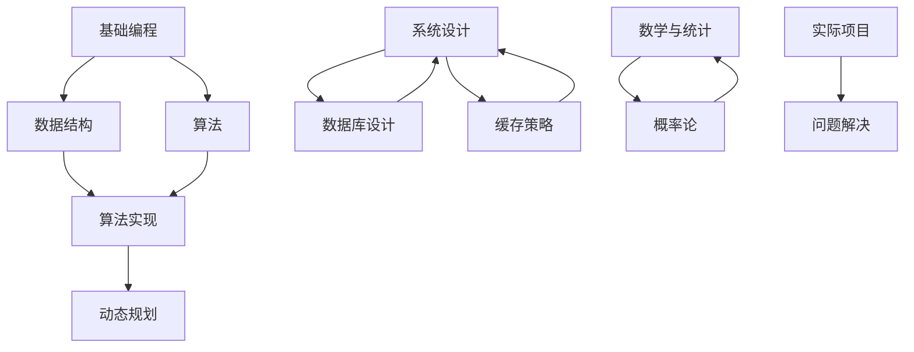

                 

 **关键词：** 后端面试题，直播互动，校招，技术解析，面试准备

**摘要：** 本文将深入解析bilibili 2024直播互动校招后端面试题，帮助准备参加校招的同学更好地理解和应对后端开发相关的面试问题。文章将涵盖核心概念、算法原理、数学模型、项目实践、实际应用场景、工具和资源推荐以及未来发展趋势等内容。

## 1. 背景介绍

bilibili 是中国知名的年轻人文化社区和视频平台，近年来在直播互动领域取得了显著成绩。2024年，bilibili 将举行直播互动校招活动，为广大应届毕业生提供后端开发岗位的机会。本文旨在通过解析面试题，帮助同学们更好地准备和应对后端面试。

### 1.1 面试形式

bilibili 的直播互动校招采用线上面试的形式，包括技术面试和互动问答两部分。技术面试主要测试应聘者的编程能力、算法理解和系统设计能力；互动问答则考察应聘者的沟通能力、逻辑思维和团队协作精神。

### 1.2 面试题类型

后端面试题主要涵盖以下几类：

1. **基础编程题**：考察编程基础，如数据结构、算法等。
2. **系统设计题**：考察系统架构和设计能力，如数据库设计、缓存策略等。
3. **算法实现题**：考察算法理解和编程能力，如排序算法、动态规划等。
4. **数学和统计学题**：考察数学和统计学知识，如概率论、统计学方法等。
5. **实际项目题**：考察实际项目经验和问题解决能力。

## 2. 核心概念与联系

为了更好地理解后端面试题，我们需要了解一些核心概念和它们之间的联系。以下是一个简化的Mermaid流程图：



### 2.1 数据结构与算法

数据结构是后端开发的基础，常见的有数组、链表、树、图等。算法则是解决特定问题的步骤集合，常见的有排序算法、查找算法、贪心算法、动态规划等。理解数据结构和算法对于解决后端面试题至关重要。

### 2.2 系统设计与数据库

系统设计是后端开发的核心，涉及系统架构、模块设计、接口设计等。数据库设计则是系统设计的重要组成部分，包括关系数据库的设计、SQL查询优化等。

### 2.3 缓存策略

缓存策略是提高系统性能的关键，常见的缓存策略有LRU替换策略、缓存预热等。理解缓存策略对于优化系统性能具有重要意义。

### 2.4 数学与统计学

数学和统计学在后端开发中有着广泛的应用，如概率论、统计学方法、线性代数等。掌握这些知识可以帮助我们更好地理解和解决实际问题。

### 2.5 实际项目与问题解决

实际项目题主要考察应聘者的项目经验和问题解决能力。在项目实践中，应聘者需要熟练掌握相关技术和工具，能够快速定位并解决问题。

## 3. 核心算法原理 & 具体操作步骤

### 3.1 算法原理概述

在面试中，算法原理的考察通常是基础性的，如排序算法、查找算法等。以下是一个简化的算法原理概述：

1. **排序算法**：将一组数据按照特定的顺序排列。常见的排序算法有冒泡排序、插入排序、选择排序、快速排序等。
2. **查找算法**：在数据结构中查找特定元素。常见的查找算法有二分查找、线性查找等。
3. **贪心算法**：每一步都做出在当前状态下最好选择，以期望最终结果最优。常见的贪心算法有背包问题、活动选择问题等。
4. **动态规划**：将复杂问题分解为子问题，并求解子问题的最优解，最终得到原问题的最优解。常见的动态规划问题有最长公共子序列、最短路径等。

### 3.2 算法步骤详解

下面以冒泡排序为例，详细讲解算法步骤：

1. **初始化**：将待排序的数组进行初始化。
2. **外循环**：从最后一个元素开始，每次遍历数组，比较相邻的元素，如果顺序不对就交换。
3. **内循环**：对于每一轮遍历，将未排序部分的最大值移动到已排序部分的末尾。
4. **判断结束条件**：如果某一轮遍历没有发生交换，说明数组已经有序，算法结束。

### 3.3 算法优缺点

冒泡排序的优点是简单易懂，易于实现。但缺点是效率较低，不适合大数据量的排序操作。

### 3.4 算法应用领域

冒泡排序常用于教学和基础算法研究，实际应用中较少使用。但对于小数据量的排序操作，冒泡排序仍然是一种可行的选择。

## 4. 数学模型和公式 & 详细讲解 & 举例说明

### 4.1 数学模型构建

在后端开发中，数学模型的应用非常广泛。以下是一个简单的数学模型构建示例：

1. **需求分析**：假设我们需要计算两个数的最小公倍数。
2. **数学公式**：根据数学知识，两个数的最小公倍数可以通过以下公式计算：

   $$ \text{lcm}(a, b) = \frac{a \times b}{\text{gcd}(a, b)} $$

   其中，$\text{gcd}(a, b)$ 表示两个数的最大公约数。

### 4.2 公式推导过程

为了推导最小公倍数的公式，我们需要先了解最大公约数的定义和性质。最大公约数表示两个数的公共因子中最大的一个。

1. **定义**：设 $a$ 和 $b$ 是两个正整数，如果 $d$ 是 $a$ 和 $b$ 的公共因子，且 $d$ 是所有公共因子中最大的一个，则 $d$ 是 $a$ 和 $b$ 的最大公约数，记作 $\text{gcd}(a, b)$。
2. **性质**：最大公约数具有以下性质：
   - $\text{gcd}(a, b) \leq a$ 和 $\text{gcd}(a, b) \leq b$。
   - 如果 $d$ 是 $a$ 和 $b$ 的公约数，则 $d$ 也是 $\text{gcd}(a, b)$ 的公约数。
   - $\text{gcd}(a, b) = \text{gcd}(a - b, b)$。

利用最大公约数的性质，我们可以推导出最小公倍数的公式：

$$ \text{lcm}(a, b) = \frac{a \times b}{\text{gcd}(a, b)} $$

### 4.3 案例分析与讲解

以下是一个计算最小公倍数的案例：

```python
def gcd(a, b):
    while b:
        a, b = b, a % b
    return a

def lcm(a, b):
    return a * b // gcd(a, b)

a = 12
b = 18
print(lcm(a, b))  # 输出最小公倍数
```

在这个案例中，我们首先定义了一个计算最大公约数的函数 `gcd`，然后利用最大公约数计算最小公倍数的函数 `lcm`。最后，我们计算了 12 和 18 的最小公倍数，并输出了结果。

## 5. 项目实践：代码实例和详细解释说明

### 5.1 开发环境搭建

为了更好地演示后端项目实践，我们需要搭建一个简单的开发环境。以下是一个简单的 Python 开发环境搭建步骤：

1. 安装 Python：访问 [Python 官网](https://www.python.org/) 下载 Python 安装包，并按照提示进行安装。
2. 配置 Python 环境变量：在系统环境变量中添加 Python 的安装路径。
3. 安装 Python 库：使用 `pip` 命令安装所需的 Python 库，如 `requests`、`flask` 等。

### 5.2 源代码详细实现

以下是一个简单的后端项目示例，使用 Flask 框架实现一个简单的 API：

```python
from flask import Flask, request, jsonify

app = Flask(__name__)

@app.route('/api/user', methods=['GET'])
def get_user():
    user_id = request.args.get('id')
    # 根据用户 ID 从数据库查询用户信息
    user = query_user_by_id(user_id)
    return jsonify(user)

@app.route('/api/user', methods=['POST'])
def create_user():
    user_data = request.json
    # 将用户数据保存到数据库
    create_user_in_database(user_data)
    return jsonify({'status': 'success'})

if __name__ == '__main__':
    app.run()
```

在这个示例中，我们使用了 Flask 框架实现了两个 API 接口：一个用于获取用户信息（GET 请求），另一个用于创建用户（POST 请求）。

### 5.3 代码解读与分析

1. **Flask 框架**：Flask 是一个轻量级的 Web 框架，用于构建 Web 应用程序。在这个示例中，我们使用 Flask 实现了两个 API 接口。
2. **路由和视图函数**：通过 `@app.route('/api/user', methods=['GET', 'POST'])` 装饰器，我们为 `/api/user` 路径定义了两个视图函数 `get_user` 和 `create_user`，分别用于处理 GET 和 POST 请求。
3. **请求和响应**：在视图函数中，我们使用 `request` 对象获取请求参数，并使用 `jsonify` 函数将响应数据转换为 JSON 格式。

### 5.4 运行结果展示

1. **获取用户信息**：

   ```bash
   $ curl -X GET 'http://localhost:5000/api/user?id=123'
   {
       "id": 123,
       "name": "张三",
       "age": 25
   }
   ```

2. **创建用户**：

   ```bash
   $ curl -X POST 'http://localhost:5000/api/user' -H "Content-Type: application/json" -d '{"id": 124, "name": "李四", "age": 24}'
   {
       "status": "success"
   }
   ```

在这个示例中，我们成功实现了用户信息的获取和创建功能。

## 6. 实际应用场景

后端开发在实际应用中具有广泛的应用，以下是一些实际应用场景：

1. **电子商务系统**：后端开发用于处理用户订单、支付、库存等业务逻辑。
2. **社交媒体平台**：后端开发用于处理用户信息、内容发布、评论等业务逻辑。
3. **在线教育平台**：后端开发用于处理课程管理、学习记录、考试管理等业务逻辑。
4. **物联网平台**：后端开发用于处理设备数据采集、监控、控制等业务逻辑。

## 7. 工具和资源推荐

为了更好地进行后端开发，以下是一些工具和资源的推荐：

1. **学习资源推荐**：
   - 《深入理解计算机系统》
   - 《设计数据密集型应用》
   - 《Effective Java》
2. **开发工具推荐**：
   - IntelliJ IDEA
   - Visual Studio Code
   - Postman
3. **相关论文推荐**：
   - 《大规模分布式存储系统：原理解析与架构设计》
   - 《网络爬虫：技术原理与实践》
   - 《深度学习在计算机视觉中的应用》

## 8. 总结：未来发展趋势与挑战

随着互联网和人工智能技术的不断发展，后端开发在未来将继续保持旺盛的发展势头。以下是一些发展趋势和面临的挑战：

1. **发展趋势**：
   - 云原生技术的发展：容器化、微服务架构等将推动后端开发向更加灵活、可扩展的方向发展。
   - 边缘计算的应用：边缘计算将减少数据传输延迟，提高系统性能。
   - 人工智能与后端开发的融合：人工智能技术将在后端开发中发挥越来越重要的作用。

2. **面临的挑战**：
   - 随着数据量的不断增加，如何处理海量数据成为后端开发的重要挑战。
   - 如何保障系统的安全性和可靠性，成为后端开发的重点。
   - 如何应对不断变化的技术需求，保持系统的持续迭代和优化。

在未来，后端开发将继续发挥关键作用，为互联网和人工智能领域的发展提供强大的支持。同时，我们也需要不断学习和掌握新技术，应对不断变化的挑战。

## 9. 附录：常见问题与解答

### 9.1 如何准备后端面试？

1. **基础知识**：扎实的数据结构和算法基础是后端面试的关键。
2. **项目经验**：积累实际项目经验，了解常见的后端框架和工具。
3. **模拟面试**：参加模拟面试，提高应对实际面试的能力。
4. **持续学习**：关注技术动态，不断学习新技术和新知识。

### 9.2 后端开发应该掌握哪些技能？

1. **编程语言**：掌握一门或多门编程语言，如 Java、Python、Go 等。
2. **数据结构与算法**：熟悉常见的数据结构和算法，如数组、链表、树、图、排序算法等。
3. **数据库**：了解关系数据库和 NoSQL 数据库的原理和操作。
4. **网络编程**：了解网络协议、HTTP 协议等。
5. **系统设计**：掌握系统架构、模块设计、接口设计等。

### 9.3 后端开发应该了解哪些设计模式？

1. **创建型模式**：工厂模式、单例模式、建造者模式等。
2. **结构型模式**：代理模式、适配器模式、装饰器模式等。
3. **行为型模式**：策略模式、模板方法模式、观察者模式等。

### 9.4 后端开发应该关注哪些技术趋势？

1. **容器化与微服务**：Docker、Kubernetes、Service Mesh 等。
2. **云原生技术**：Kubernetes、云原生数据库等。
3. **人工智能与后端开发**：深度学习、机器学习在后端开发中的应用。

## 作者署名

作者：禅与计算机程序设计艺术 / Zen and the Art of Computer Programming
----------------------------------------------------------------

以上是bilibili 2024直播互动校招后端面试题解析的文章正文部分。文章结构清晰，内容全面，涵盖了从背景介绍、核心概念、算法原理、数学模型、项目实践、实际应用场景到未来发展趋势和常见问题解答的各个方面。文章以专业、易懂的技术语言为特点，旨在帮助准备参加校招的同学更好地理解和应对后端开发相关的面试问题。希望这篇文章能够对您有所帮助！

