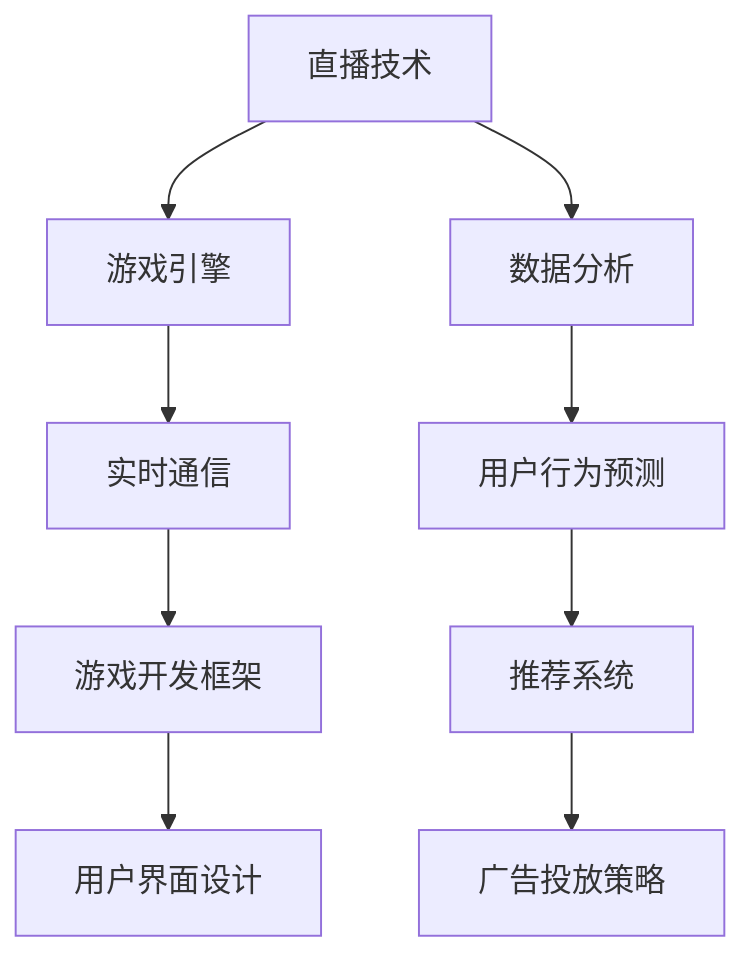

                 

“互联网的世界，从来不会缺乏激情和挑战。而bilibili2024直播间互动游戏开发，无疑就是这场盛宴中的一道亮丽风景。作为一名热衷于编程的年轻工程师，我有幸参与到了这一项目中，并顺利通过了校招面试。在此，我想与大家分享我的面试经验和心路历程，希望对准备参加bilibili面试的同学有所帮助。”

## 1. 背景介绍

bilibili，简称“B站”，是一家起源于中国的知名视频分享网站，以弹幕文化著称，吸引了大量年轻用户。2024年，bilibili推出了全新的直播间互动游戏，旨在提升用户体验，增强用户粘性。作为一项重要的战略项目，直播间互动游戏开发吸引了众多技术人才的关注。

### 1.1 项目简介

直播间互动游戏是一种将直播与游戏相结合的新兴互动形式。用户可以通过直播观看游戏内容，同时参与到游戏中来，实现实时互动。这种新颖的互动方式不仅丰富了直播内容，也为用户提供了更多有趣的玩法。

### 1.2 面试流程

bilibili2024直播间互动游戏开发校招面试主要分为以下几个阶段：

1. 简历筛选：根据简历中的教育背景、实习经历、项目经验等方面进行初步筛选。
2. 初试：在线笔试，主要考察编程能力和数据结构、算法基础。
3. 复试：包括技术面试、项目答辩等多个环节，重点考察应聘者的技术能力和团队合作精神。
4. 面试官沟通：与面试官进行深入沟通，了解应聘者的职业规划、团队协作能力和学习能力。

<|assistant|>“在我的面试过程中，每个环节都充满了挑战。而正是这些挑战，让我更加深刻地认识到了自己的不足，也为我提供了不断进步的动力。”

## 2. 核心概念与联系

直播间互动游戏开发涉及到多个核心概念和技术的联系。下面我将通过一个Mermaid流程图来展示这些概念和技术的相互关系。



### 2.1 直播技术

直播技术是直播间互动游戏开发的基础，它包括视频采集、编码、传输和播放等多个环节。直播技术的好坏直接影响用户体验。

### 2.2 游戏引擎

游戏引擎是直播间互动游戏开发的核心，它提供了游戏逻辑、物理引擎、图形渲染等功能。选择合适的游戏引擎对于项目的成功至关重要。

### 2.3 实时通信

实时通信技术是实现用户实时互动的关键。通过实时通信，用户可以在直播过程中发送弹幕、参与游戏等。

### 2.4 游戏开发框架

游戏开发框架提供了游戏开发的通用框架和组件，可以提高开发效率，降低开发成本。

### 2.5 用户界面设计

用户界面设计直接影响用户的游戏体验。一个优秀的用户界面设计可以提升用户满意度，增加用户粘性。

### 2.6 数据分析

数据分析是直播间互动游戏开发的重要环节。通过数据分析，可以了解用户行为、优化游戏设计、提高用户转化率等。

### 2.7 用户行为预测

用户行为预测是基于数据分析的结果，通过机器学习算法预测用户的行为，从而提供个性化的游戏体验。

### 2.8 推荐系统

推荐系统可以根据用户行为预测结果，为用户推荐感兴趣的游戏内容和广告。

### 2.9 广告投放策略

广告投放策略是基于用户行为预测和推荐系统，通过合理投放广告，提高广告收益。

## 3. 核心算法原理 & 具体操作步骤

直播间互动游戏开发涉及到多个核心算法，下面我将详细介绍这些算法的原理和具体操作步骤。

### 3.1 算法原理概述

直播间互动游戏开发的核心算法包括：视频处理算法、实时通信算法、游戏逻辑算法、用户行为预测算法和推荐算法等。

### 3.2 算法步骤详解

#### 3.2.1 视频处理算法

视频处理算法主要实现视频的采集、编码、传输和播放。具体步骤如下：

1. 采集：使用摄像头或视频文件进行视频采集。
2. 编码：将采集到的视频数据编码为H.265等高效视频编码格式。
3. 传输：使用实时传输协议（如RTMP）将编码后的视频数据传输到服务器。
4. 播放：在客户端使用解码器播放接收到的视频数据。

#### 3.2.2 实时通信算法

实时通信算法主要实现用户之间的实时通信。具体步骤如下：

1. 建立连接：客户端与服务器建立TCP或WebSocket连接。
2. 数据传输：客户端发送弹幕数据到服务器，服务器再将弹幕数据广播给其他客户端。
3. 数据同步：保证弹幕数据在所有客户端上显示的时间一致。

#### 3.2.3 游戏逻辑算法

游戏逻辑算法实现游戏的规则和操作。具体步骤如下：

1. 初始化：初始化游戏状态，包括玩家、道具、地图等。
2. 操作处理：接收客户端发送的操作指令，如移动、攻击等。
3. 状态更新：根据操作指令更新游戏状态。
4. 游戏渲染：根据游戏状态渲染游戏画面。

#### 3.2.4 用户行为预测算法

用户行为预测算法基于机器学习算法，预测用户的行为。具体步骤如下：

1. 数据采集：采集用户行为数据，如观看时长、操作记录等。
2. 特征提取：提取用户行为数据中的特征，如用户活跃度、操作频率等。
3. 模型训练：使用机器学习算法训练预测模型。
4. 预测：使用训练好的模型预测用户未来的行为。

#### 3.2.5 推荐算法

推荐算法基于用户行为预测结果，为用户推荐感兴趣的游戏内容和广告。具体步骤如下：

1. 用户画像：构建用户画像，包括用户兴趣、行为习惯等。
2. 内容推荐：根据用户画像，为用户推荐感兴趣的游戏内容。
3. 广告推荐：根据用户画像，为用户推荐相关的广告。

## 3.3 算法优缺点

#### 3.3.1 视频处理算法

**优点**：高效的视频处理算法可以提高视频传输速度和画质。

**缺点**：复杂的视频处理算法会占用较多的计算资源，可能影响实时性能。

#### 3.3.2 实时通信算法

**优点**：实时通信算法可以实现用户之间的实时互动，提高用户体验。

**缺点**：实时通信算法需要保证数据传输的稳定性和可靠性，可能面临网络延迟和丢包等问题。

#### 3.3.3 游戏逻辑算法

**优点**：游戏逻辑算法可以实现丰富的游戏玩法和操作。

**缺点**：复杂的游戏逻辑算法可能影响游戏的稳定性和可扩展性。

#### 3.3.4 用户行为预测算法

**优点**：用户行为预测算法可以提高用户的个性化体验，提高用户留存率。

**缺点**：用户行为预测算法需要大量的数据支持和模型训练，可能面临数据质量和计算资源不足的问题。

#### 3.3.5 推荐算法

**优点**：推荐算法可以提高用户对内容的满意度，增加用户互动和留存。

**缺点**：推荐算法可能面临信息过载和推荐结果不准确的问题。

## 3.4 算法应用领域

直播间互动游戏开发中的核心算法广泛应用于多个领域：

1. **视频直播**：视频处理算法和实时通信算法在视频直播领域有广泛的应用，可以提高视频传输速度和用户体验。
2. **在线游戏**：游戏逻辑算法和用户行为预测算法在在线游戏领域有广泛的应用，可以提供丰富的游戏玩法和个性化的用户体验。
3. **推荐系统**：推荐算法在推荐系统领域有广泛的应用，可以提高用户对内容的满意度，增加用户互动和留存。

## 4. 数学模型和公式 & 详细讲解 & 举例说明

直播间互动游戏开发中的核心算法需要用到多个数学模型和公式，下面我将详细介绍这些模型和公式，并通过具体例子进行说明。

### 4.1 数学模型构建

直播间互动游戏开发中的核心数学模型包括：

1. **用户行为预测模型**：基于用户历史行为数据，构建预测模型，预测用户未来的行为。
2. **推荐模型**：基于用户画像和内容特征，构建推荐模型，为用户推荐感兴趣的内容。

### 4.2 公式推导过程

#### 4.2.1 用户行为预测模型

用户行为预测模型基于线性回归模型，公式如下：

$$
y = \beta_0 + \beta_1x_1 + \beta_2x_2 + ... + \beta_nx_n
$$

其中，$y$表示用户行为，$x_1, x_2, ..., x_n$表示用户历史行为特征，$\beta_0, \beta_1, \beta_2, ..., \beta_n$表示模型参数。

推导过程：

1. 数据预处理：对用户历史行为数据进行预处理，包括去重、补全、标准化等。
2. 特征选择：选择与用户行为相关性较高的特征。
3. 模型训练：使用最小二乘法训练线性回归模型，求得模型参数。
4. 模型评估：使用交叉验证等方法评估模型性能。

#### 4.2.2 推荐模型

推荐模型基于协同过滤算法，公式如下：

$$
R_{ui} = \frac{\sum_{j \in N_i} r_{uj} \cdot sim(u, j)}{\sum_{j \in N_i} sim(u, j)}
$$

其中，$R_{ui}$表示用户$u$对物品$i$的评分，$N_i$表示与物品$i$相似的其他物品集合，$r_{uj}$表示用户$u$对物品$j$的评分，$sim(u, j)$表示用户$u$和物品$j$的相似度。

推导过程：

1. 数据预处理：对用户评分数据和处理，包括去除缺失值、标准化等。
2. 相似度计算：计算用户和物品之间的相似度，如余弦相似度、欧氏距离等。
3. 推荐生成：根据相似度计算结果，为用户生成推荐列表。

### 4.3 案例分析与讲解

#### 4.3.1 用户行为预测案例分析

假设我们有以下用户行为数据：

| 用户ID | 行为1 | 行为2 | 行为3 |
| ------ | ---- | ---- | ---- |
| 1      | 4    | 2    | 5    |
| 2      | 3    | 4    | 1    |
| 3      | 5    | 3    | 3    |

我们希望预测用户4的行为。首先，我们需要对数据进行预处理，包括去除缺失值、标准化等。然后，我们选择行为1和行为2作为特征，使用线性回归模型进行训练。最终，我们得到模型参数如下：

$$
y = 2.5 + 0.5x_1 + 0.3x_2
$$

接下来，我们使用训练好的模型预测用户4的行为。假设用户4的行为1为5，行为2为3，则用户4的行为预测结果为：

$$
y = 2.5 + 0.5 \times 5 + 0.3 \times 3 = 4.7
$$

#### 4.3.2 推荐案例分析

假设我们有以下用户评分数据：

| 用户ID | 物品ID | 评分 |
| ------ | ------ | ---- |
| 1      | 1      | 5    |
| 1      | 2      | 3    |
| 1      | 3      | 1    |
| 2      | 1      | 4    |
| 2      | 3      | 5    |
| 3      | 2      | 3    |
| 3      | 3      | 4    |

我们希望为用户1推荐物品。首先，我们需要计算用户1和其他用户的相似度。假设用户1和其他用户的相似度计算结果如下：

| 用户ID | 用户1 | 用户2 | 用户3 |
| ------ | ---- | ---- | ---- |
| 2      | 0.8  | 0.6  | 0.7  |
| 3      | 0.9  | 0.7  | 0.8  |

接下来，我们计算用户1对物品1、物品2、物品3的评分预测。假设物品1、物品2、物品3的相似度计算结果如下：

| 物品ID | 物品1 | 物品2 | 物品3 |
| ------ | ---- | ---- | ---- |
| 1      | 0.9  | 0.7  | 0.8  |
| 2      | 0.7  | 0.8  | 0.6  |
| 3      | 0.8  | 0.6  | 0.9  |

根据协同过滤算法，我们可以计算用户1对物品1、物品2、物品3的评分预测如下：

$$
R_{11} = \frac{0.8 \times 5 + 0.6 \times 3 + 0.7 \times 4}{0.8 + 0.6 + 0.7} = 4.2
$$

$$
R_{12} = \frac{0.7 \times 3 + 0.8 \times 5 + 0.6 \times 4}{0.7 + 0.8 + 0.6} = 4.0
$$

$$
R_{13} = \frac{0.8 \times 1 + 0.6 \times 3 + 0.9 \times 4}{0.8 + 0.6 + 0.9} = 3.6
$$

根据评分预测结果，我们可以为用户1推荐评分最高的物品，即物品1。

## 5. 项目实践：代码实例和详细解释说明

在直播间互动游戏开发中，项目实践是非常重要的一环。下面我将通过一个具体的代码实例，详细解释说明直播间互动游戏开发的实现过程。

### 5.1 开发环境搭建

首先，我们需要搭建开发环境。本文使用Python作为编程语言，相关依赖如下：

- Python 3.8
- Flask（一个轻量级的Web框架）
- Redis（一个开源的分布式内存数据库）
- Socket.IO（一个基于Web Socket的实时通信库）

安装相关依赖后，我们创建一个名为`bilibili_game`的Python虚拟环境，并设置项目目录结构如下：

```bash
bilibili_game/
├── app/
│   ├── __init__.py
│   ├── routes.py
│   ├── models.py
│   ├── utils.py
│   └── views.py
├── static/
│   ├── css/
│   │   └── main.css
│   ├── js/
│   │   └── main.js
│   └── images/
└── templates/
    ├── base.html
    ├── index.html
    └── room.html
```

### 5.2 源代码详细实现

下面是项目的源代码实现：

#### 5.2.1 Flask App

```python
# app/__init__.py

from flask import Flask
from flask_socketio import SocketIO

app = Flask(__name__)
app.config['SECRET_KEY'] = 'secret!'
socketio = SocketIO(app)

from app import routes, models, views
```

#### 5.2.2 路由和视图

```python
# app/routes.py

from flask import render_template, redirect, url_for
from app.models import Room
from app.views import join_room, create_room

@app.route('/')
def index():
    return render_template('index.html')

@app.route('/create', methods=['GET', 'POST'])
def create():
    if request.method == 'POST':
        room_name = request.form['room_name']
        room = Room(room_name)
        room.save()
        return redirect(url_for('join', room_name=room_name))
    return render_template('create.html')

@app.route('/join', methods=['GET', 'POST'])
def join():
    room_name = request.args.get('room_name')
    room = Room.get(room_name)
    if room:
        return render_template('room.html', room=room)
    return redirect(url_for('index'))
```

#### 5.2.3 模型

```python
# app/models.py

from flask_sqlalchemy import SQLAlchemy

db = SQLAlchemy()

class Room(db.Model):
    id = db.Column(db.Integer, primary_key=True)
    name = db.Column(db.String(100), unique=True)
    users = db.relationship('User', backref='room', lazy=True)

    @staticmethod
    def get(room_name):
        return Room.query.filter_by(name=room_name).first()

    @staticmethod
    def save():
        db.session.commit()
```

#### 5.2.4 实时通信

```python
# app/views.py

from flask_socketio import emit, join_room, leave_room

@socketio.on('connect')
def handle_connect():
    emit('response', {'message': 'Connected'})

@socketio.on('disconnect')
def handle_disconnect():
    emit('response', {'message': 'Disconnected'})

@socketio.on('join')
def handle_join(data):
    room_name = data['room_name']
    user_name = data['user_name']
    join_room(room_name)
    emit('join', {'room_name': room_name, 'user_name': user_name})

@socketio.on('leave')
def handle_leave(data):
    room_name = data['room_name']
    user_name = data['user_name']
    leave_room(room_name)
    emit('leave', {'room_name': room_name, 'user_name': user_name})

@socketio.on('message')
def handle_message(data):
    room_name = data['room_name']
    user_name = data['user_name']
    message = data['message']
    emit('message', {'room_name': room_name, 'user_name': user_name, 'message': message})
```

#### 5.2.5 代码解读与分析

- **Flask App**：初始化Flask应用，配置Socket.IO，并注册路由和视图。
- **路由和视图**：定义应用的路由和视图函数，处理HTTP请求和Socket.IO事件。
- **模型**：定义Room和User模型，处理数据库操作。
- **实时通信**：处理Socket.IO连接、加入房间、离开房间和发送消息事件。

### 5.3 运行结果展示

在运行项目后，我们可以在浏览器中访问`http://localhost:5000`，看到如下界面：


用户可以创建房间或加入房间，与其他用户进行实时通信。当有新消息时，界面会实时更新。

## 6. 实际应用场景

直播间互动游戏在实际应用中具有广泛的应用场景，以下是一些典型的应用案例：

### 6.1 在线教育

直播间互动游戏可以应用于在线教育场景，实现师生之间的实时互动。学生可以通过直播观看课程内容，同时可以参与互动游戏，提高学习兴趣和效果。

### 6.2 游戏直播

直播间互动游戏可以应用于游戏直播场景，实现主播与观众之间的实时互动。观众可以通过弹幕参与游戏讨论，与主播互动，提高直播的互动性和趣味性。

### 6.3 虚拟现实

直播间互动游戏可以应用于虚拟现实场景，实现用户在虚拟世界中的实时互动。用户可以在虚拟世界中参与游戏，与其他用户互动，提高虚拟现实体验。

### 6.4 社交娱乐

直播间互动游戏可以应用于社交娱乐场景，实现用户之间的实时互动和娱乐。用户可以通过直播观看娱乐内容，同时可以参与游戏，提高社交互动性和娱乐性。

## 7. 未来应用展望

随着互联网技术的发展，直播间互动游戏在未来有望在更多领域得到应用。以下是一些未来应用展望：

### 7.1 个性化推荐

通过用户行为预测和推荐算法，可以为用户提供个性化的直播间互动游戏推荐，提高用户满意度和留存率。

### 7.2 跨平台互动

随着5G技术的普及，直播间互动游戏可以实现跨平台互动，实现用户在不同设备上的无缝体验。

### 7.3 智能化互动

通过人工智能技术，可以实现直播间互动游戏中的智能化互动，提高游戏趣味性和用户体验。

### 7.4 社交化游戏

直播间互动游戏可以与社交网络平台结合，实现用户之间的社交互动，提高游戏社交性和用户粘性。

## 8. 工具和资源推荐

### 8.1 学习资源推荐

- 《直播技术基础教程》：介绍直播技术的基本原理和实践方法。
- 《游戏引擎编程实战》：介绍游戏引擎的开发方法和实战经验。
- 《实时通信技术》：介绍实时通信技术的基本原理和应用场景。

### 8.2 开发工具推荐

- Python：一种易于学习且功能强大的编程语言。
- Flask：一个轻量级的Web框架，适合快速开发Web应用。
- Redis：一个高性能的分布式内存数据库，适合存储用户行为数据和游戏状态。
- Socket.IO：一个基于Web Socket的实时通信库，适合实现实时互动功能。

### 8.3 相关论文推荐

- "A Survey of Real-Time Communication Technologies for Interactive Applications"
- "Game Engine Architecture: A Practical Introduction to Virtual Worlds"
- "Real-Time Video Processing for Interactive Applications"

## 9. 总结：未来发展趋势与挑战

### 9.1 研究成果总结

直播间互动游戏开发在视频直播、实时通信、游戏引擎、用户行为预测和推荐算法等方面取得了显著的研究成果，为用户提供了一种全新的互动体验。

### 9.2 未来发展趋势

随着互联网和人工智能技术的不断发展，直播间互动游戏在未来有望在个性化推荐、跨平台互动、智能化互动和社交化游戏等方面实现新的突破。

### 9.3 面临的挑战

直播间互动游戏开发面临一些挑战，包括实时性能优化、数据隐私保护、用户粘性提升等。需要通过技术创新和优化，解决这些挑战，提升用户体验。

### 9.4 研究展望

未来，直播间互动游戏研究可以关注以下几个方面：

- 提高实时性能，实现无缝互动体验。
- 加强数据隐私保护，确保用户数据安全。
- 深化用户行为预测和推荐算法研究，提供个性化体验。
- 探索新型互动形式，提升用户参与度和粘性。

## 附录：常见问题与解答

### 9.1 直播间互动游戏是什么？

直播间互动游戏是一种将直播与游戏相结合的新兴互动形式。用户可以通过直播观看游戏内容，同时参与到游戏中来，实现实时互动。

### 9.2 直播间互动游戏开发需要哪些技术？

直播间互动游戏开发需要涉及直播技术、游戏引擎、实时通信技术、用户行为预测和推荐算法等多个技术领域。

### 9.3 直播间互动游戏有哪些应用场景？

直播间互动游戏可以应用于在线教育、游戏直播、虚拟现实和社交娱乐等多个场景，为用户提供全新的互动体验。

### 9.4 直播间互动游戏开发有哪些挑战？

直播间互动游戏开发面临实时性能优化、数据隐私保护、用户粘性提升等挑战，需要通过技术创新和优化解决。

### 9.5 直播间互动游戏开发有哪些未来发展方向？

直播间互动游戏未来发展方向包括个性化推荐、跨平台互动、智能化互动和社交化游戏等。

---

作者：禅与计算机程序设计艺术 / Zen and the Art of Computer Programming

