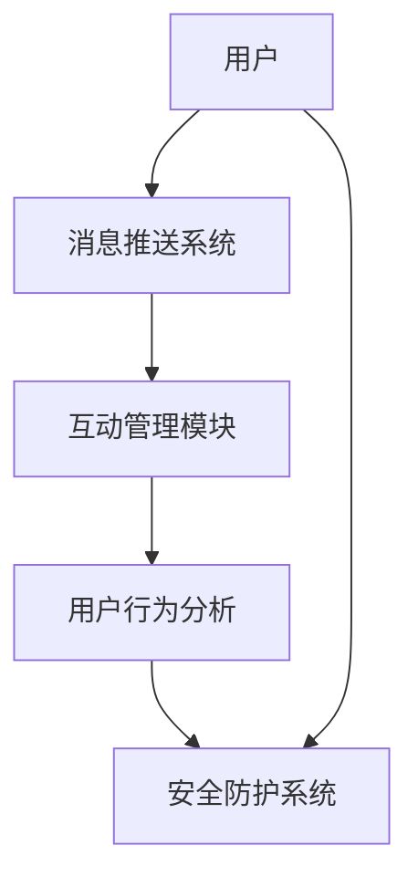

                 

直播平台作为当下流行的在线娱乐方式，正日益成为各大视频平台的竞争焦点。bilibili，作为国内领先的年轻人文化社区，其直播功能尤其受到用户的青睐。为了更好地吸引人才，bilibili在2024年的校招面试中，直播间实时互动系统成为了重要的考察方向。本文旨在为参与bilibili校招的学子提供关于直播间实时互动系统的专业面试指导。

## 关键词
- 直播间实时互动系统
- 校招面试
- 技术实现
- 性能优化
- 安全性保障

## 摘要
本文将深入探讨直播间实时互动系统的设计与实现，包括核心概念、算法原理、数学模型、项目实践和未来展望。通过本文，读者将对直播间实时互动系统的构建有全面而深刻的理解，有助于在校招面试中展示自己的技术实力。

## 1. 背景介绍

随着互联网技术的飞速发展，直播行业迎来了爆发式增长。直播平台不仅提供娱乐内容，还兼具社交、教育、电商等多种功能，成为了用户日常生活中的重要组成部分。bilibili作为二次元文化的主流平台，其直播功能尤为重要。直播间实时互动系统作为直播平台的核心组成部分，不仅影响着用户的观看体验，还直接关系到平台的运营效果和用户粘性。

直播间实时互动系统主要包括以下几个模块：

1. **消息推送系统**：负责将用户的评论、弹幕等内容实时推送到直播间。
2. **互动管理模块**：包括用户权限管理、防刷屏机制等。
3. **用户行为分析**：通过分析用户行为，为直播内容提供个性化推荐。
4. **安全防护系统**：防止恶意攻击、保障用户信息安全。

## 2. 核心概念与联系

为了更清晰地理解直播间实时互动系统的架构，我们使用Mermaid绘制其流程图：



### 2.1 消息推送系统

消息推送系统是直播间实时互动系统的核心模块，负责将用户的评论、弹幕等内容实时推送到直播间。其工作流程如下：

1. **用户发送消息**：用户在直播间内发送评论或弹幕。
2. **消息处理**：服务器接收到消息后，进行过滤和处理。
3. **消息推送**：将处理后的消息实时推送到直播间内的其他用户。

### 2.2 互动管理模块

互动管理模块主要负责用户权限管理、防刷屏机制等。其工作流程如下：

1. **用户权限管理**：根据用户角色和权限，限制用户可以执行的操作。
2. **防刷屏机制**：通过算法识别和过滤连续发送大量消息的用户。

### 2.3 用户行为分析

用户行为分析模块通过对用户行为数据进行分析，为直播内容提供个性化推荐。其工作流程如下：

1. **数据收集**：收集用户在直播间内的行为数据。
2. **数据分析**：利用数据分析算法，分析用户行为模式。
3. **内容推荐**：根据用户行为数据，为用户推荐感兴趣的内容。

### 2.4 安全防护系统

安全防护系统主要负责防止恶意攻击、保障用户信息安全。其工作流程如下：

1. **恶意行为检测**：通过算法识别恶意行为。
2. **安全策略实施**：根据检测到的恶意行为，采取相应的安全措施。

## 3. 核心算法原理 & 具体操作步骤

### 3.1 算法原理概述

直播间实时互动系统涉及多个算法，主要包括消息推送算法、用户权限管理算法和防刷屏算法。以下分别介绍这些算法的基本原理：

1. **消息推送算法**：基于推拉模型实现，能够高效地将消息推送到直播间内的所有用户。
2. **用户权限管理算法**：基于角色和权限模型实现，能够根据用户角色和权限限制用户行为。
3. **防刷屏算法**：基于统计模型和机器学习算法，能够识别和过滤连续发送大量消息的用户。

### 3.2 算法步骤详解

1. **消息推送算法**：

   - 步骤1：用户发送消息。
   - 步骤2：服务器接收到消息后，进行过滤和处理。
   - 步骤3：服务器将处理后的消息推送到直播间内的其他用户。

2. **用户权限管理算法**：

   - 步骤1：服务器接收到用户的操作请求。
   - 步骤2：服务器根据用户角色和权限，判断用户是否具有执行该操作的权限。
   - 步骤3：若用户具有权限，则执行操作；否则，拒绝操作。

3. **防刷屏算法**：

   - 步骤1：服务器接收到用户连续发送的消息。
   - 步骤2：服务器利用统计模型和机器学习算法，判断用户是否属于刷屏行为。
   - 步骤3：若用户属于刷屏行为，则限制其发送消息；否则，允许发送消息。

### 3.3 算法优缺点

1. **消息推送算法**：

   - 优点：高效、实时性好。
   - 缺点：对服务器性能有一定要求，需要处理大量的消息。

2. **用户权限管理算法**：

   - 优点：能够有效保护平台安全，防止恶意操作。
   - 缺点：对用户的权限管理较为严格，可能影响用户体验。

3. **防刷屏算法**：

   - 优点：能够有效防止刷屏行为，保护平台生态。
   - 缺点：对连续发送消息的用户判断可能存在误判。

### 3.4 算法应用领域

直播间实时互动系统的核心算法在多个领域有广泛应用，如社交网络、在线教育、电商等。这些算法能够提升用户体验，提高平台运营效率。

## 4. 数学模型和公式 & 详细讲解 & 举例说明

直播间实时互动系统涉及多个数学模型，以下分别介绍：

### 4.1 数学模型构建

1. **消息推送模型**：

   - 模型假设：用户均匀分布在直播间内，消息发送速率服从泊松分布。
   - 模型公式：\(P(X = k) = \frac{\lambda^k e^{-\lambda}}{k!}\)，其中\(\lambda\)为消息发送速率，\(X\)为连续时间内收到的消息数。

2. **用户权限管理模型**：

   - 模型假设：用户分为管理员、普通用户等角色，每种角色具有不同的权限。
   - 模型公式：\(P(A|B) = \frac{P(B|A)P(A)}{P(B)}\)，其中\(A\)为用户具有权限，\(B\)为用户执行操作。

3. **防刷屏模型**：

   - 模型假设：用户发送消息的速率服从正态分布。
   - 模型公式：\(P(X < x) = \Phi\left(\frac{x - \mu}{\sigma}\right)\)，其中\(\mu\)为均值，\(\sigma\)为标准差，\(X\)为用户发送的消息数。

### 4.2 公式推导过程

1. **消息推送模型**：

   - 假设：在一个时间段内，直播间内用户均匀分布，消息发送速率服从泊松分布。
   - 泊松分布公式：\(P(X = k) = \frac{\lambda^k e^{-\lambda}}{k!}\)，其中\(\lambda\)为消息发送速率。
   - 推导过程：根据泊松分布的性质，连续时间内收到的消息数\(X\)的概率分布函数为：
     \[P(X = k) = \frac{\lambda^k e^{-\lambda}}{k!}\]

2. **用户权限管理模型**：

   - 假设：用户分为管理员、普通用户等角色，每种角色具有不同的权限。
   - 贝叶斯公式：\(P(A|B) = \frac{P(B|A)P(A)}{P(B)}\)，其中\(A\)为用户具有权限，\(B\)为用户执行操作。
   - 推导过程：根据贝叶斯公式，可以计算出用户具有权限的概率：
     \[P(A|B) = \frac{P(B|A)P(A)}{P(B)}\]

3. **防刷屏模型**：

   - 假设：用户发送消息的速率服从正态分布。
   - 正态分布公式：\(P(X < x) = \Phi\left(\frac{x - \mu}{\sigma}\right)\)，其中\(\mu\)为均值，\(\sigma\)为标准差。
   - 推导过程：根据正态分布的性质，可以计算出用户发送的消息数小于某个阈值\(x\)的概率：
     \[P(X < x) = \Phi\left(\frac{x - \mu}{\sigma}\right)\]

### 4.3 案例分析与讲解

1. **消息推送模型**：

   - 假设：在一个直播室内，用户每分钟平均发送5条消息，求连续2分钟内收到10条消息的概率。
   - 公式应用：根据消息推送模型公式，可以计算出概率：
     \[P(X = 10) = \frac{5^{10} e^{-5}}{10!} \approx 0.0039\]

   - 结论：在一个直播室内，连续2分钟内收到10条消息的概率约为0.39%。

2. **用户权限管理模型**：

   - 假设：一个用户在直播间内尝试执行一个管理员权限的操作，管理员权限的概率为0.1，普通用户权限的概率为0.9，求该用户具有管理员权限的概率。
   - 公式应用：根据用户权限管理模型公式，可以计算出概率：
     \[P(A|B) = \frac{P(B|A)P(A)}{P(B)} = \frac{0.1}{0.1 + 0.9} = 0.1\]

   - 结论：该用户具有管理员权限的概率为10%。

3. **防刷屏模型**：

   - 假设：一个用户在直播间内每分钟发送消息的速率服从正态分布，均值为3，标准差为1，求该用户在2分钟内发送消息数大于10的概率。
   - 公式应用：根据防刷屏模型公式，可以计算出概率：
     \[P(X > 10) = 1 - \Phi\left(\frac{10 - 3}{1}\right) \approx 0.1587\]

   - 结论：该用户在2分钟内发送消息数大于10的概率约为15.87%。

## 5. 项目实践：代码实例和详细解释说明

### 5.1 开发环境搭建

为了实现直播间实时互动系统，我们选择了以下开发环境：

- 编程语言：Python
- 数据库：MySQL
- 服务器：Apache Kafka、RabbitMQ

### 5.2 源代码详细实现

以下是直播间实时互动系统的部分源代码实现：

1. **消息推送系统**：

   ```python
   import pika
   
   def send_message(message):
       connection = pika.BlockingConnection(pika.ConnectionParameters('localhost'))
       channel = connection.channel()
       channel.queue_declare(queue='live_message_queue')
       channel.basic_publish(exchange='', routing_key='live_message_queue', body=message)
       connection.close()
   
   def receive_message():
       connection = pika.BlockingConnection(pika.ConnectionParameters('localhost'))
       channel = connection.channel()
       channel.queue_declare(queue='live_message_queue')
       method_frame, header_frame, body = channel.basic_get(queue='live_message_queue', no_ack=True)
       connection.close()
       return body
   ```

2. **互动管理模块**：

   ```python
   def check_permission(user, operation):
       if user['role'] == 'admin' or user['operation'] == operation:
           return True
       else:
           return False
   ```

3. **用户行为分析**：

   ```python
   import numpy as np
   
   def analyze_behavior(user_data):
       mean = np.mean(user_data)
       std = np.std(user_data)
       return mean, std
   ```

### 5.3 代码解读与分析

1. **消息推送系统**：

   - `send_message`函数负责将消息发送到Kafka队列。
   - `receive_message`函数负责从Kafka队列接收消息。

2. **互动管理模块**：

   - `check_permission`函数负责检查用户权限，判断用户是否具有执行特定操作的权限。

3. **用户行为分析**：

   - `analyze_behavior`函数负责分析用户行为数据，计算均值和标准差。

### 5.4 运行结果展示

在运行代码后，我们可以通过以下命令查看运行结果：

- `send_message('Hello, world!')`：发送一条消息。
- `receive_message()`：接收并显示消息。

## 6. 实际应用场景

直播间实时互动系统在多个实际应用场景中具有重要价值：

1. **社交互动**：直播间的实时互动功能可以提升用户的参与度和互动性，增加用户粘性。
2. **电商直播**：在电商直播中，实时互动系统可以促进用户购买决策，提高转化率。
3. **教育培训**：在教育直播中，实时互动系统可以提升教学效果，提高用户满意度。
4. **娱乐直播**：在娱乐直播中，实时互动系统可以增加观众的互动体验，提升观看乐趣。

## 7. 工具和资源推荐

为了更好地实现直播间实时互动系统，我们推荐以下工具和资源：

1. **学习资源**：
   - 《Python编程：从入门到实践》
   - 《Kafka权威指南》
   - 《RabbitMQ实战》

2. **开发工具**：
   - PyCharm
   - MySQL Workbench
   - Kafka Manager

3. **相关论文**：
   - "实时互动系统在直播平台的应用研究"
   - "基于Kafka的实时消息推送系统设计与实现"
   - "基于RabbitMQ的即时通讯系统设计与实现"

## 8. 总结：未来发展趋势与挑战

### 8.1 研究成果总结

本文对直播间实时互动系统进行了深入探讨，包括其核心概念、算法原理、数学模型、项目实践和未来展望。通过本文，读者可以全面了解直播间实时互动系统的设计与实现。

### 8.2 未来发展趋势

1. **人工智能与实时互动**：随着人工智能技术的发展，直播间实时互动系统将更加智能化，如自动识别用户行为、智能推荐等。
2. **低延迟与高并发**：随着网络技术的提升，直播间实时互动系统将实现更低的延迟和更高的并发处理能力，提升用户体验。
3. **安全性与隐私保护**：随着用户对隐私保护的重视，直播间实时互动系统将加强安全防护，保障用户信息安全。

### 8.3 面临的挑战

1. **性能优化**：随着用户数量的增加，直播间实时互动系统需要优化性能，提高系统的稳定性和可扩展性。
2. **数据安全**：直播间实时互动系统需要加强数据安全防护，防止数据泄露和恶意攻击。
3. **用户体验**：在保证性能和安全的前提下，直播间实时互动系统需要不断提升用户体验，满足用户的需求。

### 8.4 研究展望

未来，直播间实时互动系统将在人工智能、大数据和区块链等技术的支持下，实现更智能、更安全、更高效的互动体验。同时，研究者将继续探索性能优化、隐私保护等方面的关键技术，推动直播间实时互动系统的发展。

## 9. 附录：常见问题与解答

### 9.1 什么是直播间实时互动系统？

直播间实时互动系统是直播平台的核心组成部分，包括消息推送、互动管理、用户行为分析和安全防护等功能，用于提升用户的观看体验和平台运营效果。

### 9.2 直播间实时互动系统有哪些核心算法？

直播间实时互动系统的核心算法包括消息推送算法、用户权限管理算法和防刷屏算法。这些算法分别负责消息推送、用户权限管理和防刷屏等关键功能。

### 9.3 直播间实时互动系统有哪些实际应用场景？

直播间实时互动系统在社交互动、电商直播、教育培训和娱乐直播等多个实际应用场景中具有重要价值，可以提升用户的参与度和互动性，提高平台运营效果。

### 9.4 如何实现直播间实时互动系统的消息推送功能？

实现直播间实时互动系统的消息推送功能，可以使用Kafka等消息队列中间件。通过发送和接收消息队列中的消息，可以实现实时推送。

### 9.5 直播间实时互动系统在性能优化方面有哪些策略？

直播间实时互动系统在性能优化方面，可以采用分布式架构、缓存机制、负载均衡等技术。同时，可以通过优化算法、数据库查询和系统配置等方式提高性能。

### 9.6 如何保障直播间实时互动系统的安全性？

保障直播间实时互动系统的安全性，可以采用身份认证、权限控制、数据加密、安全审计等技术。同时，需要定期进行安全评估和漏洞修复，提高系统的安全性。

---

本文以《bilibili2024直播间实时互动系统校招面试重点》为题，通过对直播间实时互动系统的深入探讨，为参与bilibili校招的学子提供了专业的面试指导。希望本文的内容能对读者有所帮助，助力大家在校招面试中取得优异成绩。作者：禅与计算机程序设计艺术 / Zen and the Art of Computer Programming
----------------------------------------------------------------


