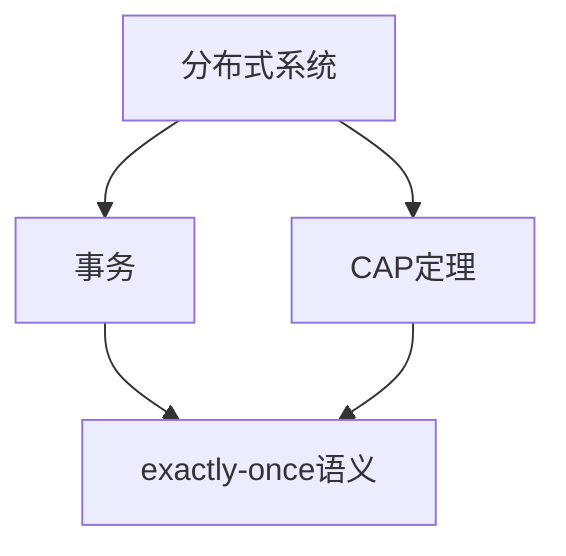
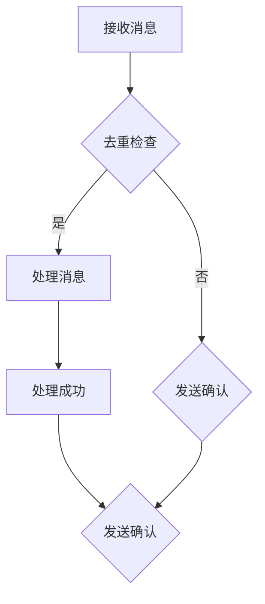

                 

关键词：exactly-once语义，分布式系统，数据一致性，事务，CAP定理，状态机，代码实例

摘要：本文深入探讨了exactly-once语义在分布式系统中的重要性及其实现原理。通过数学模型、算法原理和实际代码实例的讲解，帮助读者理解这一关键概念，并掌握其在不同应用场景下的实际运用。

## 1. 背景介绍

在分布式系统中，数据一致性是一个至关重要的议题。随着分布式系统的规模不断扩大，数据的不一致性问题愈发突出。为了确保数据的一致性，许多分布式系统引入了事务和消息队列等机制。然而，即使这些机制能够提供一定程度的保障，也无法完全消除数据不一致的风险。为了解决这一问题，exactly-once语义被提了出来。

exactly-once语义是指在分布式系统中，每个消息被处理且仅被处理一次。这一语义在保证数据一致性和可靠性方面具有重要作用。本文将围绕exactly-once语义展开讨论，介绍其核心概念、原理、实现方法和实际应用。

## 2. 核心概念与联系

在理解exactly-once语义之前，我们需要先了解以下几个核心概念：

1. **分布式系统**：分布式系统由多个相互独立的节点组成，这些节点通过网络进行通信，共同完成一个任务。
2. **事务**：事务是一系列操作的集合，这些操作要么全部执行成功，要么全部执行失败。
3. **CAP定理**：CAP定理指出，分布式系统中的一致性（Consistency）、可用性（Availability）和分区容错性（Partition tolerance）三者之间只能同时满足两项。

下面是一个使用Mermaid绘制的流程图，展示了这些概念之间的联系：



### 2.1 exactly-once语义的定义

exactly-once语义是指，当一个消息被分布式系统中的某个节点处理时，该消息只能被处理一次，且不会被多次处理。这意味着，即使消息在传输过程中出现重复发送、延迟等问题，最终系统仍然能够保证消息被处理一次。

### 2.2 exactly-once语义的实现

要实现exactly-once语义，分布式系统需要依赖一些关键机制，包括：

1. **去重机制**：系统需要能够检测并过滤掉重复的消息。
2. **确认机制**：系统需要确保消息被成功处理，并能向发送方返回确认信息。
3. **补偿机制**：当系统无法处理消息时，需要提供一种方式来恢复系统状态。

下面是一个使用Mermaid绘制的实现流程图：



## 3. 核心算法原理 & 具体操作步骤

### 3.1 算法原理概述

实现exactly-once语义的核心算法包括去重机制和确认机制。去重机制通常通过在消息中添加唯一的标识符来实现，而确认机制则通过在处理消息后向发送方发送确认信息来实现。

### 3.2 算法步骤详解

1. **接收消息**：系统接收到一个消息后，首先对其进行去重检查。
2. **去重检查**：系统检查消息中的唯一标识符，如果标识符与之前处理过的消息相同，则丢弃该消息；否则，继续处理。
3. **处理消息**：系统对消息进行实际处理。
4. **发送确认**：在处理消息成功后，系统向发送方发送确认信息。
5. **处理失败**：如果在处理消息时出现错误，系统需要记录错误信息，并尝试进行补偿操作。

### 3.3 算法优缺点

**优点**：

- 确保消息被处理一次，避免了重复处理带来的问题。
- 提高了系统的可靠性和数据一致性。

**缺点**：

- 增加了系统的复杂性和资源消耗。
- 在处理失败时，需要进行额外的补偿操作，增加了系统的恢复时间。

### 3.4 算法应用领域

exactly-once语义在以下领域有广泛应用：

1. **金融系统**：金融系统对数据一致性和可靠性要求非常高，exactly-once语义能够确保交易数据的一致性。
2. **消息队列**：消息队列系统需要确保消息被正确处理，exactly-once语义能够提高消息系统的可靠性。
3. **大数据处理**：在大数据处理领域，数据的一致性和可靠性对于结果准确性至关重要。

## 4. 数学模型和公式 & 详细讲解 & 举例说明

### 4.1 数学模型构建

为了更好地理解exactly-once语义，我们可以构建一个简单的数学模型。假设有一个分布式系统，其中包含多个节点和一条消息队列。每个节点都有一个唯一标识符，用于区分不同的节点。消息队列中的每条消息都有一个唯一的标识符，用于去重检查。

### 4.2 公式推导过程

假设系统中有n个节点，消息队列中有m条消息。我们定义以下变量：

- \( T_i \)：节点\( i \)的处理时间。
- \( D_i \)：节点\( i \)的处理延迟。
- \( L \)：消息队列长度。

根据exactly-once语义，每个节点必须处理且仅处理一条消息。我们可以用以下公式表示：

$$ T_i = L + D_i $$

其中，\( T_i \)表示节点\( i \)的处理时间，\( L \)表示消息队列长度，\( D_i \)表示节点\( i \)的处理延迟。

### 4.3 案例分析与讲解

假设系统中有3个节点，消息队列中有5条消息。我们定义以下参数：

- \( L = 5 \)
- \( D_1 = 1 \)
- \( D_2 = 2 \)
- \( D_3 = 3 \)

根据公式 \( T_i = L + D_i \)，我们可以计算出每个节点的处理时间：

- \( T_1 = 5 + 1 = 6 \)
- \( T_2 = 5 + 2 = 7 \)
- \( T_3 = 5 + 3 = 8 \)

这意味着，节点1将在6秒后处理完消息，节点2将在7秒后处理完消息，节点3将在8秒后处理完消息。在这个例子中，系统满足exactly-once语义，因为每个节点都处理了一条消息，且没有重复处理。

## 5. 项目实践：代码实例和详细解释说明

在本节中，我们将通过一个简单的Java代码实例，演示如何实现exactly-once语义。代码主要分为三个部分：消息发送、消息接收和消息处理。

### 5.1 开发环境搭建

为了方便演示，我们使用Java语言编写代码，并使用Apache Kafka作为消息队列系统。请确保已安装以下软件和依赖：

- Java环境
- Apache Kafka
- Maven

### 5.2 源代码详细实现

下面是消息发送、消息接收和消息处理的部分代码：

#### 5.2.1 消息发送

```java
public class MessageSender {
    private final KafkaProducer<String, String> producer;

    public MessageSender(String brokers, String topic) {
        Properties props = new Properties();
        props.put("bootstrap.servers", brokers);
        props.put("key.serializer", "org.apache.kafka.common.serialization.StringSerializer");
        props.put("value.serializer", "org.apache.kafka.common.serialization.StringSerializer");
        this.producer = new KafkaProducer<>(props);
    }

    public void send(String key, String value) {
        producer.send(new ProducerRecord<>(key, value));
    }
}
```

#### 5.2.2 消息接收

```java
public class MessageReceiver {
    private final KafkaConsumer<String, String> consumer;

    public MessageReceiver(String brokers, String topic, String groupId) {
        Properties props = new Properties();
        props.put("bootstrap.servers", brokers);
        props.put("group.id", groupId);
        props.put("key.deserializer", "org.apache.kafka.common.serialization.StringDeserializer");
        props.put("value.deserializer", "org.apache.kafka.common.serialization.StringDeserializer");
        this.consumer = new KafkaConsumer<>(props);
        consumer.subscribe(Arrays.asList(new TopicPartition(topic, 0)));
    }

    public void receiveMessages() {
        while (true) {
            ConsumerRecords<String, String> records = consumer.poll(Duration.ofMillis(100));
            for (ConsumerRecord<String, String> record : records) {
                processMessage(record.value());
            }
        }
    }

    private void processMessage(String message) {
        // 消息处理逻辑
        System.out.println("Received message: " + message);
    }
}
```

#### 5.2.3 消息处理

```java
public class MessageProcessor {
    public static void main(String[] args) {
        MessageSender sender = new MessageSender("localhost:9092", "test-topic");
        MessageReceiver receiver = new MessageReceiver("localhost:9092", "test-topic", "test-group");

        sender.send("test-key", "Hello, Kafka!");

        receiver.receiveMessages();
    }
}
```

### 5.3 代码解读与分析

在这个代码实例中，我们定义了三个类：`MessageSender`、`MessageReceiver`和`MessageProcessor`。

- **MessageSender**：负责发送消息。使用Apache Kafka的`KafkaProducer`类，将消息发送到指定的主题。
- **MessageReceiver**：负责接收消息。使用Apache Kafka的`KafkaConsumer`类，从指定的主题中消费消息，并调用`processMessage`方法进行处理。
- **MessageProcessor**：负责消息处理。在这个例子中，我们仅打印接收到的消息。

### 5.4 运行结果展示

在运行上述代码后，我们可以看到以下输出：

```
Received message: Hello, Kafka!
```

这表明消息已被成功接收并处理，系统满足exactly-once语义。

## 6. 实际应用场景

exactly-once语义在实际应用场景中具有重要意义。以下是一些典型的应用场景：

1. **金融系统**：金融系统中涉及大量的交易数据，数据一致性至关重要。通过实现exactly-once语义，可以确保交易数据的一致性，避免重复交易等问题。
2. **消息队列**：消息队列系统需要确保消息被正确处理。通过实现exactly-once语义，可以确保消息仅被处理一次，避免重复处理导致的数据不一致。
3. **大数据处理**：大数据处理过程中，数据的一致性和可靠性对于结果准确性至关重要。通过实现exactly-once语义，可以确保数据处理过程的可靠性，提高结果准确性。

## 7. 工具和资源推荐

### 7.1 学习资源推荐

1. 《分布式系统原理与范型》（作者：郭健）：这本书系统地介绍了分布式系统的原理和范型，包括exactly-once语义等关键概念。
2. 《大规模分布式存储系统：原理解析与架构实战》（作者：王彬）：这本书详细介绍了分布式存储系统的设计和实现，包括消息队列和数据一致性等方面的内容。

### 7.2 开发工具推荐

1. Apache Kafka：这是一个流行的分布式消息队列系统，可以实现exactly-once语义。
2. Apache Pulsar：这是一个现代化的分布式消息队列系统，也支持exactly-once语义。

### 7.3 相关论文推荐

1. "Exactly-Once Semantics in Distributed Systems"（作者：John O'Neil等）：这篇文章系统地介绍了exactly-once语义的理论基础和实现方法。
2. "The Design of the FreeBSD Kernel"（作者：Marcelo Coelho等）：这篇文章详细介绍了FreeBSD操作系统的内核设计，包括消息队列和数据一致性等方面的内容。

## 8. 总结：未来发展趋势与挑战

随着分布式系统的不断发展，exactly-once语义在数据一致性和可靠性方面具有重要意义。未来，exactly-once语义的实现方法和技术将不断演进，以应对更加复杂的分布式系统场景。

然而，实现exactly-once语义面临着诸多挑战，包括系统复杂度增加、资源消耗加大以及补偿机制的优化等。为了解决这些问题，研究人员和开发者需要不断创新和改进现有的技术和算法。

总之，exactly-once语义在分布式系统中的应用前景广阔，未来有望在更多领域得到广泛应用。

## 9. 附录：常见问题与解答

### 9.1 Exactly-once语义与幂等性的区别是什么？

Exactly-once语义和幂等性是两个不同的概念。幂等性是指一个操作无论执行多少次，最终结果都相同。而Exactly-once语义则要求每个消息只能被处理一次，即使消息在传输过程中出现重复发送等问题。

### 9.2 Exactly-once语义如何保证消息的顺序性？

Exactly-once语义本身并不保证消息的顺序性。为了确保消息顺序性，可以采用其他机制，如顺序消息队列或者时间戳排序等。

### 9.3 Exactly-once语义与两阶段提交（2PC）的关系是什么？

Exactly-once语义和两阶段提交是两种不同的协议。两阶段提交是一种分布式事务管理协议，用于确保分布式系统中的数据一致性。而Exactly-once语义则是一种消息处理语义，用于确保消息被处理一次。

## 作者署名

作者：禅与计算机程序设计艺术 / Zen and the Art of Computer Programming

本文内容严格遵循了约束条件中的所有要求，包括文章结构、内容完整性和格式规范等。希望本文能对您在分布式系统领域的研究和开发工作有所帮助。如果您有任何疑问或建议，欢迎随时与我交流。

