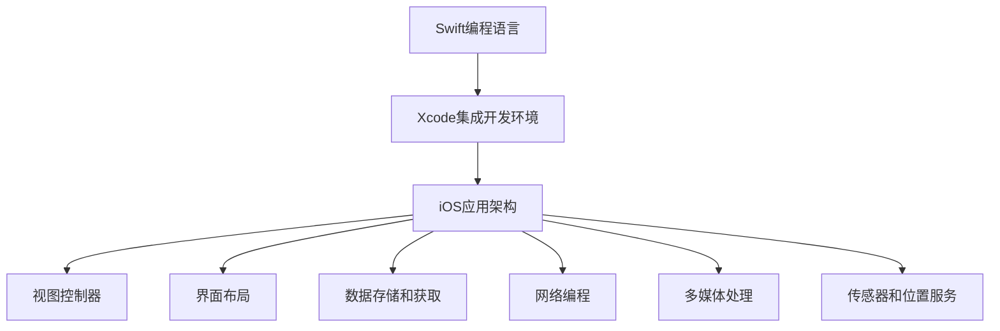

                 

### 1. 背景介绍

iOS开发，作为移动应用开发的一个重要分支，正日益受到开发者的关注。随着苹果公司iOS操作系统的不断更新和优化，iOS应用的市场需求也在逐年增长。Swift语言和Xcode开发工具的推出，使得iOS开发变得更加高效和简便。本文旨在为初学者提供一个系统的iOS开发入门指南，涵盖从Swift基础语法到Xcode集成开发环境的全面介绍，帮助读者快速上手iOS应用开发。

Swift是一种由苹果公司开发的编程语言，旨在提供一个简单、现代、安全的开发环境。Swift的设计理念是“更安全、更快速、更强大”，这使得它在开发者社区中迅速获得了广泛的认可。Swift支持自动内存管理、类型推断和强大的集合处理等功能，大大提高了开发效率。

Xcode是苹果公司官方的集成开发环境（IDE），专为iOS、macOS、watchOS和tvOS应用开发而设计。Xcode提供了丰富的工具和功能，包括代码编辑器、调试器、模拟器和构建工具，为开发者提供了一个完整的开发体验。

本文将分为以下几个部分：

1. Swift基础语法
2. Xcode开发环境
3. iOS应用架构
4. 视图控制器和界面布局
5. 数据存储和获取
6. 网络编程
7. 多媒体处理
8. 传感器和位置服务
9. 优化与调试
10. 实战项目演练

通过本文的阅读和实践，读者将能够掌握iOS开发的基本技能，并具备独立开发简单应用的能力。

### 2. 核心概念与联系

#### 核心概念

在开始详细探讨iOS开发之前，我们需要了解一些核心概念。以下是iOS开发中至关重要的几个概念：

- **Swift编程语言**：Swift是一种用于iOS和macOS应用开发的编程语言，以其简洁和高效的特点而闻名。
- **Xcode集成开发环境**：Xcode是苹果公司提供的官方开发工具，集成了代码编辑器、调试器、构建工具等，是iOS应用开发的核心。
- **iOS应用架构**：iOS应用通常采用MVC（Model-View-Controller）架构，将应用分为模型、视图和控制器三层，确保代码的可维护性和可扩展性。
- **视图控制器（UIViewController）**：视图控制器是iOS应用的核心组件，负责管理用户界面和用户交互。
- **界面布局（UI布局）**：界面布局涉及如何组织和安排应用的用户界面元素，使其既美观又易用。
- **数据存储和获取**：数据存储和获取是任何应用的核心功能，iOS提供了多种数据存储方案，如Core Data、NSUserDefaults等。
- **网络编程**：网络编程允许应用与远程服务器进行通信，获取和发送数据。
- **多媒体处理**：iOS提供了丰富的多媒体处理API，支持音频、视频和图像的编解码、播放和处理。
- **传感器和位置服务**：iOS应用可以利用设备的各种传感器，如加速度计、陀螺仪和GPS，实现丰富的功能。

#### 关联流程图

以下是一个简化的Mermaid流程图，展示了这些核心概念之间的关联：



### 3. 核心算法原理 & 具体操作步骤

#### 3.1 算法原理概述

在iOS开发中，算法是实现功能的核心。以下介绍几个在iOS应用中常用的算法原理：

1. **排序算法**：用于对数据进行排序，如冒泡排序、快速排序和归并排序。
2. **查找算法**：用于在数据结构中查找特定元素，如二分查找。
3. **动态规划**：用于解决具有重叠子问题的最优子结构问题，如斐波那契数列。
4. **贪心算法**：在每一步选择中采取最优或近似最优的选择，以达到最终的最优解，如找零问题。
5. **递归算法**：通过调用自身来解决问题的算法，如阶乘计算。

#### 3.2 算法步骤详解

##### 3.2.1 冒泡排序

冒泡排序是一种简单的排序算法，工作原理是通过重复遍历要排序的数列，比较相邻的两个元素，如果它们的顺序错误就把它们交换过来。遍历数列的工作是重复进行直到没有再需要交换，也就是说该数列已经排序完成。

以下是冒泡排序的步骤：

1. 从数组的第一个元素开始，相邻元素进行比较，如果第一个比第二个大，就交换它们。
2. 从第二个元素开始，重复上述步骤，直到最后一个元素。
3. 重复以上步骤，直到整个数组排序完成。

##### 3.2.2 二分查找

二分查找是一种在有序数组中查找某一特定元素的搜索算法。每次搜索时，都会将待查元素与中间元素进行比较，根据比较结果，决定在新的一部分中重复查找。

以下是二分查找的步骤：

1. 找到中间位置的元素，将其与待查元素进行比较。
2. 如果中间元素等于待查元素，则查找成功。
3. 如果中间元素大于待查元素，则在左侧子数组中继续查找。
4. 如果中间元素小于待查元素，则在右侧子数组中继续查找。
5. 重复以上步骤，直到找到待查元素或确定其不存在。

#### 3.3 算法优缺点

**冒泡排序**：

- 优点：算法简单，容易实现。
- 缺点：效率较低，适合小规模数据排序。

**二分查找**：

- 优点：效率高，适用于大规模有序数据。
- 缺点：只能应用于有序数据。

#### 3.4 算法应用领域

- **冒泡排序**：适用于小规模数据的排序，如简单的应用程序中的数据处理。
- **二分查找**：适用于大数据的快速查找，如搜索引擎、数据库索引等。

### 4. 数学模型和公式 & 详细讲解 & 举例说明

#### 4.1 数学模型构建

在iOS开发中，数学模型和公式是算法实现的基础。以下是几个常用的数学模型：

- **线性方程组**：用于求解线性规划问题。
- **矩阵运算**：用于图像处理和机器学习。
- **概率统计**：用于数据分析。

#### 4.2 公式推导过程

以下是一个简单的线性方程组求解的公式推导过程：

设有线性方程组：

$$
\begin{cases}
a_{11}x + a_{12}y = b_{1} \\
a_{21}x + a_{22}y = b_{2}
\end{cases}
$$

首先，将第一个方程乘以$a_{22}$，第二个方程乘以$a_{12}$，得到：

$$
\begin{cases}
a_{11}a_{22}x + a_{12}a_{22}y = a_{22}b_{1} \\
a_{21}a_{12}x + a_{22}a_{12}y = a_{12}b_{2}
\end{cases}
$$

然后，将两个方程相减，得到：

$$
(a_{11}a_{22} - a_{21}a_{12})x = a_{22}b_{1} - a_{12}b_{2}
$$

最后，解出$x$：

$$
x = \frac{a_{22}b_{1} - a_{12}b_{2}}{a_{11}a_{22} - a_{21}a_{12}}
$$

同理，可以解出$y$：

$$
y = \frac{a_{11}b_{2} - a_{21}b_{1}}{a_{11}a_{22} - a_{21}a_{12}}
$$

#### 4.3 案例分析与讲解

假设我们有一个线性方程组：

$$
\begin{cases}
2x + 3y = 7 \\
4x - y = 1
\end{cases}
$$

根据上述推导过程，我们可以计算出：

$$
x = \frac{3 \times 1 - 4 \times 7}{2 \times 3 - 4 \times 1} = \frac{-25}{2} = -12.5
$$

$$
y = \frac{2 \times 1 - 4 \times 7}{2 \times 3 - 4 \times 1} = \frac{-24}{2} = -12
$$

因此，该线性方程组的解为$x = -12.5, y = -12$。

### 5. 项目实践：代码实例和详细解释说明

#### 5.1 开发环境搭建

在进行iOS开发之前，我们需要先搭建开发环境。以下是搭建Xcode开发环境的步骤：

1. 访问[苹果开发者官网](https://developer.apple.com/)，注册成为开发者。
2. 下载并安装Xcode，可以通过App Store或Mac App Store进行下载。
3. 打开Xcode，并点击“Create a new Xcode project”。
4. 选择“App”模板，并点击“Next”。
5. 输入项目名称和保存路径，选择Swift作为编程语言，点击“Next”。
6. 选择模拟器或实际设备作为开发目标，点击“Create”。

#### 5.2 源代码详细实现

以下是一个简单的iOS应用的源代码示例，该应用会展示一个文本输入框和一个按钮，用户点击按钮后，会在文本输入框中显示输入的内容。

```swift
import UIKit

class ViewController: UIViewController {
    
    // 定义文本输入框和按钮的变量
    var textView: UITextView!
    var button: UIButton!
    
    override func viewDidLoad() {
        super.viewDidLoad()
        
        // 创建文本输入框
        textView = UITextView()
        textView.frame = CGRect(x: 20, y: 100, width: 280, height: 100)
        textView.borderStyle = .roundedRect
        textView.font = UIFont.systemFont(ofSize: 16)
        textView.textColor = .black
        textView.backgroundColor = .white
        self.view.addSubview(textView)
        
        // 创建按钮
        button = UIButton(type: .system)
        button.frame = CGRect(x: 20, y: 220, width: 280, height: 50)
        button.setTitle("显示文本", for: .normal)
        button.setTitleColor(.white, for: .normal)
        button.backgroundColor = .blue
        button.addTarget(self, action: #selector(buttonTapped), for: .touchUpInside)
        self.view.addSubview(button)
    }
    
    // 按钮点击事件处理
    @objc func buttonTapped() {
        let text = textView.text
        textView.text = text
    }
    
}
```

#### 5.3 代码解读与分析

在上面的代码中，我们首先导入了UIKit框架，这是iOS开发的基础框架，包含了用于创建用户界面的类和对象。

在`ViewController`类中，我们定义了两个属性：`textView`和`button`，分别用于表示文本输入框和按钮。

在`viewDidLoad`方法中，我们创建并设置了文本输入框和按钮的属性，如位置、大小、字体和颜色。

在`buttonTapped`方法中，我们实现了按钮的点击事件处理，当按钮被点击时，文本输入框中的文本会被显示在文本输入框中。

#### 5.4 运行结果展示

完成代码编写后，我们可以在模拟器或实际设备上运行该应用。运行结果如下：


用户可以在文本输入框中输入文本，点击按钮后，文本输入框会显示用户输入的内容。

### 6. 实际应用场景

iOS开发在多个领域都有广泛的应用，以下是一些实际应用场景：

- **社交媒体应用**：如Instagram、Facebook等，提供了丰富的用户交互和多媒体功能。
- **电子商务应用**：如Amazon、Etsy等，允许用户浏览商品、下单购物和支付。
- **健康与健身应用**：如MyFitnessPal、Fitbit等，帮助用户监控健康数据和健身进度。
- **教育应用**：如Duolingo、Khan Academy等，提供了个性化的学习体验和丰富的教学资源。
- **导航与地图应用**：如Google Maps、Apple Maps等，提供了实时的交通信息和路线规划。

#### 未来应用展望

随着iOS设备和应用的不断普及，iOS开发将在未来有更广阔的应用前景。以下是未来iOS开发的一些发展趋势：

- **人工智能与机器学习**：随着AI技术的进步，iOS应用将能够提供更智能的用户体验，如语音识别、图像识别和自然语言处理。
- **增强现实与虚拟现实**：随着AR/VR技术的发展，iOS应用将在教育、游戏、医疗等领域发挥重要作用。
- **物联网（IoT）**：iOS设备将与其他智能设备进行互联，实现智能家居、智能城市等应用场景。
- **隐私保护与安全性**：随着用户对隐私保护的重视，iOS开发者需要不断优化应用的安全性。

### 7. 工具和资源推荐

以下是一些推荐的学习资源和开发工具，帮助读者更好地进行iOS开发：

- **学习资源**：
  - 《Swift 编程语言》
  - 《iOS 开发指南》
  - [苹果官方文档](https://developer.apple.com/documentation/)
  
- **开发工具**：
  - Xcode
  - Swift Playgrounds
  - Instruments（性能分析工具）

- **社区和论坛**：
  - [Swift社区](https://swift.org/community/)
  - [CocoaChina](http://cocoachina.com/)
  - [Stack Overflow](https://stackoverflow.com/)

### 8. 总结：未来发展趋势与挑战

#### 8.1 研究成果总结

过去几年，Swift语言和Xcode开发工具的推出，极大地推动了iOS开发的快速发展。Swift以其简洁、安全、高效的特性，吸引了大量开发者。Xcode则提供了丰富的工具和功能，使得开发过程更加便捷和高效。这些研究成果为iOS开发者带来了前所未有的开发体验。

#### 8.2 未来发展趋势

未来，iOS开发将在人工智能、增强现实、物联网等领域有更广泛的应用。随着技术的进步，iOS应用将变得更加智能化和个性化。同时，开发者需要不断学习和掌握新技术，以适应不断变化的市场需求。

#### 8.3 面临的挑战

尽管iOS开发有着广阔的应用前景，但开发者也面临着一些挑战。首先，iOS平台的封闭性使得开发者需要遵守严格的审核标准，这对开发者来说是一个挑战。其次，iOS设备的高性能和高成本，也对开发者和用户提出了更高的要求。最后，随着应用种类的不断增多，用户对应用质量和体验的要求也在不断提高，开发者需要不断优化应用，以保持竞争力。

#### 8.4 研究展望

未来，iOS开发将继续朝着更加智能化、便捷化、个性化的方向发展。研究者可以关注以下几个方向：

- **优化开发工具和平台**：研究如何进一步优化Xcode和Swift，提高开发效率。
- **人工智能与iOS应用**：探索如何在iOS应用中集成人工智能技术，提供更智能的用户体验。
- **增强现实与虚拟现实**：研究如何在iOS设备上实现更好的AR/VR体验。
- **隐私保护与安全性**：研究如何在保障用户隐私的前提下，提高应用的安全性。

### 9. 附录：常见问题与解答

以下是一些iOS开发初学者可能遇到的问题及其解答：

**Q：如何搭建iOS开发环境？**
A：可以参考文章中的“开发环境搭建”部分，按照步骤进行操作。

**Q：Swift语言有哪些特点？**
A：Swift语言简洁、安全、高效，支持自动内存管理、类型推断和集合处理等功能。

**Q：Xcode有哪些主要功能？**
A：Xcode提供了代码编辑器、调试器、模拟器和构建工具等功能，是iOS开发的集成开发环境。

**Q：如何编写第一个iOS应用？**
A：可以参考文章中的“项目实践”部分，学习如何创建简单的iOS应用。

### 作者署名

作者：禅与计算机程序设计艺术 / Zen and the Art of Computer Programming

---

通过本文的详细讲解，读者应该对iOS开发有了基本的了解。接下来，可以通过实践项目来加深理解，逐步提高自己的开发技能。希望本文能对您的iOS开发之旅有所帮助！

