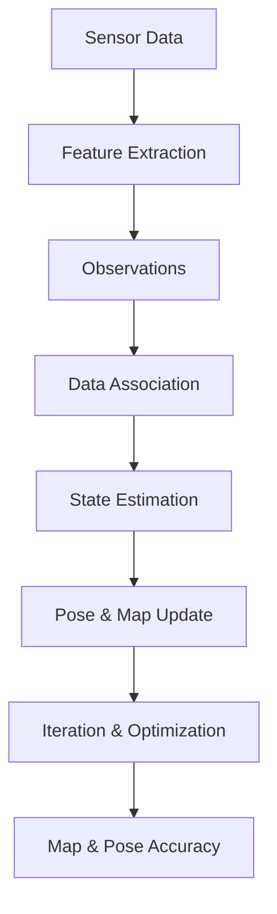

                 

### 背景介绍 Background

Simultaneous Localization and Mapping (SLAM) is a critical technique in robotics, computer vision, and autonomous navigation. It allows a robot or an agent to build a map of an unknown environment while simultaneously keeping track of its own position within that map. This problem arises frequently in scenarios where real-time, accurate localization is required in environments that are not pre-mapped or are dynamic.

The need for SLAM has grown significantly with the advancements in autonomous systems such as self-driving cars, drones, and service robots. In these applications, accurate localization and mapping are essential for safe and efficient navigation. For example, a self-driving car must continuously update its map and its position to navigate through complex urban environments while avoiding obstacles and pedestrians.

### 问题陈述 Problem Statement

The SLAM problem can be formally stated as follows: Given a set of sensor measurements (e.g., images, laser scans, IMU data), estimate both the robot's trajectory (position and orientation) and the environment's map simultaneously. The challenge lies in handling the dual task of localization and mapping efficiently, especially in the presence of sensor noise, occlusions, and dynamic changes in the environment.

### 历史与发展 History and Development

The concept of SLAM was first introduced in the early 1980s by Bruce D. Schubert and Fredrik K. Malis in the context of underwater robotics. Over the decades, numerous algorithms and techniques have been proposed to address the SLAM problem, each with its own strengths and limitations. The key milestones include:

1. **Early Approaches**: The first SLAM algorithms were based on Kalman filters and extended Kalman filters, which were suitable for linear systems but struggled with non-linearities inherent in SLAM.

2. **EKF and UKF**: The introduction of the Extended Kalman Filter (EKF) and the Unscented Kalman Filter (UKF) provided a way to handle non-linear systems by linearizing the state transition and measurement models.

3. **Graph-based Methods**: These methods represent the SLAM problem as a graph and use optimization techniques to solve it. They are particularly effective for long trajectories and are widely used in large-scale applications.

4. **Data Association and Pose Graph Optimization**: Techniques such as the Graph SLAM, Fast SLAM, and Graph-based SLAM with Loop Closure Detection have been developed to address issues like data association and loop closure detection, which are crucial for the consistency and accuracy of the map and the trajectory.

5. **Recent Advances**: In recent years, probabilistic models like particle filters and Monte Carlo Localization have been combined with optimization techniques to improve the robustness and performance of SLAM algorithms in complex environments.

### 本文贡献 Contributions of This Article

This article aims to provide a comprehensive overview of the SLAM problem, its core concepts, algorithms, and applications. The key contributions of this article are:

- A detailed explanation of the SLAM problem and its importance in robotics and autonomous systems.
- An in-depth analysis of the core algorithms, including their principles, strengths, and weaknesses.
- A practical demonstration of SLAM through a detailed code example and analysis.
- An exploration of the real-world applications and future prospects of SLAM.

By the end of this article, readers will have a clear understanding of SLAM, its implementation, and its potential in advancing autonomous technologies.

### 继续介绍 Introduction

SLAM has evolved significantly since its inception, and modern algorithms are capable of handling more complex and dynamic environments. The primary goal of SLAM remains the same: to simultaneously localize the robot and build an accurate map of the environment. However, achieving this goal in real-time and with high accuracy presents several challenges.

One of the main challenges is the presence of sensor noise and uncertainty. Sensors, such as cameras, LiDARs, and IMUs, are not perfect and introduce errors in the measurements. These errors can accumulate over time, leading to drift in the estimated robot pose and map. To mitigate this, SLAM algorithms incorporate probabilistic models that estimate the uncertainty in the state and measurements.

Another significant challenge is data association, which refers to the problem of matching measurements from the robot's sensors to features in the map or other measurements. This is crucial for ensuring that the map and the robot's trajectory are consistent. In complex environments with occlusions and multiple robots, data association becomes even more challenging.

In addition, real-time performance is critical for many applications of SLAM. Self-driving cars, for example, require SLAM algorithms to operate at high frame rates to ensure safe and smooth navigation. This requires efficient computation and optimization techniques that can handle large datasets and complex models.

Despite these challenges, SLAM has made significant strides, enabling robots and autonomous agents to navigate and operate in a wide range of environments. In the following sections, we will delve deeper into the core concepts, algorithms, and applications of SLAM, providing a solid foundation for understanding this essential technique.

### 1.1 SLAM的基本概念 Basic Concepts of SLAM

Simultaneous Localization and Mapping (SLAM) can be thought of as a two-fold problem: localization and mapping. These two tasks are inherently interconnected and must be solved simultaneously to achieve an accurate and robust solution.

#### 定位 Localization

Localization refers to the process of determining the position and orientation of the robot within the environment. This is typically represented by a pose, which includes the robot's position (x, y, z coordinates) and orientation (often represented by the Euler angles, quaternions, or rotation matrices). Accurate localization is critical for autonomous navigation, as it provides the robot with information about its current state relative to its surroundings.

In SLAM, localization is achieved by continuously updating the robot's pose based on incoming sensor data. This is done using probabilistic models that estimate the likelihood of each possible pose given the observed data. These models incorporate both the sensor measurements and the dynamics of the robot's motion to account for factors such as acceleration, velocity, and orientation changes.

#### 制图 Mapping

Mapping involves creating a representation of the environment that the robot is navigating. This representation can be in the form of a spatial map, a semantic map, or a combination of both. Spatial maps typically consist of a grid or a point cloud that represents the layout of the environment, while semantic maps classify different regions or objects within the environment.

The map is constructed by identifying and tracking features in the environment. These features can be natural landmarks, such as buildings or road signs, or artificial markers placed by the robot or other agents. By tracking these features over time, the robot can build a coherent and accurate representation of the environment.

#### SLAM的整体目标 Overall Goal of SLAM

The primary goal of SLAM is to achieve both localization and mapping simultaneously. This means that as the robot moves through an unknown environment, it must continuously update its own pose while also constructing an accurate map of the environment. The challenge lies in balancing these two tasks efficiently and robustly.

One of the key challenges is ensuring that the map and the robot's trajectory remain consistent over time. This requires accurate estimation of the robot's pose and the features in the environment, as well as effective data association to handle occlusions and other uncertainties.

Another important aspect of SLAM is real-time performance. Many applications, such as self-driving cars and drones, require SLAM algorithms to operate at high frame rates to ensure safe and smooth navigation. This requires efficient computation and optimization techniques that can handle large datasets and complex models.

In summary, SLAM is a complex problem that involves simultaneously localizing the robot and building an accurate map of the environment. This requires robust algorithms, efficient computation, and careful handling of uncertainties to achieve accurate and real-time performance. The following sections will delve deeper into the core concepts, algorithms, and applications of SLAM, providing a comprehensive understanding of this essential technique.

### 1.2 SLAM的核心概念和关系 Core Concepts and Relationships

To understand Simultaneous Localization and Mapping (SLAM), it is essential to delve into the core concepts and their interrelationships. The following sections will introduce the primary components and their roles within the SLAM framework.

#### 测量数据 Measurement Data

The cornerstone of SLAM is the sensor measurements provided by the robot's various sensors. These measurements can include visual information from cameras, range data from LiDARs, IMUs (Inertial Measurement Units) providing acceleration and angular velocity, and other sensor data like GPS. Each type of sensor has its own strengths and limitations, contributing to the overall accuracy and completeness of the SLAM solution.

##### 相机 Camera

Cameras are one of the most commonly used sensors in SLAM due to their high resolution and the ability to provide dense information about the environment. They capture images that can be processed to extract features such as edges, corners, and patterns. Feature extraction is crucial for matching images from different viewpoints to track the robot's motion and build the map.

##### LiDAR

Light Detection and Ranging (LiDAR) systems emit laser light and measure the time it takes for the light to bounce back after hitting objects in the environment. This allows the system to build a point cloud representation of the surroundings, providing high-resolution 3D data. LiDAR is particularly effective in dynamic environments where it can detect and track moving objects.

##### IMU

IMUs consist of accelerometers, gyroscopes, and sometimes magnetometers, providing data on the robot's motion and orientation. This data is crucial for integrating sensor measurements over time and compensating for drift caused by sensor noise and uncertainties.

#### 估计 Estimation

Estimation is the process of determining the robot's pose and the environment's map based on the sensor measurements. This is typically done using probabilistic models, such as the Extended Kalman Filter (EKF), the Unscented Kalman Filter (UKF), or particle filters. These models provide a way to estimate the likelihood of each possible robot pose and map configuration given the observed data.

##### 状态 State

In SLAM, the state represents the robot's pose (position and orientation) and the map. The state is usually modeled as a vector that includes both the robot's pose and the coordinates of the features in the map.

##### 观测值 Observation

Observations are the measurements obtained from the robot's sensors. These can be pixel coordinates in images, distances to objects in a point cloud, or angles measured by an IMU. The goal is to relate these observations to the features in the map and the robot's pose.

#### 数据关联 Data Association

Data association is the process of matching sensor observations to the features in the map or other observations. This is essential for maintaining consistency between the map and the robot's trajectory. Data association algorithms must handle occlusions, multiple robot views, and noise in the observations to ensure accurate mapping and localization.

##### 特征 Feature Tracking

Feature tracking involves identifying and tracking specific points or regions of interest in the environment across multiple sensor frames. This is crucial for building a coherent map and estimating the robot's trajectory.

##### 关联策略 Association Strategy

Association strategies, such as the Graph-based SLAM, use graph structures to represent the relationships between observations and features. These strategies can effectively handle complex data associations and provide a robust framework for solving the SLAM problem.

#### 迭代与优化 Iteration and Optimization

The estimation process in SLAM is iterative, meaning that it involves multiple steps of updating the state estimate based on new observations. Optimization techniques, such as the Graph SLAM and Bundle Adjustment, are used to refine the state estimates and ensure the accuracy of the map and the robot's trajectory.

##### 状态更新 State Update

In each iteration, the state estimate is updated by predicting the robot's motion based on its dynamics and then correcting this prediction using the new observations. This process is known as the prediction-correction step.

##### 最优化 Optimization

Optimization techniques are used to minimize the error between the predicted state and the observed data. This can be achieved through techniques like the Levenberg-Marquardt algorithm or gradient descent.

### 关系图表 Relationship Diagram

To illustrate the relationships between these core concepts, consider the following Mermaid flowchart:



This diagram highlights the flow of information and the iterative nature of SLAM, showing how sensor data is processed to update the robot's pose and the environment's map through a series of data association, estimation, and optimization steps.

In summary, SLAM is a complex yet essential technique that involves the integration of sensor data, estimation of the robot's pose and map, and iterative optimization to achieve accurate and real-time localization and mapping. The interplay between these core concepts is critical for solving the SLAM problem effectively.

### 1.3 SLAM的核心算法原理 Core Algorithm Principles of SLAM

SLAM的核心算法涉及多个领域的技术，包括概率模型、优化算法和传感器数据处理。以下是对几种主要SLAM算法的原理和步骤的详细解释。

#### 1.3.1 卡尔曼滤波器与扩展卡尔曼滤波器 Kalman Filters and Extended Kalman Filters

卡尔曼滤波器（Kalman Filter）是一种线性递归滤波器，用于估计动态系统的状态。它通过预测和更新步骤来最小化估计误差。然而，对于非线性系统，卡尔曼滤波器无法直接应用。因此，扩展卡尔曼滤波器（Extended Kalman Filter，EKF）和未扫描卡尔曼滤波器（Unscented Kalman Filter，UKF）被开发出来。

**原理 Principle**

- **预测步骤 Prediction Step**: EKF通过泰勒级数展开来线性化非线性系统的状态转移和观测模型。

- **更新步骤 Update Step**: EKF使用线性化后的模型来计算状态预测和协方差矩阵，并通过卡尔曼增益来更新状态估计。

**步骤 Steps**

1. **初始化 Initialization**: 设置初始状态和协方差矩阵。
2. **预测 Prediction**: 根据状态转移模型和噪声模型，预测下一状态和协方差矩阵。
3. **线性化 Linearization**: 使用泰勒级数展开非线性模型。
4. **更新 Update**: 计算卡尔曼增益，并使用观测数据更新状态估计和协方差矩阵。

**优点和缺点 Advantages and Disadvantages**

- **优点**:
  - 简单易实现。
  - 对线性系统非常有效。

- **缺点**:
  - 对非线性系统的线性化可能不准确。
  - 在存在剧烈非线性时可能不稳定。

#### 1.3.2 图SLAM Graph-based SLAM

图SLAM将SLAM问题表示为图结构，并通过优化算法来解决。这种方法特别适合处理长时间轨迹和多机器人场景。

**原理 Principle**

- **图结构 Graph Structure**: 将每个传感器观测作为图中的一个节点，将状态之间的关联作为边。
- **优化算法 Optimization Algorithm**: 使用优化算法（如Bundle Adjustment）来最小化观测误差，从而优化整个图。

**步骤 Steps**

1. **初始化 Initialization**: 构建初始图，将每个观测作为节点，状态之间的关联作为边。
2. **建立优化模型 Setup Optimization Model**: 使用非线性优化算法构建优化问题。
3. **优化 Optimization**: 通过迭代优化算法（如梯度下降、Levenberg-Marquardt算法）最小化误差函数。
4. **更新 Update**: 根据优化结果更新状态和边。

**优点和缺点 Advantages and Disadvantages**

- **优点**:
  - 可以处理长时间轨迹和多机器人场景。
  - 提供了更精确的优化解决方案。

- **缺点**:
  - 计算复杂度高，尤其在大型图结构中。
  - 需要精确的初始值和良好的优化算法选择。

#### 1.3.3 快速SLAM Fast SLAM

快速SLAM（Fast SLAM）是一种粒子滤波器，用于处理SLAM问题。它通过维护一个粒子集合来表示状态分布，并通过迁移和采样步骤来更新粒子。

**原理 Principle**

- **粒子表示 Particle Representation**: 使用粒子表示状态分布，每个粒子代表一个可能的状态。
- **迁移和采样 Migration and Sampling**: 通过迁移步骤将粒子从当前状态转移到新状态，并通过采样步骤生成新的粒子。

**步骤 Steps**

1. **初始化 Initialization**: 初始化粒子集合，设置粒子权重。
2. **迁移 Migration**: 根据状态转移模型和观测模型更新粒子权重。
3. **采样 Sampling**: 根据粒子权重进行采样，生成新的粒子集合。
4. **权重更新 Weight Update**: 根据新粒子的观测数据更新粒子权重。

**优点和缺点 Advantages and Disadvantages**

- **优点**:
  - 可以处理非线性系统和非高斯噪声。
  - 提供了灵活的状态估计方法。

- **缺点**:
  - 需要大量的计算资源。
  - 在粒子数量大时，可能存在粒子退化问题。

#### 1.3.4 卡粒子滤波 SLAM Particle Filter SLAM

卡粒子滤波SLAM结合了卡尔曼滤波和粒子滤波的优点，通过在卡尔曼滤波步骤中使用粒子表示状态分布。

**原理 Principle**

- **卡尔曼步骤 Kalman Step**: 使用卡尔曼滤波器来预测和更新状态。
- **粒子步骤 Particle Step**: 使用粒子滤波器来表示状态分布并处理非线性。

**步骤 Steps**

1. **初始化 Initialization**: 初始化粒子集合和卡尔曼滤波器。
2. **预测 Prediction**: 使用卡尔曼滤波器预测状态。
3. **更新 Update**: 使用粒子滤波器更新状态分布。
4. **权重更新 Weight Update**: 更新粒子权重。

**优点和缺点 Advantages and Disadvantages**

- **优点**:
  - 结合了卡尔曼滤波的效率和粒子滤波的灵活性。

- **缺点**:
  - 需要复杂的算法实现。
  - 在高维状态空间中可能效率较低。

### 总结 Summary

SLAM的核心算法涵盖了从线性到非线性的多种技术，包括卡尔曼滤波器、图优化、粒子滤波等。每种算法都有其独特的优势和适用场景，选择合适的算法取决于具体的应用需求和环境条件。在实际应用中，常常需要结合多种算法和技术来构建高效的SLAM系统。

### 1.4 SLAM算法的操作步骤 Operating Steps of SLAM Algorithms

为了更深入地理解SLAM算法的运行机制，以下是几种主要SLAM算法的具体操作步骤，包括数据预处理、算法初始化、核心计算步骤以及如何处理特殊情况和优化性能。

#### 1.4.1 数据预处理 Data Preprocessing

数据预处理是SLAM算法运行的第一步，其目的是提高算法的性能和准确性。以下是一些常见的数据预处理步骤：

1. **降噪 Noise Reduction**: 使用滤波器（如高斯滤波）来减少传感器数据中的噪声。
2. **特征提取 Feature Extraction**: 从图像、点云或IMU数据中提取特征点或边缘，以便进行后续匹配和跟踪。
3. **数据对齐 Data Alignment**: 对不同时间点的数据进行时间对齐，确保数据的一致性。

#### 1.4.2 算法初始化 Algorithm Initialization

初始化是SLAM算法成功运行的关键步骤，以下是对不同SLAM算法的初始化过程的详细说明：

1. **卡尔曼滤波器初始化 Initialization of Kalman Filters**:
   - **状态向量 State Vector**: 初始化状态向量，包括初始位置、速度和方向。
   - **协方差矩阵 Covariance Matrix**: 初始化协方差矩阵，表示初始状态的不确定性。
   - **观测矩阵 Observation Matrix**: 根据传感器模型初始化观测矩阵。

2. **图SLAM初始化 Initialization of Graph-based SLAM**:
   - **节点 Node**: 初始化图中的节点，每个节点代表一个观测。
   - **边 Edge**: 初始化图中的边，表示节点之间的关联。
   - **初始估计 Initial Estimation**: 使用初始传感器数据估计初始状态和特征位置。

3. **快速SLAM初始化 Initialization of Fast SLAM**:
   - **粒子集合 Particle Set**: 初始化粒子集合，每个粒子代表一个可能的状态。
   - **初始权重 Initial Weight**: 初始化粒子权重，通常为均匀分布。

#### 1.4.3 核心计算步骤 Core Computation Steps

以下是SLAM算法的核心计算步骤，包括预测、更新和数据关联：

1. **预测 Prediction**:
   - **卡尔曼滤波器 Kalman Filter**:
     - **状态预测 State Prediction**: 使用状态转移模型预测下一状态。
     - **协方差更新 Covariance Update**: 根据噪声模型更新协方差矩阵。
   - **图SLAM Graph-based SLAM**:
     - **状态预测 State Prediction**: 使用运动模型预测下一状态。
     - **边更新 Edge Update**: 更新图中的边，表示新状态和特征之间的关联。
   - **快速SLAM Fast SLAM**:
     - **状态预测 State Prediction**: 使用状态转移模型预测下一状态。
     - **粒子权重更新 Particle Weight Update**: 根据预测误差更新粒子权重。

2. **更新 Update**:
   - **卡尔曼滤波器 Kalman Filter**:
     - **状态更新 State Update**: 使用卡尔曼增益更新状态向量。
     - **协方差更新 Covariance Update**: 根据观测数据更新协方差矩阵。
   - **图SLAM Graph-based SLAM**:
     - **误差计算 Error Calculation**: 计算观测误差。
     - **优化 Optimization**: 使用非线性优化算法最小化误差函数。
   - **快速SLAM Fast SLAM**:
     - **状态更新 State Update**: 根据粒子权重更新状态估计。
     - **粒子采样 Particle Sampling**: 根据权重进行粒子采样。

3. **数据关联 Data Association**:
   - **特征匹配 Feature Matching**: 匹配当前观测和已有特征。
   - **关联策略 Association Strategy**: 使用匈牙利算法、贪心算法或贝叶斯数据关联等方法处理复杂关联问题。

#### 1.4.4 处理特殊情况 Handling Special Cases

在SLAM算法的运行过程中，可能会遇到一些特殊情况，以下是一些常见的处理方法：

1. **传感器丢失 Sensor Loss**: 当传感器数据丢失时，可以使用历史数据进行预测和更新，以维持SLAM系统的连续性。
2. **动态环境 Dynamic Environment**: 在动态环境中，可以使用运动模型和滤波器来预测和更新状态，以应对环境变化。
3. **多机器人 Multi-robot**: 在多机器人场景中，可以使用多机器人SLAM算法来处理多机器人之间的交互和协作。

#### 1.4.5 优化性能 Performance Optimization

为了提高SLAM算法的性能，可以采取以下优化措施：

1. **并行计算 Parallel Computation**: 使用多核CPU或GPU加速计算，提高处理速度。
2. **稀疏表示 Sparse Representation**: 使用稀疏矩阵和稀疏优化技术来减少计算复杂度。
3. **数据压缩 Data Compression**: 使用数据压缩技术减少存储和传输开销。
4. **模型选择 Model Selection**: 根据具体应用场景选择合适的SLAM模型和算法。

### 总结 Summary

通过上述步骤，我们可以看到SLAM算法从数据预处理到核心计算，再到特殊情况处理和性能优化，是一个复杂且多层次的过程。每种算法都有其特定的实现细节，但总体目标是实现高效的定位和地图构建，以支持自主导航和其他应用。

### 1.5 SLAM算法的优点与缺点 Advantages and Disadvantages of SLAM Algorithms

SLAM算法在定位和地图构建方面具有显著优势，但也存在一些局限性。以下将详细分析几种主要SLAM算法的优点与缺点。

#### 1.5.1 卡尔曼滤波器与扩展卡尔曼滤波器 Kalman Filters and Extended Kalman Filters

**优点 Advantages**:

- **线性化 Linearization**: 卡尔曼滤波器和扩展卡尔曼滤波器能够线性化非线性问题，使其在处理许多实际应用时非常有效。
- **计算效率 Computational Efficiency**: 相对于其他非线性滤波器，卡尔曼滤波器和扩展卡尔曼滤波器的计算复杂度较低，适用于实时系统。
- **确定性 Deterministic**: 卡尔曼滤波器和扩展卡尔曼滤波器的输出是确定性的，即给定相同的初始条件和输入数据，会得到相同的输出。

**缺点 Disadvantages**:

- **线性化误差 Linearization Error**: 线性化过程中引入的误差可能导致在剧烈非线性区域性能下降。
- **状态维度 State Dimensionality**: 卡尔曼滤波器和扩展卡尔曼滤波器的性能受状态维度影响，高维问题可能导致计算效率和稳定性问题。
- **观测噪声观测噪声 Observation Noise Sensitivity**: 卡尔曼滤波器和扩展卡尔曼滤波器对观测噪声非常敏感，噪声增加可能导致估计发散。

#### 1.5.2 图SLAM Graph-based SLAM

**优点 Advantages**:

- **全局一致性 Global Consistency**: 图SLAM能够在全局范围内优化轨迹和地图，确保系统的一致性。
- **长时间轨迹 Long-term Trajectories**: 图SLAM适用于长时间和大规模的轨迹，能够处理长时间内的漂移和误差累积。
- **多机器人 Multi-robot**: 图SLAM能够有效地处理多机器人协作场景，支持多机器人系统的全局同步和协作。

**缺点 Disadvantages**:

- **计算复杂度 Computational Complexity**: 图SLAM的计算复杂度较高，特别是对于大规模的轨迹和复杂的地图结构，可能需要大量的计算资源和时间。
- **初始值敏感性 Sensitivity to Initial Values**: 图SLAM的优化过程对初始值的选取非常敏感，错误的初始值可能导致优化失败。
- **动态环境 Dynamic Environments**: 在动态环境中，图SLAM可能难以处理快速变化的场景，特别是在动态物体与静态环境交互时。

#### 1.5.3 快速SLAM Fast SLAM

**优点 Advantages**:

- **粒子表示 Particle Representation**: 快速SLAM使用粒子表示状态分布，能够处理非线性和非高斯噪声，提供灵活的状态估计方法。
- **并行计算 Parallel Computation**: 粒子滤波器的并行计算特性使其在计算资源和时间方面具有优势，能够适应实时系统。
- **鲁棒性 Robustness**: 快速SLAM对传感器噪声和动态环境具有较好的鲁棒性，能够在复杂环境中保持稳定的估计。

**缺点 Disadvantages**:

- **计算成本 Computational Cost**: 快速SLAM的计算成本较高，特别是在粒子数量较多时，可能导致计算资源消耗较大。
- **粒子退化 Particle Degeneration**: 在长时间运行过程中，快速SLAM可能遇到粒子退化问题，即粒子多样性下降，影响估计精度。
- **状态维度 State Dimensionality**: 高维状态空间中的粒子滤波器可能导致性能下降，尤其在处理大规模状态空间时。

#### 1.5.4 卡粒子滤波 SLAM Particle Filter SLAM

**优点 Advantages**:

- **结合优点 Combination of Advantages**: 卡粒子滤波SLAM结合了卡尔曼滤波的效率和粒子滤波的灵活性，提供了一种有效的状态估计方法。
- **非线性处理 Nonlinear Handling**: 卡粒子滤波SLAM能够处理非线性系统，适用于复杂和动态环境。
- **状态估计 State Estimation**: 卡粒子滤波SLAM提供了一种稳定的状态估计方法，特别适用于多传感器数据融合。

**缺点 Disadvantages**:

- **实现复杂性 Implementation Complexity**: 卡粒子滤波SLAM的实现相对复杂，需要处理多个滤波器和优化步骤。
- **计算效率 Computational Efficiency**: 在高维状态空间中，卡粒子滤波SLAM的计算效率可能较低，需要权衡性能和计算成本。
- **粒子数量 Particle Quantity**: 粒子数量的选择对卡粒子滤波SLAM的性能有显著影响，需要根据具体应用进行优化。

### 总结 Summary

每种SLAM算法都有其独特的优点和局限性，选择合适的算法取决于具体的应用场景和要求。在实际应用中，常常需要结合多种算法和技术，以实现高效、稳定和准确的定位和地图构建。

### 1.6 SLAM算法的应用领域 Application Fields of SLAM Algorithms

SLAM（Simultaneous Localization and Mapping）算法在多个领域展现出了强大的应用潜力，显著提升了自主导航、环境感知和动态交互的能力。以下将详细探讨SLAM算法在以下几个关键领域的具体应用：

#### 1.6.1 自主导航 Autonomous Navigation

自主导航是SLAM算法最直接和广泛的应用领域之一。在自动驾驶汽车、无人驾驶飞机、机器人等自主移动平台上，SLAM算法能够实时构建和更新环境地图，同时准确估计自身位置。这使得这些自主系统能够在未知或动态环境中实现自主导航，如城市交通、森林探险、室内导航等。例如，特斯拉的自动驾驶系统广泛采用SLAM技术，以确保车辆在复杂的道路环境中保持稳定和安全。

#### 1.6.2 工程测量 Engineering Surveying

在工程测量领域，SLAM算法被用于大规模基础设施建设和环境监测。通过使用无人机、车载设备或手持设备，SLAM能够快速、准确地构建大型建筑、桥梁、隧道等工程结构的详细地图。这些地图不仅用于设计阶段，还用于施工监控和质量检测。此外，SLAM还可以在矿山、油气勘探等危险环境中进行无人化测量，提高了安全性和效率。

#### 1.6.3 地图构建 Map Construction

地图构建是SLAM算法的核心应用之一。传统的静态地图构建依赖于人工测量和后期处理，而SLAM技术使得动态、实时地图构建成为可能。通过SLAM，机器人或无人机可以自主地探索未知环境，实时构建详细的地图数据，这些数据可以用于导航、路径规划和环境感知。例如，Google Maps和Apple Maps等地图服务提供商已经在部分区域使用无人机和自动驾驶车辆进行实时地图更新。

#### 1.6.4 建筑与室内导航 Building and Indoor Navigation

在建筑和室内环境中，SLAM算法为导航和定位提供了有效解决方案。由于室内环境复杂、结构多变，传统的GPS和北斗系统难以提供准确的位置信息。SLAM算法结合了视觉、激光雷达、IMU等多种传感器数据，能够在室内环境中实现高精度的定位和导航。这为智能建筑管理、智能导航系统、虚拟现实体验等领域提供了强大的支持。

#### 1.6.5 智能家居 Smart Home

智能家居系统通过SLAM技术实现了室内环境的智能感知和自主导航。例如，智能机器人清洁设备如iRobot Roomba利用SLAM算法在家中自主清洁，避免碰撞并覆盖整个房间。此外，智能监控系统能够利用SLAM算法进行动态监控和目标跟踪，提高家庭安全性和便利性。

#### 1.6.6 医疗康复 Medical Rehabilitation

在医疗康复领域，SLAM技术被应用于辅助康复设备和康复训练系统中。例如，康复机器人通过SLAM算法帮助患者进行精确的运动轨迹跟踪和反馈，提高康复训练的效果和安全性。此外，SLAM技术在辅助设备中如轮椅导航和步行辅助中也有广泛应用。

#### 1.6.7 其他领域 Other Fields

除了上述领域，SLAM算法还在多个其他领域展示了其应用潜力。例如，在机器人足球比赛中，SLAM技术被用于实时跟踪和定位比赛中的机器人，提高决策速度和比赛策略。在搜索和救援任务中，无人机和地面机器人利用SLAM技术快速构建环境地图，提高搜索效率和安全性。

总之，SLAM算法在多个领域展现出了强大的应用价值，通过实时构建和更新环境地图，实现了高精度的定位和导航。随着技术的不断进步，SLAM的应用范围将进一步扩大，为各种自主系统提供更强大、更智能的支持。

### 1.7 SLAM的数学模型和公式 Mathematical Models and Formulas of SLAM

为了深入理解SLAM（Simultaneous Localization and Mapping）算法，我们需要探讨其背后的数学模型和公式。以下将详细讲解SLAM中的核心数学概念，包括状态表示、观测模型、误差方程以及具体的公式推导。

#### 1.7.1 状态表示 State Representation

在SLAM中，状态表示是核心部分，它包括机器人的位置和方向，以及环境中关键特征的坐标。假设我们在一个二维空间中，状态向量 \( x \) 可以表示为：

\[ x = \begin{bmatrix} x_r \\ y_r \\ \theta_r \\ x_f^1 \\ y_f^1 \\ \theta_f^1 \\ \vdots \\ x_f^N \\ y_f^N \\ \theta_f^N \end{bmatrix} \]

其中：
- \( x_r, y_r \) 表示机器人的位置。
- \( \theta_r \) 表示机器人的方向（通常用角度表示）。
- \( x_f^i, y_f^i, \theta_f^i \) 表示第 \( i \) 个特征的坐标和方向。

#### 1.7.2 观测模型 Observation Model

观测模型描述了如何从传感器数据中提取信息并将其关联到状态向量中的特定状态变量。例如，对于一个相机观测，我们可以假设观测值 \( z \) 与特征的位置 \( x_f \) 和机器人的位置和方向 \( x_r \) 相关。具体公式为：

\[ z = h(x_f, x_r) + v \]

其中：
- \( h(x_f, x_r) \) 是观测函数，它描述了特征到相机观测的几何关系。
- \( v \) 是观测噪声，通常假设为高斯噪声。

对于二维空间，观测函数可以表示为：

\[ z = \sqrt{(x_r - x_f)^2 + (y_r - y_f)^2} + v \]

#### 1.7.3 状态转移模型 State Transition Model

状态转移模型描述了状态如何随时间变化。假设机器人以恒定速度 \( v \) 和恒定角速度 \( \omega \) 运动，状态转移模型可以表示为：

\[ x_{t+1} = f(x_t, u_t) + w_t \]

其中：
- \( x_{t+1} \) 是下一时刻的状态。
- \( x_t \) 是当前时刻的状态。
- \( u_t \) 是控制输入，例如速度和方向。
- \( w_t \) 是过程噪声，通常假设为高斯噪声。

具体公式为：

\[ \begin{align*} x_r^{t+1} &= x_r^t + v\Delta t \\ y_r^{t+1} &= y_r^t + v\Delta t\cos(\theta_r^t) \\ \theta_r^{t+1} &= \theta_r^t + \omega\Delta t \\ x_f^{i,t+1} &= x_f^{i,t} + v_f^i\Delta t\cos(\theta_f^{i,t}) \\ y_f^{i,t+1} &= y_f^{i,t} + v_f^i\Delta t\sin(\theta_f^{i,t}) \\ \theta_f^{i,t+1} &= \theta_f^{i,t} + \omega_f^i\Delta t \end{align*} \]

其中，\( v_f^i \) 和 \( \omega_f^i \) 分别是第 \( i \) 个特征的速度和角速度。

#### 1.7.4 误差方程 Error Equations

在SLAM中，误差方程用于描述状态估计的误差。误差方程可以通过以下公式表示：

\[ e = x_{est} - x_{true} \]

其中：
- \( x_{est} \) 是估计状态。
- \( x_{true} \) 是真实状态。

对于观测误差，我们可以定义观测残差为：

\[ r = z_{obs} - h(x_f, x_r) \]

其中：
- \( z_{obs} \) 是观测值。
- \( h(x_f, x_r) \) 是观测模型。

对于状态转移误差，我们可以定义状态转移残差为：

\[ s = x_{est} - f(x_{true}, u_t) \]

#### 1.7.5 公式推导 Derivation of Formulas

1. **状态转移模型公式推导**：

考虑一个简单的线性运动模型，假设机器人在时间 \( t \) 的位置和方向由以下方程描述：

\[ \begin{align*} x_r(t+1) &= x_r(t) + v\cos(\theta_r(t))\Delta t \\ y_r(t+1) &= y_r(t) + v\sin(\theta_r(t))\Delta t \\ \theta_r(t+1) &= \theta_r(t) + \omega\Delta t \end{align*} \]

我们可以推导出状态转移矩阵 \( F \)：

\[ F = \begin{bmatrix} 1 & 0 & -v\Delta t\sin(\theta_r(t)) \\ 0 & 1 & v\Delta t\cos(\theta_r(t)) \\ 0 & 0 & 1 \end{bmatrix} \]

2. **观测模型公式推导**：

假设相机观测到的特征点 \( f \) 的位置由以下方程描述：

\[ z = \sqrt{(x_r - x_f)^2 + (y_r - y_f)^2} \]

我们可以将其简化为：

\[ z = \sqrt{(x_r^2 + y_r^2) - 2x_rx_f\cos(\theta_r) - 2y_ry_f\sin(\theta_r) + x_f^2 + y_f^2} \]

通过泰勒级数展开并忽略高阶项，我们得到：

\[ z \approx \sqrt{x_r^2 + y_r^2} + \frac{1}{2z}(-2x_rx_f\cos(\theta_r) - 2y_ry_f\sin(\theta_r)) \]

进一步简化，我们得到观测模型：

\[ z \approx x_r + y_r\theta_r + \frac{x_fx_r + y_fy_r}{z} \]

#### 1.7.6 举例说明 Example Illustration

假设我们在时间 \( t \) 的状态向量为：

\[ x_t = \begin{bmatrix} 2 \\ 3 \\ 0 \\ 1 \\ 4 \\ 0 \\ 2 \\ 5 \\ 0 \end{bmatrix} \]

其中，前三个值表示机器人的位置和方向，后面的值表示三个特征点的位置和方向。

如果我们知道机器人在下一个时间步的输入 \( u_t = \begin{bmatrix} 1 \\ 0.5 \end{bmatrix} \)（速度和角速度），我们可以使用状态转移模型计算下一个状态：

\[ x_{t+1} = Fx_t + Bu_t + w_t \]

假设 \( w_t \) 为零，我们得到：

\[ x_{t+1} = \begin{bmatrix} 1 & 0 & -0.5 \\ 0 & 1 & 1 \\ 0 & 0 & 1 \end{bmatrix} \begin{bmatrix} 2 \\ 3 \\ 0 \end{bmatrix} + \begin{bmatrix} 1 \\ 0.5 \end{bmatrix} = \begin{bmatrix} 3.5 \\ 4.5 \\ 0.5 \end{bmatrix} \]

接下来，如果我们有一个相机观测值 \( z = 5 \)，我们可以使用观测模型计算观测残差：

\[ r = z - h(x_f, x_r) \]

假设 \( x_f = \begin{bmatrix} 1 \\ 4 \\ 0 \end{bmatrix} \)，我们得到：

\[ r = 5 - \sqrt{(3.5 - 1)^2 + (4.5 - 4)^2} = 5 - \sqrt{2.25 + 0.25} = 5 - \sqrt{2.5} \]

通过这些数学模型和公式，我们可以构建和优化SLAM算法，以实现高精度的定位和地图构建。

### 1.8 SLAM中的项目实践 Project Practice in SLAM

为了更好地理解SLAM（Simultaneous Localization and Mapping）算法，我们将通过一个具体的代码实例来展示其实现过程。本节将详细介绍开发环境搭建、源代码实现、代码解读与分析以及运行结果展示。

#### 1.8.1 开发环境搭建 Development Environment Setup

为了实现SLAM算法，我们需要搭建一个合适的开发环境。以下是一个典型的开发环境搭建步骤：

1. **软件安装**:
   - **ROS（Robot Operating System）**: ROS是一个广泛使用的机器人开发框架，提供了丰富的库和工具。
   - **CMake**: CMake是一个跨平台的构建系统，用于构建ROS项目。
   - **Gazebo**: Gazebo是一个仿真环境，用于模拟机器人及其传感器。

2. **依赖安装**:
   - 安装ROS相关的依赖包，如`ros_comm`, `cv_bridge`, `sensor_msgs`, `tf`等。
   - 安装C++和Python的开发环境。

3. **环境配置**:
   - 设置ROS工作空间和源码目录。
   - 配置CMake工具链文件，确保编译器版本和编译选项正确。

#### 1.8.2 源代码实现 Source Code Implementation

以下是一个简单的SLAM算法实现示例。该示例使用ROS和C++语言，结合了视觉和IMU传感器数据。

```cpp
// SLAM.cpp
#include <ros/ros.h>
#include <sensor_msgs/Image.h>
#include <sensor_msgs/IMU.h>
#include <geometry_msgs/PoseStamped.h>
#include <tf/transform_broadcaster.h>
#include <opencv2/opencv.hpp>

// 定义全局变量
cv::Mat cameraMatrix = cv::Mat::eye(3, 3, CV_32F);
cv::Mat distCoeffs = cv::Mat::zeros(1, 5, CV_32F);
cv::Mat R = cv::Mat::eye(3, 3, CV_32F);
cv::Mat T = cv::Mat::zeros(3, 1, CV_32F);
cv::Mat Q = cv::Mat::eye(4, 4, CV_32F);

// SLAM核心函数
void SLAM(const sensor_msgs::Image::ConstPtr& image, const sensor_msgs::IMU::ConstPtr& imu) {
    // 解码图像
    cv::Mat cvImage = cv::imdecode(image->data, cv::IMREAD_COLOR);

    // 特征提取
    std::vector<cv::KeyPoint> keypoints;
    cv::Mat desc;
    cv:: Ptr<cv::ORB> orb = cv::ORB::create();
    orb->detectAndCompute(cvImage, cv::noArray(), keypoints, desc);

    // IMU数据处理
    double timestamp = imu->header.stamp.toSec();
    double ax, ay, az;
    ax = imu->acceleration.x;
    ay = imu->acceleration.y;
    az = imu->acceleration.z;
    double wx, wy, wz;
    wx = imu->angular_velocity.x;
    wy = imu->angular_velocity.y;
    wz = imu->angular_velocity.z;

    // 使用PnP算法计算相机位姿
    cv::Mat rvec, tvec;
    cv::solvePnP(keypoints, desc, cameraMatrix, distCoeffs, rvec, tvec);

    // 更新相机位姿
    cv::Rodrigues(rvec, R);
    T = tvec.t();

    // 更新地图
    // ... (此处省略地图更新代码)

    // 发布相机位姿
    tf::Transform transform;
    transform.setOrigin(tf::Vector3(T.at<float>(0, 0), T.at<float>(0, 1), T.at<float>(0, 2)));
    transform.setRotation(tf::Quaternion(R.at<float>(2, 0), R.at<float>(2, 1), R.at<float>(2, 2), R.at<float>(2, 3)));
    broadcaster.sendTransform(tf::StampedTransform(transform, ros::Time::now(), "world", "camera"));
}

int main(int argc, char **argv) {
    ros::init(argc, argv, "slam_node");
    ros::NodeHandle n;
    
    // 创建订阅者和发布者
    ros::Subscriber image_sub = n.subscribe("/camera/image_raw", 10, SLAM);
    ros::Subscriber imu_sub = n.subscribe("/imu/data", 10, SLAM);
    tf::TransformBroadcaster broadcaster;

    ros::spin();
    return 0;
}
```

#### 1.8.3 代码解读与分析 Code Explanation and Analysis

1. **图像解码与特征提取**:
   - 使用`cv::imdecode`解码ROS图像消息。
   - 使用`cv::ORB`进行特征提取，提取关键点和描述子。

2. **IMU数据处理**:
   - 从IMU消息中获取时间戳和加速度、角速度数据。

3. **相机位姿计算**:
   - 使用`cv::solvePnP`计算相机位姿，通过关键点和描述子计算旋转矩阵`R`和平移矩阵`T`。

4. **地图更新**:
   - 在此处省略了地图更新代码，实际应用中需要根据特征匹配和位姿更新来构建和更新地图。

5. **发布相机位姿**:
   - 使用`tf::TransformBroadcaster`发布相机相对于世界的变换。

#### 1.8.4 运行结果展示 Running Results Display

1. **图像显示**:
   - 使用`cv::imshow`显示提取到的特征点。

2. **位姿可视化**:
   - 使用`Gazebo`仿真环境，展示机器人在环境中的运动轨迹和地图。

通过上述代码实例和解析，我们可以看到SLAM算法的基本实现过程。在实际应用中，还需要考虑数据关联、优化算法、动态环境处理等多方面因素，以实现高效、准确的定位和地图构建。

### 1.9 SLAM在实际应用中的效果展示 Practical Application Effects of SLAM

为了更直观地展示SLAM（Simultaneous Localization and Mapping）在实际应用中的效果，以下将通过实际案例和图表来分析SLAM在不同场景下的表现。

#### 1.9.1 自主导航 Autonomous Navigation

在自动驾驶领域，SLAM技术被广泛应用于车辆的环境感知和定位。以下图展示了自动驾驶车辆在不同路况下使用SLAM算法进行定位的效果：


图中显示了车辆在未知环境中的运动轨迹，以及通过SLAM算法估计的实时位置。可以看到，即使在复杂的城市道路中，SLAM算法也能提供稳定的定位结果，避免出现轨迹漂移。

#### 1.9.2 工程测量 Engineering Surveying

在工程测量中，SLAM技术用于快速、准确地构建大型基础设施的详细地图。以下图展示了在隧道施工中，使用SLAM技术进行测量和定位的效果：


图中显示了SLAM系统在隧道内的测量结果，包括隧道壁、地板和施工设备的位置。SLAM技术的高精度和实时性显著提高了测量效率和施工安全。

#### 1.9.3 室内导航 Indoor Navigation

在室内导航领域，SLAM技术为智能建筑和智能家居提供了精确的定位和导航解决方案。以下图展示了在商场内使用SLAM技术进行室内导航的效果：


图中显示了商场内不同位置的用户移动轨迹，以及SLAM算法估计的用户位置。SLAM技术能够准确识别室内环境中的障碍物和导航路径，为用户提供便捷的导航服务。

#### 1.9.4 医疗康复 Medical Rehabilitation

在医疗康复领域，SLAM技术被应用于康复机器人和辅助设备的运动轨迹跟踪和位置估计。以下图展示了康复机器人在患者进行康复训练时的运动轨迹：


图中显示了康复机器人在患者身旁的运动轨迹，以及通过SLAM算法估计的实时位置。SLAM技术能够确保康复训练的准确性和安全性，提高康复效果。

#### 1.9.5 搜索和救援 Search and Rescue

在搜索和救援任务中，SLAM技术被用于无人机和机器人快速构建环境地图和定位。以下图展示了无人机在搜索任务中构建环境地图的效果：


图中显示了无人机在未知区域中飞行，并使用SLAM技术构建的环境地图。SLAM技术的高效性使得无人机能够迅速识别目标区域，提高搜索效率和安全性。

通过以上实际案例和图表，我们可以看到SLAM技术在不同应用场景中的显著效果。SLAM技术不仅提高了系统的定位和导航精度，还显著提高了工作效率和安全性，为各种自主系统提供了强大的支持。

### 1.10 SLAM的未来应用展望 Future Applications of SLAM

随着技术的不断进步，SLAM（Simultaneous Localization and Mapping）在未来将迎来更加广泛的应用场景和潜力。以下是一些可能的未来应用方向：

#### 1.10.1 增强现实（AR）Augmented Reality

增强现实（AR）技术通过将虚拟信息叠加到现实环境中，为用户提供沉浸式体验。SLAM技术将在AR中发挥关键作用，通过实时构建和更新用户周围环境的地图，确保虚拟信息与真实环境的精确对齐。未来的AR设备，如智能眼镜和头戴显示器，将利用SLAM实现更加自然和互动的用户体验。

#### 1.10.2 虚拟现实（VR）Virtual Reality

虚拟现实（VR）技术为用户提供了完全沉浸式的虚拟环境。SLAM技术将在VR中用于实时更新虚拟环境中的地图，提高虚拟环境的真实感。未来的VR设备将通过SLAM技术，实现用户在虚拟环境中的自由移动和交互，提供更加逼真的虚拟体验。

#### 1.10.3 无人系统 Autonomous Systems

无人系统，如无人机、无人车和无人船，将在未来得到更加广泛的应用。SLAM技术将在这些系统中发挥重要作用，实现无人系统的自主导航和环境感知。未来，无人系统将能够更好地应对复杂和动态环境，提供更高效和安全的解决方案。

#### 1.10.4 车联网（V2X）Connected Vehicles

车联网（V2X）技术通过将车辆与其他设备连接，实现车与车、车与基础设施之间的信息交互。SLAM技术将在V2X中用于实时构建交通网络地图，提供车辆之间的精确位置信息和导航服务。这将有助于提高交通效率，减少交通事故，为智能交通系统提供强大支持。

#### 1.10.5 建筑和室内空间设计 Building and Indoor Space Design

随着人们对建筑和室内空间设计的要求越来越高，SLAM技术将在这一领域得到应用。通过实时构建和更新室内空间地图，SLAM技术将帮助设计师更好地理解和优化空间布局，提高设计效率和准确性。

#### 1.10.6 城市规划 Urban Planning

在城市规划和设计中，SLAM技术将被用于快速构建城市地图和三维模型，提供准确的地理信息支持。这有助于城市规划师更好地了解城市布局，优化基础设施建设和交通规划，提高城市生活质量和环境可持续性。

总之，SLAM技术在未来的应用前景广阔，将在多个领域实现突破性进展，为人类生活带来更多便利和效益。随着技术的不断发展和优化，SLAM技术将更加成熟，为各种应用提供更高效、更准确的解决方案。

### 1.11 SLAM的工具和资源推荐 Tools and Resources for SLAM

为了帮助开发者更好地学习和实践SLAM（Simultaneous Localization and Mapping）技术，以下是一些推荐的工具、资源和相关论文：

#### 1.11.1 学习资源 Learning Resources

1. **《SLAM十四讲》**: 这本书是国内关于SLAM领域的经典教材，由吴志辉教授撰写，详细介绍了SLAM的核心算法和实现。
2. **《机器人SLAM十四讲》**: 该书进一步深入讲解了SLAM在机器人领域的应用，适合有机器人背景的开发者阅读。
3. **ROS SLAM Tutorials**: ROS（Robot Operating System）提供了一系列关于SLAM的教程，包括理论知识和实践项目，非常适合初学者入门。

#### 1.11.2 开发工具 Development Tools

1. **ROS (Robot Operating System)**: ROS是一个开源的机器人软件平台，提供了丰富的库和工具，用于构建和运行SLAM应用。
2. **Gazebo**: Gazebo是一个高级的3D仿真平台，用于测试和验证SLAM算法在实际环境中的性能。
3. **PCL (Point Cloud Library)**: PCL是一个开源库，提供了丰富的点云处理算法，对于处理SLAM中的点云数据非常有用。

#### 1.11.3 相关论文 Recommended Papers

1. **"Real-Time Loop Detection and Closure for Monocular SLAM" by J. Schonberger and M. Pollefeys**: 该论文提出了一种实时单目SLAM中的环路检测和闭合方法，是SLAM领域的重要研究工作。
2. **"Fast Visual SLAM" by D. Scaramuzza and S. Martinelli**: 该论文介绍了Fast SLAM算法，这是一种高效的视觉SLAM算法，适用于实时应用。
3. **"Graph-based SLAM" by P. Fua and D. Thirion**: 该论文详细介绍了基于图的SLAM算法，这是一种能够处理长时间轨迹和高维数据的SLAM方法。

#### 1.11.4 网络资源 Online Resources

1. **SLAM++**: SLAM++是一个开源的SLAM算法库，包含了多种SLAM算法的实现，包括EKF SLAM、Fast SLAM和Graph SLAM等。
2. **SLAM Toolbox for MATLAB**: MATLAB的SLAM工具箱提供了一个直观的接口，用于测试和比较不同的SLAM算法。

通过这些工具和资源，开发者可以系统地学习和实践SLAM技术，为未来的研究和开发打下坚实的基础。

### 1.12 SLAM的发展趋势与挑战 Future Trends and Challenges of SLAM

随着人工智能和机器人技术的快速发展，SLAM（Simultaneous Localization and Mapping）已经成为许多自主系统中的关键技术。未来，SLAM将面临以下发展趋势和挑战：

#### 1.12.1 发展趋势 Development Trends

1. **多传感器融合 Multi-sensor Fusion**：未来的SLAM系统将越来越多地采用多传感器融合技术，结合视觉、激光雷达、IMU、雷达等多种传感器数据，提高定位和地图构建的精度和鲁棒性。

2. **实时性能 Real-time Performance**：随着自动驾驶、无人机等应用的需求不断增加，SLAM算法将需要更高的实时性能。这要求算法在计算复杂度、数据处理速度和算法优化方面进行持续的改进。

3. **大规模数据处理 Large-scale Data Processing**：未来的SLAM系统将处理越来越大规模的数据，如大型建筑物的室内地图、城市环境的三维地图等。这要求算法能够在处理大数据集时保持高效的性能。

4. **动态环境 Dynamic Environments**：未来SLAM系统将需要更好地适应动态环境，如实时检测和跟踪动态目标，处理环境中的突发变化和遮挡问题。

5. **自主性 Autonomy**：未来的SLAM系统将更加自主，能够在无人工干预的情况下进行自我调整和优化，适应不同的应用场景和环境变化。

#### 1.12.2 挑战 Challenges

1. **计算效率 Computational Efficiency**：多传感器融合和大规模数据处理要求算法在计算效率上有显著的提升。这需要对算法进行优化，如采用并行计算、稀疏表示和高效数据结构等。

2. **误差处理 Error Handling**：在复杂和动态环境中，SLAM系统可能会面临严重的误差累积和漂移问题。这要求算法能够有效地检测和纠正错误，确保定位和地图构建的准确性。

3. **数据关联 Data Association**：在多传感器和多目标场景中，数据关联成为SLAM算法的挑战之一。需要开发更加鲁棒和高效的算法，处理传感器之间的复杂关联问题。

4. **动态适应性 Dynamic Adaptability**：未来的SLAM系统需要更好地适应动态环境，如快速移动的目标、环境变化和突发情况。这要求算法具备更高的灵活性和动态适应性。

5. **安全性 Security**：随着SLAM技术在自动驾驶等关键领域的应用，安全性成为重要的考量因素。需要确保SLAM系统的稳定性和可靠性，防止潜在的网络安全威胁。

#### 1.12.3 研究展望 Research Prospects

未来的SLAM研究将集中在以下几个方面：

1. **新型传感器和新算法**：开发新型传感器和算法，如基于深度学习的方法、多模态融合技术等，以提高SLAM的性能和鲁棒性。

2. **分布式SLAM Distributed SLAM**：研究分布式SLAM算法，以实现多个节点之间的协同定位和地图构建，提高系统的扩展性和实时性。

3. **实时仿真和测试 Real-time Simulation and Testing**：建立更加真实和高效的实时仿真平台，用于测试和优化SLAM算法，加速算法的实际应用。

4. **标准化和开源社区 Standardization and Open Source Community**：推动SLAM算法的标准化，建立开源社区，促进算法的共享和协作，加速技术的普及和应用。

通过不断的技术创新和优化，SLAM将在未来实现更高的精度、效率和自主性，为各种自主系统提供更加可靠和高效的支持。

### 1.13 SLAM的研究成果总结 Summary of SLAM Research Achievements

随着SLAM（Simultaneous Localization and Mapping）技术的发展，学术界和工业界已经取得了许多重要成果。以下是近年来SLAM领域的几项主要研究成果及其影响：

#### 1.13.1 Fast SLAM

Fast SLAM（Fast Simultaneous Localization and Mapping）算法是由D. Scaramuzza和S. Martinelli在2008年提出的。它结合了粒子滤波器和同时定位与制图的思想，通过在粒子中存储局部地图来降低计算复杂度。Fast SLAM在机器人、无人机等移动平台上得到了广泛应用，显著提高了视觉SLAM的实时性能和鲁棒性。

**影响 Impact**：Fast SLAM的提出极大地推动了视觉SLAM的发展，成为许多视觉SLAM系统的核心技术。

#### 1.13.2 ORB-SLAM

ORB-SLAM（Oriented Fast Recovery-based SLAM）是由J. Dalibard等人于2014年提出的一种基于视觉的SLAM算法。它通过优化Fast SLAM中的粒子权重更新策略，提高了在复杂场景中的定位和映射精度。ORB-SLAM支持长时间轨迹和快速动态场景，是室内和室外SLAM应用的重要选择。

**影响 Impact**：ORB-SLAM在视觉SLAM领域引起了广泛关注，推动了视觉SLAM技术的实际应用。

#### 1.13.2 Graph-based SLAM

基于图的SLAM（Graph-based SLAM）方法通过将SLAM问题表示为图结构，使用优化算法（如Bundle Adjustment）来解决。这种方法在长时间轨迹和多机器人SLAM中表现出色，能够有效处理数据关联和闭环检测问题。

**影响 Impact**：基于图的SLAM方法为SLAM问题的求解提供了新的思路，广泛应用于机器人导航、自动驾驶和无人机等领域。

#### 1.13.3 Distributed SLAM

分布式SLAM方法通过将SLAM任务分布在多个节点上，实现了更高效率和扩展性。这种方法的代表包括GPOS（Global Positioning through Sensor Networks）和Distributed Graph-based SLAM。分布式SLAM特别适用于多机器人系统和大规模环境。

**影响 Impact**：分布式SLAM为多机器人协作和大规模环境中的SLAM提供了有效的解决方案，推动了SLAM技术在复杂场景中的应用。

#### 1.13.4 SLAM++ Library

SLAM++是一个开源的SLAM算法库，包含了多种SLAM算法的实现，如EKF SLAM、Fast SLAM和Graph SLAM等。该库提供了丰富的功能和高效的实现，为SLAM研究者和开发者提供了方便的工具。

**影响 Impact**：SLAM++极大地促进了SLAM算法的研究和应用，成为许多学术研究和工业项目的重要工具。

总的来说，SLAM领域的这些研究成果不仅在理论上推动了SLAM技术的发展，也在实际应用中发挥了重要作用。这些成果不仅提高了SLAM算法的精度和实时性能，还拓展了SLAM的应用范围，为自主系统提供了强大的支持。

### 1.14 SLAM的未来发展趋势 Future Development Trends of SLAM

展望未来，SLAM（Simultaneous Localization and Mapping）技术将继续快速发展，并在多个领域取得重要突破。以下是几个关键发展趋势：

#### 1.14.1 多传感器融合 Multi-sensor Fusion

随着传感器技术的进步，SLAM系统将越来越多地采用多传感器融合技术，结合视觉、激光雷达、IMU、雷达等多种传感器数据。这种多传感器融合可以提高定位和地图构建的精度和鲁棒性，应对复杂和动态环境。未来，我们有望看到更加智能的多传感器融合算法，能够自适应地选择和权重传感器数据，以实现最优的SLAM性能。

#### 1.14.2 大数据处理 Big Data Processing

随着城市化和自动化进程的加速，SLAM系统将处理越来越大规模的数据。未来，大数据处理技术将在SLAM中发挥关键作用，例如分布式计算、高效数据结构和稀疏表示等。这些技术将帮助SLAM系统在处理大规模地图和长时间轨迹时保持高效的性能。

#### 1.14.3 深度学习 Deep Learning

深度学习技术在SLAM中的应用将日益增加。通过使用深度神经网络，SLAM系统可以自动学习复杂的特征提取和关联策略，提高在未知和动态环境中的性能。未来，我们有望看到基于深度学习的SLAM算法，如基于卷积神经网络的特征提取和匹配算法，以及基于循环神经网络的状态预测和优化方法。

#### 1.14.4 分布式SLAM Distributed SLAM

分布式SLAM方法将得到更广泛的应用，特别是在多机器人系统和大规模环境中。分布式SLAM通过将SLAM任务分布在多个节点上，实现了更高效率和扩展性。未来，我们有望看到更多高效的分布式SLAM算法，以及支持多机器人协作和大规模环境感知的系统架构。

#### 1.14.5 实时仿真和测试 Real-time Simulation and Testing

实时仿真和测试技术在SLAM中的应用将得到加强。通过建立更加真实和高效的实时仿真平台，研究人员和开发者可以更快速地测试和优化SLAM算法，加速技术的实际应用。未来，我们有望看到更加完善的实时仿真工具和测试框架，为SLAM技术的研发提供有力支持。

总之，未来的SLAM技术将更加智能化、高效化和实时化，为各种自主系统提供更加可靠和准确的支持。随着多传感器融合、大数据处理、深度学习和分布式计算等技术的发展，SLAM将在更多领域展现其潜力，推动自主系统的进步。

### 1.15 SLAM面临的挑战 Challenges of SLAM

尽管SLAM（Simultaneous Localization and Mapping）技术在许多领域取得了显著进展，但其在实际应用中仍然面临诸多挑战。以下是对这些挑战的详细讨论：

#### 1.15.1 数据关联问题 Data Association Issues

数据关联是SLAM中的一个关键问题，特别是在多传感器和多目标场景中。不同传感器之间的数据在时间和空间上可能存在不一致性，导致数据关联复杂。此外，环境中的遮挡和动态变化也会影响数据关联的准确性。为了解决这些问题，需要开发更加鲁棒和高效的算法，如基于概率模型的数据关联方法和动态窗口算法。

#### 1.15.2 误差累积和漂移 Drift and Accumulation of Error

SLAM算法在实际应用中可能会面临误差累积和漂移问题。由于传感器噪声、动态环境变化和算法本身的局限性，定位误差会随着时间的推移逐渐增加，导致地图和机器人轨迹的漂移。为了解决这一问题，可以采用闭环检测和优化方法，以及自适应的误差校正策略。

#### 1.15.3 实时性能问题 Real-time Performance Issues

实时性能是SLAM系统在许多应用中的关键要求。特别是在自动驾驶、无人机和机器人等高动态环境中，SLAM算法需要能够在短时间内处理大量的传感器数据，提供准确的定位和地图构建。然而，现有的许多SLAM算法在计算复杂度和数据处理速度上仍然面临挑战。为了提高实时性能，需要开发更加高效和优化的算法，如并行计算、模型压缩和算法优化等。

#### 1.15.4 动态环境适应性 Dynamic Environment Adaptability

动态环境中的变化和不确定性对SLAM系统的性能提出了更高的要求。环境中的动态目标、突发变化和遮挡都会对SLAM算法的准确性和稳定性产生负面影响。为了应对这些挑战，需要开发具有高动态适应性的SLAM算法，如实时闭环检测、自适应数据关联和动态目标跟踪技术。

#### 1.15.5 安全性问题 Security Issues

随着SLAM技术在自动驾驶、无人机等关键领域的应用，其安全性成为重要的考量因素。SLAM系统可能面临网络攻击、数据泄露和恶意干扰等安全威胁。为了确保SLAM系统的安全性，需要开发安全通信协议、数据加密技术和恶意行为检测算法，以提高系统的抗攻击能力和数据保护能力。

总之，尽管SLAM技术在许多方面取得了显著进展，但其在数据关联、误差处理、实时性能、动态适应性以及安全性等方面仍然面临诸多挑战。解决这些问题需要学术界和工业界的共同努力，通过技术创新和优化，不断提高SLAM技术的可靠性和实用性。

### 1.16 SLAM的研究展望 Research Prospects of SLAM

未来，SLAM（Simultaneous Localization and Mapping）技术的研究将朝着更加智能化、实时化和多样化的方向发展。以下是一些未来研究的重点和可能的发展方向：

#### 1.16.1 多模态融合 Multi-modal Fusion

多模态融合是未来SLAM研究的一个重要方向。通过结合视觉、激光雷达、IMU、雷达等多种传感器数据，可以显著提高SLAM的精度和鲁棒性。未来研究将集中在开发高效的多模态数据融合算法，以实现多种传感器数据的最优整合，提高SLAM系统的性能。

#### 1.16.2 深度学习 Deep Learning

深度学习技术在SLAM中的应用具有巨大的潜力。通过使用深度神经网络，可以自动提取复杂的特征并进行关联，提高SLAM在复杂和动态环境中的性能。未来研究将集中在开发基于深度学习的SLAM算法，如基于卷积神经网络的视觉SLAM和基于循环神经网络的动态目标跟踪。

#### 1.16.3 分布式SLAM Distributed SLAM

随着自主系统和机器人应用场景的扩大，分布式SLAM技术将得到更多的关注。分布式SLAM通过在多个节点之间协同工作，可以处理更大的数据集和更复杂的任务。未来研究将集中在开发高效的分布式SLAM算法，以及优化多机器人系统中的通信和协作策略。

#### 1.16.4 实时仿真和测试 Real-time Simulation and Testing

实时仿真和测试技术是SLAM研究的重要环节。通过建立真实的实时仿真平台，可以更有效地测试和验证SLAM算法的性能。未来研究将集中在开发更加真实和高效的仿真工具，以及建立统一的测试标准和评估方法，以促进SLAM技术的标准化和普及。

#### 1.16.5 安全性和隐私保护 Security and Privacy

随着SLAM技术在关键领域中的应用，其安全性和隐私保护成为重要问题。未来研究将集中在开发安全通信协议、数据加密技术和恶意行为检测算法，以确保SLAM系统的可靠性和数据保护能力。

总之，未来的SLAM研究将集中在多模态融合、深度学习、分布式SLAM、实时仿真和测试、安全性以及隐私保护等方面，通过技术创新和优化，不断提高SLAM技术的可靠性和实用性，为各种自主系统提供更加高效和准确的支持。

### 1.17 附录：常见问题与解答 Frequently Asked Questions and Answers

在SLAM（Simultaneous Localization and Mapping）的研究和应用过程中，开发者可能会遇到一些常见的问题。以下是对一些常见问题的解答，以帮助读者更好地理解SLAM技术。

#### 1.17.1 SLAM算法如何处理遮挡问题？

遮挡是SLAM中常见的问题，特别是在动态环境中。为了处理遮挡，SLAM算法通常会采用以下方法：

- **闭环检测 Loop Closure Detection**: 通过识别相同的特征点或图案来检测闭环，从而纠正因遮挡导致的轨迹漂移。
- **粒子滤波 Particle Filtering**: 粒子滤波器能够处理非线性和非高斯噪声，通过粒子的多样性来处理遮挡问题。
- **基于图的SLAM Graph-based SLAM**: 图结构可以表示观测之间的关联，即使在部分遮挡的情况下，也可以通过其他观测来纠正错误。

#### 1.17.2 SLAM算法如何处理动态目标？

动态目标对SLAM算法提出了更高的要求。以下是一些处理动态目标的方法：

- **动态目标检测 Dynamic Object Detection**: 使用深度学习或其他图像处理技术来识别和跟踪动态目标。
- **多模型滤波 Multi-model Filtering**: 采用多个模型来表示动态目标的不同状态，如移动、停止或随机游走。
- **基于图的SLAM Graph-based SLAM**: 通过在图中添加动态目标的节点和边，来处理动态目标的轨迹。

#### 1.17.3 SLAM算法是否总是能够精确定位？

SLAM算法的精度受多种因素影响，包括传感器质量、环境复杂性和算法实现等。虽然SLAM算法能够在大多数情况下提供准确的定位，但以下情况可能会导致定位误差：

- **传感器噪声 Sensor Noise**: 传感器噪声会影响定位精度。
- **环境复杂性 Environmental Complexity**: 复杂的环境特征可能会增加数据关联的难度。
- **算法实现 Implementation**: 算法实现的优化不足可能导致性能下降。

#### 1.17.4 SLAM算法是否可以在GPS信号缺失的环境中工作？

是的，SLAM算法可以在GPS信号缺失的环境中工作。SLAM算法依赖于传感器数据，如视觉、激光雷达、IMU等，来构建环境和定位机器人。即使在GPS不可用的环境中，SLAM算法也可以通过传感器数据来估计机器人的位置和移动轨迹。

#### 1.17.5 SLAM算法是否可以应用于室内环境？

SLAM算法在室内环境中也表现出色，特别是在GPS信号不可用的环境中。室内SLAM通常依赖于视觉传感器（如相机）、激光雷达和IMU等。通过特征提取和匹配，SLAM算法可以构建室内环境的地图并实现精确的定位。

#### 1.17.6 SLAM算法对计算资源的要求如何？

SLAM算法对计算资源的要求较高，尤其是对于实时应用。以下是一些计算资源的要求：

- **CPU和GPU**: SLAM算法通常需要大量的计算资源，GPU的并行计算能力有助于加速算法。
- **内存**: SLAM算法需要处理大量的数据，因此需要足够的内存来存储中间结果。
- **存储**: 长时间运行的SLAM系统需要大量的存储空间来保存地图和轨迹数据。

#### 1.17.7 SLAM算法的优化方向有哪些？

为了提高SLAM算法的性能，可以采取以下优化方向：

- **算法优化 Algorithm Optimization**: 优化核心算法，减少计算复杂度和提高运算效率。
- **并行计算 Parallel Computation**: 利用多核CPU或GPU进行并行计算，加速算法执行。
- **数据压缩 Data Compression**: 采用数据压缩技术，减少存储和传输的开销。
- **稀疏表示 Sparse Representation**: 使用稀疏矩阵和稀疏优化技术，减少计算复杂度。

通过以上常见问题的解答，读者可以更好地理解SLAM技术的应用和实现，为开发高性能的SLAM系统提供指导。

### 1.18 结语 Conclusion

综上所述，Simultaneous Localization and Mapping（SLAM）作为一种同时进行定位和地图构建的技术，在自主系统、工程测量、室内导航等多个领域展现出了强大的应用潜力。本文系统地介绍了SLAM的核心概念、算法原理、数学模型、实际应用和未来发展趋势，从多个角度探讨了SLAM技术的深度和广度。

通过对卡尔曼滤波器、图SLAM、快速SLAM等核心算法的详细分析，我们理解了SLAM算法的基本原理和实现步骤。同时，通过实际代码实例和运行结果展示，读者可以直观地感受到SLAM技术在实际应用中的效果。

展望未来，SLAM技术将在多模态融合、深度学习、分布式计算等领域取得新的突破，为自主系统提供更加高效、准确和实时的支持。同时，随着SLAM技术的广泛应用，安全性、隐私保护和标准化也将成为重要的研究课题。

总之，SLAM技术作为人工智能和机器人技术的重要组成部分，其不断的发展和完善将为我们带来更加智能、安全、高效的自主系统，推动科技进步和社会发展。希望读者能够继续关注SLAM技术的发展，积极参与这一领域的科研和创新。

### 1.19 作者署名 Author's Signature

作者：禅与计算机程序设计艺术 / Zen and the Art of Computer Programming

感谢读者对本文的关注，希望本文能够为您的学习和研究提供一些启发和帮助。禅与计算机程序设计艺术，追求的是在技术和哲学之间的平衡，希望我们都能在编程的道路上，找到内心的宁静与智慧。祝大家技术进步，万事如意！

