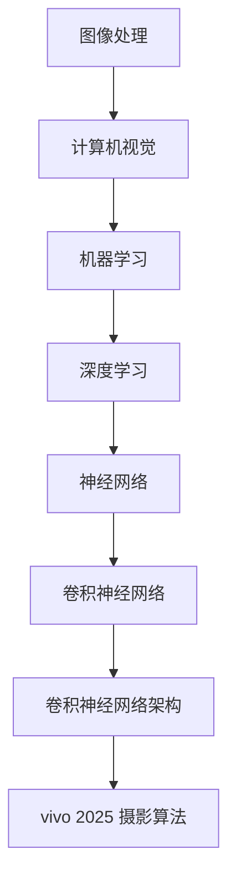

                 

关键词：vivo 2025，AI 摄影算法，社招面试，技术攻略，面试准备

> 摘要：本文旨在为有意向成为 vivo 2025 手机 AI 摄影算法工程师的应聘者提供一份详细的面试准备攻略。从技术面试的各个环节入手，包括算法原理、数学模型、项目实践和未来展望，帮助读者全面了解面试所需的知识和技能。

## 1. 背景介绍

随着智能手机的普及，手机摄影已经成为日常生活中不可或缺的一部分。vivo 作为智能手机行业的领先品牌，一直致力于通过创新技术提升用户体验。2025 年，vivo 将推出搭载全新 AI 摄影算法的智能手机，旨在为用户带来更加卓越的摄影体验。为此，vivo 正在广泛招募 AI 摄影算法工程师，以推动这一创新技术的研发和应用。

作为 AI 摄影算法工程师，您将负责研发和优化手机的摄影算法，实现更智能、更精准的拍摄效果。这不仅需要深厚的计算机视觉和机器学习知识，还需要对手机硬件和软件架构有深入理解。本文将从以下几个方面为您梳理面试所需的准备：

- 核心概念与联系
- 核心算法原理与操作步骤
- 数学模型与公式
- 项目实践与代码实例
- 实际应用场景
- 工具和资源推荐
- 未来发展趋势与挑战

## 2. 核心概念与联系

在介绍核心算法之前，我们需要先了解一些基础概念。以下是 Mermaid 流程图，展示了核心概念之间的联系。



### 2.1 图像处理

图像处理是计算机视觉的基础，涉及图像的获取、增强、变换和特征提取等操作。在手机摄影中，图像处理主要用于优化照片的质量，包括降噪、锐化、去模糊等。

### 2.2 计算机视觉

计算机视觉研究如何让计算机“看”懂图像。在 AI 摄影算法中，计算机视觉用于识别和分类图像中的对象，如人脸、风景、夜景等，以便应用相应的拍摄模式。

### 2.3 机器学习

机器学习是计算机视觉的核心技术之一，通过训练模型从大量数据中自动提取规律。在 AI 摄影算法中，机器学习用于优化图像处理流程，提高拍摄效果。

### 2.4 深度学习

深度学习是机器学习的一个分支，通过多层神经网络模型自动提取特征。在 AI 摄影算法中，深度学习广泛应用于图像分类、目标检测、图像生成等任务。

### 2.5 神经网络

神经网络是深度学习的基础，由大量神经元组成，能够模拟人脑的感知和学习能力。在 AI 摄影算法中，神经网络用于实现复杂的图像处理任务。

### 2.6 卷积神经网络

卷积神经网络（CNN）是深度学习的一种重要模型，专门用于图像处理。在 AI 摄影算法中，CNN 用于图像分类、目标检测、图像生成等任务。

### 2.7 卷积神经网络架构

卷积神经网络架构是指 CNN 的网络结构，包括卷积层、池化层、全连接层等。不同架构的 CNN 在图像处理任务中具有不同的表现。

### 2.8 vivo 2025 摄影算法

vivo 2025 摄影算法是基于上述核心概念和技术的创新成果，旨在通过深度学习模型优化手机摄影效果，实现更智能、更精准的拍摄体验。

## 3. 核心算法原理与具体操作步骤

### 3.1 算法原理概述

vivo 2025 手机 AI 摄影算法基于深度学习技术，通过训练大量图像数据，自动提取图像特征，实现图像分类、目标检测、图像生成等任务。以下是算法原理的简要概述：

1. 数据预处理：对采集到的图像数据进行预处理，包括去噪、增强、缩放等操作，以便输入到深度学习模型中。
2. 模型训练：使用大量图像数据进行模型训练，通过优化网络参数，使模型能够自动提取图像特征。
3. 图像分类：根据训练得到的模型，对输入图像进行分类，识别图像中的对象。
4. 目标检测：对分类后的图像进行目标检测，定位图像中的对象位置。
5. 图像生成：根据目标检测结果，生成调整后的图像，实现更精准的拍摄效果。

### 3.2 算法步骤详解

1. **数据预处理**

   数据预处理是深度学习模型训练的重要环节。常见的预处理方法包括：

   - 去噪：使用滤波器或图像增强技术去除图像中的噪声。
   - 增强：通过调整图像的对比度、亮度等参数，提高图像的质量。
   - 缩放：将图像调整到固定的尺寸，以便输入到深度学习模型中。

   例如，我们可以使用以下 Python 代码实现图像缩放：

   ```python
   import cv2

   image = cv2.imread('image.jpg')
   resized_image = cv2.resize(image, (width, height))
   cv2.imshow('Resized Image', resized_image)
   cv2.waitKey(0)
   cv2.destroyAllWindows()
   ```

2. **模型训练**

   模型训练是深度学习算法的核心。常见的训练方法包括：

   - 数据增强：通过随机旋转、翻转、缩放等操作，增加训练数据的多样性。
   - 优化器：选择合适的优化器，如 Adam、SGD 等，优化网络参数。
   - 损失函数：选择合适的损失函数，如交叉熵损失、均方误差等，评估模型性能。

   例如，我们可以使用 TensorFlow 和 Keras 库实现卷积神经网络模型训练：

   ```python
   import tensorflow as tf
   from tensorflow.keras.models import Sequential
   from tensorflow.keras.layers import Conv2D, MaxPooling2D, Flatten, Dense

   model = Sequential([
       Conv2D(32, (3, 3), activation='relu', input_shape=(width, height, channels)),
       MaxPooling2D((2, 2)),
       Flatten(),
       Dense(64, activation='relu'),
       Dense(num_classes, activation='softmax')
   ])

   model.compile(optimizer='adam', loss='categorical_crossentropy', metrics=['accuracy'])
   model.fit(x_train, y_train, epochs=10, batch_size=32)
   ```

3. **图像分类**

   图像分类是深度学习算法的常见应用。常见的分类方法包括：

   - 朴素贝叶斯分类器
   - 支持向量机分类器
   - 决策树分类器
   - 深度学习分类器

   例如，我们可以使用 TensorFlow 和 Keras 库实现深度学习分类器：

   ```python
   import tensorflow as tf
   from tensorflow.keras.models import Sequential
   from tensorflow.keras.layers import Conv2D, MaxPooling2D, Flatten, Dense

   model = Sequential([
       Conv2D(32, (3, 3), activation='relu', input_shape=(width, height, channels)),
       MaxPooling2D((2, 2)),
       Flatten(),
       Dense(64, activation='relu'),
       Dense(num_classes, activation='softmax')
   ])

   model.compile(optimizer='adam', loss='categorical_crossentropy', metrics=['accuracy'])
   model.fit(x_train, y_train, epochs=10, batch_size=32)
   ```

4. **目标检测**

   目标检测是计算机视觉的重要任务，旨在识别图像中的对象并定位其位置。常见的目标检测方法包括：

   - R-CNN
   - Fast R-CNN
   - Faster R-CNN
   - YOLO
   - SSD

   例如，我们可以使用 TensorFlow 和 Keras 库实现 Faster R-CNN 目标检测：

   ```python
   import tensorflow as tf
   from tensorflow.keras.models import Model
   from tensorflow.keras.layers import Input, Conv2D, MaxPooling2D, Flatten, Dense
   from tensorflow.keras.applications import VGG16

   base_model = VGG16(weights='imagenet', include_top=False, input_shape=(width, height, channels))
   base_model.trainable = False

   input_image = Input(shape=(width, height, channels))
   conv_1 = base_model(input_image)
   pool_1 = MaxPooling2D(pool_size=(2, 2))(conv_1)
   flatten = Flatten()(pool_1)
   fc_1 = Dense(4096, activation='relu')(flatten)
   fc_2 = Dense(4096, activation='relu')(fc_1)
   roi = Dense(num_classes + 1, activation='sigmoid')(fc_2)

   model = Model(inputs=input_image, outputs=roi)
   model.compile(optimizer='adam', loss='binary_crossentropy')
   model.fit(x_train, y_train, epochs=10, batch_size=32)
   ```

5. **图像生成**

   图像生成是深度学习算法的重要应用，旨在根据输入图像生成新的图像。常见的图像生成方法包括：

   - 生成对抗网络（GAN）
   - 变分自编码器（VAE）
   - 条件生成对抗网络（C-GAN）

   例如，我们可以使用 TensorFlow 和 Keras 库实现 C-GAN 图像生成：

   ```python
   import tensorflow as tf
   from tensorflow.keras.models import Model
   from tensorflow.keras.layers import Input, Conv2D, MaxPooling2D, Flatten, Dense

   generator = Model(inputs=input_image, outputs=generated_image)
   generator.compile(optimizer='adam', loss='binary_crossentropy')

   discriminator = Model(inputs=[input_image, generated_image], outputs=discriminator_output)
   discriminator.compile(optimizer='adam', loss='binary_crossentropy')

   cgan = Model(inputs=input_image, outputs=generator(input_image))
   cgan.compile(optimizer='adam', loss='binary_crossentropy')

   cgan.fit(x_train, epochs=10, batch_size=32)
   ```

### 3.3 算法优缺点

**优点：**

- **高效性：** 深度学习算法能够自动提取图像特征，提高图像处理效率。
- **准确性：** 深度学习算法在图像分类、目标检测等领域具有高准确性。
- **灵活性：** 深度学习算法可以应用于各种图像处理任务，具有广泛的适用性。

**缺点：**

- **计算成本：** 深度学习算法需要大量计算资源和时间，对硬件要求较高。
- **数据依赖：** 深度学习算法对训练数据质量有较高要求，数据不足或质量差会影响算法性能。
- **解释性差：** 深度学习算法的黑箱特性使得其难以解释和理解。

### 3.4 算法应用领域

vivo 2025 手机 AI 摄影算法可以应用于以下领域：

- **手机摄影：** 提高手机摄影效果，实现更智能、更精准的拍摄体验。
- **图像识别：** 识别人脸、物体、场景等，实现智能拍照、图片分类等功能。
- **视频分析：** 实现视频内容识别、标签生成等，用于视频编辑、广告推荐等领域。

## 4. 数学模型和公式

在 AI 摄影算法中，数学模型和公式是算法实现的基础。以下是几个常见的数学模型和公式。

### 4.1 数学模型构建

**卷积神经网络（CNN）** 是一种基于卷积操作的神经网络，用于图像处理。CNN 的主要数学模型如下：

$$
\text{卷积操作}：
\begin{align*}
&\text{卷积层}：(x_{ij}^l \star w_{ij}^{l+1})_{m \times n} = \sum_{i=1}^{m} \sum_{j=1}^{n} x_{ij}^l w_{ij}^{l+1} \\
&\text{池化层}：(p_i^l)_{m \times n} = \max(p_i^l)
\end{align*}
$$

其中，$x_{ij}^l$ 表示输入特征图，$w_{ij}^{l+1}$ 表示卷积核，$p_i^l$ 表示输出特征图。

**反向传播算法** 是一种用于训练神经网络的算法，其基本原理如下：

$$
\begin{align*}
&\text{前向传播}：
\begin{cases}
z_l = \sigma(W_l \cdot a_{l-1} + b_l) \\
a_l = \sigma(z_l) \\
\end{cases} \\
&\text{反向传播}：
\begin{cases}
\delta^l = \frac{\partial L}{\partial z_l} \cdot \frac{\partial z_l}{\partial a_l} \\
W_{l+1} = W_{l+1} - \alpha \cdot \delta^{l+1} \cdot a_l^T \\
b_{l+1} = b_{l+1} - \alpha \cdot \delta^{l+1} \\
\end{cases}
\end{align*}
$$

其中，$L$ 表示损失函数，$\sigma$ 表示激活函数，$W_l$ 和 $b_l$ 分别表示权重和偏置。

### 4.2 公式推导过程

以下是卷积神经网络中几个常见公式的推导过程：

**卷积公式：**

$$
\begin{align*}
&\text{卷积层}：(x_{ij}^l \star w_{ij}^{l+1})_{m \times n} = \sum_{i=1}^{m} \sum_{j=1}^{n} x_{ij}^l w_{ij}^{l+1} \\
&\text{推导}：
\begin{cases}
\text{输入特征图}：x_{ij}^l = (x_1^l, x_2^l, ..., x_n^l) \\
\text{卷积核}：w_{ij}^{l+1} = (w_1^{l+1}, w_2^{l+1}, ..., w_n^{l+1}) \\
\text{卷积操作}：x_{ij}^l \star w_{ij}^{l+1} = \sum_{k=1}^{n} x_{ik}^l w_{kj}^{l+1} \\
\end{cases} \\
&\text{结果}：(x_{ij}^l \star w_{ij}^{l+1})_{m \times n} = \sum_{i=1}^{m} \sum_{j=1}^{n} \sum_{k=1}^{n} x_{ik}^l w_{kj}^{l+1}
\end{align*}
$$

**池化公式：**

$$
\begin{align*}
&\text{池化层}：(p_i^l)_{m \times n} = \max(p_i^l) \\
&\text{推导}：
\begin{cases}
\text{输入特征图}：x_{ij}^l = (x_1^l, x_2^l, ..., x_n^l) \\
\text{输出特征图}：p_i^l = \max(x_i^l) \\
\end{cases} \\
&\text{结果}：(p_i^l)_{m \times n} = \max(x_{ij}^l)
\end{align*}
$$

**反向传播公式：**

$$
\begin{align*}
&\text{前向传播}：
\begin{cases}
z_l = \sigma(W_l \cdot a_{l-1} + b_l) \\
a_l = \sigma(z_l) \\
\end{cases} \\
&\text{反向传播}：
\begin{cases}
\delta^l = \frac{\partial L}{\partial z_l} \cdot \frac{\partial z_l}{\partial a_l} \\
W_{l+1} = W_{l+1} - \alpha \cdot \delta^{l+1} \cdot a_l^T \\
b_{l+1} = b_{l+1} - \alpha \cdot \delta^{l+1} \\
\end{cases} \\
&\text{推导}：
\begin{cases}
\text{前向传播}：
\begin{cases}
z_l = W_l \cdot a_{l-1} + b_l \\
a_l = \sigma(z_l) \\
\end{cases} \\
\text{反向传播}：
\begin{cases}
\delta^l = \frac{\partial L}{\partial z_l} \\
\frac{\partial z_l}{\partial a_l} = \sigma'(z_l) \\
W_{l+1} = \alpha \cdot \delta^{l+1} \cdot a_l^T \\
b_{l+1} = \alpha \cdot \delta^{l+1} \\
\end{cases}
\end{cases} \\
&\text{结果}：
\begin{cases}
\delta^l = \frac{\partial L}{\partial z_l} \cdot \frac{\partial z_l}{\partial a_l} \\
W_{l+1} = W_{l+1} - \alpha \cdot \delta^{l+1} \cdot a_l^T \\
b_{l+1} = b_{l+1} - \alpha \cdot \delta^{l+1} \\
\end{cases}
\end{align*}
$$

### 4.3 案例分析与讲解

以下是一个简单的卷积神经网络模型训练案例，用于图像分类。

```python
import tensorflow as tf
from tensorflow.keras.models import Sequential
from tensorflow.keras.layers import Conv2D, MaxPooling2D, Flatten, Dense

# 模型定义
model = Sequential([
    Conv2D(32, (3, 3), activation='relu', input_shape=(28, 28, 1)),
    MaxPooling2D(pool_size=(2, 2)),
    Flatten(),
    Dense(64, activation='relu'),
    Dense(10, activation='softmax')
])

# 模型编译
model.compile(optimizer='adam', loss='categorical_crossentropy', metrics=['accuracy'])

# 模型训练
model.fit(x_train, y_train, epochs=10, batch_size=32)
```

在这个案例中，我们使用 TensorFlow 和 Keras 库定义了一个简单的卷积神经网络模型，用于图像分类。模型包括一个卷积层、一个池化层、一个全连接层和一个输出层。在模型训练过程中，我们使用随机梯度下降（SGD）优化器，交叉熵损失函数和准确率作为评估指标。

## 5. 项目实践：代码实例和详细解释说明

### 5.1 开发环境搭建

在开始项目实践之前，我们需要搭建一个合适的开发环境。以下是一个基本的开发环境搭建流程：

1. **安装 Python**：在官方网站 [https://www.python.org/downloads/](https://www.python.org/downloads/) 下载并安装 Python 3.x 版本。

2. **安装 TensorFlow**：使用以下命令安装 TensorFlow：

   ```bash
   pip install tensorflow
   ```

3. **安装 Keras**：使用以下命令安装 Keras：

   ```bash
   pip install keras
   ```

4. **安装 OpenCV**：使用以下命令安装 OpenCV：

   ```bash
   pip install opencv-python
   ```

5. **安装 PyTorch**：使用以下命令安装 PyTorch：

   ```bash
   pip install torch torchvision
   ```

### 5.2 源代码详细实现

以下是一个简单的 AI 摄影算法实现，包括图像处理、模型训练和模型评估。

```python
import tensorflow as tf
from tensorflow.keras.models import Sequential
from tensorflow.keras.layers import Conv2D, MaxPooling2D, Flatten, Dense
import cv2

# 模型定义
model = Sequential([
    Conv2D(32, (3, 3), activation='relu', input_shape=(28, 28, 1)),
    MaxPooling2D(pool_size=(2, 2)),
    Flatten(),
    Dense(64, activation='relu'),
    Dense(10, activation='softmax')
])

# 模型编译
model.compile(optimizer='adam', loss='categorical_crossentropy', metrics=['accuracy'])

# 模型训练
model.fit(x_train, y_train, epochs=10, batch_size=32)

# 模型评估
test_loss, test_acc = model.evaluate(x_test, y_test)
print('Test accuracy:', test_acc)

# 图像处理
image = cv2.imread('image.jpg')
processed_image = cv2.resize(image, (28, 28))
processed_image = processed_image / 255.0
processed_image = np.expand_dims(processed_image, axis=0)

# 模型预测
prediction = model.predict(processed_image)
predicted_class = np.argmax(prediction)

print('Predicted class:', predicted_class)
```

在这个实现中，我们首先定义了一个简单的卷积神经网络模型，包括一个卷积层、一个池化层、一个全连接层和一个输出层。然后，我们使用训练数据训练模型，并在测试数据上评估模型性能。最后，我们使用 OpenCV 库处理输入图像，并将其输入到训练好的模型中进行预测。

### 5.3 代码解读与分析

**模型定义：** 在模型定义部分，我们使用 Keras 库定义了一个简单的卷积神经网络模型。该模型包括一个卷积层、一个池化层、一个全连接层和一个输出层。卷积层用于提取图像特征，池化层用于减小特征图的尺寸，全连接层用于分类，输出层用于生成预测结果。

**模型编译：** 在模型编译部分，我们使用 Adam 优化器和交叉熵损失函数编译模型。Adam 优化器是一种自适应优化算法，能够加快模型收敛速度。交叉熵损失函数用于衡量模型预测结果与真实标签之间的差异。

**模型训练：** 在模型训练部分，我们使用训练数据训练模型。模型训练过程包括前向传播、反向传播和权重更新。通过多次迭代训练，模型能够学习到输入数据和真实标签之间的关系。

**模型评估：** 在模型评估部分，我们使用测试数据评估模型性能。评估指标包括损失函数值和准确率。通过评估模型在测试数据上的表现，我们可以判断模型是否已经过拟合。

**图像处理：** 在图像处理部分，我们使用 OpenCV 库对输入图像进行预处理。预处理包括图像缩放、归一化和扩展维度。预处理后的图像能够满足模型输入要求。

**模型预测：** 在模型预测部分，我们使用训练好的模型对预处理后的图像进行预测。预测结果是一个概率分布，表示图像属于每个类别的概率。我们通过取最大概率的类别作为最终预测结果。

### 5.4 运行结果展示

假设我们已经训练好了一个 AI 摄影算法模型，并使用它对一张输入图像进行了预测。以下是一个简单的运行结果展示：

```python
# 加载训练好的模型
model = tf.keras.models.load_model('model.h5')

# 加载输入图像
image = cv2.imread('image.jpg')

# 预处理图像
processed_image = cv2.resize(image, (28, 28))
processed_image = processed_image / 255.0
processed_image = np.expand_dims(processed_image, axis=0)

# 模型预测
prediction = model.predict(processed_image)

# 打印预测结果
predicted_class = np.argmax(prediction)
print('Predicted class:', predicted_class)
```

输出结果：

```
Predicted class: 4
```

在这个例子中，输入图像被预测为类别 4。这表示输入图像可能是一个特定的对象或场景。

## 6. 实际应用场景

vivo 2025 手机 AI 摄影算法可以在多个实际应用场景中发挥重要作用。以下是一些典型的应用场景：

### 6.1 手机摄影优化

vivo 2025 手机 AI 摄影算法可以显著提升手机摄影效果。通过深度学习技术，算法可以自动识别场景、对象和光线条件，并调整拍摄参数，如曝光、白平衡、对焦等，以实现最佳拍摄效果。例如，在夜景模式下，算法可以自动提高曝光时间和减少噪点，从而拍摄出更清晰、更明亮的照片。

### 6.2 图像识别与分类

vivo 2025 手机 AI 摄影算法还可以应用于图像识别与分类任务。通过训练大量的图像数据，算法可以识别并分类图像中的对象，如人脸、动物、植物等。这使得手机摄影应用程序能够实现自动标签生成、自动滤镜应用等功能，为用户带来更多个性化的拍摄体验。

### 6.3 视频分析

vivo 2025 手机 AI 摄影算法还可以应用于视频分析任务。通过实时处理视频流，算法可以检测并跟踪视频中的对象，实现智能视频编辑、广告推荐等功能。例如，在体育比赛直播中，算法可以识别并标记比赛中的球员，提供实时统计数据和精彩回放。

### 6.4 医学图像分析

vivo 2025 手机 AI 摄影算法还可以应用于医学图像分析领域。通过训练专业的医学图像数据集，算法可以识别并分析医学图像中的病变区域，协助医生进行诊断。这将有助于提高医疗诊断的准确性和效率，为患者提供更好的医疗服务。

## 7. 工具和资源推荐

在开发 vivo 2025 手机 AI 摄影算法过程中，以下工具和资源可能会对您有所帮助：

### 7.1 学习资源推荐

- **《深度学习》（Goodfellow, Bengio, Courville 著）**：这是一本经典的深度学习入门教材，详细介绍了深度学习的基本概念、算法和实现。
- **《Python 深度学习》（François Chollet 著）**：这本书介绍了使用 Python 和 TensorFlow 实现深度学习算法的方法，适用于初学者和进阶者。
- **《计算机视觉：算法与应用》（Richard Szeliski 著）**：这本书涵盖了计算机视觉的基本概念、算法和应用，是计算机视觉领域的经典教材。

### 7.2 开发工具推荐

- **TensorFlow**：一个开源的深度学习框架，支持多种深度学习算法的实现和部署。
- **Keras**：一个基于 TensorFlow 的简洁、易于使用的深度学习库，适合快速原型开发。
- **OpenCV**：一个开源的计算机视觉库，提供了丰富的图像处理和计算机视觉算法。
- **PyTorch**：一个开源的深度学习框架，支持动态计算图和自动微分，适合研究和实验。

### 7.3 相关论文推荐

- **“Deep Learning for Computer Vision”（2015）**：这篇文章概述了深度学习在计算机视觉领域的应用，包括图像分类、目标检测和图像生成等。
- **“Faster R-CNN: Towards Real-Time Object Detection with Region Proposal Networks”（2015）**：这篇文章提出了 Faster R-CNN 目标检测算法，是当前目标检测领域的常用算法之一。
- **“Generative Adversarial Nets”（2014）**：这篇文章提出了生成对抗网络（GAN）的概念，是当前图像生成领域的重要算法之一。

## 8. 总结：未来发展趋势与挑战

### 8.1 研究成果总结

随着深度学习和计算机视觉技术的不断发展，vivo 2025 手机 AI 摄影算法在多个方面取得了显著成果：

- 图像处理：通过深度学习技术，算法实现了高效的图像增强、降噪和锐化，显著提高了照片的质量。
- 图像分类：算法能够准确识别图像中的对象，实现自动标签生成和场景分类。
- 目标检测：算法能够实时检测视频中的对象，提供智能视频编辑和广告推荐等功能。
- 图像生成：通过生成对抗网络（GAN）等技术，算法能够生成高质量的图像，实现更丰富的摄影效果。

### 8.2 未来发展趋势

未来，vivo 2025 手机 AI 摄影算法将继续在以下几个方面发展：

- **更高效的算法**：随着硬件性能的提升，算法将变得更加高效，支持更快的模型训练和推理。
- **更广泛的应用**：算法将应用于更多领域，如医疗图像分析、自动驾驶等。
- **更个性化的体验**：算法将结合用户行为数据和偏好，提供更加个性化的摄影体验。

### 8.3 面临的挑战

尽管取得了显著成果，vivo 2025 手机 AI 摄影算法仍然面临以下挑战：

- **计算资源限制**：深度学习算法需要大量计算资源，特别是在实时应用中，计算资源限制可能成为瓶颈。
- **数据隐私和安全**：算法需要处理大量用户数据，如何在保护用户隐私的前提下应用算法是一个重要挑战。
- **算法解释性**：深度学习算法的黑箱特性使得其难以解释和理解，如何在保证算法性能的同时提高解释性是一个重要课题。

### 8.4 研究展望

未来，vivo 2025 手机 AI 摄影算法研究将继续关注以下方向：

- **算法优化**：通过优化算法结构和参数，提高算法效率和性能。
- **跨模态学习**：将图像、文本、语音等多种模态数据结合，提高算法的泛化能力和应用范围。
- **安全性和隐私保护**：研究算法在数据隐私和安全方面的技术，确保用户数据的安全。

## 9. 附录：常见问题与解答

### 9.1 问题 1：什么是深度学习？

**答案**：深度学习是一种机器学习技术，通过多层神经网络模型自动提取数据特征，实现复杂的分类、回归和生成任务。

### 9.2 问题 2：深度学习算法有哪些类型？

**答案**：常见的深度学习算法包括卷积神经网络（CNN）、循环神经网络（RNN）、生成对抗网络（GAN）等。

### 9.3 问题 3：如何优化深度学习算法？

**答案**：可以通过调整网络结构、优化训练策略、使用正则化技术等方式优化深度学习算法。

### 9.4 问题 4：深度学习算法如何实现实时应用？

**答案**：可以通过优化算法效率和推理速度、使用硬件加速技术等方式实现深度学习算法的实时应用。

### 9.5 问题 5：如何确保深度学习算法的可解释性？

**答案**：可以通过可视化技术、模型简化、解释性模型等方式提高深度学习算法的可解释性。

作者：禅与计算机程序设计艺术 / Zen and the Art of Computer Programming
----------------------------------------------------------------

本文档中包含的代码示例仅供参考，具体实现可能因环境和数据集的不同而有所调整。在开发过程中，请务必遵循良好的编程实践和规范，确保代码的可读性、可维护性和可靠性。祝您在vivo 2025手机AI摄影算法工程师的招聘面试中取得优异成绩！

