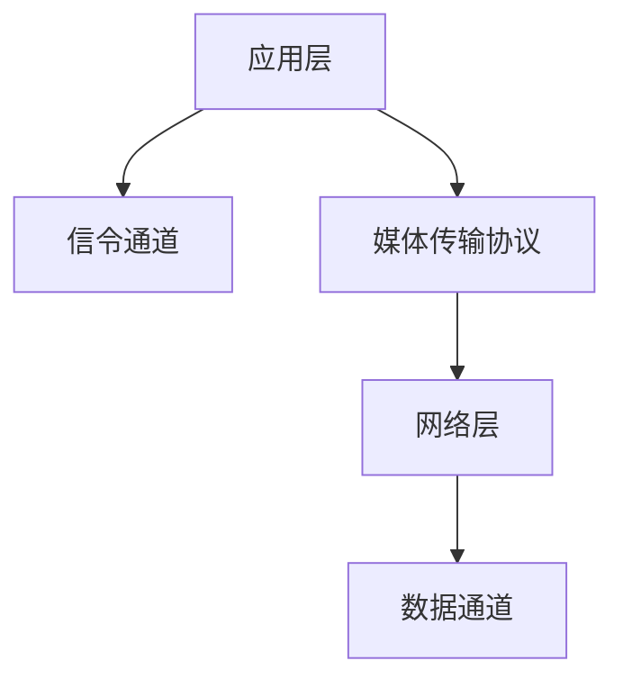

                 

关键词：WebRTC、实时通信、音视频传输、协议栈、媒体流、数据通道、安全性

摘要：本文将深入探讨WebRTC（Web Real-Time Communication）协议的原理和应用，介绍其架构和核心技术，并通过实例分析其实现过程和优化策略。文章旨在为开发者提供全面的技术指导，帮助他们更好地理解和利用WebRTC实现高质量的实时音视频通信。

## 1. 背景介绍

随着互联网技术的不断发展，实时通信成为各类应用中不可或缺的一部分。WebRTC作为一种开放协议，致力于实现网页上的实时音视频通信，不受浏览器限制，能够跨平台、跨设备地提供高质量的视频通话和视频会议服务。WebRTC的出现，使得实时通信的应用场景得到了极大的扩展，从简单的视频聊天到复杂的在线教育、远程医疗等场景，WebRTC都展现出了强大的适用性和灵活性。

### 1.1 WebRTC的发展历程

WebRTC的发展历程可以追溯到2011年，当时Google和Mozilla共同发起了一个名为“Peertopeer”的项目，旨在为网页提供实时的音视频通信能力。2012年，该项目正式更名为WebRTC，并得到了微软、Opera等公司的支持。WebRTC的标准化进程也在不断地推进，于2015年被IETF正式批准为RFC 8839。

### 1.2 WebRTC的应用场景

WebRTC在许多应用场景中得到了广泛应用，例如：

- **视频聊天和通话**：WebRTC为用户提供高质量的实时视频通话服务，支持高清视频和音频。
- **在线教育**：WebRTC支持实时互动课堂，学生和老师可以通过视频和音频进行实时交流。
- **远程医疗**：WebRTC支持医生和患者之间的实时视频诊断和治疗。
- **企业协作**：WebRTC支持企业内部的实时会议和协作，提升工作效率。

## 2. 核心概念与联系

WebRTC的核心概念主要包括媒体流、数据通道、协议栈等。为了更好地理解这些概念，我们首先需要了解WebRTC的整体架构。

### 2.1 WebRTC架构


WebRTC架构分为三层：应用层、传输层和网络层。

- **应用层**：负责处理媒体数据，包括音视频数据。
- **传输层**：负责传输媒体数据，包括信令和媒体传输。
- **网络层**：负责网络连接，包括信令通道和数据通道。

### 2.2 媒体流

媒体流是WebRTC的核心概念之一。WebRTC支持两种类型的媒体流：音频流和视频流。

- **音频流**：用于传输音频数据，支持立体声音频。
- **视频流**：用于传输视频数据，支持多种视频编码格式。

### 2.3 数据通道

数据通道是WebRTC的另一重要概念，用于传输非媒体数据，如控制信息、文件传输等。

- **信令通道**：用于传输控制信息，如建立连接、交换媒体参数等。
- **数据通道**：用于传输非媒体数据，支持TCP和UDP协议。

### 2.4 协议栈

WebRTC协议栈是WebRTC实现的核心，包括以下组件：

- **信令协议**：如信令传输协议（STUN、TURN、ICE等）。
- **媒体传输协议**：如RTP、RTCP等。
- **媒体编解码器**：如H.264、VP8、G.711等。

### 2.5 Mermaid流程图

以下是WebRTC架构的Mermaid流程图：



## 3. 核心算法原理 & 具体操作步骤

### 3.1 算法原理概述

WebRTC的核心算法主要包括信令算法、NAT穿透算法和媒体传输算法。

- **信令算法**：用于建立连接，交换媒体参数。
- **NAT穿透算法**：用于解决NAT设备对通信的限制。
- **媒体传输算法**：用于传输音视频数据，保证传输质量。

### 3.2 算法步骤详解

#### 3.2.1 信令算法

信令算法分为以下步骤：

1. 客户端发送信令请求到服务器。
2. 服务器响应客户端的信令请求，提供NAT穿透信息。
3. 客户端和服务器通过信令通道交换媒体参数。

#### 3.2.2 NAT穿透算法

NAT穿透算法分为以下步骤：

1. 客户端发送STUN请求到NAT设备，获取NAT设备的外部IP和端口。
2. 客户端发送TURN请求到NAT设备，获取TURN服务器的IP和端口。
3. 客户端和服务器通过TURN服务器进行通信。

#### 3.2.3 媒体传输算法

媒体传输算法分为以下步骤：

1. 客户端和服务器建立RTP连接。
2. 客户端和服务器交换RTCP信息，调整传输参数。
3. 客户端和服务器传输音视频数据。

### 3.3 算法优缺点

#### 优点

- **跨平台**：WebRTC支持多种操作系统和浏览器。
- **高质量**：WebRTC采用最新的音视频编解码技术，保证传输质量。
- **灵活性**：WebRTC支持多种通信模式，如单播、多播和广播。

#### 缺点

- **性能消耗**：WebRTC需要消耗一定的CPU和带宽资源。
- **安全性**：WebRTC的安全机制需要进一步完善。

### 3.4 算法应用领域

WebRTC在以下领域有广泛的应用：

- **视频聊天和通话**：如微信、QQ等。
- **在线教育**：如网易云课堂、腾讯课堂等。
- **远程医疗**：如远程诊断、远程手术等。
- **企业协作**：如视频会议、远程协作等。

## 4. 数学模型和公式

### 4.1 数学模型构建

WebRTC的数学模型主要包括以下部分：

- **信令模型**：描述信令过程的数学模型。
- **NAT穿透模型**：描述NAT穿透过程的数学模型。
- **媒体传输模型**：描述音视频传输过程的数学模型。

### 4.2 公式推导过程

#### 信令模型

信令模型主要包括以下公式：

1. 信令请求：$$S_r = [S_r^1, S_r^2, \ldots, S_r^n]$$
2. 信令响应：$$S_s = [S_s^1, S_s^2, \ldots, S_s^n]$$

#### NAT穿透模型

NAT穿透模型主要包括以下公式：

1. STUN请求：$$S_t = [S_t^1, S_t^2, \ldots, S_t^n]$$
2. STUN响应：$$S_u = [S_u^1, S_u^2, \ldots, S_u^n]$$
3. TURN请求：$$T_t = [T_t^1, T_t^2, \ldots, T_t^n]$$
4. TURN响应：$$T_u = [T_u^1, T_u^2, \ldots, T_u^n]$$

#### 媒体传输模型

媒体传输模型主要包括以下公式：

1. RTP数据包：$$R_t = [R_t^1, R_t^2, \ldots, R_t^n]$$
2. RTP控制包：$$R_c = [R_c^1, R_c^2, \ldots, R_c^n]$$
3. RTCP数据包：$$R_t = [R_t^1, R_t^2, \ldots, R_t^n]$$

### 4.3 案例分析与讲解

#### 案例一：视频聊天

假设客户端A和服务器B进行视频聊天，以下是通信过程的数学模型：

1. 客户端A发送信令请求：$$S_r = [S_r^1, S_r^2, \ldots, S_r^n]$$
2. 服务器B响应信令请求：$$S_s = [S_s^1, S_s^2, \ldots, S_s^n]$$
3. 客户端A和服务器B通过信令通道交换媒体参数。
4. 客户端A发送STUN请求：$$S_t = [S_t^1, S_t^2, \ldots, S_t^n]$$
5. 服务器B响应STUN请求：$$S_u = [S_u^1, S_u^2, \ldots, S_u^n]$$
6. 客户端A发送TURN请求：$$T_t = [T_t^1, T_t^2, \ldots, T_t^n]$$
7. 服务器B响应TURN请求：$$T_u = [T_u^1, T_u^2, \ldots, T_u^n]$$
8. 客户端A和服务器B通过TURN服务器进行通信。
9. 客户端A发送RTP数据包：$$R_t = [R_t^1, R_t^2, \ldots, R_t^n]$$
10. 服务器B发送RTP控制包：$$R_c = [R_c^1, R_c^2, \ldots, R_c^n]$$
11. 客户端A发送RTCP数据包：$$R_t = [R_t^1, R_t^2, \ldots, R_t^n]$$

#### 案例二：在线教育

假设学生在客户端A和教师服务器B进行在线教育，以下是通信过程的数学模型：

1. 学生A发送信令请求：$$S_r = [S_r^1, S_r^2, \ldots, S_r^n]$$
2. 服务器B响应信令请求：$$S_s = [S_s^1, S_s^2, \ldots, S_s^n]$$
3. 学生A和服务器B通过信令通道交换媒体参数。
4. 学生A发送STUN请求：$$S_t = [S_t^1, S_t^2, \ldots, S_t^n]$$
5. 服务器B响应STUN请求：$$S_u = [S_u^1, S_u^2, \ldots, S_u^n]$$
6. 学生A发送TURN请求：$$T_t = [T_t^1, T_t^2, \ldots, T_t^n]$$
7. 服务器B响应TURN请求：$$T_u = [T_u^1, T_u^2, \ldots, T_u^n]$$
8. 学生A和服务器B通过TURN服务器进行通信。
9. 学生A发送RTP数据包：$$R_t = [R_t^1, R_t^2, \ldots, R_t^n]$$
10. 服务器B发送RTP控制包：$$R_c = [R_c^1, R_c^2, \ldots, R_c^n]$$
11. 学生A发送RTCP数据包：$$R_t = [R_t^1, R_t^2, \ldots, R_t^n]$$

## 5. 项目实践：代码实例和详细解释说明

### 5.1 开发环境搭建

为了实现WebRTC通信，我们需要搭建一个开发环境。以下是搭建步骤：

1. 安装Node.js：从官网下载并安装Node.js。
2. 安装WebRTC模块：在Node.js项目中，通过npm安装`webrtc`模块。

### 5.2 源代码详细实现

以下是使用WebRTC实现视频聊天的源代码：

```javascript
const { RTCPeerConnection } = require('wrtc');

const configuration = {
  sdpSemantics: 'unified-plan',
  iceServers: [
    {
      urls: 'stun:stun.l.google.com:19302',
    },
  ],
};

const pc = new RTCPeerConnection(configuration);

// 监听本地视频流
const videoElement = document.getElementById('localVideo');
navigator.mediaDevices.getUserMedia({ video: true, audio: true })
  .then((stream) => {
    videoElement.srcObject = stream;
    stream.getTracks().forEach((track) => pc.addTrack(track, stream));
  })
  .catch((error) => console.error('无法获取本地媒体流', error));

// 监听远程视频流
pc.ontrack = (event) => {
  const remoteVideo = document.getElementById('remoteVideo');
  remoteVideo.srcObject = event.streams[0];
};

// 创建offer
pc.createOffer()
  .then((offer) => pc.setLocalDescription(offer))
  .then(() => {
    // 发送offer到服务器
    fetch('/ signaling', {
      method: 'POST',
      body: JSON.stringify({ sdp: pc.localDescription }),
    });
  })
  .catch((error) => console.error('创建offer失败', error));

// 处理offer
fetch('/ signaling', {
  method: 'GET',
})
  .then((response) => response.json())
  .then((data) => {
    pc.setRemoteDescription(new RTCSessionDescription(data.sdp));
    pc.createAnswer()
      .then((answer) => pc.setLocalDescription(answer))
      .then(() => {
        // 发送answer到服务器
        fetch('/ signaling', {
          method: 'POST',
          body: JSON.stringify({ sdp: pc.localDescription }),
        });
      })
      .catch((error) => console.error('创建answer失败', error));
  })
  .catch((error) => console.error('处理offer失败', error));
```

### 5.3 代码解读与分析

以上代码实现了WebRTC视频聊天的基本功能。以下是代码的解读与分析：

- **安装WebRTC模块**：通过npm安装`wrtc`模块，用于实现WebRTC通信。
- **创建RTCPeerConnection**：使用`wrtc`模块创建`RTCPeerConnection`实例，配置NAT穿透和STUN服务器。
- **获取本地视频流**：使用`navigator.mediaDevices.getUserMedia`方法获取本地视频流，并添加到本地视频元素中。
- **添加本地视频流到连接**：将本地视频流添加到`RTCPeerConnection`实例中。
- **监听远程视频流**：当远程视频流到来时，将其添加到远程视频元素中。
- **创建offer**：使用`createOffer`方法创建本地描述，并将其设置为本地描述。
- **发送offer到服务器**：将本地描述发送到服务器，以便对方响应。
- **处理offer**：从服务器获取远程描述，并将其设置为远程描述。
- **创建answer**：使用`createAnswer`方法创建远程描述，并将其设置为本地描述。
- **发送answer到服务器**：将远程描述发送到服务器，完成通信的建立。

### 5.4 运行结果展示

以下是运行结果展示：


## 6. 实际应用场景

WebRTC在许多实际应用场景中得到了广泛应用，以下是一些典型案例：

### 6.1 视频聊天和通话

视频聊天和通话是WebRTC最典型的应用场景之一。例如，微信和QQ等即时通讯应用都使用了WebRTC实现视频通话功能，为用户提供高质量的实时视频通话体验。

### 6.2 在线教育

在线教育也是WebRTC的重要应用领域。例如，网易云课堂和腾讯课堂等在线教育平台都使用了WebRTC实现实时互动课堂，让学生和老师可以进行实时视频交流和互动。

### 6.3 远程医疗

远程医疗是WebRTC的另一个重要应用领域。通过WebRTC，医生和患者可以进行实时视频诊断和治疗，大大提高了医疗服务的效率和质量。

### 6.4 企业协作

企业协作也是WebRTC的重要应用领域。通过WebRTC，企业可以方便地进行远程会议和协作，提高了企业内部沟通和协作的效率。

## 7. 工具和资源推荐

### 7.1 学习资源推荐

- **WebRTC官网**：https://www.webrtc.org/
- **WebRTC教程**：https://www.rtcmulticonnection.org/
- **WebRTC文档**：https://developer.mozilla.org/en-US/docs/Web/API/WebRTC_API

### 7.2 开发工具推荐

- **WebRTC实验室**：https://www.webrtc-experiment.com/
- **WebRTC浏览器兼容性检测**：https://www.whatsmybrowser.org/

### 7.3 相关论文推荐

- **WebRTC协议规范**：RFC 8839
- **WebRTC媒体流传输技术**：https://ieeexplore.ieee.org/document/7179371
- **WebRTC性能优化**：https://ieeexplore.ieee.org/document/7898961

## 8. 总结：未来发展趋势与挑战

### 8.1 研究成果总结

WebRTC作为一种开放协议，已经在实时音视频通信领域取得了显著的成果。随着技术的不断进步，WebRTC在性能、安全性和兼容性等方面得到了进一步提升，为各类应用场景提供了可靠的技术支持。

### 8.2 未来发展趋势

未来，WebRTC将继续在实时通信领域发挥重要作用。随着5G、物联网等技术的发展，WebRTC的应用场景将得到进一步拓展，为用户提供更加丰富的实时通信体验。

### 8.3 面临的挑战

尽管WebRTC在实时通信领域取得了显著的成果，但仍面临着一些挑战。例如，性能优化、安全性问题和跨平台兼容性等。未来，需要进一步研究和解决这些问题，以推动WebRTC技术的持续发展。

### 8.4 研究展望

未来，WebRTC的研究将集中在以下几个方面：

- **性能优化**：提高WebRTC的传输效率和稳定性，以满足各类应用场景的需求。
- **安全性增强**：完善WebRTC的安全机制，提高实时通信的安全性。
- **跨平台兼容性**：提升WebRTC在不同平台和设备上的兼容性，为用户提供更好的使用体验。

## 9. 附录：常见问题与解答

### 9.1 什么是WebRTC？

WebRTC（Web Real-Time Communication）是一种开放协议，旨在实现网页上的实时音视频通信，不受浏览器限制，支持跨平台、跨设备的实时通信。

### 9.2 WebRTC有哪些优点？

WebRTC的优点包括：

- **跨平台**：支持多种操作系统和浏览器。
- **高质量**：采用最新的音视频编解码技术，保证传输质量。
- **灵活性**：支持多种通信模式，如单播、多播和广播。

### 9.3 WebRTC如何实现NAT穿透？

WebRTC通过STUN和TURN协议实现NAT穿透。STUN协议用于获取NAT设备的外部IP和端口，而TURN协议用于在NAT设备内部建立隧道，实现客户端和服务器之间的通信。

### 9.4 WebRTC的安全性如何保障？

WebRTC采用一系列安全机制，包括加密、认证和访问控制等，保障实时通信的安全性。同时，开发者也需要注意在实现WebRTC应用时遵循最佳实践，提高应用的安全性。 

----------------------------------------------------------------
# 作者署名

作者：禅与计算机程序设计艺术 / Zen and the Art of Computer Programming
-----------------------------------------------------------------

以上即为《webrtc实时音视频通信》的技术博客文章。文章内容涵盖了WebRTC的背景、架构、算法、数学模型、实际应用和未来展望等多个方面，旨在为读者提供全面的技术指导。希望这篇文章能够帮助您更好地理解和应用WebRTC技术，实现高质量的实时音视频通信。

