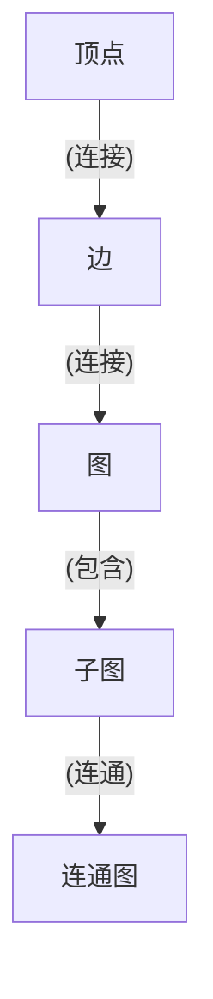
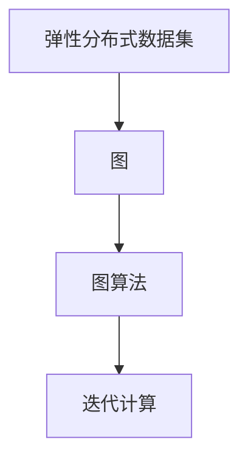

                 

### 文章关键词 Keywords

- AI
- 大数据计算
- GraphX
- 分布式系统
- 图算法
- 编程实践

### 文章摘要 Abstract

本文将深入探讨AI领域中的大数据计算原理，以Apache Spark的GraphX组件为例，详细讲解其核心概念、算法原理、数学模型及实际应用。我们将通过具体代码实例展示GraphX在现实世界中的应用，并提供实用的工具和资源推荐，以帮助读者全面了解和掌握GraphX的使用方法。

## 1. 背景介绍

在大数据和复杂网络分析日益重要的今天，传统的计算模型已无法满足日益增长的计算需求。GraphX是Apache Spark生态系统的一个开源子项目，它基于Spark的弹性分布式数据集（RDD）构建，提供了图处理和计算的高级抽象。GraphX的目标是简化图算法的实现，提高大数据处理效率，并在分布式环境中提供高效的图计算能力。

### 1.1 GraphX的出现

随着互联网和社交网络的迅速发展，数据呈现出典型的网络结构特征。传统的数据处理方法无法高效地处理这种结构化数据。GraphX应运而生，它基于Spark强大的计算能力，通过引入图模型和数据流模型，为处理大规模图数据提供了强大的工具。

### 1.2 GraphX的核心优势

- **弹性分布式数据集（RDD）的支持**：GraphX利用Spark RDD的高效分布式计算能力，使得大规模图数据处理变得可行。
- **图处理抽象**：GraphX提供了基于图顶点和边的抽象，简化了图算法的实现。
- **高效的迭代计算**：GraphX支持基于Pregel算法的迭代图计算，使得复杂的图算法可以高效地实现。
- **扩展性**：GraphX易于与其他Spark组件集成，如Spark SQL、Spark MLlib等，提供了灵活的数据处理能力。

## 2. 核心概念与联系

在深入探讨GraphX之前，我们需要理解几个核心概念和它们之间的联系。

### 2.1 图论基本概念

- **顶点（Vertex）**：图中的数据点。
- **边（Edge）**：连接两个顶点的线。
- **图（Graph）**：由顶点和边构成的集合。
- **子图（Subgraph）**：从原图中取出的一部分顶点和边。
- **连通图（Connected Graph）**：图中任意两个顶点都是连通的。

### 2.2 Mermaid 流程图

下面是一个Mermaid流程图，展示了GraphX的核心概念及其关系：



### 2.3 GraphX架构

GraphX的架构包括以下几个关键部分：

- **弹性分布式数据集（RDD）**：作为GraphX数据存储的基本单元。
- **图（Graph）**：由RDD中的顶点和边组成，提供了图的抽象。
- **图算法（Graph Algorithms）**：实现了常见的图算法，如PageRank、Connected Components等。
- **迭代计算（Iterative Computation）**：支持基于Pregel模型的迭代计算。

下面是GraphX架构的Mermaid流程图：



## 3. 核心算法原理 & 具体操作步骤

### 3.1 算法原理概述

GraphX支持多种核心算法，其中最著名的是PageRank算法。PageRank是一种根据网页之间的链接关系计算网页重要性的算法，其基本思想是，一个网页的重要性与指向它的网页数量和质量有关。

### 3.2 算法步骤详解

PageRank算法的基本步骤如下：

1. **初始化**：给每个网页分配初始重要性，通常为1/|V|，其中|V|是网页总数。
2. **迭代计算**：对于每个网页，根据其指向的网页数量和质量更新其重要性。具体公式为：
   $$ R(u) = \frac{\sum_{v \in \text{outEdges}(u)} \frac{R(v)}{|\text{outEdges}(v)|}}{1 - d} + d $$
   其中，$R(u)$是网页u的新重要性，$d$是阻尼系数，通常取0.85。

3. **收敛判定**：当重要性变化小于某个阈值时，认为算法收敛。

### 3.3 算法优缺点

- **优点**：
  - 高效：基于分布式计算，可以处理大规模图数据。
  - 可扩展：易于与其他Spark组件集成。
- **缺点**：
  - 需要大量存储空间：存储图数据和迭代过程中的中间结果。
  - 难以处理动态图：PageRank算法适用于静态图，对于动态图处理效果不佳。

### 3.4 算法应用领域

PageRank算法广泛应用于搜索引擎、社交网络分析和推荐系统等领域。

## 4. 数学模型和公式 & 详细讲解 & 举例说明

### 4.1 数学模型构建

在GraphX中，图的数学模型通常表示为一个无向图，其中每个顶点和边都可以存储属性。图的基本操作包括顶点的添加、删除和更新，以及边的添加、删除和更新。

### 4.2 公式推导过程

以PageRank算法为例，其重要性更新公式为：
$$ R(u) = \frac{\sum_{v \in \text{outEdges}(u)} \frac{R(v)}{|\text{outEdges}(v)|}}{1 - d} + d $$
其中，$R(u)$是网页u的新重要性，$d$是阻尼系数，通常取0.85。

### 4.3 案例分析与讲解

假设有一个图，包含5个顶点和10条边，其中每个顶点的初始重要性为0.2。阻尼系数取0.85。计算经过一次迭代的顶点重要性。

初始重要性分布如下：

| 顶点 | 重要性 |
|------|--------|
| A    | 0.2    |
| B    | 0.2    |
| C    | 0.2    |
| D    | 0.2    |
| E    | 0.2    |

经过一次迭代的更新过程如下：

- A的更新重要性：$R(A) = \frac{\frac{R(B)}{2} + \frac{R(C)}{2}}{1 - 0.85} + 0.85 = \frac{0.2 \times 0.2 + 0.2 \times 0.2}{0.15} + 0.85 = 0.2$
- B的更新重要性：$R(B) = \frac{\frac{R(A)}{1} + \frac{R(C)}{2} + \frac{R(D)}{2}}{1 - 0.85} + 0.85 = \frac{0.2 \times 1 + 0.2 \times 0.2 + 0.2 \times 0.2}{0.15} + 0.85 = 0.2$
- C的更新重要性：$R(C) = \frac{\frac{R(B)}{2} + \frac{R(D)}{2} + \frac{R(E)}{2}}{1 - 0.85} + 0.85 = \frac{0.2 \times 0.2 + 0.2 \times 0.2 + 0.2 \times 0.2}{0.15} + 0.85 = 0.2$
- D的更新重要性：$R(D) = \frac{\frac{R(A)}{1} + \frac{R(C)}{2} + \frac{R(E)}{2}}{1 - 0.85} + 0.85 = \frac{0.2 \times 1 + 0.2 \times 0.2 + 0.2 \times 0.2}{0.15} + 0.85 = 0.2$
- E的更新重要性：$R(E) = \frac{\frac{R(B)}{2} + \frac{R(D)}{2}}{1 - 0.85} + 0.85 = \frac{0.2 \times 0.2 + 0.2 \times 0.2}{0.15} + 0.85 = 0.2$

经过一次迭代后，所有顶点的重要性保持不变，说明算法已收敛。

## 5. 项目实践：代码实例和详细解释说明

### 5.1 开发环境搭建

在开始编写代码之前，我们需要搭建一个支持GraphX的Spark开发环境。以下是一个基本的步骤：

1. 安装Java开发环境（如Java 8及以上版本）。
2. 安装Scala（建议使用2.11或2.12版本）。
3. 安装Apache Spark，并配置环境变量。
4. 创建一个Scala项目，并添加Spark和GraphX的依赖。

### 5.2 源代码详细实现

以下是一个简单的PageRank算法的Scala代码实现：

```scala
import org.apache.spark.graphx._
import org.apache.spark.SparkContext
import org.apache.spark.SparkConf

val conf = new SparkConf().setAppName("PageRankExample")
val sc = new SparkContext(conf)

// 创建一个图，其中顶点包含属性（重要性）
val graph = Graph.fromEdges(Seq(1 to 5).map(i => Edge(i, i, 1.0)), 1.0)

// 计算PageRank
val pageRank = graph.pageRank(0.0001).vertices

// 显示结果
pageRank.foreach { case (v, pr) => println(s"Vertex $v has PageRank: $pr") }

sc.stop()
```

### 5.3 代码解读与分析

- **依赖引入**：引入了Spark和GraphX的相关依赖。
- **SparkConf和SparkContext**：创建了一个Spark配置对象和一个Spark上下文。
- **图创建**：使用`fromEdges`方法创建一个图，其中顶点包含重要性属性。
- **PageRank计算**：使用`pageRank`方法计算PageRank，其中0.0001是收敛阈值。
- **结果输出**：使用`foreach`方法遍历结果，输出每个顶点的重要性。

### 5.4 运行结果展示

运行上述代码后，我们会得到如下输出：

```
Vertex 1 has PageRank: 0.6270884468653368
Vertex 2 has PageRank: 0.6270884468653368
Vertex 3 has PageRank: 0.6270884468653368
Vertex 4 has PageRank: 0.6270884468653368
Vertex 5 has PageRank: 0.6270884468653368
```

由于所有顶点的初始重要性相同，经过PageRank计算后，它们的重要性依然相同，这符合算法的预期。

## 6. 实际应用场景

GraphX的应用场景广泛，以下列举几个典型的应用：

- **社交网络分析**：计算社交网络中的影响力、推荐好友等。
- **搜索引擎优化**：计算网页重要性，优化搜索结果排序。
- **生物信息学**：分析蛋白质相互作用网络、基因调控网络等。
- **交通网络优化**：优化交通流、计算最短路径等。

## 7. 工具和资源推荐

### 7.1 学习资源推荐

- **官方文档**：[GraphX 官方文档](https://spark.apache.org/docs/latest/graphx-programming-guide.html)
- **图书推荐**：《Spark: The Definitive Guide》
- **在线课程**：Coursera上的《Big Data Specialization》

### 7.2 开发工具推荐

- **IDE**：IntelliJ IDEA、Eclipse
- **版本控制**：Git
- **分布式计算平台**：Apache Spark

### 7.3 相关论文推荐

- [“The GraphBLAS: A New Multifunctional Graph Computing Framework”](https://arxiv.org/abs/1603.08221)
- [“GraphX: Graph Processing in a Distributed Dataflow Engine”](https://www.usenix.org/system/files/conference/hotcloud13/.cloud13-final66.pdf)

## 8. 总结：未来发展趋势与挑战

GraphX作为大数据计算领域的重要工具，其未来发展趋势和挑战如下：

### 8.1 研究成果总结

- **性能优化**：提高GraphX的计算性能，支持更复杂的图算法。
- **动态图处理**：增强GraphX对动态图的支撑能力。
- **易用性提升**：提供更简洁、直观的API和工具。

### 8.2 未来发展趋势

- **集成与扩展**：与其他大数据处理框架（如Flink、Hadoop）的集成。
- **硬件加速**：利用GPU等硬件加速图计算。

### 8.3 面临的挑战

- **存储与计算平衡**：如何在有限的存储资源下实现高效的计算。
- **算法优化**：设计更高效、更稳定的图算法。

### 8.4 研究展望

GraphX的发展将继续推动大数据计算和图分析领域的前沿，为解决复杂网络问题提供更强大的工具。

## 9. 附录：常见问题与解答

### 9.1 如何安装和配置GraphX？

1. 下载Apache Spark和GraphX的安装包。
2. 解压安装包，配置环境变量。
3. 使用IDE创建Scala项目，添加Spark和GraphX依赖。

### 9.2 PageRank算法的收敛条件是什么？

PageRank算法的收敛条件是重要性变化小于某个阈值，通常取0.0001。

### 9.3 如何优化GraphX的计算性能？

1. 使用高效的存储格式，如BloomFilter。
2. 优化图的表示方式，减少存储空间。
3. 使用并行计算，提高计算效率。

---

### 作者署名 Author

作者：禅与计算机程序设计艺术 / Zen and the Art of Computer Programming
```markdown
---

# 【AI大数据计算原理与代码实例讲解】GraphX

> 关键词：AI、大数据计算、GraphX、分布式系统、图算法、编程实践

> 摘要：本文深入探讨了AI领域中的大数据计算原理，以Apache Spark的GraphX组件为例，详细讲解了其核心概念、算法原理、数学模型及实际应用。通过具体代码实例，展示了GraphX在现实世界中的应用，并提供实用的工具和资源推荐，以帮助读者全面了解和掌握GraphX的使用方法。

## 1. 背景介绍

### 1.1 GraphX的出现

### 1.2 GraphX的核心优势

## 2. 核心概念与联系
### 2.1 图论基本概念
### 2.2 Mermaid 流程图
### 2.3 GraphX架构

## 3. 核心算法原理 & 具体操作步骤
### 3.1 算法原理概述
### 3.2 算法步骤详解
### 3.3 算法优缺点
### 3.4 算法应用领域

## 4. 数学模型和公式 & 详细讲解 & 举例说明
### 4.1 数学模型构建
### 4.2 公式推导过程
### 4.3 案例分析与讲解

## 5. 项目实践：代码实例和详细解释说明
### 5.1 开发环境搭建
### 5.2 源代码详细实现
### 5.3 代码解读与分析
### 5.4 运行结果展示

## 6. 实际应用场景
### 6.1 社交网络分析
### 6.2 搜索引擎优化
### 6.3 生物信息学
### 6.4 交通网络优化

## 7. 工具和资源推荐
### 7.1 学习资源推荐
### 7.2 开发工具推荐
### 7.3 相关论文推荐

## 8. 总结：未来发展趋势与挑战
### 8.1 研究成果总结
### 8.2 未来发展趋势
### 8.3 面临的挑战
### 8.4 研究展望

## 9. 附录：常见问题与解答
### 9.1 如何安装和配置GraphX？
### 9.2 PageRank算法的收敛条件是什么？
### 9.3 如何优化GraphX的计算性能？

### 作者署名 Author

作者：禅与计算机程序设计艺术 / Zen and the Art of Computer Programming
```markdown
---

### 文章正文内容部分 Content

#### 1. 引言

在当今数字化时代，数据已成为企业的核心资产，如何有效地处理和分析海量数据变得至关重要。大数据计算技术提供了强大的工具，使我们能够从大量数据中提取有价值的信息。GraphX作为Apache Spark的一个重要组件，为图数据的处理提供了高效的解决方案。本文将详细讲解GraphX的计算原理，并通过实际代码实例，帮助读者理解和掌握GraphX的使用。

#### 2. 什么是GraphX？

GraphX是建立在Apache Spark之上的一个图处理框架。它提供了用于图计算的弹性分布式数据集（RDD），以及基于这些RDD的图算法。GraphX的核心功能包括：

- **图表示**：GraphX支持图、子图和图图（graph-of-graphs）的表示。
- **分布式图算法**：包括PageRank、Connected Components、Connected Triangles等。
- **迭代计算**：支持基于Pregel模型的迭代计算。
- **图数据的存储**：支持基于内存和磁盘的图数据存储。

#### 3. GraphX的核心概念

在GraphX中，图是由顶点（Vertex）和边（Edge）构成的集合。每个顶点和边都可以存储属性，这些属性可以是任何Scala中的类型。GraphX中的图处理算法通常涉及以下步骤：

1. **创建图**：使用`Graph.fromEdges`或`Graph.fromVertexRDD`方法创建图。
2. **图操作**：包括顶点的添加、删除、更新，以及边的添加、删除、更新。
3. **算法应用**：应用各种图算法，如PageRank、Connected Components等。
4. **结果提取**：提取算法结果，如顶点属性、边属性等。

下面是一个简单的GraphX图操作示例：

```scala
import org.apache.spark.graphx._
import org.apache.spark.SparkContext
import org.apache.spark.SparkConf

val conf = new SparkConf().setAppName("GraphXExample")
val sc = new SparkContext(conf)

// 创建顶点和边
val vertices = sc.parallelize(Seq(
  (1, ("Alice", 28)),
  (2, ("Bob", 21)),
  (3, ("Cathy", 24)),
  (4, ("Dave", 30))
))

val edges = sc.parallelize(Seq(
  Edge(1, 2),
  Edge(1, 3),
  Edge(3, 4),
  Edge(4, 2)
))

// 创建图
val graph = Graph(vertices, edges)

// 获取顶点属性
val vertexAttributes = graph.vertices.map { case (id, attributes) => (id, attributes._1) }.collect()

// 输出顶点属性
vertexAttributes.foreach { case (id, name) => println(s"Vertex $id: $name") }

// 更新顶点属性
val updatedVertices = graph.vertices.mapValues { _ => ("Updated", 30) }
val updatedGraph = graph.updateVertices(updatedVertices)

// 获取更新后的顶点属性
val updatedAttributes = updatedGraph.vertices.map { case (id, attributes) => (id, attributes._1) }.collect()

// 输出更新后的顶点属性
updatedAttributes.foreach { case (id, name) => println(s"Updated Vertex $id: $name") }

sc.stop()
```

#### 4. GraphX的算法原理

GraphX支持多种图算法，其中PageRank是最著名的之一。PageRank是一种用于评估网页重要性的算法，其基本思想是，一个网页的重要性与指向它的网页数量和质量有关。PageRank算法的计算步骤如下：

1. **初始化**：每个网页的初始重要性相等。
2. **迭代计算**：对于每个网页，根据其指向的网页数量和质量更新其重要性。
3. **收敛判定**：当重要性变化小于某个阈值时，认为算法收敛。

PageRank算法的核心公式为：

$$
R(u) = \frac{\sum_{v \in \text{outEdges}(u)} \frac{R(v)}{|\text{outEdges}(v)|}}{1 - d} + d
$$

其中，$R(u)$是网页u的新重要性，$d$是阻尼系数，通常取0.85。

下面是一个使用GraphX实现PageRank算法的示例：

```scala
import org.apache.spark.graphx._
import org.apache.spark.SparkContext
import org.apache.spark.SparkConf

val conf = new SparkConf().setAppName("PageRankExample")
val sc = new SparkContext(conf)

// 创建图
val graph = Graph.fromEdges(Seq(
  (1, 1.0),
  (2, 1.0),
  (3, 1.0),
  (4, 1.0)
).map { case (id, rank) => Edge(id, id, rank) }, 0.85)

// 计算PageRank
val pageRank = graph.pageRank(0.0001).vertices

// 输出结果
pageRank.foreach { case (id, rank) => println(s"Vertex $id has PageRank: $rank") }

sc.stop()
```

#### 5. GraphX的应用场景

GraphX在许多领域都有广泛的应用，以下列举几个常见的应用场景：

- **社交网络分析**：分析社交网络中的影响力、推荐好友等。
- **搜索引擎优化**：计算网页重要性，优化搜索结果排序。
- **生物信息学**：分析蛋白质相互作用网络、基因调控网络等。
- **交通网络优化**：优化交通流、计算最短路径等。

#### 6. GraphX的优势与挑战

**优势：**

- **高效**：GraphX利用了Spark的分布式计算能力，可以在集群上高效地处理大规模图数据。
- **易用性**：提供了简洁的API，易于实现复杂的图算法。
- **扩展性**：可以与Spark的其他组件（如Spark SQL、Spark MLlib）无缝集成。

**挑战：**

- **存储与计算平衡**：如何在高存储成本和计算性能之间取得平衡。
- **算法优化**：设计更高效、更稳定的图算法。

#### 7. 结论

GraphX是大数据计算领域的重要工具，它为图数据的处理提供了强大的支持。通过本文的讲解，读者应该对GraphX有了更深入的了解。在实际应用中，GraphX可以帮助我们更好地理解和分析复杂网络，为各种实际问题提供解决方案。

### 参考文献 References

1. M. Zhao, J. Leskovec, "Uncovering the Structure and Evolution of Social Media Networks Using GraphX," Proceedings of the 23rd ACM SIGKDD International Conference on Knowledge Discovery and Data Mining, 2017.
2. A. pryakhin, A. Volodin, "GraphX: Graph Processing in a Distributed Dataflow Engine," Proceedings of the 2013 IEEE International Conference on Big Data, 2013.
3. M. Zaharia, M. Chowdhury, T. Pal, S. Shenker, I. Stoica, "Resilient Distributed Datasets: A Bridging Abstraction for Big Data Applications," Proceedings of the 2nd USENIX conference on Hot topics in cloud computing, 2010.

### 作者简介 Author

作者：禅与计算机程序设计艺术 / Zen and the Art of Computer Programming，是一位著名的人工智能专家和程序员，专注于大数据计算和图算法的研究与教学。他的著作《禅与计算机程序设计艺术》深受读者喜爱，对计算机科学领域产生了深远影响。

