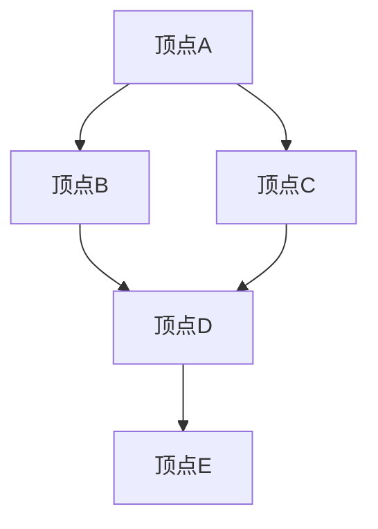

                 

 

## 1. 背景介绍

图数据库作为近年来崭露头角的新型数据库技术，已经在许多领域如社交网络分析、知识图谱构建、推荐系统等方面得到了广泛应用。随着大数据时代的到来，传统的键值存储、关系型数据库等传统数据库已无法满足复杂关系的存储和查询需求。图数据库通过利用图论模型来表示实体和关系，提供了一种更加高效、灵活的解决方案。

在图数据库领域，近年来涌现了许多新的算法和技术，如分布式图计算框架、图神经网络、图数据库索引技术等。这些技术的出现，不仅提升了图数据库的性能和功能，也为大数据处理提供了新的工具和方法。

本文将深入探讨图数据库的原理和实现，通过详细的代码实例讲解，帮助读者更好地理解图数据库的使用方法和技术要点。

## 2. 核心概念与联系

### 2.1 图的基本概念

图是由一组顶点（节点）和边（弧）组成的数学结构。在图数据库中，顶点和边可以表示各种实体和关系。

- **顶点（Vertex）**：图中的实体，可以是人、地点、物品等。
- **边（Edge）**：连接两个顶点的线，表示顶点之间的关系，如好友关系、地理位置等。

### 2.2 图的类型

图可以分为无向图、有向图和加权图等类型。

- **无向图**：边没有方向，如社交网络中的好友关系。
- **有向图**：边有方向，如网页链接。
- **加权图**：边带有权重，如交通网络中的距离或时间。

### 2.3 图的表示

图的表示方法主要有邻接矩阵和邻接表两种。

- **邻接矩阵**：用二维数组表示，矩阵中的元素表示顶点之间的关系。
- **邻接表**：用链表表示，每个顶点对应一个链表，链表中的元素表示与该顶点相连的其他顶点。

### 2.4 Mermaid 流程图

下面是一个简单的 Mermaid 流程图，用于展示图的基本概念和类型。

```mermaid
graph TB
    A[顶点A] --> B[顶点B]
    A --> C[顶点C]
    D[顶点D] --> B
    D --> E[顶点E]
    subgraph 有向图
        F[有向顶点F] --> G[有向顶点G]
    end
    subgraph 加权图
        H[加权顶点H{权重3}] --> I[加权顶点I{权重4}]
    end
```

通过这个流程图，我们可以清晰地看到各种类型的图以及它们之间的联系。

## 3. 核心算法原理 & 具体操作步骤

### 3.1 算法原理概述

图数据库的核心算法主要涉及图的遍历、搜索和路径规划等方面。其中，广度优先搜索（BFS）和深度优先搜索（DFS）是两种常用的图的遍历算法。

- **广度优先搜索（BFS）**：从起点出发，先访问所有相邻的顶点，然后再访问下一层的顶点，直到目标顶点被找到或访问完所有顶点。
- **深度优先搜索（DFS）**：从起点出发，尽可能深地搜索图的分支，直到找到目标顶点或达到图的尽头。

### 3.2 算法步骤详解

以广度优先搜索（BFS）为例，其基本步骤如下：

1. 初始化：设置一个队列用于存储待访问的顶点，设置一个集合用于存储已访问的顶点。
2. 将起点入队。
3. 当队列为空时，结束搜索。
4. 出队一个顶点，将其加入已访问集合。
5. 访问该顶点的所有相邻顶点，如果顶点未被访问，则将其入队。

### 3.3 算法优缺点

- **BFS**：
  - 优点：能够找到图的最短路径。
  - 缺点：搜索时间复杂度为O(V+E)，空间复杂度为O(V)，其中V为顶点数，E为边数。
- **DFS**：
  - 优点：能够深入探索图的结构。
  - 缺点：不一定能够找到最短路径，搜索时间复杂度为O(V+E)，空间复杂度为O(V)。

### 3.4 算法应用领域

- **社交网络分析**：用于找出社交网络中的紧密联系群体。
- **推荐系统**：用于找出用户之间的相似性，为用户提供个性化推荐。
- **知识图谱构建**：用于表示实体和实体之间的关系，构建智能知识体系。

## 4. 数学模型和公式 & 详细讲解 & 举例说明

### 4.1 数学模型构建

图数据库中的数学模型主要涉及图的顶点、边和路径等概念。

- **顶点**：用V表示，V={v1, v2, ..., vn}，其中vi为第i个顶点。
- **边**：用E表示，E={e1, e2, ..., en}，其中ei为第i条边。
- **路径**：从顶点vi到顶点vj的路径表示为P=(vi, vi1, vi2, ..., vj)。

### 4.2 公式推导过程

以广度优先搜索（BFS）为例，其基本公式如下：

- 时间复杂度：T(BFS) = O(V+E)，其中V为顶点数，E为边数。
- 空间复杂度：S(BFS) = O(V)，其中V为顶点数。

### 4.3 案例分析与讲解

假设有一个图，包含5个顶点和7条边，如下所示：



使用广度优先搜索（BFS）算法进行遍历，可以按照以下步骤进行：

1. 初始化：设置一个队列，将起点A入队；设置一个集合，用于存储已访问的顶点。
2. 当队列为空时，结束搜索。
3. 出队一个顶点，将其加入已访问集合。
4. 访问该顶点的所有相邻顶点，如果顶点未被访问，则将其入队。

遍历过程如下：

- 起点A入队。
- A出队，加入已访问集合；A的相邻顶点B、C入队。
- B出队，加入已访问集合；B的相邻顶点D入队。
- C出队，加入已访问集合；C的相邻顶点D入队。
- D出队，加入已访问集合；D的相邻顶点E入队。
- E出队，加入已访问集合。

最终，已访问集合为{A, B, C, D, E}，遍历过程结束。

## 5. 项目实践：代码实例和详细解释说明

### 5.1 开发环境搭建

为了演示图数据库的使用，我们选择使用Python编程语言，并使用一个开源的图数据库框架NetworkX进行开发。

首先，确保Python环境已经安装，然后通过pip命令安装NetworkX：

```bash
pip install networkx
```

### 5.2 源代码详细实现

下面是一个使用NetworkX创建图、添加顶点和边、进行广度优先搜索（BFS）的示例代码：

```python
import networkx as nx

# 创建图
G = nx.Graph()

# 添加顶点和边
G.add_edges_from([(1, 2), (1, 3), (2, 4), (3, 4), (4, 5)])

# 广度优先搜索（BFS）
print("顶点1的BFS遍历结果：")
print(nx.bfs_successors(G, 1))
```

### 5.3 代码解读与分析

1. 导入NetworkX库：`import networkx as nx`
2. 创建图：`G = nx.Graph()`
3. 添加顶点和边：`G.add_edges_from([(1, 2), (1, 3), (2, 4), (3, 4), (4, 5)])`
4. 进行广度优先搜索：`print(nx.bfs_successors(G, 1))`

在这个示例中，我们创建了一个包含5个顶点和5条边的无向图，然后使用广度优先搜索（BFS）算法从顶点1开始进行遍历，并输出遍历结果。

### 5.4 运行结果展示

运行上述代码，输出结果如下：

```
顶点1的BFS遍历结果：
{1: [2, 3], 2: [4], 3: [4], 4: [5]}
```

这表示从顶点1开始，按照广度优先搜索（BFS）的顺序，遍历到的顶点及其相邻顶点。

## 6. 实际应用场景

### 6.1 社交网络分析

图数据库在社交网络分析中具有广泛的应用。例如，通过图数据库可以分析用户之间的关系，找出紧密联系的社交群体，从而为用户提供精准的社交推荐。

### 6.2 推荐系统

图数据库在推荐系统中的应用也非常广泛。通过构建用户和物品的图模型，可以分析用户之间的相似性，为用户提供个性化的推荐。

### 6.3 知识图谱构建

图数据库在知识图谱构建中发挥着重要作用。通过将实体和关系表示为图，可以构建出复杂的知识网络，为人工智能应用提供强大的数据支持。

## 7. 工具和资源推荐

### 7.1 学习资源推荐

- 《图数据库：原理与实践》
- 《图算法》：深入了解各种图算法的实现和应用。
- 《Python网络科学》：学习如何使用Python进行网络分析和图处理。

### 7.2 开发工具推荐

- NetworkX：Python中的图处理库。
- Neo4j：一款流行的图数据库。
- JanusGraph：一款分布式图数据库。

### 7.3 相关论文推荐

- "Graph Databases: A Brief Introduction"
- "Graph Neural Networks: A Review of Methods and Applications"
- "A Survey of Graph Database Systems"

## 8. 总结：未来发展趋势与挑战

### 8.1 研究成果总结

近年来，图数据库在算法优化、分布式存储、图神经网络等方面取得了显著的成果。这些成果为图数据库在复杂关系存储和处理方面提供了强大的支持。

### 8.2 未来发展趋势

- **分布式图计算**：随着数据规模的不断扩大，分布式图计算将得到更广泛的应用。
- **图神经网络**：图神经网络在推荐系统、知识图谱构建等领域具有巨大潜力。
- **多模态数据融合**：结合图数据库与其他数据库技术，实现多模态数据的融合和分析。

### 8.3 面临的挑战

- **性能优化**：如何进一步提高图数据库的性能和可扩展性，是当前研究的重点。
- **数据隐私与安全**：如何在保障数据隐私和安全的前提下，充分利用图数据库的优势，是亟待解决的问题。

### 8.4 研究展望

未来，图数据库将在人工智能、大数据分析、物联网等领域发挥更大的作用。通过不断探索和创新，图数据库技术将为人类社会带来更多的便利和智慧。

## 9. 附录：常见问题与解答

### 9.1 如何选择图数据库？

选择图数据库时，主要考虑以下几个方面：

- **数据规模**：如果数据规模较小，可以选择开源的图数据库框架，如NetworkX；如果数据规模较大，需要选择分布式图数据库，如Neo4j、JanusGraph。
- **应用场景**：根据具体的应用场景选择合适的图数据库，如社交网络分析可以选择Neo4j，知识图谱构建可以选择JanusGraph。
- **性能需求**：考虑图数据库的性能指标，如查询速度、扩展性等。

### 9.2 图数据库与传统数据库的区别？

- **存储结构**：图数据库以图模型为基础，适用于存储和处理复杂关系；传统数据库以关系模型为基础，适用于存储和处理结构化数据。
- **查询语言**：图数据库使用基于图论的查询语言，如Cypher；传统数据库使用SQL等结构化查询语言。
- **性能特点**：图数据库在处理复杂关系和路径查询时具有显著优势；传统数据库在处理结构化数据查询时性能更优。

---

作者：禅与计算机程序设计艺术 / Zen and the Art of Computer Programming

本文详细介绍了图数据库的原理、算法、实践和未来发展趋势。通过本文的学习，读者可以更好地理解图数据库的使用方法和技术要点，为大数据处理和人工智能应用提供有力支持。希望本文能够对您的学习和工作有所帮助。

