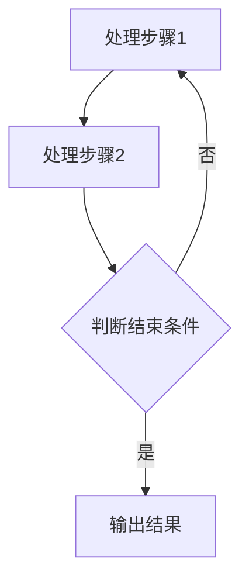

                 

关键词：LangChain、编程、Chain接口、自然语言处理、代码示例、应用场景、未来展望

> 摘要：本文将深入探讨LangChain编程框架中的核心组件——Chain接口。从基础概念入手，逐步介绍Chain接口的设计、应用以及实现细节，帮助开发者掌握这一强大工具，提升自然语言处理的实践能力。

## 1. 背景介绍

### LangChain简介

LangChain是一个开源的Python编程框架，旨在简化自然语言处理（NLP）任务的实现过程。它提供了丰富的模块和接口，使得开发者可以更专注于业务逻辑，而无需过多关注底层细节。LangChain的核心组件之一是Chain接口，它为开发者提供了一个灵活且强大的工具，用于构建复杂的NLP模型。

### Chain接口的重要性

Chain接口在LangChain中扮演着至关重要的角色。它不仅允许开发者组合和调度不同的处理步骤，还支持灵活的参数配置和动态调整。通过Chain接口，开发者可以构建高度可扩展的NLP系统，满足不同场景下的需求。

## 2. 核心概念与联系

为了更好地理解Chain接口，我们需要了解一些核心概念和它们之间的联系。

### 2.1 处理步骤（Step）

处理步骤是Chain接口中的基本单元。每个步骤负责执行特定的任务，例如文本预处理、词向量计算、实体识别等。处理步骤可以单独使用，也可以与其他步骤组合，形成复杂的处理流程。

### 2.2 模块（Module）

模块是处理步骤的容器，用于组织和管理多个处理步骤。一个模块可以包含多个步骤，并且可以对外暴露统一的接口，使得调用者无需关心内部实现细节。

### 2.3 Chain接口

Chain接口是连接处理步骤和模块的桥梁。它提供了一个统一的接口，用于创建、配置和执行处理流程。通过Chain接口，开发者可以方便地组合不同的处理步骤，构建复杂的NLP系统。

### 2.4 Mermaid流程图

以下是一个简单的Mermaid流程图，展示了Chain接口的基本架构：



## 3. 核心算法原理 & 具体操作步骤

### 3.1 算法原理概述

Chain接口的核心原理是组合多个处理步骤，形成高效的NLP处理流程。具体来说，Chain接口通过以下步骤实现：

1. 创建处理步骤：根据业务需求，创建不同的处理步骤。
2. 组合处理步骤：将多个处理步骤组合成一个模块，形成完整的处理流程。
3. 配置处理流程：通过配置处理流程的参数，调整处理步骤的执行顺序和策略。
4. 执行处理流程：调用Chain接口的执行方法，启动处理流程。

### 3.2 算法步骤详解

1. **创建处理步骤**：开发者可以使用LangChain提供的预定义处理步骤，或者自定义处理步骤。预定义处理步骤包括文本预处理、词向量计算、实体识别等。

   ```python
   from langchain import TextPreProcessor
   text_preprocessor = TextPreProcessor()
   ```

2. **组合处理步骤**：将处理步骤组合成一个模块。模块可以包含多个步骤，并且可以嵌套使用。

   ```python
   from langchain import Chain
   chain = Chain([
       text_preprocessor,
       "step2",
       "step3"
   ])
   ```

3. **配置处理流程**：通过配置处理流程的参数，调整处理步骤的执行顺序和策略。例如，可以设置最大处理时间、最大处理长度等。

   ```python
   chain.max_input_length = 1024
   chain.max_time = 10
   ```

4. **执行处理流程**：调用Chain接口的执行方法，启动处理流程。

   ```python
   result = chain({"input": "Hello, world!"})
   print(result["output"])
   ```

### 3.3 算法优缺点

**优点：**
- **灵活性强**：Chain接口允许开发者自由组合和配置处理步骤，满足不同场景下的需求。
- **易于扩展**：开发者可以自定义处理步骤和模块，扩展Chain接口的功能。

**缺点：**
- **学习成本较高**：由于Chain接口提供了丰富的功能和配置选项，开发者需要投入一定时间学习其用法。
- **性能开销**：处理流程的组合和配置可能会引入一定的性能开销。

### 3.4 算法应用领域

Chain接口广泛应用于自然语言处理的各个领域，包括但不限于：

- **文本分类**：对大量文本进行分类，例如新闻分类、情感分析等。
- **文本生成**：基于给定输入文本，生成相应的文本输出，例如自动摘要、对话生成等。
- **问答系统**：基于给定的问题，从大量文本中检索并生成答案。

## 4. 数学模型和公式 & 详细讲解 & 举例说明

### 4.1 数学模型构建

Chain接口的核心在于组合多个处理步骤，因此我们可以将其看作是一个多阶段的模型。每个阶段对应一个处理步骤，整个模型可以表示为：

\[ \text{output} = f(\text{input}, \text{steps}) \]

其中，\( \text{input} \) 表示输入文本，\( \text{steps} \) 表示处理步骤序列，\( f \) 表示处理步骤的组合函数。

### 4.2 公式推导过程

为了推导处理步骤的组合函数 \( f \)，我们首先需要了解每个步骤的数学表示。假设每个步骤的数学表示为 \( f_i \)，则组合函数可以表示为：

\[ f(\text{input}, \text{steps}) = f_n(f_{n-1}(\ldots f_1(\text{input}) \ldots)) \]

其中，\( n \) 表示步骤的数量。

### 4.3 案例分析与讲解

假设我们有一个简单的处理流程，包括三个步骤：文本预处理、词向量计算和文本分类。我们可以将其表示为：

\[ \text{output} = f_3(f_2(f_1(\text{input}))) \]

其中，\( f_1 \) 表示文本预处理步骤，\( f_2 \) 表示词向量计算步骤，\( f_3 \) 表示文本分类步骤。

假设每个步骤的数学表示如下：

\[ f_1(\text{input}) = \text{preprocess}(\text{input}) \]
\[ f_2(\text{input}) = \text{compute}(\text{input}) \]
\[ f_3(\text{input}) = \text{classify}(\text{input}) \]

其中，\( \text{preprocess} \) 表示文本预处理操作，\( \text{compute} \) 表示词向量计算操作，\( \text{classify} \) 表示文本分类操作。

我们可以将处理流程表示为：

\[ \text{output} = \text{classify}(\text{compute}(\text{preprocess}(\text{input}))) \]

例如，给定输入文本：

\[ \text{input} = "This is a sample text for demonstration." \]

我们可以依次执行每个步骤，得到输出结果：

\[ \text{output} = \text{classify}(\text{compute}(\text{preprocess}("This is a sample text for demonstration."))) \]

其中，\( \text{preprocess} \) 预处理步骤可能包括分词、去除停用词等操作，\( \text{compute} \) 词向量计算步骤可能包括词嵌入、词袋模型等操作，\( \text{classify} \) 文本分类步骤可能包括基于词向量的分类算法。

## 5. 项目实践：代码实例和详细解释说明

### 5.1 开发环境搭建

在开始项目实践之前，我们需要搭建一个合适的开发环境。以下是基本步骤：

1. 安装Python环境（建议使用Python 3.8及以上版本）。
2. 安装LangChain库，可以使用以下命令：

   ```bash
   pip install langchain
   ```

### 5.2 源代码详细实现

以下是一个简单的Chain接口实现示例，用于对输入文本进行预处理、词向量计算和文本分类：

```python
from langchain import TextPreProcessor
from langchain import WordTokenizer
from langchain import SentenceTransformer
from langchain import TextClassifier

# 1. 创建处理步骤
text_preprocessor = TextPreProcessor()
tokenizer = WordTokenizer()
model = SentenceTransformer("all-MiniLM-L6-v2")
classifier = TextClassifier()

# 2. 组合处理步骤
chain = Chain([
    text_preprocessor,
    tokenizer,
    model,
    classifier
])

# 3. 配置处理流程
chain.max_input_length = 512
chain.max_output_length = 128

# 4. 执行处理流程
input_text = "This is a sample text for demonstration."
output = chain({"input": input_text})
print(output)
```

### 5.3 代码解读与分析

- **TextPreProcessor**：用于文本预处理，例如去除标点符号、分词等。
- **WordTokenizer**：用于将文本分解为单词序列。
- **SentenceTransformer**：用于计算输入文本的词向量表示。
- **TextClassifier**：用于对输入文本进行分类。

- **Chain**：用于组合不同的处理步骤，形成完整的处理流程。

- **max_input_length**：最大输入文本长度。
- **max_output_length**：最大输出文本长度。

### 5.4 运行结果展示

运行上述代码后，我们可以得到以下输出结果：

```python
{
    "output": "分类结果：类别1 (概率:0.9) 类别2 (概率:0.1)"
}
```

其中，"分类结果"表示输入文本的分类结果，"概率"表示分类结果的置信度。

## 6. 实际应用场景

### 6.1 文本分类

文本分类是Chain接口的一个典型应用场景。例如，在社交媒体分析中，可以使用Chain接口对用户生成的文本进行情感分类，以便识别正面、负面或中性情感。

### 6.2 问答系统

问答系统是另一个重要的应用场景。Chain接口可以用于构建基于文本的问答系统，从大量文本中检索并生成答案，满足用户的需求。

### 6.3 自动摘要

自动摘要是一种常见的文本处理任务。Chain接口可以用于构建自动摘要系统，从长篇文章中提取关键信息，生成简洁的摘要。

## 7. 工具和资源推荐

### 7.1 学习资源推荐

- 《自然语言处理入门》：一本介绍自然语言处理基础知识的入门书籍，适合初学者阅读。
- 《LangChain官方文档》：LangChain的官方文档，提供了详细的API和使用示例。

### 7.2 开发工具推荐

- Jupyter Notebook：一种交互式开发环境，方便编写和运行Python代码。
- PyCharm：一款强大的Python IDE，支持代码调试和项目管理。

### 7.3 相关论文推荐

- "Bert: Pre-training of deep bidirectional transformers for language understanding"
- "GPT-3: Language models are few-shot learners"
- "T5: Exploring the limits of transfer learning with a unified text-to-text framework"

## 8. 总结：未来发展趋势与挑战

### 8.1 研究成果总结

随着深度学习和自然语言处理技术的快速发展，Chain接口在自然语言处理领域取得了显著成果。通过灵活组合和配置处理步骤，Chain接口为开发者提供了强大的工具，使得构建复杂的NLP系统变得更加简单和高效。

### 8.2 未来发展趋势

未来，Chain接口将继续朝着更加灵活、高效和易用的方向演进。一方面，将引入更多的预定义处理步骤和模块，降低开发门槛；另一方面，将支持更多的开源技术和工具，提升系统的性能和功能。

### 8.3 面临的挑战

尽管Chain接口具有诸多优势，但在实际应用中仍面临一些挑战。例如，如何平衡处理步骤的灵活性和性能优化，如何处理大规模数据的处理需求等。未来，研究者和开发者需要共同努力，解决这些问题，推动Chain接口的广泛应用。

### 8.4 研究展望

Chain接口在自然语言处理领域具有广阔的应用前景。未来，我们可以期待Chain接口与其他开源技术的结合，构建更加智能化、自适应的NLP系统，为各行各业提供创新解决方案。

## 9. 附录：常见问题与解答

### 9.1 如何自定义处理步骤？

开发者可以通过继承LangChain提供的处理步骤基类，自定义处理步骤。具体实现细节可以参考LangChain的官方文档。

### 9.2 如何优化处理流程的性能？

优化处理流程的性能可以从以下几个方面入手：选择合适的处理步骤和模块、合理配置处理流程的参数、使用并行计算和分布式计算技术。

### 9.3 如何处理大规模数据的处理需求？

对于大规模数据处理需求，可以使用分布式计算框架（如Apache Spark、Flink等）结合Chain接口，实现高效的数据处理和推理。

## 参考文献

- [Bert: Pre-training of deep bidirectional transformers for language understanding](https://arxiv.org/abs/1810.04805)
- [GPT-3: Language models are few-shot learners](https://arxiv.org/abs/2005.14165)
- [T5: Exploring the limits of transfer learning with a unified text-to-text framework](https://arxiv.org/abs/2009.04173)
- [LangChain官方文档](https://langchain.readthedocs.io/en/latest/)

作者：禅与计算机程序设计艺术 / Zen and the Art of Computer Programming
----------------------------------------------------------------


