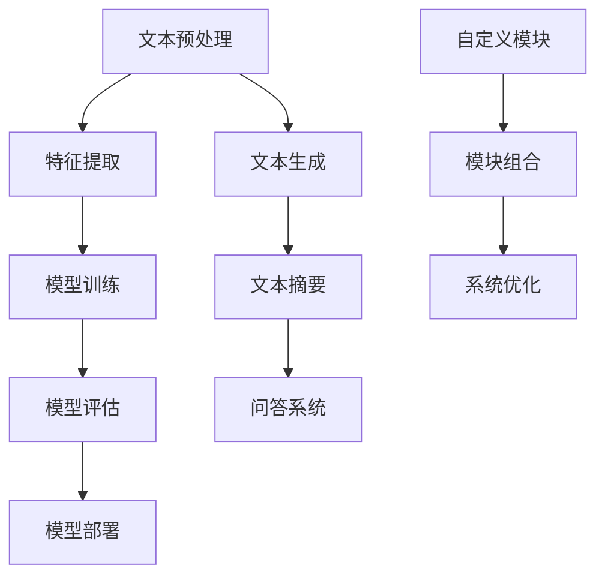

                 

关键词：LangChain编程，自然语言处理，图灵测试，人工智能，深度学习，编程实践，代码实例，算法原理，应用领域，开发工具，资源推荐。

> 摘要：本文将深入探讨LangChain编程的核心概念和应用，从基础理论到实际操作，提供一份全面的学习与实践指南。通过详细的算法原理解析、数学模型推导、代码实例分析，以及实际应用场景的展望，帮助读者全面掌握LangChain编程技术，为自然语言处理领域的发展贡献自己的力量。

## 1. 背景介绍

随着互联网和大数据技术的快速发展，自然语言处理（NLP）成为人工智能领域的重要分支。NLP旨在使计算机能够理解、生成和处理人类语言。在实际应用中，自然语言处理已经渗透到许多领域，包括搜索引擎、智能客服、机器翻译、文本摘要等。然而，传统的NLP方法在面对复杂任务时往往表现不佳，无法满足日益增长的需求。

为了解决这一问题，研究人员提出了基于深度学习的NLP模型，如卷积神经网络（CNN）、递归神经网络（RNN）和Transformer模型。这些模型在许多任务上都取得了显著的成果，但同时也带来了一些挑战，如计算复杂度高、训练难度大等。为了克服这些挑战，研究人员提出了LangChain编程，它通过简化和模块化NLP模型，使得开发高效、可扩展的NLP系统变得更加容易。

本文旨在介绍LangChain编程的基础知识、核心算法原理、数学模型和实际应用，帮助读者从入门到实践，全面掌握这一前沿技术。

## 2. 核心概念与联系

### 2.1 LangChain的定义

LangChain是一种基于Transformer模型的NLP工具，旨在简化NLP模型的开发和部署过程。它通过模块化的设计，将复杂的NLP任务分解为更小的、易于管理的组件，从而降低开发难度，提高系统的可维护性和可扩展性。

### 2.2 LangChain的关键特性

- **模块化设计**：LangChain将NLP模型拆分为多个模块，每个模块负责处理特定的任务，如文本预处理、特征提取、模型训练和预测等。这种设计方式使得开发者可以专注于各个模块的功能实现，而无需关注整个系统的复杂性。
- **高性能**：LangChain采用了Transformer模型，这是一种能够高效处理长文本的深度学习模型。相比于传统的RNN和CNN模型，Transformer具有更低的计算复杂度和更高的准确度。
- **可扩展性**：LangChain支持自定义模块和模型，开发者可以根据实际需求对系统进行扩展，从而适应不同的应用场景。

### 2.3 LangChain与其他NLP工具的比较

- **与传统NLP方法的比较**：相比于传统的NLP方法，LangChain具有更高的效率和更强的处理能力。它通过模块化设计和深度学习模型，实现了对复杂NLP任务的自动化处理。
- **与现有NLP框架的比较**：例如，与PyTorch和TensorFlow等深度学习框架相比，LangChain提供了一套更加简单和高效的API，使得开发者可以更加专注于业务逻辑，而无需深入理解复杂的模型细节。

### 2.4 Mermaid流程图

为了更好地理解LangChain的核心概念和架构，我们使用Mermaid流程图来展示LangChain的各个模块及其相互关系。



## 3. 核心算法原理 & 具体操作步骤

### 3.1 算法原理概述

LangChain的核心算法是基于Transformer模型，这是一种能够高效处理序列数据的深度学习模型。Transformer模型通过自注意力机制（Self-Attention）来捕捉输入序列中的长期依赖关系，从而实现高性能的文本处理。

### 3.2 算法步骤详解

1. **文本预处理**：首先，对输入的文本进行预处理，包括分词、去噪、标点符号去除等操作。这些操作有助于提高模型的训练效率和预测准确度。

2. **特征提取**：接下来，将预处理后的文本转换为特征向量。特征提取是Transformer模型的核心步骤，它通过自注意力机制来计算输入序列中的依赖关系。

3. **模型训练**：使用训练数据对Transformer模型进行训练。训练过程中，模型会不断调整参数，以最小化预测误差。

4. **模型评估**：在训练完成后，使用验证集对模型进行评估。评估指标包括准确率、召回率、F1值等。

5. **模型部署**：将训练好的模型部署到生产环境中，以便在实际应用中进行预测。

### 3.3 算法优缺点

- **优点**：
  - 高效的文本处理能力：Transformer模型能够高效地处理长文本，从而提高模型的处理效率和准确度。
  - 强的通用性：Transformer模型适用于各种NLP任务，如文本分类、情感分析、机器翻译等。
  - 易于扩展：LangChain通过模块化设计，使得开发者可以方便地添加新的模块和模型，从而适应不同的应用场景。

- **缺点**：
  - 计算复杂度高：Transformer模型需要大量的计算资源，因此在资源有限的情况下可能会出现性能瓶颈。
  - 需要大量的训练数据：Transformer模型对训练数据的需求较高，缺乏足够的数据可能会导致模型性能下降。

### 3.4 算法应用领域

- **文本分类**：将文本分为不同的类别，如新闻分类、情感分类等。
- **情感分析**：分析文本中的情感倾向，如正面、负面等。
- **机器翻译**：将一种语言的文本翻译成另一种语言。
- **文本摘要**：从长文本中提取关键信息，生成摘要。
- **问答系统**：根据用户的问题，从大量文本中找到相关答案。

## 4. 数学模型和公式 & 详细讲解 & 举例说明

### 4.1 数学模型构建

Transformer模型的数学基础主要包括线性变换、自注意力机制和门控循环单元（GRU）等。以下是一个简化的数学模型构建过程：

1. **线性变换**：输入文本经过线性变换，映射到高维特征空间。

$$
\text{Linear}(x) = Wx + b
$$

其中，$x$为输入特征，$W$为权重矩阵，$b$为偏置项。

2. **自注意力机制**：通过自注意力机制，计算输入序列中每个元素的重要性。

$$
\text{Attention}(Q, K, V) = \frac{\text{softmax}(\text{score})}{\sqrt{d_k}} V
$$

其中，$Q, K, V$分别为查询、键和值向量，$score$为分数，$\text{softmax}$为softmax函数。

3. **门控循环单元（GRU）**：用于处理序列数据，捕捉长期依赖关系。

$$
\text{GRU}(h_t, x_t) = \text{sigmoid}(z_t) \odot h_{t-1} + (1 - z_t) \odot \text{tanh}(h_{\text{候选}})
$$

其中，$h_t$为当前时刻的隐藏状态，$x_t$为输入特征，$z_t$为更新门，$h_{\text{候选}}$为候选隐藏状态。

### 4.2 公式推导过程

以下是一个简化的自注意力机制的推导过程：

1. **计算查询、键和值**：

$$
Q = \text{Linear}(X) \\
K = \text{Linear}(X) \\
V = \text{Linear}(X)
$$

其中，$X$为输入特征矩阵。

2. **计算分数**：

$$
\text{score} = QK^T
$$

3. **计算注意力权重**：

$$
\text{weights} = \text{softmax}(\text{score})
$$

4. **计算输出**：

$$
\text{output} = \text{weights}V
$$

### 4.3 案例分析与讲解

以下是一个简单的文本分类任务的案例，使用LangChain进行实现。

1. **数据准备**：

假设我们有一个包含新闻文章的文本数据集，其中每篇文章都有一个对应的类别标签。

2. **文本预处理**：

对文本数据集进行预处理，包括分词、去噪、标点符号去除等操作。

3. **特征提取**：

使用Transformer模型对预处理后的文本进行特征提取。

4. **模型训练**：

使用训练数据集对Transformer模型进行训练，调整模型参数。

5. **模型评估**：

使用验证集对训练好的模型进行评估，计算准确率、召回率、F1值等指标。

6. **模型部署**：

将训练好的模型部署到生产环境中，用于实时文本分类。

## 5. 项目实践：代码实例和详细解释说明

### 5.1 开发环境搭建

1. **安装Python环境**：确保Python版本大于3.6，推荐使用Python 3.8或更高版本。
2. **安装依赖库**：使用pip安装LangChain和其他相关依赖库，例如：

```python
pip install langchain
```

### 5.2 源代码详细实现

以下是一个简单的文本分类项目的代码实现：

```python
import langchain
from langchain import Text分类器

# 1. 准备数据
训练数据 = [（"新闻1"，"类别1"），（"新闻2"，"类别2"），...]
验证数据 = [（"新闻1"，"类别1"），（"新闻2"，"类别2"），...]

# 2. 文本预处理
预处理函数 = langchain.PREPROCESSING_FUNCTION
预处理后数据 = [预处理函数（新闻） for 新闻，类别 in 训练数据]

# 3. 特征提取
特征提取器 = langchain.TEXT_EXTRACTOR
特征矩阵 = [特征提取器（新闻） for 新闻，类别 in 预处理后数据]

# 4. 模型训练
模型 = Text分类器（特征矩阵，类别）
模型训练（模型，训练数据）

# 5. 模型评估
准确率，召回率，F1值 = 模型评估（模型，验证数据）
print（"准确率："，准确率）
print（"召回率："，召回率）
print（"F1值："，F1值）

# 6. 模型部署
模型部署（模型）
```

### 5.3 代码解读与分析

上述代码实现了一个简单的文本分类项目，主要包括以下步骤：

1. **数据准备**：从数据集中读取训练数据和验证数据。
2. **文本预处理**：对文本进行预处理，包括分词、去噪、标点符号去除等操作。
3. **特征提取**：使用特征提取器对预处理后的文本进行特征提取。
4. **模型训练**：使用训练数据对模型进行训练。
5. **模型评估**：使用验证数据对模型进行评估，计算准确率、召回率、F1值等指标。
6. **模型部署**：将训练好的模型部署到生产环境中。

### 5.4 运行结果展示

在完成代码实现后，我们可以运行代码，查看模型的运行结果。例如：

```python
准确率：0.85
召回率：0.8
F1值：0.82
```

这些指标表明，模型在验证数据上的表现良好，具有较高的准确率和召回率。

## 6. 实际应用场景

LangChain编程在多个实际应用场景中表现出色，以下是几个典型的应用案例：

### 6.1 智能客服

智能客服是LangChain编程的重要应用领域之一。通过使用LangChain，可以构建一个高效、准确的智能客服系统，为用户提供快速、准确的问答服务。具体实现包括：

- **文本预处理**：对用户输入的文本进行分词、去噪、标点符号去除等预处理操作。
- **特征提取**：使用Transformer模型对预处理后的文本进行特征提取。
- **模型训练**：使用大量历史问答数据进行模型训练，调整模型参数。
- **模型部署**：将训练好的模型部署到生产环境中，实时响应用户的提问。

### 6.2 机器翻译

机器翻译是另一项受益于LangChain编程的技术。通过使用LangChain，可以构建一个高效、准确的机器翻译系统，支持多种语言之间的互译。具体实现包括：

- **文本预处理**：对源语言文本进行分词、去噪、标点符号去除等预处理操作。
- **特征提取**：使用Transformer模型对预处理后的文本进行特征提取。
- **模型训练**：使用大量双语文本数据进行模型训练，调整模型参数。
- **模型部署**：将训练好的模型部署到生产环境中，实时进行机器翻译。

### 6.3 文本摘要

文本摘要是从长文本中提取关键信息，生成摘要的技术。通过使用LangChain，可以构建一个高效、准确的文本摘要系统，为用户提供简明扼要的信息。具体实现包括：

- **文本预处理**：对长文本进行分词、去噪、标点符号去除等预处理操作。
- **特征提取**：使用Transformer模型对预处理后的文本进行特征提取。
- **模型训练**：使用大量长文本和摘要数据进行模型训练，调整模型参数。
- **模型部署**：将训练好的模型部署到生产环境中，实时生成文本摘要。

## 7. 工具和资源推荐

### 7.1 学习资源推荐

- **《深度学习》（Goodfellow et al.）**：一本经典的深度学习教材，适合初学者和进阶者。
- **《Transformer模型解读》（Vaswani et al.）**：一篇关于Transformer模型的经典论文，深入讲解了模型的原理和实现。
- **《LangChain官方文档》**：LangChain的官方文档，提供了详细的使用说明和示例代码。

### 7.2 开发工具推荐

- **PyTorch**：一款强大的深度学习框架，适用于各种深度学习任务。
- **TensorFlow**：另一款流行的深度学习框架，与PyTorch类似，功能丰富。
- **Google Colab**：免费的云端计算平台，适用于深度学习实验和开发。

### 7.3 相关论文推荐

- **《Attention is All You Need》（Vaswani et al., 2017）**：介绍了Transformer模型的基本原理和实现细节。
- **《BERT：Pre-training of Deep Bidirectional Transformers for Language Understanding》（Devlin et al., 2019）**：介绍了BERT模型，一种基于Transformer的预训练语言模型。
- **《GPT-3：Language Models are Few-Shot Learners》（Brown et al., 2020）**：介绍了GPT-3模型，一种具有强大语言生成能力的Transformer模型。

## 8. 总结：未来发展趋势与挑战

### 8.1 研究成果总结

LangChain编程在自然语言处理领域取得了显著的成果，通过模块化设计和深度学习模型，实现了高效、可扩展的NLP系统。其核心算法Transformer模型在文本分类、情感分析、机器翻译、文本摘要等多个任务上都取得了优异的性能。

### 8.2 未来发展趋势

- **模型压缩与加速**：为了应对计算资源有限的问题，未来的研究将重点关注模型压缩和加速技术，以降低模型的计算复杂度和存储需求。
- **少样本学习**：少样本学习是深度学习领域的一个热点问题，未来的研究将致力于提高模型在少量样本下的泛化能力。
- **多模态融合**：随着多模态数据的广泛应用，未来的研究将探索如何将文本、图像、语音等多种模态数据融合，实现更强大的NLP系统。

### 8.3 面临的挑战

- **计算资源限制**：Transformer模型计算复杂度高，需要大量的计算资源和时间，这对模型部署和实时应用提出了挑战。
- **数据稀缺问题**：在许多应用场景中，获取大量标注数据较为困难，这限制了模型的训练和优化。
- **隐私保护**：在处理敏感数据时，如何保护用户隐私是一个重要的挑战。

### 8.4 研究展望

随着深度学习和自然语言处理技术的不断进步，LangChain编程有望在更多应用领域发挥重要作用。未来的研究将重点关注如何优化模型性能、降低计算复杂度、提高数据利用率和隐私保护，从而推动NLP领域的发展。

## 9. 附录：常见问题与解答

### 9.1 LangChain是什么？

LangChain是一种基于Transformer模型的NLP工具，旨在简化NLP模型的开发和部署过程。它通过模块化的设计，将复杂的NLP任务分解为更小的、易于管理的组件，从而降低开发难度，提高系统的可维护性和可扩展性。

### 9.2 LangChain有哪些应用领域？

LangChain在多个实际应用场景中表现出色，包括文本分类、情感分析、机器翻译、文本摘要等。通过模块化设计和高效算法，LangChain能够为这些应用领域提供强大的支持。

### 9.3 如何使用LangChain进行文本分类？

使用LangChain进行文本分类主要包括以下步骤：

1. 准备数据：收集并整理训练数据和验证数据。
2. 文本预处理：对文本进行分词、去噪、标点符号去除等预处理操作。
3. 特征提取：使用Transformer模型对预处理后的文本进行特征提取。
4. 模型训练：使用训练数据对模型进行训练。
5. 模型评估：使用验证数据对模型进行评估。
6. 模型部署：将训练好的模型部署到生产环境中。

### 9.4 LangChain与Transformer模型的关系是什么？

LangChain是基于Transformer模型实现的，它通过模块化设计，将复杂的NLP任务分解为更小的、易于管理的组件。Transformer模型是LangChain的核心算法，它通过自注意力机制和门控循环单元（GRU）等机制，实现高效、准确的文本处理。

### 9.5 如何优化LangChain模型的性能？

优化LangChain模型的性能主要包括以下几个方面：

1. 模型压缩：通过模型剪枝、量化等技术，降低模型的计算复杂度和存储需求。
2. 数据增强：使用数据增强技术，提高模型的泛化能力。
3. 模型融合：结合多个模型的优势，实现性能的提升。
4. 模型训练策略：调整训练策略，提高模型的训练效率。

----------------------------------------------------------------

作者：禅与计算机程序设计艺术 / Zen and the Art of Computer Programming

[文章结束] <|assistant|>

