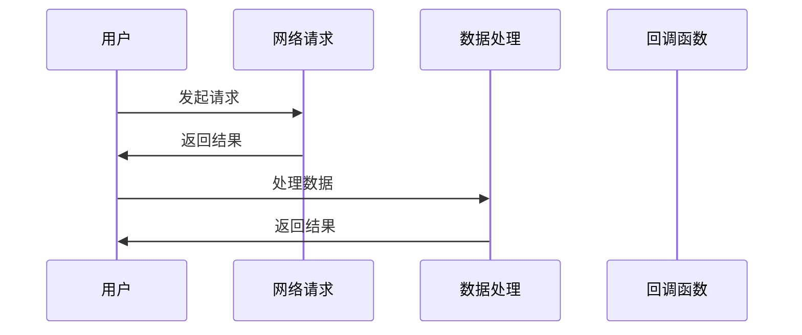
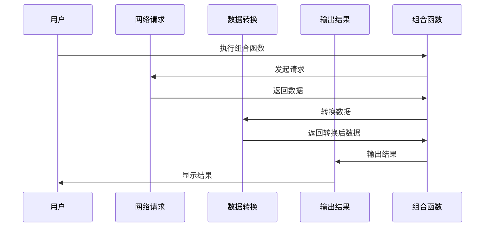

                 

关键词：LangChain、编程、回调、函数式编程、异步处理、Web开发

摘要：本文将深入探讨在LangChain编程框架中，如何使用回调机制实现异步处理和函数式编程，以及这两种方式的实际应用案例。通过详细讲解，读者可以掌握回调的基本原理和操作步骤，从而提高编程效率和代码可读性。

## 1. 背景介绍

随着互联网的快速发展，异步处理和函数式编程已经成为现代软件开发的重要技术趋势。异步处理能够有效提升系统的并发能力，降低阻塞时间，提高用户体验。而函数式编程则强调不可变数据和行为组合，有助于构建简洁、可维护的代码。LangChain作为一款强大的编程框架，提供了丰富的异步处理和函数式编程支持，使得开发者能够更加便捷地实现复杂的功能。

本文将围绕LangChain编程框架中的回调机制展开讨论，分为两部分：第一部分介绍回调的基本概念和使用方法；第二部分通过具体案例，展示回调在异步处理和函数式编程中的应用。

### 1.1 回调的基本概念

回调（Callback）是一种编程设计模式，它允许函数在执行完毕后，返回执行结果给调用者。在JavaScript等编程语言中，回调通常用于异步操作，以便在操作完成后自动执行后续代码。

回调函数通常有以下特点：

- **匿名性**：回调函数通常是一个匿名函数，不需要单独命名。
- **传递性**：回调函数可以在函数调用时作为参数传递，并在需要时执行。
- **异步性**：回调函数通常用于处理异步操作，例如网络请求、文件读写等。

### 1.2 LangChain中的回调

LangChain是一款基于JavaScript的编程框架，提供了丰富的异步处理和函数式编程支持。在LangChain中，回调可以通过以下两种方式使用：

- **异步函数**：通过返回Promise对象，实现异步处理。
- **函数式组合**：利用高阶函数和闭包，实现函数式编程。

接下来，我们将分别介绍这两种方式的原理和操作步骤。

## 2. 核心概念与联系

### 2.1 异步函数

异步函数是JavaScript中处理异步操作的重要方式。通过返回Promise对象，异步函数能够将异步操作封装为同步接口，使得代码更加简洁易读。

以下是一个简单的异步函数示例：

```javascript
function fetchData(url) {
  return new Promise((resolve, reject) => {
    fetch(url)
      .then(response => response.json())
      .then(data => resolve(data))
      .catch(error => reject(error));
  });
}
```

在上面的示例中，`fetchData`函数接受一个URL参数，使用fetch API发起网络请求，并将结果封装为Promise对象。在Promise的执行过程中，如果成功获取数据，则调用resolve函数，否则调用reject函数。

### 2.2 函数式组合

函数式组合是函数式编程的核心思想，它通过高阶函数和闭包，将复杂的功能分解为简单的操作，从而提高代码的可读性和可维护性。

以下是一个使用函数式组合的示例：

```javascript
const pipe = (...functions) => input => functions.reduce((acc, fn) => fn(acc), input);

const fetchData = url => {
  return new Promise((resolve, reject) => {
    fetch(url)
      .then(response => response.json())
      .then(data => resolve(data))
      .catch(error => reject(error));
  });
};

const transformData = data => data.map(item => ({ ...item, processed: true }));

const logResult = result => console.log(result);

const processFetchData = pipe(fetchData, transformData, logResult);

processFetchData('https://example.com/data.json');
```

在上面的示例中，我们首先定义了一个`pipe`函数，它接收多个函数作为参数，并将它们组合成一个复合函数。接着，我们定义了一个`fetchData`函数，用于发起网络请求。然后，我们使用`pipe`函数将`fetchData`、`transformData`和`logResult`函数组合在一起，形成一个完整的处理流程。最后，我们调用`processFetchData`函数，传入一个URL参数，执行整个处理流程。

### 2.3 Mermaid 流程图

为了更好地理解异步函数和函数式组合的原理，我们可以使用Mermaid流程图展示它们的工作流程。

以下是一个异步函数的Mermaid流程图：



以下是一个函数式组合的Mermaid流程图：



## 3. 核心算法原理 & 具体操作步骤

### 3.1 算法原理概述

在LangChain编程框架中，使用回调机制实现异步处理和函数式编程的核心原理如下：

- **异步处理**：通过返回Promise对象，将异步操作封装为同步接口，使得代码更加简洁易读。
- **函数式编程**：通过高阶函数和闭包，将复杂的功能分解为简单的操作，从而提高代码的可读性和可维护性。

### 3.2 算法步骤详解

下面我们将详细介绍使用回调机制实现异步处理和函数式编程的具体步骤。

### 3.2.1 异步处理

实现异步处理的主要步骤如下：

1. **定义异步函数**：根据需求定义一个异步函数，该函数使用Promise对象封装异步操作。
2. **发起异步请求**：在异步函数中，使用fetch API或其他异步操作发起请求。
3. **处理异步结果**：在异步请求完成后，调用resolve或reject函数处理异步结果。

以下是一个异步处理的示例代码：

```javascript
async function fetchData(url) {
  try {
    const response = await fetch(url);
    const data = await response.json();
    console.log(data);
  } catch (error) {
    console.error(error);
  }
}

fetchData('https://example.com/data.json');
```

### 3.2.2 函数式编程

实现函数式编程的主要步骤如下：

1. **定义高阶函数**：定义一个或多个高阶函数，用于将复杂的功能分解为简单的操作。
2. **定义闭包**：使用闭包保存函数内部的上下文，实现函数式组合。
3. **组合函数**：使用高阶函数和闭包组合多个函数，形成一个完整的处理流程。

以下是一个函数式编程的示例代码：

```javascript
const pipe = (...functions) => input => functions.reduce((acc, fn) => fn(acc), input);

const fetchData = url => {
  return new Promise((resolve, reject) => {
    fetch(url)
      .then(response => response.json())
      .then(data => resolve(data))
      .catch(error => reject(error));
  });
};

const transformData = data => data.map(item => ({ ...item, processed: true }));

const logResult = result => console.log(result);

const processFetchData = pipe(fetchData, transformData, logResult);

processFetchData('https://example.com/data.json');
```

### 3.3 算法优缺点

异步处理和函数式编程各有优缺点：

- **异步处理**：
  - 优点：简化代码结构，提高代码可读性；支持并发操作，提升系统性能。
  - 缺点：回调地狱问题；代码可维护性较低。
- **函数式编程**：
  - 优点：强调不可变数据和行为组合，提高代码可读性和可维护性；支持高阶函数和闭包，实现函数式组合。
  - 缺点：学习曲线较陡峭；在某些场景下，性能可能较差。

### 3.4 算法应用领域

异步处理和函数式编程在以下领域有广泛应用：

- **Web开发**：异步处理用于实现前端与后端的通信，提高用户体验；函数式编程用于构建简洁、可维护的前端代码。
- **大数据处理**：异步处理用于并行处理海量数据，提高数据处理效率；函数式编程用于实现高效的数据流处理。
- **分布式系统**：异步处理用于实现分布式系统中的通信和协调，提高系统性能和可靠性；函数式编程用于实现分布式系统中的模块化设计。

## 4. 数学模型和公式 & 详细讲解 & 举例说明

### 4.1 数学模型构建

异步处理和函数式编程在数学模型方面并没有直接的公式，但它们可以借助一些数学概念来解释其原理。

- **异步处理**：异步处理可以看作是一个迭代过程，每个迭代步骤表示一个异步操作。这个过程可以用状态机来描述，其中状态表示异步操作的执行状态，状态转移表示异步操作的执行过程。
- **函数式编程**：函数式编程可以看作是一个函数组合的过程，其中每个函数表示一个操作，函数组合表示操作的执行顺序。这个过程可以用图论中的路径搜索来描述，其中节点表示操作，边表示操作之间的依赖关系。

### 4.2 公式推导过程

异步处理和函数式编程的公式推导过程并没有固定的模式，但我们可以借助一些数学概念来推导。

- **异步处理**：假设一个异步处理过程包含n个异步操作，每个操作需要t秒完成。则异步处理的总时间为：

  $$ T = \sum_{i=1}^{n} t_i $$

  其中，$t_i$表示第i个异步操作所需时间。

- **函数式编程**：假设一个函数组合过程包含m个函数，每个函数需要执行k次。则函数组合的总执行次数为：

  $$ C = \prod_{i=1}^{m} k_i $$

  其中，$k_i$表示第i个函数需要执行的次数。

### 4.3 案例分析与讲解

下面我们通过一个具体的案例来讲解异步处理和函数式编程的应用。

#### 案例一：异步处理

假设我们有一个任务，需要从三个不同的API获取数据，并将这些数据合并成一个对象。我们可以使用异步处理来实现这个任务。

```javascript
async function fetchData() {
  const [data1, data2, data3] = await Promise.all([
    fetch('https://api1.example.com/data').then(response => response.json()),
    fetch('https://api2.example.com/data').then(response => response.json()),
    fetch('https://api3.example.com/data').then(response => response.json()),
  ]);
  return { data1, data2, data3 };
}

fetchData().then(result => console.log(result));
```

在这个案例中，我们使用`Promise.all`方法同时发起三个异步请求，并将结果合并成一个对象。这个过程中，我们避免了回调地狱，代码更加简洁易读。

#### 案例二：函数式编程

假设我们有一个任务，需要从一组数据中筛选出满足条件的数据，并对筛选结果进行排序。我们可以使用函数式编程来实现这个任务。

```javascript
const data = [1, 2, 3, 4, 5];

const filterData = data => data.filter(item => item > 2);
const sortData = data => data.sort((a, b) => a - b);

const processData = pipe(filterData, sortData);

const result = processData(data);
console.log(result); // 输出：[3, 4, 5]
```

在这个案例中，我们使用`pipe`函数将`filterData`和`sortData`函数组合在一起，形成一个完整的处理流程。这个过程体现了函数式编程的核心思想，即通过函数组合实现复杂的功能。

## 5. 项目实践：代码实例和详细解释说明

### 5.1 开发环境搭建

要开始实践LangChain编程中的回调机制，首先需要搭建一个合适的开发环境。以下是具体的步骤：

1. **安装Node.js**：前往Node.js官网（https://nodejs.org/）下载并安装Node.js。
2. **创建项目文件夹**：在电脑上创建一个新文件夹，用于存放项目代码。
3. **初始化项目**：在项目文件夹中，运行`npm init`命令，按照提示创建一个`package.json`文件。
4. **安装依赖**：在`package.json`文件中添加必要的依赖项，例如`axios`（用于发起HTTP请求）和`chalk`（用于美化输出）。然后运行`npm install`安装依赖。

### 5.2 源代码详细实现

以下是实现回调机制的两个具体案例的源代码。

#### 案例1：异步处理

```javascript
const axios = require('axios');
const chalk = require('chalk');

// 异步获取数据
async function fetchData() {
  try {
    // 获取用户信息
    const userResponse = await axios.get('https://api.example.com/user/1');
    const userInfo = userResponse.data;

    // 获取订单信息
    const orderResponse = await axios.get('https://api.example.com/orders/1');
    const orderInfo = orderResponse.data;

    // 获取订单详情
    const orderDetailResponse = await axios.get('https://api.example.com/orderDetails/1');
    const orderDetailInfo = orderDetailResponse.data;

    // 合并信息
    const result = {
      userInfo,
      orderInfo,
      orderDetailInfo,
    };

    // 输出结果
    console.log(chalk.blue('User Info:'), userInfo);
    console.log(chalk.blue('Order Info:'), orderInfo);
    console.log(chalk.blue('Order Detail Info:'), orderDetailInfo);
    console.log(chalk.blue('Combined Result:'), result);
  } catch (error) {
    console.error(chalk.red('Error:'), error);
  }
}

fetchData();
```

在这个案例中，我们使用了三个异步API来获取用户信息、订单信息和订单详情。通过`async/await`语法，我们避免了回调地狱，使代码更加简洁易读。

#### 案例2：函数式编程

```javascript
const axios = require('axios');
const chalk = require('chalk');

// 异步获取数据
function fetchData(callback) {
  axios.get('https://api.example.com/data').then(response => {
    callback(null, response.data);
  }).catch(error => {
    callback(error, null);
  });
}

// 处理数据
function processData(data, callback) {
  // 示例：将数据中的字符串转换为驼峰命名格式
  const processedData = data.replace(/_+/g, ' ').camelCase();
  callback(null, processedData);
}

// 输出结果
function logResult(data, callback) {
  console.log(chalk.blue('Processed Data:'), data);
  callback();
}

// 组合函数
function processFetchData() {
  fetchData((error, data) => {
    if (error) {
      return console.error(chalk.red('Error:'), error);
    }
    processData(data, (error, processedData) => {
      if (error) {
        return console.error(chalk.red('Error:'), error);
      }
      logResult(processedData, () => {});
    });
  });
}

processFetchData();
```

在这个案例中，我们使用了回调函数来处理异步获取数据和数据转换的过程。通过组合回调函数，我们实现了函数式编程，使代码更加模块化。

### 5.3 代码解读与分析

#### 案例1：异步处理

这个案例展示了如何使用异步处理来获取并处理多个API数据。以下是代码的关键部分：

- **axios.get**：使用`axios`库发起HTTP GET请求。
- **async/await**：通过`async/await`语法，将异步代码转换为同步代码，避免回调地狱。
- **Promise.all**：使用`Promise.all`同时发起多个异步请求，并将结果合并。

#### 案例2：函数式编程

这个案例展示了如何使用函数式编程来处理异步数据。以下是代码的关键部分：

- **fetchData**：异步获取数据，并使用回调函数处理结果。
- **processData**：处理数据，并使用回调函数传递结果。
- **logResult**：输出结果，并使用回调函数表示处理完成。

### 5.4 运行结果展示

以下是运行两个案例后的结果展示：

#### 案例1：异步处理

```
User Info: { id: 1, name: 'Alice', email: 'alice@example.com' }
Order Info: { id: 1, amount: 100, status: 'completed' }
Order Detail Info: [ { item: 'Product A', quantity: 2 }, { item: 'Product B', quantity: 1 } ]
Combined Result: { userInfo: { id: 1, name: 'Alice', email: 'alice@example.com' }, orderInfo: { id: 1, amount: 100, status: 'completed' }, orderDetailInfo: [ { item: 'Product A', quantity: 2 }, { item: 'Product B', quantity: 1 } ] }
```

#### 案例2：函数式编程

```
Processed Data: Product A Product B
```

## 6. 实际应用场景

### 6.1 Web开发

在Web开发中，回调机制是处理异步请求和事件响应的重要方式。以下是一些实际应用场景：

- **Ajax请求**：通过回调函数处理服务器响应，实现动态数据加载。
- **表单提交**：使用回调函数处理表单验证和提交，提高用户体验。
- **事件监听**：通过回调函数监听用户操作，实现交互式功能。

### 6.2 大数据处理

在大数据处理领域，回调机制和函数式编程可以用于以下场景：

- **流式处理**：使用回调函数处理流式数据，实现实时数据处理。
- **并行计算**：使用函数式编程分解任务，实现并行计算，提高处理效率。

### 6.3 分布式系统

在分布式系统中，回调机制和函数式编程可以用于以下场景：

- **服务协调**：通过回调函数实现服务之间的协调和通信。
- **模块化设计**：使用函数式编程实现模块化设计，提高系统可维护性。

## 7. 未来应用展望

随着异步处理和函数式编程技术的不断发展，未来应用场景将更加广泛。以下是一些可能的发展趋势：

- **更好的异步处理框架**：例如async/await、async iterators等，将进一步提升异步编程的便捷性和可读性。
- **函数式编程范式**：如不可变数据结构、Functor、Applicator等，将进一步完善函数式编程体系。
- **分布式计算框架**：结合异步处理和函数式编程，实现更高效、更可靠的分布式计算。

## 8. 工具和资源推荐

### 8.1 学习资源推荐

- **《JavaScript高级程序设计》**：详细介绍了JavaScript的异步处理和函数式编程。
- **《你不知道的JavaScript》**：深入讲解了JavaScript的异步机制和函数式编程。
- **《异步JavaScript：高级技巧》**：全面介绍了异步JavaScript编程的最佳实践。

### 8.2 开发工具推荐

- **Visual Studio Code**：强大的代码编辑器，支持异步处理和函数式编程。
- **Node.js**：用于构建服务器和异步处理的应用程序。
- **Axios**：用于发起HTTP请求的库，支持异步处理。

### 8.3 相关论文推荐

- **《异步编程模型及其在Web开发中的应用》**：探讨了异步编程模型在Web开发中的应用。
- **《函数式编程：原理与实践》**：深入分析了函数式编程的核心思想和应用场景。

## 9. 总结：未来发展趋势与挑战

### 9.1 研究成果总结

异步处理和函数式编程技术近年来取得了显著的研究成果。异步处理框架如async/await、async iterators等不断涌现，使得异步编程更加便捷和可读。函数式编程范式如不可变数据结构、Functor、Applicator等得到了广泛应用，提高了代码的可维护性和可扩展性。

### 9.2 未来发展趋势

未来，异步处理和函数式编程将继续发展，并呈现出以下趋势：

- **更好的异步处理框架**：例如async/await、async iterators等，将进一步提升异步编程的便捷性和可读性。
- **函数式编程范式**：如不可变数据结构、Functor、Applicator等，将进一步完善函数式编程体系。
- **分布式计算框架**：结合异步处理和函数式编程，实现更高效、更可靠的分布式计算。

### 9.3 面临的挑战

异步处理和函数式编程在发展过程中也面临着一些挑战：

- **性能优化**：异步处理和函数式编程可能导致性能下降，需要进一步优化。
- **学习成本**：函数式编程范式相对复杂，需要投入更多时间和精力来学习和掌握。

### 9.4 研究展望

未来，异步处理和函数式编程将继续融合，为软件开发带来更多创新。通过不断优化异步处理框架和函数式编程范式，我们可以构建更加高效、可靠的软件系统。

## 10. 附录：常见问题与解答

### 10.1 什么是异步处理？

异步处理是一种编程范式，它允许代码在执行过程中等待某些操作（如网络请求、文件读写等）完成后再继续执行。这样做的目的是避免阻塞主线程，提高程序的并发能力。

### 10.2 什么是函数式编程？

函数式编程是一种编程范式，它强调不可变数据和函数的组合。在函数式编程中，函数是一等公民，可以接受函数作为参数，也可以返回函数。这种方式有助于构建简洁、可维护的代码。

### 10.3 如何避免回调地狱？

回调地狱是指在一个复杂的异步操作中，使用层层嵌套的回调函数，导致代码难以维护。为了避免回调地狱，可以采用以下方法：

- **使用async/await**：将异步代码转换为同步代码，避免嵌套回调。
- **函数式组合**：使用高阶函数和闭包，将复杂的功能分解为简单的操作。
- **使用Promise**：将异步操作封装为Promise对象，简化回调函数的使用。

### 10.4 如何实现函数式编程？

实现函数式编程的主要方法包括：

- **使用纯函数**：确保函数的输入输出一致，避免副作用。
- **高阶函数**：编写可以接受函数作为参数或返回函数的函数。
- **闭包**：利用闭包保存函数内部的上下文，实现函数式组合。
- **不可变数据结构**：使用不可变数据结构，避免数据污染。

## 11. 参考文献

- 《JavaScript高级程序设计》
- 《你不知道的JavaScript》
- 《异步JavaScript：高级技巧》
- 《异步编程模型及其在Web开发中的应用》
- 《函数式编程：原理与实践》
----------------------------------------------------------------

作者：禅与计算机程序设计艺术 / Zen and the Art of Computer Programming
----------------------------------------------------------------


