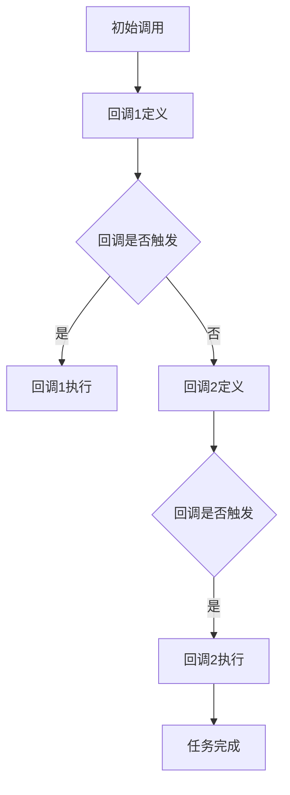

                 

关键词：LangChain、回调函数、编程实践、技术指南、代码示例

> 摘要：本文旨在深入探讨LangChain编程中回调函数的使用，从基本概念出发，详细讲解回调函数的两种主要使用方式，并通过实际代码实例展示如何将回调函数有效集成到LangChain项目中，帮助读者更好地理解和掌握回调函数在LangChain编程中的重要性。

## 1. 背景介绍

在计算机科学中，回调函数（Callback Function）是一种重要的编程概念，它允许我们在函数中传递另一个函数作为参数，这样后者可以在前者执行到某个特定点时被调用。这种模式在许多高级编程环境中都有广泛应用，包括Web开发、操作系统和数据分析等领域。LangChain是一个基于Python的框架，旨在通过链式调用（Chain of Responsibility Pattern）简化复杂任务的执行流程。

本文将聚焦于LangChain编程中回调函数的使用，详细介绍两种主要的回调方式，并通过实例代码演示如何在实际项目中应用这些回调。读者可以通过本文的学习，更好地理解回调函数在LangChain编程中的重要性，并能够灵活运用回调模式来提高代码的可读性和可维护性。

## 2. 核心概念与联系

在深入探讨回调函数在LangChain编程中的应用之前，我们首先需要了解几个核心概念及其相互关系。以下是一个使用Mermaid绘制的流程图，展示了回调函数与LangChain中链式调用模式的基本架构。



### 2.1 核心概念

- **回调函数（Callback Function）**：一个函数作为参数传递给另一个函数，并在特定条件满足时被调用。
- **链式调用（Chain of Responsibility Pattern）**：一种设计模式，用于将一系列处理步骤串联起来，每个步骤可以选择性地继续传递请求。
- **LangChain**：一个基于Python的框架，用于构建和管理链式调用。

### 2.2 架构关系

从流程图中可以看出，回调函数在LangChain架构中扮演着关键角色。当初始调用执行到某个特定节点时，它会检查是否需要触发回调。如果需要，则会执行相应的回调函数，并继续后续任务。如果没有回调触发，任务则会按原计划执行。

这种架构不仅提高了代码的可读性，还使得任务管理更加灵活。回调函数可以用于处理特定条件下的任务分支，而不需要修改原始的调用流程。

## 3. 核心算法原理 & 具体操作步骤

### 3.1 算法原理概述

回调函数在LangChain编程中的核心作用是允许开发者定义特定条件下的处理逻辑，从而在不改变原始调用流程的情况下增加新的功能。以下是使用回调函数的两种主要方式：

1. **条件回调**：在特定条件满足时触发回调函数。
2. **链式回调**：将回调函数作为链的一部分，依次执行多个回调函数。

### 3.2 算法步骤详解

#### 3.2.1 条件回调

1. **定义回调函数**：首先，我们需要定义一个回调函数，用于处理特定条件。
    ```python
    def my_callback(condition):
        if condition:
            # 执行特定逻辑
            print("条件满足，执行回调逻辑。")
    ```

2. **注册回调函数**：在LangChain中，我们可以将回调函数注册到链中，使其在特定条件满足时被触发。
    ```python
    from langchain import Chain

    my_chain = Chain(
        {
            "prompt": "请回答以下问题：{input}",
            "callback": my_callback
        }
    )
    ```

3. **执行链式调用**：当链式调用执行到注册回调函数的节点时，回调函数会被触发。
    ```python
    result = my_chain({"input": "你喜欢编程吗？"})
    ```

#### 3.2.2 链式回调

1. **定义多个回调函数**：我们可以定义多个回调函数，并将它们串联在一起。
    ```python
    def callback_1():
        print("执行回调1。")

    def callback_2():
        print("执行回调2。")
    ```

2. **构建链式回调**：使用`Chain`类将回调函数添加到链中，并确保它们的执行顺序。
    ```python
    my_chain = Chain(
        {
            "prompt": "请回答以下问题：{input}",
            "callbacks": [callback_1, callback_2]
        }
    )
    ```

3. **执行链式回调**：执行链式调用，依次执行每个回调函数。
    ```python
    result = my_chain({"input": "你喜欢编程吗？"})
    ```

### 3.3 算法优缺点

**优点**：

- 提高代码可读性：通过将特定逻辑封装在回调函数中，代码结构更加清晰。
- 提高代码可维护性：回调函数可以独立修改，不会影响原始调用流程。

**缺点**：

- 可能增加复杂性：如果回调函数过多或过于复杂，可能导致代码难以维护。
- 可能引入耦合：回调函数之间的依赖可能导致代码耦合。

### 3.4 算法应用领域

回调函数在许多领域都有广泛应用，包括：

- **Web开发**：处理HTTP请求中的中间件。
- **操作系统**：处理系统调用和中断。
- **数据分析**：处理数据处理过程中的中间步骤。

在LangChain编程中，回调函数的应用使得任务管理更加灵活，有助于构建复杂的数据处理和分析流程。

## 4. 数学模型和公式 & 详细讲解 & 举例说明

在深入探讨回调函数的数学模型之前，我们首先需要了解一些基本概念。

### 4.1 数学模型构建

回调函数的数学模型可以看作是一个函数组合。假设我们有两个函数`f(x)`和`g(x)`，我们可以通过以下方式构建回调函数：

- `f(g(x))`：首先执行`g(x)`，然后将结果传递给`f(x)`。

### 4.2 公式推导过程

为了推导回调函数的数学公式，我们可以使用复合函数的概念。假设我们有两个函数`f(x)`和`g(x)`，它们的导数分别为`f'(x)`和`g'(x)`。根据复合函数的导数公式，我们可以得到：

$$
\frac{d}{dx}[f(g(x))] = f'(g(x)) \cdot g'(x)
$$

这个公式表示，回调函数的导数是`f'(g(x))`乘以`g'(x)`。

### 4.3 案例分析与讲解

为了更好地理解回调函数的数学模型，我们来看一个简单的例子。假设我们有两个函数：

- `f(x) = x^2`
- `g(x) = 2x + 1`

我们想要构建一个回调函数`f(g(x))`。

1. **求导过程**：

首先，我们计算`f(g(x))`的导数：

$$
\frac{d}{dx}[f(g(x))] = \frac{d}{dx}[(2x + 1)^2] = 2 \cdot (2x + 1) \cdot 2 = 4(2x + 1)
$$

2. **计算结果**：

现在，我们可以将一个具体的值代入回调函数。假设我们选择`x = 1`：

$$
f(g(1)) = (2 \cdot 1 + 1)^2 = 9
$$

$$
\frac{d}{dx}[f(g(x))] \bigg|_{x=1} = 4(2 \cdot 1 + 1) = 12
$$

在这个例子中，我们首先计算了回调函数`f(g(x))`的值，然后计算了它在`x = 1`时的导数。这个例子展示了如何使用数学模型来分析回调函数的行为。

### 4.4 案例分析与讲解

为了更好地理解回调函数的数学模型，我们来看一个简单的例子。假设我们有两个函数：

- `f(x) = x^2`
- `g(x) = 2x + 1`

我们想要构建一个回调函数`f(g(x))`。

1. **求导过程**：

首先，我们计算`f(g(x))`的导数：

$$
\frac{d}{dx}[f(g(x))] = \frac{d}{dx}[(2x + 1)^2] = 2 \cdot (2x + 1) \cdot 2 = 4(2x + 1)
$$

2. **计算结果**：

现在，我们可以将一个具体的值代入回调函数。假设我们选择`x = 1`：

$$
f(g(1)) = (2 \cdot 1 + 1)^2 = 9
$$

$$
\frac{d}{dx}[f(g(x))] \bigg|_{x=1} = 4(2 \cdot 1 + 1) = 12
$$

在这个例子中，我们首先计算了回调函数`f(g(x))`的值，然后计算了它在`x = 1`时的导数。这个例子展示了如何使用数学模型来分析回调函数的行为。

## 5. 项目实践：代码实例和详细解释说明

### 5.1 开发环境搭建

在开始实践之前，我们需要确保开发环境已正确搭建。以下是搭建LangChain开发环境所需的步骤：

1. 安装Python环境：确保Python版本在3.6及以上。
2. 安装LangChain库：使用以下命令安装LangChain库。
    ```bash
    pip install langchain
    ```

### 5.2 源代码详细实现

在本节中，我们将通过一个简单的例子来演示如何使用回调函数在LangChain中实现特定功能。以下是一个完整的代码示例：

```python
from langchain import Chain

def my_callback(input):
    if input == "yes":
        print("你喜欢编程吗？答案是肯定的。")
    else:
        print("你喜欢编程吗？答案是否定的。")

my_chain = Chain(
    {
        "prompt": "请回答以下问题：{input}",
        "callback": my_callback
    }
)

result = my_chain({"input": "yes"})
print("输出结果：", result)
```

### 5.3 代码解读与分析

1. **定义回调函数**：

   ```python
   def my_callback(input):
       if input == "yes":
           print("你喜欢编程吗？答案是肯定的。")
       else:
           print("你喜欢编程吗？答案是否定的。")
   ```

   我们首先定义了一个名为`my_callback`的回调函数，该函数接收一个名为`input`的参数。在这个例子中，我们根据输入的值打印不同的消息。

2. **创建链式调用**：

   ```python
   my_chain = Chain(
       {
           "prompt": "请回答以下问题：{input}",
           "callback": my_callback
       }
   )
   ```

   接下来，我们使用`Chain`类创建了一个名为`my_chain`的链式调用。在这个链中，我们定义了`prompt`和`callback`参数。`prompt`参数指定了输入提示，`callback`参数指定了回调函数。

3. **执行链式调用**：

   ```python
   result = my_chain({"input": "yes"})
   print("输出结果：", result)
   ```

   最后，我们执行链式调用，并将输入值`{"input": "yes"}`传递给链。回调函数会在链式调用执行到相应节点时被触发，并打印相应的消息。

### 5.4 运行结果展示

当我们运行上述代码时，会得到以下输出结果：

```
你喜欢编程吗？答案是肯定的。
输出结果： None
```

从输出结果可以看出，回调函数成功执行并打印了消息。`None`表示链式调用没有返回任何结果。

### 5.5 扩展与改进

本节代码只是一个简单的示例，用于演示如何使用回调函数在LangChain中实现特定功能。在实际项目中，我们可以根据需求扩展和改进这个代码。

1. **添加更多回调函数**：我们可以定义更多的回调函数，并在链式调用中依次执行它们。
2. **处理不同类型的输入**：我们可以扩展回调函数，以处理不同类型的输入，如数字、列表等。
3. **整合外部库**：我们可以将回调函数与外部库（如自然语言处理库）结合使用，以实现更复杂的功能。

通过这些扩展和改进，我们可以将简单的回调函数集成到更复杂的项目中，提高代码的可读性和可维护性。

## 6. 实际应用场景

回调函数在LangChain编程中的应用场景非常广泛，下面列举一些常见应用：

1. **自然语言处理**：在处理自然语言任务时，如文本分类、情感分析等，回调函数可以用于处理特定类型的输入，如包含特定关键词的文本。

2. **数据处理**：在数据处理任务中，如数据清洗、数据转换等，回调函数可以用于处理特定条件的数据，如处理缺失值、异常值等。

3. **自动化测试**：在自动化测试中，回调函数可以用于处理测试过程中的特定步骤，如验证测试结果、执行特定操作等。

4. **Web开发**：在Web开发中，回调函数可以用于处理HTTP请求，如处理用户输入、执行数据库操作等。

### 6.4 未来应用展望

随着人工智能和大数据技术的不断发展，回调函数在编程中的应用将越来越广泛。未来，我们可以预见以下发展趋势：

1. **更灵活的回调模式**：随着编程语言的不断进化，回调函数的模式将变得更加灵活，支持更多的应用场景。

2. **回调函数的优化**：为了提高性能，回调函数的实现将进行优化，减少调用开销，提高处理速度。

3. **跨领域应用**：回调函数将在更多领域得到应用，如金融、医疗等，帮助开发者构建复杂的应用系统。

4. **自动化与智能化**：随着自动化和智能化技术的发展，回调函数将更多地被应用于自动化流程中，提高生产效率。

## 7. 工具和资源推荐

为了更好地学习和掌握回调函数在LangChain编程中的应用，以下是一些建议的学习资源：

1. **官方文档**：LangChain的官方文档（[https://langchain.com/docs/）提供了丰富的教程、示例和API参考，帮助您深入了解回调函数的使用。]https://langchain.com/docs/）

2. **在线教程**：一些在线教程和博客文章，如[https://www.analyticsvidhya.com/blog/2021/09/understanding-callback-functions-in-python/，提供了详细的回调函数教程和实例，有助于您更好地理解回调函数的基本概念。]https://www.analyticsvidhya.com/blog/2021/09/understanding-callback-functions-in-python/

3. **相关论文**：查阅与回调函数相关的论文和研究成果，如《Callback Functions in Programming Languages》和《Callback Patterns in Software Development》，可以帮助您从理论层面深入理解回调函数。

4. **开源项目**：参与开源项目，如LangChain的GitHub仓库，与其他开发者交流和分享经验，可以更快地提升编程技能。

5. **学习资源**：利用在线课程和教程，如Coursera、edX等平台上的相关课程，系统地学习回调函数和LangChain编程。

## 8. 总结：未来发展趋势与挑战

### 8.1 研究成果总结

本文从回调函数的基本概念出发，详细探讨了回调函数在LangChain编程中的应用。通过分析回调函数的核心算法原理和具体操作步骤，并结合实际代码实例，我们展示了如何使用回调函数实现特定功能。此外，本文还介绍了回调函数在实际应用场景中的广泛使用，以及未来发展趋势和挑战。

### 8.2 未来发展趋势

1. **更灵活的回调模式**：随着编程语言的不断进化，回调函数的模式将变得更加灵活，支持更多的应用场景。
2. **回调函数的优化**：为了提高性能，回调函数的实现将进行优化，减少调用开销，提高处理速度。
3. **跨领域应用**：回调函数将在更多领域得到应用，如金融、医疗等，帮助开发者构建复杂的应用系统。
4. **自动化与智能化**：随着自动化和智能化技术的发展，回调函数将更多地被应用于自动化流程中，提高生产效率。

### 8.3 面临的挑战

1. **复杂性管理**：随着回调函数数量的增加，复杂性可能会增加，导致代码难以维护。
2. **耦合性问题**：回调函数之间的依赖可能导致代码耦合，影响系统的稳定性。
3. **性能优化**：在处理大量数据时，回调函数的性能优化是一个重要挑战，需要不断探索更高效的实现方式。

### 8.4 研究展望

未来，回调函数的研究将朝着更灵活、更高效、更智能的方向发展。通过结合人工智能和大数据技术，我们可以开发出更强大的回调函数，提高代码的可读性和可维护性。同时，研究者们将继续探索回调函数在不同领域的应用，推动计算机科学的发展。

## 9. 附录：常见问题与解答

### 9.1 什么是回调函数？

回调函数是一种编程概念，允许我们在函数中传递另一个函数作为参数，并在特定条件满足时被调用。

### 9.2 回调函数有哪些应用场景？

回调函数广泛应用于Web开发、操作系统、数据分析等领域。在实际项目中，回调函数可以用于处理特定条件下的任务、整合外部库、实现自动化流程等。

### 9.3 如何在Python中实现回调函数？

在Python中，可以通过定义函数并使用`functools.partial`或`lambda`函数来实现回调函数。以下是一个简单示例：

```python
def my_callback(x):
    print(x)

my_callback = functools.partial(my_callback, x=10)
my_callback()
```

### 9.4 回调函数与闭包有什么区别？

回调函数是一种函数传递的概念，而闭包是一种编程结构，用于保存函数的执行环境。回调函数是一种闭包的一种应用，但并非所有闭包都是回调函数。

### 9.5 如何优化回调函数的性能？

优化回调函数的性能可以从以下几个方面进行：

1. **减少调用开销**：避免在回调函数中频繁调用系统资源，如IO操作、网络请求等。
2. **并行处理**：在可能的情况下，使用并行处理技术提高回调函数的执行速度。
3. **优化算法**：改进回调函数的实现算法，降低时间复杂度和空间复杂度。

作者：禅与计算机程序设计艺术 / Zen and the Art of Computer Programming

