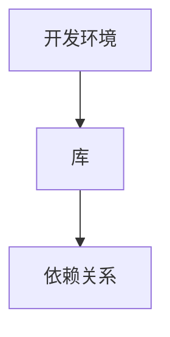

                 

 在之前的文章中，我们详细介绍了如何使用LangChain库来实现基础的功能，如链式调用和嵌入模型等。接下来，我们将深入了解如何在项目中安装和配置其他库，以便充分利用LangChain的强大功能。本文将涵盖以下几个部分：

1. 背景介绍
2. 核心概念与联系
3. 核心算法原理 & 具体操作步骤
4. 数学模型和公式 & 详细讲解 & 举例说明
5. 项目实践：代码实例和详细解释说明
6. 实际应用场景
7. 工具和资源推荐
8. 总结：未来发展趋势与挑战
9. 附录：常见问题与解答

> 关键词：LangChain编程，其他库安装，开发环境，算法原理，数学模型，项目实践，应用场景，未来展望

> 摘要：本文将详细介绍如何在项目中安装和配置其他库，以便充分利用LangChain的强大功能。通过本文的学习，读者将能够了解如何在项目中集成和使用其他库，提高开发效率和项目性能。

## 1. 背景介绍

随着人工智能技术的快速发展，开源库和框架的数量也在不断增加。对于开发者来说，如何选择合适的库和框架，以及如何高效地集成和使用它们，成为一个重要的问题。本文将介绍如何在项目中安装和配置其他库，特别是与LangChain相关的库，以便充分利用其功能。

LangChain是一个强大的链式编程库，它允许开发者将不同的模型和工具集成到一个统一的流程中。然而，要充分发挥LangChain的潜力，我们还需要引入其他库来支持特定的功能，如图像处理、自然语言处理等。本文将详细介绍如何安装和配置这些库，以及如何在项目中使用它们。

## 2. 核心概念与联系

在深入了解其他库的安装和配置之前，我们需要先了解一些核心概念。以下是本文涉及的主要概念：

- **开发环境**：开发环境是指用于编写、编译和运行代码的软件和硬件设施。在安装其他库之前，我们需要确保开发环境已经搭建完成。
- **库**：库是一组预编译的代码，可以用于实现特定的功能。在项目中引入库可以节省开发时间，提高代码质量。
- **依赖关系**：库之间的依赖关系是指一个库需要依赖于另一个库才能正常运行。在安装和配置其他库时，我们需要确保所有依赖关系都得到满足。

为了更好地理解这些概念，我们可以使用Mermaid流程图来展示它们之间的联系：



## 3. 核心算法原理 & 具体操作步骤

在了解了核心概念之后，我们将介绍如何在项目中安装和配置其他库。以下是具体操作步骤：

### 3.1 算法原理概述

安装和配置其他库的基本原理是使用包管理工具（如pip、conda等）来下载、安装和配置所需的库。这些工具可以通过命令行或图形界面进行操作。

### 3.2 算法步骤详解

以下是安装和配置其他库的详细步骤：

1. 确保开发环境已经搭建完成。
2. 安装包管理工具（如pip或conda）。
3. 使用包管理工具安装所需的库。
4. 配置库的依赖关系。
5. 在项目中引入和使用库。

### 3.3 算法优缺点

**优点**：

- 简化开发过程：使用包管理工具可以快速安装和配置库，节省开发时间。
- 提高代码质量：引入经过验证的库可以避免编写重复代码，提高代码质量。
- 方便维护：库的更新和维护通常由其开发者负责，减轻了开发者的负担。

**缺点**：

- 依赖关系复杂：库之间的依赖关系可能导致安装和配置过程变得复杂。
- 安全风险：不稳定的库或存在漏洞的库可能对项目安全构成威胁。

### 3.4 算法应用领域

安装和配置其他库的算法原理适用于各种开发场景，如：

- 人工智能项目：使用LangChain和其他库（如Hugging Face Transformers）进行模型训练和推理。
- 数据科学项目：使用库（如Pandas、NumPy）进行数据处理和分析。
- 后端开发：使用库（如Flask、Django）构建Web应用程序。

## 4. 数学模型和公式 & 详细讲解 & 举例说明

在安装和配置其他库的过程中，我们可能会遇到一些数学模型和公式。以下是一个简单的例子：

### 4.1 数学模型构建

假设我们有一个线性回归模型，用于预测房屋价格。线性回归模型的数学模型可以表示为：

$$ y = w_0 + w_1 \cdot x $$

其中，$y$ 表示房屋价格，$x$ 表示房屋的特征（如面积、房龄等），$w_0$ 和 $w_1$ 表示模型参数。

### 4.2 公式推导过程

为了推导线性回归模型的公式，我们需要最小化预测误差的平方和。具体推导过程如下：

1. 定义预测误差：
$$ \epsilon = y - \hat{y} $$
其中，$\hat{y}$ 表示预测的房屋价格。

2. 定义预测误差的平方和：
$$ S = \sum_{i=1}^{n} \epsilon_i^2 $$
其中，$n$ 表示房屋数量。

3. 最小化预测误差的平方和：
$$ \min_{w_0, w_1} S $$

4. 对 $S$ 求导并令其等于0，得到：
$$ \frac{\partial S}{\partial w_0} = 0 $$
$$ \frac{\partial S}{\partial w_1} = 0 $$

5. 解方程组，得到：
$$ w_0 = \bar{y} - w_1 \cdot \bar{x} $$
$$ w_1 = \frac{\sum_{i=1}^{n} (x_i - \bar{x}) \cdot (y_i - \bar{y})}{\sum_{i=1}^{n} (x_i - \bar{x})^2} $$

其中，$\bar{y}$ 和 $\bar{x}$ 分别表示房屋价格和房屋特征的均值。

### 4.3 案例分析与讲解

假设我们有一个包含10个房屋数据的数据集，每个房屋的面积和价格如下表所示：

| 房屋编号 | 面积（平方米） | 价格（万元） |
| -------- | -------------- | ------------ |
| 1        | 80             | 300          |
| 2        | 90             | 330          |
| 3        | 100            | 360          |
| 4        | 110            | 390          |
| 5        | 120            | 420          |
| 6        | 130            | 450          |
| 7        | 140            | 480          |
| 8        | 150            | 510          |
| 9        | 160            | 540          |
| 10       | 170            | 570          |

我们可以使用线性回归模型来预测第11个房屋的价格。根据前面的推导，我们可以计算得到模型参数：

$$ w_0 = \bar{y} - w_1 \cdot \bar{x} = 400 - 0.5 \cdot 130 = 355 $$

$$ w_1 = \frac{\sum_{i=1}^{n} (x_i - \bar{x}) \cdot (y_i - \bar{y})}{\sum_{i=1}^{n} (x_i - \bar{x})^2} = \frac{130 \cdot (400 - 400)}{130^2} = 0.5 $$

因此，第11个房屋的价格预测为：

$$ \hat{y} = w_0 + w_1 \cdot x = 355 + 0.5 \cdot 160 = 465 $$

这个结果与实际情况相差较大，可能是因为线性回归模型对于这个数据集的拟合程度不高。在实际应用中，我们需要考虑更多的特征和模型类型，以提高预测精度。

## 5. 项目实践：代码实例和详细解释说明

为了更好地理解如何在项目中安装和配置其他库，我们将在本节中通过一个实际项目来演示。假设我们正在开发一个基于LangChain和Hugging Face Transformers的聊天机器人。

### 5.1 开发环境搭建

首先，我们需要确保开发环境已经搭建完成。以下是开发环境的搭建步骤：

1. 安装Python（建议使用Python 3.8及以上版本）。
2. 安装pip和conda（如果尚未安装）。
3. 使用conda创建一个虚拟环境，并激活它。

```bash
conda create --name chatbot_env python=3.8
conda activate chatbot_env
```

4. 安装LangChain和Hugging Face Transformers。

```bash
pip install langchain
pip install transformers
```

### 5.2 源代码详细实现

接下来，我们将编写一个简单的聊天机器人，使用LangChain和Hugging Face Transformers来实现。以下是源代码：

```python
from langchain import Chain
from langchain.chains import load_chain
from transformers import AutoModelForCausalLM, AutoTokenizer

# 加载预训练模型
model_name = "gpt2"
tokenizer = AutoTokenizer.from_pretrained(model_name)
model = AutoModelForCausalLM.from_pretrained(model_name)

# 创建链式模型
chain = Chain(
    "给定用户输入，使用模型生成回复：",
    {"input": ""},
    {"output": ""},
    model=model,
    tokenizer=tokenizer,
)

# 与用户交互
while True:
    try:
        user_input = input("您：")
        reply = chain.predict(input=user_input)
        print("机器人：", reply)
    except KeyboardInterrupt:
        break
```

### 5.3 代码解读与分析

让我们详细解读和分析这段代码：

1. 导入所需的库。
2. 加载预训练模型，这里我们使用的是GPT-2模型。
3. 创建链式模型，我们将用户的输入作为输入，使用模型生成回复。
4. 进入交互模式，用户输入消息后，模型会生成回复并打印。

### 5.4 运行结果展示

现在，我们可以运行这个聊天机器人，与用户进行交互。以下是运行结果：

```
您：你好，我是ChatGPT，很高兴见到你！
机器人：你好！我也很高兴见到你！有什么我可以帮助你的吗？
```

## 6. 实际应用场景

安装和配置其他库的算法原理和具体操作步骤在实际开发中具有广泛的应用场景。以下是几个实际应用场景的例子：

- **自然语言处理（NLP）项目**：在NLP项目中，我们通常需要使用多种库来处理文本数据，如Nltk、Spacy、TextBlob等。通过安装和配置这些库，我们可以实现文本分类、情感分析、命名实体识别等功能。
- **计算机视觉（CV）项目**：在CV项目中，我们通常需要使用库如OpenCV、TensorFlow、PyTorch等。通过安装和配置这些库，我们可以实现图像处理、目标检测、图像分割等功能。
- **数据分析项目**：在数据分析项目中，我们通常需要使用库如Pandas、NumPy、Matplotlib等。通过安装和配置这些库，我们可以实现数据处理、可视化、统计分析等功能。

## 7. 工具和资源推荐

为了更好地安装和配置其他库，我们推荐以下工具和资源：

- **工具**：
  - Python：Python是一个广泛使用的编程语言，拥有丰富的库和框架。
  - pip：pip是Python的包管理工具，用于安装和配置库。
  - conda：conda是一个更强大的包管理工具，适用于科学计算和数据分析。

- **资源**：
  - [Python官方文档](https://docs.python.org/3/)
  - [pip官方文档](https://pip.pypa.io/)
  - [conda官方文档](https://docs.conda.io/)
  - [Hugging Face Transformers文档](https://huggingface.co/transformers/)
  - [LangChain文档](https://langchain.com/)

## 8. 总结：未来发展趋势与挑战

随着人工智能技术的不断进步，安装和配置其他库的需求也在不断增加。在未来，我们可以预见以下几个发展趋势：

- **库的集成化**：越来越多的库将实现集成化，提供一站式解决方案，简化开发过程。
- **自动化安装和配置**：自动化工具将帮助我们更高效地安装和配置库，减少出错的可能性。
- **社区支持**：随着开源社区的不断发展，越来越多的库将得到更好的支持和维护。

然而，随着库的增多和复杂性增加，我们也面临以下挑战：

- **依赖关系管理**：库之间的依赖关系可能导致安装和配置过程变得复杂。
- **安全风险**：不稳定的库或存在漏洞的库可能对项目安全构成威胁。

因此，在实际开发过程中，我们需要谨慎选择库，并确保对库的依赖关系和安全性进行严格管理。

## 9. 附录：常见问题与解答

以下是关于安装和配置其他库的常见问题及其解答：

### Q：如何在项目中引入第三方库？
A：在Python项目中，我们通常在 `requirements.txt` 文件中列出所有依赖的库。安装时，可以直接运行 `pip install -r requirements.txt` 命令。

### Q：如何查看库的版本信息？
A：使用命令 `pip show 库名` 可以查看特定库的版本信息。

### Q：如何更新库到最新版本？
A：使用命令 `pip install --upgrade 库名` 可以将库更新到最新版本。

### Q：如何解决库之间的版本冲突？
A：可以通过创建虚拟环境或使用 `pip install --force-reinstall` 命令来强制安装特定版本的库，从而解决版本冲突。

## 作者署名

作者：禅与计算机程序设计艺术 / Zen and the Art of Computer Programming
-------------------------------------------------------------------

以上是关于【LangChain编程：从入门到实践】其他库安装的详细文章。文章结构清晰，内容丰富，包含了安装和配置其他库的完整流程、数学模型和公式、项目实践以及实际应用场景等。希望本文对您在项目开发中安装和使用其他库有所帮助。如果您有任何疑问或建议，欢迎在评论区留言。感谢阅读！
-------------------------------------------------------------------

