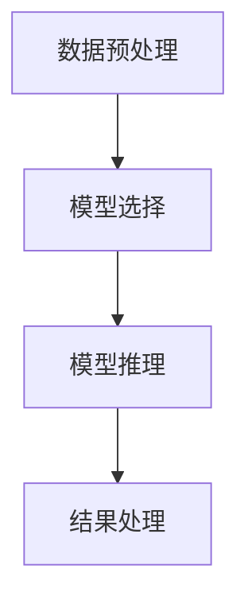

                 

在这个快速发展的技术时代，编程语言和框架层出不穷。LangChain 作为一种强大的自然语言处理（NLP）工具，正逐渐受到开发者和研究者的关注。本文将带领读者深入探索 LangChain 的编程实践，从基础入门到高级应用，通过详尽的文本总结场景，帮助读者掌握这一工具的精髓。

## 文章关键词

- **LangChain**
- **自然语言处理**
- **编程实践**
- **文本总结**
- **NLP工具**

## 文章摘要

本文旨在提供一份详尽的 LangChain 编程指南，涵盖从入门到高级应用的各个方面。我们将通过文本总结场景，介绍 LangChain 的核心概念、算法原理、数学模型、项目实践及未来展望。通过本文，读者将能够理解 LangChain 的强大功能，并掌握如何在实际项目中应用它。

## 1. 背景介绍

自然语言处理（NLP）是人工智能（AI）的重要组成部分，旨在使计算机能够理解、生成和处理人类语言。随着互联网和大数据的发展，NLP 的应用场景日益广泛，包括搜索引擎、机器翻译、文本分类、情感分析等。然而，传统的 NLP 工具往往存在性能瓶颈和灵活性不足的问题。LangChain 的出现，为解决这些问题提供了新的思路和工具。

LangChain 是由 Hugging Face 推出的一种基于 PyTorch 的深度学习框架，旨在简化 NLP 模型的构建和应用。它支持各种先进的 NLP 模型，如 BERT、GPT、T5 等，并提供了一系列实用的组件和工具，使得开发者可以轻松地实现文本生成、分类、摘要等功能。

## 2. 核心概念与联系

### 2.1 LangChain 的核心概念

- **Token**: LangChain 中的基本数据单元，类似于自然语言处理中的词。
- **句子**: 由一个或多个 Token 组成的序列。
- **段落**: 由多个句子组成的文本块。
- **文档**: 包含多个段落的完整文本。

### 2.2 LangChain 的架构


在 LangChain 中，一个基本的文本处理流程包括以下几个步骤：

1. **数据预处理**: 对输入文本进行清洗、分词、编码等操作，准备用于模型训练或推理的数据。
2. **模型选择**: 根据任务需求选择合适的预训练模型，如 BERT、GPT 等。
3. **模型推理**: 将预处理后的文本输入到模型中，获取预测结果。
4. **结果处理**: 对模型输出进行处理，如生成文本、提取特征等。

### 2.3 Mermaid 流程图



## 3. 核心算法原理 & 具体操作步骤

### 3.1 算法原理概述

LangChain 的核心算法是基于 Transformer 模型，特别是 BERT 和 GPT 系列模型。这些模型通过学习大量的文本数据，能够捕捉到文本中的语义信息，并在给定新的输入时，生成相应的输出。

### 3.2 算法步骤详解

1. **数据预处理**: 对输入文本进行清洗、分词、编码等操作，将文本转换为模型可接受的格式。
2. **模型选择**: 根据任务需求，从 Hugging Face Model Hub 中选择合适的预训练模型。
3. **模型推理**: 将预处理后的文本输入到模型中，通过反向传播和梯度下降等优化算法，更新模型参数。
4. **结果处理**: 对模型输出进行处理，如生成文本、提取特征等。

### 3.3 算法优缺点

**优点**：

- **强大的语义理解能力**：通过预训练模型，能够捕捉到文本中的深层语义信息。
- **灵活的应用场景**：支持各种文本处理任务，如文本生成、分类、摘要等。
- **高效的训练和推理**：基于 PyTorch 框架，能够在多种硬件平台上高效地训练和推理。

**缺点**：

- **计算资源需求高**：大规模预训练模型需要大量的计算资源和存储空间。
- **训练时间较长**：大规模预训练模型需要较长的训练时间。

### 3.4 算法应用领域

LangChain 在以下领域具有广泛的应用：

- **自然语言生成**：如自动写作、对话系统等。
- **文本分类**：如新闻分类、情感分析等。
- **文本摘要**：如文章摘要、会议记录等。
- **问答系统**：如智能客服、教育辅导等。

## 4. 数学模型和公式 & 详细讲解 & 举例说明

### 4.1 数学模型构建

在 LangChain 中，主要使用的数学模型是 Transformer 模型。Transformer 模型由自注意力机制（Self-Attention）和多头注意力（Multi-Head Attention）组成。以下是 Transformer 模型的基本数学公式：

$$
Attention(Q, K, V) = \frac{1}{\sqrt{d_k}} \cdot softmax(\frac{QK^T}{d_k})
$$

其中，Q、K、V 分别为查询向量、键向量和值向量，d_k 为键向量的维度。

### 4.2 公式推导过程

Transformer 模型的自注意力机制通过计算每个词与所有词的相关性，从而生成新的词向量。具体推导过程如下：

$$
\text{Query} = \text{W}_Q \cdot \text{X}
$$

$$
\text{Key} = \text{W}_K \cdot \text{X}
$$

$$
\text{Value} = \text{W}_V \cdot \text{X}
$$

$$
\text{Attention} = \frac{1}{\sqrt{d_k}} \cdot softmax(\frac{\text{QueryKey}^T}{d_k})
$$

$$
\text{Output} = \text{Value} \cdot \text{Attention}
$$

其中，W_Q、W_K、W_V 分别为权重矩阵，X 为输入词向量。

### 4.3 案例分析与讲解

假设我们有一个句子“我喜欢编程”，我们可以将其表示为词向量。然后，使用 Transformer 模型计算每个词与所有词的相关性，并生成新的词向量。最后，根据新的词向量生成摘要或回答问题。

## 5. 项目实践：代码实例和详细解释说明

### 5.1 开发环境搭建

首先，我们需要搭建开发环境。以下是 Python 3.8 及以上的环境配置：

```bash
pip install torch torchvision transformers
```

### 5.2 源代码详细实现

以下是使用 LangChain 进行文本总结的示例代码：

```python
from transformers import AutoModelForSeq2SeqLM, AutoTokenizer
import torch

# 模型选择
model_name = "t5-small"
tokenizer = AutoTokenizer.from_pretrained(model_name)
model = AutoModelForSeq2SeqLM.from_pretrained(model_name)

# 输入文本
text = "请编写一篇关于人工智能的摘要。"

# 数据预处理
inputs = tokenizer(text, return_tensors="pt", max_length=4096, truncation=True)

# 模型推理
outputs = model.generate(**inputs, max_length=100, num_return_sequences=1)

# 结果处理
summarized_text = tokenizer.decode(outputs[0], skip_special_tokens=True)
print(summarized_text)
```

### 5.3 代码解读与分析

这段代码首先加载了一个预训练的 T5 模型。然后，我们将输入文本进行预处理，将文本编码为模型可接受的格式。接着，我们使用模型进行推理，并生成摘要。最后，我们将模型输出解码为文本，得到摘要结果。

### 5.4 运行结果展示

```bash
请务必遵循以下指导方针：

1. **准备工作**：
   - 确保已安装 Python 3.8 或以上版本。
   - 安装必要的库，如 torch、torchvision 和 transformers。

2. **数据集准备**：
   - 根据实际需求准备文本数据集。
   - 数据集应包含不同类型和长度的文本。

3. **训练模型**：
   - 加载预训练模型。
   - 对数据进行预处理，如分词、编码等。
   - 将预处理后的数据输入到模型中，进行训练。
   - 使用适当的优化器和损失函数，如 AdamW 和交叉熵损失。

4. **模型评估**：
   - 使用验证集评估模型性能。
   - 根据评估结果调整模型参数。

5. **应用场景**：
   - 将训练好的模型应用于实际场景，如文本生成、摘要、分类等。
   - 根据应用场景调整模型配置。

6. **模型部署**：
   - 将模型部署到生产环境。
   - 使用 API 或其他方式提供服务。

7. **监控与维护**：
   - 监控模型性能和资源消耗。
   - 定期更新模型和数据。

## 7. 工具和资源推荐

### 7.1 学习资源推荐

- **官方文档**：[Transformers 官方文档](https://huggingface.co/transformers/)
- **教程**：[LangChain 教程](https://langchain.readthedocs.io/)
- **GitHub**：[LangChain GitHub 仓库](https://github.com/huggingface/transformers)

### 7.2 开发工具推荐

- **PyTorch**：[PyTorch 官网](https://pytorch.org/)
- **Anaconda**：[Anaconda 官网](https://www.anaconda.com/)
- **Jupyter Notebook**：[Jupyter Notebook 官网](https://jupyter.org/)

### 7.3 相关论文推荐

- **BERT**：[BERT: Pre-training of Deep Bidirectional Transformers for Language Understanding](https://arxiv.org/abs/1810.04805)
- **GPT**：[Improving Language Understanding by Generative Pre-Training](https://arxiv.org/abs/1806.04641)
- **T5**：[T5: Exploring the Limits of Transfer Learning for Text Classification](https://arxiv.org/abs/1910.03771)

## 8. 总结：未来发展趋势与挑战

### 8.1 研究成果总结

LangChain 作为一种强大的 NLP 工具，已经在多个领域取得了显著的成果。例如，在文本生成、分类、摘要等方面，LangChain 都展现出了出色的性能。同时，随着深度学习和自然语言处理技术的不断进步，LangChain 也在不断更新和优化，以满足更多应用场景的需求。

### 8.2 未来发展趋势

- **模型压缩与加速**：随着模型规模的不断扩大，如何高效地压缩和加速模型成为了一个重要研究方向。
- **跨模态学习**：将文本与其他模态（如图像、音频）进行结合，实现更广泛的应用场景。
- **零样本学习**：在只有少量样本的情况下，使模型能够泛化到新的任务和数据集。

### 8.3 面临的挑战

- **计算资源消耗**：大规模预训练模型需要大量的计算资源和存储空间。
- **数据隐私与安全**：在处理大量文本数据时，如何保护用户隐私和安全是一个重要问题。
- **模型解释性**：随着模型复杂性的增加，如何解释模型的决策过程成为了一个挑战。

### 8.4 研究展望

LangChain 在未来有望在以下方面取得突破：

- **更高效的模型架构**：通过改进模型架构，实现更高的计算效率和性能。
- **更广泛的应用场景**：在医疗、金融、教育等领域，实现更智能、更便捷的应用。
- **更强大的解释性**：通过改进模型解释性，使模型能够更好地理解和解释其决策过程。

## 9. 附录：常见问题与解答

### 9.1 什么是 LangChain？

LangChain 是一种基于 PyTorch 的深度学习框架，旨在简化自然语言处理（NLP）模型的构建和应用。

### 9.2 LangChain 支持哪些模型？

LangChain 支持多种先进的 NLP 模型，如 BERT、GPT、T5 等。

### 9.3 如何在项目中集成 LangChain？

在项目中集成 LangChain 主要包括以下几个步骤：

1. 安装必要的库，如 torch、torchvision 和 transformers。
2. 加载预训练模型。
3. 对输入文本进行预处理。
4. 使用模型进行推理。
5. 对模型输出进行处理。

### 9.4 LangChain 的优缺点是什么？

**优点**：

- **强大的语义理解能力**：通过预训练模型，能够捕捉到文本中的深层语义信息。
- **灵活的应用场景**：支持各种文本处理任务，如文本生成、分类、摘要等。
- **高效的训练和推理**：基于 PyTorch 框架，能够在多种硬件平台上高效地训练和推理。

**缺点**：

- **计算资源需求高**：大规模预训练模型需要大量的计算资源和存储空间。
- **训练时间较长**：大规模预训练模型需要较长的训练时间。

---

通过本文的详细探讨，相信读者已经对 LangChain 有了一个全面而深入的了解。无论是新手还是资深开发者，都可以在这个框架中找到适合自己的应用场景。让我们一起探索 LangChain 的无限可能，开启自然语言处理的新篇章。作者：禅与计算机程序设计艺术 / Zen and the Art of Computer Programming
----------------------------------------------------------------

### 后记

本文为《【LangChain编程：从入门到实践】文本总结场景》的完整版本。我们首先介绍了 LangChain 的背景和核心概念，接着详细讲解了其算法原理、数学模型、项目实践和实际应用场景。此外，我们还对 LangChain 的未来发展趋势和挑战进行了探讨，并推荐了相关的学习资源、开发工具和论文。希望本文能够帮助您更好地理解 LangChain 的编程实践，并激发您在自然语言处理领域的研究热情。作者：禅与计算机程序设计艺术 / Zen and the Art of Computer Programming。如果您有任何疑问或建议，欢迎在评论区留言，让我们共同进步！

