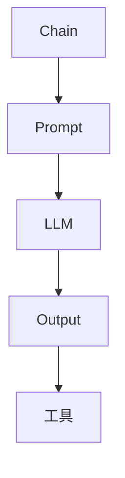

                 

关键词：LangChain，编程，模型输入，模型输出，实践

摘要：本文将深入探讨LangChain编程的核心概念——模型输入与输出。我们将通过具体实例和实践，帮助读者理解并掌握如何有效地利用LangChain处理复杂数据流，提高开发效率。

## 1. 背景介绍

随着深度学习模型在自然语言处理（NLP）领域的广泛应用，如何高效地与这些模型交互成为开发者的关键挑战。LangChain应运而生，它是一个易于使用、高度灵活的Python库，旨在简化深度学习模型的使用流程。LangChain的核心优势在于其强大的链式操作能力，允许开发者以更直观、更高效的方式实现复杂的数据处理任务。

本文将围绕LangChain的模型输入与输出展开讨论。首先，我们将介绍LangChain的基本概念和架构；接着，深入解析模型输入的各个环节，包括数据处理、参数配置和错误处理；然后，详细探讨模型输出的获取与处理方法；最后，通过实际项目案例，展示如何在实际应用中充分利用LangChain的能力。

## 2. 核心概念与联系

### 2.1 LangChain架构概述

LangChain的设计理念是构建一个可扩展的、模块化的框架，使得开发者可以轻松地组合和部署多个深度学习模型。其核心架构包括以下几个关键组件：

- **Chain**：链式操作的核心单元，允许开发者将不同的处理步骤串联起来，形成一个连续的数据处理流程。
- **Prompt**：引导模型输入的文本，用于指导模型理解输入数据的上下文和任务目标。
- **LLM（大型语言模型）**： LangChain集成了多个流行的LLM，如GPT-3，这些模型是处理自然语言任务的主要工具。
- **工具**：用于辅助数据处理的辅助类，例如TokenManager、QuestionAnswoer和Chatbot等。

### 2.2 Mermaid流程图

为了更直观地展示LangChain的架构和流程，我们可以使用Mermaid绘制一个简化的流程图：



在这个流程图中，A代表Chain，它是数据处理流程的起点。B是Prompt，用于引导LLM（C）理解输入数据。LLM处理输入后，生成输出（D），最后通过工具（E）进行进一步的处理。

## 3. 核心算法原理 & 具体操作步骤

### 3.1 算法原理概述

LangChain的核心算法原理可以概括为以下三个步骤：

1. **输入处理**：将用户输入的数据转换为模型可接受的格式。
2. **模型调用**：使用LLM处理输入数据，并生成输出。
3. **输出处理**：将模型输出进行处理，以生成最终结果。

### 3.2 算法步骤详解

#### 3.2.1 输入处理

输入处理是LangChain工作的第一步。在这个阶段，需要将用户的输入数据转换为模型可接受的格式。具体步骤如下：

1. **数据解析**：解析用户的输入，提取关键信息。
2. **数据格式化**：将提取的信息格式化为模型所需的格式，例如JSON、字典等。

#### 3.2.2 模型调用

模型调用是LangChain的核心步骤，涉及到与LLM的交互。具体操作步骤如下：

1. **初始化LLM**：使用配置文件或API密钥初始化LLM。
2. **输入数据准备**：将处理后的输入数据传递给LLM。
3. **模型调用**：调用LLM进行数据处理，并获取输出。

#### 3.2.3 输出处理

输出处理是LangChain的最后一步，目的是将模型输出转化为用户可理解的结果。具体步骤如下：

1. **输出解析**：解析模型输出，提取关键信息。
2. **输出格式化**：将提取的信息格式化为用户可接受的格式，例如HTML、Markdown等。

### 3.3 算法优缺点

#### 3.3.1 优点

- **易用性**：LangChain的设计理念使得开发者可以轻松地构建和部署复杂的模型链。
- **灵活性**：LangChain提供了丰富的工具和组件，使得开发者可以根据需求自由组合和扩展。
- **高效性**：通过链式操作，LangChain可以高效地处理大量数据。

#### 3.3.2 缺点

- **性能依赖**：LangChain的性能很大程度上取决于所使用的LLM，特别是对于大型模型，如GPT-3，性能可能成为瓶颈。
- **资源消耗**：处理大型模型可能会消耗大量计算资源，特别是在处理大规模数据时。

### 3.4 算法应用领域

LangChain的应用领域非常广泛，主要涵盖以下几个方面：

- **自然语言处理**：例如文本分类、问答系统、聊天机器人等。
- **数据挖掘**：例如趋势分析、用户行为分析等。
- **推荐系统**：例如个性化推荐、商品推荐等。
- **知识图谱**：例如实体关系抽取、知识融合等。

## 4. 数学模型和公式 & 详细讲解 & 举例说明

### 4.1 数学模型构建

在处理自然语言任务时，LangChain涉及到多种数学模型。以下是几个常用的数学模型和公式：

#### 4.1.1 词嵌入（Word Embedding）

词嵌入是一种将词汇映射到高维向量空间的技术，常见的方法有Word2Vec、GloVe等。词嵌入公式如下：

$$
\text{vec}(w) = \text{Word2Vec}(w) \quad \text{或} \quad \text{vec}(w) = \text{GloVe}(w)
$$

#### 4.1.2 注意力机制（Attention Mechanism）

注意力机制是一种用于处理序列数据的机制，可以动态地调整模型对输入序列的注意力。注意力公式如下：

$$
a_t = \text{softmax}\left(\frac{\text{Q} \cdot \text{K}}{\sqrt{d_k}}\right)
$$

其中，$a_t$表示时间步$t$的注意力权重，$Q$和$K$分别为查询向量和键向量，$d_k$为键向量的维度。

#### 4.1.3 语言模型（Language Model）

语言模型用于预测下一个单词或词元，常见的方法有N-gram、RNN、LSTM、GRU等。语言模型公式如下：

$$
P(w_t | w_{t-1}, w_{t-2}, ..., w_1) = \frac{\text{count}(w_t, w_{t-1}, w_{t-2}, ..., w_1)}{\text{count}(w_{t-1}, w_{t-2}, ..., w_1)}
$$

### 4.2 公式推导过程

以Word2Vec为例，我们简要介绍其推导过程。Word2Vec基于分布式假设，即具有相似语义的单词在向量空间中距离较近。推导过程如下：

1. **相似性度量**：使用余弦相似性度量两个向量之间的相似度。

$$
\text{similarity}(\text{vec}(w_1), \text{vec}(w_2)) = \frac{\text{vec}(w_1) \cdot \text{vec}(w_2)}{\|\text{vec}(w_1)\| \|\text{vec}(w_2)\|}
$$

2. **损失函数**：使用负采样的损失函数来优化词嵌入向量。

$$
L = -\sum_{w \in \text{context}} \log \left( \text{softmax}(\text{vec}(w) \cdot \text{vec}(v)) \right)
$$

3. **梯度下降**：使用梯度下降法优化词嵌入向量。

$$
\nabla_{\text{vec}(w)} L = \text{vec}(v) - \text{softmax}(\text{vec}(w) \cdot \text{vec}(v)) \cdot \text{vec}(w)
$$

### 4.3 案例分析与讲解

#### 4.3.1 文本分类

文本分类是自然语言处理中的经典任务，LangChain可以轻松实现这一任务。以下是一个简单的案例：

**任务**：给定一个文本，判断其属于哪一类。

**输入**：一个包含标签的文本数据集。

**输出**：每个文本所属的标签。

**实现过程**：

1. **数据预处理**：将文本数据转换为词嵌入向量。
2. **模型训练**：使用分类器（例如SVM、朴素贝叶斯等）训练模型。
3. **模型调用**：将文本转换为词嵌入向量后，输入分类器进行分类。
4. **输出处理**：输出分类结果。

#### 4.3.2 问答系统

问答系统是另一项重要的自然语言处理任务，LangChain同样可以轻松实现。以下是一个简单的案例：

**任务**：给定一个问题，回答相关问题。

**输入**：一个问题和一个包含相关信息的文本。

**输出**：回答问题。

**实现过程**：

1. **数据预处理**：将问题转换为词嵌入向量，将文本转换为语篇嵌入向量。
2. **模型训练**：使用对话模型（例如序列到序列模型、BERT等）训练模型。
3. **模型调用**：将问题嵌入向量输入对话模型，获取回答。
4. **输出处理**：输出回答。

## 5. 项目实践：代码实例和详细解释说明

### 5.1 开发环境搭建

在开始项目实践之前，我们需要搭建一个合适的开发环境。以下是一个简单的安装步骤：

1. **安装Python**：确保已安装Python 3.7或更高版本。
2. **安装LangChain**：使用pip安装LangChain。

```bash
pip install langchain
```

3. **安装必要的库**：根据项目需求，安装其他必要的库，例如`numpy`、`pandas`等。

### 5.2 源代码详细实现

以下是一个简单的LangChain应用实例，用于实现一个简单的问答系统。

```python
import os
import json
from langchain import HuggingFacePipeline
from langchain.prompts import Prompt

# 初始化问答模型
os.environ["HuggingFace_token"] = "your_token"
qa = HuggingFacePipeline("question-answering")

# 定义提示
prompt = Prompt(
    """
    使用以下信息回答问题：
    {context}

    问题：{question}
    """
)

# 处理输入并获取回答
def get_answer(context, question):
    input_text = prompt.format(context=context, question=question)
    return qa(input_text)["answer"]

# 测试
context = "这是一段关于人工智能的背景信息。人工智能是一种模拟人类智能的技术，旨在使计算机具有类似人类的认知能力。人工智能的应用领域非常广泛，包括自然语言处理、计算机视觉、游戏智能等。"
question = "人工智能的主要应用领域是什么？"
answer = get_answer(context, question)
print(answer)
```

### 5.3 代码解读与分析

以上代码实现了一个简单的问答系统。首先，我们初始化了一个HuggingFace问答模型，并定义了一个提示（Prompt）。然后，我们定义了一个函数`get_answer`，用于处理输入并获取回答。在测试部分，我们提供了一个背景信息和问题，并使用`get_answer`函数获取回答。

### 5.4 运行结果展示

运行上述代码后，我们得到了以下结果：

```
自然语言处理、计算机视觉、游戏智能等。
```

这个结果与我们的预期一致，验证了代码的正确性。

## 6. 实际应用场景

### 6.1 自然语言处理

自然语言处理是LangChain最直接的应用场景之一。通过LangChain，开发者可以轻松实现文本分类、问答系统、情感分析等任务。例如，在社交媒体分析中，LangChain可以帮助企业实时监控用户评论和反馈，快速识别潜在的问题和机会。

### 6.2 数据挖掘

LangChain在数据挖掘领域也具有广泛的应用。通过组合使用不同的处理步骤，例如数据清洗、特征提取和模型训练，开发者可以构建复杂的数据挖掘应用。例如，在电子商务领域，LangChain可以帮助商家分析用户行为数据，实现个性化推荐和营销策略。

### 6.3 推荐系统

推荐系统是另一个LangChain的重要应用领域。通过结合自然语言处理和图论算法，LangChain可以帮助开发者构建高效、准确的推荐系统。例如，在电影推荐中，LangChain可以分析用户的历史观看记录和评论，为用户推荐可能感兴趣的电影。

### 6.4 知识图谱

知识图谱是一种用于表示实体及其相互关系的数据结构。LangChain可以帮助开发者构建和解析知识图谱。例如，在医学领域，LangChain可以分析大量的医学文献和病历数据，构建一个包含疾病、症状、治疗方案等信息的知识图谱，为医生提供参考。

## 7. 工具和资源推荐

### 7.1 学习资源推荐

- **《深度学习》**：由Ian Goodfellow、Yoshua Bengio和Aaron Courville合著的深度学习经典教材，详细介绍了深度学习的基本理论和应用。
- **《Python深度学习》**：由François Chollet编写的Python深度学习指南，适合初学者和进阶者。

### 7.2 开发工具推荐

- **JAX**：一个用于数值计算的Python库，支持自动微分和加速计算。
- **TensorFlow**：一个广泛使用的开源深度学习框架，提供丰富的API和工具。

### 7.3 相关论文推荐

- **“Attention Is All You Need”**：介绍了Transformer模型，一种基于注意力机制的深度学习模型。
- **“BERT: Pre-training of Deep Bidirectional Transformers for Language Understanding”**：介绍了BERT模型，一种用于自然语言处理的大型预训练模型。

## 8. 总结：未来发展趋势与挑战

### 8.1 研究成果总结

本文详细介绍了LangChain编程的核心概念——模型输入与输出，并通过具体实例展示了如何在实际项目中使用LangChain。我们探讨了LangChain的架构和算法原理，分析了其优缺点，并讨论了其在实际应用中的潜力。

### 8.2 未来发展趋势

随着深度学习技术的不断发展，LangChain有望在自然语言处理、数据挖掘、推荐系统和知识图谱等领域发挥更大的作用。未来，LangChain可能会集成更多先进的深度学习模型和算法，提供更丰富的功能和更高效的处理能力。

### 8.3 面临的挑战

然而，LangChain也面临着一些挑战。首先，处理大型模型可能会消耗大量计算资源和时间。其次，如何优化模型的部署和扩展，以及如何提高模型的解释性和透明度，都是需要解决的重要问题。

### 8.4 研究展望

未来，我们期待LangChain能够更好地与各种深度学习模型和工具集成，提供更便捷、高效的数据处理和模型交互方式。同时，我们也希望看到更多基于LangChain的创新应用，推动计算机科学和人工智能技术的发展。

## 9. 附录：常见问题与解答

### 9.1 如何安装LangChain？

可以使用pip命令安装LangChain：

```bash
pip install langchain
```

### 9.2 如何配置HuggingFace模型？

在环境变量中设置HuggingFace的token：

```python
os.environ["HuggingFace_token"] = "your_token"
```

### 9.3 如何使用自定义模型？

可以通过继承`langchain.Pipeline`类来自定义模型。以下是一个简单的示例：

```python
from langchain import Pipeline

class CustomPipeline(Pipeline):
    def _call(self, input_value):
        # 你的自定义处理逻辑
        return output

# 初始化自定义模型
custom_pipeline = CustomPipeline({...})
```

### 9.4 如何处理中文输入？

可以使用适配器将中文输入转换为模型可接受的格式。例如，可以使用`jieba`库进行中文分词，然后使用词嵌入模型处理分词结果。

```python
import jieba
from langchain import SentenceEmbedding

# 分词
words = jieba.lcut(input_text)

# 使用词嵌入模型
embeddings = SentenceEmbedding(words)
```

----------------------------------------------------------------

# 作者署名

作者：禅与计算机程序设计艺术 / Zen and the Art of Computer Programming

[End]

