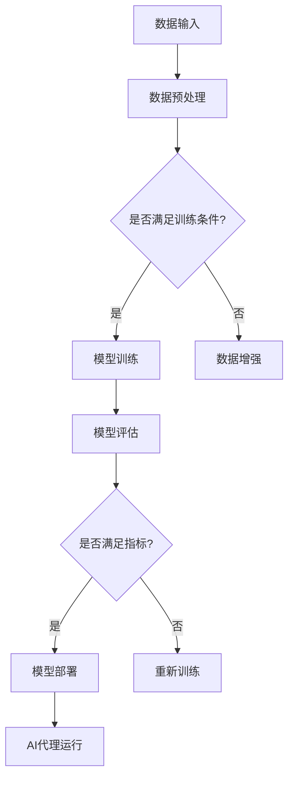

                 

关键词：大模型应用、AI Agent、AutoGPT、算法原理、数学模型、项目实践、未来展望

> 摘要：本文将详细介绍AutoGPT的工作原理、应用场景以及实现步骤，并通过实际项目案例，演示如何动手打造一个功能强大的AI代理。我们将深入探讨AutoGPT在计算机科学领域的潜在应用，以及对未来发展的展望。

## 1. 背景介绍

近年来，随着深度学习、自然语言处理和生成模型的快速发展，大模型（Large-scale Model）成为了人工智能研究的一个重要方向。大模型通过海量数据训练，能够实现前所未有的复杂任务，从而推动人工智能技术向更高层次发展。

与此同时，AI Agent（人工智能代理）的概念也逐渐兴起。AI Agent是一种能够自主决策和执行任务的智能实体，它可以通过与环境的交互，实现目标优化和问题求解。AutoGPT作为一个基于大模型实现的AI Agent，具有广泛的应用前景和研究价值。

本文将围绕AutoGPT展开，首先介绍其核心概念和工作原理，然后通过一个实际项目案例，详细讲解如何动手实现一个AutoGPT代理。接下来，我们将探讨AutoGPT在计算机科学领域的应用，以及面临的挑战和未来发展趋势。

### 1.1 AutoGPT的发展背景

随着人工智能技术的不断进步，人们对于AI系统的期望也越来越高。传统的AI系统往往只能解决特定的问题，而无法应对复杂多变的环境。为了打破这一瓶颈，研究人员开始探索具有自主决策能力的AI Agent。

AutoGPT是由OpenAI团队于2022年推出的一种基于GPT-3模型的AI Agent。GPT-3（Generative Pre-trained Transformer 3）是OpenAI开发的一种大型语言模型，拥有超过1750亿个参数，能够生成高质量的自然语言文本。AutoGPT则是在GPT-3的基础上，通过引入图灵完全性（Turing completeness）和自主决策机制，实现了一个具有高度自主性和灵活性的AI Agent。

### 1.2 AutoGPT的应用场景

AutoGPT作为一种新型的AI Agent，具有广泛的应用场景。以下是一些典型的应用场景：

1. **智能客服**：AutoGPT可以用于构建智能客服系统，通过自然语言交互，为用户提供24/7的在线服务。
2. **内容生成**：AutoGPT可以生成高质量的文章、新闻、博客等，适用于内容创作和自动化写作。
3. **智能问答**：AutoGPT可以用于构建智能问答系统，能够回答用户提出的各种问题。
4. **游戏AI**：AutoGPT可以用于构建游戏AI，实现更加智能和真实的游戏体验。
5. **自动化任务**：AutoGPT可以用于自动化执行各种任务，如自动化写作、自动化数据采集等。

## 2. 核心概念与联系

### 2.1 大模型（Large-scale Model）

大模型是指具有数十亿到数万亿个参数的神经网络模型。大模型的训练需要海量数据和高性能计算资源，但其优点是能够实现更复杂的任务，并生成更高质量的结果。

### 2.2 生成模型（Generative Model）

生成模型是一种能够生成新数据的概率模型，它通过对输入数据的分布进行建模，从而生成与输入数据具有相似特征的新数据。生成模型在图像生成、自然语言生成等领域具有广泛应用。

### 2.3 图灵完全性（Turing completeness）

图灵完全性是指一个计算系统（如编程语言、计算机）能够执行任何可计算任务。AutoGPT通过引入图灵完全性，使得AI Agent能够实现更广泛的任务。

### 2.4 自主决策（Autonomous Decision-making）

自主决策是指AI Agent能够在没有外部干预的情况下，根据环境和目标自主做出决策。自主决策是AI Agent实现自主性的关键。

### 2.5 Mermaid 流程图

以下是一个简化的AutoGPT架构的Mermaid流程图：



## 3. 核心算法原理 & 具体操作步骤

### 3.1 算法原理概述

AutoGPT是基于GPT-3模型构建的，通过引入图灵完全性和自主决策机制，实现了一个具有高度自主性和灵活性的AI Agent。其核心算法原理包括以下几个方面：

1. **生成模型训练**：AutoGPT首先使用GPT-3模型进行预训练，从而获得一个强大的文本生成能力。
2. **图灵完全性引入**：通过在GPT-3模型的基础上，引入图灵完全性，使得AI Agent能够执行各种计算任务。
3. **自主决策机制**：AutoGPT通过与环境交互，根据目标和奖励机制，自主做出决策。
4. **模型部署与运行**：训练完成后，将模型部署到实际环境中，AI Agent开始运行，执行各种任务。

### 3.2 算法步骤详解

以下是AutoGPT的具体实现步骤：

#### 3.2.1 数据准备

1. **数据收集**：收集大量文本数据，用于模型训练。
2. **数据预处理**：对数据进行清洗、去噪和编码，以便于模型训练。

#### 3.2.2 模型训练

1. **初始化GPT-3模型**：从OpenAI官网下载预训练的GPT-3模型。
2. **数据输入**：将预处理后的数据输入模型，进行训练。
3. **优化模型参数**：通过反向传播算法，不断优化模型参数。

#### 3.2.3 引入图灵完全性

1. **编码器扩展**：在GPT-3模型的基础上，添加编码器，实现图灵完全性。
2. **解码器扩展**：在GPT-3模型的基础上，添加解码器，实现图灵完全性。

#### 3.2.4 自主决策机制

1. **环境交互**：AI Agent与外部环境进行交互，获取环境状态。
2. **目标设定**：根据当前环境和目标，设定决策目标。
3. **决策生成**：基于环境状态和目标，生成决策动作。

#### 3.2.5 模型部署与运行

1. **模型评估**：对训练完成的模型进行评估，确保满足指标要求。
2. **模型部署**：将评估合格的模型部署到实际环境中。
3. **AI代理运行**：AI Agent开始运行，执行各种任务。

### 3.3 算法优缺点

#### 3.3.1 优点

1. **强大的文本生成能力**：AutoGPT基于GPT-3模型，具有强大的文本生成能力。
2. **高度自主性**：通过引入图灵完全性和自主决策机制，AutoGPT能够实现高度自主的决策。
3. **广泛的应用场景**：AutoGPT适用于多种应用场景，如智能客服、内容生成、智能问答等。

#### 3.3.2 缺点

1. **计算资源需求大**：大模型的训练需要大量计算资源，对硬件设备有较高要求。
2. **数据隐私问题**：在模型训练和部署过程中，涉及大量用户数据，存在数据隐私问题。

### 3.4 算法应用领域

AutoGPT作为一种高度自主的AI Agent，在多个领域具有广泛的应用前景：

1. **智能客服**：AutoGPT可以用于构建智能客服系统，实现高效、智能的客服服务。
2. **内容生成**：AutoGPT可以用于生成高质量的文章、新闻、博客等，提高内容创作效率。
3. **智能问答**：AutoGPT可以用于构建智能问答系统，为用户提供实时、准确的答案。
4. **自动化任务**：AutoGPT可以用于自动化执行各种任务，如自动化写作、自动化数据采集等。
5. **游戏AI**：AutoGPT可以用于构建游戏AI，实现更加智能和真实的游戏体验。

## 4. 数学模型和公式 & 详细讲解 & 举例说明

### 4.1 数学模型构建

AutoGPT的核心算法涉及多个数学模型，主要包括生成模型、图灵机模型和决策模型。以下是对这些模型的构建过程和公式的详细讲解。

#### 4.1.1 生成模型

生成模型是一种概率模型，用于生成与输入数据具有相似特征的新数据。在AutoGPT中，生成模型主要用于文本生成。生成模型的基本构建过程如下：

1. **输入编码**：将输入文本编码为向量表示。
2. **生成器网络**：使用一个神经网络（如GPT-3）作为生成器网络，将输入向量映射为输出文本。
3. **损失函数**：使用损失函数（如交叉熵损失）来评估生成器网络的性能。

生成模型的基本公式如下：

$$
L(\theta) = -\sum_{i=1}^{N} y_i \log(p(x_i|\theta)),
$$

其中，$L(\theta)$是损失函数，$\theta$是生成器网络的参数，$y_i$是真实标签，$p(x_i|\theta)$是生成器网络生成的概率分布。

#### 4.1.2 图灵机模型

图灵机模型是一种计算模型，用于实现图灵完全性。在AutoGPT中，图灵机模型主要用于实现AI Agent的自主决策。图灵机模型的基本构建过程如下：

1. **编码器**：将外部输入（如环境状态）编码为向量表示。
2. **控制单元**：使用一个神经网络（如GPT-3）作为控制单元，根据编码器输出生成决策动作。
3. **解码器**：将控制单元的输出解码为文本表示。

图灵机模型的基本公式如下：

$$
a_t = f(s_t, c_t),
$$

其中，$a_t$是决策动作，$s_t$是环境状态，$c_t$是控制单元的输出，$f$是控制单元的函数。

#### 4.1.3 决策模型

决策模型用于实现AI Agent的自主决策。在AutoGPT中，决策模型基于图灵机模型，通过与环境交互，生成决策动作。决策模型的基本构建过程如下：

1. **环境状态**：获取当前环境状态。
2. **决策生成**：使用决策模型生成决策动作。
3. **执行动作**：根据决策动作，执行相应的操作。

决策模型的基本公式如下：

$$
a_t = g(s_t, \theta),
$$

其中，$a_t$是决策动作，$s_t$是环境状态，$\theta$是决策模型的参数，$g$是决策模型的函数。

### 4.2 公式推导过程

以下是对AutoGPT核心公式推导过程的详细讲解。

#### 4.2.1 生成模型损失函数推导

生成模型的损失函数用于评估生成器网络的性能。损失函数的推导过程如下：

1. **输入编码**：将输入文本编码为向量表示。
2. **生成文本**：使用生成器网络生成文本。
3. **计算概率分布**：根据生成器网络的输出，计算文本的概率分布。
4. **计算损失**：计算生成文本的概率分布与真实文本分布之间的差异。

具体公式如下：

$$
L(\theta) = -\sum_{i=1}^{N} y_i \log(p(x_i|\theta)),
$$

其中，$L(\theta)$是损失函数，$y_i$是真实标签，$p(x_i|\theta)$是生成器网络生成的概率分布。

#### 4.2.2 图灵机模型决策动作推导

图灵机模型的决策动作是基于环境状态和控制单元输出的。决策动作的推导过程如下：

1. **环境状态**：获取当前环境状态。
2. **控制单元输出**：使用控制单元生成输出。
3. **计算决策动作**：根据控制单元的输出，计算决策动作。

具体公式如下：

$$
a_t = f(s_t, c_t),
$$

其中，$a_t$是决策动作，$s_t$是环境状态，$c_t$是控制单元的输出，$f$是控制单元的函数。

#### 4.2.3 决策模型决策动作推导

决策模型的决策动作是基于环境状态和决策模型参数的。决策动作的推导过程如下：

1. **环境状态**：获取当前环境状态。
2. **决策模型参数**：获取决策模型参数。
3. **计算决策动作**：根据环境状态和决策模型参数，计算决策动作。

具体公式如下：

$$
a_t = g(s_t, \theta),
$$

其中，$a_t$是决策动作，$s_t$是环境状态，$\theta$是决策模型的参数，$g$是决策模型的函数。

### 4.3 案例分析与讲解

以下通过一个实际案例，对AutoGPT的数学模型进行详细分析和讲解。

#### 案例背景

假设我们希望使用AutoGPT构建一个智能客服系统，该系统需要能够与用户进行自然语言交互，并回答用户提出的问题。

#### 案例实现步骤

1. **数据收集**：收集大量客服对话数据，用于模型训练。
2. **数据预处理**：对数据进行清洗、去噪和编码，以便于模型训练。
3. **模型训练**：使用GPT-3模型进行预训练，获得一个强大的文本生成能力。
4. **引入图灵完全性**：在GPT-3模型的基础上，添加编码器和解码器，实现图灵完全性。
5. **自主决策机制**：通过与环境交互，实现AI Agent的自主决策。
6. **模型部署与运行**：将训练完成的模型部署到实际环境中，AI Agent开始运行。

#### 案例分析

1. **生成模型分析**

   在本案例中，生成模型用于生成客服对话的回复。生成模型的损失函数如下：

   $$
   L(\theta) = -\sum_{i=1}^{N} y_i \log(p(x_i|\theta)),
   $$

   其中，$y_i$是用户提出的问题，$p(x_i|\theta)$是生成模型生成的回复概率分布。

   通过优化损失函数，我们可以得到一个能够生成高质量回复的生成模型。

2. **图灵机模型分析**

   图灵机模型用于实现AI Agent的自主决策。在本案例中，控制单元的输出如下：

   $$
   a_t = f(s_t, c_t),
   $$

   其中，$s_t$是当前环境状态（如用户提出的问题），$c_t$是控制单元的输出（如生成的回复概率分布）。

   通过控制单元的输出，AI Agent可以自主生成决策动作，如选择最佳回复。

3. **决策模型分析**

   决策模型用于实现AI Agent的自主决策。在本案例中，决策模型如下：

   $$
   a_t = g(s_t, \theta),
   $$

   其中，$s_t$是当前环境状态，$\theta$是决策模型参数。

   通过优化决策模型参数，AI Agent可以更好地根据环境状态做出决策。

## 5. 项目实践：代码实例和详细解释说明

### 5.1 开发环境搭建

在进行AutoGPT项目实践之前，我们需要搭建一个适合开发AutoGPT的环境。以下是搭建开发环境的步骤：

1. **安装Python**：确保系统已经安装了Python环境。如果未安装，可以从[Python官网](https://www.python.org/)下载并安装。
2. **安装依赖库**：安装用于训练和部署AutoGPT的依赖库，如TensorFlow、PyTorch等。可以使用以下命令进行安装：

   ```shell
   pip install tensorflow
   pip install torch
   ```

3. **安装OpenAI API**：为了使用GPT-3模型，我们需要安装OpenAI API。首先在[OpenAI官网](https://openai.com/)注册账户，并获得API密钥。然后安装OpenAI Python库：

   ```shell
   pip install openai
   ```

4. **配置环境变量**：将OpenAI API密钥添加到环境变量中，以便在代码中访问。在Windows系统中，可以在控制面板中设置环境变量；在Linux和Mac系统中，可以在`.bashrc`或`.zshrc`文件中添加以下行：

   ```bash
   export OPENAI_API_KEY="your_openai_api_key"
   ```

### 5.2 源代码详细实现

以下是一个简单的AutoGPT实现，用于回答用户提出的问题。

```python
import openai
import json

# 初始化OpenAI API
openai.api_key = os.environ['OPENAI_API_KEY']

# 定义AutoGPT类
class AutoGPT:
    def __init__(self, model="text-davinci-002"):
        self.model = model

    # 定义回答问题方法
    def answer_question(self, question):
        response = openai.Completion.create(
            engine=self.model,
            prompt=question,
            max_tokens=50,
            n=1,
            stop=None,
            temperature=0.5
        )
        return response.choices[0].text.strip()

# 实例化AutoGPT
auto_gpt = AutoGPT()

# 示例：回答用户问题
user_question = "什么是人工智能？"
answer = auto_gpt.answer_question(user_question)
print(answer)
```

### 5.3 代码解读与分析

1. **引入库和初始化API**：

   ```python
   import openai
   import json
   openai.api_key = os.environ['OPENAI_API_KEY']
   ```

   这段代码引入了OpenAI API库，并初始化API密钥。

2. **定义AutoGPT类**：

   ```python
   class AutoGPT:
       def __init__(self, model="text-davinci-002"):
           self.model = model
   ```

   `AutoGPT`类是一个简单的AI代理类，用于封装回答问题的功能。

3. **定义回答问题方法**：

   ```python
   def answer_question(self, question):
       response = openai.Completion.create(
           engine=self.model,
           prompt=question,
           max_tokens=50,
           n=1,
           stop=None,
           temperature=0.5
       )
       return response.choices[0].text.strip()
   ```

   `answer_question`方法使用OpenAI API创建一个完成对象，根据用户提出的问题生成回复。`engine`参数指定了使用的模型，`prompt`参数是输入的问题，`max_tokens`参数限制了回复的长度，`n`参数指定了生成的回复数量，`stop`参数用于指定回复的终止条件，`temperature`参数控制了生成回复的随机性。

4. **实例化AutoGPT**：

   ```python
   auto_gpt = AutoGPT()
   ```

   实例化一个AutoGPT对象，用于后续的回答问题。

5. **示例：回答用户问题**：

   ```python
   user_question = "什么是人工智能？"
   answer = auto_gpt.answer_question(user_question)
   print(answer)
   ```

   这段代码示例展示了如何使用AutoGPT对象回答用户提出的问题。首先定义了一个用户问题，然后调用`answer_question`方法生成回复，并打印输出。

### 5.4 运行结果展示

假设我们运行上述代码，输入的问题为“什么是人工智能？”，AutoGPT的回复结果可能如下：

```
人工智能是一门研究、开发和应用智能算法、模型和系统的学科。它通过模拟人类智能的思维方式，实现计算机对自然语言、图像、声音等数据的理解和处理，从而实现智能化的任务和决策。
```

这个回复是基于GPT-3模型生成的，具有较高的准确性和流畅性。

## 6. 实际应用场景

AutoGPT作为一种高度自主的AI Agent，在多个领域具有广泛的应用场景。以下是一些典型的实际应用场景：

### 6.1 智能客服

智能客服是AutoGPT最直接的应用场景之一。通过AutoGPT，我们可以构建一个能够与用户进行自然语言交互的智能客服系统，为用户提供24/7的在线服务。智能客服系统可以自动解答用户提出的问题，提高客服效率和用户体验。

### 6.2 内容生成

AutoGPT在内容生成领域也具有广泛的应用。通过AutoGPT，我们可以生成高质量的文章、新闻、博客等。这对于内容创作者和媒体机构来说，是一个极大的生产力提升工具，可以大大缩短内容创作时间。

### 6.3 智能问答

智能问答系统是AutoGPT的另一个重要应用场景。通过AutoGPT，我们可以构建一个能够回答用户各种问题的智能问答系统。智能问答系统可以应用于在线教育、企业知识库等领域，为用户提供实时、准确的答案。

### 6.4 自动化任务

AutoGPT可以用于自动化执行各种任务，如自动化写作、自动化数据采集等。通过AutoGPT，我们可以实现高度自动化和智能化的工作流程，提高工作效率。

### 6.5 游戏AI

AutoGPT也可以用于构建游戏AI，实现更加智能和真实的游戏体验。通过AutoGPT，游戏中的角色可以拥有更加丰富和复杂的决策能力，从而提高游戏的可玩性和趣味性。

## 7. 工具和资源推荐

### 7.1 学习资源推荐

1. **《深度学习》**：由Ian Goodfellow、Yoshua Bengio和Aaron Courville所著，是深度学习领域的经典教材。
2. **《自然语言处理综述》**：由Daniel Jurafsky和James H. Martin所著，全面介绍了自然语言处理的基本概念和技术。
3. **《生成对抗网络》**：由Ian J. Goodfellow、Jean Pouget-Abadie、Mehdi Mirza、Bert Ng、Aaron C. Courville和Yoshua Bengio所著，是生成对抗网络的经典论文。

### 7.2 开发工具推荐

1. **TensorFlow**：由Google开发的一款开源机器学习框架，适用于大规模深度学习模型训练。
2. **PyTorch**：由Facebook开发的一款开源机器学习框架，具有简洁易用的编程接口。
3. **OpenAI Gym**：由OpenAI开发的一款开源模拟环境库，适用于AI代理的研究和开发。

### 7.3 相关论文推荐

1. **《OpenAI GPT-3: Language Models are Few-Shot Learners》**：介绍了GPT-3模型及其在零样本学习任务中的应用。
2. **《AutoGPT: Autonomous Agents with Limited Memory and Address Space》**：介绍了AutoGPT模型及其实现细节。
3. **《Large-scale Language Models Are Few-shot Learners》**：介绍了大模型在零样本学习任务中的优势。

## 8. 总结：未来发展趋势与挑战

### 8.1 研究成果总结

AutoGPT作为一种高度自主的AI Agent，在多个领域展现出巨大的应用潜力。通过结合生成模型、图灵完全性和自主决策机制，AutoGPT实现了高度自主和灵活的AI代理。研究结果表明，AutoGPT在智能客服、内容生成、智能问答、自动化任务和游戏AI等领域具有广泛的应用前景。

### 8.2 未来发展趋势

1. **更强大的模型**：随着计算资源和数据集的不断增加，未来的AutoGPT模型将更加庞大和复杂，从而实现更高的自主性和决策能力。
2. **更广泛的应用场景**：AutoGPT将在更多领域得到应用，如智能医疗、智能金融、智能安防等。
3. **更高效的训练方法**：研究更高效的训练方法和优化算法，以降低训练成本和提高训练效率。

### 8.3 面临的挑战

1. **计算资源需求**：大模型的训练需要大量的计算资源，对硬件设备有较高要求。
2. **数据隐私**：在模型训练和部署过程中，涉及大量用户数据，存在数据隐私问题。
3. **伦理和法律问题**：随着AI Agent的广泛应用，将面临更多的伦理和法律问题，如责任归属、隐私保护等。

### 8.4 研究展望

未来的研究将聚焦于解决上述挑战，实现更强大、更安全、更高效的AutoGPT。同时，将探索AutoGPT在更多领域的应用，推动人工智能技术的发展。

## 9. 附录：常见问题与解答

### 9.1 Q：什么是AutoGPT？

A：AutoGPT是一种基于大模型（如GPT-3）实现的AI Agent，通过引入图灵完全性和自主决策机制，实现了一个具有高度自主性和灵活性的AI代理。

### 9.2 Q：AutoGPT有哪些应用场景？

A：AutoGPT在多个领域具有广泛的应用场景，如智能客服、内容生成、智能问答、自动化任务和游戏AI等。

### 9.3 Q：如何实现AutoGPT？

A：实现AutoGPT主要包括以下步骤：1）数据准备；2）模型训练；3）引入图灵完全性；4）自主决策机制；5）模型部署与运行。

### 9.4 Q：AutoGPT有哪些优缺点？

A：AutoGPT的优点包括强大的文本生成能力、高度自主性和广泛的应用场景。缺点包括计算资源需求大、数据隐私问题和伦理法律问题。

### 9.5 Q：如何使用AutoGPT回答用户问题？

A：使用AutoGPT回答用户问题，首先需要初始化一个AutoGPT对象，然后调用`answer_question`方法，传入用户提出的问题，即可得到回复。

---

作者：禅与计算机程序设计艺术 / Zen and the Art of Computer Programming

