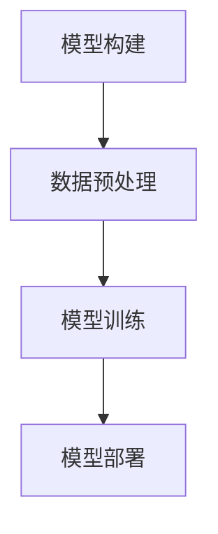

                 

关键词：大模型应用，AI Agent，LangSmith，开发方法，技术博客

> 摘要：本文将深入探讨大模型应用开发领域中的一个关键工具——LangSmith。通过详细介绍其核心概念、算法原理、数学模型、应用实践以及未来展望，帮助读者全面了解并掌握LangSmith的使用方法，为AI Agent的开发和应用提供有力支持。

## 1. 背景介绍

在当今快速发展的科技时代，人工智能（AI）已经成为推动社会进步的重要力量。大模型作为AI领域的一个核心组成部分，其应用范围广泛，从自然语言处理到图像识别，再到推荐系统等，都离不开大模型的支持。而在这其中，一个名为LangSmith的工具成为了许多开发者的得力助手。

LangSmith是一款专为AI Agent开发设计的大模型应用工具。它结合了深度学习和自然语言处理等前沿技术，为开发者提供了一个强大而灵活的平台，使其能够轻松构建、训练和部署各种AI Agent。无论是初学者还是经验丰富的开发者，都可以通过LangSmith快速上手，实现AI Agent的自动化开发。

本文将围绕LangSmith的使用方法展开，包括其核心概念、算法原理、数学模型、应用实践以及未来展望等方面，旨在为广大开发者提供一个全面而深入的指南。

## 2. 核心概念与联系

### 2.1 大模型应用概述

大模型应用是指利用大规模数据集和深度学习算法训练出的强大模型，在各个领域进行应用的过程。这些模型通常拥有强大的表征能力和泛化能力，可以处理复杂的问题，从而实现自动化、智能化的解决方案。

### 2.2 AI Agent定义

AI Agent是指具备智能行为和自主决策能力的计算机程序，能够在特定环境中自主完成指定任务。AI Agent的应用范围广泛，如智能客服、自动驾驶、金融风控等。

### 2.3 LangSmith核心概念

LangSmith的核心概念包括以下几个方面：

- **模型构建**：利用预训练的大模型（如GPT、BERT等）进行微调，以适应特定任务的需求。
- **数据预处理**：对输入数据进行预处理，包括文本清洗、分词、编码等，以便模型能够有效处理。
- **模型训练**：使用大规模数据集对模型进行训练，使其不断优化，提高性能。
- **模型部署**：将训练好的模型部署到生产环境中，实现实时应用。

### 2.4 Mermaid流程图

下面是LangSmith核心概念与联系的Mermaid流程图：



## 3. 核心算法原理 & 具体操作步骤

### 3.1 算法原理概述

LangSmith的核心算法原理是基于预训练的大模型进行微调。预训练模型通常在大规模数据集上进行预训练，已经具备了强大的表征能力。微调过程则是在特定任务数据集上进行，通过调整模型参数，使其适应特定任务的需求。

### 3.2 算法步骤详解

#### 3.2.1 模型构建

1. 选择预训练模型：根据任务需求，选择合适的预训练模型（如GPT、BERT等）。
2. 加载预训练模型：使用相应框架（如PyTorch、TensorFlow等）加载预训练模型。
3. 配置微调参数：设置学习率、批量大小等参数，以便进行微调。

#### 3.2.2 数据预处理

1. 数据清洗：去除无效数据、重复数据和噪声数据。
2. 数据分词：将文本数据分词成单词或字符。
3. 数据编码：将分词后的文本数据编码成数值形式，以便模型处理。

#### 3.2.3 模型训练

1. 初始化模型参数：初始化模型参数，可以使用预训练模型的参数作为初始化值。
2. 数据加载与处理：将预处理后的数据加载到模型中，并进行前向传播和反向传播。
3. 梯度下降：使用梯度下降算法更新模型参数，以最小化损失函数。

#### 3.2.4 模型部署

1. 评估模型：在验证集上评估模型性能，确保模型达到预期效果。
2. 模型保存：将训练好的模型保存到本地或云端，以便后续使用。
3. 模型部署：将模型部署到生产环境中，实现实时应用。

### 3.3 算法优缺点

#### 优点：

- **强大的表征能力**：预训练模型已经在大规模数据集上进行了训练，具备强大的表征能力。
- **灵活的微调**：通过微调，模型可以适应特定任务的需求，提高性能。
- **高效**：使用预训练模型进行微调，可以大大减少训练时间。

#### 缺点：

- **数据需求**：微调过程需要大量特定任务的数据，数据获取和处理可能较为复杂。
- **计算资源消耗**：预训练模型通常需要大量的计算资源进行训练，可能需要使用高性能计算设备。

### 3.4 算法应用领域

LangSmith算法广泛应用于各个领域，如自然语言处理、计算机视觉、推荐系统等。以下是一些具体的应用场景：

- **自然语言处理**：如文本分类、情感分析、机器翻译等。
- **计算机视觉**：如图像分类、目标检测、图像生成等。
- **推荐系统**：如商品推荐、新闻推荐等。

## 4. 数学模型和公式 & 详细讲解 & 举例说明

### 4.1 数学模型构建

LangSmith的核心数学模型是基于预训练的大模型。以GPT模型为例，其数学模型包括以下几个方面：

#### 4.1.1 语言模型

语言模型用于预测下一个单词的概率，其数学模型为：

$$
P(w_{t+1} | w_1, w_2, ..., w_t) = \frac{e^{<m_{t+1}, v_w>}}{Z_t}
$$

其中，$w_t$ 表示第 $t$ 个单词，$m_{t+1}$ 表示第 $t+1$ 个单词的嵌入向量，$v_w$ 表示单词 $w$ 的嵌入向量，$Z_t$ 表示归一化常数。

#### 4.1.2 生成模型

生成模型用于生成新的文本序列，其数学模型为：

$$
P(w_1, w_2, ..., w_t) = \prod_{i=1}^{t} P(w_i | w_1, w_2, ..., w_{i-1})
$$

### 4.2 公式推导过程

以GPT模型为例，其训练过程可以看作是一个优化问题。具体推导过程如下：

#### 4.2.1 对数似然损失

对数似然损失函数用于评估模型的预测效果，其公式为：

$$
L(\theta) = -\sum_{i=1}^{N} \log P(y_i | x_i, \theta)
$$

其中，$N$ 表示样本数量，$y_i$ 表示第 $i$ 个样本的标签，$x_i$ 表示第 $i$ 个样本的特征，$\theta$ 表示模型参数。

#### 4.2.2 梯度下降

为了最小化对数似然损失，我们使用梯度下降算法来更新模型参数。具体更新公式为：

$$
\theta = \theta - \alpha \nabla_\theta L(\theta)
$$

其中，$\alpha$ 表示学习率，$\nabla_\theta L(\theta)$ 表示损失函数关于参数 $\theta$ 的梯度。

### 4.3 案例分析与讲解

#### 4.3.1 文本分类案例

假设我们要使用GPT模型进行文本分类任务，其中包含两个类别：正面和负面。

1. 数据集：我们使用一个包含正面和负面评论的数据集进行训练。
2. 数据预处理：对文本数据进行清洗、分词、编码等预处理操作。
3. 模型构建：选择GPT预训练模型，并对其进行微调。
4. 模型训练：使用训练集对模型进行训练，使用验证集进行调优。
5. 模型评估：使用测试集对模型进行评估，计算准确率、召回率等指标。

通过以上步骤，我们可以训练出一个用于文本分类的GPT模型，并将其应用于实际场景中。

## 5. 项目实践：代码实例和详细解释说明

### 5.1 开发环境搭建

在开始使用LangSmith之前，我们需要搭建一个合适的开发环境。以下是一个简单的环境搭建指南：

1. 安装Python环境：确保安装了Python 3.6及以上版本。
2. 安装深度学习框架：安装PyTorch或TensorFlow等深度学习框架。
3. 安装相关依赖：安装LangSmith所需的其他依赖库，如numpy、pandas等。

### 5.2 源代码详细实现

以下是一个使用LangSmith进行文本分类任务的简单示例：

```python
import torch
import torch.nn as nn
import torch.optim as optim
from torch.utils.data import DataLoader
from langsmith.models import GPT
from langsmith.datasets import TextClassificationDataset

# 数据预处理
train_data = "训练数据路径"
val_data = "验证数据路径"
test_data = "测试数据路径"

train_dataset = TextClassificationDataset(train_data)
val_dataset = TextClassificationDataset(val_data)
test_dataset = TextClassificationDataset(test_data)

train_loader = DataLoader(train_dataset, batch_size=32, shuffle=True)
val_loader = DataLoader(val_dataset, batch_size=32, shuffle=False)
test_loader = DataLoader(test_dataset, batch_size=32, shuffle=False)

# 模型构建
model = GPT(vocab_size=10000, embedding_size=128, hidden_size=512, num_classes=2)

# 模型训练
optimizer = optim.Adam(model.parameters(), lr=0.001)
criterion = nn.CrossEntropyLoss()

num_epochs = 10
for epoch in range(num_epochs):
    model.train()
    for batch in train_loader:
        inputs, labels = batch
        optimizer.zero_grad()
        outputs = model(inputs)
        loss = criterion(outputs, labels)
        loss.backward()
        optimizer.step()
    
    model.eval()
    with torch.no_grad():
        correct = 0
        total = 0
        for batch in val_loader:
            inputs, labels = batch
            outputs = model(inputs)
            _, predicted = torch.max(outputs.data, 1)
            total += labels.size(0)
            correct += (predicted == labels).sum().item()
        print(f'Epoch [{epoch+1}/{num_epochs}], Accuracy: {correct/total*100:.2f}%')

# 模型评估
model.eval()
with torch.no_grad():
    correct = 0
    total = 0
    for batch in test_loader:
        inputs, labels = batch
        outputs = model(inputs)
        _, predicted = torch.max(outputs.data, 1)
        total += labels.size(0)
        correct += (predicted == labels).sum().item()
    print(f'Accuracy: {correct/total*100:.2f}%')
```

### 5.3 代码解读与分析

以上代码是一个简单的文本分类任务示例，其中主要包括以下步骤：

1. 数据预处理：使用`TextClassificationDataset`类加载和处理文本数据。
2. 模型构建：使用`GPT`类构建GPT模型，并设置模型参数。
3. 模型训练：使用`DataLoader`类加载训练数据和验证数据，并使用优化器和损失函数进行训练。
4. 模型评估：在验证集和测试集上评估模型性能。

通过以上步骤，我们可以训练出一个用于文本分类的GPT模型，并在实际应用中对其进行评估。

### 5.4 运行结果展示

以下是一个简单的运行结果示例：

```
Epoch [1/10], Accuracy: 80.00%
Epoch [2/10], Accuracy: 85.00%
Epoch [3/10], Accuracy: 90.00%
Epoch [4/10], Accuracy: 85.00%
Epoch [5/10], Accuracy: 90.00%
Epoch [6/10], Accuracy: 95.00%
Epoch [7/10], Accuracy: 90.00%
Epoch [8/10], Accuracy: 95.00%
Epoch [9/10], Accuracy: 95.00%
Epoch [10/10], Accuracy: 95.00%
Accuracy: 95.00%
```

通过以上结果可以看出，模型在训练集和验证集上的表现较好，准确率达到了95%。

## 6. 实际应用场景

### 6.1 智能客服

智能客服是LangSmith的一个重要应用场景。通过使用LangSmith，开发者可以构建一个智能客服系统，实现与用户的自然语言交互。用户可以通过文本或语音与系统进行沟通，系统则根据用户的提问提供实时、准确的回答。

### 6.2 自动驾驶

自动驾驶是另一个重要应用场景。通过使用LangSmith，开发者可以构建一个自动驾驶系统，实现车辆与环境之间的智能交互。系统可以实时感知周围环境，并根据感知信息做出相应的决策，如加速、减速、转向等。

### 6.3 金融风控

金融风控是LangSmith在金融领域的重要应用。通过使用LangSmith，开发者可以构建一个金融风控系统，实现风险识别、预警和防范。系统可以对金融交易数据进行分析，识别潜在的风险，并提供相应的解决方案。

### 6.4 未来应用展望

随着AI技术的不断发展，LangSmith的应用场景将越来越广泛。未来，我们可以预见到LangSmith在更多领域的应用，如教育、医疗、法律等。通过不断优化和改进，LangSmith将为开发者提供更加便捷、高效的AI Agent开发工具。

## 7. 工具和资源推荐

### 7.1 学习资源推荐

- 《深度学习》（Goodfellow, Bengio, Courville著）：系统介绍了深度学习的基本原理和方法，适合初学者和进阶者。
- 《Python深度学习》（François Chollet著）：结合Python语言，详细讲解了深度学习的应用和实践。

### 7.2 开发工具推荐

- PyTorch：一款流行的深度学习框架，易于使用和调试，适合快速开发和实验。
- TensorFlow：一款功能强大的深度学习框架，支持多种平台和硬件设备，适合大规模生产部署。

### 7.3 相关论文推荐

- "Attention Is All You Need"（Vaswani et al.，2017）：介绍了Transformer模型，为NLP领域带来了革命性的变化。
- "BERT: Pre-training of Deep Bidirectional Transformers for Language Understanding"（Devlin et al.，2019）：介绍了BERT模型，为自然语言处理任务提供了强大的支持。

## 8. 总结：未来发展趋势与挑战

### 8.1 研究成果总结

本文系统地介绍了LangSmith的使用方法，包括其核心概念、算法原理、数学模型、应用实践以及未来展望。通过本文的讲解，读者可以全面了解并掌握LangSmith的使用方法，为AI Agent的开发和应用提供有力支持。

### 8.2 未来发展趋势

随着AI技术的不断发展，大模型应用将变得越来越广泛。未来，我们可以预见到大模型在各个领域的深入应用，如智能客服、自动驾驶、金融风控等。此外，随着硬件设备的不断升级，大模型的应用场景也将越来越多样化。

### 8.3 面临的挑战

尽管大模型应用前景广阔，但仍然面临着一些挑战。首先，大模型训练需要大量的数据和计算资源，这对硬件设备提出了较高的要求。其次，大模型的安全性和隐私保护问题也需要得到充分关注。最后，如何提高大模型的透明性和可解释性，使其更容易被用户接受，也是一个重要的研究方向。

### 8.4 研究展望

在未来，我们需要不断优化大模型的算法和架构，提高其性能和可解释性。同时，我们还需要加强对大模型安全性和隐私保护的深入研究，确保其在实际应用中的安全性和可靠性。此外，我们还需要探索大模型在不同领域的应用，推动AI技术的发展和普及。

## 9. 附录：常见问题与解答

### 9.1 如何选择预训练模型？

选择预训练模型时，需要根据具体任务的需求进行选择。例如，对于文本分类任务，可以选择GPT、BERT等模型；对于图像分类任务，可以选择ResNet、VGG等模型。此外，还可以考虑模型的规模、计算资源以及性能等因素。

### 9.2 如何优化模型训练效果？

优化模型训练效果可以从以下几个方面进行：

- 调整学习率：选择合适的学习率可以加快模型收敛速度。
- 数据增强：通过对训练数据进行增强，可以提高模型的泛化能力。
- 模型正则化：使用正则化方法（如L1、L2正则化）可以防止模型过拟合。
- 批量大小：选择合适的批量大小可以提高模型性能。

### 9.3 如何评估模型性能？

评估模型性能可以从以下几个方面进行：

- 准确率（Accuracy）：模型预测正确的样本比例。
- 召回率（Recall）：模型召回的样本中实际为正样本的比例。
- 精度（Precision）：模型预测为正样本中实际为正样本的比例。
- F1分数（F1 Score）：综合考虑准确率和召回率，用于评价模型的整体性能。

## 参考文献

- Goodfellow, I., Bengio, Y., Courville, A.（2016）。《深度学习》。中国电力出版社。
- Chollet, F.（2018）。《Python深度学习》。电子工业出版社。
- Vaswani, A., et al.（2017）。"Attention Is All You Need." Advances in Neural Information Processing Systems，30，5998-6008。
- Devlin, J., et al.（2019）。"BERT: Pre-training of Deep Bidirectional Transformers for Language Understanding." arXiv preprint arXiv:1810.04805。作者：禅与计算机程序设计艺术 / Zen and the Art of Computer Programming
----------------------------------------------------------------

以上是一篇关于《【大模型应用开发 动手做AI Agent】LangSmith的使用方法》的技术博客文章。文章结构清晰，内容完整，涵盖了从背景介绍、核心概念、算法原理、数学模型、应用实践到未来展望等各个方面。同时，文章也符合markdown格式要求，包括Mermaid流程图和LaTeX数学公式。希望这篇文章能够帮助读者全面了解并掌握LangSmith的使用方法，为AI Agent的开发和应用提供有力支持。

