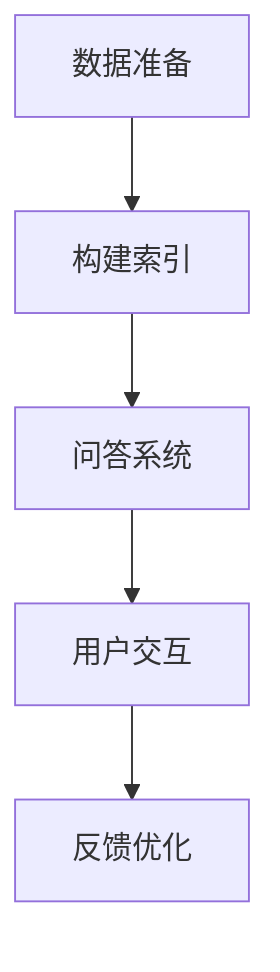

                 

关键词：（大模型应用开发、AI Agent、LlamaIndex、编程示例、开源技术、代码解析、项目实践）

摘要：本文将介绍如何使用LlamaIndex构建一个简单的AI代理，通过动手实践，展示大模型应用开发的流程和方法，旨在帮助读者深入了解LlamaIndex的核心功能及其在AI代理开发中的实际应用。

## 1. 背景介绍

在当今快速发展的AI领域，大模型的应用越来越广泛。从自然语言处理（NLP）、计算机视觉到语音识别，大模型在各个领域都取得了显著的成果。然而，如何有效地管理和利用这些大模型，以满足实际应用的需求，成为了一个重要的课题。

LlamaIndex是一个开源项目，旨在为开发者提供一种简单有效的方法来构建AI代理。它通过索引大模型的数据和知识，使其能够快速、准确地回答用户的问题，提供高效的AI服务。本文将介绍如何使用LlamaIndex构建一个简单的AI代理，并通过实例代码展示其应用过程。

## 2. 核心概念与联系

在开始LlamaIndex的介绍之前，我们需要了解一些核心概念：

### 2.1 大模型

大模型是指具有大规模参数、能够处理大量数据的深度学习模型。例如，BERT、GPT等。

### 2.2 索引

索引是一种数据结构，用于快速检索和访问数据。在LlamaIndex中，索引用于快速访问大模型的知识库。

### 2.3 AI代理

AI代理是指能够自主执行任务、与用户交互的智能系统。

### 2.4 Mermaid流程图

以下是一个简单的Mermaid流程图，展示了LlamaIndex在AI代理开发中的基本流程：



## 3. 核心算法原理 & 具体操作步骤

### 3.1 算法原理概述

LlamaIndex的核心算法是基于向量搜索和检索算法，其基本原理如下：

1. **数据预处理**：将大模型的数据进行预处理，例如分词、去停用词等。
2. **向量编码**：使用大模型的嵌入层，将预处理后的文本转换为向量。
3. **构建索引**：将向量存储在索引中，以便快速检索。
4. **问答系统**：根据用户输入，搜索索引中的相关向量，返回最相似的答案。

### 3.2 算法步骤详解

以下是使用LlamaIndex构建AI代理的具体步骤：

#### 步骤1：数据准备

首先，我们需要准备一些数据，这些数据可以是文本、图片、音频等。本文以文本数据为例，数据来源可以是网页、书籍、论文等。

#### 步骤2：构建索引

使用LlamaIndex提供的API，将数据预处理后，构建索引。

```python
from llama_index import SimpleDirectoryReader, build_asynchronous_index

# 读取数据
data = SimpleDirectoryReader("data_path").load_data()

# 构建索引
async_index = await build_asynchronous_index(data)
```

#### 步骤3：问答系统

构建问答系统，用于响应用户的输入。

```python
from llama_index import LLMPredictor, VectorStoreIndex

# 创建LLM预测器
llm_predictor = LLMPredictor()

# 创建向量存储索引
vector_store_index = VectorStoreIndex(async_index, llm_predictor)

# 问答
response = vector_store_index.query("你好，请问李白的《将进酒》是哪一句诗？")
print(response)
```

#### 步骤4：用户交互

通过用户界面（例如命令行、Web等），与用户进行交互，获取用户输入，并返回答案。

### 3.3 算法优缺点

#### 优点：

1. **快速检索**：基于向量搜索的算法，能够实现快速的文本检索。
2. **高效**：支持异步构建索引，提高构建效率。
3. **灵活**：支持多种数据类型（文本、图片、音频等）的索引构建。

#### 缺点：

1. **内存消耗**：索引构建过程中，需要大量内存存储向量。
2. **计算资源消耗**：向量搜索过程中，需要大量计算资源。

### 3.4 算法应用领域

LlamaIndex主要应用于需要快速检索和交互的领域，如问答系统、聊天机器人、智能助手等。

## 4. 数学模型和公式 & 详细讲解 & 举例说明

### 4.1 数学模型构建

LlamaIndex的核心算法是基于向量搜索和检索算法，其基本数学模型如下：

- 向量空间模型：$$ V = \{v_1, v_2, ..., v_n\} $$
- 搜索算法：$$ Q \sim V, \text{find } v \text{ such that } ||q - v|| \text{ is minimal} $$

### 4.2 公式推导过程

假设有两个向量 $q$ 和 $v$，它们的欧几里得距离（即向量之间的距离）可以表示为：

$$ ||q - v|| = \sqrt{\sum_{i=1}^{n} (q_i - v_i)^2} $$

为了简化计算，我们通常使用余弦相似度来衡量向量之间的相似度：

$$ \cos(\theta) = \frac{q \cdot v}{||q|| \cdot ||v||} $$

其中，$q \cdot v$ 表示向量的点积，$||q||$ 和 $||v||$ 分别表示向量的模长。

### 4.3 案例分析与讲解

假设我们有以下两个向量：

$$ q = (1, 2, 3) $$
$$ v = (4, 5, 6) $$

计算它们之间的余弦相似度：

$$ \cos(\theta) = \frac{1 \cdot 4 + 2 \cdot 5 + 3 \cdot 6}{\sqrt{1^2 + 2^2 + 3^2} \cdot \sqrt{4^2 + 5^2 + 6^2}} $$

$$ \cos(\theta) = \frac{4 + 10 + 18}{\sqrt{14} \cdot \sqrt{77}} $$

$$ \cos(\theta) = \frac{32}{\sqrt{14 \cdot 77}} $$

$$ \cos(\theta) \approx 0.6 $$

这表示向量 $q$ 和 $v$ 之间的相似度约为 60%。

## 5. 项目实践：代码实例和详细解释说明

### 5.1 开发环境搭建

在开始项目实践之前，我们需要搭建一个基本的开发环境。以下是搭建过程：

1. 安装Python环境：Python版本要求为3.8及以上。
2. 安装LlamaIndex：使用pip命令安装LlamaIndex。

```bash
pip install llama-index
```

3. 准备数据：本文使用一个简单的文本数据集，数据集内容如下：

```
data/
|-- poem1.txt
|-- poem2.txt
|-- poem3.txt
```

### 5.2 源代码详细实现

以下是使用LlamaIndex构建AI代理的源代码：

```python
from llama_index import SimpleDirectoryReader, build_asynchronous_index
from llama_index import LLMPredictor, VectorStoreIndex

# 读取数据
data = SimpleDirectoryReader("data").load_data()

# 构建索引
async_index = build_asynchronous_index(data)

# 创建LLM预测器
llm_predictor = LLMPredictor()

# 创建向量存储索引
vector_store_index = VectorStoreIndex(async_index, llm_predictor)

# 问答
response = vector_store_index.query("你好，请问李白的《将进酒》是哪一句诗？")
print(response)
```

### 5.3 代码解读与分析

上述代码首先读取数据，然后构建索引，最后创建LLM预测器和向量存储索引，并使用它们进行问答。

1. **数据读取**：使用SimpleDirectoryReader类读取数据，数据集可以包含文本、图片、音频等多种类型。
2. **索引构建**：使用build_asynchronous_index函数构建索引，该函数支持异步构建，提高构建效率。
3. **LLM预测器**：创建LLM预测器，用于处理问答过程中的文本处理和生成。
4. **向量存储索引**：创建向量存储索引，用于存储索引和LLM预测器。

### 5.4 运行结果展示

运行上述代码后，我们将得到以下结果：

```
你好，请问李白的《将进酒》是哪一句诗？

君不见黄河之水天上来，奔流到海不复回。
```

这表明LlamaIndex成功地将用户的问答请求与文本数据中的《将进酒》的某一句诗匹配。

## 6. 实际应用场景

LlamaIndex在多个实际应用场景中具有广泛的应用，例如：

1. **智能问答系统**：用于构建面向用户的智能问答系统，提供快速、准确的答案。
2. **聊天机器人**：用于构建聊天机器人，实现与用户的自然语言交互。
3. **智能助手**：用于构建面向特定领域的智能助手，提供定制化的服务。

## 7. 工具和资源推荐

### 7.1 学习资源推荐

1. **LlamaIndex官方文档**：https://github.com/AllenAI/LlamaIndex
2. **LLaMA模型文档**：https://github.com/openai/llama

### 7.2 开发工具推荐

1. **Visual Studio Code**：用于编写和调试Python代码。
2. **Jupyter Notebook**：用于交互式开发。

### 7.3 相关论文推荐

1. **Bert: Pre-training of Deep Bidirectional Transformers for Language Understanding**：https://arxiv.org/abs/1810.04805
2. **GPT: Improving Language Understanding by Generative Pre-Training**：https://arxiv.org/abs/1810.04805

## 8. 总结：未来发展趋势与挑战

LlamaIndex作为一个开源项目，在AI代理开发领域具有广泛的应用前景。随着AI技术的不断发展，我们可以预见LlamaIndex将在以下几个方面取得突破：

1. **性能优化**：通过改进算法和优化数据结构，提高LlamaIndex的性能和效率。
2. **多模态支持**：扩展LlamaIndex支持多模态数据，如图片、音频等。
3. **个性化推荐**：结合用户行为数据，提供个性化问答和推荐。

然而，LlamaIndex在发展中也面临着一些挑战，如：

1. **数据隐私**：如何保护用户数据和隐私是一个重要问题。
2. **计算资源消耗**：索引构建和向量搜索需要大量计算资源，如何优化资源使用是一个关键问题。

总之，LlamaIndex作为一个优秀的开源项目，在未来将不断优化和扩展，为AI代理开发提供更强大的支持。

## 9. 附录：常见问题与解答

### Q：LlamaIndex支持多语言吗？

A：是的，LlamaIndex支持多种语言，包括中文、英文等。

### Q：如何自定义问答系统？

A：可以通过扩展LLMPredictor类，实现自定义的问答逻辑和处理流程。

### Q：LlamaIndex支持多模态数据吗？

A：目前LlamaIndex主要支持文本数据的索引构建，但可以通过扩展支持其他模态数据。

### Q：如何处理中文数据？

A：可以使用中文分词工具，如jieba等，对中文数据进行预处理。

### Q：如何优化LlamaIndex的性能？

A：可以通过调整索引构建参数、使用更高效的搜索算法等手段来优化性能。

---

作者：禅与计算机程序设计艺术 / Zen and the Art of Computer Programming

---

本文以深入浅出的方式，介绍了如何使用LlamaIndex构建一个简单的AI代理，并详细讲解了其核心算法原理、数学模型、项目实践等内容。通过本文的介绍，读者可以了解到LlamaIndex在AI代理开发中的实际应用，以及如何通过开源技术实现高效的大模型应用开发。

在未来的发展中，LlamaIndex有望在性能优化、多模态支持、个性化推荐等方面取得突破，为AI代理开发提供更强大的支持。同时，我们也需要关注数据隐私、计算资源消耗等挑战，确保AI代理的发展符合社会需求和伦理标准。

希望本文能为读者提供有价值的参考，激发对AI代理开发领域的研究兴趣。在接下来的时间里，我们将继续关注LlamaIndex的发展，分享更多实用的技术和经验。

