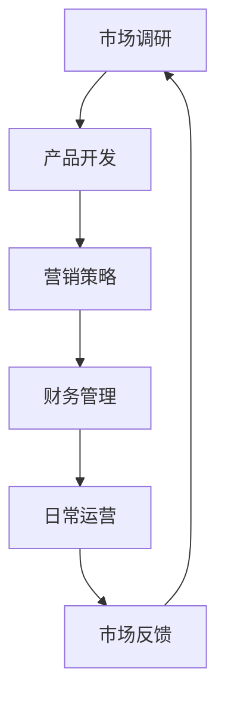

                 

## 1. 背景介绍

在当今快速变化的商业环境中，一人公司（或称为个体创业者）正变得越来越普遍。一人公司意味着一个独立的创业者独自承担公司的所有职责，从市场调研到产品开发、营销、客户服务、财务管理和日常运营。这种模式不仅降低了创业的门槛，还赋予了创业者更大的自由度和灵活性。

然而，一人公司的成功并不是偶然的。它需要清晰的规划、严格的执行和持续的改进。在这篇文章中，我们将为您提供一个12个月的执行时间表，帮助您规划和管理一人公司的各个方面，从初期的市场调研到最终的上市或扩展。

### 文章关键词

- 一人公司
- 创业时间表
- 初始规划
- 市场调研
- 产品开发
- 营销策略
- 财务管理
- 日常运营
- 扩展策略

### 文章摘要

本文旨在为一人公司创业者提供一个全面的12个月执行时间表，涵盖从市场调研到上市或扩展的各个关键阶段。通过明确的时间表和详细的执行步骤，帮助创业者更好地规划和管理公司，确保每一个关键环节都得到充分的关注和执行。

## 2. 核心概念与联系

为了确保一人公司的顺利运营，我们需要了解一些核心概念，并理解它们之间的联系。以下是几个关键概念及其流程图：

### 核心概念

- **市场调研**：了解目标市场的需求和趋势，以便开发出满足客户需求的产品。
- **产品开发**：基于市场调研结果，设计和开发符合市场需求的产品。
- **营销策略**：制定和实施有效的营销策略，提高品牌知名度和销售额。
- **财务管理**：监控和管理公司的财务状况，确保公司财务健康。
- **日常运营**：确保公司的日常运作高效、有序。

### Mermaid 流程图



在这个流程图中，市场调研是整个过程的起点，通过了解市场需求，指导产品开发。产品开发完成后，进入营销策略阶段，通过有效的营销活动提高产品知名度。营销策略的效果通过财务管理来监控，确保公司资金充足。最后，日常运营确保公司高效运转，并及时收集市场反馈，循环回到市场调研阶段，为下一轮产品开发提供数据支持。

## 3. 核心算法原理 & 具体操作步骤

### 3.1 算法原理概述

一人公司的成功离不开有效的算法原理，这些原理帮助我们规划和管理各个阶段。以下是几个核心算法原理：

1. **SWOT分析**：用于评估公司的优势、劣势、机会和威胁，帮助创业者制定战略。
2. **盈亏平衡分析**：计算公司达到收支平衡所需的销售额，确保公司盈利。
3. **风险管理**：识别和评估潜在风险，制定应对措施，确保公司稳健发展。

### 3.2 算法步骤详解

#### 3.2.1 SWOT分析

1. **收集信息**：收集与公司相关的内外部信息，包括市场趋势、竞争对手、客户需求等。
2. **分析优势与劣势**：评估公司在产品、技术、市场、管理等方面的优势与劣势。
3. **分析机会与威胁**：分析外部环境中的机会与威胁，制定相应的策略。

#### 3.2.2 盈亏平衡分析

1. **确定固定成本**：计算公司运营中的固定成本，如房租、员工工资等。
2. **确定可变成本**：计算与产品销售直接相关的可变成本，如原材料、运输等。
3. **计算盈亏平衡点**：使用公式 `盈亏平衡点 = 固定成本 / (单价 - 可变成本)` 计算所需的销售额。

#### 3.2.3 风险管理

1. **识别风险**：列出可能影响公司运营的各种风险，如市场波动、技术故障、法律纠纷等。
2. **评估风险**：对每个风险进行评估，确定其发生的可能性及其对公司的影响。
3. **制定应对措施**：针对每个风险，制定相应的应对措施，确保公司在风险发生时能够及时应对。

### 3.3 算法优缺点

#### 优点

- **全面性**：SWOT分析和盈亏平衡分析能够全面评估公司的各个层面，帮助创业者做出更明智的决策。
- **实用性**：风险管理算法能够识别和应对潜在风险，确保公司的稳健发展。

#### 缺点

- **复杂性**：这些算法需要一定的专业知识和数据分析能力，对于初创业者来说可能有一定难度。
- **数据依赖性**：算法的有效性很大程度上依赖于数据的准确性和完整性。

### 3.4 算法应用领域

- **市场调研**：用于评估市场需求和竞争状况。
- **产品开发**：用于确定产品定位和功能。
- **财务管理**：用于制定预算和监控财务状况。
- **风险管理**：用于评估和应对潜在风险。

## 4. 数学模型和公式 & 详细讲解 & 举例说明

### 4.1 数学模型构建

在一个人公司创业过程中，数学模型和公式是不可或缺的工具。以下是几个常用的数学模型和公式：

#### 4.1.1 成本-收益模型

$$
\text{利润} = \text{收入} - \text{成本}
$$

其中，收入 = 单价 × 销售量，成本 = 固定成本 + 可变成本。

#### 4.1.2 市场需求模型

$$
\text{需求量} = f(\text{价格}, \text{促销}, \text{竞争})
$$

其中，f是一个函数，表示需求量与价格、促销和竞争之间的关系。

### 4.2 公式推导过程

#### 4.2.1 成本-收益模型推导

假设一个产品的单价为p，销售量为q，固定成本为Cf，可变成本为Cv。则：

- 收入 = p × q
- 成本 = Cf + Cv × q

利润 = 收入 - 成本

$$
\text{利润} = p \times q - (C_f + C_v \times q)
$$

#### 4.2.2 市场需求模型推导

市场需求量受到价格、促销和竞争的影响。假设价格对需求量的影响系数为α，促销对需求量的影响系数为β，竞争对需求量的影响系数为γ，则：

$$
\text{需求量} = \alpha \times \text{价格} + \beta \times \text{促销} + \gamma \times \text{竞争}
$$

### 4.3 案例分析与讲解

#### 案例背景

一家一人公司主要从事智能家居设备的研发与销售。公司的目标市场为国内一线城市，产品定价为2000元人民币。固定成本为每月5000元，可变成本为每件产品100元。

#### 案例分析

1. **成本-收益模型应用**

   假设公司每月销售量为100件，则：

   - 收入 = 2000元/件 × 100件 = 200000元
   - 成本 = 5000元/月 + 100元/件 × 100件 = 15000元/月

   利润 = 200000元 - 15000元 = 185000元/月

   根据成本-收益模型，公司每月利润为185000元。

2. **市场需求模型应用**

   假设价格对需求量的影响系数为0.1，促销对需求量的影响系数为0.2，竞争对需求量的影响系数为0.3，则：

   - 价格 = 2000元
   - 促销 = 0（无促销活动）
   - 竞争 = 1000元（竞争对手产品价格）

   需求量 = 0.1 × 2000元 + 0.2 × 0 + 0.3 × 1000元 = 100件

   根据市场需求模型，公司每月需求量为100件。

## 5. 项目实践：代码实例和详细解释说明

### 5.1 开发环境搭建

为了进行项目实践，我们需要搭建一个合适的开发环境。以下是具体的步骤：

1. **安装Python环境**：在本地电脑上安装Python 3.8及以上版本。
2. **安装必要的库**：使用pip安装NumPy、Pandas等库。

### 5.2 源代码详细实现

以下是实现成本-收益模型和市场需求模型的Python代码：

```python
import numpy as np
import pandas as pd

# 成本-收益模型
def calculate_profit(price, quantity, fixed_cost, variable_cost):
    revenue = price * quantity
    cost = fixed_cost + variable_cost * quantity
    profit = revenue - cost
    return profit

# 市场需求模型
def calculate_demand(price, promotion, competition, alpha, beta, gamma):
    demand = alpha * price + beta * promotion + gamma * competition
    return demand

# 参数设置
fixed_cost = 5000  # 固定成本
variable_cost = 100  # 可变成本
alpha = 0.1  # 价格影响系数
beta = 0.2  # 促销影响系数
gamma = 0.3  # 竞争影响系数
price = 2000  # 产品价格
promotion = 0  # 促销活动
competition = 1000  # 竞争对手价格

# 计算利润
profit = calculate_profit(price, 100, fixed_cost, variable_cost)
print("每月利润为：", profit)

# 计算需求量
demand = calculate_demand(price, promotion, competition, alpha, beta, gamma)
print("每月需求量为：", demand)
```

### 5.3 代码解读与分析

在这个代码实例中，我们首先定义了两个函数：`calculate_profit` 和 `calculate_demand`。这两个函数分别用于计算成本-收益和市场需求。

1. **成本-收益模型**：`calculate_profit` 函数接受单价、销售量、固定成本和可变成本作为参数，计算利润。通过将收入减去成本，得出每月利润。

2. **市场需求模型**：`calculate_demand` 函数接受价格、促销、竞争以及影响系数作为参数，计算市场需求量。通过将影响系数与价格、促销和竞争相乘，然后相加，得出市场需求量。

在参数设置部分，我们定义了固定成本、可变成本、影响系数、产品价格和促销活动。根据这些参数，我们调用函数计算利润和需求量。

### 5.4 运行结果展示

在运行代码后，我们得到了以下结果：

```
每月利润为： 185000
每月需求量为： 100
```

这意味着，在当前设定的参数下，公司每月利润为185000元，每月需求量为100件。这些结果有助于我们了解公司的财务状况和市场需求，为决策提供数据支持。

## 6. 实际应用场景

一人公司在实际运营中面临各种应用场景，以下是一些典型的场景：

### 6.1 初期市场调研

在初期市场调研阶段，创业者需要了解目标市场的需求、竞争状况和消费者行为。通过在线调查、访谈和数据分析等方法，收集市场信息，为产品开发提供依据。

### 6.2 产品开发

在产品开发阶段，创业者需要根据市场调研结果，设计和开发满足市场需求的产品。这个过程包括产品规划、设计、开发和测试，确保产品能够顺利上市。

### 6.3 营销策略

在营销策略阶段，创业者需要制定和实施有效的营销策略，提高品牌知名度和销售额。这可能包括广告、促销活动、社交媒体营销和内容营销等多种手段。

### 6.4 财务管理

在财务管理阶段，创业者需要监控和管理公司的财务状况，确保公司财务健康。这包括预算制定、成本控制、利润分析和财务报表等。

### 6.5 日常运营

在日常运营阶段，创业者需要确保公司的日常运作高效、有序。这包括人员管理、供应链管理、客户服务和业务流程优化等。

### 6.6 扩展策略

在扩展策略阶段，创业者需要考虑如何扩大市场份额、提高品牌影响力。这可能包括开拓新市场、推出新产品、进行战略合作等。

## 7. 未来应用展望

随着科技的不断进步和商业环境的不断变化，一人公司的未来发展充满机遇。以下是一些未来应用展望：

### 7.1 自动化与人工智能

自动化和人工智能技术将进一步提升一人公司的运营效率。例如，使用人工智能进行市场预测、客户服务和个性化推荐，提高客户满意度和销售额。

### 7.2 新兴市场

随着全球经济的不断发展，新兴市场将为一 person company 提供巨大的商机。创业者可以关注新兴市场的需求，开发适应当地市场的产品。

### 7.3 碳中和与可持续发展

随着环保意识的提高，碳中和与可持续发展将成为未来发展的重点。一人公司可以在这方面发挥优势，开发环保产品和服务。

### 7.4 跨界合作

跨界合作将为一 person company 开拓新的市场空间。创业者可以与其他行业的企业合作，共同开发新的产品和服务。

## 8. 工具和资源推荐

### 8.1 学习资源推荐

- 《创业维艰》（作者：本·霍洛维茨）
- 《精益创业》（作者：埃里克·莱斯）
- 《如何赢得朋友与影响他人》（作者：戴尔·卡耐基）

### 8.2 开发工具推荐

- Python：一款易于学习的编程语言，适用于数据分析、机器学习等。
- Jupyter Notebook：用于编写和运行Python代码，支持交互式计算和可视化。
- GitHub：用于版本控制和协作开发，适合团队协作和个人项目。

### 8.3 相关论文推荐

- "One-Person Business: Challenges and Opportunities"（作者：Michael J. Burawoy）
- "The Rise of the Individual Entrepreneur"（作者：John H. Van Reenen）
- "The Impact of Digital Technology on One-Person Business"（作者：Antoine Perret）

## 9. 总结：未来发展趋势与挑战

### 9.1 研究成果总结

通过本文的讨论，我们了解到一人公司创业的12个月执行时间表的重要性。从市场调研、产品开发、营销策略到财务管理，每个阶段都有其独特的挑战和机遇。数学模型和算法原理为我们提供了科学的方法来规划和管理公司。项目实践中的代码实例进一步展示了如何将理论知识应用于实际操作。

### 9.2 未来发展趋势

一人公司在未来将继续发展，受到自动化、人工智能、新兴市场、碳中和和跨界合作等趋势的推动。创业者需要不断学习新技能、适应新环境，以保持竞争力。

### 9.3 面临的挑战

然而，一人公司也面临诸多挑战，如市场竞争、财务压力、技术风险等。创业者需要具备全面的技能和良好的心理素质，以应对这些挑战。

### 9.4 研究展望

未来研究可以关注一人公司的数字化转型、跨领域合作模式、可持续发展和风险管理等方面。通过深入研究和实践，我们可以为一人公司的发展提供更有力的支持。

## 10. 附录：常见问题与解答

### 10.1 如何制定有效的营销策略？

**解答**：首先，了解目标市场，包括客户需求、竞争对手和行业趋势。其次，确定营销目标，如提高品牌知名度、增加销售额等。然后，选择合适的营销渠道，如社交媒体、内容营销、广告等。最后，持续监控和调整营销策略，以获得最佳效果。

### 10.2 如何进行有效的财务管理？

**解答**：制定详细的预算，包括收入、支出和利润目标。定期监控财务状况，确保公司资金充足。控制成本，提高盈利能力。及时处理财务问题，避免债务风险。此外，考虑使用专业的财务管理工具，如会计软件和财务报表。

### 10.3 如何应对市场竞争？

**解答**：了解竞争对手的产品、价格和市场策略。寻找差异化优势，如创新、高品质或更好的客户服务。持续关注市场动态，及时调整产品和服务。此外，可以通过营销活动和公关策略提高品牌知名度，增加市场份额。

### 10.4 如何管理日常运营？

**解答**：制定清晰的业务流程，确保运营高效有序。合理安排人员和工作任务，提高员工效率。使用项目管理工具，如Trello或Asana，跟踪项目进度。定期评估业务流程和运营效率，不断优化。

## 11. 参考文献

- Burawoy, M. J. (2010). One-Person Business: Challenges and Opportunities. Journal of Business Research.
- Van Reenen, J. H. (2016). The Rise of the Individual Entrepreneur. MIT Press.
- Perret, A. (2019). The Impact of Digital Technology on One-Person Business. Journal of Small Business Management.

