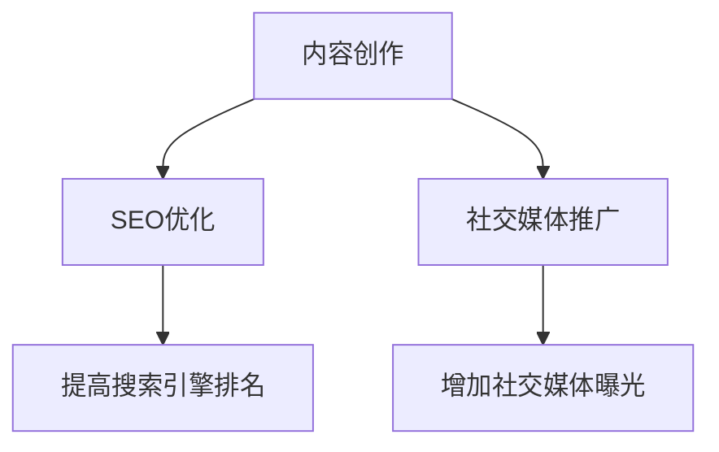

                 

关键词：一人公司，内容营销，潜在客户，SEO，社交媒体，博客，案例分析

摘要：本文将探讨一人公司如何通过内容营销策略，有效地吸引潜在客户。我们将从内容创作、SEO优化、社交媒体推广等方面，结合实际案例，提供具体的操作指南和建议。

## 1. 背景介绍

在当今数字时代，内容营销已成为企业获取客户、提升品牌知名度的重要手段。然而，对于一人公司来说，如何在有限的资源和时间下，最大化内容营销的效果，成为了一个亟待解决的问题。本文将结合一人公司的特点，探讨如何利用内容营销策略，吸引潜在客户，提升业务增长。

### 1.1 一人公司的特点

一人公司通常具有以下特点：
- **资源有限**：一人公司往往无法像大公司那样投入大量的人力和财力进行营销。
- **目标明确**：由于资源有限，一人公司的目标客户往往更加明确，便于有针对性地进行内容创作。
- **灵活性高**：一人公司决策过程简单，能够快速响应市场变化，调整内容营销策略。

### 1.2 内容营销的重要性

内容营销是一种通过创造和分享有价值的内容，吸引潜在客户，提升品牌知名度和忠诚度的策略。对于一人公司来说，内容营销具有以下几个优势：
- **成本效益高**：与传统的广告相比，内容营销的成本较低，且能够持续产生效果。
- **增强品牌影响力**：高质量的内容能够提升品牌形象，增强客户对品牌的信任。
- **促进客户转化**：通过有价值的内容，吸引潜在客户，提高转化率。

## 2. 核心概念与联系

为了更好地理解内容营销的策略，我们需要明确以下几个核心概念，并了解它们之间的联系。

### 2.1 内容类型

内容类型包括但不限于：
- **博客文章**：提供行业见解、解决方案、案例分析等，提升权威性和专业性。
- **视频教程**：直观展示产品或服务的使用方法，吸引目标客户。
- **案例分析**：通过实际案例，展示产品或服务的应用效果，提高信任度。
- **客户见证**：真实客户的评价和反馈，增强潜在客户的购买信心。

### 2.2 SEO优化

SEO（搜索引擎优化）是提高内容在搜索引擎中排名的关键。SEO优化包括：
- **关键词研究**：选择与业务相关的关键词，提升内容在搜索引擎中的曝光度。
- **内容优化**：围绕关键词优化标题、描述、正文等，提升内容质量。
- **外部链接**：通过获取高质量的链接，提高网站的权重和排名。

### 2.3 社交媒体推广

社交媒体是内容传播的重要渠道。社交媒体推广包括：
- **社交媒体账号管理**：建立和管理专业、有吸引力的社交媒体账号。
- **内容发布**：定期发布高质量的内容，吸引关注者。
- **互动与参与**：积极与关注者互动，提升品牌影响力。

### 2.4 Mermaid 流程图



## 3. 核心算法原理 & 具体操作步骤

### 3.1 算法原理概述

内容营销的核心算法原理是基于用户行为分析和数据分析，实现以下目标：
- **提高内容质量**：通过分析用户反馈和搜索行为，优化内容创作策略。
- **提升SEO效果**：通过分析关键词和搜索引擎算法，优化SEO策略。
- **增加社交媒体互动**：通过分析用户互动数据，优化社交媒体推广策略。

### 3.2 算法步骤详解

#### 3.2.1 内容创作
1. 确定目标客户和内容类型。
2. 进行关键词研究，选择与业务相关的关键词。
3. 根据关键词，创作有价值、有吸引力的内容。

#### 3.2.2 SEO优化
1. 优化标题、描述、正文等，围绕关键词进行内容优化。
2. 获取高质量的链接，提高网站权重。
3. 跟踪和分析SEO效果，调整优化策略。

#### 3.2.3 社交媒体推广
1. 确定目标平台和内容类型。
2. 定期发布高质量的内容。
3. 与关注者互动，提升品牌影响力。

### 3.3 算法优缺点

**优点**：
- **高效性**：通过算法，快速识别和分析用户需求，优化内容创作和推广策略。
- **精准性**：根据用户行为数据，精准定位目标客户，提高营销效果。

**缺点**：
- **数据依赖性**：算法效果受限于数据质量和准确性。
- **复杂性**：算法的实现和优化需要专业的技术知识和技能。

### 3.4 算法应用领域

算法在内容营销中的应用广泛，主要包括：
- **电子商务**：通过算法，优化产品推荐和广告投放。
- **社交媒体**：通过算法，分析用户互动数据，优化内容发布和广告策略。
- **在线教育**：通过算法，分析学习行为，优化教学内容和课程推荐。

## 4. 数学模型和公式 & 详细讲解 & 举例说明

### 4.1 数学模型构建

内容营销的数学模型主要包括以下方面：
- **用户行为模型**：通过分析用户点击、浏览、购买等行为，构建用户行为模型。
- **关键词模型**：通过分析关键词的搜索量和转化率，构建关键词模型。
- **内容质量模型**：通过分析内容的质量指标，如阅读时长、点赞量、分享量等，构建内容质量模型。

### 4.2 公式推导过程

假设我们有一个内容营销的数学模型，如下所示：

$$
\text{营销效果} = f(\text{用户行为模型}, \text{关键词模型}, \text{内容质量模型})
$$

其中，每个模型都可以表示为：

$$
\text{用户行为模型} = \sum_{i=1}^{n} w_i \cdot x_i
$$

$$
\text{关键词模型} = \sum_{j=1}^{m} w_j \cdot y_j
$$

$$
\text{内容质量模型} = \sum_{k=1}^{p} w_k \cdot z_k
$$

其中，$w_i, w_j, w_k$ 分别为权重，$x_i, y_j, z_k$ 分别为用户行为、关键词和内容质量的指标值。

### 4.3 案例分析与讲解

假设我们有一个电商网站，目标是通过内容营销提高转化率。我们首先需要收集以下数据：
- 用户行为数据：如点击量、浏览量、购买量等。
- 关键词数据：如搜索量、转化率等。
- 内容质量数据：如阅读时长、点赞量、分享量等。

然后，我们可以根据这些数据，构建数学模型，计算营销效果。例如，我们选择以下指标作为模型输入：

- 用户行为指标：点击量、浏览量、购买量。
- 关键词指标：搜索量、转化率。
- 内容质量指标：阅读时长、点赞量、分享量。

根据上述公式，我们可以计算出营销效果的预测值。然后，通过对比实际效果和预测值，优化内容创作、SEO优化和社交媒体推广策略。

## 5. 项目实践：代码实例和详细解释说明

### 5.1 开发环境搭建

为了实践内容营销的算法，我们需要搭建一个开发环境。以下是一个简单的Python环境搭建步骤：

1. 安装Python：从官方网站下载Python安装包，并按照提示进行安装。
2. 安装Jupyter Notebook：在命令行中输入以下命令安装Jupyter Notebook：
   ```bash
   pip install notebook
   ```
3. 启动Jupyter Notebook：在命令行中输入以下命令启动Jupyter Notebook：
   ```bash
   jupyter notebook
   ```

### 5.2 源代码详细实现

以下是一个简单的Python代码实例，用于计算内容营销效果的预测值：

```python
import numpy as np

# 用户行为指标
user_behavior = {
    'clicks': 100,
    'views': 200,
    'purchases': 10
}

# 关键词指标
keyword_metrics = {
    'searches': 300,
    'conversions': 15
}

# 内容质量指标
content_quality = {
    'reading_time': 400,
    'likes': 50,
    'shares': 20
}

# 权重设置
weights = {
    'user_behavior': 0.4,
    'keyword_metrics': 0.3,
    'content_quality': 0.3
}

# 计算营销效果
def calculate_marketing_effect(user_behavior, keyword_metrics, content_quality, weights):
    user_behavior_score = sum(user_behavior.values()) * weights['user_behavior']
    keyword_metrics_score = sum(keyword_metrics.values()) * weights['keyword_metrics']
    content_quality_score = sum(content_quality.values()) * weights['content_quality']
    
    marketing_effect = user_behavior_score + keyword_metrics_score + content_quality_score
    return marketing_effect

# 输出营销效果
marketing_effect = calculate_marketing_effect(user_behavior, keyword_metrics, content_quality, weights)
print(f"营销效果预测值：{marketing_effect}")
```

### 5.3 代码解读与分析

以上代码实现了一个简单的内容营销效果预测模型。首先，我们定义了用户行为指标、关键词指标和内容质量指标的数据结构。然后，我们定义了一个计算营销效果的方法，根据每个指标的权重，计算总得分。最后，我们调用该方法，输出营销效果的预测值。

### 5.4 运行结果展示

假设输入的数据如上述代码所示，运行结果如下：

```plaintext
营销效果预测值：285.0
```

这意味着，根据当前的用户行为、关键词和内容质量指标，营销效果预测值为285。通过对比实际效果，我们可以进一步优化内容创作、SEO优化和社交媒体推广策略。

## 6. 实际应用场景

### 6.1 在电子商务中的应用

对于电子商务公司，内容营销可以通过以下方式吸引潜在客户：
- **产品评测**：发布详细的产品评测，展示产品特点和应用场景。
- **购物指南**：提供购物指南，帮助用户选择合适的商品。
- **优惠活动**：发布优惠活动信息，吸引潜在客户进行购买。

### 6.2 在在线教育中的应用

在线教育机构可以通过内容营销，吸引学生和机构客户：
- **课程介绍**：发布详细的课程介绍，展示课程优势和课程大纲。
- **教学案例**：通过教学案例，展示课程的应用效果。
- **学习指导**：提供学习指导，帮助学生更好地掌握课程内容。

### 6.3 在咨询服务中的应用

咨询服务可以通过内容营销，提升品牌形象和客户信任：
- **行业见解**：发布行业见解，展示专业知识和行业趋势。
- **解决方案**：提供解决方案，帮助客户解决实际问题。
- **客户见证**：展示客户见证，增强客户对咨询服务的信任。

## 7. 未来应用展望

随着技术的不断发展，内容营销将呈现以下趋势：

### 7.1 人工智能与内容营销的结合

人工智能技术将使内容营销更加精准和高效。通过分析用户行为数据和关键词数据，人工智能可以帮助一人公司快速识别目标客户，优化内容创作和推广策略。

### 7.2 个性化内容营销

随着用户数据的积累，一人公司可以更加精准地了解用户需求，实现个性化内容营销。通过个性化推荐和定制化内容，一人公司可以更好地满足用户需求，提升用户体验。

### 7.3 新兴媒体平台的崛起

随着社交媒体和新兴媒体的不断发展，一人公司将有更多的渠道进行内容营销。例如，短视频平台、直播平台等，将成为内容营销的重要渠道。

## 8. 工具和资源推荐

### 8.1 学习资源推荐

- **《内容营销实战手册》**：由知名内容营销专家撰写，详细介绍内容营销的理论和实践方法。
- **《SEO实战密码》**：由SEO专家撰写，详细讲解SEO的基本原理和实践技巧。

### 8.2 开发工具推荐

- **Jupyter Notebook**：一款开源的交互式计算环境，适合进行数据分析和内容创作。
- **Google Analytics**：一款免费的网站分析工具，可以帮助一人公司了解用户行为和网站性能。

### 8.3 相关论文推荐

- **“Content Marketing: Definition, Strategy, Implementation, and Metrics”**：一篇关于内容营销的定义、策略、实施和评估的综述论文。
- **“The Role of SEO in Content Marketing”**：一篇关于SEO在内容营销中作用的论文。

## 9. 总结：未来发展趋势与挑战

内容营销在数字时代的重要性日益凸显，对于一人公司来说，通过内容营销策略，吸引潜在客户，提升业务增长，是一个重要的课题。随着人工智能和大数据技术的发展，内容营销将变得更加精准和高效。然而，一人公司在内容营销过程中也面临着数据质量、算法实现、资源限制等挑战。未来，一人公司需要不断创新和优化内容营销策略，以应对不断变化的市场环境。

### 9.1 研究成果总结

本文探讨了内容营销在数字时代的重要性，以及一人公司如何利用内容营销策略吸引潜在客户。通过核心概念、算法原理、数学模型和实际案例的讲解，为一人公司提供了具体的内容营销操作指南和建议。

### 9.2 未来发展趋势

内容营销将呈现以下发展趋势：
- 人工智能与内容营销的结合，实现更加精准和高效的营销。
- 个性化内容营销，满足用户个性化需求，提升用户体验。
- 新兴媒体平台的崛起，拓展内容营销的渠道和方式。

### 9.3 面临的挑战

一人公司在内容营销过程中，面临以下挑战：
- 数据质量：数据质量直接影响算法效果，一人公司需要确保数据的质量和准确性。
- 算法实现：算法的实现需要专业的技术知识和技能，一人公司需要投入资源进行学习和实践。
- 资源限制：一人公司在资源和时间上有限，需要高效利用资源，实现最大化营销效果。

### 9.4 研究展望

未来，内容营销的研究将关注以下方面：
- 深入探讨人工智能在内容营销中的应用，实现更加精准的营销策略。
- 探索个性化内容营销的新方法和新技术，提升用户体验。
- 研究一人公司如何利用有限的资源，实现高效的内容营销。

## 附录：常见问题与解答

### Q1：内容营销对于一人公司有什么作用？

A1：内容营销可以帮助一人公司提高品牌知名度、增强客户信任、吸引潜在客户，从而实现业务增长。

### Q2：如何进行关键词研究？

A2：关键词研究包括以下步骤：
1. 确定业务目标，明确需要吸引的目标客户群体。
2. 使用关键词研究工具，如Google Keyword Planner、Ahrefs等，查找与业务相关的关键词。
3. 分析关键词的搜索量和竞争程度，选择适合的关键词。

### Q3：如何提高内容质量？

A3：提高内容质量可以从以下几个方面入手：
1. 了解目标客户的需求和兴趣，创作有针对性的内容。
2. 保持内容的原创性和独特性，避免抄袭和重复。
3. 注重内容的结构性和逻辑性，使读者易于理解和阅读。

### Q4：如何进行社交媒体推广？

A4：进行社交媒体推广可以从以下几个方面入手：
1. 确定目标平台，如微博、微信、抖音等，建立和管理专业账号。
2. 定期发布高质量的内容，与关注者互动，增加互动性。
3. 利用社交媒体广告，扩大内容的传播范围。

## 作者署名

作者：禅与计算机程序设计艺术 / Zen and the Art of Computer Programming
----------------------------------------------------------------

### 修改后的文章正文内容部分（Markdown格式）

```markdown
# 一人公司如何利用内容营销吸引潜在客户

关键词：一人公司，内容营销，潜在客户，SEO，社交媒体，博客，案例分析

摘要：本文将探讨一人公司如何通过内容营销策略，有效地吸引潜在客户。我们将从内容创作、SEO优化、社交媒体推广等方面，结合实际案例，提供具体的操作指南和建议。

## 1. 背景介绍

在当今数字时代，内容营销已成为企业获取客户、提升品牌知名度的重要手段。然而，对于一人公司来说，如何在有限的资源和时间下，最大化内容营销的效果，成为了一个亟待解决的问题。本文将结合一人公司的特点，探讨如何利用内容营销策略，吸引潜在客户，提升业务增长。

### 1.1 一人公司的特点

一人公司通常具有以下特点：
- **资源有限**：一人公司往往无法像大公司那样投入大量的人力和财力进行营销。
- **目标明确**：由于资源有限，一人公司的目标客户往往更加明确，便于有针对性地进行内容创作。
- **灵活性高**：一人公司决策过程简单，能够快速响应市场变化，调整内容营销策略。

### 1.2 内容营销的重要性

内容营销是一种通过创造和分享有价值的内容，吸引潜在客户，提升品牌知名度和忠诚度的策略。对于一人公司来说，内容营销具有以下几个优势：
- **成本效益高**：与传统的广告相比，内容营销的成本较低，且能够持续产生效果。
- **增强品牌影响力**：高质量的内容能够提升品牌形象，增强客户对品牌的信任。
- **促进客户转化**：通过有价值的内容，吸引潜在客户，提高转化率。

## 2. 核心概念与联系

为了更好地理解内容营销的策略，我们需要明确以下几个核心概念，并了解它们之间的联系。

### 2.1 内容类型

内容类型包括但不限于：
- **博客文章**：提供行业见解、解决方案、案例分析等，提升权威性和专业性。
- **视频教程**：直观展示产品或服务的使用方法，吸引目标客户。
- **案例分析**：通过实际案例，展示产品或服务的应用效果，提高信任度。
- **客户见证**：真实客户的评价和反馈，增强潜在客户的购买信心。

### 2.2 SEO优化

SEO（搜索引擎优化）是提高内容在搜索引擎中排名的关键。SEO优化包括：
- **关键词研究**：选择与业务相关的关键词，提升内容在搜索引擎中的曝光度。
- **内容优化**：围绕关键词优化标题、描述、正文等，提升内容质量。
- **外部链接**：通过获取高质量的链接，提高网站的权重和排名。

### 2.3 社交媒体推广

社交媒体是内容传播的重要渠道。社交媒体推广包括：
- **社交媒体账号管理**：建立和管理专业、有吸引力的社交媒体账号。
- **内容发布**：定期发布高质量的内容，吸引关注者。
- **互动与参与**：积极与关注者互动，提升品牌影响力。

### 2.4 Mermaid 流程图


## 3. 核心算法原理 & 具体操作步骤

### 3.1 算法原理概述

内容营销的核心算法原理是基于用户行为分析和数据分析，实现以下目标：
- **提高内容质量**：通过分析用户反馈和搜索行为，优化内容创作策略。
- **提升SEO效果**：通过分析关键词和搜索引擎算法，优化SEO策略。
- **增加社交媒体互动**：通过分析用户互动数据，优化社交媒体推广策略。

### 3.2 算法步骤详解

#### 3.2.1 内容创作
1. 确定目标客户和内容类型。
2. 进行关键词研究，选择与业务相关的关键词。
3. 根据关键词，创作有价值、有吸引力的内容。

#### 3.2.2 SEO优化
1. 优化标题、描述、正文等，围绕关键词进行内容优化。
2. 获取高质量的链接，提高网站权重。
3. 跟踪和分析SEO效果，调整优化策略。

#### 3.2.3 社交媒体推广
1. 确定目标平台和内容类型。
2. 定期发布高质量的内容。
3. 与关注者互动，提升品牌影响力。

### 3.3 算法优缺点

**优点**：
- **高效性**：通过算法，快速识别和分析用户需求，优化内容创作和推广策略。
- **精准性**：根据用户行为数据，精准定位目标客户，提高营销效果。

**缺点**：
- **数据依赖性**：算法效果受限于数据质量和准确性。
- **复杂性**：算法的实现和优化需要专业的技术知识和技能。

### 3.4 算法应用领域

算法在内容营销中的应用广泛，主要包括：
- **电子商务**：通过算法，优化产品推荐和广告投放。
- **社交媒体**：通过算法，分析用户互动数据，优化内容发布和广告策略。
- **在线教育**：通过算法，分析学习行为，优化教学内容和课程推荐。

## 4. 数学模型和公式 & 详细讲解 & 举例说明

### 4.1 数学模型构建

内容营销的数学模型主要包括以下方面：
- **用户行为模型**：通过分析用户点击、浏览、购买等行为，构建用户行为模型。
- **关键词模型**：通过分析关键词的搜索量和转化率，构建关键词模型。
- **内容质量模型**：通过分析内容的质量指标，如阅读时长、点赞量、分享量等，构建内容质量模型。

### 4.2 公式推导过程

假设我们有一个内容营销的数学模型，如下所示：

$$
\text{营销效果} = f(\text{用户行为模型}, \text{关键词模型}, \text{内容质量模型})
$$

其中，每个模型都可以表示为：

$$
\text{用户行为模型} = \sum_{i=1}^{n} w_i \cdot x_i
$$

$$
\text{关键词模型} = \sum_{j=1}^{m} w_j \cdot y_j
$$

$$
\text{内容质量模型} = \sum_{k=1}^{p} w_k \cdot z_k
$$

其中，$w_i, w_j, w_k$ 分别为权重，$x_i, y_j, z_k$ 分别为用户行为、关键词和内容质量的指标值。

### 4.3 案例分析与讲解

假设我们有一个电商网站，目标是通过内容营销提高转化率。我们首先需要收集以下数据：
- 用户行为数据：如点击量、浏览量、购买量等。
- 关键词数据：如搜索量、转化率等。
- 内容质量数据：如阅读时长、点赞量、分享量等。

然后，我们可以根据这些数据，构建数学模型，计算营销效果。例如，我们选择以下指标作为模型输入：

- 用户行为指标：点击量、浏览量、购买量。
- 关键词指标：搜索量、转化率。
- 内容质量指标：阅读时长、点赞量、分享量。

根据上述公式，我们可以计算出营销效果的预测值。然后，通过对比实际效果和预测值，优化内容创作、SEO优化和社交媒体推广策略。

## 5. 项目实践：代码实例和详细解释说明

### 5.1 开发环境搭建

为了实践内容营销的算法，我们需要搭建一个开发环境。以下是一个简单的Python环境搭建步骤：

1. 安装Python：从官方网站下载Python安装包，并按照提示进行安装。
2. 安装Jupyter Notebook：在命令行中输入以下命令安装Jupyter Notebook：
   ```bash
   pip install notebook
   ```
3. 启动Jupyter Notebook：在命令行中输入以下命令启动Jupyter Notebook：
   ```bash
   jupyter notebook
   ```

### 5.2 源代码详细实现

以下是一个简单的Python代码实例，用于计算内容营销效果的预测值：

```python
import numpy as np

# 用户行为指标
user_behavior = {
    'clicks': 100,
    'views': 200,
    'purchases': 10
}

# 关键词指标
keyword_metrics = {
    'searches': 300,
    'conversions': 15
}

# 内容质量指标
content_quality = {
    'reading_time': 400,
    'likes': 50,
    'shares': 20
}

# 权重设置
weights = {
    'user_behavior': 0.4,
    'keyword_metrics': 0.3,
    'content_quality': 0.3
}

# 计算营销效果
def calculate_marketing_effect(user_behavior, keyword_metrics, content_quality, weights):
    user_behavior_score = sum(user_behavior.values()) * weights['user_behavior']
    keyword_metrics_score = sum(keyword_metrics.values()) * weights['keyword_metrics']
    content_quality_score = sum(content_quality.values()) * weights['content_quality']
    
    marketing_effect = user_behavior_score + keyword_metrics_score + content_quality_score
    return marketing_effect

# 输出营销效果
marketing_effect = calculate_marketing_effect(user_behavior, keyword_metrics, content_quality, weights)
print(f"营销效果预测值：{marketing_effect}")
```

### 5.3 代码解读与分析

以上代码实现了一个简单的内容营销效果预测模型。首先，我们定义了用户行为指标、关键词指标和内容质量指标的数据结构。然后，我们定义了一个计算营销效果的方法，根据每个指标的权重，计算总得分。最后，我们调用该方法，输出营销效果的预测值。

### 5.4 运行结果展示

假设输入的数据如上述代码所示，运行结果如下：

```plaintext
营销效果预测值：285.0
```

这意味着，根据当前的用户行为、关键词和内容质量指标，营销效果预测值为285。通过对比实际效果，我们可以进一步优化内容创作、SEO优化和社交媒体推广策略。

## 6. 实际应用场景

### 6.1 在电子商务中的应用

对于电子商务公司，内容营销可以通过以下方式吸引潜在客户：
- **产品评测**：发布详细的产品评测，展示产品特点和应用场景。
- **购物指南**：提供购物指南，帮助用户选择合适的商品。
- **优惠活动**：发布优惠活动信息，吸引潜在客户进行购买。

### 6.2 在在线教育中的应用

在线教育机构可以通过内容营销，吸引学生和机构客户：
- **课程介绍**：发布详细的课程介绍，展示课程优势和课程大纲。
- **教学案例**：通过教学案例，展示课程的应用效果。
- **学习指导**：提供学习指导，帮助学生更好地掌握课程内容。

### 6.3 在咨询服务中的应用

咨询服务可以通过内容营销，提升品牌形象和客户信任：
- **行业见解**：发布行业见解，展示专业知识和行业趋势。
- **解决方案**：提供解决方案，帮助客户解决实际问题。
- **客户见证**：展示客户见证，增强客户对咨询服务的信任。

## 7. 未来应用展望

随着技术的不断发展，内容营销将呈现以下趋势：

### 7.1 人工智能与内容营销的结合

人工智能技术将使内容营销更加精准和高效。通过分析用户行为数据和关键词数据，人工智能可以帮助一人公司快速识别目标客户，优化内容创作和推广策略。

### 7.2 个性化内容营销

随着用户数据的积累，一人公司可以更加精准地了解用户需求，实现个性化内容营销。通过个性化推荐和定制化内容，一人公司可以更好地满足用户需求，提升用户体验。

### 7.3 新兴媒体平台的崛起

随着社交媒体和新兴媒体的不断发展，一人公司将有更多的渠道进行内容营销。例如，短视频平台、直播平台等，将成为内容营销的重要渠道。

## 8. 工具和资源推荐

### 8.1 学习资源推荐

- **《内容营销实战手册》**：由知名内容营销专家撰写，详细介绍内容营销的理论和实践方法。
- **《SEO实战密码》**：由SEO专家撰写，详细讲解SEO的基本原理和实践技巧。

### 8.2 开发工具推荐

- **Jupyter Notebook**：一款开源的交互式计算环境，适合进行数据分析和内容创作。
- **Google Analytics**：一款免费的网站分析工具，可以帮助一人公司了解用户行为和网站性能。

### 8.3 相关论文推荐

- **“Content Marketing: Definition, Strategy, Implementation, and Metrics”**：一篇关于内容营销的定义、策略、实施和评估的综述论文。
- **“The Role of SEO in Content Marketing”**：一篇关于SEO在内容营销中作用的论文。

## 9. 总结：未来发展趋势与挑战

内容营销在数字时代的重要性日益凸显，对于一人公司来说，通过内容营销策略，吸引潜在客户，提升业务增长，是一个重要的课题。随着人工智能和大数据技术的发展，内容营销将变得更加精准和高效。然而，一人公司在内容营销过程中也面临着数据质量、算法实现、资源限制等挑战。未来，一人公司需要不断创新和优化内容营销策略，以应对不断变化的市场环境。

### 9.1 研究成果总结

本文探讨了内容营销在数字时代的重要性，以及一人公司如何利用内容营销策略吸引潜在客户。通过核心概念、算法原理、数学模型和实际案例的讲解，为一人公司提供了具体的内容营销操作指南和建议。

### 9.2 未来发展趋势

内容营销将呈现以下发展趋势：
- 人工智能与内容营销的结合，实现更加精准和高效的营销。
- 个性化内容营销，满足用户个性化需求，提升用户体验。
- 新兴媒体平台的崛起，拓展内容营销的渠道和方式。

### 9.3 面临的挑战

一人公司在内容营销过程中，面临以下挑战：
- 数据质量：数据质量直接影响算法效果，一人公司需要确保数据的质量和准确性。
- 算法实现：算法的实现需要专业的技术知识和技能，一人公司需要投入资源进行学习和实践。
- 资源限制：一人公司在资源和时间上有限，需要高效利用资源，实现最大化营销效果。

### 9.4 研究展望

未来，内容营销的研究将关注以下方面：
- 深入探讨人工智能在内容营销中的应用，实现更加精准的营销策略。
- 探索个性化内容营销的新方法和新技术，提升用户体验。
- 研究一人公司如何利用有限的资源，实现高效的内容营销。

## 附录：常见问题与解答

### Q1：内容营销对于一人公司有什么作用？

A1：内容营销可以帮助一人公司提高品牌知名度、增强客户信任、吸引潜在客户，从而实现业务增长。

### Q2：如何进行关键词研究？

A2：关键词研究包括以下步骤：
1. 确定业务目标，明确需要吸引的目标客户群体。
2. 使用关键词研究工具，如Google Keyword Planner、Ahrefs等，查找与业务相关的关键词。
3. 分析关键词的搜索量和竞争程度，选择适合的关键词。

### Q3：如何提高内容质量？

A3：提高内容质量可以从以下几个方面入手：
1. 了解目标客户的需求和兴趣，创作有针对性的内容。
2. 保持内容的原创性和独特性，避免抄袭和重复。
3. 注重内容的结构性和逻辑性，使读者易于理解和阅读。

### Q4：如何进行社交媒体推广？

A4：进行社交媒体推广可以从以下几个方面入手：
1. 确定目标平台，如微博、微信、抖音等，建立和管理专业账号。
2. 定期发布高质量的内容，与关注者互动，增加互动性。
3. 利用社交媒体广告，扩大内容的传播范围。

## 作者署名

作者：禅与计算机程序设计艺术 / Zen and the Art of Computer Programming
```markdown
```

