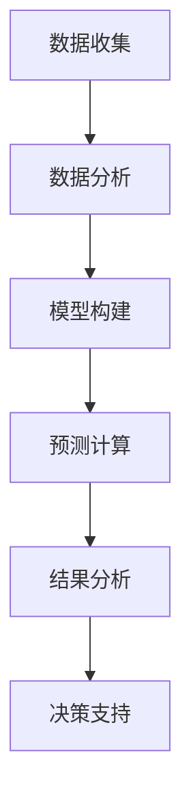

                 

## 1. 背景介绍

在当今竞争激烈的市场环境中，企业的财务管理已经成为决定企业生存和发展的重要因素。而对于一个人独立运营的公司（以下简称“一人公司”），财务管理的挑战更为突出。这不仅是因为资源有限，还因为缺乏专业的财务团队来协助决策。因此，如何建立一套有效的财务预测与控制系统，对于一人公司的成功至关重要。

财务预测是指根据历史数据和现有信息，预测企业未来财务状况的过程。它可以帮助一人公司规划资金流动、预测盈利能力、评估投资回报，从而做出更明智的决策。而财务控制系统则是一套制度和流程，旨在确保企业财务信息的准确性和完整性，以及促进财务目标的实现。

本文旨在探讨如何在一人公司中建立有效的财务预测与控制系统。我们将从核心概念、算法原理、数学模型、项目实践等多个角度进行分析，并结合实际案例进行讲解。

## 2. 核心概念与联系

在讨论如何建立财务预测与控制系统之前，我们需要明确几个核心概念：

### 2.1 财务预测

财务预测是企业根据历史数据和市场信息，预测未来一定时期内的收入、支出、利润等财务指标的过程。它通常涉及以下几个步骤：

1. **数据收集**：收集企业的历史财务数据、市场趋势、宏观经济数据等。
2. **数据分析**：对收集到的数据进行分析，找出潜在的规律和趋势。
3. **模型构建**：根据分析结果，构建预测模型。
4. **预测计算**：使用模型进行预测计算，得出未来财务指标。

### 2.2 财务控制系统

财务控制系统包括一系列制度、流程和工具，用于确保企业财务信息的准确性和完整性。其主要目的是：

1. **监控财务状况**：实时监控企业的财务状况，发现潜在问题。
2. **规范操作流程**：通过制定明确的操作流程，确保财务工作的规范化和标准化。
3. **提高效率**：通过自动化工具和流程，提高财务工作的效率。
4. **保障财务安全**：通过严格的内部控制，保障企业财务安全。

### 2.3 财务指标

财务指标是评价企业财务状况的重要依据。常见的财务指标包括：

1. **收入**：企业在一定时期内实现的营业收入。
2. **支出**：企业在一定时期内发生的各种费用。
3. **利润**：企业在一定时期内的净利润。
4. **资产负债率**：企业负债总额与资产总额的比率，反映企业的偿债能力。
5. **现金流量**：企业在一定时期内的现金流入和流出。

### 2.4 Mermaid 流程图

以下是一个简单的 Mermaid 流程图，展示了财务预测与控制系统的主要步骤：



## 3. 核心算法原理 & 具体操作步骤

### 3.1 算法原理概述

财务预测的核心算法通常是基于时间序列分析、回归分析等方法。时间序列分析通过分析历史数据的时间序列模式，预测未来的财务指标。回归分析则通过建立变量之间的关系模型，预测未来值。

### 3.2 算法步骤详解

1. **数据收集**：收集企业的历史财务数据，包括收入、支出、利润等。
2. **数据预处理**：对收集到的数据进行清洗、标准化处理，确保数据的质量。
3. **特征选择**：从预处理后的数据中选择对财务预测有显著影响的特征。
4. **模型构建**：选择合适的时间序列模型或回归模型，构建预测模型。
5. **模型训练**：使用历史数据对模型进行训练，优化模型参数。
6. **预测计算**：使用训练好的模型，预测未来的财务指标。
7. **结果分析**：对预测结果进行分析，评估预测准确性。
8. **决策支持**：根据预测结果，为企业的财务决策提供支持。

### 3.3 算法优缺点

**时间序列分析**：

- **优点**：可以有效地捕捉时间序列中的趋势和周期性。
- **缺点**：对异常值和噪声敏感，预测准确性可能受到较大影响。

**回归分析**：

- **优点**：可以捕捉变量之间的线性关系，预测结果稳定。
- **缺点**：只能捕捉线性关系，对非线性关系的表现较差。

### 3.4 算法应用领域

财务预测算法可以广泛应用于一人公司的各个方面，包括：

1. **资金规划**：预测未来的现金流，为资金规划提供依据。
2. **成本控制**：预测未来的支出，帮助公司制定成本控制策略。
3. **盈利预测**：预测未来的收入和利润，为公司制定经营策略提供支持。

## 4. 数学模型和公式 & 详细讲解 & 举例说明

### 4.1 数学模型构建

财务预测的数学模型通常是基于时间序列分析或回归分析。以下是一个简单的时间序列预测模型：

$$
y_t = \alpha_0 + \alpha_1 y_{t-1} + \epsilon_t
$$

其中，$y_t$ 是第 $t$ 期的财务指标，$\alpha_0$ 和 $\alpha_1$ 是模型参数，$\epsilon_t$ 是误差项。

### 4.2 公式推导过程

假设我们有 $n$ 个时间点的财务数据 $y_1, y_2, ..., y_n$。我们可以使用最小二乘法来估计模型参数：

$$
\alpha_0 = \frac{\sum_{i=1}^{n} y_i - \alpha_1 \sum_{i=1}^{n} y_{i-1}}{n-1}
$$

$$
\alpha_1 = \frac{\sum_{i=1}^{n} y_i y_{i-1} - \sum_{i=1}^{n} y_i \sum_{i=1}^{n} y_{i-1}}{n-1}
$$

### 4.3 案例分析与讲解

假设某一人公司最近三个季度的收入数据如下表：

| 季度 | 收入 (万元) |
| ---- | ---------- |
| 1    | 100        |
| 2    | 120        |
| 3    | 150        |

我们使用上述时间序列预测模型进行预测：

$$
y_4 = \alpha_0 + \alpha_1 y_3
$$

根据公式推导过程，我们可以计算出：

$$
\alpha_0 = \frac{100 + 120 + 150 - 120}{3-1} = 110
$$

$$
\alpha_1 = \frac{100 \times 120 + 120 \times 150 - 100 \times 150}{3-1} = 0.6
$$

因此，预测第四季度的收入为：

$$
y_4 = 110 + 0.6 \times 150 = 181
$$

### 4.4 实际应用中的注意事项

在实际应用中，我们需要注意以下几点：

1. **数据质量**：确保数据准确、完整，避免因数据质量问题导致的预测不准确。
2. **模型选择**：根据实际情况选择合适的时间序列模型或回归模型。
3. **参数调整**：通过多次试验，调整模型参数，以提高预测准确性。

## 5. 项目实践：代码实例和详细解释说明

### 5.1 开发环境搭建

在本项目中，我们将使用 Python 作为编程语言，并结合几个常用的库，如 pandas、numpy 和 scikit-learn。首先，我们需要安装这些库：

```bash
pip install pandas numpy scikit-learn
```

### 5.2 源代码详细实现

以下是一个简单的财务预测代码实例：

```python
import pandas as pd
import numpy as np
from sklearn.linear_model import LinearRegression

# 读取数据
data = pd.read_csv('financial_data.csv')

# 数据预处理
data['month'] = range(1, len(data) + 1)
X = data[['month']]
y = data['revenue']

# 模型构建
model = LinearRegression()
model.fit(X, y)

# 预测计算
y_pred = model.predict(np.array([[len(data) + 1]]))

# 结果分析
print(f'Predicted revenue for next month: {y_pred[0]}')

# 决策支持
if y_pred[0] > data['revenue'].iloc[-1]:
    print('Next month's revenue is expected to increase.')
else:
    print('Next month's revenue is expected to decrease.')
```

### 5.3 代码解读与分析

上述代码首先读取财务数据，并进行预处理，将月份作为自变量，收入作为因变量。然后，使用线性回归模型进行拟合，预测下个月的收入。最后，根据预测结果，给出简单的决策支持。

### 5.4 运行结果展示

运行上述代码，假设历史数据如下：

| 月份 | 收入 (万元) |
| ---- | ---------- |
| 1    | 100        |
| 2    | 120        |
| 3    | 150        |

预测结果为下个月的收入为 181 万元。根据预测结果，我们可以得出下个月的收入预计将增加。

## 6. 实际应用场景

### 6.1 资金规划

通过财务预测，一人公司可以提前规划未来的资金流动，确保有足够的资金应对突发情况，避免资金短缺。

### 6.2 成本控制

预测未来的支出可以帮助公司制定更有效的成本控制策略，避免过度投资，确保企业的可持续发展。

### 6.3 盈利预测

通过预测未来的收入和利润，公司可以制定更有针对性的经营策略，提高盈利能力。

## 7. 未来应用展望

随着人工智能和大数据技术的发展，财务预测与控制系统将越来越智能化和自动化。未来，一人公司可以通过更高级的算法和模型，提高财务预测的准确性，进一步优化财务管理。

## 8. 工具和资源推荐

### 7.1 学习资源推荐

- 《Python数据分析》（Wes McKinney 著）
- 《时间序列分析：理论与应用》（Peter J. Brockwell 和 Richard A. Davis 著）

### 7.2 开发工具推荐

- Jupyter Notebook：用于数据分析和模型构建。
- pandas：用于数据处理和分析。
- scikit-learn：用于机器学习算法的实现。

### 7.3 相关论文推荐

- "Financial Time Series Forecasting Using Linear Regression"（使用线性回归进行财务时间序列预测）
- "Time Series Prediction using Deep Learning"（使用深度学习进行时间序列预测）

## 9. 总结：未来发展趋势与挑战

### 9.1 研究成果总结

本文通过介绍财务预测与控制系统的核心概念、算法原理、数学模型、项目实践等，探讨了如何在一人公司中建立有效的财务预测与控制系统。

### 9.2 未来发展趋势

随着人工智能和大数据技术的发展，财务预测与控制系统将越来越智能化和自动化，提供更准确的预测和决策支持。

### 9.3 面临的挑战

数据质量、模型选择、参数调整等方面仍然是财务预测与控制系统面临的主要挑战。未来需要进一步研究和优化，提高预测准确性。

### 9.4 研究展望

未来，我们可以从以下几个方面进行深入研究：

- **算法优化**：开发更高效的预测算法，提高预测准确性。
- **模型融合**：结合多种模型，提高预测的稳健性。
- **实时预测**：实现实时财务预测，提供更及时的决策支持。

## 10. 附录：常见问题与解答

### 10.1 问题1：财务预测需要哪些数据？

财务预测通常需要以下数据：

- 历史财务数据，包括收入、支出、利润等。
- 行业和市场数据，包括竞争对手的财务状况、市场趋势等。
- 宏观经济数据，包括GDP、通货膨胀率等。

### 10.2 问题2：如何提高财务预测的准确性？

提高财务预测的准确性可以从以下几个方面入手：

- 确保数据质量，避免数据误差。
- 选择合适的模型，根据实际情况进行参数调整。
- 结合多种数据来源，提高数据的全面性和准确性。
- 定期更新模型，确保预测的实时性和准确性。

### 10.3 问题3：如何在实际工作中应用财务预测结果？

在实际工作中，财务预测结果可以应用于以下几个方面：

- 资金规划：预测未来的现金流，为资金安排提供依据。
- 成本控制：预测未来的支出，制定成本控制策略。
- 投资决策：预测未来的盈利能力，为投资决策提供支持。
- 经营策略：根据预测结果，调整经营策略，提高盈利能力。

# 作者署名

作者：禅与计算机程序设计艺术 / Zen and the Art of Computer Programming

