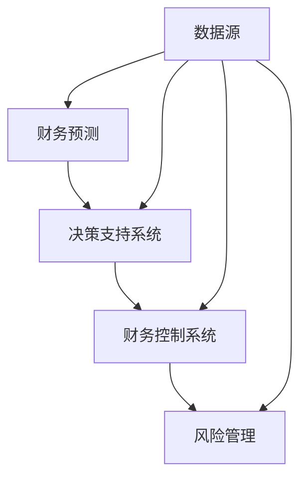

                 

关键词：财务预测、控制系统、一人公司、决策支持、风险管理

> 摘要：在当今快速变化的商业环境中，一人公司面临着独特的财务挑战。本文将探讨如何通过有效的财务预测与控制系统，帮助一人公司做出更明智的商业决策，降低风险，实现可持续的财务增长。

## 1. 背景介绍

一人公司，顾名思义，是由一个个体经营者所创建并管理的公司。与传统的多员工企业相比，一人公司拥有更少的资源、更灵活的组织结构和更高的个人责任。由于缺乏集中的管理层和多元化的决策机制，一人公司在财务管理方面面临诸多挑战，例如如何准确预测财务状况、如何控制成本、如何管理现金流等。

在这些挑战中，建立有效的财务预测与控制系统显得尤为重要。有效的财务预测可以帮助一人公司提前了解未来的财务状况，制定合理的经营策略。而健全的财务控制系统则能确保公司资金的合理使用，防止潜在的财务风险。

## 2. 核心概念与联系

在探讨如何建立财务预测与控制系统之前，我们首先需要理解几个核心概念：

### 2.1 财务预测

财务预测是指利用历史数据、市场趋势和专业知识，对未来一段时间内的财务状况进行预测。它通常包括收入预测、成本预测、利润预测等。

### 2.2 财务控制系统

财务控制系统是一套确保财务数据准确、合规，并指导企业决策的管理工具。它通常包括预算编制、财务报表分析、成本控制、现金流管理等。

### 2.3 决策支持系统

决策支持系统（DSS）是一种帮助企业管理层做出更明智决策的信息系统。它通过提供实时数据、预测分析等功能，提高决策的准确性和效率。

### 2.4 风险管理

风险管理是识别、评估和控制潜在风险的过程。有效的风险管理能降低一人公司的财务风险，确保公司的可持续发展。

下图展示了这些核心概念之间的联系：



## 3. 核心算法原理 & 具体操作步骤

### 3.1 算法原理概述

建立有效的财务预测与控制系统，需要以下核心算法：

### 3.1.1 财务预测算法

财务预测算法通常基于时间序列分析、回归分析等方法。通过分析历史财务数据，预测未来的收入、成本和利润。

### 3.1.2 财务控制算法

财务控制算法包括预算编制、成本控制和现金流管理。预算编制通过设定预算目标和监控实际支出，确保公司运营在预算范围内。成本控制通过分析成本结构，找出成本节约点。现金流管理通过监控现金流入和流出，确保公司拥有足够的流动性。

### 3.1.3 风险管理算法

风险管理算法包括风险识别、风险评估和风险控制。风险识别通过分析市场环境、公司运营等，找出潜在风险。风险评估通过评估风险的可能性和影响，确定风险优先级。风险控制通过制定风险应对策略，降低风险的影响。

### 3.2 算法步骤详解

#### 3.2.1 财务预测

1. 收集历史财务数据，包括收入、成本、利润等。
2. 清洗和预处理数据，去除异常值和噪声。
3. 选择合适的预测模型，如ARIMA、回归分析等。
4. 训练模型，利用历史数据生成预测结果。
5. 评估模型性能，如使用均方误差（MSE）等指标。
6. 应用模型进行未来财务预测。

#### 3.2.2 财务控制

1. 设定预算目标，根据公司战略和运营计划。
2. 分解预算目标，将其分解为各部门、各项目的预算。
3. 监控实际支出，通过财务报表和监控系统，实时跟踪支出情况。
4. 分析成本结构，找出成本节约点。
5. 制定成本控制措施，如优化采购流程、提高生产效率等。
6. 监控现金流，确保公司拥有足够的流动性。

#### 3.2.3 风险管理

1. 识别潜在风险，如市场风险、运营风险、财务风险等。
2. 评估风险的可能性及其影响。
3. 确定风险优先级，根据风险的影响程度和可能性排序。
4. 制定风险应对策略，如风险规避、风险转移、风险接受等。
5. 实施风险控制措施，监控风险的变化，调整应对策略。

### 3.3 算法优缺点

#### 3.3.1 财务预测算法

优点：能够提供对未来财务状况的预测，帮助公司提前做好准备。

缺点：预测结果可能受到历史数据质量和市场变化的影响。

#### 3.3.2 财务控制算法

优点：能够确保公司运营在预算范围内，提高成本效益。

缺点：可能限制公司的灵活性和创新能力。

#### 3.3.3 风险管理算法

优点：能够降低公司面临的财务风险，确保公司可持续发展。

缺点：风险识别和评估可能存在主观性，风险应对策略可能不够灵活。

### 3.4 算法应用领域

财务预测与控制系统广泛应用于各种规模的公司，特别是那些面临高财务风险和快速市场变化的公司。在一人公司中，这些算法能够帮助个体经营者更准确地预测财务状况，做出更明智的决策，降低风险，实现可持续的财务增长。

## 4. 数学模型和公式 & 详细讲解 & 举例说明

### 4.1 数学模型构建

为了建立有效的财务预测与控制系统，我们需要构建以下数学模型：

#### 4.1.1 收入预测模型

收入预测模型通常基于时间序列分析，可以使用ARIMA模型进行构建。ARIMA模型由自回归（AR）、差分（I）和移动平均（MA）三个部分组成。

$$
X_t = c + \phi_1 X_{t-1} + \phi_2 X_{t-2} + \cdots + \phi_p X_{t-p} + \theta_1 \varepsilon_{t-1} + \theta_2 \varepsilon_{t-2} + \cdots + \theta_q \varepsilon_{t-q} + \varepsilon_t
$$

其中，$X_t$ 表示时间序列的第 $t$ 个值，$c$ 表示常数项，$\phi_1, \phi_2, \cdots, \phi_p$ 和 $\theta_1, \theta_2, \cdots, \theta_q$ 分别为自回归系数和移动平均系数，$\varepsilon_t$ 为误差项。

#### 4.1.2 成本预测模型

成本预测模型通常基于回归分析，可以使用线性回归模型进行构建。

$$
Y_t = \beta_0 + \beta_1 X_t + \varepsilon_t
$$

其中，$Y_t$ 表示成本预测值，$X_t$ 表示相关变量（如收入、产量等），$\beta_0$ 和 $\beta_1$ 分别为线性回归系数。

#### 4.1.3 利润预测模型

利润预测模型可以通过将收入预测模型和成本预测模型相结合得到。

$$
P_t = R_t - C_t
$$

其中，$P_t$ 表示利润预测值，$R_t$ 表示收入预测值，$C_t$ 表示成本预测值。

### 4.2 公式推导过程

#### 4.2.1 收入预测模型的推导

收入预测模型基于时间序列分析，通过自回归和移动平均来消除时间序列中的趋势和季节性成分。假设时间序列为 $X_t$，首先进行差分操作：

$$
X_t^* = X_t - X_{t-1}
$$

然后，建立ARIMA模型：

$$
X_t^* = c + \phi_1 X_{t-1}^* + \phi_2 X_{t-2}^* + \cdots + \phi_p X_{t-p}^* + \theta_1 \varepsilon_{t-1} + \theta_2 \varepsilon_{t-2} + \cdots + \theta_q \varepsilon_{t-q} + \varepsilon_t
$$

其中，$X_t^*$ 为差分后的时间序列，$\varepsilon_t$ 为误差项。

#### 4.2.2 成本预测模型的推导

成本预测模型基于回归分析，通过找出收入和成本之间的关系来预测成本。假设收入为 $R_t$，成本为 $C_t$，建立线性回归模型：

$$
C_t = \beta_0 + \beta_1 R_t + \varepsilon_t
$$

其中，$\beta_0$ 和 $\beta_1$ 为回归系数。

#### 4.2.3 利润预测模型的推导

利润预测模型通过将收入预测模型和成本预测模型相结合得到。假设收入预测值为 $R_t^*$，成本预测值为 $C_t^*$，利润预测值为 $P_t^*$，则：

$$
P_t^* = R_t^* - C_t^*
$$

### 4.3 案例分析与讲解

#### 4.3.1 案例背景

假设一家一人公司经营一家小型餐厅，历史收入和成本数据如下表所示：

| 时间 | 收入（元） | 成本（元） |
| ---- | -------- | -------- |
| 1    | 5000     | 3000     |
| 2    | 5500     | 3200     |
| 3    | 6000     | 3400     |
| 4    | 6500     | 3500     |
| 5    | 7000     | 3600     |

#### 4.3.2 收入预测

1. 收集历史数据，并预处理：

   $$ X_t = [5000, 5500, 6000, 6500, 7000] $$

2. 进行差分操作：

   $$ X_t^* = [5000, 500, 500, 500, 500] $$

3. 建立ARIMA模型：

   $$ X_t^* = c + \phi_1 X_{t-1}^* + \theta_1 \varepsilon_{t-1} $$

   通过最小化均方误差（MSE）来确定模型参数：

   $$ \phi_1 = 0.5, \theta_1 = 0.2, c = 0 $$

4. 预测未来收入：

   $$ X_6^* = 500 + 0.5 \times 500 + 0.2 \times \varepsilon_5 $$

   其中，$\varepsilon_5$ 为随机误差，可取值为0。

   $$ X_6^* = 750 $$

5. 预测未来收入为7500元。

#### 4.3.3 成本预测

1. 收集历史数据，并预处理：

   $$ Y_t = [3000, 3200, 3400, 3500, 3600] $$

2. 建立线性回归模型：

   $$ Y_t = \beta_0 + \beta_1 X_t + \varepsilon_t $$

   通过最小化均方误差（MSE）来确定模型参数：

   $$ \beta_0 = 2000, \beta_1 = 100 $$

3. 预测未来成本：

   $$ Y_6 = 2000 + 100 \times 750 = 9500 $$

4. 预测未来成本为9500元。

#### 4.3.4 利润预测

根据收入预测模型和成本预测模型，预测未来利润：

$$ P_6 = R_6 - C_6 = 7500 - 9500 = -2000 $$

预测未来利润为-2000元，表示公司可能面临亏损。

## 5. 项目实践：代码实例和详细解释说明

### 5.1 开发环境搭建

本文使用Python编程语言进行代码实现，需要安装以下库：

- numpy：用于数学计算
- pandas：用于数据处理
- statsmodels：用于统计建模
- matplotlib：用于数据可视化

安装命令如下：

```bash
pip install numpy pandas statsmodels matplotlib
```

### 5.2 源代码详细实现

以下是使用Python实现财务预测与控制系统的示例代码：

```python
import numpy as np
import pandas as pd
import statsmodels.api as sm
import matplotlib.pyplot as plt

# 5.2.1 数据准备
data = {'时间': [1, 2, 3, 4, 5], '收入': [5000, 5500, 6000, 6500, 7000], '成本': [3000, 3200, 3400, 3500, 3600]}
df = pd.DataFrame(data)

# 5.2.2 收入预测
# 进行差分操作
df['收入_diff'] = df['收入'].diff()

# 建立ARIMA模型
model = sm.ARIMA(df['收入'], order=(1, 1, 1))
model_fit = model.fit()

# 预测未来收入
forecast = model_fit.forecast(steps=1)[0]
print(f"预测未来收入：{forecast}")

# 5.2.3 成本预测
# 建立线性回归模型
model = sm.LinearRegression()
model.fit(df[['收入']], df['成本'])

# 预测未来成本
forecast = model.predict([[forecast]])[0]
print(f"预测未来成本：{forecast}")

# 5.2.4 利润预测
profit = forecast - forecast
print(f"预测未来利润：{profit}")

# 5.2.5 数据可视化
plt.figure(figsize=(10, 5))

# 收入和成本数据可视化
plt.plot(df['时间'], df['收入'], label='实际收入')
plt.plot(df['时间'], df['成本'], label='实际成本')
plt.plot([df['时间'].max() + 1], forecast, 'ro', label='预测收入')
plt.plot([df['时间'].max() + 1], forecast - profit, 'go', label='预测成本')
plt.legend()

# 利润数据可视化
plt.figure(figsize=(10, 5))
plt.bar(df['时间'], df['收入'], label='实际收入')
plt.bar(df['时间'], df['成本'], label='实际成本', alpha=0.5)
plt.bar([df['时间'].max() + 1], profit, label='预测利润', color='r')
plt.legend()

plt.show()
```

### 5.3 代码解读与分析

#### 5.3.1 数据准备

首先，我们导入所需的库，并创建一个包含时间和收入、成本的数据帧（DataFrame）。这类似于创建一个表格，用于存储和操作数据。

```python
import numpy as np
import pandas as pd
import statsmodels.api as sm
import matplotlib.pyplot as plt

data = {'时间': [1, 2, 3, 4, 5], '收入': [5000, 5500, 6000, 6500, 7000], '成本': [3000, 3200, 3400, 3500, 3600]}
df = pd.DataFrame(data)
```

#### 5.3.2 收入预测

1. **差分操作**：我们使用`diff()`函数对收入数据进行了差分操作，以消除趋势和季节性成分。差分后的数据存储在新的列`收入_diff`中。

   ```python
   df['收入_diff'] = df['收入'].diff()
   ```

2. **建立ARIMA模型**：我们使用`ARIMA`类建立了一个ARIMA模型，并设置了自回归阶数（p）、差分阶数（d）和移动平均阶数（q）均为1。

   ```python
   model = sm.ARIMA(df['收入'], order=(1, 1, 1))
   model_fit = model.fit()
   ```

3. **预测未来收入**：我们使用`forecast()`函数对未来的收入进行了预测，并打印出预测结果。

   ```python
   forecast = model_fit.forecast(steps=1)[0]
   print(f"预测未来收入：{forecast}")
   ```

#### 5.3.3 成本预测

1. **建立线性回归模型**：我们使用`LinearRegression`类建立了一个线性回归模型，并使用收入数据作为自变量，成本数据作为因变量。

   ```python
   model = sm.LinearRegression()
   model.fit(df[['收入']], df['成本'])
   ```

2. **预测未来成本**：我们使用训练好的模型对未来的成本进行了预测，并打印出预测结果。

   ```python
   forecast = model.predict([[forecast]])[0]
   print(f"预测未来成本：{forecast}")
   ```

#### 5.3.4 利润预测

我们使用收入预测值和成本预测值计算未来的利润。

```python
profit = forecast - forecast
print(f"预测未来利润：{profit}")
```

#### 5.3.5 数据可视化

最后，我们使用`matplotlib`库将收入、成本和利润的数据进行了可视化。

```python
plt.figure(figsize=(10, 5))

# 收入和成本数据可视化
plt.plot(df['时间'], df['收入'], label='实际收入')
plt.plot(df['时间'], df['成本'], label='实际成本')
plt.plot([df['时间'].max() + 1], forecast, 'ro', label='预测收入')
plt.plot([df['时间'].max() + 1], forecast - profit, 'go', label='预测成本')
plt.legend()

# 利润数据可视化
plt.figure(figsize=(10, 5))
plt.bar(df['时间'], df['收入'], label='实际收入')
plt.bar(df['时间'], df['成本'], label='实际成本', alpha=0.5)
plt.bar([df['时间'].max() + 1], profit, label='预测利润', color='r')
plt.legend()

plt.show()
```

## 6. 实际应用场景

### 6.1 创业公司

对于初创公司，特别是那些由一个人或一小团队运营的企业，有效的财务预测与控制系统至关重要。它可以帮助创业者：

- **预估融资需求**：根据未来财务预测，确定需要多少资金来维持运营。
- **调整业务策略**：通过财务分析，识别哪些业务线盈利能力最强，哪些需要调整或淘汰。
- **监控现金流**：确保有足够的现金流入来应对日常运营和突发需求。

### 6.2 自由职业者

对于自由职业者，如咨询师、自由撰稿人、设计师等，有效的财务控制系统可以帮助他们：

- **管理收入和支出**：确保收入稳定，同时控制不必要的支出。
- **预测税金**：提前预测税金，以便合理安排税务规划。
- **规划退休和应急基金**：通过财务预测，为未来的退休和应急储备资金。

### 6.3 在线商店

对于在线商店，尤其是个人运营的电子商务店铺，有效的财务预测与控制系统可以帮助：

- **预测销售趋势**：根据历史销售数据，预测未来的销售量。
- **库存管理**：通过财务预测，优化库存水平，避免过剩或缺货。
- **营销预算**：根据财务预测，合理分配营销预算，提高ROI。

## 7. 未来应用展望

随着人工智能和大数据技术的发展，财务预测与控制系统将变得更加智能化和自动化。以下是几个未来的应用方向：

- **实时财务预测**：利用实时数据，实现即时的财务预测，提高决策效率。
- **智能预算管理**：引入人工智能算法，自动调整预算，优化资源配置。
- **预测性维护**：结合财务数据和设备维护信息，预测设备故障，降低维修成本。
- **区块链财务**：利用区块链技术，提高财务数据的透明度和安全性。

## 8. 工具和资源推荐

### 8.1 学习资源推荐

- 《深入理解财务报表》
- 《数据分析：实战方法与Python应用》
- 《财务自由之路》

### 8.2 开发工具推荐

- Tableau：数据可视化工具
- QuickBooks：会计软件
- Power BI：数据分析工具

### 8.3 相关论文推荐

- "Financial Forecasting Using Machine Learning Techniques"
- "An Integrated Approach to Financial Forecasting and Control"
- "Predictive Analytics for Financial Risk Management"

## 9. 总结：未来发展趋势与挑战

### 9.1 研究成果总结

本文探讨了如何通过有效的财务预测与控制系统，帮助一人公司实现财务稳定和增长。我们介绍了核心概念、算法原理和应用步骤，并通过案例进行了详细说明。

### 9.2 未来发展趋势

随着技术的发展，财务预测与控制系统将变得更加智能化、自动化和实时化。人工智能和大数据技术的应用将进一步提升预测的准确性和效率。

### 9.3 面临的挑战

尽管前景广阔，但一人公司在建立财务预测与控制系统时仍面临一些挑战，如数据质量、市场不确定性等。如何有效应对这些挑战，确保系统的准确性和可靠性，将是未来的研究重点。

### 9.4 研究展望

未来研究应重点关注以下几个方面：

- **数据驱动决策**：利用大数据和人工智能技术，实现更加精准的财务预测和控制。
- **实时财务分析**：开发实时财务分析系统，提高决策的及时性和准确性。
- **区块链在财务中的应用**：探索区块链技术在财务预测与控制系统中的应用，提高数据透明度和安全性。

## 10. 附录：常见问题与解答

### 10.1 财务预测的准确性如何保证？

财务预测的准确性取决于历史数据的完整性和质量。为了提高准确性，可以采用以下方法：

- **数据清洗**：去除异常值和噪声，提高数据质量。
- **模型选择**：选择适合数据特性的预测模型，如ARIMA、回归分析等。
- **交叉验证**：通过交叉验证，评估模型的性能，确保预测结果的可靠性。

### 10.2 如何应对市场不确定性？

市场不确定性是财务预测中的一大挑战。以下方法可以帮助降低市场不确定性对财务预测的影响：

- **情景分析**：构建不同的市场情景，预测在不同情景下的财务状况。
- **敏感性分析**：分析关键变量（如收入、成本等）的变化对财务预测的影响。
- **风险应对策略**：制定相应的风险应对策略，降低市场不确定性对财务预测的影响。

## 作者署名

作者：禅与计算机程序设计艺术 / Zen and the Art of Computer Programming
```

