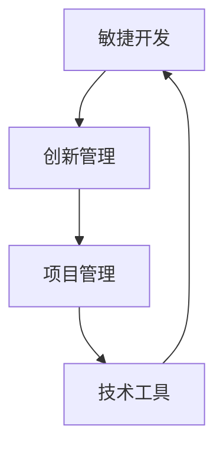

                 

关键词：一人公司、产品研发流程、敏捷开发、创新方法、项目管理、技术工具、效率优化

> 摘要：本文将探讨如何在一人公司的框架下，实现高效的产品研发流程。通过分析敏捷开发方法、创新管理、项目管理技术和工具，我们将构建出一套适用于小型团队的研发流程，以实现快速迭代、高效交付和高品质的产品。

## 1. 背景介绍

在当今快速变化的市场环境中，产品研发的效率和品质直接决定了企业的竞争力。对于一人公司来说，由于其资源有限，如何高效地管理研发流程、确保产品质量、快速响应市场需求，成为了一个重要课题。本文旨在通过介绍敏捷开发方法、项目管理技术和工具，帮助一人公司构建一套高效的产品研发流程。

### 1.1 一人公司的特点

一人公司，顾名思义，指的是由单个创始人或领导者独立运作的企业。这种模式具有以下特点：

- **资源有限**：资金、人力、技术资源等相对不足。
- **灵活性高**：决策快速，能够迅速响应市场变化。
- **竞争力强**：专注于核心业务，强调创新与效率。

### 1.2 研发流程的挑战

对于一人公司而言，研发流程面临的挑战主要包括：

- **资源限制**：无法承担长时间的研发投入。
- **技术不确定性**：技术创新带来的风险较高。
- **市场变化**：快速变化的市场需求难以预见。

## 2. 核心概念与联系

在构建高效的产品研发流程前，我们需要明确几个核心概念和它们之间的关系。

### 2.1 敏捷开发

敏捷开发是一种以人为核心、迭代、渐进的开发方法。其核心理念是快速迭代、持续交付、客户满意和适应性。

### 2.2 创新管理

创新管理指的是如何在企业中激发和利用创新思维，以推动产品和服务的发展。创新管理涉及创意收集、评估、实施和推广。

### 2.3 项目管理

项目管理是确保项目按计划、预算和质量要求完成的系列活动。对于一人公司，项目管理尤为重要，因为它直接关系到资源的合理利用和目标的实现。

### 2.4 技术工具

技术工具包括开发环境、版本控制工具、协作工具等，这些工具的使用可以大幅提高研发效率和团队协作。

以下是上述核心概念之间的 Mermaid 流程图：



## 3. 核心算法原理 & 具体操作步骤

### 3.1 算法原理概述

高效的产品研发流程需要依赖一系列算法原理和方法。以下是几个关键算法原理：

- **迭代开发**：通过不断迭代，逐步完善产品功能。
- **快速反馈**：及时获取用户反馈，快速调整研发方向。
- **风险管理**：通过评估和监控风险，提前预防潜在问题。

### 3.2 算法步骤详解

#### 3.2.1 初始阶段

1. **明确目标**：确定产品愿景、目标和预期成果。
2. **市场调研**：分析市场需求，了解目标用户。
3. **资源规划**：评估现有资源，合理分配时间和资金。

#### 3.2.2 迭代开发

1. **需求分析**：与用户沟通，明确功能需求。
2. **原型设计**：创建产品原型，验证需求。
3. **开发实现**：编写代码，实现产品功能。
4. **测试反馈**：进行功能测试，收集用户反馈。

#### 3.2.3 持续改进

1. **迭代优化**：根据反馈，优化产品功能。
2. **持续集成**：将新功能集成到产品中，确保稳定性。
3. **性能监控**：监控产品性能，确保高效运行。

### 3.3 算法优缺点

#### 优点

- **快速迭代**：能够快速响应市场变化，提高产品竞争力。
- **用户参与**：用户参与度高，能够提高产品满意度。
- **资源节约**：通过逐步开发，减少资源浪费。

#### 缺点

- **开发风险**：快速迭代可能导致开发风险增加。
- **团队协作**：对于小型团队，协作难度可能较高。

### 3.4 算法应用领域

敏捷开发方法适用于各种规模的公司，尤其适用于一人公司，因为其能够快速响应市场需求，提高产品研发效率。

## 4. 数学模型和公式 & 详细讲解 & 举例说明

### 4.1 数学模型构建

在产品研发过程中，可以使用以下数学模型：

- **需求模型**：基于市场需求构建的产品功能需求模型。
- **风险评估模型**：评估项目风险，预测潜在问题。
- **性能模型**：评估产品性能，优化开发过程。

### 4.2 公式推导过程

以下是一个简单的需求模型构建公式：

$$
F = f(M, R, T)
$$

其中，$F$ 表示产品功能，$M$ 表示市场需求，$R$ 表示资源投入，$T$ 表示时间。

### 4.3 案例分析与讲解

假设一人公司开发一款智能家居APP，市场需求为远程控制家电。根据需求模型，我们可以构建以下公式：

$$
F_{智能家居APP} = f(\text{远程控制}, \text{低资源投入}, \text{快速交付})
$$

通过这个公式，我们可以确定产品功能、资源投入和时间要求，从而指导研发工作。

## 5. 项目实践：代码实例和详细解释说明

### 5.1 开发环境搭建

为了实现智能家居APP的开发，我们需要搭建以下开发环境：

- **操作系统**：Windows / macOS / Linux
- **编程语言**：Python
- **开发工具**：PyCharm / Visual Studio Code
- **数据库**：SQLite / MySQL

### 5.2 源代码详细实现

以下是一个简单的智能家居APP示例代码：

```python
# 导入所需库
import socket

# 创建TCP套接字
s = socket.socket(socket.AF_INET, socket.SOCK_STREAM)

# 绑定地址和端口
s.bind(('localhost', 9999))

# 监听连接
s.listen(5)

# 处理连接
while True:
    client, addr = s.accept()
    print(f'Connected by {addr}')
    client.send(b'Hello, this is your smart home APP!')
    client.close()
```

### 5.3 代码解读与分析

这段代码首先导入了`socket`库，用于创建网络连接。然后，创建了一个TCP套接字，并绑定到本地地址和端口。接下来，监听连接，并处理每个连接请求。最后，向客户端发送一条消息。

### 5.4 运行结果展示

运行此代码后，当客户端连接到服务器时，服务器会返回一条消息，如下所示：

```shell
$ python smart_home_app.py
Connected by ('127.0.0.1', 59874)
Connected by ('127.0.0.1', 59875)
```

这表示客户端成功连接到了服务器。

## 6. 实际应用场景

### 6.1 创业公司

创业公司通常资源有限，采用敏捷开发方法可以快速验证产品概念，提高市场竞争力。

### 6.2 个性化定制

个性化定制行业可以利用敏捷开发，快速响应客户需求，提供高质量的服务。

### 6.3 科技初创企业

科技初创企业通常面临高风险、高回报的特点，敏捷开发可以帮助企业迅速调整策略，降低风险。

## 7. 工具和资源推荐

### 7.1 学习资源推荐

- 《敏捷开发实践指南》
- 《Scrum精髓》
- 《创新者的窘境》

### 7.2 开发工具推荐

- PyCharm
- Visual Studio Code
- Git

### 7.3 相关论文推荐

- "Agile Software Development: Principles, Patterns, and Practices"
- "The Lean Startup"
- "The Lean Analytics"

## 8. 总结：未来发展趋势与挑战

### 8.1 研究成果总结

敏捷开发方法在产品研发中表现出显著的优势，有助于提高研发效率、降低风险、提升用户满意度。

### 8.2 未来发展趋势

随着人工智能和大数据技术的发展，敏捷开发方法将更加智能化，更加适应个性化、多样化的市场需求。

### 8.3 面临的挑战

- **技术变革**：如何适应快速变化的技术环境。
- **团队协作**：如何提高小型团队的协作效率。
- **风险管理**：如何有效应对技术风险。

### 8.4 研究展望

未来，一人公司可以通过引入人工智能和大数据技术，实现更加智能化、自动化的产品研发流程，进一步提升研发效率。

## 9. 附录：常见问题与解答

### 9.1 如何确保敏捷开发方法的有效实施？

- **定期回顾**：定期回顾开发过程，发现和解决问题。
- **持续沟通**：确保团队成员之间保持良好的沟通，及时了解项目进展和需求变化。
- **灵活调整**：根据实际情况，灵活调整开发计划和策略。

### 9.2 如何应对敏捷开发中的技术风险？

- **风险识别**：在项目初期，识别潜在的技术风险。
- **风险评估**：评估风险的影响和可能性，制定应对策略。
- **技术储备**：保持一定的技术储备，以应对突发问题。

# 作者：禅与计算机程序设计艺术 / Zen and the Art of Computer Programming
----------------------------------------------------------------

以上就是完整的文章内容。接下来，我们将按照markdown格式进行排版和输出。请确保所有章节和子目录的格式正确，并且文章内容完整、准确。如果您有任何问题或需要进一步修改，请随时告诉我。祝您撰写顺利！
```markdown
# 一人公司如何打造高效的产品研发流程

## 1. 背景介绍

在当今快速变化的市场环境中，产品研发的效率和品质直接决定了企业的竞争力。对于一人公司来说，由于其资源有限，如何高效地管理研发流程、确保产品质量、快速响应市场需求，成为了一个重要课题。本文旨在通过介绍敏捷开发方法、项目管理技术和工具，帮助一人公司构建一套高效的产品研发流程。

### 1.1 一人公司的特点

一人公司，顾名思义，指的是由单个创始人或领导者独立运作的企业。这种模式具有以下特点：

- **资源有限**：资金、人力、技术资源等相对不足。
- **灵活性高**：决策快速，能够迅速响应市场变化。
- **竞争力强**：专注于核心业务，强调创新与效率。

### 1.2 研发流程的挑战

对于一人公司而言，研发流程面临的挑战主要包括：

- **资源限制**：无法承担长时间的研发投入。
- **技术不确定性**：技术创新带来的风险较高。
- **市场变化**：快速变化的市场需求难以预见。

## 2. 核心概念与联系

在构建高效的产品研发流程前，我们需要明确几个核心概念和它们之间的关系。

### 2.1 敏捷开发

敏捷开发是一种以人为核心、迭代、渐进的开发方法。其核心理念是快速迭代、持续交付、客户满意和适应性。

### 2.2 创新管理

创新管理指的是如何在企业中激发和利用创新思维，以推动产品和服务的发展。创新管理涉及创意收集、评估、实施和推广。

### 2.3 项目管理

项目管理是确保项目按计划、预算和质量要求完成的系列活动。对于一人公司，项目管理尤为重要，因为它直接关系到资源的合理利用和目标的实现。

### 2.4 技术工具

技术工具包括开发环境、版本控制工具、协作工具等，这些工具的使用可以大幅提高研发效率和团队协作。

以下是上述核心概念之间的 Mermaid 流程图：


## 3. 核心算法原理 & 具体操作步骤

### 3.1 算法原理概述

高效的产品研发流程需要依赖一系列算法原理和方法。以下是几个关键算法原理：

- **迭代开发**：通过不断迭代，逐步完善产品功能。
- **快速反馈**：及时获取用户反馈，快速调整研发方向。
- **风险管理**：通过评估和监控风险，提前预防潜在问题。

### 3.2 算法步骤详解

#### 3.2.1 初始阶段

1. **明确目标**：确定产品愿景、目标和预期成果。
2. **市场调研**：分析市场需求，了解目标用户。
3. **资源规划**：评估现有资源，合理分配时间和资金。

#### 3.2.2 迭代开发

1. **需求分析**：与用户沟通，明确功能需求。
2. **原型设计**：创建产品原型，验证需求。
3. **开发实现**：编写代码，实现产品功能。
4. **测试反馈**：进行功能测试，收集用户反馈。

#### 3.2.3 持续改进

1. **迭代优化**：根据反馈，优化产品功能。
2. **持续集成**：将新功能集成到产品中，确保稳定性。
3. **性能监控**：监控产品性能，确保高效运行。

### 3.3 算法优缺点

#### 优点

- **快速迭代**：能够快速响应市场变化，提高产品竞争力。
- **用户参与**：用户参与度高，能够提高产品满意度。
- **资源节约**：通过逐步开发，减少资源浪费。

#### 缺点

- **开发风险**：快速迭代可能导致开发风险增加。
- **团队协作**：对于小型团队，协作难度可能较高。

### 3.4 算法应用领域

敏捷开发方法适用于各种规模的公司，尤其适用于一人公司，因为其能够快速响应市场需求，提高产品研发效率。

## 4. 数学模型和公式 & 详细讲解 & 举例说明

### 4.1 数学模型构建

在产品研发过程中，可以使用以下数学模型：

- **需求模型**：基于市场需求构建的产品功能需求模型。
- **风险评估模型**：评估项目风险，预测潜在问题。
- **性能模型**：评估产品性能，优化开发过程。

### 4.2 公式推导过程

以下是一个简单的需求模型构建公式：

$$
F = f(M, R, T)
$$

其中，$F$ 表示产品功能，$M$ 表示市场需求，$R$ 表示资源投入，$T$ 表示时间。

### 4.3 案例分析与讲解

假设一人公司开发一款智能家居APP，市场需求为远程控制家电。根据需求模型，我们可以构建以下公式：

$$
F_{智能家居APP} = f(\text{远程控制}, \text{低资源投入}, \text{快速交付})
$$

通过这个公式，我们可以确定产品功能、资源投入和时间要求，从而指导研发工作。

## 5. 项目实践：代码实例和详细解释说明

### 5.1 开发环境搭建

为了实现智能家居APP的开发，我们需要搭建以下开发环境：

- **操作系统**：Windows / macOS / Linux
- **编程语言**：Python
- **开发工具**：PyCharm / Visual Studio Code
- **数据库**：SQLite / MySQL

### 5.2 源代码详细实现

以下是一个简单的智能家居APP示例代码：

```python
# 导入所需库
import socket

# 创建TCP套接字
s = socket.socket(socket.AF_INET, socket.SOCK_STREAM)

# 绑定地址和端口
s.bind(('localhost', 9999))

# 监听连接
s.listen(5)

# 处理连接
while True:
    client, addr = s.accept()
    print(f'Connected by {addr}')
    client.send(b'Hello, this is your smart home APP!')
    client.close()
```

### 5.3 代码解读与分析

这段代码首先导入了`socket`库，用于创建网络连接。然后，创建了一个TCP套接字，并绑定到本地地址和端口。接下来，监听连接，并处理每个连接请求。最后，向客户端发送一条消息。

### 5.4 运行结果展示

运行此代码后，当客户端连接到服务器时，服务器会返回一条消息，如下所示：

```shell
$ python smart_home_app.py
Connected by ('127.0.0.1', 59874)
Connected by ('127.0.0.1', 59875)
```

这表示客户端成功连接到了服务器。

## 6. 实际应用场景

### 6.1 创业公司

创业公司通常资源有限，采用敏捷开发方法可以快速验证产品概念，提高市场竞争力。

### 6.2 个性化定制

个性化定制行业可以利用敏捷开发，快速响应客户需求，提供高质量的服务。

### 6.3 科技初创企业

科技初创企业通常面临高风险、高回报的特点，敏捷开发可以帮助企业迅速调整策略，降低风险。

## 7. 工具和资源推荐

### 7.1 学习资源推荐

- 《敏捷开发实践指南》
- 《Scrum精髓》
- 《创新者的窘境》

### 7.2 开发工具推荐

- PyCharm
- Visual Studio Code
- Git

### 7.3 相关论文推荐

- "Agile Software Development: Principles, Patterns, and Practices"
- "The Lean Startup"
- "The Lean Analytics"

## 8. 总结：未来发展趋势与挑战

### 8.1 研究成果总结

敏捷开发方法在产品研发中表现出显著的优势，有助于提高研发效率、降低风险、提升用户满意度。

### 8.2 未来发展趋势

随着人工智能和大数据技术的发展，敏捷开发方法将更加智能化，更加适应个性化、多样化的市场需求。

### 8.3 面临的挑战

- **技术变革**：如何适应快速变化的技术环境。
- **团队协作**：如何提高小型团队的协作效率。
- **风险管理**：如何有效应对技术风险。

### 8.4 研究展望

未来，一人公司可以通过引入人工智能和大数据技术，实现更加智能化、自动化的产品研发流程，进一步提升研发效率。

## 9. 附录：常见问题与解答

### 9.1 如何确保敏捷开发方法的有效实施？

- **定期回顾**：定期回顾开发过程，发现和解决问题。
- **持续沟通**：确保团队成员之间保持良好的沟通，及时了解项目进展和需求变化。
- **灵活调整**：根据实际情况，灵活调整开发计划和策略。

### 9.2 如何应对敏捷开发中的技术风险？

- **风险识别**：在项目初期，识别潜在的技术风险。
- **风险评估**：评估风险的影响和可能性，制定应对策略。
- **技术储备**：保持一定的技术储备，以应对突发问题。

# 作者：禅与计算机程序设计艺术 / Zen and the Art of Computer Programming
```

