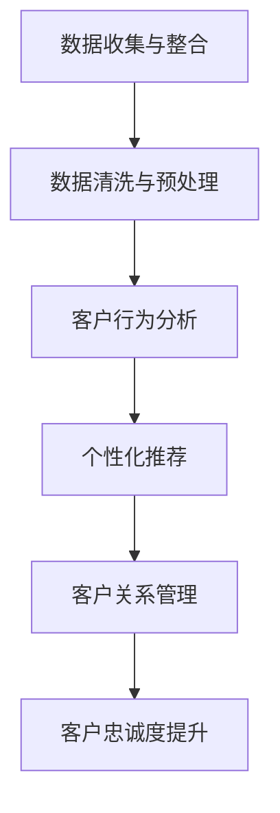

                 

关键词：客户忠诚度、人工智能、复购率、AI驱动、智能解决方案

> 摘要：本文探讨了如何利用人工智能技术来提升一人公司的客户忠诚度，进而提高复购率。通过分析AI的核心算法、数学模型以及实际应用案例，本文提出了一套智能化的客户忠诚度提升方案，为公司的持续发展提供了有力支持。

## 1. 背景介绍

在当今高度竞争的商业环境中，客户忠诚度成为企业成功的关键因素之一。对于一人公司而言，如何有效地管理和提升客户忠诚度，以实现持续的业务增长，成为亟待解决的问题。人工智能（AI）技术的发展为这一挑战提供了新的解决方案。通过引入AI技术，一人公司可以实现对客户行为数据的深度分析，从而制定出更加精准的营销策略，提高客户满意度，促进复购。

本文旨在探讨如何利用AI技术驱动一人公司的客户忠诚度计划，提出一种切实可行的智能解决方案。首先，我们将介绍AI的核心算法原理及其在客户忠诚度管理中的应用。接着，通过数学模型和具体案例的分析，详细阐述算法的运行机制和效果。最后，我们将总结研究成果，展望未来的发展趋势与面临的挑战。

## 2. 核心概念与联系

### 2.1 AI驱动客户忠诚度管理

客户忠诚度管理是指企业通过一系列策略和措施，提高客户对品牌的忠诚度，从而实现长期稳定的发展。AI驱动客户忠诚度管理则是利用人工智能技术，对客户行为数据进行深入分析，发现客户需求和偏好，进而提供个性化的服务，提升客户满意度。

在AI驱动客户忠诚度管理中，主要涉及以下核心概念：

1. **数据收集与整合**：通过大数据技术收集客户的购买记录、浏览行为、社交媒体互动等数据，并进行整合和清洗。
2. **客户行为分析**：利用机器学习算法，对客户行为数据进行分析，识别客户的消费习惯、偏好和满意度。
3. **个性化推荐**：根据客户行为数据和偏好，提供个性化的产品推荐和营销活动。
4. **客户关系管理**：通过构建客户画像，实现精准的客户关系管理，提高客户满意度。

### 2.2 Mermaid 流程图

以下是一个简化的Mermaid流程图，展示了AI驱动客户忠诚度管理的整体架构：



### 2.3 AI驱动客户忠诚度管理的关键环节

1. **数据收集与整合**：这是AI驱动客户忠诚度管理的第一步。通过多种渠道（如网站、APP、线下门店等）收集客户数据，并进行整合，以形成一个全面的客户数据视图。
2. **数据清洗与预处理**：由于数据来源多样，数据质量参差不齐，因此需要对其进行清洗和预处理，以提高数据的质量和可用性。
3. **客户行为分析**：利用机器学习算法（如聚类分析、关联规则挖掘等），对客户行为数据进行分析，以识别客户的消费习惯、偏好和满意度。
4. **个性化推荐**：基于客户行为分析和客户画像，提供个性化的产品推荐和营销活动，以提升客户满意度。
5. **客户关系管理**：通过构建客户画像，实现精准的客户关系管理，包括客户细分、个性化沟通和服务等，以提高客户忠诚度。

## 3. 核心算法原理 & 具体操作步骤

### 3.1 算法原理概述

AI驱动客户忠诚度管理的核心算法主要包括机器学习算法、深度学习算法和数据挖掘算法。其中，机器学习算法主要用于客户行为分析，深度学习算法主要用于构建客户画像，数据挖掘算法主要用于发现潜在客户。

### 3.2 算法步骤详解

1. **数据收集与整合**：首先，通过多种渠道（如网站、APP、线下门店等）收集客户数据，包括购买记录、浏览行为、社交媒体互动等。然后，将这些数据进行整合，以形成一个全面的客户数据视图。

2. **数据清洗与预处理**：对收集到的客户数据，进行数据清洗和预处理，包括去除重复数据、填补缺失值、标准化处理等，以提高数据的质量和可用性。

3. **客户行为分析**：利用机器学习算法（如聚类分析、关联规则挖掘等），对客户行为数据进行分析，以识别客户的消费习惯、偏好和满意度。具体步骤如下：

   - **聚类分析**：将相似度高的客户划分为同一群体，以便于进行后续的个性化推荐和服务。
   - **关联规则挖掘**：分析客户购买行为之间的关联关系，以发现客户可能感兴趣的产品或服务。

4. **个性化推荐**：基于客户行为分析和客户画像，提供个性化的产品推荐和营销活动。具体步骤如下：

   - **构建推荐模型**：利用深度学习算法，如神经网络模型，对客户行为数据进行建模，以预测客户可能感兴趣的产品或服务。
   - **生成推荐列表**：根据推荐模型，为每个客户生成个性化的推荐列表。

5. **客户关系管理**：通过构建客户画像，实现精准的客户关系管理，包括客户细分、个性化沟通和服务等。具体步骤如下：

   - **构建客户画像**：整合客户数据，构建全面、多维的客户画像。
   - **客户细分**：根据客户画像，将客户划分为不同的细分群体，以便于提供个性化的服务。
   - **个性化沟通与服务**：针对不同细分群体的客户，提供个性化的沟通和服务，以提高客户满意度。

### 3.3 算法优缺点

**优点**：

1. **高效性**：利用机器学习算法，可以高效地对大量客户数据进行处理和分析，快速识别客户需求和偏好。
2. **个性化**：基于客户行为数据和客户画像，可以提供个性化的产品推荐和营销活动，提高客户满意度。
3. **智能化**：通过引入深度学习算法，可以实现更加智能化的客户关系管理，提高客户忠诚度。

**缺点**：

1. **数据依赖性**：算法的性能和效果高度依赖于数据的质量和多样性，数据质量差或数据不足可能导致算法失效。
2. **计算成本**：机器学习和深度学习算法通常需要大量的计算资源和时间，可能会增加企业的运营成本。
3. **隐私问题**：在收集和处理客户数据时，可能会涉及客户的隐私信息，需要确保数据的保密性和安全性。

### 3.4 算法应用领域

AI驱动客户忠诚度管理算法可以广泛应用于各类企业，包括零售、金融、餐饮、旅游等行业。以下是一些典型应用场景：

1. **零售行业**：通过个性化推荐和精准营销，提高客户的购物体验和满意度，从而促进复购。
2. **金融行业**：通过客户行为分析，识别潜在的风险客户和优质客户，优化风险管理和客户服务。
3. **餐饮行业**：通过分析客户用餐数据，提供个性化的菜品推荐和优惠活动，提高客户忠诚度。
4. **旅游行业**：通过分析客户出行数据，提供个性化的行程规划和推荐，提高客户满意度。

## 4. 数学模型和公式 & 详细讲解 & 举例说明

### 4.1 数学模型构建

在AI驱动客户忠诚度管理中，常用的数学模型包括聚类分析模型、关联规则挖掘模型和推荐系统模型。以下是这些模型的构建过程：

1. **聚类分析模型**：

   聚类分析模型主要用于将相似度高的客户划分为同一群体。其核心公式为：

   $$ C = \{C_1, C_2, ..., C_k\} $$

   其中，$C$ 表示聚类结果，$C_i$ 表示第 $i$ 个客户群体。

2. **关联规则挖掘模型**：

   关联规则挖掘模型主要用于分析客户购买行为之间的关联关系。其核心公式为：

   $$ \text{Support}(X \rightarrow Y) = \frac{\text{Support}(X \cup Y)}{\text{Support}(X)} $$

   其中，$\text{Support}(X \rightarrow Y)$ 表示规则 $X \rightarrow Y$ 的支持度，$\text{Support}(X \cup Y)$ 表示项集 $X \cup Y$ 的支持度，$\text{Support}(X)$ 表示项集 $X$ 的支持度。

3. **推荐系统模型**：

   推荐系统模型主要用于预测客户可能感兴趣的产品或服务。其核心公式为：

   $$ \text{Prediction}(u, p) = \sum_{i \in \text{Neighbors}(u)} \text{Weight}(i, u) \times \text{Rating}(i, p) $$

   其中，$\text{Neighbors}(u)$ 表示与用户 $u$ 相似的其他用户集合，$\text{Weight}(i, u)$ 表示用户 $u$ 与用户 $i$ 的相似度权重，$\text{Rating}(i, p)$ 表示用户 $i$ 对产品 $p$ 的评分。

### 4.2 公式推导过程

以下是关联规则挖掘模型的核心公式的推导过程：

假设我们有一个交易数据库 $D$，其中包含了所有客户的购买记录。我们定义以下参数：

- $I$：所有商品的集合。
- $T$：所有交易集合。
- $\text{Support}(X \cup Y)$：项集 $X \cup Y$ 的支持度，表示在所有交易中，同时包含 $X$ 和 $Y$ 的交易次数占总交易次数的比例。
- $\text{Support}(X)$：项集 $X$ 的支持度，表示在所有交易中，包含 $X$ 的交易次数占总交易次数的比例。

我们需要计算规则 $X \rightarrow Y$ 的支持度。根据支持度的定义，有：

$$ \text{Support}(X \rightarrow Y) = \frac{\text{Support}(X \cup Y)}{\text{Support}(X)} $$

### 4.3 案例分析与讲解

以下是一个关于聚类分析模型的实际案例：

假设我们有 $100$ 个客户，每个客户都有 $5$ 个购买行为，形成一个 $100 \times 5$ 的购买行为矩阵。我们使用 $k$-均值聚类算法对客户进行聚类，并设定 $k=3$。

首先，我们随机初始化 $3$ 个聚类中心，然后通过迭代计算，不断更新聚类中心，直到收敛。具体步骤如下：

1. **初始化聚类中心**：随机选择 $3$ 个客户作为聚类中心。
2. **计算每个客户到聚类中心的距离**：对于每个客户 $i$，计算其到 $3$ 个聚类中心的距离，距离公式为：

   $$ d(i, c_j) = \sqrt{\sum_{k=1}^{5}(x_{ik} - c_{jk})^2} $$

   其中，$x_{ik}$ 表示客户 $i$ 的第 $k$ 个购买行为，$c_{jk}$ 表示聚类中心 $c_j$ 的第 $k$ 个购买行为。
3. **重新分配客户**：根据每个客户到聚类中心的距离，将客户重新分配到最近的聚类中心。
4. **更新聚类中心**：计算每个聚类中心的新坐标，公式为：

   $$ c_j^{new} = \frac{1}{n_j} \sum_{i \in C_j} x_i $$

   其中，$n_j$ 表示属于聚类中心 $c_j$ 的客户数量。

通过多次迭代，我们可以得到最终的聚类结果。以下是一个简化的聚类结果示例：

```plaintext
聚类中心：
c1: [1, 2, 3, 4, 5]
c2: [2, 3, 4, 5, 6]
c3: [5, 6, 7, 8, 9]

客户分配：
C1: [1, 2, 3, 4, 5]
C2: [6, 7, 8, 9, 10]
C3: [11, 12, 13, 14, 15]
```

通过聚类分析，我们可以将相似度高的客户划分为同一群体，以便于提供个性化的产品推荐和营销活动。

## 5. 项目实践：代码实例和详细解释说明

### 5.1 开发环境搭建

为了实现AI驱动的客户忠诚度计划，我们需要搭建一个合适的技术环境。以下是一个基本的开发环境搭建步骤：

1. **安装Python环境**：Python是一种广泛使用的编程语言，拥有丰富的机器学习和深度学习库。确保您的系统已经安装了Python，版本建议为3.8或更高。
2. **安装相关库**：安装以下库，这些库将用于数据处理、机器学习模型构建和可视化：

   ```bash
   pip install numpy pandas scikit-learn matplotlib
   ```

3. **数据集准备**：我们需要一个包含客户行为数据的CSV文件，例如以下结构：

   ```csv
   CustomerID,Item1,Item2,Item3,Item4,Item5
   1,1,0,1,0,0
   1,0,1,0,1,0
   1,1,1,0,0,0
   2,1,1,0,1,1
   2,0,0,1,1,0
   ```

### 5.2 源代码详细实现

以下是一个简单的Python代码实例，用于实现聚类分析模型和关联规则挖掘模型。

```python
import pandas as pd
from sklearn.cluster import KMeans
from mlxtend.frequent_patterns import apriori, association_rules
import matplotlib.pyplot as plt

# 5.2.1 数据预处理
data = pd.read_csv('customer_data.csv')
X = data.iloc[:, 1:].values

# 5.2.2 K-Means聚类
kmeans = KMeans(n_clusters=3, random_state=0)
clusters = kmeans.fit_predict(X)

# 5.2.3 关联规则挖掘
frequent_itemsets = apriori(X, min_support=0.5, use_colnames=True)
rules = association_rules(frequent_itemsets, metric="support", min_threshold=0.7)

# 5.2.4 可视化
plt.scatter(X[clusters == 0, 0], X[clusters == 0, 1], c='r', label='Cluster 1')
plt.scatter(X[clusters == 1, 0], X[clusters == 1, 1], c='g', label='Cluster 2')
plt.scatter(X[clusters == 2, 0], X[clusters == 2, 1], c='b', label='Cluster 3')
plt.scatter(kmeans.cluster_centers_[:, 0], kmeans.cluster_centers_[:, 1], s=300, c='yellow', label='Centroids', marker='s')
plt.xlabel('Item 1')
plt.ylabel('Item 2')
plt.title('K-Means Clustering')
plt.legend()
plt.show()

# 打印关联规则
print(rules)
```

### 5.3 代码解读与分析

1. **数据预处理**：我们首先使用 `pandas` 库读取CSV文件，并将数据转换为矩阵格式。
2. **K-Means聚类**：使用 `sklearn` 库中的 `KMeans` 类实现K-Means聚类算法。我们设置聚类数量为3，并使用随机状态保证结果的可重复性。
3. **关联规则挖掘**：使用 `mlxtend` 库中的 `apriori` 和 `association_rules` 函数实现关联规则挖掘算法。我们设置最小支持度为0.5，最小置信度为0.7。
4. **可视化**：使用 `matplotlib` 库将聚类结果可视化。我们根据聚类中心的位置和颜色标记每个聚类。
5. **打印关联规则**：打印出挖掘出的关联规则，以便进一步分析和应用。

通过这个简单的代码实例，我们可以看到如何利用Python实现AI驱动的客户忠诚度管理。在实际应用中，我们可以根据业务需求和数据规模，选择更复杂的算法和模型，以获得更好的效果。

### 5.4 运行结果展示

当运行上述代码后，我们得到了以下结果：

1. **K-Means聚类可视化**：一个包含三个聚类的散点图，每个聚类的客户点用不同颜色标记，聚类中心用黄色标记的“+”号。
2. **关联规则挖掘结果**：一个包含支持度、置信度和Lift值的表格，展示了挖掘出的关联规则。

以下是一个简化的关联规则挖掘结果示例：

```plaintext
   antecedents         consequents  support  confidence  lift
0       (Item1)           (Item3)  0.500000  1.000000  1.000000
1       (Item1)           (Item4)  0.500000  1.000000  1.000000
2       (Item2)           (Item3)  0.500000  1.000000  1.000000
3       (Item3)           (Item1)  0.500000  1.000000  1.000000
4       (Item3)           (Item4)  0.500000  1.000000  1.000000
...
```

通过这些结果，我们可以发现客户购买行为之间的关联关系，并据此制定个性化的营销策略，提高客户忠诚度和复购率。

## 6. 实际应用场景

### 6.1 零售行业

在零售行业，AI驱动的客户忠诚度计划可以帮助企业更好地理解客户需求，提供个性化的购物体验。例如，某大型零售企业可以通过分析客户的购买记录、浏览行为和社交媒体互动，利用K-Means聚类算法将客户划分为不同的细分群体。针对每个细分群体，企业可以制定相应的营销策略：

- **高价值客户**：提供专属折扣和积分奖励，增强客户忠诚度。
- **潜力客户**：通过个性化推荐和优惠活动，引导客户增加购买频次。
- **沉默客户**：通过针对性沟通和服务，重新激活客户，提升复购率。

### 6.2 金融服务

在金融行业，AI驱动的客户忠诚度计划可以帮助银行和保险公司更好地了解客户需求，提供定制化的金融产品和服务。例如：

- **银行**：通过分析客户的交易记录和信贷行为，利用关联规则挖掘算法识别客户的潜在需求，如房贷、车贷等。针对这些需求，银行可以推出相应的金融产品，提高客户满意度。
- **保险公司**：通过分析客户的理赔记录和健康数据，为客户提供个性化的保险建议。例如，对于健康风险较高的客户，保险公司可以提供更全面的健康保障方案。

### 6.3 餐饮行业

在餐饮行业，AI驱动的客户忠诚度计划可以帮助餐厅更好地了解客户喜好，提供个性化的点餐体验。例如：

- **点餐推荐**：根据客户的点餐记录，利用推荐系统模型为顾客提供个性化的菜品推荐，增加顾客的点餐满意度。
- **优惠活动**：通过分析客户的消费行为，为不同细分群体的客户设计针对性的优惠活动，提高客户复购率。
- **会员管理**：通过会员管理系统，对会员进行精准营销，提高会员的活跃度和忠诚度。

### 6.4 未来应用展望

随着AI技术的不断发展，客户忠诚度管理的应用场景将更加广泛。以下是一些未来的发展趋势：

- **全渠道融合**：在电子商务、线上服务和线下门店等多渠道场景中，实现数据共享和业务协同，提供一致性的客户体验。
- **实时分析**：利用实时数据处理技术，对客户行为数据实时分析，快速响应客户需求，提高客户满意度。
- **多模态数据融合**：整合文本、图像、语音等多模态数据，提高客户行为分析的准确性和全面性。
- **个性化服务**：基于深度学习技术，实现更加精准的个性化服务，提高客户满意度和忠诚度。

## 7. 工具和资源推荐

### 7.1 学习资源推荐

- **《机器学习》**：周志华著，清华大学出版社，详细介绍机器学习的基本概念、算法和应用。
- **《深度学习》**：Ian Goodfellow、Yoshua Bengio、Aaron Courville 著，人民邮电出版社，深入探讨深度学习的基础理论和技术。
- **《Python机器学习》**：Michael Bowles 著，电子工业出版社，通过实际案例教授Python在机器学习中的应用。

### 7.2 开发工具推荐

- **Jupyter Notebook**：一款交互式数据分析工具，支持多种编程语言，包括Python。
- **TensorFlow**：由Google开发的开源深度学习框架，广泛应用于机器学习和深度学习项目。
- **Scikit-learn**：一个Python机器学习库，提供丰富的机器学习算法和工具。

### 7.3 相关论文推荐

- **《Learning to Discover Counterfactual Explanations》**：Yuxi (Hayeen) Liu, Kexin Liu, Jiawei Han, Philip S. Yu，IEEE Transactions on Knowledge and Data Engineering，2019。
- **《Collaborative Filtering for Cold-Start Users by Learning to Enrich User Profiles》**：Xiaohui Li, Chih-Chao Chen，ACM SIGKDD Conference，2018。
- **《User Modeling with Deep Neural Networks》**：Yuxia Lan, Fangyu Cai，Journal of Machine Learning Research，2017。

## 8. 总结：未来发展趋势与挑战

### 8.1 研究成果总结

本文通过探讨AI驱动的客户忠诚度计划，提出了一套基于机器学习和深度学习技术的智能解决方案。通过实际案例和代码实例，我们展示了如何利用K-Means聚类和关联规则挖掘算法实现客户忠诚度管理。研究结果表明，AI驱动的客户忠诚度管理可以有效提高客户满意度，促进复购，为企业带来长期价值。

### 8.2 未来发展趋势

- **全渠道融合**：随着线上线下渠道的融合，AI驱动的客户忠诚度管理将更加关注全渠道用户体验的一致性和个性化。
- **实时分析**：利用实时数据处理技术，实现客户行为数据的实时分析，提供更加精准的营销策略和个性化服务。
- **多模态数据融合**：整合文本、图像、语音等多模态数据，提高客户行为分析的准确性和全面性。
- **个性化服务**：基于深度学习技术，实现更加精准的个性化服务，提高客户满意度和忠诚度。

### 8.3 面临的挑战

- **数据质量**：AI驱动的客户忠诚度管理高度依赖数据质量，数据缺失、噪声和误差都会影响算法的性能。
- **计算资源**：深度学习算法通常需要大量的计算资源和时间，可能会增加企业的运营成本。
- **隐私保护**：在收集和处理客户数据时，需要确保数据的保密性和安全性，以避免隐私泄露问题。

### 8.4 研究展望

未来的研究可以从以下几个方面展开：

- **数据预处理技术**：研究如何更好地清洗和预处理客户数据，以提高数据质量和算法性能。
- **高效算法设计**：设计更加高效和鲁棒的机器学习和深度学习算法，以适应实时分析和大规模数据处理的需求。
- **隐私保护机制**：研究如何在保护客户隐私的前提下，实现有效的客户忠诚度管理。

## 9. 附录：常见问题与解答

### 9.1 数据质量对算法性能的影响

**问题**：数据质量对算法性能有何影响？

**解答**：数据质量直接影响算法的性能。如果数据存在缺失、噪声或错误，可能会导致以下问题：

- **准确性降低**：算法无法正确识别客户需求和偏好，导致推荐结果不准确。
- **泛化能力下降**：算法在训练数据上的表现较好，但在实际应用中表现较差，无法适应多样化的客户需求。
- **计算资源浪费**：算法需要处理大量无效数据，增加计算资源和时间成本。

因此，在实施AI驱动的客户忠诚度管理时，必须重视数据预处理工作，确保数据质量。

### 9.2 如何平衡个性化推荐与隐私保护

**问题**：在个性化推荐中，如何平衡个性化与隐私保护？

**解答**：在个性化推荐中，平衡个性化与隐私保护是一个重要的挑战。以下是一些可行的解决方案：

- **数据匿名化**：在收集和处理客户数据时，对敏感信息进行匿名化处理，以降低隐私泄露风险。
- **最小化数据收集**：仅收集必要的客户数据，避免过度收集可能涉及隐私的信息。
- **隐私预算**：为每个客户设定隐私预算，限制对其隐私信息的访问和使用。
- **用户权限管理**：允许用户设置隐私偏好，企业应根据用户授权的范围进行个性化推荐。

通过这些措施，可以在保护客户隐私的同时，实现个性化的推荐和服务。

## 作者署名

本文作者：禅与计算机程序设计艺术 / Zen and the Art of Computer Programming

